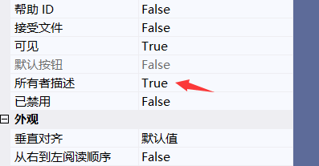

# 前言


**唯一一个必须重写的 CWinApp 成员函数是 InitInstance。**


# 自定义控件

在MFC应用程序中自定义按钮样式涉及到从`CButton`类派生一个新的类，并重写相关的消息处理函数以实现自定义的绘制逻辑。下面是一个基本的步骤指南和示例，展示如何创建一个具有自定义样式的按钮：

## 步骤 1：创建自定义按钮类

1. **创建一个新的类**：在你的MFC项目中，派生一个新类，比如命名为`CMyButton`，从`CButton`基类继承。

2. **添加消息映射**：在你的类声明中，使用`DECLARE_MESSAGE_MAP()`宏，并在cpp文件中添加`BEGIN_MESSAGE_MAP`和`END_MESSAGE_MAP`宏来映射你想要处理的消息。

3. **重写`DrawItem`方法**：`DrawItem`是`CButton`中的一个虚函数，用于绘制按钮的外观。你需要在你的类中重写这个函数来实现自定义绘制逻辑。

### 示例代码

以下是一个简化的自定义按钮类的示例，展示了如何重写`DrawItem`方法来改变按钮的样式：

```cpp
// MyButton.h
#pragma once

#include <afxwin.h>         // MFC core and standard components

class CMyButton : public CButton
{
    DECLARE_DYNAMIC(CMyButton)

public:
    CMyButton() {}
    virtual ~CMyButton() {}

protected:
    virtual void DrawItem(LPDRAWITEMSTRUCT lpDrawItemStruct);

    DECLARE_MESSAGE_MAP()
};

```


```cpp
// MyButton.cpp
#include "MyButton.h"

IMPLEMENT_DYNAMIC(CMyButton, CButton)

BEGIN_MESSAGE_MAP(CMyButton, CButton)
    // 在这里可以添加其他消息处理器
END_MESSAGE_MAP()

void CMyButton::DrawItem(LPDRAWITEMSTRUCT lpDrawItemStruct)
{
    CDC dc;
    dc.Attach(lpDrawItemStruct->hDC); // 绑定设备上下文

    // 使用lpDrawItemStruct->rcItem获取按钮的矩形区域
    RECT rc = lpDrawItemStruct->rcItem;

    // 设置按钮背景和文本颜色
    dc.FillSolidRect(&rc, RGB(255, 0, 0)); // 用红色填充按钮背景
    dc.SetTextColor(RGB(255, 255, 255)); // 设置文本为白色

    // 绘制按钮文本
    CString strText;
    GetWindowText(strText); // 获取按钮上的文本
    dc.DrawText(strText, &rc, DT_CENTER | DT_VCENTER | DT_SINGLELINE);

    dc.Detach(); // 解除设备上下文的绑定
}
```


## 步骤 2：在对话框中使用自定义按钮

### 方式一

1. **在对话框的头文件中声明自定义按钮类的对象**。

2. **在资源编辑器中为按钮分配一个控件ID**（如果还没有）。

3. **在对话框类的`OnInitDialog`函数或相应初始化位置，使用`SubclassDlgItem`函数将ID与自定义按钮控件关联起来**。

```cpp
// 假设控件ID是IDC_MY_CUSTOM_BUTTON，并且已经添加了CMyButton m_MyCustomButton成员变量
BOOL CMyDialog::OnInitDialog()
{
    CDialogEx::OnInitDialog();

    // 将按钮控件子类化
    m_MyCustomButton.SubclassDlgItem(IDC_MY_CUSTOM_BUTTON, this);

    return TRUE;  // return TRUE  unless you set the focus to a control
}
```

### 方式二

直接通过绑定变量

```cpp
void CMyDialog::DoDataExchange(CDataExchange* pDX)
{
	CDialogEx::DoDataExchange(pDX);
	DDX_Control(pDX, IDC_BUTTON1, loginBtn);
}
```

> 注意不要同时使用方式1和方式二

## 步骤三: 开启所有者绘制




通过这些步骤，你可以实现具有自定义样式的按钮，包括背景色、文本颜色、甚至是更复杂的绘制逻辑，如渐变背景、图标等。


# 菜单栏

### 通过设置对话框直接添加菜单栏


