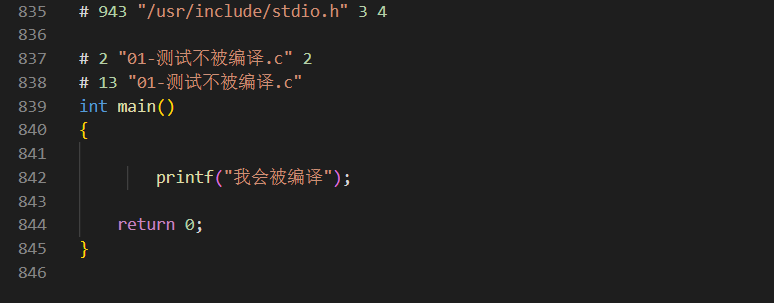

# 前言fds

两年前学的c语言,好久没用了, 忘得差不多了, 现在重新学习一下,用博客记录下来,常回来复习复习


# 预处理器

## 定义

在C语言中，预处理器（preprocessor）是一个在**编译阶段前执行的程序**，它可以对源代码做一些预处理工作。预处理器通过预处理指令（preprocessor directives）来完成这些工作，预处理指令都以`#`符号开头。

以下是一些常见的预处理指令：

1. **#include**：这个指令用于包含头文件。例如，`#include <stdio.h>`会在当前源代码文件中插入stdio.h头文件的内容。这样，我们就可以使用在stdio.h中声明的函数和宏了。

2. **#define**：这个指令用于定义宏。**宏可以看作是一个文本替换工具**，预处理器会在编译前将所有宏替换为其定义的内容。例如，`#define PI 3.14`定义了一个宏PI，预处理器会把源代码中所有的PI替换为3.14。

3. **#undef**：这个指令用于取消已定义的宏。例如，`#undef PI`会取消PI宏的定义，之后的代码就不能使用PI宏了。

4. **#if, #else, #elif, #endif**：这些指令用于条件编译。预处理器会根据条件来决定是否编译某段代码。例如：

   ```c
   #define DEBUG 1
   ...
   #if DEBUG
   printf("Debug information...\n");
   #endif
   ```

   如果DEBUG被定义为1，那么printf语句会被编译和执行。如果DEBUG被定义为0，那么printf语句会被忽略。

5. **#ifdef, #ifndef**：这些指令也用于条件编译，但它们检查的是某个宏是否已被定义。例如，`#ifdef DEBUG`会检查DEBUG宏是否已定义，如果已定义，就编译随后的代码。

预处理器还有一些其他的功能，如错误处理、源文件包含等。预处理器的作用虽然不如编译器和链接器显著，**但它在处理源代码、改善代码复用性、模块化等方面起着重要作用。**

## 功能

预处理器的主要功能包括：

1. **文件包含（Inclusion of Files）**：预处理器通过`#include`指令包含头文件。这使得程序员可以将程序的各个部分分开在不同的文件中编写，并通过这个功能将他们链接在一起。
2. **宏替换（Macro Replacement）**：预处理器通过`#define`指令定义宏，然后在程序中替换这些宏。这是一种非常有效的方式来定义程序中要使用的常量。**这个东西非常好用,很多框架也在用, 这个能帮我们少写很多代码, 所以看起来他就是个文本替换工具**
3. **条件编译（Conditional Compilation）**：预处理器通过`#if`，`#elif`，`#else`和`#endif`等指令进行条件编译。这使得程序员可以根据特定的条件选择性地编译代码的一部分。
4. **编译错误和警告的处理**：预处理器可以通过`#error`和`#warning`指令来发出编译错误和警告。这对于程序调试非常有用。
5. **行控制（Line Control）**：预处理器通过`#line`指令来控制`__LINE__`和`__FILE__`这两个内置宏的值。这使得程序员可以控制在错误报告中显示的行号和文件名。
6. **定义判断**：预处理器通过`#ifdef`，`#ifndef`和`#undef`指令来判断一个宏是否已经定义，并据此决定是否编译某部分代码。

通过以上功能，预处理器为C语言提供了丰富的编程灵活性，有助于模块化编程，提高代码复用性，使得源代码更易于阅读和维护。

举个例子吧

```c
#include <stdio.h>

#ifdef __AAA_AAA_
你好啊, 我不会被编译
#endif

#if _AAA_AAA_
我也不会被编译
#endif

// ifdef 和 if的区别在于  if是检查后面这个东西有没有被定义和它的值是不是真,  而infdef是看后面这个东西有没有被定义
int main()
{
    #if 1
        printf("我会被编译");
    #endif
    return 0;
}
```

使用gcc预编译一下可以发现确实如此



## #define

这个东西太好用了,以至于要单独拿一个部分出来总结

`#define`是C语言预处理器中的一个非常有用的指令，主要用于定义宏（macros）。它可以有两种基本形式：对象式宏（object-like macros）和函数式宏（function-like macros）。

1. **对象式宏**：这是最简单的宏定义形式，它将一个名称定义为一个特定的值。例如：

    ```c
    #define PI 3.14159
    ```
   在这个例子中，PI就被定义为3.14159。在预处理阶段，预处理器会将代码中所有的PI替换为3.14159。

2. **函数式宏**：函数式宏可以带有参数，看起来更像一个函数。例如：

    ```c
    #define SQUARE(X) ((X) * (X))
    ```
   在这个例子中，SQUARE就被定义为一个计算其参数平方的宏。使用SQUARE(2)会被预处理器替换为((2) * (2))，结果是4。

这些宏在预处理阶段就已经展开并替换，**所以它们不会像函数那样带来调用的开销**。但是，过度使用宏可能会导致代码难以阅读和理解，因为宏只是简单的文本替换，不会进行类型检查。


### 高级方法

#### 定义for循环

这个是不可以很好减少我们写for循环?

```c
#define FI(n) for(int i = 0; i < n; i++)
#define FJ(n) for(int j = 0; j < n; j++)
```

#### 定义多行宏

有时候把后面的东西写在一行有点难受,我们可以用\换行, 但是在代码中还是一行

```c
#define F(n1,n2) for(int i = 0; i < n1; i++) \
 for (int j = 0; j < n2; j++) \
```


#### 参数类型宏

**宏的参数可以出现类型**(其实也就是字符串替换), 因此我们是不是可弄一个好用的malloc

```c
#define MALLOC(n, type) (type*)malloc(n * sizeof(type))

int* nums = MALLOC(10, int);
```


#### \# \#\# 

在用#define 定义时 , 斜杠("\\")是用来续行的，"#"将**参数字符串化**。"##"则用来**连接前后两个参数** 

```c
#define toString(str)  #str
#define test(str) #str"test"
#define CONCATENATE(a, b) a ## b

int CONCATENATE(num, 1) = 10;  // 创建一个变量 num1   替换后就是 int num1 = 10
print("%s",toString(123));  //很方便的将一个数字变成字符串,但是要注意,这里填变量也会变成字符串
print("%s",toString(num1));  //这里输出就是 num1这个字符串
```


在使用`#define`时，你应当注意到一些常见的问题。首先，因为预处理器只是进行文本替换，所以可能会出现预期外的效果。例如，**函数宏中的参数如果不用括号包围，可能会因为运算符优先级的问题导致错误**。其次，过度使用宏可能会使代码变得难以理解和维护。尽管宏可以提供强大的功能，但应当谨慎使用。

注意点:

* 宏不能递归 \#define func(a, b)  func(a,b)  比如这个, 宏只会替换一次,  但是宏可以嵌套
* **宏的参数可以出现类型，但是函数做不到**
* 参数的副作用  比如 a++ 这种就尽量不要成为宏的参数
* 宏产生的代码是不能调试的

**最后请记住宏就是个文本工具, 它肯定是不知道我们变量的值是什么的**

# **数据类型**

## 定义

C语言中的数据类型是用于声明变量或函数的关键部分。一个数据类型定义了一种数据的范围和特性。C语言主要有以下几种数据类型：

1. **基本数据类型**：C语言有四种基本数据类型：
   - **整型(int)**：用于表示无小数的数，包括正整数、负整数和0。还有短整型（short）、长整型（long）和长长整型（long long）等更具体的类型。
   - **浮点型(float)**：用于表示有小数的数，例如3.14、0.1234等。
   - **双精度浮点型(double)**：比浮点型具有更高的精度，适用于需要极高精度的计算。
   - **字符型(char)**：用于表示单个字符。(**无符号数**)

2. **派生数据类型**：由基本数据类型派生出的数据类型，包括：
   - **数组(Array)**：存储相同类型数据的有序集合。
   - **指针(Pointer)**：指针类型是一种特殊的数据类型，它存储的是其他数据类型的内存地址。
   - **结构体(struct)**：结构体是一种聚合数据类型，可以包含不同类型的数据。
   - **联合体(union)**：联合体是一种特殊的数据类型，它允许在相同的内存位置存储不同的数据类型。它只能存储一种类型的数据，但可以是任意类型。
   - **枚举(enum)**：枚举是一种用户自定义的数据类型，它允许你将一组整数值赋予有意义的名字，以提高程序的可读性。

3. **void类型**：void类型表示没有值。这是一种特殊的数据类型，**通常用于定义无返回值的函数和没有参数，或者空指针, 或者任何类型**。

**每种数据类型都有其特定的取值范围和存储需求，这些都依赖于你所使用的系统和编译器**。

C语言还允许定义自己的数据类型，通常通过typedef关键字实现。例如，可以通过typedef创建一个新的数据类型名，然后使用这个新的数据类型名来定义变量。

在编写程序时，选择适当的数据类型非常重要，因为它会影响数据如何被存储在内存中，以及如何使用这些数据。

## 常用数值范围宏

在C语言中，可以通过在<limits.h>和<float.h>这两个头文件中定义的一些宏来获取各种数据类型的最大值和最小值。这些值可能会因编译器或平台的不同而有所不同，但通常符合特定的标准。

以下是一些常见数据类型的最大值和最小值的宏：

1. **整数类型（包括short、int、long、long long）**：可以通过以下宏来获取：
   - `INT_MIN` / `INT_MAX`：int类型的最小值和最大值。
   - `LONG_MIN` / `LONG_MAX`：long类型的最小值和最大值。
   - `SHORT_MIN` / `SHORT_MAX`：short类型的最小值和最大值。
   - `LLONG_MIN` / `LLONG_MAX`：long long类型的最小值和最大值。
2. **字符类型（char）**：
   - `CHAR_MIN` / `CHAR_MAX`：char类型的最小值和最大值。
3. **浮点类型和双精度浮点类型（float、double）**：可以通过以下宏来获取：
   - `FLT_MIN` / `FLT_MAX`：float类型的最小正值和最大正值。
   - `DBL_MIN` / `DBL_MAX`：double类型的最小正值和最大正值。

在使用这些宏之前，需要包含对应的头文件，例如：

```c
#include <limits.h>
#include <float.h>
```

## 常量

在 C 语言中，常量（constants）是固定值，它们在程序运行过程中不能被修改。常量可以是任何基本数据类型，例如整数常量、浮点常量、字符常量，还有字符串字面量等。常量必须在定义的时候就初始化好, 不然会报错


## 类型转换

在C语言中，类型转换用于将一种数据类型转换为另一种。类型转换有两种基本形式：隐式类型转换（也称为自动类型转换）和显式类型转换（也称为强制类型转换或类型强制转换）。

1. **隐式类型转换**：当我们进行不同数据类型的混合运算时，编译器会自动进行类型转换。这种类型转换是隐式的，即程序员无需明确指定。在这种情况下，较小的数据类型会被转换为较大的数据类型。例如，如果你将一个`int`类型和一个`double`类型的值进行加法运算，`int`值会被自动转换为`double`类型，然后进行运算。

2. **显式类型转换**：有时候，我们需要手动进行类型转换，这称为显式类型转换，或者称为强制类型转换。在C语言中，可以通过将目标类型放在括号中，并放在要转换的变量或表达式前面来实现。例如，如果你想将`double`类型的变量转换为`int`类型，可以这样做：`int x = (int) y;`，其中`y`是一个`double`类型的变量。

值得注意的是，类型转换可能会引起数据丢失或溢出。例如，如果你将一个`double`类型的值强制转换为`int`类型，小数部分将会被丢弃。如果你将一个超过`int`范围的`long`类型的值强制转换为`int`类型，可能会导致数据溢出。

最后，C语言还有一种特殊的类型转换，叫做类型提升。当较小的整数类型（如`char`或`short`）用作算术表达式的一部分时，它们会被提升为较大的整数类型（通常是`int`）。这是C语言为了运算效率和结果精度做的一种优化。

# 存储类别说明符

`static`, `extern`, 和 `const` 在 C 语言中被称为存储类别说明符（Storage Class Specifiers）。它们用于指定变量、函数或声明的范围（可见性）、生命周期、以及是否可以被修改。

让我们来看一下这些存储类别说明符的意义：

1. **static**：在变量和函数前使用 `static` 关键字，**会使得它们的作用域局限于声明它们的源文件内, 跨.cpp和.c文件是无法共享和使用的**。对于局部变量，`static` 也改变了它们的生命周期，使得它们在程序的整个运行期间都存在，而不仅仅是在声明它们的函数或代码块执行时存在。

2. **extern**：`extern` 关键字用于声明一个变量或函数在别的源文件中已经被定义。这样，这个变量或函数就可以在其他文件中被使用，即使它是在另一个源文件中定义的。

3. **const**：`const` 关键字用于指定一个变量的值不能被修改（即，这个变量是只读的）。这对于防止无意的修改非常有用，也可以让编译器进行一些优化。

除了这三个关键字，C 语言中还有其他的存储类别说明符，如 `auto` 和 `register`。不过，`auto` 是默认的，不常显式地用在代码中，`register` 关键字的作用在现代编译器中已经基本被忽视。

## static

在 C 语言中，`static`关键字有几个不同的用途，具体取决于它的使用环境：

1. **静态局部变量**

    当 `static` 关键字用于函数内部的变量时，它改变了该变量的存储期。通常情况下，函数内的局部变量在函数被调用时创建，函数返回时销毁。但如果局部变量被声明为 `static`，则其生命周期在程序运行时始终存在。这意味着，当函数被多次调用时，静态局部变量的值在调用之间保持不变。

    ```c
    void foo() {
        static int count = 0;
        count++;
        printf("%d\n", count);
    }
    ```
   这个例子中，`count` 变量每次调用 `foo` 函数时都会增加。但是你在外界是无法访问的

2. **静态全局变量**

    如果 `static` 关键字用于函数外部的变量，它限制了该变量的链接作用域（linkage）到定义它的文件。换句话说，`static` 全局变量只能在定义它的源文件中访问，其他源文件不能访问。

    ```c
    // file1.c
    static int count = 0;  // This variable is only accessible within file1.c
    ```

3. **静态函数**

    和静态全局变量类似，`static` 也可以用于函数，**使得函数只能在定义它的源文件中访问。**

    ```c
    // file1.c
    static void foo() {  // This function is only accessible within file1.c
        // ...
    }
    ```

`static` 关键字使你能够控制变量和函数的可见性，从而更好地封装代码。此外，静态局部变量还允许你保持在函数调用之间保持状态，而不必使用全局变量。

## extern

在 C 语言中，`extern` 关键字主要用于以下两种场景：

1. **声明全局变量**：如果一个全局变量在一个源文件中被定义，并且你想在另一个源文件中使用这个全局变量，那么你需要在那个源文件中用 `extern` 关键字声明这个变量。

    ```c
    // File1.c
    int globalVar = 10;

    // File2.c
    extern int globalVar; // Now, globalVar can be used in File2.c
    ```

   在这个例子中，`globalVar` 在 File1.c 中被定义，并在 File2.c 中通过 `extern` 关键字被声明，所以它可以在 File2.c 中使用。

2. **声明函数**：如果一个函数在一个源文件中被定义，并且你想在另一个源文件中调用这个函数，那么你需要在那个源文件中用 `extern` 关键字声明这个函数。然而，在实际使用中，**函数默认就是** `extern` 的，所以一般省略不写 `extern`。通常，在头文件中声明函数，然后在源文件中包含这个头文件，就可以在源文件中调用这个函数。

    ```c
    // File1.c
    void func() { /* ... */ }
    
    // File1.h
    void func(); // `extern` is implicit
    
    // File2.c
    #include "File1.h" // Now, func() can be called in File2.c
    ```

在这个例子中，`func` 在 File1.c 中被定义，并在 File1.h 中被声明（这里 `extern` 是隐含的），所以它可以在 File2.c 中被调用。

总的来说，`extern` 关键字用于声明在其他地方定义的全局变量或函数。这提供了一种在多个源文件间共享变量和函数的方式。


# 运算符

以下是C语言运算符的优先级和结合性的一个总结。优先级从高到低排列：

| 优先级 | 运算符                                                  | 描述                                                       | 结合性   |
| ------ | ------------------------------------------------------- | ---------------------------------------------------------- | -------- |
| 1      | `()` `[]` `->` `.` `++` `--`                            | 函数调用、数组下标、指针运算、成员访问、自增自减           | 从左到右 |
| 2      | `!` `~` `+` `-` `*` `&` `(类型名){列表}` `sizeof`       | 逻辑非、按位非、一元加减、解引用、取地址、复合字面量、大小 | 从右到左 |
| 3      | `*` `/` `%`                                             | 乘法、除法、取模                                           | 从左到右 |
| 4      | `+` `-`                                                 | 加法、减法                                                 | 从左到右 |
| 5      | `<<` `>>`                                               | 左移、右移                                                 | 从左到右 |
| 6      | `<` `<=` `>` `>=`                                       | 小于、小于等于、大于、大于等于                             | 从左到右 |
| 7      | `==` `!=`                                               | 等于、不等于                                               | 从左到右 |
| 8      | `&`                                                     | 按位与                                                     | 从左到右 |
| 9      | `^`                                                     | 按位异或                                                   | 从左到右 |
| 10     | `|`                                                     | 按位或                                                     | 从左到右 |
| 11     | `&&`                                                    | 逻辑与                                                     | 从左到右 |
| 12     | `||`                                                    | 逻辑或                                                     | 从左到右 |
| 13     | `?:`                                                    | 条件运算符                                                 | 从右到左 |
| 14     | `=` `+=` `-=` `*=` `/=` `%=` `&=` `^=` `|=` `<<=` `>>=` | 赋值运算符                                                 | 从右到左 |
| 15     | `,`                                                     | 逗号运算符                                                 | 从左到右 |

请注意，虽然这个表格提供了一种方便的方式来记忆运算符的优先级和结合性，但在实践中，为了避免可能的混淆和错误，最好尽可能地使用括号来明确表达你的意图。


运算符在编程中使用频繁，有一些重要的细节需要注意。以下是一些常见的C语言运算符相关的注意点：

1. **短路行为**：逻辑运算符 `&&`（逻辑与）和 `||`（逻辑或）有所谓的"短路"行为。如果 `&&` 运算符的左操作数为 `false`，则不会计算右操作数，因为整个表达式的结果已经可以确定为 `false`。同理，如果 `||` 运算符的左操作数为 `true`，则不会计算右操作数，因为整个表达式的结果已经可以确定为 `true`。这种行为可能会影响到代码的执行流程，特别是当操作数有副作用（如修改变量或执行函数）时。

2. **优先级和结合性**：C语言中的运算符优先级和结合性经常引起混淆。比如，`&&` 的优先级比 `||` 高，这意味着 `a || b && c` 等同于 `a || (b && c)`，而非 `(a || b) && c`。使用括号可以让代码更清晰，更易于理解。

3. **自增和自减**：`++`（自增）和 `--`（自减）运算符有前缀和后缀两种形式，它们的行为有所不同。前缀形式（如 `++i`）先改变变量的值，然后返回改变后的值；后缀形式（如 `i++`）先返回变量当前的值，然后改变变量的值。在表达式中使用自增或自减运算符时要特别注意。

4. **赋值运算符**：赋值运算符 `=` 会返回一个值，这个值就是被赋值的值。这意味着你可以在一个表达式中进行多重赋值，如 `a = b = c = 0;`，它会从右到左执行，首先把 `c` 设置为 `0`，然后把 `b` 设置为 `c` 的值（也就是 `0`），最后把 `a` 设置为 `b` 的值（也就是 `0`）。

5. **除法运算符**：在整数除法中，如果除数和被除数有一个是负数，结果如何取整是由具体的实现定义的。例如，`-5 / 2` 的结果可能是 `-2` 或 `-3`，这取决于你的编译器。为了避免这种模糊性，最好始终确保除数和被除数都是正数，或者使用浮点除法。

这里讲一下我以前一直疑惑的点,  看一下下面这段代码

```c
#include<stdio.h>

int func(int i,char ch){
    printf("i = %d, ch = %c\n", i, ch);
    return i;
}

int main(){

    int ans = func(0, 'A') || func(1, 'B') && func(2, 'C');
    printf("%d", ans);
}

// 输出如下
// i = 0, ch = A
// i = 1, ch = B
// i = 2, ch = C
```

我以前的理解就是人的思维方式  既然&&优先级高 我就应该先过来计算&&的两个式子,  所以应该要先输出B,C这两个,  可是计算机内部可不是这样处理的,  **我们可以简单的理解为按照顺序将中缀表达式变成后缀表达式, 并且中间这些式子比如函数啊, 都计算好了**


# 数组

在 C 语言中，数组是一个存储相同数据类型元素的固定大小连续内存块。以下是关于 C 语言中数组的基本总结：

1. **数组声明和初始化**：在 C 语言中，可以在声明数组的同时进行初始化。例如，`int arr[5] = {1, 2, 3, 4, 5};` 声明了一个名为 arr 的整型数组，大小为 5，同时给它赋予了一组初始值。

   如果没有初始化，数组的元素将默认为零（对于全局和静态数组）或**垃圾值**（对于局部数组）。

   数组的大小必须是一个常量表达式。

2. **数组访问**：可以通过索引访问数组元素。索引是在方括号中指定的整数，例如 `arr[0]` 访问的是数组的第一个元素。

   注意，C 语言的数组索引是从 0 开始的。也就是说，对于一个大小为 n 的数组，合法的索引范围是 0 到 n-1。

3. **数组长度**：C 语言没有内置的方式来获取数组的长度。一种常见的技巧是使用 `sizeof(arr) / sizeof(arr[0])` 来计算数组的长度。

4. **多维数组**：C 语言支持多维数组。例如，`int matrix[3][4];` 声明了一个 3x4 的整型二维数组。

5. **数组作为函数参数**：当数组作为函数参数时，实际上传递的是数组的引用（或者说是数组的指针），而不是数组本身。因此，函数可以修改数组的内容，但不能获取数组的长度（除非额外提供长度信息）。

6. **字符数组和字符串**：字符数组经常被用来存储 C 风格的字符串。C 风格的字符串是字符数组的一种特殊用法，字符串以 '\0' 字符结束。

总的来说，数组是 C 语言中最基本的数据结构之一，用于存储和操作大量的相同类型的数据。

# 控制结构

在 C 语言中，控制流语句决定了程序的执行路径。以下是一些基本的控制流语句的总结：

1. **if 语句**：它用于根据条件判断是否执行某个代码块。形式如下：

   ```c
   if (condition)
   {
       // 代码块在 condition 为 true 时执行
   }
   else
   {
       // 代码块在 condition 为 false 时执行
   }
   ```

2. **for 循环**：用于重复执行某个代码块一定次数。形式如下：

   ```c
   for (initialization; condition; increment)
   {
       // 代码块在 condition 为 true 时重复执行
   }
   ```

3. **while 循环**：用于在满足条件时重复执行代码块。形式如下：

   ```c
   while (condition)
   {
       // 代码块在 condition 为 true 时重复执行
   }
   ```

4. **do...while 循环**：它是 while 循环的变种，无论条件是否满足，都会执行一次代码块。形式如下：

   ```c
   do
   {
       // 代码块
   } while (condition);
   ```

5. **switch 语句**：根据表达式的值，从多个选项中选择一条路径执行。形式如下：

   ```c
   switch(表达式)
   {
       case 常量表达式1:语句1;break;
       case 常量表达式2:语句2;break;
       default:语句n+1;
   }
   ```

注意：`break` 语句用于结束 switch 结构或循环结构；`continue` 语句用于结束当前迭代，直接跳到下一次迭代。这两个也是 C 语言中常见的控制流语句。

# 枚举

好的，让我们来详细讨论一下 C 语言中的枚举。

在 C 语言中，枚举（enum）是一种用户定义的数据类型，它可以由一组命名的整数常量组成。枚举是一种抽象数据类型，用于创建一组命名的整数值，这些值通常表示某种特定的实际意义。

下面是如何定义枚举类型的一个基本示例：

```c
enum color { RED, GREEN, BLUE };
```

在这里，`color` 是枚举的名字，`RED`、`GREEN` 和 `BLUE` 是枚举的成员。在默认情况下，`RED` 被赋值为 `0`，`GREEN` 被赋值为 `1`，`BLUE` 被赋值为 `2`。这是因为在 C 中，**枚举成员的计数始终从 `0` 开始，除非你手动指定一个不同的开始值。**,

你也可以为枚举成员指定特定的值。例如：

```c
enum color { RED = 1, GREEN = 4, BLUE = 8 };
```

在这个例子中，`RED` 被赋值为 `1`，`GREEN` 被赋值为 `4`，`BLUE` 被赋值为 `8`。**没有指定值的枚举元素，其值为前一元素加 1**

定义了枚举类型之后，就可以使用它来创建变量：

```c
enum color myColor;
myColor = GREEN;
```

在这个例子中，`myColor` 是一个 `color` 枚举的变量，它被赋值为 `GREEN`，也就是 `4`。

枚举在编程中很有用，因为它们可以用来创建易于理解和维护的代码。通过使用枚举，你可以将一组有关的名字与一组相关的值关联起来，这些值可以在你的程序中用来表示具有特定意义的数据。

值得注意的是，虽然枚举类型的成员本质上是整数，但你不能直接将整数赋值给枚举变量，除非你进行类型转换。例如，下面的代码是错误的：

```c
enum color myColor = 4;  // 错误
```

而应该写成：

```c
enum color myColor = (enum color)4;  // 正确
```

这是因为 C 语言要求类型的严格一致。通过将整数转换为枚举类型，你告诉编译器你知道你正在做什么，所以它不会抱怨。但是，应该避免这种情况，除非你确实需要这样做，因为这可能会导致错误。

# 函数指针

函数指针是 C 语言中的一种强大工具，它们允许程序员创建更灵活的函数和数据结构。这是关于 C 语言中函数指针的基本总结：

1. **函数指针的定义**：函数指针就像其他指针一样，它存储了一个地址。但是，这个地址不是变量的地址，而是函数的地址。例如，如果你有一个名为 `foo` 的函数，那么表达式 `&foo` 就是一个函数的地址，你可以将它赋值给一个函数指针。

    函数指针的声明包括函数的返回类型和参数类型。例如，以下代码定义了一个指向返回类型为 `int` 且接受两个 `int` 参数的函数的指针：

    ```c
    int (*funcPtr)(int, int);
    ```

    这里，`funcPtr` 是指针的名字，`int (int, int)` 描述了函数的类型。

2. **函数指针的使用**：你可以使用函数指针来调用函数。例如：

    ```c
    int result = funcPtr(2, 3);
    ```

    这会调用 `funcPtr` 指向的函数，传入参数 `2` 和 `3`，并将返回值赋值给 `result`。

3. **函数指针的赋值**：你可以将一个函数的地址赋值给一个函数指针。例如，如果你有一个如下的函数：

    ```c
    int add(int x, int y) {
        return x + y;
    }
    ```

    你可以将它的地址赋值给一个函数指针：

    ```c
    funcPtr = &add;
    ```

    现在，`funcPtr` 指向了 `add` 函数，你可以通过它来调用 `add`。

4. **函数指针作为函数参数**：函数指针可以作为其他函数的参数。这使得你可以创建更灵活的函数，这些函数可以接受不同的行为作为参数。例如，你可以创建一个接受一个函数作为参数的函数，根据这个参数来执行不同的操作。

5. **函数指针作为函数返回值**：函数也可以返回函数指针，这可以用于创建返回函数的工厂函数等高级模式。

总的来说，函数指针是一种非常强大的工具，它们可以让你的 C 程序有更高的灵活性和动态性。虽然函数指针的语法有点复杂，但一旦你理解了它们的工作原理，你就会发现它们非常有用。

# 从源代码到可执行文件

编译器在编译源代码的过程中，会经过几个步骤：预处理、编译、汇编和链接。

1. **预处理**：预处理器处理源代码中的 `#include`、`#define` 等预处理指令。当你在 C 代码中使用 `#include` 指令时，预处理器会将这个头文件的全部内容复制到源文件中。**这一步并不涉及编译，只是文本处理**。
2. **编译**：**编译器将预处理后的源代码转换成汇编语言**。
3. **汇编**：汇编器将编译器生成的汇编语言转换成目标文件，**也就是机器代码**。
4. **链接**：**链接器将所有的目标文件和需要的库链接成一个可执行文件**。在这个过程中，链接器需要解决外部符号（extern）的引用问题，也就是确定这些符号的具体位置。

这个四个步骤对应的命令

```
gcc -E test.c -o test.i       # 预处理
gcc -S test.i -o test.s       # 编译
gcc -c test.s -o test.o       # 汇编
gcc test1.o test2.o -o output # 链接
```

在这里我们就可以解释extern的作用了

在 C 语言中，`extern` 关键字用于**声明一个变量或函数，而不是定义它**。这意味着我们在一个文件中声明一个变量或函数，可以在其他文件中使用它。

**当我们在一个源文件中定义一个全局变量或函数**，其他源文件中使用这个变量或函数的文件就必须通过 `extern` 来声明它的存在(当然,如果是在头文件里面,你也可以通过include)。实际的定义只能在一个源文件中进行，声明可以在多个文件中进行。

>  当然,你也是可以不用extern关键字, 然后再别的地方做声明,  但是这个让别人不好区分,会很容易产生迷惑,  不过这个也看链接器的行为,  我的建议如果不是使用引入头文件的方式的话, 就都写上extern 

举个例子吧

这个是test2.c

```c
#include<stdio.h>
void sayHello(){
    printf("hello world\n");
}
int a = 10;
```

里面定义了一个函数和变量,但是我希望外部使用,这个是test.c

```c
#include <stdio.h>
// #include "test2.c"  我们这里也可以使用include的方式

extern void sayHello();
extern int a;

int main()
{
    printf("hello world\n");
    printf("a = %d\n", a);
    return 0;
}

```

如果是使用include的方式的话,那么是可以直接编译test.c运行的,  但是如果是使用extern的方式的话,还得编译test2.c 然后链接起来就可以了

这里又引出了一个点:  **.h文件是不是简化了我们的代码, 让我们少用了extern关键字**,

# 头文件和源文件

在 C 语言中，`.h` 和 `.c` 文件在编译过程中的作用主要有以下几点：

1. **头文件（.h）**：头文件主要用于**声明**函数、变量和类型。通过这些声明，你可以在其他文件中使用这些函数、变量和类型，即使它们在其他文件中定义。通常，你会在头文件中声明函数和全局变量，然后在一个源文件中定义它们。这样，其他源文件就可以通过包含相应的头文件来使用这些函数和全局变量。**头文件最终是会被展开在每一个引入它的源文件中的**, 所以我们最终还是要看源文件
2. **源文件（.c）**：**源文件用于定义函数和全局变量**。这是编译器真正需要去编译的代码。每个源文件通常会包含一个或多个函数和全局变量的定义。在编译过程中，编译器会为每个源文件生成一个目标文件（.o 文件）。

头文件通过 `#include` 指令被包含在源文件中。当编译器看到 `#include "file.h"` 指令时，它会将 "file.h" 的内容插入到源文件中，然后继续编译。这样，源文件就可以访问在 "file.h" 中声明的函数和全局变量。

在链接阶段，链接器会将所有的目标文件链接在一起，形成一个可执行的程序。**链接器需要确保每个函数和全局变量只被定义一次**，否则会出现链接错误。这就是为什么你不能在多个源文件中定义同一个函数或全局变量。 **所以说,我们尽量只在头文件里面做声明,不要做定义**, 因为头文件引入后会把里面的变量一起带过来, 但是如果不是static这种存储类别的话, 那肯定就都是全局变量,那这不就乱套了吗? 但是函数声明和变量声明是可以在.h文件里面声明的

总的来说，头文件（.h）用于声明，源文件（.c）用于定义。在编译阶段，编译器编译源文件；在链接阶段，链接器将目标文件链接在一起，形成一个可执行的程序。

**在头文件中 函数的声明默认是extern  但是变量的话默认是定义**

# 常用库

## assert.h

这个库函数只包含了一个宏就是assert, 它用来检测一个东西是不是false(null和0)

我们来看一下宏定义

```c
#ifdef	NDEBUG
# define assert(expr)		(__ASSERT_VOID_CAST (0))
#else
# define assert(expr)							\
  ((expr)								\
   ? __ASSERT_VOID_CAST (0)						\
   : __assert_fail (__STRING(expr), __FILE__, __LINE__, __ASSERT_FUNCTION))
```

我们发现,如果我们在引入assert.h之前如果定义了NDEBUG的话, 那么assert宏对应的函数就不会做事情了

## ctype.h

在 C 语言中，`ctype.h` 是一个库，它包含一些用于**测试和转换字符的函数**

1. `int isalnum(int c)`: 检查传入的字符是否是字母或数字。如果是，则返回非零值；如果不是，返回 0。
2. `int isalpha(int c)`: 检查传入的字符是否是字母。如果是，则返回非零值；如果不是，返回 0。
3. `int iscntrl(int c)`: 检查传入的字符是否是控制字符（ASCII 值在 0x00 和 0x1f 之间，以及 0x7f 的字符）。如果是，则返回非零值；如果不是，返回 0。
4. `int isdigit(int c)`: 检查传入的字符是否是数字（0-9）。如果是，则返回非零值；如果不是，返回 0。
5. `int isgraph(int c)`: 检查传入的字符是否有图形表示（即，它是一个可打印字符，且不是空格）。如果是，则返回非零值；如果不是，返回 0。
6. `int islower(int c)`: 检查传入的字符是否是小写字母。如果是，则返回非零值；如果不是，返回 0。
7. `int isprint(int c)`: 检查传入的字符是否是可打印字符（包括空格）。如果是，则返回非零值；如果不是，返回 0。
8. `int ispunct(int c)`: 检查传入的字符是否是标点符号。如果是，则返回非零值；如果不是，返回 0。
9. `int isspace(int c)`: 检查传入的字符是否是空格字符。空格字符包括：空格(' ')，换行符('\n')，回车('\r')，水平制表符('\t')，垂直制表符('\v')，换页符('\f')。如果是，则返回非零值；如果不是，返回 0。
10. `int isupper(int c)`: 检查传入的字符是否是大写字母。如果是，则返回非零值；如果不是，返回 0。
11. `int isxdigit(int c)`: 检查传入的字符是否是十六进制数字。这包括：0-9，a-f 和 A-F。如果是，则返回非零值；如果不是，返回 0。

转换函数：

1. `int tolower(int c)`: 如果传入的字符是大写字母，将其转换为小写字母。如果输入不是大写字母，该函数返回输入不变。
2. `int toupper(int c)`: 如果传入的字符是小写字母，将其转换为大写字母。如果输入不是小写字母，该函数返回输入不变。

## stdio.h

`stdio.h` 是 C 语言的标准输入输出库，其中包含了大量用于文件和流相关操作的函数、宏和类型。下面详细罗列了一些主要的部分：

**类型**

1. `FILE`: 这是一个用于文件处理的重要类型，它提供了一个输入/输出流的接口。

**宏**

1. `EOF`: **当达到文件末尾或者发生错误时，很多函数会返回此宏。其值通常为-1**。
2. `NULL`: 这是一个特殊的指针值，用于表示指针没有指向任何内容。
3. `BUFSIZ`: 这个宏表示系统的文件缓冲区大小。
4. `FILENAME_MAX`: 这个宏指定了文件名的最大长度。
5. `FOPEN_MAX`: 这个宏定义了系统可以同时打开的文件数量。
6. `SEEK_SET`, `SEEK_CUR`, `SEEK_END`: 这些宏用于 `fseek` 函数，用于定位到文件的开始、当前位置或者结束位置。
7. `TMP_MAX`: 这个宏定义了 `tmpnam` 函数能够返回的不同的文件名的数量。

**全局变量**

1. `stdin`: 这是指向标准输入的 `FILE` 类型指针。
2. `stdout`: 这是指向标准输出的 `FILE` 类型指针。
3. `stderr`: 这是指向标准错误的 `FILE` 类型指针。

**文件访问**

1. `FILE *fopen(const char *filename, const char *mode)`: 打开名为 filename 的文件，并返回一个与该文件关联的 FILE 对象的指针。mode 参数确定文件的访问模式。

2. `int fclose(FILE *stream)`: 关闭与 FILE 对象关联的文件。如果成功，返回 0，如果出错，返回 EOF。

3. `int remove(const char *filename)`: 删除名为 filename 的文件。如果成功，返回 0，如果出错，返回非零值。

4. `int rename(const char *oldname, const char *newname)`: 将 oldname 文件重命名为 newname。如果成功，返回 0，如果出错，返回非零值。

5. `FILE *tmpfile(void)`: 创建一个临时文件，并以读/写模式打开。返回一个与该文件关联的 FILE 对象的指针。

**格式化输入/输出**

6. `int printf(const char *format, ...)`: 根据指定的格式 format，输出格式化的数据到 stdout。

7. `int fprintf(FILE *stream, const char *format, ...)`: 根据指定的格式 format，输出格式化的数据到指定的 FILE 流 stream。

8. `int sprintf(char *str, const char *format, ...)`: **根据指定的格式 format，将格式化的数据写入字符串 str**。

9. `int scanf(const char *format, ...)`: 从 stdin 中读取格式化输入。

10. `int fscanf(FILE *stream, const char *format, ...)`: 从给定的 FILE 流 stream 中读取格式化输入。

11. `int sscanf(const char *str, const char *format, ...)`: **从字符串 str 中读取格式化输入**。

**字符输入/输出**

12. `int fgetc(FILE *stream)`: 从给定的 FILE 流 stream 中获取一个字符。

13. `char *fgets(char *str, int n, FILE *stream)`: **从给定的 FILE 流 stream 中读取一行**，并存储到 str 所指向的字符串中。

14. `int fputc(int c, FILE *stream)`: 将字符 c 写入到给定的 FILE 流 stream 中。

15. `int fputs(const char *str, FILE *stream)`: 将字符串 str 写入到给定的 FILE 流 stream 中。

16. `int getc(FILE *stream)`: 从给定的 FILE 流 stream 中获取一个字符。

17. `int getchar(void)`: 从 stdin 中获取一个字符。

18. `char *gets(char *str)`: 从 stdin 读取一行，并存储到 str 所指向的字符串中,**这个函数现在已经不太常用了,因为他不安全**。

19. `int putc(int c, FILE *stream)`: 将字符 c 写入到给定的 FILE 流 stream 中。

20. `int putchar(int c)`: 将字符 c 写入到 stdout。

21. `int puts(const char *str)`: 将字符串 str 和一个尾随的换行符写入 stdout。

22. `int ungetc(int c, FILE *stream)`: 将字符 c 退回到给定的 FILE 流 stream。

**直接输入/输出**

23. `size_t fread(void *ptr, size_t size, size_t count, FILE *stream)`: 从给定的 FILE 流 stream 中读取数据，并存储到 ptr 所指向的数组。

24. `size_t fwrite(const void *ptr, size_t size, size_t count, FILE *stream)`: 将 ptr 所指向的数组中的数据写入到给定的 FILE 流 stream。

**文件定位**

25. `int fseek(FILE *stream, long offset, int whence)`: 设置给定的 FILE 流 stream 的文件位置和偏移量。

26. `long ftell(FILE *stream)`: 返回给定的 FILE 流 stream 中的当前文件位置。

27. `void rewind(FILE *stream)`: 设置给定的 FILE 流 stream 的文件位置到文件开始。

**错误处理**

28. `void clearerr(FILE *stream)`: 清除给定的 FILE 流 stream 的文件结束和错误指示器。

29. `int feof(FILE *stream)`: 检查给定的 FILE 流 stream 的文件结束指示器。

30. `int ferror(FILE *stream)`: 检查给定的 FILE 流 stream 的错误指示器。

31. `void perror(const char *str)`: 打印一条错误消息到 stderr。


# 补充

## 变量声明位置

**在 C99（1999年发布的C语言标准）及以后的版本中，你可以在代码的任何位置声明和定义变量**。在此之前的C89/C90标准中，变量必须**在代码块或函数的开头被声明**。

举个例子，在C89/C90中，你需要这样做：

```c
void func() {
    int i;
    for(i = 0; i < 10; i++) {
        printf("%d\n", i);
    }
}
```

而在C99及以后的版本中，你可以这样做：

```c
void func() {
    for(int i = 0; i < 10; i++) {
        printf("%d\n", i);
    }
}
```

在这个例子中，变量`i`就在`for`循环的初始化部分被声明和定义。

如果你不确定自己的编译器支持哪个版本的C语言，你可以查阅编译器的文档或者在线搜索相关信息。对于GCC和Clang这类编译器，你可以使用命令行参数`-std=c99`（或者更新的版本，如`-std=c11`，`-std=c17`等）来指定C语言的版本。

## true和false

C 语言把任何**非零**和**非空**的值假定为 **true**，把**零**或 **null** 假定为 **false**。**注意字符0 可不是0, '\0'才是0**

## 默认初始化

在 C 语言中，变量的默认初始化取决于它们被声明的位置。局部变量和全局变量的默认初始化是不同的：

1. **局部变量**：这些变量在函数内部声明。如果你不显式地初始化局部变量，那么它们的初始值是不确定的，即所谓的“垃圾值”。在使用局部变量之前，你总是应该先为它们赋值。

```c
void function() {
    int x; // 局部变量 x，不确定的初始值
}
```

2. **全局变量**：这些变量在函数外部声明，可在程序的任何地方访问。如果你不显式地初始化全局变量，那么编译器会为它们赋予默认值。对于不同的数据类型，这些默认值如下：

   - 整型（int）和字符型（char）：默认值为 0
   - 浮点型（float）和双精度浮点型（double）：默认值为 0.0
   - 指针（pointer）：默认值为 NULL

```c
int x; // 全局变量 x，默认初始化为 0
```

3. **静态变量**：无论是静态局部变量还是静态全局变量，如果你不显式地初始化它们，**那么编译器会为它们赋予默认值，规则与全局变量相同。**

```c
void function() {
    static int x; // 静态局部变量 x，默认初始化为 0
}
```

总的来说，对于变量的初始化，显式初始化总是一个好的编程习惯，因为它可以使你的代码更清晰，更易于理解，也可以避免由于未初始化的变量引起的不可预期的行为。

## typedef

`typedef` 是 C 语言中的一个关键字，用于为**现有的数据类型创建一个新的名称**（别名）。这可以用来增加代码的可读性和可维护性。以下是关于 `typedef` 的一些主要概念：

1. **基本使用**：你可以用 `typedef` 为任何数据类型定义一个新的名字。例如：

   ```c
   typedef int Length;
   ```
   
   在这个例子中，我们创建了一个新的名字 `Length`，它是 `int` 的别名。现在，你可以使用 `Length` 来定义变量，就像使用 `int` 一样：

   ```c
   Length x, y, z;
   ```

2. **与结构体结合使用**：`typedef` 经常与结构体（`struct`）一起使用，以避免在定义结构体变量时需要写 `struct` 关键字。例如：

   ```c
   typedef struct Student {
       char name[50];
       int age;
       float gpa;
   } Student;
   ```
   
   在这个例子中，我们创建了一个新的名字 `Student`，它是 `struct Student` 的别名。这样，我们就可以直接使用 `Student` 来定义结构体变量，而不需要写 `struct`：

   ```c
   Student s1, s2;
   ```

3. **与指针类型结合使用**：你可以使用 `typedef` 为指针类型定义新的名字，这可以使代码更清晰。例如：

   ```c
   typedef int* IntPtr;
   typedef int(*hello)(int a, int b); // 函数指针
   ```
   
   在这个例子中，我们创建了一个新的名字 `IntPtr`，它是 `int*` 的别名。这样，我们就可以使用 `IntPtr` 来定义指针变量：
   
   ```c
   IntPtr p, q;
   ```

总的来说，`typedef` 是一个很有用的工具，可以帮助你使代码更加清晰和一致。不过，你也应该注意，过度使用 `typedef` 可能会导致代码变得难以理解和维护，因此要适度使用。

注意点:

看下面这两个代码

```c
typedef struct Node {
    int value;
    struct Node* next;
} node;

struct Node {
    int value;
    struct Node* next;
} node;
```

**其中第一个是 对struct node 起了一个别名node , 第二个是定义了一个结构体变量变量名字是node**

## typedef和define的区别

`typedef`和`define`都可以用于为现有类型创建别名，但它们有一些关键的区别：

1. **处理方式**：`typedef`是由编译器处理的，它创建的是类型的别名。而`define`是由预处理器处理的，它创建的是宏。

2. **类型检查**：`typedef`提供类型检查，如果你试图为不兼容的类型使用别名，编译器会给出警告或错误。但是，`define`没有类型检查，它只是在预处理阶段进行文本替换。

3. **作用范围**：`typedef`具有作用范围，**它的有效范围是从声明点到声明所在的块或源文件的结束**。而`define`没有作用范围，它在定义后的所有地方都有效，直到取消定义（`#undef`）或者文件结束。

4. **与结构体和联合体的交互**：`typedef`可以与`struct`，`union`和`enum`等关键字一起使用，从而避免在声明这些类型的变量时需要写关键字。而`define`不能实现这个功能。

例如，比较以下两种方式：

```c
typedef struct Node {
    int value;
    struct Node* next;
} Node;
```

与

```c
#define Node struct Node
struct Node {
    int value;
    struct Node* next;
};
```

虽然`define`也能创建别名，但是在处理类型（尤其是复杂的类型，如结构体、联合体和函数指针）时，`typedef`通常更为优秀和灵活。在许多情况下，`typedef`可以使代码更清晰、更具可读性。

## 可变参数

### 定义

在C语言中，当函数的参数数量是可变的，我们称之为可变参数。为了处理这种情况，C语言在 `<stdarg.h>` 库中提供了一组宏。以下是这些宏的概述：

1. `va_list`: 这是一个用于储存可变参数信息的类型。

2. `va_start(va_list ap, last_arg)`: 这个宏初始化 `ap` 变量以供 `va_arg` 和 `va_end` 宏使用。`last_arg` 是函数中最后一个非可变的参数。

3. `va_arg(va_list ap, type)`: 这个宏检索 `ap` 变量所指向的下一个参数，并以 `type` 类型返回。每次调用 `va_arg` 之后，`ap` 都会更新以指向下一个参数。

4. `va_end(va_list ap)`: 这个宏清理 `ap` 变量，并使其失效。在完成所有的 `va_arg` 调用之后，你应当调用 `va_end`。

以下是一个使用这些宏的示例，它接收一个整数和一个可变参数列表，然后打印出所有的参数：

```c
#include <stdio.h>
#include <stdarg.h>

void print_numbers(int n, ...) {
    va_list valist;
    va_start(valist, n);

    for (int i = 0; i < n; i++) {
        int num = va_arg(valist, int);
        printf("%d\n", num);
    }

    va_end(valist);
}

int main() {
    print_numbers(4, 1, 2, 3, 4);
    return 0;
}
```

在这个例子中，`print_numbers` 函数可以接收任意数量的整数参数。它首先使用 `va_start` 初始化 `valist`，然后使用 `va_arg` 获取每个参数，最后使用 `va_end` 结束参数列表的处理。注意，程序必须知道参数的正确类型和数量，否则结果可能是不确定的。在这个例子中，参数的数量由 `n` 参数提供，参数的类型被硬编码为 `int`。

### 原理

C语言的可变参数列表依赖于函数调用协议（calling convention），这是指编译器如何在内存中安排函数的参数、返回值，以及如何在函数调用和返回时保存和恢复状态。

在C语言中，**函数调用的参数通常按照从左到右的顺序压入到栈中**(栈空间一般是从高地址向低地址增长)，这意味着最右边的参数（即最后一个参数）是首先被压入的，然后是倒数第二个参数，以此类推。在栈中，最后一个固定参数之后就是可变参数。

例如，考虑以下函数：

```c
void func(int a, int b, ...);
```

调用 `func(1, 2, 3, 4, 5)` 时，参数会按照 5, 4, 3, 2, 1 的顺序被压入到栈中。因此，在函数内部，通过固定参数 `b` 的内存地址可以找到可变参数的开始位置。

然而，我们不能简单地通过增加指针来直接操作内存，因为不同的系统可能会有不同的内存布局和对齐规则，甚至可能有其他调用协议。这可能导致直接访问内存会得到错误的结果，或者触发未定义行为。

这就是 `<stdarg.h>` 库中的 `va_list` 和相关宏的作用。它们抽象了对可变参数的访问，使得我们可以在任何系统上安全地访问可变参数。

例如，`va_start` 宏会初始化一个 `va_list` 对象，使其指向第一个可变参数。`va_arg` 宏会读取 `va_list` 当前指向的参数，并将 `va_list` 移动到下一个参数。`va_end` 宏则用于清理 `va_list`。

注意，虽然你可以使用 `va_arg` 来读取参数，但你必须知道参数的正确类型，否则会得到错误的结果。`va_arg` 无法检查类型，也无法检查是否超出了参数列表的范围。

这就是C语言可变参数的基本原理。然而，实际情况可能比这个描述复杂，因为函数调用协议可能会因为系统、编译器、优化级别等因素而有所不同。


## 命令行参数

在 C 语言中，命令行参数通过 main 函数的两个参数传递：`argc`（参数计数）和 `argv`（参数向量）。

`int main(int argc, char *argv[])`

这是 main 函数的另一种常见形式，用于接收命令行参数。

1. `argc`：这是一个整数，表示在命令行中输入的参数数量。这总是至少为 1，因为程序名称本身就是第一个参数。

2. `argv`：这是一个字符指针的数组，其中每个指针都指向一个字符串，即在命令行中输入的一个参数。这些参数是以空格分隔的字符串。

例如，如果你有一个名为 `program` 的程序，你可以在命令行中以如下方式运行它：

`./program arg1 arg2 arg3`

在这种情况下，`argc` 的值为 4 （包括程序名称 `program`），`argv` 是一个指向四个字符串的指针的数组，分别为 `"./program"`, `"arg1"`, `"arg2"` 和 `"arg3"`。

注意，`argv[0]` **始终是程序的名称**，`argv[1]` 是第一个参数，以此类推，`argv[argc]` **是一个空指针**。

使用这些参数，可以在运行程序时向程序传递一些特定的输入或选项。

## 静态链接库

### 定义

静态链接库是一种在编译时连接的库。**这种库的所有代码和数据都被编译进了最终的可执行文件中**。在程序运行时，静态库中的函数或数据不需要再从其他文件或位置加载，它们已经存在于可执行文件中。

下面是关于静态链接库的一些关键点：

1. 编译时包含：静态库在**编译时(这里的编译是指从源代码到生成可执行文件的过程,其实说链接更准确)**就被包含到可执行文件中。这意味着，运行可执行文件不需要额外的动态链接库。

2. 完整性：由于静态库被编译到可执行文件中，所以在不同的系统上，这个文件不需要依赖其他库文件就可以运行。这种特性使得静态链接库非常适合于分发软件，尤其是当你不确定目标系统是否安装了必要的库文件时。

3. 大小：因为所有必要的库代码都被包含在可执行文件中，所以使用静态库的程序通常比使用动态库的程序大。

4. 版本控制：**使用静态库可以避免一些由于库版本不匹配导致的问题。这是因为库的特定版本在编译时就被固定了**。

5. 性能：**静态库的另一个优势是，它们通常会提供更好的性能。这是因为静态链接的代码在编译时就已经确定了，不需要在运行时动态解析符号或进行其他运行时链接步骤。**

6. 缺点：静态库的主要缺点是他们会增加最终可执行文件的大小。此外，**如果多个应用程序都使用同一静态库，那么每个应用程序都需要包含库的副本，这可能会浪费存储空间和内存**。同时，**更新库的版本时，所有使用该库的程序都需要重新编译和链接**。

   > 如果静态库函数接口,全局变量这些东西没变, 这个程序是不需要重新修改代码编译的, 但是一定需要重新链接

### 不同工具集创建方式

代码如下

add.c

```
#include "add.h"

int add(int a,int b)
{
    return (a+b);
}

```

add.h

```
#pragma once
int add(int a, int b);
```

main.c

```
#include "add.h"
#include <stdio.h>

int main(){

    int a = 10;
    int b = 20;
    int c = add(a, b);
    printf("a + b = %d\n", c);

    return 0;

}
```


#### 使用gcc工具集

1. **编译生成目标文件**：首先，你需要编译`add.c`，生成`add.o`目标文件。在命令行中，你可以键入如下命令：

   ```bash
   gcc -c add.c -o add.o
   ```

2. **生成静态库**：使用`ar`命令，你可以将`add.o`打包成静态库`libadd.a`。在命令行中，你可以键入如下命令：

   ```bash
   ar rcs libadd.a add.o # 后面可以跟多个目标文件
   ```

   这会生成一个名为`libadd.a`的静态库。

3. **编译并链接**：然后，你需要编译`main.c`，并链接到`libadd.a`库。在命令行中，你可以键入如下命令：

   ```bash
   gcc -c main.c -o main.o
   gcc -static main.o -L. -ladd -o main # 这里使用static是为了强制使用静态库
   ```

   这里，`-L.`告诉编译器去当前目录(`.`)查找库，`-ladd`表示链接名为`add`的库(即`libadd.a`)。这会生成一个名为`main`的可执行文件。

4. **运行**：最后，你可以运行`main`。在命令行中，你可以键入如下命令：

   ```bash
   ./main
   ```

   这将会打印出`a + b = 30`。

以上步骤默认所有文件都在同一目录下进行，如果文件或者库在其他目录，需要根据实际情况修改路径。同时，假设你的系统中已经正确安装了GCC和相关工具。

#### 使用vs工具集

在Windows环境中，可以使用Microsoft提供的`lib`命令来生成静态库文件。下面是生成静态库文件的步骤：

1. **编译生成目标文件**：首先，你需要编译`add.c`，生成`add.obj`目标文件。在命令行中，你可以键入如下命令：

    ```bash
    cl /c add.c
    ```

    这个命令将会编译`add.c`并生成`add.obj`文件。这里需要注意的是，**Microsoft的编译器生成**的是`.obj`文件，而不是`.o`文件。

2. **生成静态库**：然后，你可以使用`lib`命令将`add.obj`打包成静态库`add.lib`。在命令行中，你可以键入如下命令：

    ```bash
    lib /OUT:add.lib add.obj
    ```

    这个命令将会生成`add.lib`静态库。

3. **编译并链接**：然后，你需要编译`main.c`，并链接到`add.lib`库。在命令行中，你可以键入如下命令：

    ```bash
    cl /Fe:main.exe main.c add.lib
    ```

    这个命令将会生成一个名为`main.exe`的可执行文件。

4. **运行**：最后，你可以运行`main.exe`。在命令行中，你可以键入如下命令：

    ```bash
    main.exe
    ```

    这将会打印出`a + b = 30`。

以上步骤默认所有文件都在同一目录下进行，如果文件或者库在其他目录，需要根据实际情况修改路径。同时，假设你的系统中已经正确安装了Visual Studio和相关工具，`cl`和`lib`命令能够在命令行中被正确找到。

### 注意点

**静态库的全局变量和函数 是不能跟其他静态库以及主程序冲突的**


## 动态链接库

### 定义

动态链接库，是一种包含了程序可以在运行时调用的函数和数据的二进制文件。动态库在程序运行时被加载进内存，可以被多个正在运行的程序共享。相比静态库，动态库有以下特点和优点：

1. **内存高效**：由于同一动态库的单一实例可以被多个程序共享，因此动态库有助于节省内存。
   
2. **更新方便**：当动态库更新时，只需替换磁盘上的动态库文件即可，不需要重新编译和链接使用该库的程序。

3. **动态加载**：程序在运行时可以动态加载和卸载动态库。这在需要在运行时扩展功能时非常有用。

4. **减小二进制文件大小**：使用动态库可以减小二进制文件的大小，因为库函数并未链接进二进制文件，而是在运行时动态加载。

然而，动态库也有其不足之处：

1. **版本兼容性问题**：如果动态库的新版本改变了API或者ABI，那么旧的程序可能会因为找不到需要的函数或者数据而失败。

2. **分布和部署的复杂性**：使用动态库的应用程序需要在分布和部署时包含动态库，或者确保目标系统已经安装了正确版本的动态库。

3. **性能**：动态链接在一些情况下可能会比静态链接稍慢一些，因为需要在运行时进行符号解析。

4. **安全性**：动态库可能会被恶意修改或替换，从而导致使用该库的程序行为异常。

总的来说，动态库提供了一种灵活、高效的方式来共享代码和数据，但是也增加了一些复杂性。选择使用静态库还是动态库取决于你的具体需求和环境。

### 变量作用域

在 C 语言中，**动态库（DLL 在 Windows 或 .so 在 Unix/Linux）与主程序之间的命名空间是分开的**。这意味着，即使动态库中的全局变量与主程序中的全局变量同名，它们也是完全不同的变量，互不影响。

例如，如果你在主程序 `main.c` 中定义了一个全局变量 `int x;`，然后在动态库 `lib.c` 中也定义了一个全局变量 `int x;`，编译和链接过程不会产生错误或警告，因为这两个 `x` 变量在不同的命名空间中。

在运行时，主程序和动态库都会有各自的 `x` 变量的拷贝。主程序只能访问和修改它自己的 `x`，动态库只能访问和修改它自己的 `x`。**如果你想在主程序中访问动态库中的 `x`，或者在动态库中访问主程序中的 `x`，你需要提供相应的接口函数。**

**需要注意的是，这个行为是 C 语言特性，与操作系统或编译器无关。**

> 这个和静态链接库还是有很大区别的

### 搜索路径

在Windows和Linux系统中，动态链接库（DLLs 在Windows，.so 在Linux）的搜索路径有所不同。以下是关于两种操作系统如何搜索这些库的简要概述：

**Windows中的DLL搜索路径**

1. **应用程序的目录**：首先，Windows会查找包含应用程序的可执行文件的目录。比如，如果你正在运行位于`C:\Program Files\MyApp\MyApp.exe`的应用程序，Windows就会首先查找`C:\Program Files\MyApp`目录下的DLL文件。
2. **系统目录**：其次，Windows会查找系统目录，即`C:\Windows\System32`。对于64位系统，32位的DLL会在`C:\Windows\SysWOW64`目录下。
3. **Windows目录**：然后，Windows会查找Windows目录，即`C:\Windows`。
4. **当前目录**：此外，Windows也会查找当前工作目录。当前工作目录是指当前活动的文件路径，这个路径可以被应用程序改变。需要注意的是，从Windows XP SP2开始，为了增加系统的安全性，**当前目录在默认情况下不再被包含在DLL搜索路径中**。(**这个目录是你执行程序的目录**)
5. **PATH环境变量指定的目录**：最后，Windows会按照它们在PATH环境变量中出现的顺序来查找这些目录。PATH环境变量包含一个或多个目录的列表，这些目录之间用分号（;）分隔。

需要注意的是，这种行为可以通过一些API函数（例如 `SetDllDirectory`）或者Manifest文件进行更改。

**Linux中的.so搜索路径**

Linux系统搜索.so文件通常遵循以下顺序：

1. LD_LIBRARY_PATH 环境变量中指定的目录。这是一个由冒号分隔的目录列表。
2. `/etc/ld.so.cache` 文件中列出的目录，这个文件包含了已知动态库的列表。
3. `/lib` 目录
4. `/usr/lib` 目录

这个过程也可以通过修改 `/etc/ld.so.conf` 文件或者添加新的 `.conf` 文件到 `/etc/ld.so.conf.d` 目录来定制。每次修改后，都需要运行 `ldconfig` 命令更新 `/etc/ld.so.cache` 文件。

这些只是默认行为，特定的应用程序或库可能会改变这种行为，例如通过使用 `dlopen` 函数的完全限定路径。

**无论是在Windows还是Linux系统中，如果系统在某个目录下找到了所需的动态链接库（DLL 或 .so 文件），系统就会立即停止搜索，并且加载找到的那个库文件。**


## 整数类型的转换

### 等字长有无符号转换

不改变二进制位, 只改变解释方式

```
int a = -1
unsigned int b = a; //4294967295   
```

### 不等字长转换

高到低:  高字节直接截断低位  赋值给  低字节

低到高

* 无符号,  高位都补0,  低位直接赋值
* 有符号,  高位补符号位, 低位直接赋值

# gcc的用法

## 基本参数

* -E  只做预处理
* -S 转化成汇编
* -c 生成目标文件
* -o 输出文件名字 (使用上面三个参数)

### static

强制使用静态链接,  这意味着会链接所有使用到的库函数,   包括c语言提供的库,  一定要确保使用到的函数所在的静态库存在于  库搜索目录中

```
 gcc -static main.o -L. -l add -o main
```

比如在我centos8中执行这个命令就报错了,  因为这个系统里面没有libc.a这个静态库(它会默认链接),  所以

即使你的代码没有直接使用到标准库函数，`gcc` 编译和链接时仍然会引用标准 C 库（`libc`），因为一些基本的运行时支持功能（比如程序启动和退出代码）通常都在 `libc` 里面实现。

### I (i的大写)

指定额外的头文件搜索路径,可以是相对也可以是绝对路径

```
gcc main.c add.c -I.. -o main
```

### l(L的小写)

指定额外库, 后面跟库名字,当使用 `-l` 选项时，你只需要提供库的基本名称，不需要文件扩展名和`lib` 前缀。

- 例如，对于 `libadd.a` 或 `libadd.so`，使用 `-ladd`。

```
gcc  main.o -L. -l add -o main
```

不过默认情况下，`gcc` 优先链接动态库。如果你想确保链接静态库，你可以使用 `-static` 标志或明确指定库的完整名称和路径。推荐后者

```
gcc  main.o -L. -l:libadd.a -o main
gcc  main.o /root/Code/gccTest/day02/libadd.a -o main
```


### L

指定额外库路径, 可以是相对路径, 也可以是绝对路径,   这个跟上面的参数搭配使用的  

```
gcc  main.o -L. -l add -o main
```


## 生成动态库

创建动态库（在Linux/Unix系统上通常是`.so` 文件，在Windows上是 `.dll` 文件）与创建静态库略有不同。以下是在Linux上使用 `gcc` 创建动态库的步骤：

### 1. 编写源代码

假设你有两个源文件 `file1.c` 和 `file2.c`：

```c
// file1.c
#include <stdio.h>

void function1() {
    printf("This is function1 from a shared library\n");
}
```

```c
// file2.c
#include <stdio.h>

void function2() {
    printf("This is function2 from a shared library\n");
}
```

### 2. 编译源代码

使用 `-fPIC` 选项编译源代码文件，该选项表示生成位置无关代码（Position Independent Code）：

```bash
gcc -c -fPIC file1.c -o file1.o
gcc -c -fPIC file2.c -o file2.o
```

### 3. 创建共享库

使用 `-shared` 选项链接目标文件，并使用 `-o` 选项指定输出的共享库文件名：

```bash
gcc -shared file1.o file2.o -o libmysharedlib.so
```

这会创建一个名为 `libmysharedlib.so` 的动态库。

### 4. 使用动态库

要使用这个动态库，你可以在编译你的主程序时指定这个库。例如，如果你的主程序是 `main.c`：

```c
// main.c
#include <stdio.h>

void function1();
void function2();

int main() {
    function1();
    function2();
    return 0;
}
```

编译主程序：

```bash
gcc main.c -L. -lmysharedlib -o main
```

这里，`-L.` 指定库的搜索路径为当前目录，`-lmysharedlib` 指定链接到名为 `mysharedlib` 的库。

### 5. 设置库路径

在运行你的程序前，确保系统知道在哪里找到动态库。你可以通过设置 `LD_LIBRARY_PATH` 环境变量来做这件事：

```bash
export LD_LIBRARY_PATH=.:$LD_LIBRARY_PATH
```

这将当前目录添加到 `LD_LIBRARY_PATH` 环境变量中。

### 6. 运行你的程序

现在你可以运行你的主程序了：

```bash
./main
```

在Windows系统上，创建和使用动态库（`.dll` 文件）的过程略有不同，并且使用的是不同的工具和命令。

### 什么是位置无关

`-fPIC` 是一个编译选项，用于生成位置无关代码（Position Independent Code, PIC）。这种代码类型可以从任何内存地址执行，不受固定地址限制，这是创建共享库所必需的。

### 为什么需要位置无关代码？

- **共享库**：
  当你创建一个共享库（`.so`或`.dll`）时，它可以被多个执行文件（程序）同时使用。系统不可能事先知道这些执行文件将被加载到内存的什么位置，也不可能事先知道它们将使用的共享库将被加载到什么位置。因此，共享库中的代码必须能够从任何内存地址运行，这就是为什么它们必须被编译为位置无关代码的原因。

- **动态加载**：
  另一个需要PIC的场景是动态加载，例如，当一个程序在运行时动态加载一个插件或模块。由于程序无法事先知道这些插件将被加载到什么位置，所以插件必须使用位置无关代码。

### PIC的工作原理：

- 位置无关代码使用相对地址（而不是绝对地址）来访问数据和调用函数。也就是说，它不直接引用内存地址。相反，它使用基于运行时地址的偏移来访问数据和函数。
- 在运行时，动态链接器负责处理这些相对地址和偏移，以确保代码正确执行。

### 使用 `-fPIC`：

使用 `-fPIC` 选项编译源文件时，编译器会生成这种类型的代码，使得生成的目标文件可以被链接到一个共享库中。例如：

```bash
gcc -c -fPIC source.c -o source.o
```

这将编译 `source.c` 为一个位置无关的目标文件 `source.o`。

# 一些不太好的用法

## 使用函数不声明

> 如果通过gcc是可以这样的,  g++貌似就不行了

在C语言编程中，你可以在一个源文件（比如 `main.c`）中调用一个函数，而不需要在同一个源文件中声明或定义它。然而，为了让程序可以成功编译和链接，你必须在编译时确保链接器可以找到这个函数的定义。

下面是一个简单的例子：

1. 假设你有两个源文件：`main.c` 和 `helper.c`。

- `main.c` 文件：

  ```c
  int main() {
      myFunction();
      return 0;
  }
  ```

- `helper.c` 文件：

  ```c
  #include <stdio.h>
  
  void myFunction() {
      printf("Hello from myFunction!\n");
  }
  ```

2. 你可以分别编译这两个源文件：

```bash
gcc -c main.c      # 这将生成 main.o
gcc -c helper.c    # 这将生成 helper.o
```

3. 然后你可以链接这两个对象文件来创建一个可执行文件：

```bash
gcc main.o helper.o -o myProgram
```

在这个例子中，即使 `main.c` 文件中没有 `myFunction` 的声明，程序仍然可以成功编译和链接，因为 `myFunction` 的定义在 `helper.o`（从 `helper.c` 编译得到）中可用。

然而，即使这种方法可以工作，但在调用函数之前在源文件中提供函数声明通常是一个好习惯，因为这可以在编译时捕获类型不匹配和其他错误。如果你没有在 `main.c` 中提供 `myFunction` 的声明或定义，你应该在 `main.c` 中包含一个头文件（例如 `helper.h`），该头文件包含 `myFunction` 的声明：

- `helper.h` 文件：

```c
void myFunction();
```

然后在 `main.c` 文件中包含这个头文件：

```c
#include "helper.h"

int main() {
    myFunction();
    return 0;
}
```

# 一些有趣的尝试

## 大小端

如何判断我们的电脑对于多字节数据是大端还是小端,   我当时的想法想得到所有位来判断,  这样是不行的,  因为运算的数是拿到寄存器里面来运算的, 不存在什么大小端,  因此我们得通过单字节指针char*   

```
#include <stdio.h>

int main()
{
    unsigned int x = 1;
    char *c = (char *)&x;

    if (*c)  // 如果*c是1就说明是小端
        printf("Little-Endian\n");
    else
        printf("Big-Endian\n");

    return 0;
}

```

## 数据的按边界存储
