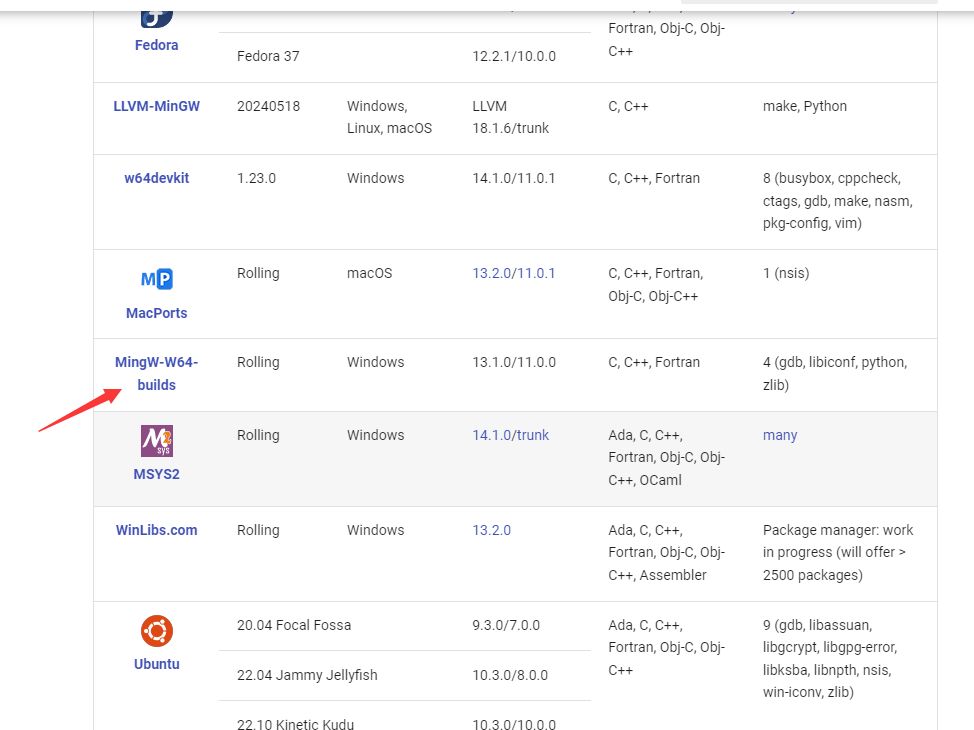
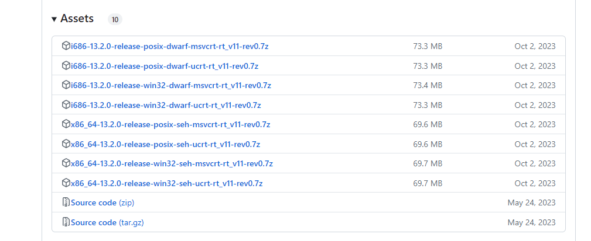

# Windows

1. 来到[mingw官网](https://www.mingw-w64.org/downloads/), 根据自己的喜好选择,  我这里选择mingw64

   

   2. 进去之后点击[GitHub](https://github.com/niXman/mingw-builds-binaries/releases)链接来到下载页面

      

      * **i686** 和 **x86_64 **分别代表32位和64位
      * posix 和 win32 代表默认使用线程库,  其实就是编译器默认参数选择, 如果是posix 链接的时候就回默认带上 -lpthread, 其实无论怎么选, pthread库都是包含的
      * **msvcrt**  和 **ucrt** 代表不同的运行时库, 就是一些基础函数, 库函数

   3. 配置环境变量

   