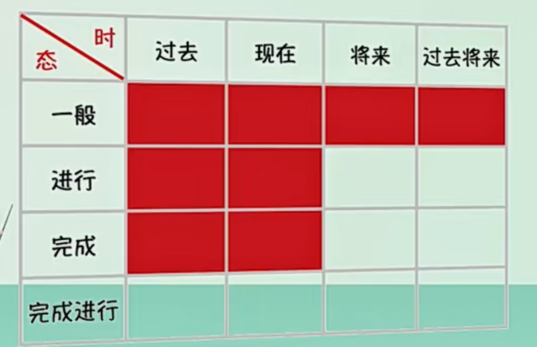

> 贵在坚持

# 前言

趁这次考研,  总结一下大体的英语语法吧.

# 基本句子知识

## 词性

英语句子中主要包含以下几种词性：

1. **名词(Nouns)**：指人、地点、事物、抽象概念。如："book"（书），"Tom"（汤姆），"city"（城市）等。

2. **动词(Verbs)**：表示行动、状态或存在。如："run"（跑），"is"（是），"seem"（似乎）等。

3. 形容词(Adjectives)：**描述或修饰名词**。如："happy"（快乐的），"blue"（蓝色的）等。

4. 副词(Adverbs)：**修饰动词、形容词或其他副词**，表达方式、时间、地点、原因等。如："slowly"（慢慢地），"very"（非常）等。

5. 代词(Pronouns)：**代替名词或短语**。如："he"（他），"it"（它），"they"（他们）等。

6. 介词(Prepositions)：<em style="color:pink">**表达物体之间的关系**</em>。如："in"（在...里），"on"（在...上），"with"（和...一起）等。

7. 连词(Conjunctions)：**连接词、短语或句子**。如："and"（和），"but"（但是），"if"（如果）等。

8. 感叹词(Interjections)：**表达感情或反应**。如："Oh!"（哦！），"Wow!"（哇！）等。

9. 冠词(Articles)：**在名词前面确定或限定名词的使用**。如："a"（一个），"an"（一个，前面的单词以元音音标开头时使用），"the"（特定的）。

每种词性都有其特定的规则和使用情况，掌握它们是理解和使用英语的关键。

## 句子成分

在英语句子中，有以下几种主要的句子成分：

1. 主语（Subject）：主语是句子的中心，表示动作、行为或状态的发起者。主语通常由**名词、代词、名词短语、从句、动名词或不定式短语、甚至有时由形容词或数词**充当。

2. 谓语（Predicate）：谓语表明主语的动作、行为或状态。谓语由**动词、动词短语**构成。在复合句中，谓语可以包括多个动词或动词短语。
3. 宾语（Object）：**宾语是动词或介词的目标**。宾语可以由**名词、代词、名词短语、从句、动名词或不定式短语**充当。
4. 补语（Complement）：补语是用来补充说明主语或宾语，使句意完整的成分。补语可以由**名词、形容词、副词、介词短语、不定式、动名词或从句**充当。
5. 定语（Attribute）：定语是用来修饰名词的成分，它描述或限定名词。定语可以由**形容词、名词、代词、数词、介词短语、从句、或者分词**充当。
6. 状语（Adverbial）：状语是用来修饰动词、形容词、副词或整个句子的成分，表示动作或状态的时间、地点、原因、方式、程度等。状语可以由**副词、介词短语、从句、分词短语或不定式短语**充当。

以上是英语句子的基本成分及其常用词性。需要注意的是，一种词性的词可以在不同的句子结构中充当不同的成分，反之，一种成分也可以由不同词性的词来充当。具体取决于句子的语境和结构。

## 限定词

限定词（determiners）是英语语法中的一种词类，主要用来引入名词，**限定其范围或数量**。限定词通常出现在名词（或名词短语）的开头，可以和形容词一起修饰名词。

以下是一些常见的限定词种类：

1. **冠词**：包括定冠词（the）和不定冠词（a，an）。例如："the book"，"a cat"。

2. **物主代词**：如 my, your, his, her, its, our, their。例如："my car"，"their house"。

3. **指示代词**：这，那（this, that）以及它们的复数形式（these, those）。例如："this pen"，"those books"。

4. **数量词**：如一些、所有、无、多、少等。例如："some apples"，"all people"。

5. **疑问词**：用于提问的限定词，例如 which, what。例如："Which book do you like?"。

6. **序数词**：如第一、第二等。例如："the first day"，"the second time"。

7. **基数词**：如一、两、三等。例如："two dogs"，"three cats"。

这些**限定词可以帮助我们更具体地定义或限定我们正在讨论的名词或名词短语**。例如，在句子 "I want a book" 中，"a" 是一个限定词，它说明我们要的是“一本”书，而不是特定的某本书。

注意:

* 基数词 + 序数词  = 分数   one second = 1/2  two thrids = 2/3   当分子超过1的时候 分母要加s

## 形容词

形容词（Adjective）是英语中的一类词，主要用来**修饰或描述名词或代词，为名词或代词添加一些特性或属性**。

以下是形容词的一些主要特性和用途：

1. **描述特性**：形容词可以描述颜色、大小、形状、质地、味道等特性。例如，"red", "big", "round", "rough", "sour"。

2. **描述感觉或情绪**：形容词可以用来表达感情或情绪，如 "happy", "sad", "angry", "excited"。

3. **表达数量或顺序**：虽然数量词和序数词通常被视为一种特殊的形容词，但它们也可以用作形容词，如 "two", "second"。

形容词通常位于它所修饰的名词之前，但也可以在某些动词（如 "be", "seem", "look" 等）之后作表语。

形容词还有比较级（"bigger"）和最高级（"biggest"）形式，用来比较两个或多个事物。

## 副词

副词（Adverb）是英语中的一类词，主要用来修饰或限定**动词、形容词、其他副词，或整个句子**。

以下是副词的一些主要功能和使用方式：

1. **修饰动词**：副词可以用来描述动作的方式、时间、地点或频率等。例如，在句子 "She runs quickly" 中，"quickly" 是一个副词，修饰动词 "runs"。

2. **修饰形容词**：副词可以用来强调或限定形容词。例如，在句子 "She is extremely beautiful" 中，"extremely" 是一个副词，修饰形容词 "beautiful"。

3. **修饰其他副词**：副词也可以修饰其他副词。例如，在句子 "She runs quite quickly" 中，"quite" 是一个副词，修饰另一个副词 "quickly"。

4. **修饰整个句子**：有些副词可以修饰整个句子，表示说话人对句子内容的态度或看法。例如，在句子 "Surprisingly, she runs very fast" 中，"Surprisingly" 是一个副词，修饰整个句子。

副词有许多种类，包括方式副词（如 "quickly"）、地点副词（如 "here"）、时间副词（如 "yesterday"）、频率副词（如 "often"）、程度副词（如 "very"）等。

许多副词是由形容词加上后缀 "-ly" 构成的，如 "quick"（形容词）和 "quickly"（副词）。但也有一些副词，如 "well"、"fast"、"hard"，其形式和对应的形容词相同，只能通过语境来判断。

### 副词位置

副词的位置在句子中可以变化，取决于它们修饰的对象以及它们的种类。下面是一些一般的规则：

1. **修饰动词**：**当副词修饰动词时，它们通常放在动词之后**。例如："She speaks clearly."（她说话说得清楚。）

2. **修饰形容词或其他副词**：**当副词修饰形容词或其他副词时，它们通常放在被修饰词之前**。例如："She is incredibly smart."（她非常聪明。）"She runs extremely fast."（她跑得非常快。）

3. **修饰整个句子**：当副词修饰整个句子时，它们可以放在句首、句中或句末。例如："Fortunately, we arrived on time."（幸运的是，我们准时到达了。）"We have, unfortunately, missed the bus."（不幸的是，我们错过了公共汽车。）

4. **频率副词**：像 "always", "usually", "often", "sometimes", "rarely", "never" 这样的频率副词，**通常放在被修饰的动词之前，或者在 "be" 动词之后**。例如："She always arrives early."（她总是早到。）"He is usually at home."（他通常在家。）

5. **否定副词**：像 "not", "never", "no" 这样的否定副词，**通常放在动词之前，形成否定句**。例如："She does not like coffee."（她不喜欢咖啡。）

**需要注意的是，这些规则并不是绝对的，有时候，为了强调或者文学效果，副词的位置可能会改变**。此外，副词的位置也可以受语境、口语习惯等因素影响。

## <em style="color:red">介词短语</em>

### 定义

介词短语是由介词和其后的宾语（通常是名词或代词）组成的。它通常用来说明**动作的时间、地点、方式、原因等信息**。**所以介词短语在句子中通常都是非核心内容**. 它可以作为句子的各种成分，如宾语、定语、状语等。

<em style="color:red">介词短语的基本结构是：介词 + 宾语。这里的宾语可以是**名词、代词、动名词、或者是另一个介词短语。**</em>

### 充当成分

介词短语在句子中的功能多样，它可以充当以下几种主要的句子成分：

1. **定语**：介词短语可以用作名词或代词的定语，即用来修饰名词或代词。例如，在句子 "The man with the hat is my uncle" 中，"with the hat" 就是一个介词短语作定语，修饰 "The man"。

2. **状语**：介词短语也可以作为状语，修饰动词、形容词、副词或整个句子。例如，在句子 "She arrived in the morning" 中，"in the morning" 是一个介词短语作状语，修饰动词 "arrived"。

3. **宾语**：在某些情况下，介词短语可以作为动词或形容词的宾语。例如，在句子 "She is thinking about the problem" 中，"about the problem" 是一个介词短语作宾语，是动词 "thinking" 的宾语。

4. **补语**：在某些句型中，介词短语可以作为主语或宾语的补语。例如，在句子 "He is in the garden" 中，"in the garden" 是一个介词短语作表语，补充说明主语 "He" 的状态。

总的来说，介词短语是英语句子结构中的重要部分，它可以在句子中担任多种不同的角色，起到连接和修饰的作用。

### 修饰对象分类

介词短语在英语中的作用非常广泛，可以修饰多种词性的词，包括名词、动词、形容词、副词等。

1. **修饰名词**：**介词短语可以作为名词的后置定语**，修饰名词。例如："The man with the hat"（戴帽子的男人），这里的 "with the hat" 是介词短语，作为后置定语修饰 "man"。

2. **修饰动词**：介词短语可以作为状语，修饰动词，描述动作发生的时间、地点、方式等。例如："She arrived after dinner"（她在晚饭后到达），这里的 "after dinner" 是介词短语，修饰动词 "arrived"。

3. **修饰形容词**：介词短语有时也可以修饰形容词。例如："She is fond of music"（她喜欢音乐），这里的 "of music" 是介词短语，修饰形容词 "fond"。

4. **修饰副词**：介词短语可以修饰副词。例如："She came back right after dinner"（她在晚饭后立刻回来），这里的 "after dinner" 是介词短语，修饰副词 "right"。

总的来说，介词短语在英语中起到了非常重要的修饰作用，它可以丰富句子的信息，使句子更具描述性。

### 修饰对象位置

在有多个连续介词短语的句子中，通常要根据语境和句子的结构来判断各个介词短语修饰的对象。这里有几个一般性的建议：

1. **顺序原则**：一般情况下，介词短语离其修饰的词越近，关系越密切。例如在句子 "He found a ring in the drawer of the desk" 中，"in the drawer" 的位置更接近 "ring"，所以首先修饰 "ring"；然后 "of the desk" 修饰的是 "the drawer"。

2. **逻辑关系**：结合上下文，理解句子中各个部分之间的逻辑关系，可以帮助确定介词短语修饰的对象。例如在句子 "She's good at playing piano in the morning" 中，理解 "in the morning" 更有可能是修饰 "playing piano" 而非 "good at"，因为在上下午钢琴的时间对 "playing piano" 更具相关性。

3. **固定搭配**：一些介词和特定的动词、形容词、名词经常一起使用，形成固定的短语。了解这些固定搭配也可以帮助判断介词短语的修饰对象。例如 "interested in"、"good at"、"on the phone" 等都是固定搭配。

但请注意，由于英语的灵活性，以上规则并不总是适用，存在一些例外情况。当遇到模棱两可的情况时，要结合上下文和语境进行判断。此外，大量的阅读和实践也有助于理解和掌握这些规则。

举例:

"He found a ring in the drawer of the desk" 有两种可能的理解方式，具体取决于我们如何解读 "in the drawer of the desk" 这个介词短语。

1. 如果我们认为 "in the drawer of the desk" 是修饰 "a ring"，那么这句话的意思就是 "他发现了一个在桌子的抽屉里的戒指"。这种解读下，**强调的是戒指在桌子的抽屉里这个特定的位置**。

2. 另一方面，如果我们认为 "in the drawer of the desk" 是修饰整个动作 "He found a ring"，那么这句话的意思就变为 "他在桌子的抽屉里发现了一个戒指"。这种解读下，**强调的是他在哪里发现的戒指**。

这个例子展示了英语中的某种模糊性，这种模糊性在很多语言中都存在。解决这种模糊性的最好方式就是通过上下文来理解。在有些情况下，可能需要额外的信息才能确定更准确的意思。

**不过,我们都不用纠结,  这两种意思都不会影响我们阅读**

### 介词分类

**介词的分类是根据后面接的东西所表示的信息来分类的**,  主要, 不要纠结

#### 表示时间类的介词

|      介词      |           表达含义           |
| :------------: | :--------------------------: |
|  at / on / in  | 在……时间点 / 时间上 / 时间内 |
| before / after |     在……时间之前 / 之后      |
|  from, since   |          自从……时间          |
|   by, until    |     截止到 (直到) ……时间     |
|      for       |          持续……时间          |
|     during     |           在……期间           |

在英语中，表示时间的介词 "at", "on", "in" 的使用各有规定，具体区别如下：

1. **at**：**用于表示具体的时间点，如几点几分、午夜、中午等**。例如：
   - at 7:30 (在7点半)
   - at noon (在中午)
   - at midnight (在午夜)

2. **on**：用于表示**具体的一天或者日期**。例如：
   - on Monday (在星期一)
   - on New Year's Day (在新年这一天)
   - on my birthday (在我生日那天)

3. **in**：用于**表示时间段**，如年份、季节、月份、世纪、上午/下午等。例如：
   - in the morning / afternoon / evening (在早上/下午/晚上)
   - in May (在五月)
   - in 2023 (在2023年)
   - in the 21st century (在21世纪)
   - in the summer (在夏季)

这是一种通用的规则，但请注意有些特殊表达。比如我们通常说 "at night" 而不是 "in the night"，说 "on Christmas Day" 但 "at Christmas"（表示圣诞节期间）。语言使用中的这些特殊情况，通常需要通过大量的阅读和实践来学习和掌握。

#### 表示地点和范围的介词

|                             介词                             |                           表达含义                           |
| :----------------------------------------------------------: | :----------------------------------------------------------: |
|                           at / in                            |                    在……地点 $/$ 在……里面                     |
| $\begin{array}{c}\text { on, above, over / under, below, } \\\text { beneath }\end{array}$ | $\begin{array}{c}\text { 在……上面/下面 } \\\text { (考研中不需要要区别这几个词的细微差别) }\end{array}$ |
|                     in front of / behind                     |                       在……之前 / 之后                        |
|                  near / by, beside, next to                  |                  在……附近 / 在……旁边 (挨着)                  |
|                        between, among                        | 在 .... 之间(between表示两者之间； among表示三者或以上的之间 |
|                            around                            |                           在……周围                           |
|                   into  / out of  (动态的)                   |                   进入……里面 / 从……里面出                    |
|                          onto / off                          |                      到……上面 / 脱离……                       |
|                    across, through / past                    |   穿过 $\cdots \cdots \cdot$ / 经过 $\cdots \cdots \cdot$    |
|                            along                             |                            沿着……                            |
|                      from / to, towards                      |                       来自…… /朝着……去                       |
|                            beyond                            |                   超过，超出（指在范用外）                   |

在表示空间位置时，“at”，“on”和“in”也各有用法规定：

1. **at**：指明了具体的位置或点。例如：
   - at the door (在门口)
   - at the bus stop (在公交站)
   - at the corner of the street (在街道的拐角处)

2. **on**：表示在一个平面或者表面上。例如：
   - on the table (在桌子上)
   - on the wall (在墙上)
   - on the floor (在地板上)

3. **in**：表示在三维空间中，或者某种范围、区域、地点内。例如：
   - in the box (在箱子里)
   - in a car (在汽车里)
   - in China (在中国)
   - in a picture (在图片中)

然而，**这些规则并不是绝对的，有些表达可能不符合这些规则,所以我们要具体问题具体分析**。例如，我们会说 "on the bus" 或 "on the plane" 而不是 "in the bus" 或 "in the plane"，因为在这种情况下，“on”表示的是一种乘坐交通工具的状态。同样，当我们说 "at home" 或 "at school" 时，“at”表示的是一种处于某个环境或状态的含义。这些特殊的用法需要通过实际语境来学习和理解。

#### 其他用法

|      介词      |                           表达含义                           |
| :------------: | :----------------------------------------------------------: |
|       of       | $\begin{array}{l}\cdots \cdots \text { 的…… (表示属性) } \\\text { (“A of } B \text { ”通常翻译为“B的A”) }\end{array}$ |
|     about      |                            关于……                            |
| with / without |                      伴随着有…‥/ 没有……                      |
|      for       |                      为了…… (表示目的)                       |
|             |                      因为…… (表示原因)                       |
|             |                      对于…… (表示对象)                       |
|          by          |           通过……方式或方法           |
|                      | 被……做 (被动语态 + by + 动作的发出者 |
|                      |      相差了…… (表示变化的差额)       |
|          as          |                作为……                |
|                      |            像……样, 如同……            |
|         like         |                像……样                |
| despite, in spite of |             尽管.......              |

of ... 的 ... (表示属性)  two of the strings   和 two strings 这个是有区别的,   前者表示是 那群弦中的两根,  而且后置是任意两根,  而且前者中的两根是那群弦的属性

## 连接词

在英语中，连接词主要可以分为以下几类：

1. **并列连接词（Coordinating Conjunctions）**：这类连接词用于连接两个平等的句子成分，可以是主句与主句，或者从句与从句。常见的并列连接词包括 "and"（并且），"but"（但是），"or"（或者），"so"（所以），"for"（因为），"nor"（也不），"yet"（然而）等。

2. **关联连接词（Correlative Conjunctions）**：这类连接词也属于并列连接词的一种特殊形式，用于连接在语法和逻辑上等同的句子成分，通常成对出现。常见的关联连接词包括 "either...or"（不是...就是...），"neither...nor"（既不...也不...），"both...and"（既...又...），"not only...but also"（不仅...而且...）等。

3. **从属连接词（Subordinating Conjunctions）**：这类连接词用于引导从句，并将其与主句连接。常见的从属连接词包括 "because"（因为），"since"（自从/因为），"as"（因为/当...的时候），"although"（尽管），"if"（如果），"unless"（除非），"while"（虽然/当...的时候）等。

4. **关系词（Relative Pronouns）**：这类词通常用来引导定语从句，常见的关系词有 "who"，"whom"，"whose"，"which"，"that" 等。

以上就是英语中常见的四类连接词。请注意，每种连接词都有其特定的用法和上下文，理解它们的含义并知道如何在不同的语境中使用它们是提高英语水平的一个重要部分。

## 连接符号

### 破折号

用于连接句子或者同位语, 或者用来强调前面的句子 以补充意思,  此时翻译为"也就是说"

### 冒号

用来强调前面句子中的名词

### 分号

* 等于 " 逗号 + 连词"
* 在原本对等的语句中, 有连词出现, 如果有插入语的话, 就会让句意不够清楚, 此时用;加原先句子, 来说明是和前面的语句做连接

# 简单句

在英语中，简单句(simple sentence)是**由一个主语和一个谓语构成的句子**。它只包含一个独立的子句，没有从属子句或并列子句。简单句**通常用于表达一个完整的想法或信息**。

**简单句的基本结构是：主语 + 谓语**。

例如：
1. "The cat is sleeping." （猫正在睡觉。）
2. "She reads a book." （她在读一本书。）

尽管简单句通常被认为是简短的，但它们也可以包含补充信息，如修饰词、宾语、间接宾语等。例如：“The smart cat with black fur is quietly sleeping on the soft couch.” (黑毛聪明的猫正在软沙发上安静地睡觉。)

然而，重要的是要注意，无论它们多么长或复杂，**只要句子中只有一个独立的子句，它就仍然是一个简单句**。

## 基本句型

英语中有几种基本的句型，这些句型是根据句子中的成分（例如主语、谓语、宾语等）来分类的。以下是英语中最常见的五种基本句型：

1. **S-V 句型（主谓句型）**：这种句型包含一个主语（Subject）和一个谓语（Verb）。**谓语是一个不及物动词**。例如："Birds fly."（鸟飞翔。）

2. **S-V-O 句型（主谓宾句型）**：这种句型包含一个主语（Subject）、一个谓语（Verb）和一个宾语（Object）。**谓语是一个及物动词**。例如："I love apples."（我喜欢苹果。）

3. **S-V-C 句型（主谓补语句型 或者说是主系表）**：这种句型包含一个主语（Subject）、一个联系动词（Linking Verb）和一个补语（Complement）。补语可以是名词、形容词等，**用来对主语进行说明或者描述**。例如："He is a doctor."（他是医生。）或 "The sky is blue."（天空是蓝色的。）

4. **S-V-O-O 句型（主谓双宾句型）**：这种句型包含一个主语（Subject）、一个谓语（Verb）、一个间接宾语（Indirect Object）和一个直接宾语（Direct Object）。例如："She gave me a gift."（她给了我一份礼物。）, **物永远是直接宾语, 人永远是间接宾语**

5. **S-V-O-C 句型（主谓宾补句型）**：这种句型包含一个主语（Subject）、一个谓语（Verb）、一个宾语（Object）和一个宾语补足语（Object Complement）。**宾语补足语用来描述或说明宾语**。例如："They elected him president."（他们选他为总统。）

这五种基本句型构成了英语句子的基础。理解并熟练使用这些句型可以帮助我们更好地理解和构造英语句子。

### 祈使句 

祈使句是英语中的一种语句类型，它主要用于发出命令、提出要求、提供指示或建议。以下是关于祈使句的一些主要点：

1. **省略主语**：在祈使句中，主语（通常是"you"）通常被省略。例如，"Be quiet." 省略了主语 "you"，实际上的完整语句是 "You be quiet."。

2. **动词形式**：祈使句的动词通常是动词的原形，也就是不带任何词尾变化的形式。例如，"Go to the store."。

3. **否定形式**：要否定一个祈使句，你通常在动词前面加上 "don't"。例如，"Don't be late."。

4. **礼貌形式**：在请求或给予建议时，我们常常使用 "please" 来使祈使句更礼貌。例如，"Please close the door."。

5. **祈使句的用途**：祈使句可以用于各种情境，包括给出指令（"Turn left at the traffic light."）、提供建议（"Take a coat. It might be cold outside."）、发出请求（"Please pass the salt."）或表达愿望（"Have a nice day."）。

祈使句是英语中一个重要的句型，掌握它的基本结构和用法能帮助你更好地理解和使用英语。

### 感叹句

英语的感叹句（exclamatory sentences）用于表达强烈的情绪或感情，如惊讶、愤怒、快乐、悲伤等。感叹句通常以感叹号（!）结尾。

一般来说，英语的感叹句有两种基本结构：

1. **What + （a/an）+ 形容词 +（名词）+ 主语 + 谓语！** 

    这种结构用来强调某人或某物的特性或状态。例如：

    - What a beautiful painting it is!
    - What an intelligent girl she is!

2. **How + 形容词/副词 + 主语 + 谓语！**

    这种结构用来强调程度。例如：

    - How beautiful the painting is!
    - How intelligently she answered the question!

此外，对于一些简单的感叹句，我们也可以直接使用形容词或副词，如 "Amazing!"，"Wonderful!"，"Fantastic!" 等。

最后，值得注意的是，在口语或非正式的书面语言中，我们也经常使用"so"或"such"来构造感叹句，如"So beautiful!"或"Such a beautiful painting!"。

### 疑问句

#### 一般疑问句

一般疑问句是英语语法的一种基本句型，主要用于获取对方的肯定或否定回答。它的基本构造是以助动词或情态动词开始，紧接主语和谓语。以下是一些详细的构造规则和注意点：

1. **助动词/情态动词 + 主语 + 其他**: 这是一般疑问句最基本的结构。例如："Do you like cats?"，"Can she sing?"。这样的句子通常期待"yes"或"no"的回答。
2. **“Be”动词**: 对于使用"be"动词的句子，“be”动词直接移到句首，形成疑问句。例如，"Is he a teacher?"（他是老师吗？）或"Are you happy?"（你快乐吗？）。
3. **一般现在时和一般过去时**: 对于一般现在时和一般过去时的句子，我们用"do/does/did"作为助动词，并将其置于句首。例如，"Do you work here?"（你在这里工作吗？）或"Did you see that movie?"（你看过那部电影吗？）。
4. **其他时态和情态动词**: 对于其他时态（如完成时，进行时）和情态动词（如can, could, will, would等），把助动词或情态动词移至句首形成疑问句。例如，"Have you done your homework?"（你做完作业了吗？）或"Will you go to the party?"（你会去参加派对吗？）。
5. **否定疑问句**: 在一般疑问句中加入否定词"not"，可以形成否定疑问句，用以表达惊讶、责备、建议等语气。例如，"Don't you love me?"，"Isn't it a beautiful day?"。   只要表达肯定就用yes  但是翻译过来得否定, 比如  Don't you love me? 和 Do you love me?  肯定回答都是 yes,  i love  但是 翻译的时候有细微差别,  第一个是  不, 我爱你 , 第二个是  是的, 我爱你

#### 特殊疑问句

特殊疑问句是英语中用来获取特定信息的疑问句。它们通常以疑问词或疑问短语开始，比如 "what", "where", "when", "why", "how", "which", "who" 等。下面是一些特殊疑问句的基本规则和例子：

1. **What** 用来询问事物或人。例如："What is your name?" 或 "What do you want?"

2. **Where** 用来询问地点。例如："Where do you live?" 或 "Where is the bank?"

3. **When** 用来询问时间。例如："When is your birthday?" 或 "When do we leave?"

4. **Why** 用来询问原因。例如："Why are you late?" 或 "Why is he crying?"

5. **How** 用来询问方法、状态或程度。例如："How do you make coffee?" 或 "How are you?"

6. **Which** 用来从有限的选择中询问。例如："Which color do you prefer, red or blue?" 或 "Which is your book?"

7. **Who** 用来询问人。例如："Who is that man?" 或 "Who wrote this book?"

特殊疑问句的语序一般是疑问词 + 助动词(情态动词,be动词,do/does/did) + 主语 + 其他  (**疑问词 + 一般疑问句的结构**)，如 "What do you like?" 这种语序和陈述句（主语 + 动词 + 其他，如 "You like ice-cream"）是不同的。然而，有时特殊疑问句也可以不使用助动词

注意，特殊疑问句的回答通常不是简单的 "yes" 或 "no"，而是需要提供具体的信息。例如，对于 "Where do you live?" 的回答可能是 "I live in New York."。

what who which 这三个疑问词 具有名词性质, 因此可以直接做主语, 而不需要倒装, 

## 简单句的核心构成

### 主语

### 谓语

谓语动词可分为  实义动词（lexical verbs）和非实义动词（non-lexical verbs，也称助动词）：

**实义动词（lexical verbs）**是具有具体意义的动词，通常可以指代具体的动作、状态或存在。例如，"run"、"eat"、"think"、"exist" 等都是实意动词。实意动词可以进一步被分类为：

1. **及物动词（transitive verbs）**：这类动词需要一个或多个宾语来完成其意义。例如，在句子 "She loves her dog" 中，"loves" 是一个及物动词，因为它需要一个宾语 "her dog" 来完成其意义。 **对应主谓宾  主谓宾补**
2. **不及物动词（intransitive verbs）**：这类动词不需要宾语。例如，在句子 "She sleeps" 中，"sleeps" 是一个不及物动词，因为它不需要宾语就能完成其意义。**对应主谓**
3. **双及物动词（ditransitive verbs）**：这类动词可以有两个宾语。例如，在句子 "He gave Mary a book" 中，"gave" 是一个双及物动词，因为它有两个宾语 "Mary" 和 "a book"。**对应主谓双宾**

**非实义动词（non-lexical verbs，也称助动词）**不具有具体的意义，**它们存在于动词短语中，用来帮助构建各种语法结构**，例如时态、语态、语气等。非实义动词可以被分类为： **对应主系表 也是主谓补**

1. **情态助动词（modal auxiliary verbs）**：这类动词用来表示可能性、能力、许可、义务等。例如，"can", "could", "may", "might", "shall", "should", "will", "would", "must" 等都是情态助动词。
2. **主要助动词（primary auxiliary verbs）**：这类动词包括 "be", "have", "do"，它们可以用作助动词也可以用作实意动词。例如，在句子 "She is running" 中，"is" 是一个主要助动词，它用来构建进行时。而在句子 "She is a teacher" 中，"is" 是一个实意动词，表示存在关系。

## 谓语动词的变化

在英语中，谓语动词的变化主要包括以下几个方面：

1. **时态**：动词的时态表示动作或状态发生的时间。包括：
   - 现在时：表示现在进行的或经常发生的动作。例如：She works at a bank.
   - 过去时：表示过去发生的动作。例如：They went to the concert yesterday.
   - 将来时：表示将来要发生的动作。例如：He will arrive tomorrow.
   - 现在进行时：表示现在正在进行的动作。例如：We are reading books.
   - 过去进行时：表示在过去某一时刻正在进行的动作。例如：She was cooking when I arrived.
   - 将来进行时：表示在将来某一时刻将会正在进行的动作。例如：He will be working when you arrive.
   - 现在完成时：表示过去发生但对现在有影响的动作。例如：I have finished my work.
   - 过去完成时：表示在过去某一时刻之前已经完成的动作。例如：She had left before I arrived.
   - 将来完成时：表示在将来某一时刻之前将完成的动作。例如：I will have arrived by the time you get home.
2. **语态**：语态包括主动语态和被动语态。
   - 主动语态：主语是动作的执行者。例如：John ate an apple.
   - 被动语态：主语是动作的承受者。例如：The apple was eaten by John.
3. **情态动词**：情态动词用来表示可能性、能力、必要性、猜测等。包括 can, could, may, might, shall, should, will, would, must 等。例如：She must be at home now.
4. **人称和数的变化**：在现在时，动词与其主语的人称和数量有关。例如："I/You/We/They run" 与 "He/She/It runs".
5. **否定**：在动词前加 not，形成否定句。例如：She does not (doesn't) work at a bank.
6. **非谓语动词**：包括不定式（to do）、分词（doing/done）和动名词（doing）。
7. **动词的语气**：包括陈述语气、疑问语气、祈使语气、虚拟语气等。例如：I hope he could come. (陈述语气); Can you help me? (疑问语气); Please open the door. (祈使语气); If I were you, I would say no. (虚拟语气)

这些都是谓语动词的主要变化，但各种具体情况可能需要根据上下文和具体语法规则来确定。

> 我们可以把动词的变化 当成一个整体当成谓语动词

### 谓语动词的时态

对于谓语动词的时态,  我们在读文章的时候, 完全可以自己代入到这篇文章中去,  当成他在跟你对话,  而不是说 我们理解成他多久写的文章, 我们站在现在去看他的文章是现在还是过去

#### 一般时态

这是英语中一般时态陈述句的构造：

1. **一般现在时**：主语 + 动词原形 / 第三人称单数形式的动词 + 宾语。**表示习惯性的动作、现实的状态或普遍的真理**
   - 例如：She reads books.
2. **一般过去时**：主语 + 动词的过去式 + 宾语。**表示在过去某个时间发生的动作或存在的状态，没有明确的与现在相连的意思, 但是一般表示过去是这样, 现在不是这样了**  (这里更多的是指 动作已经结束了)
   - 例如：She read books.
3. **一般将来时**：主语 + will/shall + 动词原形 + 宾语。**表示未来将要发生的动作或状态，有时也用来表示将要发生的动作或打算、计划**, shall 一般只能用在第一人称后面  比如 我,我们
   - 例如：She will read books.  
4. **一般过去将来时**：主语 + would/should + 动词原形 + 宾语。**主要用于表示在过去的某个时间点看，预计将要发生的事情。这种时态在英语中比较罕见，常常出现在间接引语或叙述性语言中。**
   * 例如：I knew she would come to the party.

这些是一般时态的基本构造。特别要注意的是，某些动词可能是不规则动词，其过去式和过去分词可能不遵循普通规则。**另外，"shall" 主要用于较为正式的英语或者某些特定情况**，如法律文档，或者与第一人称连用来表达强烈的意愿或决定。在现代口语英语中，"will" 的使用更为常见。

#### 进行时态

1. **现在进行时**：主语 + am/is/are（be动词的现在式） + 动词的-ing形式 + 宾语。**表示此刻正在进行或发生的动作，也可以表示一段时间内（不一定就在说话的那一刻）在进行的动作或存在的情况**。
   - 例如：She is reading a book.

2. **过去进行时**：主语 + was/were（be动词的过去式） + 动词的-ing形式 + 宾语。**表示在过去某个特定时间点正在进行的动作，或者在过去某段时间内一直在进行的动作**。
   - 例如：She was reading a book when I arrived.

3. **将来进行时**：主语 + will be / shall be + 动词的-ing形式 + 宾语。**表示将要发生的动作，或者在未来某个特定时间点会正在进行的动作**。请注意，"shall"更常用于第一人称（I 和 we），并且较为正式。
   - 例如：She will be reading a book when you arrive.

4. 过去将来进行时：主语 + would be / should be + 动词的-ing形式 + 宾语。**表示在过去的某个时间点看，预计将要进行的事情。这种时态比较少见，通常出现在间接引语或叙述性语言中**。
   - 例如：He said that she would be reading a book when I arrived.

这些是进行时态的基本构造和含义。记住，实际的语境和上下文可能会影响到你选择使用哪种时态。

#### 完成时态

**完成时态是表达一件事的"完成结果"**, 做完了是一个结果,  没做完也是一个结果

**强调的是 某某时间之前**

**阶段性总结**就可以使用完成时态

下面是完成时态的构造和含义：

1. **现在完成时**：主语 + have/has + 动词的过去分词 + 宾语。**表示从过去某一时间开始延续到现在（可能持续到将来）的动作或状态，或者在最近或过去某一时间（不明确指出）完成的动作**。 
   - 例如：She has read the book.

2. **过去完成时**：主语 + had + 动词的过去分词 + 宾语。**表示在过去某一时间点或某一动作之前已经完成的动作或存在的状态**。
   - 例如：She had read the book before I saw her.

3. **将来完成时**：主语 + will have / shall have + 动词的过去分词 + 宾语。**表示在将来某一时间点之前会已经完成的动作或存在的状态**。
   - 例如：She will have read the book by the time you see her.

4. 过去将来完成时：主语 + would have / should have + 动词的过去分词 + 宾语。**表示在过去的某个时间点看，预计在将来的某一时间点之前会已经完成的动作。这种时态比较少见，通常出现在间接引语或叙述性语言中**。
   - 例如：He said that she would have read the book by the time I saw her.

请注意，完成时态强调的是动作的完成，或者状态的存在，而不仅仅是动作或状态本身。此外，完成时态经常与表示时间的短语（例如 "by the time", "before", "since", "already", "yet", "just" 等）一起使用。

#### 完成进行时态

完成进行时 = 完成 + 进行

**强调过程**

完成进行时态是用来表示在某个时间之前持续发生的动作或者状态。下面是这种时态的基本构造：

1. **现在完成进行时**：主语 + has/have been + 动词的现在分词（-ing 形式）+ 宾语。这种时态表示从过去某个时间点开始，一直持续到现在的动作或状态，动作可能已经结束，也可能仍在继续。
   - 例如：She has been reading books.（她一直在读书，可能正在读，也可能刚刚停止）

2. **过去完成进行时**：主语 + had been + 动词的现在分词（-ing 形式）+ 宾语。这种时态表示在过去某个时间点或动作之前一直持续的动作或状态。
   - 例如：She had been reading books before I arrived.（我到达之前，她一直在读书）

3. **将来完成进行时**：主语 + will have been + 动词的现在分词（-ing 形式）+ 宾语。这种时态表示在未来某个时间点之前一直持续的动作或状态。
   - 例如：She will have been reading books for two hours by the time I arrive.（到我到达的时候，她将已经读了两个小时的书了）

这些是完成进行时态的基本构造。这种时态复杂的地方在于，它们同时包含了完成时态和进行时态的含义，即表示动作或状态的持续，并与某个特定的时间点有关。需要注意的是，某些动词可能没有进行时态，因为它们不表示动作，而是表示状态。例如，动词 "know" 就不常用于进行时态。

### 谓语动词的情态

谓语动词的情态，通常指的是通过情态动词来表示说话人对动作或状态的看法和态度，比如可能性、需要性、肯定性等。情态动词在英语中很常见，包括"can", "could", "may", "might", "must", "shall", "should", "will", "would"等。

比如：

1. "She can swim." (她会游泳。) 这里的 "can" 表示能力。
2. "You must go." (你必须去。) 这里的 "must" 表示义务或必要性。
3. "I might visit my grandmother." (我可能会去看望我奶奶。) 这里的 "might" 表示可能性。

这些情态动词**没有人称变化**，不能单独作为谓语，**必须和动词原形一起使用**。此外，它们也不使用 "to" 连接，例如，我们不说 "I must to go"，而应该说 "I must go"。

情态动词只有两种时态  一个是 **一般现在时和一般过去时**, must 还没有过去时(这里指的是情态动词没有其他时态, 但是后面的动词还是可以有的)

| 一般现在时 | 一般过去时 |
| :--------: | :--------: |
|    must    |     -      |
|    can     | **could**  |
|    will    | **would**  |
|   shall    | **should** |
|    may     | **might**  |

对于"could"，"would"，"should" 和 "might" 这些一般过去时态的情态动词，他们不仅可以用于**表达过去的情况**，**也常常用于表示对现在情况的一种更为委婉、礼貌或疑虑的态度**。

情态动词的否定形式通常通过在**情态动词后面加 "not" 来形成**。例如，"can not"、"must not"。

**情态动词也可以表达推测**

情态动词在表达推测或猜测时具有不同的意义。以下是用于表达推测时的一般含义：

- Must：通常用于**表达对现在或未来的强烈推测**，表示说话人对其猜测的确定性很高。例如："They must be at home by now."（他们现在一定在家。）

- Can/Could：在推测语境中，**这两个词通常表示对某种可能性的猜测或推测**。例如："It can be true."（这可能是真的。）或 "It could be true."（这可能是真的。）

- Will/Would：通常用于对未来的推测。例如："It will probably rain tomorrow."（明天可能会下雨。）

- Shall/Should：'Should' **通常用于表示对现在或未来的推测**，其推测的确定性比 'must' 弱一些。例如："She should be at school by now."（她现在应该在学校。）

- May/Might：这两个词通常用于**表达不确定的推测或猜测**。例如："It may rain later."（等一会可能会下雨。）或 "It might rain later."（等一会可能会下雨。）

值得注意的是，情态动词在表达推测时，其确定性程度也会有所不同。例如，"must" 表达的推测相对更为确定，而 "may" 或 "might" 表达的推测则相对不那么确定。

* 在情态动词后面，动词通常有以下三种形式来表示推测：

  1. 情态动词 + do： 这种形式表示对**现在或将来的一种基本推测**。例如："He must know the truth." (他一定知道真相。）

  2. 情态动词 + be doing：这种形式表示对**正在进行的行动的推测**。例如："He might be working now." (他现在可能正在工作。)

  3. 情态动词 + have done：这种形式通常用来**表示对过去事件的推测**。例如："They must have arrived at the station." (他们一定已经到达车站了。）

  这些形式都可以用于表达推测，但是选择哪一种主要取决于你想表达的是现在、过去还是正在进行的行动的推测。

#### 动词词组

* have to  不得不	
* ought to 应该

### 谓语动词的语态

谓语动词的语态主要有两种：主动语态和被动语态。

1. 主动语态：在主动语态中，主语是动作的执行者。大部分句子都采用主动语态，因为它们通常比被动语态更直接和简洁。例如："I read a book."（我读了一本书。）在这个句子中，“read”是主动语态的谓语动词，"I"是动作的执行者。

2. 被动语态：**在被动语态中，主语是动作的接受者**，**而动作的执行者通常在句子中以"by..."的形式出现，或者被完全省略**。例如："The book was read by me."（这本书被我读了。）在这个句子中，"was read"是被动语态的谓语动词，"The book"是动作的接受者。

被动语态的构成是：be动词（am, is, are, was, were, be, being, been）+过去分词(done)。使用被动语态的情况包括：**强调动作的承受者**，或者动作的执行者未知、不重要或者不需要提及。  **be 确定时态   过去分词代表动作**,  **这是一个整体, 和时态(非一般时态)结合的时候要放整体上去**

需要注意的是，不是所有的动词都可以用在被动语态中。**只有及物动词（即需要接宾语的动词）才能用在被动语态中**，不及物动词（不需要接宾语的动词）则不能。例如，动词"sleep"就不能用在被动语态中，我们不能说"People are slept"。

例子: 

|                                            |                                        |
| :----------------------------------------- | :------------------------------------- |
| 这些评论家 (过去) 被遗忘了。               | These critics **were forgotten**.      |
| 这些评论家 (现在) 被遗忘。                 | These critics are forgotten.           |
| 这些评论家将会 (现在的将来) 被遗忘。       | These critics **will be forgotten**    |
| 这些评论家过去将会 (过去的将来) 被遗忘。   | These critics would be forgotten       |
| 这些评论家过去正在被遗忘。                 | These critics **were being forgotten** |
| 这些评论家现在正在被遗忘。                 | These critics are being forgotten      |
| 这些评论家过去已经 (过去的之前) 被遗忘了。 | These critics **had been forgotten**   |
| 这些评论家现在已经 (现在的之前) 被遗忘了。 | These critics have been forgotten      |

**注意点:**

* 英语的被动语态是非常严谨的,  比如作业写完了   这个在中文中是看不出被动语态的, 但是在英语中必须使用被动语态比如  Housework has been compeleted

### 谓语动词的否定和强调

英语中的谓语动词可以通过添加否定词和强调形式来表示否定和强调。以下是一些基本的规则：

**否定形式：**

1. 对于实义动词:   do/does/did + not + **动词原形**   助动词 do决定时态

2. 非实义动词   助动词和情态动词 + not
     (be动词、情态动词、完成时态中的have等)

> 如果有多个非实义动词  比如 will have done  否定形式的not就加在 第一个非实义动词后面 will not have done 

**强调形式：**

do/does/did + **动词原形**

1. 在口语中，我们通常通过重读动词来表示强调。例如，"I DO like pizza."（我真的喜欢比萨。）

2. 在书面英语中，我们可以使用"do"或"did"来强调谓语动词。例如："I do understand your point."（我确实理解你的观点。）

注意，在否定和强调谓语动词时，**必须考虑动词的时态和主语的人称和数**。例如，第三人称单数主语在现在时的否定形式需要使用"doesn't"，而过去时的否定形式需要使用"didn't"。

## 主语宾语表语的变化

### 主语

在一个句子中，主语通常是执行动作或者处于某种状态的人、事物或者概念。主语可以是以下几种类型：

1. **名词或名词短语**：例如："John is running."（约翰在跑步。）在这个句子中，“John”是一个名词，它是这个句子的主语。

2. **代词**：例如："He is running."（他在跑步。）在这个句子中，“He”是一个代词，它是这个句子的主语。

3. **名词从句**：例如："What you said is not true."（你说的不是真的。）在这个句子中，“What you said”是一个名词从句，它是这个句子的主语。

4. **动名词或不定式**：例如："Running is good for health."（跑步对健康有益。）在这个句子中，“Running”是一个动名词，它是这个句子的主语。

5. **形容词或数词**：在某些情况下，形容词或数词也可以作为主语。例如："The rich should help the poor."（富人应该帮助穷人。）在这个句子中，“The rich”是形容词作为主语的例子。

**在动名词和不定式做主语时,  主语通常会很长,  因为动名词和不定式经常用来表示复杂的概念或行动, 他们就相当于一个单独的语句, 也会涉及到宾语,状语,定语这些, 所以单词就会很多了,  但是他们是一个整体**

**对于动名词和不定式同时做 主语和表语的时候,   两个格式必须一样,要么是动名词,要么是不定式**,比如  To see is to believe.
Seeing is believing.

### 宾语

宾语和主语是差不多的, **只要注意有些词的主格和宾格**

### 表语

表语处理主语那些类型以外,  还有  **形容词,副词,介词短语**

## 简单句的扩展

**简单句的扩展可以通过添加各种补充信息来实现，这些信息可以帮助进一步描述或者修饰主语或谓语**

### 词性扩展

词性扩展的更多内容可以看前面的 基本句子知识 中的 限定词, 形容词, 副词, 介词短语 

### 成分扩展

#### 非谓语

**当一主搭配好一谓之后, 如果还想表达其他的动作, 我们就需要使用非谓语了**

非谓语动词包括不定式（infinitive）、现在分词（present participle）和过去分词（past participle），他们各自有不同的功能和用途：

1. **不定式**：它的基本形式是"to + 动词原形"。不定式常用来**表示目的，意愿或者未来的动作**。例如："She hopes to visit Paris next year."（她希望明年访问巴黎。）

2. **现在分词**：它的形式是在动词原形后加-ing。**现在分词常用来表示正在进行或者主动的动作或描述性质、特征**。例如："I saw a dog running in the park."（我看到一只狗在公园里跑。）

3. **过去分词**：它的形式通常是在动词原形后加-ed（不规则动词的过去分词形式各异）。过去分词通常用来表示已经完成的动作，或者用作形容词表示被动或结果状态。例如："The door was locked."（门被锁了。）

以上，不定式、现在分词和过去分词都可以用作状语、补语、定语等句子成分，这取决于具体的语境和他们所在的句子结构。

**非谓语必须得单独出现,  千万别跟时态搞混了**

##### 成分

非谓语动词可以在句子中担任多种角色，包括但不限于以下几种：

1. 主语：例如，"To read is to learn."（阅读就是学习）中的 "To read"，或者 "Swimming is good for health."（游泳有益于健康）中的 "Swimming"。
2. 宾语：例如，"I like to swim."（我喜欢游泳）中的 "to swim"，或者 "I enjoy swimming."（我喜欢游泳）中的 "swimming"。
3. 宾语补足语：例如，"I saw him leave."（我看到他离开）中的 "leave"，或者 "I want it done right now."（我希望它立即完成）中的 "done"。
4. 定语：例如，"I have a lot to learn."（我有很多要学）中的 "to learn"，或者 "The man standing there is my brother."（站在那里的人是我兄弟）中的 "standing"。
5. 状语：例如，"Seeing this, I was shocked."（看到这个，我震惊了）中的 "Seeing this"，或者 "To make matters worse, it started raining."（更糟的是，开始下雨了）中的 "To make matters worse"。
6. 后置定语：例如， "The tasks to be completed are listed here."（需要完成的任务在这里列出）中的 "to be completed"，或者 "This is the book written by Hemingway."（这是海明威写的书）中的 "written"。

请注意，非谓语动词的具体形式和用法可能会因动词和上下文语境的不同而有所变化。

**如果是做状语, 就看主语与非谓语动词的关系,  如果做定语的话, 就看修饰对象和非谓语动词的关系**

#### 同位语 插入语

1. **同位语 (Appositive)**：同位语是一个名词、名词短语、或者名词从句，用来解释或重新定义前面的名词或代词。**它位于被解释的名词或代词之后，并通常通过逗号与其隔开**。例如："John Smith, my friend, is coming for dinner." 在这句话中，“my friend”就是“John Smith”的同位语，用来解释“John Smith”是谁。 **标志性符号 冒号,逗号,扩折号**

2. **插入语 (Parenthetical)**：插入语是**插入在句子中的词、短语或从句**，它可以提供额外的信息，但是不影响主句的结构和完整性。插入语通常由逗号、破折号或括号包围。例如："She is, as far as I know, the best candidate for the job." 在这句话中，“as far as I know”就是插入语，提供了说话人对主句的额外评价。

这两种语法现象都是用来增加语句的信息内容，但是他们的功能和使用方式有所不同。同位语更多地是用来解释和定义，而插入语更多地是提供额外的评论和背景信息。

#### 攻略

* <em style="color:red">要注意非谓语动词词组的完整性,它通常后面会接很多其他词组</em>
* 注意非谓语修饰的对象
* 对于 to do 这个非谓语, 它一般出现在最后面,  我们可以使用代入法, 看他修饰的是 前面这个单词, 还是整个句子

## 总结

* 攻略1：抓住谓语动词, 就抓住了句子最核心的表述动作或内容
* 攻略 2 : 通过定位谓语动词, 找到复杂多变的主语  **主语一般在谓语动词前面** , 找谓语比找主语好找多了
* 攻略3 : 通过谓语动词的数量, 判断长难句中包含了几件事

我们利用所学语法来一步步扩充句子

Girls play games.  主谓宾
Girls are playing games. 谓语动词的现在进行时
Cute girls are playing games happily.  形容词修饰主语, 副词修饰谓语动词
Thousands of cute girls are playing games very happily. 进一添加修饰词
After class thousands of cute girls are playing games very happily on the playground.  加入介词短语补充更多信息

**所以在做题的过程中,  我们是不是可以去掉一些非核心的东西, 一遍遍的缩短句子, 然后就可以很好的知道句子表达的意思**

# 长难句

## 并列句

英语中的并列句（Compound Sentence）**是由两个或更多个独立的简单句（主谓结构）通过并列连词连接而成的**。每个简单句在并列句中都是一个完整的思想，它们相互之间是**并列或者对等的关系**。

### 构成

**多个简单句+并列连词**

### 并列连词

**并列连词**：并列句中的各个部分通常由并列连词连接，常见的并列连词包括"and"（和）, "or"（或）, "but"（但是）, "so"（所以）, "yet"（然而）, "for"（因为）等等。

例如：

- "I like apples, and my sister likes oranges."（我喜欢苹果，而我的姐姐喜欢橙子。）
- "It's raining outside, so you should take an umbrella."（外面正在下雨，所以你应该带把伞。）
- "He was tired, but he continued to work."（他很累，但他继续工作。）

请注意，各个部分之间的逗号并非必须，但在有些情况下，为了句子的清晰和阅读的流畅，逗号的使用是非常必要的。

<em style="color:red">并列连词不一定要连接句子,也可以连接词和词组</em>

#### 表示顺接

|          并列连词          |                       含义                        |
| :------------------------: | :-----------------------------------------------: |
|      $\ldots$ and...       |                 "......和......"                  |
|       both...and...        |                     (两者都 )                     |
| not only... but... as well |                                                   |
|  not only... but also...   | "不但......而且......"(意思同 “......和........") |
|     not only... but...     |                                                   |

#### 表示转折

|  并列连词  |              含义              |
| :--------: | :----------------------------: |
| ...but.... |                                |
| ...yet...  | $\ldots$. 但是 $\cdots \ldots$ |

<em style="color:red">**however这些可不是并列连词, 它是副词** </em>

**要着重看 转折后的句子**

#### 表示选择

|                           并列连词                           |                             含义                             |
| :----------------------------------------------------------: | :----------------------------------------------------------: |
| $\begin{array}{l}\ldots \text {or} . . . \\\text { either... or... }\end{array}$ | $\begin{array}{l}\text { "......或者......" } \\\text { (二选一 })\end{array}$ |
|                      neither... nor...                       | $\begin{array}{l}\text { "既不.......也不......." } \\\text { (两个都不选 ) }\end{array}$ |

#### 表示因果

|     并列连词     |                 含义                  |
| :--------------: | :-----------------------------------: |
|    ... for...    | $\ldots \ldots$ 因为 $\ldots \ldots$. |
| $\ldots$. so.... |    $\ldots \ldots$. 所以/因此…...     |

### 并列句的省略

并列句中的省略是英语中常见的现象，**特别是在两个或者更多并列句中的某些成分相同时**，**为了避免重复和提高语言的流畅性，我们通常会省略第二个及之后并列句中与前面部分重复的成分，特别是主语和助动词。**

例如：
- "I like apples and (I like) oranges." 可简化为 "I like apples and oranges."
- "He can play the piano and (he can play) the guitar." 可简化为 "He can play the piano and the guitar."

这样的省略不会影响句子的完整性和理解，而且使得表达更加简洁。但请注意，只有在清楚不会引起误解的情况下才可以进行这样的省略。如果省略后的句子含义模糊或者引起误解，那么最好不要省略。

**可以省略时态部分, 情态部分,等等,  所以在做题的时候一定要注意**

### 总结

1. 并列句的构成 : 多个简单句+并列连词 (四类并列连词是重点)
2. 并列句的省略 : 相同的成分可以省略, 余下的成分保持不变。

## 复合句

在英语中，复合句（complex sentence）是一种包含一个主句（也称为独立子句）和一个或多个从句（也称为依赖子句）的句子。从句通常以连接词（例如“that”，“which”，“because”，“although”，“if”等）引导，并为主句提供补充信息。

复合句的基本类型主要有三种：名词性从句，状语从句和定语从句。

1. **名词性从句**：名词性从句可以在句子中充当主语，宾语，或者表语。例如，“What you said (主语）made me happy”，“I know that she is kind (宾语)”，“The truth is that he has left (表语)”。

2. **定语从句**：定语从句修饰句子中的名词或代词，为它们提供更多的信息。例如，“The man who is wearing a blue shirt is my teacher”，“This is the place where I was born”。

3. **状语从句**：状语从句修饰主句中的动词，形容词，副词或整个句子，通常表示原因，条件，目的，结果，时间，地点等。例如，“She arrived when the party had just started (时间)”，“If you study hard, you will pass the exam (条件)”。

   

**在复合句中，主句和从句通过从属连词，关系代词或者关系副词连接。主句可以独立成句，而从句不能独立成句，它需要依赖主句来完成它的意思。**

## 名词性从句

在英语中，**名词性从句(Noun Clauses)就是在句子中起名词作用的从句**，可以做主语、宾语和表语。名词性从句通常由连词that，if，whether，或者连接代词what，who，which，连接副词when，where，how，why等引导。 <em style="color:red">但是要注意 从句必须是陈述句语序 </em>

1. **主语从句**(Subject Clauses)：名词性从句充当整个句子的主语。例如，"What you said" in "What you said really surprised me." 主语从句通常被动词，如is，are，seem，或者感叹词如it's a pity，it's strange等，引导。

2. **宾语从句**(Object Clauses)：名词性从句可以作为动词或介词的宾语。例如，"that he failed the exam" in "I didn't know that he failed the exam." 

3. **表语从句**(Predicate Clauses)：名词性从句可以在系动词后面作为表语。例如，"where we should go" in "The question is where we should go." 

4. **同位语从句**(Appositive Clauses)：**名词性从句也可以作为同位语，解释或者进一步说明前面的名词或者代词**。通常由that引导，也可以由if，whether，who，what，which，when，where，how等引导。例如："The news that he passed the exam made us happy." 在这个例子中，"that he passed the exam" 是同位语从句，用来解释前面的名词 "the news"。

常用的连接词包括：that，if，whether，who，whom，whose，which，what，how，when，where，why等。名词性从句中，名词性从句中，**"that"没有实际意义，也不作句子成分，它只是起连接作用，在某些情况下（如宾语从句，主语从句，表语从句等）可以省略**。而其他连接词不仅起连接作用，还作为句子的一部分，表达一定的词义，因此不能省略。

例如：

- 宾语从句：I think (that) you are right.
- 主语从句：(That) you are right is obvious.
- 表语从句：The fact is (that) you are right.

但是，有些情况下，"that"不能省略，例如当"that"被用作同位语从句的引导词时，或者为了避免歧义时，通常不会省略"that"。例如：

- 同位语从句：He told me the news that he got a job. （在这里，"that"不能省略）
- 避免歧义：I said that I like apples. （如果省略"that"，句子可能会被误解为"I said I, like apples"）

### 创造名词性从句

1. 写一个陈述句A,表达一件事  
2. 然后根据这个陈述句 选择连接词 加在A句子之前, 形成句子B
3. 然后这个句子B就能被拿来使用了

比如  you bought yesterday  ->   what  you bought yesterday   ->   I kown what  you bought yesterday 

比如  you bought gift yesterday ->  where you bought the gift yesterday -> I kown where you bought the gift yesterday

如果是一般疑问句, 就是变成称述语句,然后选择连接词 Did you buy gift yesterday?  就变成 you bought gift yesterday

如果是特殊疑问句,那就更好办了, 比如  what did you buy yesterday? -> what  you bought yesterday   ->   I kown what  you bought yesterday 

要注意时态变化, 还有语序变化 比如疑问句是 do/did/does + 动词原形   转变成从句的时候, 要变成动词的时态  

### 宾语从句

* 宾语从句在英语中常见于以下三种位置：

  1. **动词后的宾语从句**：这是最常见的类型，这类宾语从句通常位于**某些及物动词后**，比如说、认为、感觉、希望等。例如：
      - "He says that he will be late."（他说他会迟到。）
  2. **介词后的宾语从句**：这类宾语从句通常位于某些介词后，比如 about, before, after, in, on等。例如：
      - "I am thinking about whether I should go to the party."（我在考虑我是否应该去参加派对。）
  3. **形容器 + 宾语从句**
  
  在以上三种情况下，宾语从句都是句子的一部分，为主要动词或结构提供了所需要的信息。
  
  请注意，这些都是一般规则，并不是每一个动词或介词后都可以直接接宾语从句，具体情况需要参照具体的语境和语法规则。

#### 后置,it做形式宾语

这种情况适用于  主谓宾宾补的句型,   宾语从句太长了,it做形式宾语,然后从句往后放, 从而让句子看起来更自然

### 表语从句

表语从句是名词性从句的一种，它在句中作表语，**通常放在系动词后面, 不管这个系动词是不是谓语**。

在使用表语从句时，应注意以下几点：

- 当主语是a fact, the truth, the question, the problem等抽象名词时，通常需要用表语从句来说明具体内容。
- 当表语从句用于否定句型时，是否定词not通常放在系动词后面，即放在表语从句之前。
- 在一些特殊句型中，如It is/was...that..., 表语从句常常用在强调句型中。
- 表语从句的语序通常是陈述句语序，即使引导词是疑问词。

### 主语从句

主语从句是名词性从句的一种，它在句中充当主语的角色。主语从句通常由连词that，whether，if，或者疑问词(如：who, what, where, when, why, how等)来引导。

以下是一些主语从句的例子：

1. "Whether he will come or not is not clear."
   在这个例子中，"Whether he will come or not" 是主语从句，谓语动词是"is"。

2. "What you need is more practice."
   在这个例子中，"What you need" 是主语从句，谓语动词是"is"。

3. "That he didn't show up for the meeting is surprising."
   在这个例子中，"That he didn't show up for the meeting" 是主语从句，谓语动词是"is"。

在使用主语从句时，应注意以下几点：

- 由于主语从句往往比较长，为避免句子头重脚轻，**通常会用it作形式主语，而将真正的主语从句放到句尾**。例如："It is surprising that he didn't show up for the meeting."

- 当从句是由whether 或if 引导的，表示是否的意思时，它们可以和动词不定式互换。例如："Whether to go or not is a difficult decision."和"To go or not is a difficult decision." 的意思是相同的。**(if不能用在开头)**

- 在主语从句中，无论引导词是否为疑问词，句子的语序都应为陈述句语序。

### 同位语从句

同位语从句是名词性从句的一种，它在句中起名词同位语的作用。同位语从句用于解释或者阐明其前面的名词或代词，通常由连接词（that、if、whether）或连接代词（who, what, which）以及连接副词（when, where, why, how）等引导。下面是一些例子：

1. "The news that he passed the exam made us happy." 在这句话中，“that he passed the exam” 是一个同位语从句，用于解释名词 “the news”。

2. "The question whether we should go or not remains." 在这句话中，“whether we should go or not” 是一个同位语从句，用于解释名词 “the question”。

3. "The idea that everyone should be treated equally is fundamental." 在这句话中，“that everyone should be treated equally” 是一个同位语从句，用于解释名词 “the idea”。

请注意，同位语从句通常紧随其解释的名词之后，且二者之间通常不使用逗号分隔。有时，为了避免句子过于复杂或冗长，可能会使用冒号或者分号来引导同位语从句。

## 定语从句

**定语从句 (Attributive Clauses)**是在句子中作定语的从句。定语是用来修饰或限定名词（或代词）的词、短语或句子，定语从句就是这样的一个从句。定语从句一般紧跟在它所修饰的先行词后面，由关系词（关系代词或关系副词）引导。

1. **关系代词**：在定语从句中，关系代词有"who", "whom", "whose", "that", "which"。"Who" 和 "whom" 用于指人，"that" 和 "which" 用于指物，"whose" 用于指人或物。例如：The man who spoke yesterday is my professor (昨天讲话的那个人是我的教授)。 **后面一般不是完整的句子**

2. **关系副词**："when", "where" 和 "why" 也可以引导定语从句。"When"用于时间，"where" 用于地点，"why" 用于原因。例如：I'll never forget the day when I first met you (我永远不会忘记我第一次遇见你的那一天)。**后面一般是完整的句子**

**注意，关系词在从句中通常都有句法功能，作主语、宾语、定语等。**

同时，我们需要注意的是非限制性定语从句和限制性定语从句的区别。非限制性定语从句和它所修饰的先行词并无紧密联系，如果去掉，对主句的影响不大。而限制性定语从句则与先行词有紧密的语义联系，如果去掉，主句的意思就不完整或产生变化。

先行词是前面修饰的对象, 关系词是从句中做成分的关系代词或者副词

### 关系词

|                      先行词                      |       关系词       |
| :----------------------------------------------: | :----------------: |
|                      事/物                       |     which/that     |
|                        人                        |   who/whom/that    |
| 人/物(表示人或物的所有关系, 即 “某人的/某物的” ) |       whose        |
|                       时间                       |        when        |
|                       地点                       |       where        |
|                       原因                       |        why         |
|                                                  | whereby = by which |

### 创造定语从句

1. 写一个陈述句
2. 将要修饰的对象提取出来,  放到句首, 然后添加对应的关系词
3. 这样就能被其他句子使用了

> 看到这里与名词从句创造的不同了吗?, 这里的关系词是确定的,  而名词性从句里面的关系词是不确定的

比如:  I bought  a gift yesterday  ->  a gift that i bought yesterday ->  I know  a gift that i bought yesterday

### 定语从句分类

**限定性定语从句（Restrictive Relative Clauses）**，也称为必要性定语从句，是一种对先行词进行具体化或限定化的定语从句。换句话说，它的存在是为了确切地标识或限定先行词的身份或性质，**如果去掉这个从句，那么主句的意思就可能发生很大的改变。**

例如，在句子 "The book that is on the table is mine" 中，“that is on the table” 就是一个限定性定语从句，它在限定"the book"的具体性，即在桌子上的那本书，而不是别的书。如果我们去掉这个定语从句，句子就变成了 "The book is mine"，这时就不清楚我们在谈论哪一本书了。

**非限定性定语从句（Nonrestrictive Relative Clauses）**，也被称为非必要性定语从句，是一种对先行词提供附加信息的定语从句。这种从句并不对先行词做出必要的限定或识别，因此，如果去掉这个从句，主句的基本含义仍然清晰。 **非限定性定语从句有时是修饰前面整句话, 这个时候关系词只能用which(只能放在主句之后)和as**

例如，在句子 "My brother, who lives in New York, is a doctor." 中，“who lives in New York” 就是一个非限定性定语从句。它为"my brother"提供额外的信息，说明他住在纽约，但这并不是识别"my brother"的必要条件。如果我们去掉这个定语从句，句子就变成了 "My brother is a doctor."，基本含义不变

限定性定语从句和非限定性定语从句（Non-restrictive Relative Clauses）的主要区别在于，**非限定性定语从句只是为先行词提供额外的信息**，如果去掉它，主句的基本意思仍然不会改变。

<em style="color:red">其实也就是看先行词的范围明确不明确,  如果已经明确了, 就可以加逗号, 当做补充说明, 如果不明确,就不加逗号,用作限定</em>

|        |                        限定性定语从句                        |                       非限定性定语从句                       |
| :----: | :----------------------------------------------------------: | :----------------------------------------------------------: |
|  逗号  |                            无逗号                            |                            有逗号                            |
| 先行词 |                          范围不明确                          |                           范围明确                           |
|  作用  |              修饰限定先行词, 不能省略, 影响表意              |             补充说明先行词, 可以省略, 不影响表意             |
|  翻译  | $\begin{array}{c}\text { 往前翻译 } \\\text { (译到先行词前, “……的名词”) }\end{array}$ |                         不用往前翻译                         |
| 关系词 | $\begin{array}{l}\text { (1) 关系词可以用that } \\\text { (2) 作宾语可以省略 } \\\text { (3) 指人作宾语, 用whom/who/that 都行 }\end{array}$ | $\begin{array}{l}\text { (1) 关系词不能用that } \\\text { (2) 不可以省略 } \\\text { (3) 指人作宾语, 只能用whom }\end{array}$ |

### 介词提前的短语从句

介词提前的定语从句是指在定语从句中，**介词与其宾语一起提前放置在关系词之前的结构**。这种结构在英语中相对较常见，有以下几种形式：(注意, 如果是介词提前,千万不能使用that)

1. 介词提前的定语从句放在名词之后：
   - The book on which I'm writing a report is very interesting.（关系词："which"，介词提前："on"）
   - The person with whom I went to the concert is my best friend.（关系词："whom"，介词提前："with"）

2. 介词提前的定语从句放在关系词之后：
   - The house (that) I used to live in is now for sale.（关系词："that"，介词提前："in"）
   - The park (which) we played in yesterday is beautiful.（关系词："which"，介词提前："in"）

在这些例子中，介词通常与其宾语形成一个介词短语，该介词短语作为定语修饰关系词所指代的名词。通过将介词短语提前放置，可以使句子结构更加清晰，避免过长的句子或层层嵌套的从句结构。

需要注意的是，有时候可以省略关系词 "that" 或 "which"，但是不能省略介词。此外，在非正式口语中，有时可以使用介词提前的结构，而不使用定语从句，例如 "The book I'm writing a report on is very interesting."（"on" 提前）。这种用法在口语和日常交流中较为常见。

## 状语从句

状语从句是复合句的一种类型，是在主句中作状语的从句，**它修饰主句中的动词、形容词、副词或整个句子**。通常，状语从句通过**表示时间、地点、方式、原因、目的、结果、条件、让步等，来修饰或者限定主句中的动词或者整个句子**。

这里有一些例子和引导词:

1. **时间状语从句**：通常由when, while, as, before, after, since, until等引导。例如："I'll call you when I get home."

2. **地点状语从句**：通常由where, wherever等引导。例如："He can work wherever he lives."

3. **方式状语从句**：通常由as if, as though等引导。例如："She talks as if she knows everything."

4. **原因状语从句**：通常由because, since, as等引导。例如："She was late because she missed the bus."

5. **目的状语从句**：通常由so that, in order that等引导。例如："He got up early so that he could catch the train." (**一般是后面的事情没有发生**)

6. **结果状语从句**：通常由so.. + adj adv .that, such.+ n ..that等引导。例如："The rain was so heavy that we had to stay home."**(后面的事情一般都发生了)**

7. **条件状语从句**：通常由if, unless, as long as等引导。例如："If it rains, we will stay at home."

8. **让步状语从句**：通常由although, though等引导。例如："Although he's very young, he knows a lot."

状语从句可以根据语境和需要移动到句子的不同位置。例如，可以把 "If it rains, we will stay at home." 改写为 "We will stay at home if it rains."

**连接词是不做句子成分的, 但是它可以表示逻辑关系**

### 创建状语从句

1. **写一个陈述句**
   - "I studied hard."
2. **选择连接词** 你可以选择不同类型的连接词，以创建不同类型的状语从句，如时间、原因、条件、目的等。
3. **在主句中使用**
   - "Before I went to the university, I studied hard."
   - "If went to the university, I would study hard."

### 状语从句的位置

状语从句在英语句子中可以出现在不同的位置，它可以放在主句前，也可以放在主句后，这取决于想要强调的信息和句子的流畅度。下面是一些关于状语从句位置的总结：

1. **状语从句在主句之前**：在英语中，状语从句通常放在主句之前，这种情况下，主句和状语从句之间通常会有一个逗号。例如：

    - "Because it was raining, we decided to stay at home."
    - "If you work hard, you will succeed."

    这种结构的主要优点是可以清晰地表示出条件或原因，使句子更易理解。

2. **状语从句在主句之后**：状语从句也可以放在主句之后，这时候通常不需要逗号。例如：

    - "We decided to stay at home because it was raining."
    - "You will succeed if you work hard."

    这种结构的主要优点是可以更加强调主句中的信息。

3. **分隔主句的状语从句**：在一些情况下，状语从句也可以分隔开主句的两个部分，这样可以更强地强调状语从句的信息。例如：

    - "The man, while he was walking down the street, found a wallet."

总的来说，状语从句的位置应根据你想强调的信息和句子的整体流畅度来确定。你可以通过在不同的位置试验状语从句，看看哪种位置更能表达你的意思。

大多数状语从句都可以在主句前或主句后。但是，某些状语从句（特别是某些比较短的状语从句）的位置可能更固定。这主要是由于习惯用法和流畅性考虑。

1. **放在句首的状语从句**：某些状语从句习惯上放在句首，尤其是那些以否定词或半否定词开头的状语从句，如"never", "seldom", "hardly", "scarcely", "rarely", "little", "no sooner", "not only"等。这些状语从句放在句首时，主句要用倒装句，如：

   - "Hardly had I arrived when the phone rang."（我刚刚到，电话就响了。）
   - "No sooner had we reached the top than the fog began to lift."（我们刚到山顶，雾就开始散了。）

2. **放在句尾的状语从句**：当状语从句以"as"（当…时）或"than"（比…）引导时，习惯上放在句尾。如：

   - "Do as I do."（跟我一样做。）
   - "He is taller than I am."（他比我高。）

此外，一些短的时间或条件状语从句（如 "if possible", "when necessary"）习惯上也放在句尾。如：

   - "Call me if possible."（如果可能的话，给我打电话。）

以上说的是习惯用法，但并不是硬性规定。在考虑状语从句的位置时，主要要注意句子的通顺性和清晰度。

## 特殊句式

### 倒装

英语中的倒装语序（Inversion）是指将动词放在主语之前的语序，通常包括全倒装和半倒装两种类型

**全倒装**：全倒装指的是谓语动词全部置于主语之前。这种倒装在英语中较为少见，主要出现在一些固定的句型中，如： "Here comes the bus!" 或 "There goes the bell!"。   

比如  there be 句型: There be + n.    这里其实就是倒装, 因此是后面的名词作主语 

there be +n. + 介词短语    There is a book on the table

**这里的be是可以结合时态和情态的, 还有要考虑他的单复数**

**半倒装**：半倒装指的是谓语动词的一部分（**通常是助动词或情态动词**）置于主语之前。这种倒装在英语中较为常见，主要出现在以下几种情况：**(一般疑问句就是半倒装, 因此我们可以像变一般疑问句一样变成倒装)**

- **否定转移**：当句首状语（包括副词，短语或从句）为否定词或半否定词时，主句要使用倒装语序，例如："Never have I seen such a beautiful sunset." 或 "Hardly had he arrived when the train left."。

- **为了强调某一部分**：例如："Only then did I understand the problem." 或 "So excited was she that she could not sleep."。

- **一些短语或从句**：例如："Not only does he speak English, but he also speaks French." 或 "No sooner had I arrived than the phone rang."。

- 虚拟条件句省略if:  例如  If I were rich, I would travel around the world. -> Were I rich, I would travel around the world.

需要注意的是，倒装语序主要用在书面语或正式语境中，在日常口语中使用较少。另外，某些主语（如代词）不常使用倒装语序。

英语的倒装结构主要有以下几个作用：

1. **强调**：倒装结构能强调句子的某个部分，特别是当这个部分放在句首时。例如，"Never have I seen such a beautiful sight." 在这句话中，"never" 放在句首，并通过倒装强调了我从未见过如此美丽的景象。

2. **修辞**：倒装结构也是一种修辞手段，用来增强语言的表现力和生动性。例如，"On the tree sat a little bird." 这样的句子在散文、诗歌等文体中常见。

3. **语法要求**：在某些结构中，语法规则要求使用倒装，例如含有否定或半否定词的句子，"Only"引导的句子等。

4. **流畅和清晰**：在一些情况下，倒装可以使句子读起来更流畅，理解起来更清晰。例如，"On the floor is a pair of glasses." 比 "A pair of glasses is on the floor." 读起来更自然，更清楚地表达了地点。

这些都是倒装结构在英语中的重要作用，但值得注意的是，不是所有的句子都适合使用倒装，过度使用可能会让语言显得过于正式或者生硬。

### 强调

在英语中，我们可以通过强调句型来特别强调句子中的某一部分信息。一般来说，强调句型的基本结构是：“It is/was + 被强调部分 + that/who + 其他部分”。

1. **使用"It is/was"**：这是强调句型的标志之一。我们使用"It is/was"来开头，并紧跟着我们想要强调的部分。

2. **使用"that/who"**：在被强调部分后，我们使用"that"或"who"来引导其他部分。如果被强调部分是人，我们通常使用"who"，否则使用"that"(that也能够强调人)。

3. **其他部分**：在"that/who"之后，我们添加句子剩下的部分。这部分信息通常是我们不特别强调的部分。

例如，对于这句话："I found the book in the library."，如果我们想强调的是“我”这个主语，就可以说："It was I who found the book in the library."。如果我们想强调的是地点“图书馆”，就可以说："It was in the library that I found the book."

需要注意的是，强调句型通常在正式或书面英语中使用，而在日常口语交流中则不太常用。

在实践中，要判断一句话是否是强调句型，**你可以尝试去掉"It is/was...that/who..."的结构**，看看句子是否仍然有意义且没有改变原本的意思。**如果句子仍然合乎语法且意思没变，那么原句很可能是使用了强调句型**。否则，如果去掉"It is/was...that/who..."的结构后，句子就变得不完整或者意思改变了，那么原句可能并不是强调句型。

例如，对于强调句"It is you who I trust."，如果我们去掉"It is...who..."的结构，就变成了"I trust you."，这是一个完整的句子，且意思没有改变。因此，我们可以判断原句是一个强调句型。

相比之下，考虑句子"It's important that you should go."，如果我们去掉"It's...that..."的结构，就变成了"You should go."，这个句子虽然仍然有意义，但是失去了原句中强调事情的重要性的意思，因此原句并不是强调句型，而是"It"作为形式主语的句型。

**强调句不仅可以强调词或词组，还可以强调从句。 但是不能强调形容词或动词。**

#### 创建一个强调句

* 书写一个称述句
* 将强调部分放到  is/was 后面
* 其余部分放到  that/who 后面

### 虚拟句

虚拟语气在英语中**用来表示一种假设的、非现实的、未发生的、不可能发生的、或者希望发生的情况**。虚拟语气的构成通常包括一个"if"条件从句和一个主句。**这种结构通常用于表达对过去、现在和未来的假设**。

这里就是和条件状语从句有点不一样的地方,  条件状语从句是如果这个事情成立, 就干嘛,  而虚拟句是  假设成立, 就干嘛, 一般都是和现实相反的条件

1. **虚拟语气在条件句中的使用**：(一般是与现在事实想法的假设)

   **对现在和将来的虚拟**：如果说话者提出一种对现在或将来的虚构情况，那么"if"条件从句通常会**用一般过去时**，而**主句则会用"would"、"could"或"might"加上动词原形**。例如："If I had time, I would help you."

   **对过去的虚拟**：如果说话者提出一种对过去的虚构情况，那么"if"条件从句通常会**用过去完成时**，而主句则会用"would have"、"could have"或"might have"加上过去分词。例如："If I had known that, I would have helped you."

2. **虚拟语气在祈使句、宾语从句、表语从句、同位语从句中的使用**：

   当我们希望表达一种建议、要求、命令、劝告等情绪时，通常会用"should"加上动词原形，或者直接使用动词原形。例如："I suggest that you (should) go there as soon as possible."

3. **虚拟语气在名词性从句中的使用**：

   在某些动词后面的宾语从句、表语从句以及同位语从句中，**如果从句所表示的意思是一种建议、请求、命令、劝告**等情绪，也**需要使用虚拟语气。通常采用"(should) + 动词原形"的形式**，例如："He proposed that we (should) hold a meeting immediately."

虚拟语气是英语中一种非常重要的语气形式，其使用的情况也相当复杂多变，需要通过大量实践和使用才能逐渐熟悉。

**虚拟语气就是谓语动词时态的变化**, 往前挪一个时态, 因为一般要假设与真实不同的状态, 我们一般是在过去改变,所以往前推一个时态

| 时间范围 |  if 从句   |                             主句                             |
| :------: | :--------: | :----------------------------------------------------------: |
| 假设过去 |  had done  |                            would                             |
| 假设现在 | did (were) | $\begin{array}{l}\text { could } \\\text { should }\end{array}$ |
| 假设将来 | did (were) |                            might                             |

口诀:
1 从句往前推 
2 主句4+1   四个情态动词选一个  +  动词原形
3 将来同现在

# 长难句分析

## 基本结构长难句分析

### 断开长难句

#### 标点

* 逗号
* 冒号
* 分号

逗号后面的一句话一般带有连接词, 用来断开一句话

冒号 是用来进一步引入一句话说明, 单独用,不需要加连接词

分号  可以加连接词,也可以不加

**标点前后必须是句子才能断开**

#### 连接词

* 并列连词 but so and or
* 从属连词 if
* 关系词 who

从句开始于连接词, 结束于 三种位置:

* 标点
* 下一个连接词前
* 第二个谓语动词

但是这个也不绝对, 因为 **从句亦可以有从句**

#### 分析主谓

当 连接词被省略的时候, 我们就需要使用分析主谓了

* 主谓主谓  从句在后面
* 主主谓谓  从句在中间

### 简化长难句

1. 定位谓语动词
2. 去扩展找核心

## 特殊结构的长难句分析

### 分裂结构

1. 插入式分裂结构:  **句子中间加入了同位语, 插入语**
2. 从句后移式:  从句太长了, 被后移

### 嵌套结构

从句中也有从句

### 平行结构

多个词,词组或句子并列在一起

特点

* 多个成分词性相同, 形式一致
* 中间有并列连词连接

形式:

* 名词或者词组并列
* 动词(谓语,非谓语)并列
* 介词短语并列
* 句子并列

# 补充

## 第三人称单数

在一般现在时中,  谓语动词要变成第三人称单数, 是为了对应第三人称单数的主语, 第三人称除了 he she it 外还有  不可数名词和可数名词单数

## 完成时态和一般时态的区别

完成时态和一般时态是英语中的两种基本时态，它们在用法和含义上有一些重要的区别：

1. **一般时态**：一般时态主要用于描述事实、习惯、一般真理或者在某个特定的时间点（过去、现在或将来）发生的动作或状态。

2. **完成时态**：**完成时态主要用于描述某个时间点前已经完成的动作或影响**。这些动作可能对现在或将来的情况有影响。

所以说 完成时态的时间在一般时态的前面, 这就有了先后关系

**一般时态一般是某个时间点,  而完成时态 是一个时间段**  

* I was  a teacher  我过去是一个老师   强调我当过老师
* I had been a teacher  我过去是一个老师   强调持续了一个时间段

**完成时态一般是跨时间段的**

## 形容词和副词的比较级别

**比较级别构成的短语通常作为副词短语或形容词短语使用**，其功能和单独的副词或形容词非常相似

### 原级比较

**as + adj./adv.原形 (比较的内容) + as + 比较的对象**     “和……相比一样的……

否定形式  not as .... as  "和...相比不如..."

### 比较级

**adj./adv.的比较级 + (than 比较的对象)**  

单词的比较级有些是改成 er  还有就是前面加 more 和 less,  这里的比较对象是可以不加的,  可以是上下文中的对象

### 最高级

**adj./adv.的最高级 + (介词短语表示比较的范围)**

单词的最高级有些是改成 est  还有就是前面加 the most  

## 主句和从句时态问题

英语中的主从句时态关系可以根据句子的具体内容和含义有所变化，但有一些常见的规则可以遵循：

1. 主句和从句的时态通常要一致。这被称为时态一致性。例如，如果主句使用了过去时，从句通常也会使用相应的过去时。比如："He said (主句过去时) that he was tired (从句过去时)。"

2. 当主句是一般现在时，从句可以使用任何需要的时态，例如："I think (主句一般现在时) that he is at home (从句一般现在时) / he was at home yesterday (从句过去时) / he will be home tomorrow (从句将来时)。"

3. 对于某些宾语从句和状语从句来说，如果主句的谓语动词是过去时，从句的谓语动词通常也需要用过去的某种形式，这个规则通常被称为"时态的回溯"或者"序列的时态"。例如， "She said (主句过去时) that she had finished (从句过去完成时) her work." 

4. 在条件从句中，一般来说，如果主句使用将来时，从句则通常使用一般现在时来表示将来的动作或状态。例如："If it rains (从句一般现在时)，we will stay at home (主句将来时)。"

5. 但是，有些从句（如时间、条件、让步从句等）中，即使主句使用了过去时态，从句还是可以使用一般现在时，这主要用于表达一种客观真理、事实或习惯。例如："He knew (主句过去时) that the earth revolves (从句一般现在时) around the sun."

6. 此外，有些从句的时态不受主句时态的影响，比如宾语从句中的某些动词，如 believe, think, suppose 等。例如："I thought (主句过去时) that he is (从句一般现在时) a nice person."

这些只是一般的规则，实际应用中可能根据具体情况有所调整。

## 同位语和定语从句的区别

大体的区别就是同位语和定语的区别,   同位语从句用于解释前面的对象, 而且前面的对象在同位语从句中不做成分,  定语从句用于限定前面的对象,  但是定语从句中, 前面的对象是做成分的

## that的省略

在名词性从句中,  一般that只做连接词,可以省略,但是建议不要省略,  <em style="color:red"> **在定语从句中,  只有当that充当的成分是宾语的时候才能省略**</em>

## 缩写

英语中的 `'s` 缩写有三种常见的用途：

1. **所有格**： `'s` 可以用来表示所有格，用于显示某物或某人属于某人或某事。比如 "John's car"（约翰的车），"the cat's tail"（猫的尾巴）。

2. **缩写形式**： `'s` 还可以表示 "is" 或 "has" 的缩写形式。例如，"it's" 可以表示 "it is" 或者 "it has"，取决于上下文环境。另一种情况是，`'s` 可以用于表示形容词性物主代词和 be 动词的缩写形式，例如 "She's" 可以表示 "She is"。

3. **缩略形式**：在口语中，`'s` 还常常用于动词的缩略形式，例如 "let's"（= let us）表示建议，"what's"（= what is）表示疑问等。

注意： `s` 或者 `es` 的添加还可以表示复数形式或者第三人称单数形式，但这种情况下并无撇号(`'`)。

尽管 `'s` 有多种用途，但其准确的意思通常可以从上下文中推断出来。一般来说，所有格 `'s` 通常出现在名词后，表明所有权；动词缩写的 `'s` 通常出现在代词或名词后，表示 "is" 或 "has"；而在表示建议或疑问的缩略形式中，`'s` 则通常出现在动词后。

## 从句语序

**由于在从句中,  句子的语序必须是陈述语句,   如果从句就是一个疑问句(这里的疑问句是指,这个从句表达的意思是一个疑问句), 那是不行的, 因此我们需要将原先的疑问语序换成称述语句, 一般就是把倒装变回来**

但是也有特殊的情况,  就是 原先的句子不是倒装句, 那就不需要变化,可以直接使用,  比如 who come here,  what happen  这些,  连接词本身就是主语,  句子本身也没有倒装,  因此可以直接当成从句使用

但是 从句的语序亦有区别  就比如这句话,   who is the most important person  在宾语从句中, 它肯定是疑问语序,  在主语从句, 他可能是称述语句(作为一个整体说这件事, 也可能是单独说这个人), 也可能是疑问语序 , 定语从句中 它肯定是称述语序,  所以在写句子的时候, 一定要分析清楚它是疑问语序还是称述语序

## 从句总结

* 从句必须有 主谓,   主语可能是连接词, 也可能不是连接词,  但是如果是连接词, 他必须是能够做名词的连接词,而且还必须做主语, 比如 who what which ,但是 how where 这种就不行, 他们是具有副词性质的连接词.   如果一个连接词不是做主语, 这个句子又本身又没有很明确的主语, 我们可以使用连接词+不定式构成 名词短语(也就是缩写的从句)  比如  i don't know where to go 就是 i don't know where we should go 的缩写 where to go is not decided 是 where we should go is not decided
* 从句中必须是称述语序
* 除了上面的一些规则,  从句本身也是句子, 他也要遵守普通句子的规则

## else

"Else"这个词在英语中是个非常有用的修饰词，它用于表达“其他的”或“另外的”。通常，我们将"else"与疑问词（如"who", "what", "where"等）或者不定代词（如"something", "anything"等）一起使用，以增加句子的含义。

在句子结构中，"else"通常作为一个副词，用来修改前面的词，增加“其他”或“另外”的含义。

以下是一些例子：

1. "What else do you want?" （你还想要什么？）

   在这个例子中，"else"增加了句子的含义，不仅询问对方想要什么，而且还强调了"除了已知的东西之外，你还想要什么"。

2. "Is there anything else I can do for you?" （还有我可以为您做的其他事情吗？）

   这个例子中的"else"也是用来询问"除了已经做的事情之外，还有什么我可以做的吗？"

3. "If you don't like this one, we can try somewhere else." （如果你不喜欢这个地方，我们可以去其他地方试试。）

   这里的"else"用于指出除了当前的地方之外的其他地方。

这就是"else"在句子中的用法和作用。希望这个解释对你有所帮助。如果你还有其他问题，或者对"else"的用法有任何疑问，随时告诉我。

# 错误总结

## 介词短语充当非谓语

我们来看这样一句话:  我喜欢去湖南  ,  错误翻译:   I like to HuNan   

为什么会造成这样的错误呢?  主要是介词短语的to有 朝着...去 的意思,  我们就会想当然的以为 直接用to代替去这个动作,  其实不然, 这里的to的意思 **不是一个动作,  只是一个方向**,  所以我们需要真正的动作,  由于已经有了动词like, 所以我们只能用非谓语, 所以正确翻译是: I like to go to HuNan,   这里的to HuNan 修饰go 这个动作

# 语法书阅读

## 复合关系代词

whichever = any one which   (任意一个)

whoever = anybody who (凡是....的人)  = no matter who  (做副词性连词的时候, 是 无论谁)

what = the thing which (所...的东西)  因此我们可以知道 what 前面是不能有名词的

whatever = anything that (所...的任何东西)  = no matther what (做副词性连词的时候  是 无论什么)  所以前面也不能有名词

However = no matter how (无论如何)  要记住 However 是可以做副词, 也可以做连词的, 只有做连词的时候才能 这么翻译

