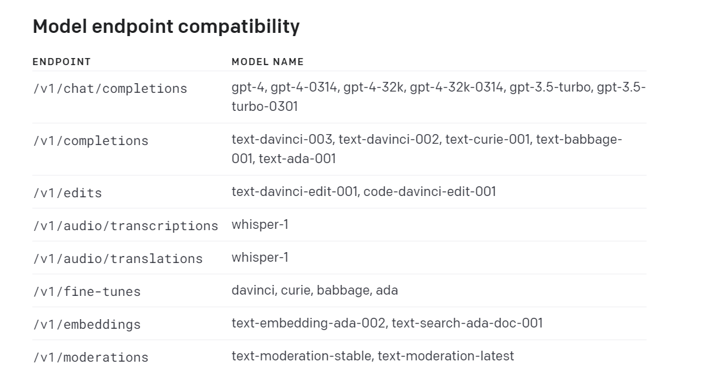

# 前言

最近在完成我的毕设,有一个使用ChatGPT提问的功能,所以就来玩玩咯

使用的是python和openai这个库 开发工具是vscode  然后用的jupyter这个交互式笔记本,这个东西很有用,可以保留历史输出记录,这样就能节省我们不少token

# 介绍


第一列代表一个类型,比如有聊天,创作,音频处理等等, 第二列是对应有哪些模型



# 环境搭建

## 安装openai库

```
pip install openai
```


# 完成类模型

这类模型只能进行一次问答,就是你提问它回答,或者说你让他做一件事情,他完成好回复你,代码如下

```python
import os
import sys
import openai
import json

openai.api_key = sys.argv[1]
response = openai.Completion.create(
    engine="text-davinci-003",
    prompt="中国的首都是?",
    temperature=0.9
)
print(json.dumps(response1,ensure_ascii=False,indent=2))
```

它的回复格式如下

```json
{
  "id": "cmpl-7BOcWIGMa8dam4xtHwbQKy8kYqSat",
  "object": "text_completion",
  "created": 1682950604,
  "model": "text-davinci-003",
  "choices": [
    {
      "text": "\n\n北京。",
      "index": 0,
      "logprobs": null,
      "finish_reason": "stop"
    }
  ],
  "usage": {
    "prompt_tokens": 11,
    "completion_tokens": 7,
    "total_tokens": 18
  }
}
```


# 聊天类模型

聊天类模型就是可以连续对话,但是每次对话你必须把前面的问题与回答都要传上去,这样是非常消耗token的

## 单独一次对话

```python
import os
import sys
import openai
import json

openai.api_key = sys.argv[1]
# 聊天模型的使用方法
messages=[{"role": "system", "content": "You are a helpful assistant."},
        {"role": "user", "content": "中国的首都是?"}]
    
response2 = openai.ChatCompletion.create(
        model="gpt-3.5-turbo",
        messages=messages
  )
print(json.dumps(response2,ensure_ascii=False,indent=2))

```

输出格式如下:

```json
{
  "id": "chatcmpl-7BOw1ixdrVHz6i5nX6sK89JgbonSr",
  "object": "chat.completion",
  "created": 1682951813,
  "model": "gpt-3.5-turbo-0301",
  "usage": {
    "prompt_tokens": 25,
    "completion_tokens": 7,
    "total_tokens": 32
  },
  "choices": [
    {
      "message": {
        "role": "assistant",
        "content": "中国的首都是北京。"
      },
      "finish_reason": "stop",
      "index": 0
    }
  ]
}
```

## 连续对话

```python 
import os
import sys
import openai
import json

openai.api_key = sys.argv[1]

messages=[{"role": "system", "content": "You are a helpful assistant."}]

def chatGPT(messages):
    response = openai.ChatCompletion.create(
        model="gpt-3.5-turbo",
        messages=messages)
    
    return response["choices"][0]["message"]

while True:
    answer = input("输入你的问题:\n")
    messages.append({"role": "user", "content": answer})
    response = chatGPT(messages)
    print("回答如下:")
    print(response["content"])
    messages.append(response)
```


# 图片模型

```

```


# 请求参数


## 通用参数

* model  这个是选择的模型参数  必须
* 


# 回复格式