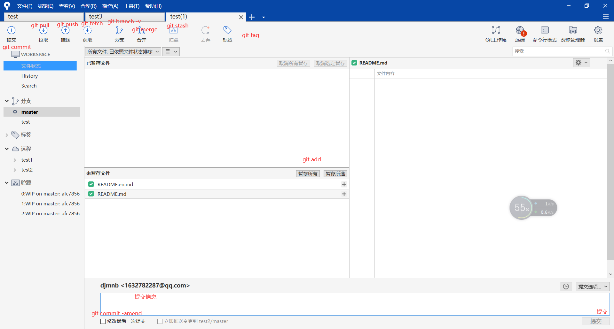
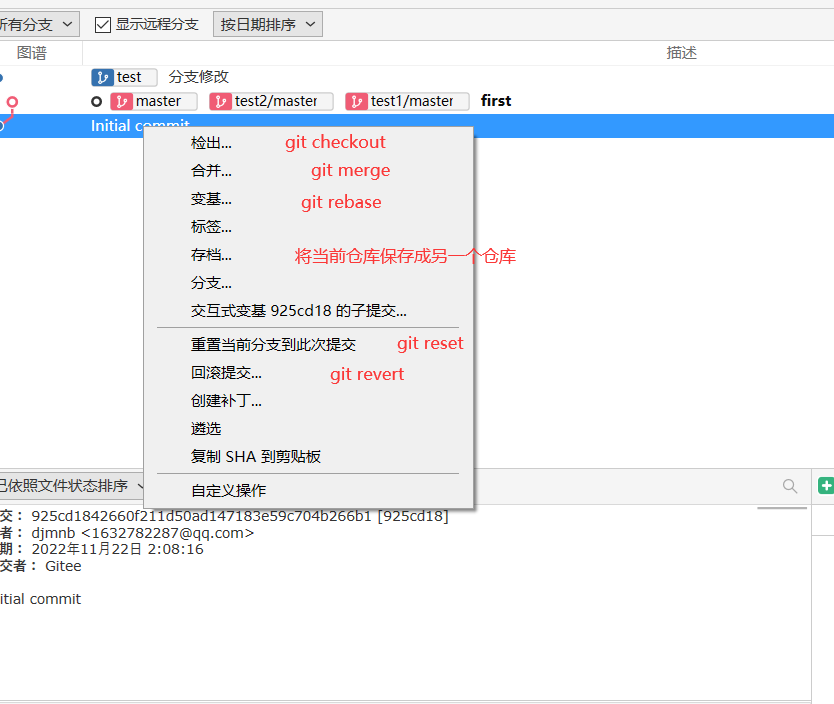

### 什么是git

git是一个**"分布式"** **"版本控制"** 系统,简明扼要

什么是版本控制: 就是当你进行了修改,它会帮你保存原先的版本,当你想用原先版本的时候,它能帮你找到原先版本并且恢复过来

什么是分布式: 就是你可以从任何一个远程仓库中克隆过来,也可以提交到任何一个远程仓库,而不局限于某一个仓库

### 基本概念

工作空间:就是创建git仓库的目录(.git除外)

暂存区: 用于存放于 git add 文件的地方,可能有人会说了,直接提交到仓库不就好了吗?对,确实可以,但是你想啊,每次改变一个文件就要提交一次,你不烦啊,我们可以改变以后一次提交嘛,而且你提交之后,就会有新纪录,如果你改一个文件就提交一次那不得产生很多版本吗?,到时候回退都不知道咋整,所以得整体改变完了后再做一次提交,改了部分就直接放到暂存区,还有就是,你暂存了之后,如果不对还能把它拿出来修改,如果直接提交了再做修改则又是一次提交

仓库: 就是存放你历史信息的地方(.git)

### 基本命令

#### init

* git init 当前目录初始化仓库
* git init path 指定目录初始化仓库
* git

#### add

将修改的文件提交到暂存区

#### commit

将暂存区的文件提交到仓库中,**而不是将工作目录中的文件提交到仓库中**

* **-m** 添加提交消息
* **-a** 将**所有追踪的而且修改的文件**放入暂存区,一次提交
* **--amend** 如果我们已经提交了暂存区的东西,但是我们发现还有已经修改的文件没有提交到暂存区,我们需要把修改的文件提交到暂存区,然后使用--amend参数提交,这样就只有一次提交记录

#### diff

* git diff 输出 工作目录与暂存区的区别(如果暂存区没有,则输出工作区与最近一次提交版本的区别)
* git diff --staged/cache 输出暂存区与最近一次提交版本的区别

输出信息说明:

diff --git a/test4.txt b/test4.txt  (a/test4.txt 是修改前 b/test4.txt 是修改后)
index d00491f..0cfbf08 (修改前后的hash值) 100644(文件权限) 
--- a/test4.txt (修改前文件)
+++ b/test4.txt (修改后文件)
@@ -1 +1,2 @@ (修改前文件从第一行开始,总共一行(默认一行), 修改后文件从第一行开始,总共两行)
\- 修改前文件位置内容
\+ 修改后文件对应内容
\+ 修改后文件对应内容

#### rm

这里是一个难以理解的点,请先看额外补充中git rm 与 rm 的区别

* git rm 直接删除文件而且提交"修改文件"到暂存区
* git rm --cached 不删除文件 提交"修改文件"到暂存区

#### mv

移动文件(可以做改名和删除操作)

#### log

输出**这个版本**以前的历史版本信息,因为我们有时候会回退,所有当前版本不一定是最新版本

常用参数

* -p 输出版本信息的同时,输出两次对比
* --stat 输出这个版本的简略信息,有多少行被增加,多少行被删除
* --pretty=oneline 将hash值与提交信息放在一行
* -n 显示最近n次提交记录
* --since, --after  仅显示指定时间之后的提交。
* --until, --before 仅显示指定时间之前的提交。
* --author 显示作者匹配字符的提交
* --grep 显示提交说明中包含指定字符的提交

#### reflog 

显示可引用的历史版本记录,就是显示在本地仓库的操作的历史版本记录,如果你不小心回退了回去,又不记得以前版本的hash值,你可以通过这个查看,如果是克隆远程仓库下来,你是看不了别人操作记录的,我觉得这个也很合理,别人没有创建分支来记录这个东西,确实没有必要看这些操作,只需要本地能够操作就行

#### clone

将远程仓库克隆到本地,默认创建orgin远程用户

* git clone url  克隆仓库的所有分支

* git clone url -b 分支 克隆仓库的指定分支

  

#### checkout

可以切换分支,也可以创建分支,还可以移动HEAD指针位置

* git checkout name 切换分支
* git checkout -b name 创建分支并且切换分支
* git checkout commitid 移动HEAD 指针到这个位置,但是并不会创建分支

#### switch

* git switch name 切换分支
* git switch -c name 创建分支(在当前版本上创建)并且切换分支
* git switch -c name commitid 创建commitid对应版本的分支并且切换分支

#### branch

* git branch 查看所有分支
* git branch name 创建分支
* git branch -v 查看所有分支的最后一次提交
* git branch --merged name(默认为当前分支名字) 查看和name已经合并的分支
* git branch --no-merged  name(默认为当前分支名字) 查看和name没有合并的分支
* git branch -d name 删除分支
* git branch -r 显示远程仓库的分支

在a分支合并b a变成a和b合并体 但是b还在原地, 所以在 a 分支下 git branch --merged  是b 但是在b分支下 git branch --merged 是没有a的, 如果两个分支在同一个版本下,默认它两是合并的

#### merge

合并分支,如果两个分支都在同一条线上,就会快速合并(不会产生冲突),否则就看有没有冲突,如果有冲突则会将将不同的东西给列出来,生成一个新的同名文件到工作空间,等着我们去修改,修改完后再提交到暂存区,在提交到仓库

* git merge branchname    合并本地分支
* git merge 远程仓库明/branchname   合并远程分支

#### tag

给当前版本打标签,就跟书签是一样的概念

* git tag tagname commitid 给commitid这个版本打一个简单标签
*  git tag -a tagname commitid -m 标注信息   给commitid这个版本打一个注解标签
* git tag -d tagname 删除标签

#### 撤销操作

* restore file (推荐使用)
* checkout -- file    这个命令功能与上面的是一样的,将文件还原为与上一次提交的文件的状态  **这两个命令只能操作已修改状态的文件,不能操作暂存区的文件**
* restore --staged  file(推荐使用)
* reset HEAD file 同上 将文件从暂存区移除到当前目录,如果此时文件已经被修改了,那么就是直接删除

#### reset

重置到某个版本,但是这个版本之后的记录将不会出现在历史记录中(也就是git log 是看不到这个版本之后的提交记录的,可以通过git reflog 找到上一次重置的版本号,再一次重置回去,就能找到历史记录了)

* git reset == git reset --mixed 工作目录文件保持不变(但是与重置的版本不同则状态会变成已修改,相当于我们在重置版本的文件上,修改成为当前目录文件)
* git reset --soft 工作目录文件不变(但是与重置版本不同,状态则会变成暂存,相当于我们暂存了一次重置版本的文件,然后修改了目录文件为工作目录文件)
* git reset --hard 工作目录变成重置版本文件

#### revert

回退到某个历史版本,但是这个回退操作相当于一次提交,他的功能和reset很像,但是还是有区别的,详情请看额外补充

#### rebase

**能进行分支合并**,与merge的区别请看额外补充,这个还能修改历史提交,也请看额外补充

* git rebase branchname 合并分支 每一个不同的提交都需要去操作一下如果有冲突,就需要解决冲突

#### remote

* git remote add name url  添加远程仓库(不写name 默认为orgin)
* git remote 查看远程仓库名字
* git remote -v  查看远程仓库名字对应url
* git remote rename oldname newname 修改名字
* git remote remove name 删除远程仓库
* git remote set-url name url 更改url

#### fetch 

拉取远程仓库的最新分支到本地,

* git fetch repositoryname  更新所有分支
* git fetch repositoryname branch 更新指定分支

#### pull

拉取远程仓库最新分支并且进行合并,如果远程仓库版本低于当前分支则会生成对比文件,需要我们自己去修改,然后再提交

* git pull 远程仓库名字 分支
* git pull --rebase 远程仓库名字 分支 合并的时候选择用rebase这个方式

#### push

* git push repositoryname localbranchname:remotebranchname 推送本地分支到远程分支上
* git push repositoryname :remotebranchname == git push name --delete remotebranchname 删除远程仓库分支
* git push repositoryname 推送所有分支到远程仓库
* **git push -u 远程仓库名字 分支名**  推送分支到远程仓库,并且创建与之对应的上流分支关系,以后在这个分支上可以直接执行git push命令就能将这个分支推送上去
* -f  强制推送

#### stash

我们在一个分支上修改了很多文件,但是我们现在需要切换到另一个分支去工作,我们又不想提交一次当前分支,所以我们需要储藏当前分支的内容,当我们回到这个分支的时候,再将数据恢复过来

* git stash 将当前工作区,暂存区的已追踪的文件放到贮藏区里面,**这个结构是堆栈结构**
* git stash list 查看贮藏区所有的东西
* git stash apply stash@{编号} --index 将贮藏区的东西恢复到当前目录,如果不加--index 则不会恢复已暂存的

### 额外补充

记住，在 Git 中任何 **已提交** 的东西几乎总是可以恢复的,也可以说任何已经提交的东西都是无法删除的,除非你删掉.git。 

#### git rm 与 rm 有什么区别?

rm 是删除本地文件 这也算是对文件的一种操作,和修改这个文件是一样的,这个时候git会把它当成已修改文件处理,所以这个文件不在暂存区中,当你直接commit的时候你commit不了,必须使用commit -am 提交

当前使用 git rm的时候 git会直接把这个以修改文件直接暂存起来 当你直接使用commit的时候也能commit

无论使用git rm(后面不带--cached) 还是 rm 都可以删除文件 只要提交成功 git 都不会再追踪这个文件,它两的区别就在与提交的时候 需要使用的参数不同罢了,就跟跳过暂存区与不跳过暂存区一样 

总结:  rm a  + git add a == git rm a

同理 mv a b + git rm a + git add b == git mv a b

#### 本地远程分支

当我们使用clone 或者 remote add 的时候, 我们本地会创建一个本地远程仓库分支 比如 origin/master,这个分支是远程仓库的内容,我们是无法直接使用这个分支的,我们只能新创建一个分支去引用它,然后做提交到远程服务器,才能修改它,所以当我们使用git fetch 时,是把本地远程分支更新,不会影响到本地分支,我们也可以再通过git merge 去合并这个远程分支

#### 补丁

补丁其实就是一次提交记录,一个版本,我们可以把每次提交的东西都做成补丁,那补丁有什么用呢,它能够直接合并到一个分支里面,在rebase里面会有体现,我们一般不自己去打补丁,然后进行合并

#### reset revert rebase

这三个都能操作历史版本,那有什么区别呢?

如果我们只是想回到某个历史版本,这个版本到历史版本之间提交了的记录,我不要了,我们可以使用reset(适合单文件一个地方改了很多次,然后回退回去)

如果我们想留着这个版本到历史版本之间的提交记录,可以使用revert,但是会再产生一次提交记录

上面两个指令的操作其实功能都是一样的,回退到历史某个版本,但是,这个版本和历史版本之间做出的修改,我们是无法保存的,而且,我们完全可以不用上面这两个指令,我们完全可以新建一个分支到历史版本上,做相应的修改

如果我们需要这个版本与历史版本之间提交了的东西,我们需要使用rebase命令,去依次修改有冲突的版本,如果是两个人开发一个分支,那么这个命令就要小心的用了,首先使用了这个命令修改了历史版本后,必须强制推送,那边开发的人要先合并解决冲突才能继续干活

#### rebase合并分支流程及要点

假设我们现在在master分支,然后有一个test分支,这两个分支有两个相同的提交版本,两个不同的提交版本,我们现在要将test分支的东西合并到master分支后面,我们需要的命令时  **切换到test分支** 然后进行 **git rebase master**  这里会创建一个新的游离分支,游离分支的起始位置为master,这样就会依次将HEAD与test与master不同的提交版本进行merge操作,最后test分支会指向HEAD,我们还需要将master分支重置到这里,或者直接合并(快速合并) 

**只对尚未推送或分享给别人的本地修改执行变基操作清理历史， 从不对已推送至别处的提交执行变基操作**

#### rebase为什么可以对历史版本修改

有下面这么一个仓库,我想把提交信息"1" 改成 "3" (当然,也可以改文件,这里不做演示)

```shell
$ git log
commit db40dce754f63cba67bdf70871f0c04ace718023 (HEAD -> master)
Author: djmnb <1632782287@qq.com>
Date:   Tue Nov 22 16:39:23 2022 +0800

    2

commit 661f0b561591380f3b9c4a3a7187b5b165e49975
Author: djmnb <1632782287@qq.com>
Date:   Tue Nov 22 16:39:07 2022 +0800

    1
```

可以直接通过下面这个命令,根据提示直接改

```
git rebase -i HEAD~1 修改前一个版本信息
```

  上面这个命令和下面的等价,看完下面这组命令,你就知道rebase为什么就能修改历史版本信息

```shell
 git switch -c test  HEAD~1 # 创建一个临时分支,并且切换到临时分支
 git commit --amend -m "3" # 修改提交信息
 git switch master # 切换回原先分支
 git rebase test # 合并分支
 git branch -D test #删掉分支
 #更改成功(如果这一步有冲突,就会等你解决冲突)
 
# 如果有很多版本,那就是一个递归操作,知道所有的版本都修改完
 $ git log
commit a188fc1146864dd12ffcd28a72bb5c920e5590a8 (HEAD -> master)
Author: djmnb <1632782287@qq.com>
Date:   Tue Nov 22 16:39:23 2022 +0800

    2

commit 37d7ed5c2be4f0c52b5c345e1734c231d2647a11 (test)
Author: djmnb <1632782287@qq.com>
Date:   Tue Nov 22 16:39:07 2022 +0800

    3

 
```

我这样也可以,用来理解这个操作还是很好的

rebase命令会给你提供一个文档,让你更改里面的文字选择对哪个版本进行修改,退出后,会依次来到要修改的版本,然后进行修改,提交,这样其实是产生新的提交,原来的提交其实还在,只是我们看不到了,所以rebase修改历史记录的本质,不是修改,而是新建,隐藏旧提交,这样让我们看起来像是修改了

#### rebase 与 merge的区别

两个都能合并分支,但是merge合并的时候,不是线性合并,只是两个提交版本间的合并,而rebase合并的时候,会将发起合并所在分支中的所有在待合并的分支中没有的提交进行合并,这样的话,看起来是线性的,其实也不是线性的,只是原先那些提交记录,没有人去管他们,变成了游离分支,所以用git log查看不到原先的那些提交版本

#### git钩子

所谓钩子就是,再某一时刻,会被自动执行的代码,我们可以通过编写钩子代码,做到很多自动化的事,比如提交前干嘛,提交后干嘛,这个还是有点用处的,我么可以在用户提交后把提交来的东西转交给别处

#### 搭建git服务器

为了方便,首先先创建一个git用户

```shell
sudo useradd git
passwd git # 修改登录密码
su git # 切换到git用户
```

创建git仓库

```shell
cd ~
mkdir git
cd git
git init --bare test.git
```

现在可以克隆这个仓库了

```shell
git clone git@ip地址:/home/git/test.git
# 然后输入密码就可以了,如果不想输入密码,可以将本机的公钥放到/home/git/.ssh/authorized_keys 文件里面
```


#### sourceTree

其实吧,命令会一些基本就行了,咱们主要还是得用可视化啊,建议不要对这些命令钻的太深,但是一定要记住git可以做哪些操作,下面讲讲sourceTree中的操作对应哪些命令





#### 个人尝试删掉记录

我们可能在工作的时候,心里不爽,骂了两句老板,在代码里面,然后我们还提交到了远程库,第二题,又怂了,想从远程库里面吧骂老板那句话给删掉

##### 方法一(不能删除,但是也难被发现)

直接把远程分支删掉,然后在本地修改好后再推送上去,看起来很好,但是,远程库里面会多出来一条游离分支,虽然不能直接看到,但是只要checkout到那个游离分支里面去,就会看到我骂老板的话,如果不是可视化的平台,像gittee,gitlab这种,是无法被发现的(如果不记得commitid,以我目前的水平还不知道怎么发现)

##### 方法二

直接本地修改,再进行强制推送,好像这个和方法一也没什么区别(我可真是个大聪明)

总结:咱们还是不要乱骂老板,只要推送上去了,就会有记录,除非你直接删掉公司的仓库

#### 不在当前文件夹操作这个仓库

有时候,我们需要使用本地的git的钩子去操作另一个本地仓库(不知道你们有没有,我可以举个例子,比如我有一个服务器,我本地push一个页面到服务器的git仓库,但是它是一个裸仓库,看不到里面的东西的,而我的服务器部署的nginx需要这个页面,我需要把这个页面拿出来,这个时候我需要给服务器中心仓库设置钩子去自动更新服务器另一个不是裸仓库的仓库),但是这个路径有时候我把握不定,会造成更新失败,这个时候我们使用下面的命令

```
git --work-tree=仓库路径 --git-dir=仓库路径/.git 命令
```

