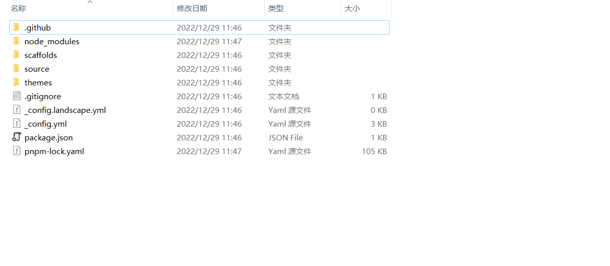
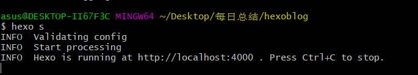
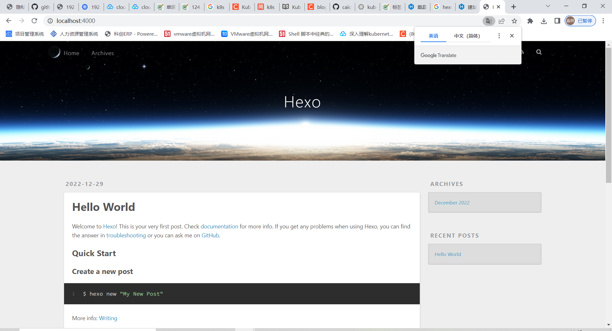

## 前言

我觉得hexo是一个非常不错的博客系统,非常轻量,非常适合程序员,我用过WordPress,我感觉它使用起来比较笨重,功能比较多,容易迷失自我,最最最让我受不了的是,你必须在那上面写文章,这是我最不能接受的(我不知道有没有什么可以改进的,至少我不知道)

## 安装nodejs

可以参考我的另一篇文章

## 安装git

这个比较简单,自行百度即可

## 安装hexo

```shell
# 全局安装hexo包
npm install -g hexo-cli
# 检查安装是否成功
hexo -v 
```

## 搭建博客

### 初始化博客

> 注意,这里是去GitHub克隆仓库,所以最好是能翻墙

```shell
# 来到一个空目录,用来存放博客
hexo init
```



成功后会产生上面文件

然后执行

```
# 启动博客
hexo s
```



访问后就能看到自己的博客了



### 博客文件解释

#### scaffolds

用来存放模板文件,比如文章的Front-matter内容,每次都会使用这里面的模板填充

#### source

用来存放文章,资源,标签,分类...这些东西的

#### _config.yml

用于配置网站信息的

#### package.json

用来存放下载的包,或者是插件这些

#### themes

存放主题

#### public

这个并没有出现在上面,是因为我们还没有hexo g 生成,这个是存放静态页面的,就是存放文章对应的html的地方

### 博客配置

> 下面只列出了我觉得有用的配置

```yaml
# 博客标题
title: 戴晶明的个人博客
# 博客描述,感觉也可以当座右铭
description: "不积跬步,无以至千里"
# 关键字
keywords: 博客系统
# 作者
author: 戴晶明
# 语言
language: zh-CN
# 时区
timezone: "Asia/Shanghai"

# 文章链接
url: https://djmnb.github.io

# 使用的主题(我这里用的是butterfly)
theme: butterfly

# 部署的时候,自动
deploy:
  type: git
  repository: git@github.com:djmnb/djmnb.github.io.git
  branch: master
```

### 主题配置

#### 下载主题

直接在博客目录下执行

```
git clone -b master https://gitee.com/immyw/hexo-theme-butterfly.git themes/butterfly
```

然后修改_config.yml里面的theme 为 butterfly

然后官方的建议的把 themes/butterfly/__config.yml (主题配置文件)这个文件复制一份出来到博客目录下命名为_config.butterfly.yml,我们修改这个文件就可以,以后我们更新了主题,也不用担心主题配置文件里面的内容丢了,这个确实有用

```
cp themes/butterfly/_config.yml ./_config.butterfly.yml
```


#### 安装插件

```shell
npm install hexo-renderer-pug hexo-renderer-stylus --save
```


### 解决图片路径问题

我是通过typora本地写好博客,然后推送到远程去的,但是啊,这个图片路径有时候会对不上,我的typora默认设置是../../img/${filename}assets,因此推送到服务器的时候肯定是找不到这个图片的,但是这个图片又存在服务器上,这个时候我们要动动脑子了,用js把图片和视频的路径属性改一下不就行了么,我们只需要在theme/butterfly/source/js/main.js(自己主题文件中)中加入下面这段js代码就行

```js
document.querySelectorAll("img").forEach((img)=>{
		if(img == null)return;
		let pos = img.src.indexOf("/img/"); // 这个路径要跟你hexo生成的图片路径对应上哈
		if (pos < 0)
		{
			return;
		}
		img.src = img.src.substring(pos);
		
	})
	document.querySelectorAll("video").forEach((video)=>{
		if(video == null)return;
		let pos = video.src.indexOf("/img/");
		if (pos < 0)
		{
			return;
		}
		video.src = video.src.substring(pos);
		
	})
```

### 自定义js与css

我们只需要把我们的js和css放到theme/主题/source/js或者css 里面就可以了

### 搭建评论区

去leancloud注册好账号,添加好应用,然后修改相应配置,具体方法自行百度


## 文件放置问题

我的建议是source目录下只放文章和一些图片就行, 书籍和代码这些放在根目录下,这些东西本就没必要渲染成html,只需要提交到GitHub就行
