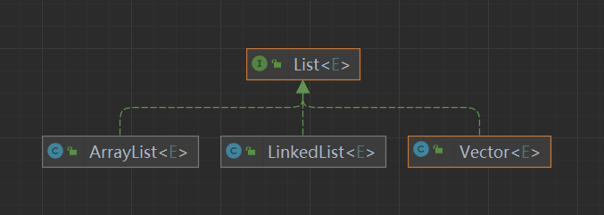
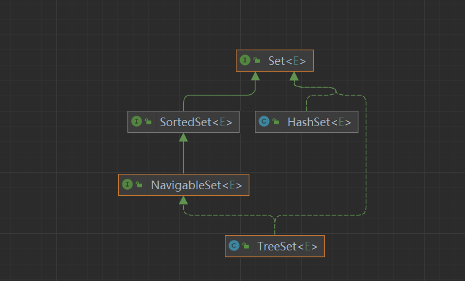
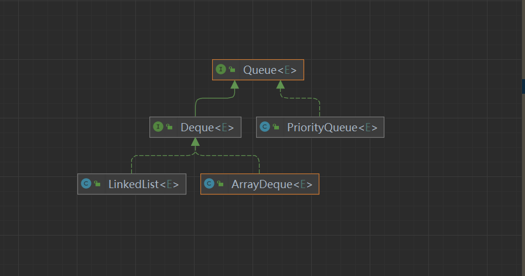

## Math

```java
public static double pow(double a, double b); // 计算a^b 注意返回值是double
public static long round(double a); // 四舍五入 注意返回值是long
public static double random(); // 返回[0,1) 的随机小数
public static double sqrt(double a); // 计算根号a, 注意返回值
public static double log(double a) ; // 计算log以e为底 a 的值
public static double log10(double a); // 以10为底


```

> 

## 数组

### 初始化

```java
int[] nums = new int[10];
int[] nums = new int[]{1,3,4};
// int[] nums = new int[3]{1,3,4} 这种是不行的哦,不能指定长度又赋值
int[] nums = {1,2,3,4}; 
// 二维,也不能指定长度又赋值
int[][] intss = new int[][]{
                {1,2,3},
                {1,2,3}
        };


```

数组具有Object 的所有方法,以及一个length属性

### 遍历数组

```java 
for(int i=0;i<nums.length;i++){....} // i 代表索引
for(int i:nums){....} // i 代表nums里面的数值
```

## Arrays

这个是java提供操作数组的工具类,对于需要使用到排序的地方,基本数据类型只能从小到大,引用数据类型要么实现Comparable接口,要么提供Comparator的实现类

### sort

有很多关于sort的重载方法,参数可以是基本数据类型,也可以是Object类型(因此可以为其他任何类型的数组排序,但是记得要实现Comparable接口或者提供Comparator的实现类

```java
	T[] nums = new T[10]; // 这里T代表基本数据类型
	Arrays.sort(nums);  //从小到大排序 
	Arrays.sort(nums,1,3) // 只排序[1,3) 这个区间里面的数据
	// 基本数据类型使用sort方法就只能实现升序,不能实现降序
    //因为泛型它不支持基本数据类型,因此无法提供一个关于int泛型的Comparator接口

	T[] nums = new T[10]; //这里T代表引用数据类型
	Arrays.sort(nums)  //如果要这么写,那么这个类必须实现了Comparable接口
    Arrays.sort(nums,(a,b)->{
        ..... // 你的判断逻辑,如果返回大于0的数则代表b应该和a换位置,否则就不换(b在后,a在前)
    })
```

### parallelSort

这个方法和sort的用法是一样的,但是当数据量超过某一个值的时候,这个方法会采用并行的方式排序,在多核处理下优势就明显了,如果数据量少于某个值,依然使用sort方法排序,这个值是2^13 8192

```java
public static void parallelSort(int[] a) {
        int n = a.length, p, g;
        if (n <= MIN_ARRAY_SORT_GRAN ||
            (p = ForkJoinPool.getCommonPoolParallelism()) == 1)
            DualPivotQuicksort.sort(a, 0, n - 1, null, 0, 0);
        else
            new ArraysParallelSortHelpers.FJInt.Sorter
                (null, a, new int[n], 0, n, 0,
                 ((g = n / (p << 2)) <= MIN_ARRAY_SORT_GRAN) ?
                 MIN_ARRAY_SORT_GRAN : g).invoke();
    }
```

### binarySearch

必须是排序好的数组,利用二分查找找到值所在的位置,如果值不存在,返回它应该在的下标+1的相反数

```java
nums = new int[]{1,3,5,7,9};
System.out.println(Arrays.binarySearch(nums,3)); //输出 1
System.out.println(Arrays.binarySearch(nums,4)); // 输出 -3
System.out.println(Arrays.binarySearch(nums,1,3,4)); //从[1,3) 这个数组区间去找
```

> 这个方法无法像c++ 的 lower_bound 和 upper_bound 一样找到第一个等于某个值的位置,和第一个大于某个值的位置,需要我们自己去写二分查找

### equals

比较两个数组元素是否相等

```java
 public static boolean equals(Object[] a, Object[] a2) {
        if (a==a2)
            return true;
        if (a==null || a2==null)
            return false;

        int length = a.length;
        if (a2.length != length)
            return false;

        for (int i=0; i<length; i++) {
            Object o1 = a[i];
            Object o2 = a2[i];
            if (!(o1==null ? o2==null : o1.equals(o2)))
                return false;
        }

        return true;
    }
```

### fill

填充数组的值

```java
int[] nums = new int[10];
Arrays.fill(nums,1); // 全部填充成1 
Arrays.fill(num,2,5,2); // [2,5) 填充成2
```

### copyOf

复制数组的值变成另外一个一个数组

```java
public static <T> T[] copyOf(T[] original, int newLength) {
        return (T[]) copyOf(original, newLength, original.getClass());
    }
```

### copyOfRange

复制某个区间的值变成另外一个数组

```java
public static <T> T[] copyOfRange(T[] original, int from, int to) {
        return copyOfRange(original, from, to, (Class<? extends T[]>) original.getClass());
    }
```

### asList

将可变参数变成list

```java
List<Integer> list = Arrays.asList(1,3,4); //这里参数可以写任意多
// Arrays.asList(new int[]{1,3,4}) ,这种方法只能得到一个元素的列表,泛型还是 int[],所有这个方法是不能将数组变成List的
```

> class java.util.Arrays$ArrayList 是这个方法产生的list对应的类,并不是ArrayList 哦

### toString

将数组内容变成字符串,如果是基本数据类型就是拼接字符串,如果是引用数据类型就是执行元素里面的toString 方法

```java
 int[] nums = new int[]{3,2,1};
 System.out.println(Arrays.toString(nums)); // [3,2,1]
```

### deepToString

如果是多维数组,那么toString 是没有办法将他们都转化成字符串的,显示的是地址值

```java
  int[][][] ints = { {{1, 2, 3}, {2, 3, 4}},{{1, 2, 3}, {2, 3, 4}}};
  System.out.println(Arrays.toString(ints)) // [[[I@61bbe9ba, [[I@610455d6]
  System.out.println(Arrays.deepToString(ints)); //[[[1, 2, 3], [2, 3, 4]], [[1, 2, 3], [2, 3, 4]]]
```

### setAll

根据元素的下标设置元素的值

```java
 nums = new int[5];
 Arrays.setAll(nums,a->a*a);
 System.out.println(Arrays.toString(nums)); // [0, 1, 4, 9, 16]
```

### stream

返回数组的流式数据,这个后面还会再总结

## Collection

Collection 接口中定义了set接口以及list接口通用的方法,掌握这里面的方法,就不用重复看他们的子接口,实现类的方法了

### 提供方法

```java
 int size();  //返回 集合中元素个数
 boolean isEmpty(); // 集合是否为空
 boolean contains(Object o); // 集合中是否包含某个元素,这里的形参不需要是泛型,因为这个方法肯定是通过比较两个对象的equals方法
 Iterator<E> iterator(); // 返回可以迭代整个集合的迭代器
 <T> T[] toArray(T[] a); // 将集合变成指定类型的数组,基本数据类型数组是不行的哦,int[]->T[] T=int 但是基本数据类型没有泛型
 boolean add(E e); // 添加一个元素 
 boolean remove(Object o); // 删除一个元素
 boolean containsAll(Collection<?> c); // 是否包含另外一个集合的全部元素
 boolean addAll(Collection<? extends E> c); // 添加一个集合的所有元素,这个集合的泛型对应的类必须跟我一样或者是我的子类
 boolean removeAll(Collection<?> c); // 移除集合c中包含的所有元素
 boolean retainAll(Collection<?> c); // 移除不在c中的元素
 void clear(); // 清空集合
Stream<E> stream(); // 用来得到Stream对象,后面会说
Stream<E> parallelStream(); // 并行流
```

> 这个接口就是站在一个很抽象的层面,不管你用何种数据结构,这些方法都是能够实现的,比如删掉某个元素,增加一个元素,,是否包含某个元素等等

### List接口

list接口是collection的子接口,因此它拥有collection的方法,list接口本身定义了很多方法,因此在它的子类中都会有实现,掌握list中的方法,就不用重复看其子类中的方法了

```java
E get(int index); //获取某个位置的元素
E set(int index, E element); // 设置某个位置的元素,返回原先位置的值
void add(int index, E element); // 在某个位置添加一个元素,这个位置及其后面的元素往后移动一个位置
E remove(int index); // 删除一个位置的元素
int indexOf(Object o); // 元素o 第一次出现的位置
int lastIndexOf(Object o); // 元素o 最后一次出现的位置
List<E> subList(int fromIndex, int toIndex); // 获得子列表
```




> 对比一下 E remove(int index);  boolean remove(Object o);  这两个方法,如果我们的泛型是Integer类型,那么就得格外小心了,你用Integer类型参数,调用的肯定是 boolean remove(Object o);你用的是int类型参数调用的肯定是E remove(int index);,如果你有一个Integer类型的参数,你又想删除它对应的下标,你必须将它变成int类型

ArrayList 和 linkedList 的区别在于底层实现

ArrayList 和 Vector 的区别在于 线程安全不安全, ArrayList是线程不安全的,Vector是线程安全的

> 这个接口感觉就具体些些了,我底层是按**"顺序"**(逻辑上一个元素紧挨一个元素),来存储数据的,因此肯定就有下标这么一说,那么就应该要提供关于下标的方法


### Set接口

Set也是collection的子接口,这个接口并没有额外的定义方法,全部都是collection接口里面的方法,set接口的规定所有的数据必须唯一



#### SortedSet接口

实现了这个接口的类,里面的数据都是会排序的,输出里面数据的时候一定是按顺序来的

```java
Comparator<? super E> comparator(); // 返回排序规则
// 返回 [fromElement,toElement) 这个区间里面的数据(是按照排序规则来的哦),返回结果也是SortedSet类型
SortedSet<E> subSet(E fromElement, E toElement); 
SortedSet<E> headSet(E toElement); //返回小于toElement的数据
SortedSet<E> tailSet(E fromElement); // 返回大于等于fromElement的数据 
E first(); //返回最小的数据
E last(); // 返回最大的数据

// 这里面的最小与最大都是相对于排序规则而言
```

我们可以通过这个接口来找第一个大于等于某个数,大于某个数,最后小于等于某个数,或者小于某个数的数

```java
public class ListTest {
    public static void main(String[] args) {

        SortedSet<Integer> set = new TreeSet<Integer>();
        set.add(3);
        set.add(7);
        set.add(5);
        set.add(6);
        //第一个大于等于5的数
        System.out.println(set.tailSet(5).first());
        // 第一个大于5的数
        System.out.println(set.tailSet(6).first());
        // 第最后一个小于5的数
        System.out.println(set.headSet(5).last());
        // 第最后小于等于5的数
        System.out.println(set.headSet(6).last());
    }
}

// 输出结果
5
6
3
5

```

##### NavigableSet接口

这个是soreted的子接口,它多出来的功能,其实就是上面我们那段代码实现的功能

```java
E lower(E e); // 找到最后一个小于e的元素,也就是小于e的最大值
E floor(E e); // 找到最后一个小于等于e的元素
E ceiling(E e); // 找到第一个大于等于e的元素
E higher(E e); // 找到第一个大于e的元素
E pollFirst(); //删掉最小的
E pollLast(); // 删掉最大的
    
```

> set的底层就是map, HashSet 是 对 HashMap对象的封装,TreeSet 是对 TreeMap的封装 

###### TreeSet 实现类

这个是上面接口的实现类,它具有上面接口的所有方法,自己还提供了一些去实现这些接口的方法,因此记住了上面set,SortedSet,NavigableSet接口定义的方法,那么TreeSet也就差不多了


### Queue接口

这个也是collection的子接口,拥有collection的全部方法,还自己提供了一些额外的方法哦

```java
boolean add(E e); // 这个是重写collection里面的方法,往队列里面插入一个元素
boolean offer(E e); // 这个也是往队列里面插入一个元素,跟add的区别在于,如果容器不够了,add会抛出异常,offer只会返回false
E remove();  // 拿出队首元素
E poll();  // 拿出队首元素  和 remove的区别在于, 如果队列为空,poll返回null,remove 抛出异常
E element(); // 查看队首元素
E peek(); // 查看队首元素, 和 element 的区别在于 如果队列为空,peek 返回null,element抛出异常
```

> 刷题的时候推荐使用 offer,poll,peek



#### Deque接口

这个是queue接口的子接口,这个是双向队列,在单向队列的基础上额外提供了在头部插入,尾部删除的功能

```java
// 这个接口的方法就是在Queue提供的方法上,加上Last,First
void addFirst(E e); // 队首添加
void addLast(E e); // 队尾添加
boolean offerFirst(E e); // 队首添加
boolean offerLast(E e);  // 队尾添加  offer和add的区别还是和queue中的一样
E removeFirst();  // 删除队首
E removeLast();  // 删除队尾
E pollFirst();	// 删除队首
E pollLast();	// 删除队尾  
E getFirst(); // 查看队首元素 这个和 element的功能一样
E getLast();  // 查看队尾元素 
E peekFirst(); // 查看队首
E peekLast();  // 查看队尾  这个和 get的区别就跟他和 element区别一样
// 下面这个几个方法,就和栈一样了,我们以后就用Deque的子类代替栈的使用了
void push(E e); // 往栈顶添加一个元素  等同于 addFirst
E pop(); // 弹出栈顶元素  ==  removeFirst
E peek(); // 查看栈顶元素  == getFirst

```


> 就不用java提供的stack的类了,它是继承了vector这个类再做的操作,我们可以直接使用双向队列替代

它的子实现类中 LinkedList底层用链表实现,ArrayDeque用数组实现

### 子实现类

在所有的子实现类中,一定有无参构造函数,和 只有一个参数,并且类型为collection的构造函数,其他的构造函数,要看具体的实现类的功能

下面举几个例子

```java
// ArrayList
public ArrayList();
public ArrayList(Collection<? extends E> c);
public ArrayList(int initialCapacity); // 因为底层是数组,可以设置大小
// PriorityQueue
public PriorityQueue();
public PriorityQueue(int initialCapacity,Comparator<? super E> comparator); // 需要排序
public PriorityQueue(Collection<? extends E> c); // 如果这个c属于排序类型的接口,那么会使用它的排序规则
```

## Map

map 是一种具有映射关系的数据结构,一个key对应一个value

### 提供方法

```java
int size(); // 返回元素个数
boolean containsKey(Object key); // 是否包含某个key
boolean containsValue(Object value); // 是否包含某个值
V get(Object key); // 根据key 找到对应的value
V put(K key, V value); // 更改key的value,并且返回原先的value
V remove(Object key); // 删除某个key,并且返回它的value值
void putAll(Map<? extends K, ? extends V> m); // 将某个map的元素加入到当前容器中,相当于取出m的每个key,value 执行put操作
void clear(); //清除所有的元素
Set<K> keySet(); // 获得所有key的set集合
Collection<V> values(); // 获得所有值的集合
// 为什么key 要用set来装,value用collection来装呢? 因为key必须唯一,value不需要
Set<Map.Entry<K, V>> entrySet(); // 获得实体对象集合
default v getOrDefault(Object key, V defaultValue); // 如果key存在,则返回对应的value,否则返回给定的value
default V putIfAbsent(K key, V value); //如果key值不存在才放入元素,否则不放入,返回key最终对应的value
default boolean remove(Object key, Object value); //当k,v都等于给定值时,才移除

```

### 提供的内部接口Entry

```java
 K getKey(); // 获取key
 V getValue(); // 获取value
 V setValue(V value); // 设置value (这个不推荐使用,因为有的实现类,不支持这个方法)
// 你可能会问,问什么没有setKey, 这个其实也好说,Entry通常不是我们自己new出来的,而是我们通过调用map的方法获得的,我们当然不能随意更改它的key值
```


### SortedMap接口

这个接口的定义就是里面的数据是按照key值来排序的

```java
Comparator<? super K> comparator(); //返回key的比较规则
SortedMap<K,V> subMap(K fromKey, K toKey); // 返回[fromKey,toKey) 这个区间的子map数据
SortedMap<K,V> headMap(K toKey); //返回key小于toKey的子map
SortedMap<K,V> tailMap(K fromKey); // 返回大于等于fromKey的子map
K firstKey(); // 返回最下的key
K lastKey(); // 返回最大的key
Set<K> keySet(); // 返回已经排好序的set,其实也就是实现了NavigableSet 接口的类
Collection<V> values(); // 返回按照key值排序对应的value的集合
Set<Map.Entry<K, V>> entrySet(); // 返回排好序的(k,v)键值对
```

#### NavigableMap接口

```java
Map.Entry<K,V> lowerEntry(K key);
K lowerKey(K key);
Map.Entry<K,V> floorEntry(K key);
K floorKey(K key);
Map.Entry<K,V> ceilingEntry(K key);
K ceilingKey(K key); 
Map.Entry<K,V> higherEntry(K key);
K higherKey(K key);
Map.Entry<K,V> firstEntry();
Map.Entry<K,V> lastEntry();
Map.Entry<K,V> pollFirstEntry();
Map.Entry<K,V> pollLastEntry();
// 这些方法是不是都很眼熟了,和上面NavigableSet 的是不是很像,不对,应该是说NavigableSet和这个很像
```

## collections

这个是操作map,collection类型的工具类

```java
public static <T extends Comparable<? super T>> void sort(List<T> list); // 对list进行排序
public static <T> void sort(List<T> list, Comparator<? super T> c); // 对list排序,指定排序规则
public static <T> int binarySearch(List<? extends Comparable<? super T>> list, T key) ; // 查找key在list中的位置
public static <T> int binarySearch(List<? extends T> list, T key, Comparator<? super T> c); // 指定规则查找key在list中的位置
public static void reverse(List<?> list); // 翻转list
public static void shuffle(List<?> list); // 随机打乱
public static void swap(List<?> list, int i, int j); // 交换list中两个位置的值
public static <T> void fill(List<? super T> list, T obj); // 填充list
public static <T> void copy(List<? super T> dest, List<? extends T> src); //复制src到dest
public static <T extends Object & Comparable<? super T>> T min(Collection<? extends T> coll); // 查找集合中的最下值
public static <T> T min(Collection<? extends T> coll, Comparator<? super T> comp); // 按照指定的规则查找最小值
public static <T extends Object & Comparable<? super T>> T max(Collection<? extends T> coll); // 查找集合中最大值
public static <T> T max(Collection<? extends T> coll, Comparator<? super T> comp); // 按照指定规则查找集合中的最大值
public static void rotate(List<?> list, int distance); // 就是将列表整体向后挪distance的距离,多出来的跑到前面去,这个distance可正可负
public static <T> boolean replaceAll(List<T> list, T oldVal, T newVal); // 替换oldval为newval
public static int indexOfSubList(List<?> source, List<?> target);// 查找source子列表包含target的第一个位置,如果不包含返回-1
public static int lastIndexOfSubList(List<?> source, List<?> target); // 查找source子列表包含target的最后一个位置,如果不包含返回-1
 public static <T> Collection<T> unmodifiableCollection(Collection<? extends T> c);
public static <T> Set<T> unmodifiableSet(Set<? extends T> s);
 public static <T> SortedSet<T> unmodifiableSortedSet(SortedSet<T> s);
 public static <T> NavigableSet<T> unmodifiableNavigableSet(NavigableSet<T> s);
public static <T> List<T> unmodifiableList(List<? extends T> list);
 public static <K,V> Map<K,V> unmodifiableMap(Map<? extends K, ? extends V> m);
 public static <K,V> SortedMap<K,V> unmodifiableSortedMap(SortedMap<K, ? extends V> m);
public static <K,V> NavigableMap<K,V> unmodifiableNavigableMap(NavigableMap<K, ? extends V> m);
//上述方法就是封装原来的对象,修改对应方法,让其不能修改
 public static <T> Collection<T> synchronizedCollection(Collection<T> c);
public static <T> Set<T> synchronizedSet(Set<T> s);
public static <T> SortedSet<T> synchronizedSortedSet(SortedSet<T> s);
public static <T> NavigableSet<T> synchronizedNavigableSet(NavigableSet<T> s);
public static <T> List<T> synchronizedList(List<T> list);
public static <K,V> Map<K,V> synchronizedMap(Map<K,V> m);
 public static <K,V> SortedMap<K,V> synchronizedSortedMap(SortedMap<K,V> m);
public static <K,V> NavigableMap<K,V> synchronizedNavigableMap(NavigableMap<K,V> m);
// 上述方法就是重写接口方法然后加上synchronized关键字,然后再方法体里面调用所给对象方法
public static int frequency(Collection<?> c, Object o) ; //某个元素出现次数

```

```java
 public static <E> Collection<E> checkedXXXXX();//这种方法就是为没有声明泛型的容器,限制只能往它这里面插入指定的数据类型
// 比如

List  list = new ArrayList();  //定义一个这样的列表,我们是可以添加任何数据类型进去的
list.add(1);
list.add("111"); // 不会报错
list = Collections.checkedList(list,Integer.class); // 限制他以后的数据类型,其实就是重写list的方法,插入数据的时候做检查
 list.add("111");// 会抛出类型转化异常
```

## Lambda

Lambda 可以简化代码,用**一个函数**就能替代一个**函数式接口**实现并**生成一个匿名类的对象**的代码,对比一下

```java
// 原先使用runnable创建进程
new Thread(new Runnable() {
            @Override
            public void run() {
                System.out.println("hello");
            }
        });
// 使用Lambda
 new Thread(() -> System.out.println("hello"));

```

感受到魅力了么

### 语法

```java
(参数列表) -> { 执行语句; }
// 如果只有一个参数,可以省略中括号()
// 如果函数体只有一条return 返回值 的语句 可以省略return 以及{}
// 如果函数接口里面的抽象方法没有返回值,并且函数体里面只有一条语句,而且这条语句还没有返回值,也能够省略{}
// 其他情况一律不可以省略
Consumer<String> consumer = s-> System.out.println(s); // 注意哦,这个Consumer只是一个接口,这个操作是不是相当于生成了一个匿名类的对象
// 我们不需要去写参数类型,返回值类型,因为这些都已经在函数式接口里面声明好了
```

### 方法引用

如果一个类已经存在的方法和函数式接口中定义的抽象方法返回值相同,参数相同,且接口中的方法能访问到这个引用方法,这样就能够直接使用这个类或者这个类的对象的方法应用充当Lambda

> 我们可以理解成,传进来的参数我们可以找到哪个现成的方法能帮我们做,我们就用这个方法就行

#### 通过类引用静态方法

这个就很简单了,就是引用一个类的静态方法

```java
Function<String,Integer> function = Integer::valueOf;
int apply = function.apply("10");
// 有没有感觉这种方式很巧妙,你需要将一个字符串变成整数,你只要使用我这个接口就行,我这个接口上的东西是可以拔插的
//我这次用的是Integer中的方法,我下一次可能就用别的方法了呢,是不就只要改一下引用的方法就可以了

// 上面的方法引用相当于(为了方便理解,没有简化Lambda)
Function<String,Integer> function = (a)->{
    return Integer.valueof(a);
}
```

#### 通过对象引用实列方法

这个也简单就是new一个对象然后使用它的方法

```java
Consumer consumer2 = System.out::println;
// 相当于下面这种格式(为了方便理解,没有简化Lambda)
Consumer consumer2 = (p) -> {
    System.out.println(p);
}
```

#### 构造方法引用

```java
Function<Integer,List<Integer>> function = ArrayList<Integer>::new;
// 相当于下面这种格式(为了方便理解,没有简化Lambda)
Function<Integer,List<Integer>> function = (a)->{
    return new ArrayList<Integer>(a);
}
```

> 上面这几种其实都比较好理解,可以将方法引用写成Lambda的正常格式
>
> 像不像就是把传进来的参数给引用方法去执行,然后将引用方法非返回值返回去就OK了,可以理解成c++里面的函数指针

#### 通过类引用实例方法

比如Object::toString,toString 明明是对象里面才能用的方法,为什么可以直接使用类名引用呢,其实编译器会将第一个参数作为对象调用这个方法,并且把后面的参数放入这个引用参数的后面

```java
Function<Object,String> function1 = Object::toString;

// 这种情况就等价于(为了方便理解,没有简化Lambda)
Function<Object,String> function1 = (o)->{
    return o.toString();
}
```

> 

## 函数式接口

函数式接口就是,接口中只能有一个抽象方法,这样就方便我们使用Lambda了,不过接口中还能有多个静态方法和default方法哦,不要被这个名字吓到哦,它其实也是一个接口,只不过只有一个抽象方法

### 常用函数式接口

#### Consumer

```java
void accept(T t); // 接收一个指定的数据
```

> 消费者

#### Supplier

```java
T get(); // 返回一个值
```

> 生产者

#### Function

```java
R apply(T t); // 接收一个参数,返回一个值

// 这个是泛型函数,可以对t参数先加工,然后再根据加工的值去得到R类型的参数
default <V> Function<V, R> compose(Function<? super V, ? extends T> before) {
        Objects.requireNonNull(before);
        return (V v) -> apply(before.apply(v));
    }
// 也是泛型函数,对返回的值再一次进行加工,
 default <V> Function<T, V> andThen(Function<? super R, ? extends V> after) {
        Objects.requireNonNull(after);
        return (T t) -> after.apply(apply(t));
    }
```

> 加工者

#### Predicate

```java
boolean test(T t); // 根据参数返回一个bool值

//两个测试做与操作
default Predicate<T> and(Predicate<? super T> other) {
        Objects.requireNonNull(other);
        return (t) -> test(t) && other.test(t);
    }
// 取反
 default Predicate<T> negate() {
        return (t) -> !test(t);
    }
// 或
 default Predicate<T> or(Predicate<? super T> other) {
        Objects.requireNonNull(other);
        return (t) -> test(t) || other.test(t);
    }
// 得到一个对象的测试者对象,用来检测其他对象是否跟我相等
static <T> Predicate<T> isEqual(Object targetRef) {
        return (null == targetRef)
                ? Objects::isNull
                : object -> targetRef.equals(object);
    }
```

> 检测者/测试者

## Stream

steam 并不是一个容器,它只是对容器的增强功能,添加了很多便利的操作,列如查找,过滤,分组,排序等操作,而且还支持串行与并行两种模式,在并行的情况下能充分利用多核CPU的优势,总而言之stream 就是提供了搞笑且易于使用的数据处理方式

Stream的特点:

* Stream不会自己存储数据
* Stream的操作不会改变原对象,他们会产生一个新的Stream对象
* Stream的操作是有延时的,它会等到需要结果的时候才会运行,也就是终端操作

Stream分为两个步骤,一个是中间操作,另外一个是终止操作,中间操作用来对数据加工,终止操作用来打印数据或者提取数据

> 使用stream刷题的时候,一定要引入Stream,像力扣这种默认只引入了java.util.*
>
> 我们需要手动引入: import java.util.stream.*

#### 通过数组创建

可以通过Arrays的stream方法对组创建

```java
IntStream stream1 = Arrays.stream(ints);
```

#### 通过集合创建

```java
Collection<Integer> collection = new ArrayList<>();
Stream<Integer> stream2 = collection.stream();
Stream<Integer> integerStream = collection.parallelStream();
```

#### 通过Stream提供的方法创建

```java
// 可以通过of创建
Stream<Integer> integerStream1 = Stream.of(1, 2, 4, 5);
//下面这两个是无限流 (要注意使用limit限制哦)
Stream.generate(Math::random);  // 根据supplier接口的方法创建数据
Stream.iterate(0,a->a+1);   // 迭代创建数据

```

### 中间操作

```java
Stream<T> filter(Predicate<? super T> predicate); // 过滤元素,返回true代表通过,将元素放到新的流中
<R> Stream<R> map(Function<? super T, ? extends R> mapper); // 将元素 进行一次加工
IntStream mapToInt(ToIntFunction<? super T> mapper);
LongStream mapToLong(ToLongFunction<? super T> mapper);
DoubleStream mapToDouble(ToDoubleFunction<? super T> mapper);
// 上面几个方法是将流转化为基本(数据类型流
<R> Stream<R> flatMap(Function<? super T, ? extends Stream<? extends R>> mapper); // 将多个流合并,有时候我们的数据可能是多维集合或者数组,我们希望将他们合并成一个流
 IntStream flatMapToInt(Function<? super T, ? extends IntStream> mapper);
 LongStream flatMapToLong(Function<? super T, ? extends LongStream> mapper);
 DoubleStream flatMapToDouble(Function<? super T, ? extends DoubleStream> mapper);
// 将多个流合并成基本数据类型的流
Stream<T> distinct(); // 去重,利用hashcode 与 equals方法
Stream<T> sorted(); // 排序
Stream<T> sorted(Comparator<? super T> comparator); // 按照指定规则排序
Stream<T> peek(Consumer<? super T> action); // 查看一遍元素,但是不对数据做任何改变(除非你要自己改变对象里面的属性),可以用于debug
Stream<T> limit(long maxSize); // 限制元素个数
Stream<T> skip(long n); // 跳过前n个元素

```

### 终端操作

```java
void forEach(Consumer<? super T> action);//循环遍历全部
Object[] toArray();//将元素变成数组
T reduce(T identity, BinaryOperator<T> accumulator);// 规约操作,给定一个初始值,然后进行规约操作,比如可以求和
Optional<T> reduce(BinaryOperator<T> accumulator);// 没有初始值的规约操作,比如求最大值,最小值
<R, A> R collect(Collector<? super T, A, R> collector); // 收集元素可选的有Colletctors.toList() toMap(function接口) toSet()
 Optional<T> min(Comparator<? super T> comparator); // 求最小值
Optional<T> max(Comparator<? super T> comparator); // 求最大值
long count(); // 元素个数
boolean anyMatch(Predicate<? super T> predicate);// 是否有一个满足要求
boolean allMatch(Predicate<? super T> predicate);//是否全部满足要求
boolean noneMatch(Predicate<? super T> predicate);//是不是全部没有满足要求

```

> 像基本数据类型的流并不是Stream的子类,而是他的兄弟类,有时候我们需要将IntStream这个样的流变成Stream流使用他的方法,比如collect,可以使用boxed方法进行转变

### 实战

学完了这么些东西,有没有中蠢蠢欲动的感觉,什么?,迎面走来的你让我蠢蠢欲动(hahahahah)

#### 数组变list

```java
// 我们一起是不是要先new 好list 然后循环去添加啊,那是真的烦人
List<Integer> list = Arrays.stream(ints).boxed().collect(Collectors.toList())
```

#### list变数组

```java
int[] ints1 = list.stream().mapToInt(a -> a).toArray();  // 这里的a->a是什么意思呢,无奖竞猜
```

## Optional

**Optional 是为了清晰地表达返回值中没有结果的可能性**

这个能减少我们对null值的判断,就能减少不少的ifelse,配合上Lambda和函数式接口,简直可以起飞,而且感觉逻辑也比较清晰吧

* 不要过度使用 Optional 避免降低代码可读性和性能
* 调用了返回值为Optional的方法后，一定要做空值检查
* 用来在某些地方替代if - else 我觉得很不错

```java
public static<T> Optional<T> empty(); //返回一个空的Optional
public static <T> Optional<T> of(T value); // 将一个非空的元素包装到optional中
public static <T> Optional<T> ofNullable(T value); // 允许值为空
public T get(); // 获取值 但是如果值为空会抛出异常,不推荐直接使用这个方法
 public boolean isPresent(); //检查值是否为空
 public void ifPresent(Consumer<? super T> consumer) ; // 如果值不为空,我们可以使用这个值
public Optional<T> filter(Predicate<? super T> predicate); // 检查这个值是否符合要求,符合继续返回这个optional对象,不符合返回空值对象
 public<U> Optional<U> map(Function<? super T, ? extends U> mapper); //将包装的值送到mapper里面返回一个包装了新的值的optional
 public<U> Optional<U> flatMap(Function<? super T, Optional<U>> mapper); // 与上面这个方法很像,但是创建optional的方式交给了mapper
 public T orElse(T other); // 值不为null返回值,否则返回我们给定的值
public T orElseGet(Supplier<? extends T> other); // 值不为null返回值,否则返回提供者提供的值

```

