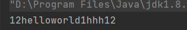

## 前言

正则表达式的基础部分已经学习完毕,接下来是学习java提供的正则表达式的库

## 库说明

 java提供的 java.util.regex 包 主要包含下面三个类:

* **Pattern类** 这个是用来设置正则表达式和对正则表达式进行编译,和得到Matcher类对象
* **Matcher类** 这个是用匹配数据和存放匹配结果的,我们可以通过这个类获得匹配好的数据和修改数据
* **PatternSyntaxException**类 这个看名字就知道是一个异常类,用来表示正则表达式中的语法错误

我们接下来就是学习这两个类

## Pattern类

这个类的构造方法是私有的,我们不能通过new的方法来创建对象,只能通过它提供的静态方法compile来创建对象

```java
 Pattern compile = Pattern.compile("hello"); // 基本匹配
```

我们发现这和标准的正则表达式  / pattern /flag 有些区别,它的匹配模式和标志符不在同一个字符串中, 我们需要使用传递参数的方式去给定标志符

以下是一些常见的 Pattern 标志：

1. CASE_INSENSITIVE：不区分大小写。
2. MULTILINE：启用多行模式。
3. DOTALL：允许点（.）匹配包括换行符在内的任意字符。
4. UNICODE_CASE：启用 Unicode 感知的大小写折叠。
5. CANON_EQ：启用规范等价匹配。

如果需要多个标志位一起使用需要使用 | 连接,

```java
 Pattern compile = Pattern.compile("hello"); // 基本匹配
// 多行匹配,点可以匹配换行符,大小写忽略
 Pattern compile1 = Pattern.compile("hello",Pattern.MULTILINE | Pattern.DOTALL | Pattern.CASE_INSENSITIVE);

```

**我们可能会好奇,为什么没有全局匹配呢?,那是因为全局匹配我们不需要去设置,可以在代码中迭代获取所有匹配,在java中它不是一次性把所有的字符串进行匹配,它是需要我们通过代码控制它一次一次往下面进行匹配**

## Matcher类

这个类的构造方法是Default,我们不能使用的时候new 这个类的对象出来,我们可以通过定义好的Pattern类对象去获得

```java
Matcher matcher = compile1.matcher("helloworldhelloworld"); 
```

这样是不是很合理,你得先有了匹配模式,然后用这个匹配模式得到一个匹配类对象

### 方法介绍

#### 索引

```java
public int start(); // 返回这次匹配成功字符串的起始位置  如果没有进行匹配或者没有匹配到会抛出异常
public int start(int group); // 返回这次匹配成功字符串中指定捕获分组的起始位置,如果没有进行匹配或者没有匹配到或者分组不存在到会抛出异常
// public int start() 等价于 public int start(0)
public int start(String name); // 这个是通过名字查找分组的起始位置,如果没有进行匹配或者没有匹配或者分组不存在到会抛出异常

public int end(); // 返回这次匹配成功字符串的最后一个位置+1  如果没有进行匹配或者没有匹配到会抛出异常
public int end(int group);// 返回这次匹配成功字符串中指定捕获分组的最后一个位置+1  如果没有进行匹配或者没有匹配到或者分组不存在会抛出异常
public int end(String name);//这个是通过名字查找分组的结束位置+1,如果没有进行匹配或者没有匹配或者分组不存在到会抛出异常


```

#### 查找

```java
public boolean lookingAt();//从开头开始查找,查看是否有匹配的字符串,这个方法会将查找区域移动到开头,会影响后面的查找,必须是开头的连续字符串符合要求才能算成功
public boolean find(); // 从当前位置开始查找,查找到之后,会将查找区域移动到这个匹配字符串后面,然后返回真,如果没有查找到返回false
public boolean find(int start）; // 重置查找区域到此位置,然后进行查找
public boolean matches(); // 看整个区域是否满足这个正则表达式,然后也会记录查找结果      


```

> 这些查找方法中,无论查找成功与否,都会向后移动查找区域

#### 分组

```java
public String group();  // 返回整个匹配的字符串
public String group(int group); // 返回当前匹配成功字符串中指定的捕获分组  
// group() 等价于 group(0)
public String group(String name); // 返回当前匹配成功字符串中指定名字的分组
public int groupCount(); // 返回分组数量,不包括0这个分组
```

> 如果在没有查找成功的情况下,使用这些方法会抛出异常

#### 替换方法

```java
// 在当前匹配到的结果位置的到这次匹配区域开头的所有字符串后拼接在replacement,然后将拼接好的字符串拼接到sb中
// 注意哦, 是当前匹配区域,不是一开始的匹配区域
public Matcher appendReplacement(StringBuffer sb, String replacement);
public StringBuffer appendTail(StringBuffer sb); // 将当前匹配区域所有的字符串添加到sb末尾,注意哦是当前区域
public String replaceAll(String replacement); // 将所有的匹配结果替换为replacement 并返回替换后的字符串
public String replaceFirst(String replacement); // 将第一个匹配结果替换为replacement


// matcher.replaceAll == while(matcher.find())matcher.appendReplacement(sb,replacement); appendTail(sb)
// matcher.replaceFirst == matcher.find();matcher.appendReplacement(sb,replacement); appendTail(sb)
// 所以如果我们想自己定制替换第几个匹配的我们可以这样做
// 这里是将第二个helloworld替换成hhh
  		Pattern compile1 = Pattern.compile("helloworld");

        Matcher matcher = compile1.matcher("12helloworld1helloworld12");

        StringBuffer sb = new StringBuffer();
        int i=2;
        while(matcher.find()){
            if(i == 1)
            {
                matcher.appendReplacement(sb,"hhh");
                break;
            }
            i--;
        }
        matcher.appendTail(sb);
        System.out.println(sb);

```

输出结果

