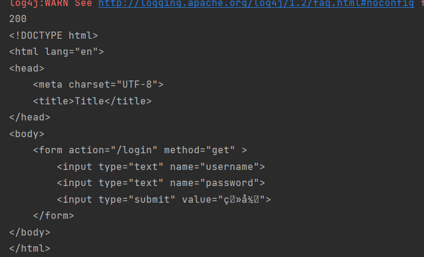
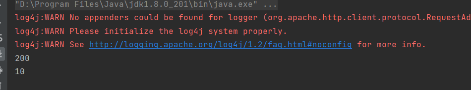
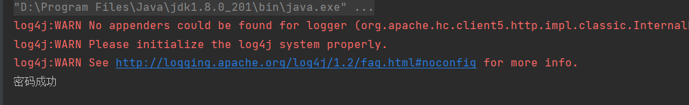
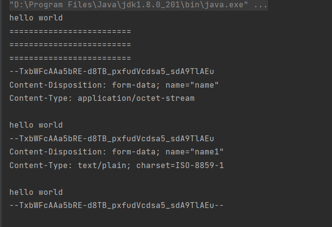
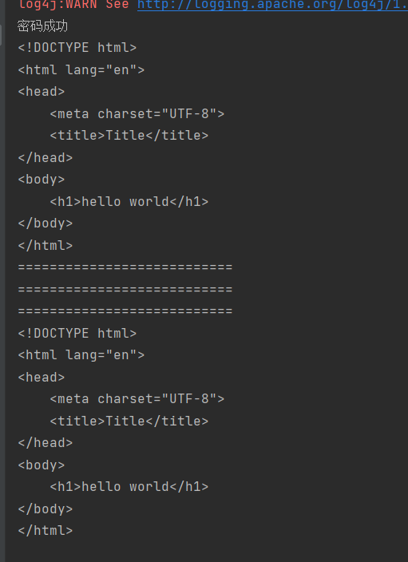

## 前言

Java 有很多好用的爬虫框架可供选择。以下是其中一些流行的爬虫框架：

1. Jsoup：Jsoup 是一个 HTML 解析器，可以方便地从 HTML 文档中提取数据。它可以模拟浏览器行为，解析 HTML 标签和属性，并提供了多种方法来选择和操作文档中的元素。
2. WebMagic：WebMagic 是一个基于 Java 的开源网络爬虫框架。它提供了强大的抓取和解析功能，支持多线程和分布式部署。WebMagic 还有一个基于注解的简单 API，可以方便地实现自定义的抓取逻辑。
3. HttpClient：HttpClient 是一个用于发送 HTTP 请求的 Java 库，可以用来构建爬虫。它提供了对多种 HTTP 协议的支持，可以处理 HTTP 请求和响应，并提供了多种方式来处理响应内容。
4. Selenium：Selenium 是一个用于自动化浏览器的工具，可以用来构建爬虫。它可以模拟用户在浏览器中的操作，如点击、滚动、输入等，并提供了多种方式来获取网页内容。
5. Spring Batch：Spring Batch 是一个用于批量处理的框架，可以用来构建爬虫。它提供了多线程、分步骤和分布式处理的支持，可以方便地处理大规模的数据抓取和处理任务。

这些爬虫框架都有其特点和优点，开发者可以根据实际需求选择合适的框架来构建自己的爬虫。

本文用与总结各种爬虫的使用方法

> 在此之前,我希望大家已经对计算机网络,Http,正则表达式有了一定的了解

## Jsoup

jsoup是非常简单实用的一个爬虫工具,支持html页面解析,生来就是用来爬html数据的,它能够接受服务器返回的数据类型只有:

text/\*, application/xml, or application/*+xml 这三种

### 引入依赖

```xml
 <dependency>
            <groupId>org.jsoup</groupId>
            <artifactId>jsoup</artifactId>
            <version>1.15.3</version>
        </dependency>
```

### 获取html

```java 
 	@Test
    public void test2() throws IOException {

        // 直接拿到解析好的文档模型
        Document document = Jsoup.connect("http://www.baidu.com").get();
        // 输出html
        System.out.println(document.body().html());
    }
```

### 发送post请求

```java
 	@Test
    public void test3() throws IOException {
        Document post = Jsoup.connect("http://localhost:8888/login")
                .data("username", "123")
                .data("password", "123")
                .post();
        System.out.println(post.body().html());
    }
```

我们还可以设置其他类型参数,比如文件,二进制数据,都可以通过data方法设置,而且可以设置多份,它会自己帮我们指定好合适的数据类型

### 拿到响应对象

我们发现上面的方式都是直接获得文档对象了,有时候我们可能需要响应头里面的一些东西比如cookie,我们就可以只拿响应对象

```java
 	@Test
    public void test4() throws IOException {
        Connection.Response execute = Jsoup.connect("http://localhost:8888/login")
                .data("username", "123")
                .data("password", "123")
                .execute();
        System.out.println(execute.cookies());
    }
```


## HttpClient

HttpClient **不是一个浏览器**。它是一个客户端的 **HTTP 通信实现库**。HttpClient 的目标是**发送和接收 HTTP 报文**。HttpClient **不会**去缓存内容，**执行嵌入在 HTML 页面中的 javascript 代码**，猜测内容类型，**重新格式化请求/重定向 URI**，或者其它和 HTTP运输无关的功能。

> 上面这句话是官方给PDF书籍翻译过来的,但是我在实际用的时候,发现这个版本的HttpClient执行重定向这个东西

### 引入依赖

我用的是5.x的版本

```xml
     <dependency>
            <groupId>org.apache.httpcomponents.client5</groupId>
            <artifactId>httpclient5</artifactId>
            <version>5.2.1</version>
        </dependency>
    <dependency>
        <groupId>org.slf4j</groupId>
        <artifactId>slf4j-log4j12</artifactId>
        <version>1.7.7</version>
    </dependency>
    <dependency>
        <groupId>org.apache.commons</groupId>
        <artifactId>commons-io</artifactId>
        <version>1.3.2</version>
    </dependency>
```

### 一个简单的GET请求

```java
public class test1 {
    // 为了代码简洁,我把异常都声明在方法上了,没有用try catch包裹
    public static void main(String[] args) throws IOException, ParseException {
        // 创建一个简化版浏览器(只能接受和发送报文)
        CloseableHttpClient aDefault = HttpClients.createDefault();
        // 创建一个Http请求,这个链接是一个重定向链接,会重定向到http://localhost:8888/login.html
        HttpGet httpGet = new HttpGet("http://localhost:8888/test1");
        // 执行请求
        CloseableHttpResponse execute = aDefault.execute(httpGet);
        // 输出响应状态码
        System.out.println(execute.getCode());
        // 将二进制实体内容变成字符串
        String content = EntityUtils.toString(execute.getEntity());
        System.out.println(content);
        // 关闭浏览器
        aDefault.close();
    }
}
```

输出如下



我们发现响应码居然是200,是不是验证了我们上面说的,httpclient执行了重定向请求,不然状态码应该是302的

### 往GET请求里面放置参数

这个简单,get的请求参数一般是跟URI拼接在一起的,我们只需要拼接字符串就可以了

```java
public class test2 {
    public static void main(String[] args) throws IOException, ParseException {
        CloseableHttpClient aDefault = HttpClients.createDefault();

        // 该请求返回id的值
        // 直接自己拼接在路径中
        HttpGet httpGet = new HttpGet("http://localhost:8888/test2?id=10");
        // 执行请求
        CloseableHttpResponse execute = aDefault.execute(httpGet);
        // 输出响应状态码
        System.out.println(execute.getCode());
        // 将二进制实体内容变成字符串
        String content = EntityUtils.toString(execute.getEntity());
        System.out.println(content);
        aDefault.close();
    }
}
```



我推荐直接使用直接拼接的方式,简单明了,一般get请求也不会有很多参数,参数的变化也不多

### 打断一下

其实啊,上面的那种执行请求的方法已经过时了,我么可以对比一下

```java
@Deprecated
 public CloseableHttpResponse execute(ClassicHttpRequest request) throws IOException {
        return this.doExecute(determineTarget(request), request, (HttpContext)null);
    }

 public <T> T execute(ClassicHttpRequest request, HttpClientResponseHandler<? extends T> responseHandler) throws IOException {
        return this.execute((ClassicHttpRequest)request, (HttpContext)null, (HttpClientResponseHandler)responseHandler);
    }

// 这两种方法的区别在于,第一种是需要我们自己去处理响应体的,第二种是我们可以用现在已经存在的处理响应的类去处理,这样可以解耦代码,而且还不需要我们自己考虑响应是否关闭的问题
// 后续的代码就都是用第二种方法了
```


### 发起POST请求

模拟表单登录

```java
public class test3 {
    public static void main(String[] args) throws IOException{
        CloseableHttpClient aDefault = HttpClients.createDefault();
        //模拟登录请求
        // 向这个地址发送账号密码登录
        HttpPost httpPost = new HttpPost("http://localhost:8888/login");
        // 创建请求实体
        HttpEntity httpEntity = EntityBuilder.create().setContentType(ContentType.APPLICATION_FORM_URLENCODED)
                .setParameters(new BasicNameValuePair("username","123"),new BasicNameValuePair("password","123")).build();
        // 放入请求体
        httpPost.setEntity(httpEntity);
        // 接收响应
        String execute = aDefault.execute(httpPost, new BasicHttpClientResponseHandler());
        System.out.println(execute);
        aDefault.close();
    }
}
```



其实啊,这里还有点问题的,虽然已经成功登陆,但是我们没有记录cookie值,但是我们还是能够访问index.html页面,但是吧,对于单个页面这样可能没有问题,但是当请求的网址多了,可能就有问题,或者不保险,这个问题我们后面再说

### 构建实体

POST请求一般将请求参数放在请求体里面,这个东西叫做请求实体,在Httpclient中有很多种请求实体,他们对应不同的数据,比如字符串,文件等等,大致就是分为字符串和二进制流两种

我一般采用构建实体的方法创建实体,而不是使用直接创建对象

有两个可以构建实体的类: EntityBuilder  和  MultipartEntityBuilder,看名字就知道了,一个是单个部分,一个是多部分,使用第一个,我们就只能上传一个文件或者一个字符串,使用第二个,我们可以上传多个字符串多个文件

> 其实啊无论是多部分还是单部分,最后都在同一个请求体里面,只不过多部分具有分割记录罢了,用来区分各个部分

#### EntityBuilder

它是支持链式操作的,它能够操作请求体里面的内容,可以放**字符串,二进制数据,文件,输入流,序列化的对象**,反正呢,这些只能选一个放进去

```java
 HttpEntity httpEntity = EntityBuilder.create().setContentType(ContentType.APPLICATION_FORM_URLENCODED)
                .setParameters(new BasicNameValuePair("username","123"),new BasicNameValuePair("password","123")).build();
// 这个内容类型我们其实可以不用设置,它都有默认的,列如字符串实体对应APPLICATION_FORM_URLENCODED,如果我们需要告诉服务器是json格式才需要改


EntityBuilder setText(String text); // 设置字符串
EntityBuilder setBinary(byte[] binary);  // 设置二进制数据
EntityBuilder setStream(InputStream stream);  // 设置流
EntityBuilder setParameters(List<NameValuePair> parameters); // 设置参数
EntityBuilder setSerializable(Serializable serializable);  // 设置序列化对象
EntityBuilder setFile(File file);  // 设置文件
        
```

#### MultipartEntityBuilder

这个也是支持链式操作的,它支持多部分,就是可以放多个文件啊或者文本进去的

```java
HttpEntity httpEntity = MultipartEntityBuilder.create().setContentType(ContentType.MULTIPART_FORM_DATA)
                .addTextBody("username","123")
                .addTextBody("password","123")
                .addBinaryBody("file",new File("test1/src/main/java/com/djm/user.java"))
                .build();
// 文本数据都用 addTextBody  二进制数据就用 addBinaryBody,它支持文件,输入流,byte
```

我们来对比一下两种构造器构造出来的实体有什么区别

```java
public class compare {

    public static void main(String[] args) throws IOException, ParseException {
        HttpEntity hello_world = EntityBuilder.create().setText("hello world").build();
        HttpEntity build = MultipartEntityBuilder.create().addBinaryBody("name", "hello world".getBytes(StandardCharsets.UTF_8))
                .addTextBody("name1", "hello world").build();
        System.out.println(EntityUtils.toString(hello_world));
        System.out.println("=========================");
        System.out.println("=========================");
        System.out.println("=========================");
        System.out.println(EntityUtils.toString(build));
    }
}
```



我们会发现单部分就只有一条原生字符串,但是多部分会添加很多的分隔部分

### 有状态连接

还记得我们在POST请求那个部分留下的坑吗,**因为我们根本没有保存上下文**,一般情况下,如果我们登录成功,浏览器会保存后服务器返回下来的cookie这些东西,而我们代码中根本就没有保存上下文,所有我们需要去定义一个上下文,每次请求带上它,虽然httpclient有缓存功能,也能请求页面,但是最保险的做法还是使用上下文


```java
public class test4 {
    public static void main(String[] args) throws IOException {
        CloseableHttpClient httpClient = HttpClients.createDefault();

        HttpPost httpPost = new HttpPost("http://localhost:8888/login");

        HttpEntity build = EntityBuilder.create().setParameters(new BasicNameValuePair("username", "123"),
                new BasicNameValuePair("password", "123")).build();
        httpPost.setEntity(build);

        // 创建上下文
        HttpClientContext httpClientContext = HttpClientContext.create();

        // 连同上下文一起发送请求,如果请求成功后,对上下文的更改也会同步
        String execute = httpClient.execute(httpPost, httpClientContext, new BasicHttpClientResponseHandler());
        System.out.println(execute);


        HttpGet httpGet = new HttpGet("http://localhost:8888/index.html");

        // 带上上下文
        String execute1 = httpClient.execute(httpGet, new BasicHttpClientResponseHandler());
        System.out.println(execute1);
        System.out.println("===========================");
        System.out.println("===========================");
        System.out.println("===========================");

        // 不带上上下文(因为有缓存原因,也能访问)
        String execute2 = httpClient.execute(httpGet, new BasicHttpClientResponseHandler());
        System.out.println(execute2);


    }
}
```

程序结果



上下文有两种,一种是BasicHttpContext,另外一种是HttpClientContext,下面试这两种的区别

* BasicHttpContext 是 HttpContext 接口的简单实现，提供了基本的上下文信息存储和获取功能，例如可以通过 setAttribute 和 getAttribute 方法来存储和获取上下文属性

* httpClientContext 比 BasicHttpContext 更专注于处理 HttpClient 相关的上下文信息，例如可以通过 setCredentialsProvider 方法设置凭据提供程序，通过 setAuthCache 方法设置认证缓存，通过 setRoutePlanner 方法设置路由计划器等

* BasicHttpContext 没有与 HttpClient 相关的方法，因此不能直接用于 HttpClient 的请求和响应处理过程中。HttpClientContext 可以直接用于 HttpClient 的请求和响应处理过程中，因为它包含了 HttpClient 所需要的上下文信息。

综上所述，如果只需要基本的上下文信息存储和获取功能，可以使用 BasicHttpContext。如果需要与 HttpClient 相关的上下文信息，则应该使用 HttpClientContext。


