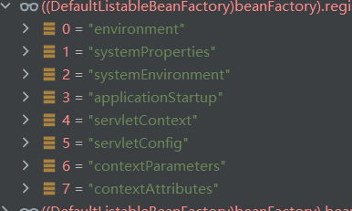

# maven + Tomcat + spring + springMVC 纯注解搭建web环境

创建maven项目

```shell
mvn archetype:generate -DgroupId=com.example -DartifactId=myproject -DarchetypeArtifactId=maven-archetype-webapp -DinteractiveMode=false

```

导入依赖

```xml
<dependencies>
    <!-- Spring -->
    <dependency>
        <groupId>org.springframework</groupId>
        <artifactId>spring-context</artifactId>
        <version>5.3.10</version>
    </dependency>

    <!-- Spring MVC -->
    <dependency>
        <groupId>org.springframework</groupId>
        <artifactId>spring-webmvc</artifactId>
        <version>5.3.10</version>
    </dependency>

    <!-- Servlet API -->
    <dependency>
        <groupId>javax.servlet</groupId>
        <artifactId>javax.servlet-api</artifactId>
        <version>4.0.1</version>
        <scope>provided</scope>
    </dependency>

    <!-- JSP API -->
    <dependency>
        <groupId>javax.servlet.jsp</groupId>
        <artifactId>javax.servlet.jsp-api</artifactId>
        <version>2.3.3</version>
        <scope>provided</scope>
    </dependency>
</dependencies>

```

创建配置类

```java
package com.example.config;

import org.springframework.context.annotation.ComponentScan;
import org.springframework.context.annotation.Configuration;

@Configuration
@ComponentScan(basePackages = "com.example")
public class AppConfig {
}

```

```java
package com.example.config;

import org.springframework.context.annotation.Bean;
import org.springframework.context.annotation.Configuration;
import org.springframework.web.servlet.ViewResolver;
import org.springframework.web.servlet.config.annotation.EnableWebMvc;
import org.springframework.web.servlet.config.annotation.WebMvcConfigurer;
import org.springframework.web.servlet.view.InternalResourceViewResolver;

@Configuration
@EnableWebMvc
public class WebConfig implements WebMvcConfigurer {

    @Bean
    public ViewResolver viewResolver() {
        InternalResourceViewResolver resolver = new InternalResourceViewResolver();
        resolver.setPrefix("/WEB-INF/views/");
        resolver.setSuffix(".jsp");
        return resolver;
    }
}

```

创建初始化类

```java
package com.example;

import com.example.config.AppConfig;
import com.example.config.WebConfig;
import org.springframework.web.WebApplicationInitializer;
import org.springframework.web.context.support.AnnotationConfigWebApplicationContext;
import org.springframework.web.servlet.DispatcherServlet;

import javax.servlet.ServletContext;
import javax.servlet.ServletException;
import javax.servlet.ServletRegistration;

public class WebAppInitializer implements WebApplicationInitializer {

    @Override
    public void onStartup(ServletContext servletContext) throws ServletException {
        AnnotationConfigWebApplicationContext applicationContext = new AnnotationConfigWebApplicationContext();
        applicationContext.register(AppConfig.class, WebConfig.class);

        DispatcherServlet dispatcherServlet = new DispatcherServlet(applicationContext);
        ServletRegistration.Dynamic registration = servletContext.addServlet("dispatcher", dispatcherServlet);
        registration.setLoadOnStartup(1);
        registration.addMapping("/");
    }
}

```


# EnableWebMVC的作用

```
@Retention(RetentionPolicy.RUNTIME)
@Target({ElementType.TYPE})
@Documented
@Import({DelegatingWebMvcConfiguration.class})
public @interface EnableWebMvc {
}
```

我们可以看到,他就导入了一个配置类,这个配置类干的事情可不少

```java
//
// Source code recreated from a .class file by IntelliJ IDEA
// (powered by FernFlower decompiler)
//

package org.springframework.web.servlet.config.annotation;

import java.util.List;
import org.springframework.beans.factory.annotation.Autowired;
import org.springframework.context.annotation.Configuration;
import org.springframework.format.FormatterRegistry;
import org.springframework.http.converter.HttpMessageConverter;
import org.springframework.lang.Nullable;
import org.springframework.util.CollectionUtils;
import org.springframework.validation.MessageCodesResolver;
import org.springframework.validation.Validator;
import org.springframework.web.method.support.HandlerMethodArgumentResolver;
import org.springframework.web.method.support.HandlerMethodReturnValueHandler;
import org.springframework.web.servlet.HandlerExceptionResolver;

@Configuration(
    proxyBeanMethods = false
)
public class DelegatingWebMvcConfiguration extends WebMvcConfigurationSupport {
    private final WebMvcConfigurerComposite configurers = new WebMvcConfigurerComposite();

    public DelegatingWebMvcConfiguration() {
    }

    @Autowired(
        required = false
    )
    public void setConfigurers(List<WebMvcConfigurer> configurers) {
        if (!CollectionUtils.isEmpty(configurers)) {
            this.configurers.addWebMvcConfigurers(configurers);
        }

    }

    protected void configurePathMatch(PathMatchConfigurer configurer) {
        this.configurers.configurePathMatch(configurer);
    }

    protected void configureContentNegotiation(ContentNegotiationConfigurer configurer) {
        this.configurers.configureContentNegotiation(configurer);
    }

    protected void configureAsyncSupport(AsyncSupportConfigurer configurer) {
        this.configurers.configureAsyncSupport(configurer);
    }

    protected void configureDefaultServletHandling(DefaultServletHandlerConfigurer configurer) {
        this.configurers.configureDefaultServletHandling(configurer);
    }

    protected void addFormatters(FormatterRegistry registry) {
        this.configurers.addFormatters(registry);
    }

    protected void addInterceptors(InterceptorRegistry registry) {
        this.configurers.addInterceptors(registry);
    }

    protected void addResourceHandlers(ResourceHandlerRegistry registry) {
        this.configurers.addResourceHandlers(registry);
    }

    protected void addCorsMappings(CorsRegistry registry) {
        this.configurers.addCorsMappings(registry);
    }

    protected void addViewControllers(ViewControllerRegistry registry) {
        this.configurers.addViewControllers(registry);
    }

    protected void configureViewResolvers(ViewResolverRegistry registry) {
        this.configurers.configureViewResolvers(registry);
    }

    protected void addArgumentResolvers(List<HandlerMethodArgumentResolver> argumentResolvers) {
        this.configurers.addArgumentResolvers(argumentResolvers);
    }

    protected void addReturnValueHandlers(List<HandlerMethodReturnValueHandler> returnValueHandlers) {
        this.configurers.addReturnValueHandlers(returnValueHandlers);
    }

    protected void configureMessageConverters(List<HttpMessageConverter<?>> converters) {
        this.configurers.configureMessageConverters(converters);
    }

    protected void extendMessageConverters(List<HttpMessageConverter<?>> converters) {
        this.configurers.extendMessageConverters(converters);
    }

    protected void configureHandlerExceptionResolvers(List<HandlerExceptionResolver> exceptionResolvers) {
        this.configurers.configureHandlerExceptionResolvers(exceptionResolvers);
    }

    protected void extendHandlerExceptionResolvers(List<HandlerExceptionResolver> exceptionResolvers) {
        this.configurers.extendHandlerExceptionResolvers(exceptionResolvers);
    }

    @Nullable
    protected Validator getValidator() {
        return this.configurers.getValidator();
    }

    @Nullable
    protected MessageCodesResolver getMessageCodesResolver() {
        return this.configurers.getMessageCodesResolver();
    }
}

```

**我们会发现这里面貌似也没注入bean到容器中去啊,当然,它是没有注入,但是他的父类WebMvcConfigurationSupport可是注入了不少**

`WebMvcConfigurationSupport` 类是 Spring MVC 的核心配置类，它负责向容器中注册默认的 Spring MVC 相关组件。下面列出了 `WebMvcConfigurationSupport` 类中注入的主要 Bean 及其作用：

1. **RequestMappingHandlerMapping**：处理 HTTP 请求与处理器（Controller）方法之间的映射关系。它是 Spring MVC 中最重要的 HandlerMapping 实现之一。

2. **HandlerMethodArgumentResolverComposite**：负责解析处理器方法的参数。它包含许多默认的 `HandlerMethodArgumentResolver` 实现，例如：`RequestParamMethodArgumentResolver`、`ModelAttributeMethodArgumentResolver` 和 `RequestBodyAdviceAdapter` 等。

3. **HandlerMethodReturnValueHandlerComposite**：负责处理处理器方法的返回值。它包含许多默认的 `HandlerMethodReturnValueHandler` 实现，例如：`ModelAndViewMethodReturnValueHandler`、`HttpEntityMethodProcessor` 和 `ResponseBodyAdviceAdapter` 等。

4. **RequestMappingHandlerAdapter**：负责处理执行处理器方法的适配器。它使用 `HandlerMethodArgumentResolverComposite` 解析参数，并使用 `HandlerMethodReturnValueHandlerComposite` 处理返回值。

5. **ExceptionHandlerExceptionResolver**：处理来自处理器方法的异常。它使用 `@ExceptionHandler` 标注的方法来处理异常。

6. **ContentNegotiationManager**：负责协商内容类型（Content-Type），用于确定客户端请求的响应类型。它使用多种策略（例如：URL 扩展名、HTTP Accept 头、默认内容类型等）来确定合适的内容类型。

7. **FormattingConversionService**：提供数据类型转换和格式化服务。它包含许多内置的类型转换器和格式化器，例如：日期、数字、枚举等。

8. **Validator**：用于验证数据模型对象。默认实现是 Hibernate Validator，它使用 JSR-303/JSR-380 Bean Validation 规范。

9. **HttpMessageConverter**：负责将请求体和响应体转换为特定的 Java 类型和反之。默认情况下，Spring MVC 提供了许多内置的消息转换器，例如：`StringHttpMessageConverter`、`MappingJackson2HttpMessageConverter` 和 `ByteArrayHttpMessageConverter` 等。

这些 Bean 只是 `WebMvcConfigurationSupport` 类中的一部分，默认情况下还会注册许多其他组件，例如：资源处理器、视图解析器、拦截器、跨域配置等。这些组件共同构成了 Spring MVC 框架的核心功能，使得开发者可以方便地构建 Web 应用程序。

通过上面两个类我们可以发现, **如果我们能够接管WebMvcConfigurationSupport, 我们就能够全面地接管springMVC**, 但是吧,这样也不建议做**,但是我们可以通过向容器中注入WebMvcConfigurer类型的bean进行充, 注意这个玩意是可以叠加的,而不是冲突**

# 容器启动

这里的容器启动流程跟AnnotationConfigApplicationContext的启动流程是一样的,只不过springMVC的容器里面做了一些其他的事,这里我们就只去了解不同的地方

看一下refresh吧,流程一样,只不过有些地方实现不同

```java
public void refresh() throws BeansException, IllegalStateException {
        synchronized(this.startupShutdownMonitor) {
            StartupStep contextRefresh = this.applicationStartup.start("spring.context.refresh");
            this.prepareRefresh();
            ConfigurableListableBeanFactory beanFactory = this.obtainFreshBeanFactory();
            this.prepareBeanFactory(beanFactory);

            try {
                // 这里是唯一跟AnnotationConfigApplicationContext不同的地方,里面进行了一些操作
                this.postProcessBeanFactory(beanFactory);
                StartupStep beanPostProcess = this.applicationStartup.start("spring.context.beans.post-process");
                this.invokeBeanFactoryPostProcessors(beanFactory);
                this.registerBeanPostProcessors(beanFactory);
                beanPostProcess.end();
                this.initMessageSource();
                this.initApplicationEventMulticaster();
                this.onRefresh();
                this.registerListeners();
                this.finishBeanFactoryInitialization(beanFactory);
                this.finishRefresh();
            } catch (BeansException var10) {
                if (this.logger.isWarnEnabled()) {
                    this.logger.warn("Exception encountered during context initialization - cancelling refresh attempt: " + var10);
                }

                this.destroyBeans();
                this.cancelRefresh(var10);
                throw var10;
            } finally {
                this.resetCommonCaches();
                contextRefresh.end();
            }

        }
    }
```


## this.postProcessBeanFactory(beanFactory);

```java
protected void postProcessBeanFactory(ConfigurableListableBeanFactory beanFactory) {
    // 向 BeanFactory 添加一个 ServletContextAwareProcessor 类型的 BeanPostProcessor，
    // 用于处理实现了 ServletContextAware 和 ServletConfigAware 接口的 Bean
    beanFactory.addBeanPostProcessor(new ServletContextAwareProcessor(this.servletContext, this.servletConfig));

    // 让 BeanFactory 忽略 ServletContextAware 接口的依赖，由 ServletContextAwareProcessor 进行处理
    beanFactory.ignoreDependencyInterface(ServletContextAware.class);

    // 让 BeanFactory 忽略 ServletConfigAware 接口的依赖，由 ServletContextAwareProcessor 进行处理
    beanFactory.ignoreDependencyInterface(ServletConfigAware.class);

    // 向 BeanFactory 注册 Web 应用的作用域（如 request、session 等）
    WebApplicationContextUtils.registerWebApplicationScopes(beanFactory, this.servletContext);

    // 向 BeanFactory 注册 Web 环境相关的 Bean，如 ServletContext、ServletConfig 等,会注入几个单实例bean
    WebApplicationContextUtils.registerEnvironmentBeans(beanFactory, this.servletContext, this.servletConfig);
}

```

这个方法的主要作用是对 BeanFactory 进行后置处理，以支持 Web 应用程序上下文的特性。具体包括：

1. 添加一个处理 `ServletContextAware` 和 `ServletConfigAware` 的 BeanPostProcessor。
2. 让 BeanFactory 忽略 `ServletContextAware` 和 `ServletConfigAware` 接口的依赖。
3. 向 BeanFactory 注册 Web 应用的作用域。
4. 向 BeanFactory 注册 Web 环境相关的 Bean。



后四个单实例bean是增加进去的


## WebApplicationContextUtils.registerWebApplicationScopes(beanFactory, this.servletContext);

这段代码位于 `WebApplicationContextUtils` 类中的 `registerWebApplicationScopes()` 方法。以下是带有代码注释的版本，解释了每一行代码的作用：

```java
public static void registerWebApplicationScopes(ConfigurableListableBeanFactory beanFactory, @Nullable ServletContext sc) {
    // 向 BeanFactory 注册请求作用域（request scope）
    beanFactory.registerScope("request", new RequestScope());

    // 向 BeanFactory 注册会话作用域（session scope）
    beanFactory.registerScope("session", new SessionScope());

    if (sc != null) {
        // 向 BeanFactory 注册应用程序作用域（application scope）
        ServletContextScope appScope = new ServletContextScope(sc);
        beanFactory.registerScope("application", appScope);

        // 将 ServletContextScope 存储在 ServletContext 的属性中
        sc.setAttribute(ServletContextScope.class.getName(), appScope);
    }

    // 向 BeanFactory 注册 ServletRequest 的依赖解析
    beanFactory.registerResolvableDependency(ServletRequest.class, new WebApplicationContextUtils.RequestObjectFactory());

    // 向 BeanFactory 注册 ServletResponse 的依赖解析
    beanFactory.registerResolvableDependency(ServletResponse.class, new WebApplicationContextUtils.ResponseObjectFactory());

    // 向 BeanFactory 注册 HttpSession 的依赖解析
    beanFactory.registerResolvableDependency(HttpSession.class, new WebApplicationContextUtils.SessionObjectFactory());

    // 向 BeanFactory 注册 WebRequest 的依赖解析
    beanFactory.registerResolvableDependency(WebRequest.class, new WebApplicationContextUtils.WebRequestObjectFactory());

    // 如果 JSF 存在，则向 BeanFactory 注册 JSF 相关依赖
    if (jsfPresent) {
        WebApplicationContextUtils.FacesDependencyRegistrar.registerFacesDependencies(beanFactory);
    }
}
```

这个方法的主要作用是向 BeanFactory 注册 Web 应用程序中的作用域和依赖解析。具体包括：

1. 注册请求、会话和应用程序作用域。
2. 注册 `ServletRequest`、`ServletResponse`、`HttpSession` 和 `WebRequest` 的依赖解析。
3. 如果 JSF 存在，注册 JSF 相关的依赖。


# 方法分析

## 1. protected final void processRequest(HttpServletRequest request, HttpServletResponse response)

```java
 protected final void processRequest(HttpServletRequest request, HttpServletResponse response) throws ServletException, IOException {
    // 记录请求处理开始的时间
    long startTime = System.currentTimeMillis();

    // 初始化一个 Throwable 类型的变量，用于存储处理请求过程中的异常信息
    Throwable failureCause = null;

    // 获取当前线程的 LocaleContext，稍后用于在请求处理完毕后恢复原始的 LocaleContext
    LocaleContext previousLocaleContext = LocaleContextHolder.getLocaleContext();

    // 根据当前请求构建一个新的 LocaleContext
    LocaleContext localeContext = this.buildLocaleContext(request);

    // 获取当前线程的 RequestAttributes，稍后用于在请求处理完毕后恢复原始的 RequestAttributes
    RequestAttributes previousAttributes = RequestContextHolder.getRequestAttributes();

    // 根据当前请求和响应构建一个新的 ServletRequestAttributes
    ServletRequestAttributes requestAttributes = this.buildRequestAttributes(request, response, previousAttributes);

    // 获取当前请求的 WebAsyncManager，它负责管理异步请求的执行
    WebAsyncManager asyncManager = WebAsyncUtils.getAsyncManager(request);

    // 为当前请求的 WebAsyncManager 注册一个名为 FrameworkServlet.RequestBindingInterceptor 的拦截器
    asyncManager.registerCallableInterceptor(FrameworkServlet.class.getName(), new FrameworkServlet.RequestBindingInterceptor());

    // 初始化请求处理所需的上下文环境（LocaleContext 和 RequestAttributes）
    this.initContextHolders(request, localeContext, requestAttributes);

    try {
        // 处理请求并生成响应
        this.doService(request, response);
    } catch (IOException | ServletException var16) {
        // 捕获 IOException 和 ServletException 异常
        failureCause = var16;
        throw var16;
    } catch (Throwable var17) {
        // 捕获其他类型的异常
        failureCause = var17;
        throw new NestedServletException("Request processing failed", var17);
    } finally {
        // 重置上下文环境（恢复原始的 LocaleContext 和 RequestAttributes）
        this.resetContextHolders(request, previousLocaleContext, previousAttributes);

        // 如果 requestAttributes 不为 null，则通知请求已完成
        if (requestAttributes != null) {
            requestAttributes.requestCompleted();
        }

        // 记录请求处理结果
        this.logResult(request, response, (Throwable)failureCause, asyncManager);

        // 发布请求处理完毕的事件
        this.publishRequestHandledEvent(request, response, startTime, (Throwable)failureCause);
    }
}

```


## 2. this.doService(request, response);

```java
protected void doService(HttpServletRequest request, HttpServletResponse response) throws Exception {
    // 记录请求信息（例如：请求 URI、请求方法等）
    this.logRequest(request);
    // 定义一个属性快照，用于存储请求中的属性
    Map<String, Object> attributesSnapshot = null;
    // 检查请求是否是 include 请求
    if (WebUtils.isIncludeRequest(request)) {
        attributesSnapshot = new HashMap();
        Enumeration attrNames = request.getAttributeNames();

        while (true) {
            String attrName;
            do {
                // 如果没有更多的属性，则跳出循环
                if (!attrNames.hasMoreElements()) {
                    break;
                }

                attrName = (String) attrNames.nextElement();
            } while (!this.cleanupAfterInclude && !attrName.startsWith("org.springframework.web.servlet"));

            // 将属性添加到属性快照中
            attributesSnapshot.put(attrName, request.getAttribute(attrName));
        }
    }

    // 将 WebApplicationContext、LocaleResolver、ThemeResolver 和 ThemeSource 设置为请求属性
    request.setAttribute(WEB_APPLICATION_CONTEXT_ATTRIBUTE, this.getWebApplicationContext());
    request.setAttribute(LOCALE_RESOLVER_ATTRIBUTE, this.localeResolver);
    request.setAttribute(THEME_RESOLVER_ATTRIBUTE, this.themeResolver);
    request.setAttribute(THEME_SOURCE_ATTRIBUTE, this.getThemeSource());

    // 如果 FlashMapManager 不为空，则处理 FlashMap 相关逻辑
    if (this.flashMapManager != null) {
        // 从请求中检索并更新 FlashMap
        FlashMap inputFlashMap = this.flashMapManager.retrieveAndUpdate(request, response);
        if (inputFlashMap != null) {
            // 将输入的 FlashMap 设置为请求属性
            request.setAttribute(INPUT_FLASH_MAP_ATTRIBUTE, Collections.unmodifiableMap(inputFlashMap));
        }

        // 设置输出 FlashMap 和 FlashMapManager 为请求属性
        request.setAttribute(OUTPUT_FLASH_MAP_ATTRIBUTE, new FlashMap());
        request.setAttribute(FLASH_MAP_MANAGER_ATTRIBUTE, this.flashMapManager);
    }

    // 保存之前的 RequestPath（如果 parseRequestPath 为 true）
    RequestPath previousRequestPath = null;
    if (this.parseRequestPath) {
        previousRequestPath = (RequestPath) request.getAttribute(ServletRequestPathUtils.PATH_ATTRIBUTE);
        ServletRequestPathUtils.parseAndCache(request);
    }

    try {
        // 调用 doDispatch() 方法处理请求
        this.doDispatch(request, response);
    } finally {
        // 如果异步处理未开始，并且属性快照不为空，则恢复 include 请求后的属性
        if (!WebAsyncUtils.getAsyncManager(request).isConcurrentHandlingStarted() && attributesSnapshot != null) {
            this.restoreAttributesAfterInclude(request, attributesSnapshot);
        }

        // 如果 parseRequestPath 为 true，则将 RequestPath 设置回之前的值
        if (this.parseRequestPath) {
            ServletRequestPathUtils.setParsedRequestPath(previousRequestPath, request);
        }
    }
}

```


## this.doDispatch(request, response);

```java
protected void doDispatch(HttpServletRequest request, HttpServletResponse response) throws Exception {
    // 定义处理过的请求和映射处理器
    HttpServletRequest processedRequest = request;
    HandlerExecutionChain mappedHandler = null;
    boolean multipartRequestParsed = false;
    WebAsyncManager asyncManager = WebAsyncUtils.getAsyncManager(request);

    try {
        try {
            ModelAndView mv = null;
            Object dispatchException = null;

            try {
                // 检查请求是否为多部分请求，如果是，则处理请求
                processedRequest = this.checkMultipart(request);
                multipartRequestParsed = processedRequest != request;
                // 获取处理请求的映射处理器
                mappedHandler = this.getHandler(processedRequest);
                if (mappedHandler == null) {
                    // 如果没有找到处理器，则返回 404
                    this.noHandlerFound(processedRequest, response); // 这里直接返回的话,就轮不到我们来操作了,如果想要数据返回格式统一,我们还得做点事情,比如
                    return;
                }

                // 获取处理器适配器
                HandlerAdapter ha = this.getHandlerAdapter(mappedHandler.getHandler());
                String method = request.getMethod();
                boolean isGet = HttpMethod.GET.matches(method);
                if (isGet || HttpMethod.HEAD.matches(method)) {
                    // 获取资源的最后修改时间，并检查请求是否需要处理
                    long lastModified = ha.getLastModified(request, mappedHandler.getHandler());
                    if ((new ServletWebRequest(request, response)).checkNotModified(lastModified) && isGet) {
                        return;
                    }
                }

                // 调用拦截器前置处理方法
                if (!mappedHandler.applyPreHandle(processedRequest, response)) {
                    return;
                }

                // 处理请求并获取 ModelAndView
                mv = ha.handle(processedRequest, response, mappedHandler.getHandler());
                if (asyncManager.isConcurrentHandlingStarted()) {
                    return;
                }

                // 应用默认视图名称（如果需要）
                this.applyDefaultViewName(processedRequest, mv);
                // 调用拦截器后置处理方法
                mappedHandler.applyPostHandle(processedRequest, response, mv);
            } catch (Exception var20) {
                dispatchException = var20;
            } catch (Throwable var21) {
                dispatchException = new NestedServletException("Handler dispatch failed", var21);
            }

            // 处理请求分发结果,如果我们的mv是没有视图的话,数据早就已经被写会个客户端了, 这里还会统一处理异常
            this.processDispatchResult(processedRequest, response, mappedHandler, mv, (Exception) dispatchException);
        } catch (Exception var22) {
            // 触发完成处理方法
            this.triggerAfterCompletion(processedRequest, response, mappedHandler, var22);
        } catch (Throwable var23) {
            // 触发完成处理方法
            this.triggerAfterCompletion(processedRequest, response, mappedHandler, new NestedServletException("Handler processing failed", var23));
        }
    } finally {
        // 如果异步处理已开始，则应用异步处理完成方法
        if (asyncManager.isConcurrentHandlingStarted()) {
            if (mappedHandler != null) {
                mappedHandler.applyAfterConcurrentHandlingStarted(processedRequest, response);
            }
        } else if (multipartRequestParsed) {
            // 如果请求是多部分请求，则进行清理
            this.cleanupMultipart(processedRequest);
        }
    }
}

```

我么可以看一下没有请求处理器的时候走的源码

```java
 protected void noHandlerFound(HttpServletRequest request, HttpServletResponse response) throws Exception {
        if (pageNotFoundLogger.isWarnEnabled()) {
            pageNotFoundLogger.warn("No mapping for " + request.getMethod() + " " + getRequestUri(request));
        }

        if (this.throwExceptionIfNoHandlerFound) {  // 如果允许抛出异常的话,就会抛出异常
            throw new NoHandlerFoundException(request.getMethod(), getRequestUri(request), (new ServletServerHttpRequest(request)).getHeaders());
        } else {
            response.sendError(404);  // 如果不允许的话,就不会抛出
        }
    }
```


关于视图解析器,参数解析器,返回值处理器这些,我就只去过了一遍源码,没有详细总结了


# 跨域请求配置

在Spring MVC中设置CORS全局配置和处理器CORS配置的方法如下：

1. **全局CORS配置**：要设置全局CORS配置，您需要在Spring MVC配置类中重写`addCorsMappings`方法并使用`CorsRegistry`对象进行配置。这里有一个例子：

```java
@Configuration
@EnableWebMvc
public class WebConfig extends WebMvcConfigurer {
    @Override
    public void addCorsMappings(CorsRegistry registry) {
        registry.addMapping("/**")
                .allowedOrigins("http://example.com")
                .allowedMethods("GET", "POST", "PUT", "DELETE")
                .allowedHeaders("header1", "header2", "header3")
                .exposedHeaders("header1", "header2")
                .allowCredentials(true).maxAge(3600);
    }
}
```

上面的配置允许来自`http://example.com`的跨域请求访问所有URL（`/**`），并限制了允许的HTTP方法、请求头、响应头和凭证支持。

2. **处理器CORS配置**：要为特定处理器设置CORS配置，您可以使用`@CrossOrigin`注解。将此注解添加到控制器类或处理器方法上，以指定CORS策略。下面是一个例子：

```java
@RestController
@RequestMapping("/api")
public class ApiController {
    @CrossOrigin(origins = "http://example.com")
    @GetMapping("/data")
    public ResponseEntity<String> getData() {
        return ResponseEntity.ok("Hello, world!");
    }
}
```

在这个例子中，`getData`方法允许来自`http://example.com`的跨域请求。`@CrossOrigin`注解也可以接受其他参数，如`methods`, `allowedHeaders`, `exposedHeaders`, `allowCredentials`, 和 `maxAge`。

注意：如果同时设置了全局CORS配置和处理器CORS配置，处理器CORS配置将优先于全局CORS配置。

通过使用`CorsRegistry`和`@CrossOrigin`注解，您可以轻松地在Spring MVC中配置CORS策略，并根据需要为整个应用程序或特定处理器设置CORS设置。


# 拦截器

在 Spring MVC 中，`HandlerInterceptor` 接口定义了三个方法，用于在请求处理的不同阶段执行自定义操作。这些方法分别是：

1. `preHandle(HttpServletRequest request, HttpServletResponse response, Object handler)`：在处理器（即 Controller 方法）执行之前调用。如果该方法返回 `true`，则请求继续向下执行；如果返回 `false`，则请求处理停止，不会调用后续的拦截器和处理器。这个方法通常用于权限控制、身份验证和请求参数校验等。

2. `postHandle(HttpServletRequest request, HttpServletResponse response, Object handler, ModelAndView modelAndView)`：在处理器执行之后、视图渲染之前调用。这个方法可以用来修改数据模型、处理异常等。注意，如果 `preHandle` 返回 `false`，则不会调用 `postHandle`。

3. `afterCompletion(HttpServletRequest request, HttpServletResponse response, Object handler, Exception ex)`：在请求处理完成后调用，即在视图渲染之后。这个方法通常用于清理资源、记录日志、监控性能等。即使在请求处理过程中发生异常，这个方法也会被调用。注意，如果 `preHandle` 返回 `false`，则不会调用 `afterCompletion`。

实现 `HandlerInterceptor` 接口时，你可以根据需要重写这些方法以实现自定义的请求拦截和处理逻辑。在实际应用中，你通常会继承 `HandlerInterceptorAdapter` 类，它提供了默认的空实现，这样你只需要重写需要的方法即可。


# 大概流程


```java
processRequest(){
	doService(){
		doDispatch(){
			try{
				// 通过请求处理映射器拿到请求处理器
				mappedHandler = this.getHandler(processedRequest);
                 // 如果没有拿到的话就抛出一个异常
                
                // 拿到适配器,适配器能够帮助我们统一处理不同的handler
                 HandlerAdapter ha = this.getHandlerAdapter(mappedHandler.getHandler());
                
                // 执行拦截器第一部分,preHandler 
                if (!mappedHandler.applyPreHandle(processedRequest, response)) {
                        return;
                    }
                // 执行handler,得到视图模型
                mv = ha.handle(processedRequest, response, mappedHandler.getHandler());
                
                // 如果没有出异常的话,就会执行拦截器的第二步
                mappedHandler.applyPostHandle(processedRequest, response, mv);
                
                // 到这里就请求响应完了
                
			}catch(Exception var20){
                //出现了异常,把异常存下来
                dispatchException = var20;
             }
            // 这里就是统一处理异常的地方,比如使用了controlleradvice这些,同时如果视图不为空,也会渲染视图,但是如果视图为空的话,数据早就已经写到response里面了
            this.processDispatchResult(processedRequest, response, mappedHandler, mv, (Exception)dispatchException);
            
            // 如果统一处理异常也出现异常,也会被捕获,最终一定会执行这个方法,拦截器的最后一步,然后将这个异常往上面抛出去
            this.triggerAfterCompletion(processedRequest, response, mappedHandler, var22);
		 }
	}
	
}
```


