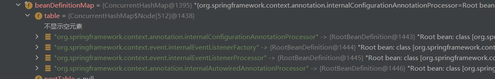
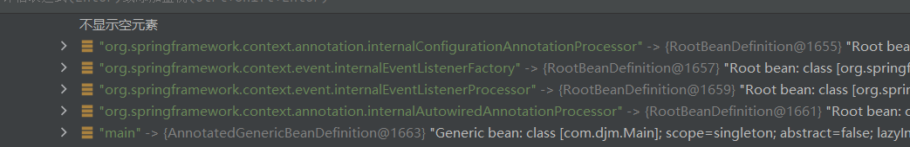
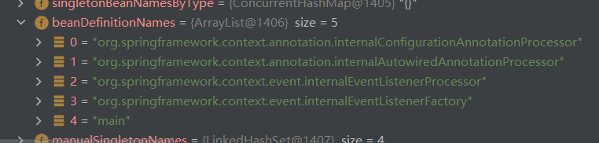
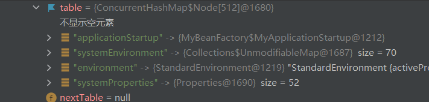
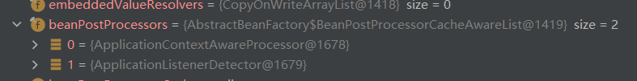

# AbstractApplicationContext抽象类

## 属性

### private ApplicationStartup applicationStartup

`ApplicationStartup` 接口是 Spring 框架提供的一个扩展点，允许开发者在 Spring 应用启动期间收集性能指标和监控数据。通过实现这个接口，你可以自定义收集和处理这些数据的方式，以便更好地理解和优化你的应用程序。

从 Spring Boot 2.4.0 和 Spring Framework 5.3.0 开始，`ApplicationStartup` 接口被引入。它允许开发者为 Spring 应用提供自定义的启动跟踪策略


# AnnotationConfigApplicationContext 类

## 属性

### AnnotatedBeanDefinitionReader  reader

用于获取bean的定义信息


### ClassPathBeanDefinitionScanner scanner


# AnnotationConfigRegistry  接口

## 方法:

```
void register(Class<?>... componentClasses); 

void scan(String... basePackages);
```


# 执行流程


## 0. AnnotationConfigApplicationContext(Class<?>... componentClasses)重点执行函数

```
// 初始化
1. this() 

// 得到每个配置类的bean的定义信息
2. this.register(componentClasses) 
  3. this.reader.register(componentClasses); 
  
// 更新容器
4.this.refresh();
  //
  5. this.prepareBeanFactory(beanFactory)  
  //
  6. this.invokeBeanFactoryPostProcessors(beanFactory)  
    7. PostProcessorRegistrationDelegate.invokeBeanFactoryPostProcessors
   	  
      8. invokeBeanDefinitionRegistryPostProcessors  
        9. postProcessor.postProcessBeanDefinitionRegistry(registry);
          10. this.processConfigBeanDefinitions(registry);
            11. ConfigurationClassUtils.checkConfigurationClassCandidate(beanDef, this.metadataReaderFactory)
      12.      

```


## 1. AnnotationConfigApplicationContext()

```java
 public AnnotationConfigApplicationContext() {
        StartupStep createAnnotatedBeanDefReader = this.getApplicationStartup().start("spring.context.annotated-bean-reader.create"); 
        this.reader = new AnnotatedBeanDefinitionReader(this);
        createAnnotatedBeanDefReader.end(); 
        this.scanner = new ClassPathBeanDefinitionScanner(this);
    }
```

调用了父类的所有无参构造函数,初始化两个属性

beanfactory工厂已经初始化完毕了,  并且定义了几个后置处理器的bean定义信息和一个监听器工厂类



## 2. this.register(componentClasses)

主要是为了获取每个配置类的bean定义信息

```java
public void register(Class<?>... componentClasses) {
        Assert.notEmpty(componentClasses, "At least one component class must be specified");
        StartupStep registerComponentClass = this.getApplicationStartup().start("spring.context.component-classes.register").tag("classes", () -> {
            return Arrays.toString(componentClasses);
        });
        this.reader.register(componentClasses); 
        registerComponentClass.end();
    }
```

## 3. this.reader.register(componentClasses); 

```java
public void register(Class<?>... componentClasses) {
        Class[] var2 = componentClasses;
        int var3 = componentClasses.length;

        for(int var4 = 0; var4 < var3; ++var4) {  // 依次获取每个给定的配置类的bean定义信息
            Class<?> componentClass = var2[var4];
            this.registerBean(componentClass);  // 获取
        }

    }
```

把构造函数里面给定的类的定义信息注册进去了



## 4. this.refresh();

```java 
public void refresh() throws BeansException, IllegalStateException {
    // 使用 startupShutdownMonitor 保证容器启动和关闭时的线程安全
    synchronized (this.startupShutdownMonitor) {
        // 记录应用启动过程中的性能数据
        StartupStep contextRefresh = this.applicationStartup.start("spring.context.refresh");

        // 准备刷新，设置容器的启动时间、激活状态等,初始化监听器和事件的容器
        this.prepareRefresh();

        // 获取一个新的 BeanFactory，并将其设置为当前 ApplicationContext 的 BeanFactory
        ConfigurableListableBeanFactory beanFactory = this.obtainFreshBeanFactory();

        // 配置 BeanFactory，如设置类加载器、添加 BeanPostProcessor,以及注入一些系统变量,环境变量相关的单例bean
        this.prepareBeanFactory(beanFactory);

        try {
            // 留给子类的扩展点，可对 BeanFactory 进行进一步的处理
            this.postProcessBeanFactory(beanFactory);

            // 记录性能数据
            StartupStep beanPostProcess = this.applicationStartup.start("spring.context.beans.post-process");

            // 调用所有的 BeanFactoryPostProcessor，进行容器级别的处理，如解析配置文件、注册自定义作用域等
            this.invokeBeanFactoryPostProcessors(beanFactory);

            // 注册所有的 BeanPostProcessor，用于处理 Bean 的生命周期事件
            this.registerBeanPostProcessors(beanFactory);

            beanPostProcess.end();

            // 初始化 MessageSource 组件，用于国际化
            this.initMessageSource();

            // 初始化 ApplicationEventMulticaster，用于事件广播
            this.initApplicationEventMulticaster();

            // 留给子类的扩展点，进行容器的自定义初始化
            this.onRefresh();

            // 注册 ApplicationListener，用于处理应用事件
            this.registerListeners();

            // 初始化容器中的所有单例 bean
            this.finishBeanFactoryInitialization(beanFactory);

            // 完成刷新，通知所有的 LifecycleProcessor 刷新，并发布相关事件
            this.finishRefresh();
        } catch (BeansException var10) {
            // 如果在刷新过程中发生异常，记录日志并销毁已创建的 bean
            if (this.logger.isWarnEnabled()) {
                this.logger.warn("Exception encountered during context initialization - cancelling refresh attempt: " + var10);
            }

            this.destroyBeans();
            this.cancelRefresh(var10);
            throw var10;
        } finally {
            // 重置内部缓存
            this.resetCommonCaches();
            contextRefresh.end();
        }
    }
}

```


```java
public void refresh() throws BeansException, IllegalStateException {
    synchronized(this.startupShutdownMonitor) {
        StartupStep contextRefresh = this.applicationStartup.start("spring.context.refresh");
        this.prepareRefresh();  // 初始化监听器,事件容器
        ConfigurableListableBeanFactory beanFactory = this.obtainFreshBeanFactory();
        this.prepareBeanFactory(beanFactory);  // 忽略一些bean的自动装入,设置类加载器,表达式解析器,一些BeanPostProcessor后置处理器,以及注入一些系统变量,环境变量相关的bean

        try {
            this.postProcessBeanFactory(beanFactory); // 预留点,让我们自定义一些事情
            StartupStep beanPostProcess = this.applicationStartup.start("spring.context.beans.post-process");
            this.invokeBeanFactoryPostProcessors(beanFactory); // 调用已经存在的BeanFactoryPostProcessor,其实这里也是个扩展点,因为这个后置处理器压根就没有,我们可以定制化,this.addBeanFactoryPostProcessor方法
            this.registerBeanPostProcessors(beanFactory); 
            beanPostProcess.end();
            this.initMessageSource();
            this.initApplicationEventMulticaster();
            this.onRefresh();
            this.registerListeners();
            this.finishBeanFactoryInitialization(beanFactory);
            this.finishRefresh();
        } catch (BeansException var10) {
            if (this.logger.isWarnEnabled()) {
                this.logger.warn("Exception encountered during context initialization - cancelling refresh attempt: " + var10);
            }

            this.destroyBeans();
            this.cancelRefresh(var10);
            throw var10;
        } finally {
            this.resetCommonCaches();
            contextRefresh.end();
        }

    }
}
```

## 5. this.prepareBeanFactory(beanFactory)

```java
 protected void prepareBeanFactory(ConfigurableListableBeanFactory beanFactory) {
       // 设置 beanFactory 的类加载器为当前 ApplicationContext 的类加载器
    beanFactory.setBeanClassLoader(this.getClassLoader());

    // 设置 beanFactory 的表达式解析器为 StandardBeanExpressionResolver
    beanFactory.setBeanExpressionResolver(new StandardBeanExpressionResolver(beanFactory.getBeanClassLoader()));

    // 为 beanFactory 注册一个属性编辑器，用于处理 Resource 类型的属性
    beanFactory.addPropertyEditorRegistrar(new ResourceEditorRegistrar(this, this.getEnvironment()));

    // 添加一个 BeanPostProcessor，用于处理实现了 ApplicationContextAware 接口的 bean
    beanFactory.addBeanPostProcessor(new ApplicationContextAwareProcessor(this));

    // 让 beanFactory 忽略以下类型的自动装配
    beanFactory.ignoreDependencyInterface(EnvironmentAware.class);
    beanFactory.ignoreDependencyInterface(EmbeddedValueResolverAware.class);
    beanFactory.ignoreDependencyInterface(ResourceLoaderAware.class);
    beanFactory.ignoreDependencyInterface(ApplicationEventPublisherAware.class);
    beanFactory.ignoreDependencyInterface(MessageSourceAware.class);
    beanFactory.ignoreDependencyInterface(ApplicationContextAware.class);
    beanFactory.ignoreDependencyInterface(ApplicationStartupAware.class);

    // 注册可解析的依赖关系，以便在需要时进行自动装配
    beanFactory.registerResolvableDependency(BeanFactory.class, beanFactory);
    beanFactory.registerResolvableDependency(ResourceLoader.class, this);
    beanFactory.registerResolvableDependency(ApplicationEventPublisher.class, this);
    beanFactory.registerResolvableDependency(ApplicationContext.class, this);

    // 添加一个 BeanPostProcessor，用于检测实现了 ApplicationListener 接口的 bean
    beanFactory.addBeanPostProcessor(new ApplicationListenerDetector(this));

    // 如果不是在 native image 模式下运行，并且 beanFactory 中包含 loadTimeWeaver 的 bean
    if (!NativeDetector.inNativeImage() && beanFactory.containsBean("loadTimeWeaver")) {
        // 添加一个 BeanPostProcessor，用于处理实现了 LoadTimeWeaverAware 接口的 bean
        beanFactory.addBeanPostProcessor(new LoadTimeWeaverAwareProcessor(beanFactory));

        // 设置 beanFactory 的临时类加载器为 ContextTypeMatchClassLoader
        beanFactory.setTempClassLoader(new ContextTypeMatchClassLoader(beanFactory.getBeanClassLoader()));
    }
	
     // 注意这里是直接注入了对象,而不是放入beandefinition
    // 如果 beanFactory 中不存在名为 "environment" 的 bean，将环境对象注册为单例 bean
    if (!beanFactory.containsLocalBean("environment")) {
        beanFactory.registerSingleton("environment", this.getEnvironment());
    }

    // 如果 beanFactory 中不存在名为 "systemProperties" 的 bean，将系统属性注册为单例 bean
    if (!beanFactory.containsLocalBean("systemProperties")) {
        beanFactory.registerSingleton("systemProperties", this.getEnvironment().getSystemProperties());
    }

    // 如果 beanFactory 中不存在名为 "systemEnvironment" 的 bean，将系统环境变量注册为单例 bean
    if (!beanFactory.containsLocalBean("systemEnvironment")) {
        beanFactory.registerSingleton("systemEnvironment", this.getEnvironment().getSystemEnvironment());
    }

    // 如果 beanFactory 中不存在名为 "applicationStartup" 的 bean，将 ApplicationStartup 对象注册为单例 bean
    if (!beanFactory.containsLocalBean("applicationStartup")) {
        beanFactory.registerSingleton("applicationStartup", this.getApplicationStartup());
    }


    }
```

这里完毕后会直接注册几个单实例对象,他们是没有bean定义信息的,还会放几个后置处理器,也没有定义信息

bean定义信息不变



多了几个单实例bean



多了两个后置处理器




## 6.this.invokeBeanFactoryPostProcessors(beanFactory)  

```java
protected void invokeBeanFactoryPostProcessors(ConfigurableListableBeanFactory beanFactory) {
        PostProcessorRegistrationDelegate.invokeBeanFactoryPostProcessors(beanFactory, this.getBeanFactoryPostProcessors()); // 这里是留给开发者扩展的后置处理器,这里面是个空的容器,因为我们没有扩展,这里的扩展是指自定义容器
        if (!NativeDetector.inNativeImage() && beanFactory.getTempClassLoader() == null && beanFactory.containsBean("loadTimeWeaver")) {
            beanFactory.addBeanPostProcessor(new LoadTimeWeaverAwareProcessor(beanFactory));
            beanFactory.setTempClassLoader(new ContextTypeMatchClassLoader(beanFactory.getBeanClassLoader()));
        }

    }
```

## 7. PostProcessorRegistrationDelegate.invokeBeanFactoryPostProcessors

```java
public static void invokeBeanFactoryPostProcessors(ConfigurableListableBeanFactory beanFactory, List<BeanFactoryPostProcessor> beanFactoryPostProcessors) { 
        Set<String> processedBeans = new HashSet();  // 已经处理的beanfactory后置处理器名字
        ArrayList regularPostProcessors;
        ArrayList registryProcessors;
        int var9;
        ArrayList currentRegistryProcessors; // 当前注册的后置处理器
        String[] postProcessorNames;
        if (beanFactory instanceof BeanDefinitionRegistry) { 
            BeanDefinitionRegistry registry = (BeanDefinitionRegistry)beanFactory;
            regularPostProcessors = new ArrayList();
            registryProcessors = new ArrayList();
            Iterator var6 = beanFactoryPostProcessors.iterator(); 

            while(var6.hasNext()) { 
                BeanFactoryPostProcessor postProcessor = (BeanFactoryPostProcessor)var6.next();
                if (postProcessor instanceof BeanDefinitionRegistryPostProcessor) { // 如果是bean定义后置处理器
                    BeanDefinitionRegistryPostProcessor registryProcessor = (BeanDefinitionRegistryPostProcessor)postProcessor;
                    registryProcessor.postProcessBeanDefinitionRegistry(registry); // 调用beandefinition后置处理器方法
                    registryProcessors.add(registryProcessor);  // 因为beandefinition这个后置处理器还是BeanFactory后置处理器的子类,所以还要加入这里面
                } else {
                    regularPostProcessors.add(postProcessor);
                }
            }

            currentRegistryProcessors = new ArrayList();  // 当前后置处理器
            postProcessorNames = beanFactory.getBeanNamesForType(BeanDefinitionRegistryPostProcessor.class, true, false);  // 得到一个字符串数组,里面有spring注入的BeanDefinitionRegistryPostProcessor类型bean的名字
            String[] var16 = postProcessorNames;
            var9 = postProcessorNames.length;
			
            // 先处理有排序规则的
            int var10;
            String ppName;
            for(var10 = 0; var10 < var9; ++var10) {  // 循环得到这些单实例后置处理器bean
                ppName = var16[var10];
                if (beanFactory.isTypeMatch(ppName, PriorityOrdered.class)) { // 必须是实现了这个接口
                    currentRegistryProcessors.add((BeanDefinitionRegistryPostProcessor)beanFactory.getBean(ppName, BeanDefinitionRegistryPostProcessor.class));
                    processedBeans.add(ppName);
                }
            }
            
     
			// 排序
            sortPostProcessors(currentRegistryProcessors, beanFactory);
            registryProcessors.addAll(currentRegistryProcessors); // 把当前的后置处理器加入到里面去
            invokeBeanDefinitionRegistryPostProcessors(currentRegistryProcessors, registry, beanFactory.getApplicationStartup()); // 执行当前bean定义的后置处理器,这里是处理configuration注解的后置处理器,这步执行完后所有的通过注解定义的bean的信息都会被加载到容器中
            currentRegistryProcessors.clear();// 清除
            postProcessorNames = beanFactory.getBeanNamesForType(BeanDefinitionRegistryPostProcessor.class, true, false); // 更新BeanDefinitionRegistryPostProcessor,因为刚刚加入的bean可能会有这个类型
            var16 = postProcessorNames;
            var9 = postProcessorNames.length;

            for(var10 = 0; var10 < var9; ++var10) {
                ppName = var16[var10];
                if (!processedBeans.contains(ppName) && beanFactory.isTypeMatch(ppName, Ordered.class)) {
                    currentRegistryProcessors.add((BeanDefinitionRegistryPostProcessor)beanFactory.getBean(ppName, BeanDefinitionRegistryPostProcessor.class)); // 如果实现了Ordered接口,加入到本次执行,否则就等下次
                    processedBeans.add(ppName);
                }
            }

            sortPostProcessors(currentRegistryProcessors, beanFactory); //对新加入的bean定义后置处理器排序
            registryProcessors.addAll(currentRegistryProcessors); //将新的后置处理器加入到其中
            invokeBeanDefinitionRegistryPostProcessors(currentRegistryProcessors, registry, beanFactory.getApplicationStartup());  // 执行新的后置处理的方法,这个就是我们自定义得了
            currentRegistryProcessors.clear();
            boolean reiterate = true;

            while(reiterate) { // 搁着套娃,因为你通过这个方法定义的bean可能又有bean定义后置处理器,不过这里的都是没有实现排序接口的bean定义后置处理器
                reiterate = false;
                postProcessorNames = beanFactory.getBeanNamesForType(BeanDefinitionRegistryPostProcessor.class, true, false); 
                String[] var19 = postProcessorNames;
                var10 = postProcessorNames.length;

                for(int var26 = 0; var26 < var10; ++var26) {
                    String ppName = var19[var26];
                    if (!processedBeans.contains(ppName)) {
                        currentRegistryProcessors.add((BeanDefinitionRegistryPostProcessor)beanFactory.getBean(ppName, BeanDefinitionRegistryPostProcessor.class));
                        processedBeans.add(ppName);
                        reiterate = true;
                    }
                }
				// 我不知道这里为什么还要排序,但是里面的排序算法我是看的云里雾里的,貌似这里的排序算法是根据提供者等级来的
                sortPostProcessors(currentRegistryProcessors, beanFactory);
                registryProcessors.addAll(currentRegistryProcessors);
                invokeBeanDefinitionRegistryPostProcessors(currentRegistryProcessors, registry, beanFactory.getApplicationStartup());
                currentRegistryProcessors.clear();
            }
			
            // 执行所有的bean定义后置处理的关于beanfactory的后置处理器
            invokeBeanFactoryPostProcessors((Collection)registryProcessors, (ConfigurableListableBeanFactory)beanFactory); 
            // 执行扩展beanfactory后置处理器
            invokeBeanFactoryPostProcessors((Collection)regularPostProcessors, (ConfigurableListableBeanFactory)beanFactory);
        } else {
            invokeBeanFactoryPostProcessors((Collection)beanFactoryPostProcessors, (ConfigurableListableBeanFactory)beanFactory);
        }

        String[] postProcessorNames = beanFactory.getBeanNamesForType(BeanFactoryPostProcessor.class, true, false);
        regularPostProcessors = new ArrayList();
        registryProcessors = new ArrayList();
        currentRegistryProcessors = new ArrayList();
        postProcessorNames = postProcessorNames;
        int var20 = postProcessorNames.length;
 		
       // 拿到所有没有被执行过的beanfactory的后置处理器, 然后根据等级排序执行后置处理器,这就是后面干的事情
        String ppName;
        for(var9 = 0; var9 < var20; ++var9) {
            ppName = postProcessorNames[var9];
            if (!processedBeans.contains(ppName)) {
                if (beanFactory.isTypeMatch(ppName, PriorityOrdered.class)) {
                    regularPostProcessors.add((BeanFactoryPostProcessor)beanFactory.getBean(ppName, BeanFactoryPostProcessor.class));
                } else if (beanFactory.isTypeMatch(ppName, Ordered.class)) {
                    registryProcessors.add(ppName);
                } else {
                    currentRegistryProcessors.add(ppName);
                }
            }
        }

        sortPostProcessors(regularPostProcessors, beanFactory);
        invokeBeanFactoryPostProcessors((Collection)regularPostProcessors, (ConfigurableListableBeanFactory)beanFactory);
        List<BeanFactoryPostProcessor> orderedPostProcessors = new ArrayList(registryProcessors.size());
        Iterator var21 = registryProcessors.iterator();

        while(var21.hasNext()) {
            String postProcessorName = (String)var21.next();
            orderedPostProcessors.add((BeanFactoryPostProcessor)beanFactory.getBean(postProcessorName, BeanFactoryPostProcessor.class));
        }

        sortPostProcessors(orderedPostProcessors, beanFactory);
        invokeBeanFactoryPostProcessors((Collection)orderedPostProcessors, (ConfigurableListableBeanFactory)beanFactory);
        List<BeanFactoryPostProcessor> nonOrderedPostProcessors = new ArrayList(currentRegistryProcessors.size());
        Iterator var24 = currentRegistryProcessors.iterator();

        while(var24.hasNext()) {
            ppName = (String)var24.next();
            nonOrderedPostProcessors.add((BeanFactoryPostProcessor)beanFactory.getBean(ppName, BeanFactoryPostProcessor.class));
        }

        invokeBeanFactoryPostProcessors((Collection)nonOrderedPostProcessors, (ConfigurableListableBeanFactory)beanFactory);
        beanFactory.clearMetadataCache();
    }
```

## 8. invokeBeanDefinitionRegistryPostProcessors

```java
private static void invokeBeanDefinitionRegistryPostProcessors(Collection<? extends BeanDefinitionRegistryPostProcessor> postProcessors, BeanDefinitionRegistry registry, ApplicationStartup applicationStartup) {
    // 遍历提供的 BeanDefinitionRegistryPostProcessor 集合
    Iterator var3 = postProcessors.iterator(); 

    while(var3.hasNext()) {
        // 获取当前遍历的 BeanDefinitionRegistryPostProcessor 实例
        BeanDefinitionRegistryPostProcessor postProcessor = (BeanDefinitionRegistryPostProcessor)var3.next();
        
        // 启动一个新的 StartupStep，并将 postProcessor 信息添加到步骤中
        StartupStep var10000 = applicationStartup.start("spring.context.beandef-registry.post-process");
        Objects.requireNonNull(postProcessor);
        StartupStep postProcessBeanDefRegistry = var10000.tag("postProcessor", postProcessor::toString);
        
        // 调用当前 BeanDefinitionRegistryPostProcessor 实例的 postProcessBeanDefinitionRegistry 方法
        
        postProcessor.postProcessBeanDefinitionRegistry(registry);
        
        // 结束当前的 StartupStep
        postProcessBeanDefRegistry.end();
    }
}

```

## 9.  postProcessor.postProcessBeanDefinitionRegistry(registry);

```java
public void postProcessBeanDefinitionRegistry(BeanDefinitionRegistry registry) {
    // 获取当前 BeanDefinitionRegistry 的唯一标识
    int registryId = System.identityHashCode(registry);
    
    // 检查当前 registry 是否已经被 postProcessBeanDefinitionRegistry 处理过
    if (this.registriesPostProcessed.contains(registryId)) {
        // 如果已经处理过，则抛出 IllegalStateException 异常
        throw new IllegalStateException("postProcessBeanDefinitionRegistry already called on this post-processor against " + registry);
    } 
    // 检查当前 registry 是否已经被 postProcessBeanFactory 处理过
    else if (this.factoriesPostProcessed.contains(registryId)) {
        // 如果已经处理过，则抛出 IllegalStateException 异常
        throw new IllegalStateException("postProcessBeanFactory already called on this post-processor against " + registry);
    } 
    // 如果当前 registry 没有被处理过
    else {
        // 将当前 registry 标识添加到 registriesPostProcessed 集合中
        this.registriesPostProcessed.add(registryId);
        
        // 调用 processConfigBeanDefinitions 方法处理配置类 BeanDefinition
        this.processConfigBeanDefinitions(registry);
    }
}

```

## 10. this.processConfigBeanDefinitions(registry);

```java
public void processConfigBeanDefinitions(BeanDefinitionRegistry registry) {
        List<BeanDefinitionHolder> configCandidates = new ArrayList(); // 候选配置类bean定义信息
        String[] candidateNames = registry.getBeanDefinitionNames(); // 候选类名字,从这里面拿到候选配置类bean定义信息
        String[] var4 = candidateNames;
        int var5 = candidateNames.length;

        for(int var6 = 0; var6 < var5; ++var6) {
            String beanName = var4[var6];
            BeanDefinition beanDef = registry.getBeanDefinition(beanName);
            if (beanDef.getAttribute(ConfigurationClassUtils.CONFIGURATION_CLASS_ATTRIBUTE) != null) {
                if (this.logger.isDebugEnabled()) {
                    this.logger.debug("Bean definition has already been processed as a configuration class: " + beanDef); // 如果已经处理过了的配置类就没有必要再处理了
                }
            } else if (ConfigurationClassUtils.checkConfigurationClassCandidate(beanDef, this.metadataReaderFactory)) { // 如果是配置类的话,会看他是完整配置类还是简单配置类,然后添加一个属性到bean定义中,还有就是如果有排序注解的话,也会加入一个排序属性到bean定义中
                configCandidates.add(new BeanDefinitionHolder(beanDef, beanName)); // 满足要求加添加进去
            }
        }

        if (!configCandidates.isEmpty()) { 
            configCandidates.sort((bd1, bd2) -> {
                int i1 = ConfigurationClassUtils.getOrder(bd1.getBeanDefinition());
                int i2 = ConfigurationClassUtils.getOrder(bd2.getBeanDefinition());
                return Integer.compare(i1, i2);
            });
            SingletonBeanRegistry sbr = null;
            if (registry instanceof SingletonBeanRegistry) {
                sbr = (SingletonBeanRegistry)registry;
                if (!this.localBeanNameGeneratorSet) {
                    BeanNameGenerator generator = (BeanNameGenerator)sbr.getSingleton("org.springframework.context.annotation.internalConfigurationBeanNameGenerator");
                    if (generator != null) {
                        this.componentScanBeanNameGenerator = generator;
                        this.importBeanNameGenerator = generator;
                    }
                }
            }

            if (this.environment == null) {
                this.environment = new StandardEnvironment();
            }
			
            // 配置类解析器,解析componentsan这些注解,还有import注解,就是为了得到其他的bean定义信息
            ConfigurationClassParser parser = new ConfigurationClassParser(this.metadataReaderFactory, this.problemReporter, this.environment, this.resourceLoader, this.componentScanBeanNameGenerator, registry);
            Set<BeanDefinitionHolder> candidates = new LinkedHashSet(configCandidates);
            HashSet alreadyParsed = new HashSet(configCandidates.size());

            do {
                StartupStep processConfig = this.applicationStartup.start("spring.context.config-classes.parse");
                parser.parse(candidates); //得到所有通过@component注解类(还有controller这些)和@configuration声明组件
                parser.validate();
                Set<ConfigurationClass> configClasses = new LinkedHashSet(parser.getConfigurationClasses()); // 得到所有的配置类,包括@import注解导入的
                configClasses.removeAll(alreadyParsed);
                if (this.reader == null) {
                    this.reader = new ConfigurationClassBeanDefinitionReader(registry, this.sourceExtractor, this.resourceLoader, this.environment, this.importBeanNameGenerator, parser.getImportRegistry());
                }
 
                this.reader.loadBeanDefinitions(configClasses);  // 加载所有的@bean注解定义的bean信息
                alreadyParsed.addAll(configClasses);
                processConfig.tag("classCount", () -> {
                    return String.valueOf(configClasses.size());
                }).end();
                candidates.clear();
                if (registry.getBeanDefinitionCount() > candidateNames.length) {
                    String[] newCandidateNames = registry.getBeanDefinitionNames();
                    Set<String> oldCandidateNames = Set.of(candidateNames);
                    Set<String> alreadyParsedClasses = new HashSet();
                    Iterator var13 = alreadyParsed.iterator();

                    while(var13.hasNext()) {
                        ConfigurationClass configurationClass = (ConfigurationClass)var13.next();
                        alreadyParsedClasses.add(configurationClass.getMetadata().getClassName());
                    }

                    String[] var26 = newCandidateNames;
                    int var27 = newCandidateNames.length;

                    for(int var15 = 0; var15 < var27; ++var15) {
                        String candidateName = var26[var15];
                        if (!oldCandidateNames.contains(candidateName)) {
                            BeanDefinition bd = registry.getBeanDefinition(candidateName);
                            if (ConfigurationClassUtils.checkConfigurationClassCandidate(bd, this.metadataReaderFactory) && !alreadyParsedClasses.contains(bd.getBeanClassName())) {
                                candidates.add(new BeanDefinitionHolder(bd, candidateName));
                            }
                        }
                    }

                    candidateNames = newCandidateNames;
                }
            } while(!candidates.isEmpty());

            if (sbr != null && !sbr.containsSingleton(IMPORT_REGISTRY_BEAN_NAME)) {
                sbr.registerSingleton(IMPORT_REGISTRY_BEAN_NAME, parser.getImportRegistry());
            }

            this.propertySourceDescriptors = parser.getPropertySourceDescriptors();
            MetadataReaderFactory var25 = this.metadataReaderFactory;
            if (var25 instanceof CachingMetadataReaderFactory) {
                CachingMetadataReaderFactory cachingMetadataReaderFactory = (CachingMetadataReaderFactory)var25;
                cachingMetadataReaderFactory.clearCache();
            }

        }
    }
```

## 11. ConfigurationClassUtils.checkConfigurationClassCandidate(beanDef, this.metadataReaderFactory)

```java
static boolean checkConfigurationClassCandidate(BeanDefinition beanDef, MetadataReaderFactory metadataReaderFactory) {
        String className = beanDef.getBeanClassName();
        if (className != null && beanDef.getFactoryMethodName() == null) {
            AnnotationMetadata metadata;
            if (beanDef instanceof AnnotatedBeanDefinition && className.equals(((AnnotatedBeanDefinition)beanDef).getMetadata().getClassName())) {
                metadata = ((AnnotatedBeanDefinition)beanDef).getMetadata();
            } else if (beanDef instanceof AbstractBeanDefinition && ((AbstractBeanDefinition)beanDef).hasBeanClass()) {
                Class<?> beanClass = ((AbstractBeanDefinition)beanDef).getBeanClass();
                if (BeanFactoryPostProcessor.class.isAssignableFrom(beanClass) || BeanPostProcessor.class.isAssignableFrom(beanClass) || AopInfrastructureBean.class.isAssignableFrom(beanClass) || EventListenerFactory.class.isAssignableFrom(beanClass)) {
                    return false;
                }

                metadata = AnnotationMetadata.introspect(beanClass);
            } else {
                try {
                    MetadataReader metadataReader = metadataReaderFactory.getMetadataReader(className);
                    metadata = metadataReader.getAnnotationMetadata();
                } catch (IOException var6) {
                    if (logger.isDebugEnabled()) {
                        logger.debug("Could not find class file for introspecting configuration annotations: " + className, var6);
                    }

                    return false;
                }
            }

            Map<String, Object> config = metadata.getAnnotationAttributes(Configuration.class.getName());
            if (config != null && !Boolean.FALSE.equals(config.get("proxyBeanMethods"))) {
                beanDef.setAttribute(CONFIGURATION_CLASS_ATTRIBUTE, "full");
            } else {
                if (config == null && !isConfigurationCandidate(metadata)) {
                    return false;
                }

                beanDef.setAttribute(CONFIGURATION_CLASS_ATTRIBUTE, "lite");
            }

            Integer order = getOrder(metadata);
            if (order != null) {
                beanDef.setAttribute(ORDER_ATTRIBUTE, order);
            }

            return true;
        } else {
            return false;
        }
    }
```


# 小技巧

如果父类重写了祖先的方法,那么子类点击这个方法进入的是父类这个方法,而不是祖先这个方法,  如果跳转到了祖先的方法,那说明父类没有重写


# 配置类与简化配置类

在阅读源码的过程中看到了这么两条语句

```
beanDef.setAttribute(CONFIGURATION_CLASS_ATTRIBUTE, "full");
beanDef.setAttribute(CONFIGURATION_CLASS_ATTRIBUTE, "lite");
```

经过查询后得到 一个是完整配置类,一个是简化配置类,  完整配置类是使用了@Configuration注解的类  而简化配置类是使用了 哪些组件注解的 比如 :

- `@Component`
- `@Service`
- `@Repository`
- `@Controller`

完整配置类和简化配置类都可以在 Spring 中用于配置和创建 bean，但它们之间有一些关键区别：

1. 注解：完整配置类使用 `@Configuration` 注解，而简化配置类没有使用 `@Configuration` 注解。简化配置类通常使用 `@Component`、`@Service`、`@Repository` 或 `@Controller` 注解。

2. Bean 方法调用：在完整配置类中，`@Bean` 方法之间的调用会遵循 Spring 容器的单例规则，即调用 `@Bean` 方法时，容器会返回已经创建的 bean 实例（如果存在的话）。在简化配置类中，`@Bean` 方法之间的调用不会遵循单例规则，而是直接创建新的实例。这意味着在简化配置类中，如果一个 `@Bean` 方法调用另一个 `@Bean` 方法，它将会创建一个新的实例，而不是返回容器中已经存在的 bean 实例。

3. CGLIB 代理：完整配置类会被 CGLIB 代理，以确保 `@Bean` 方法之间的调用遵循 Spring 容器的单例规则。简化配置类不会被 CGLIB 代理，因此它们的 `@Bean` 方法之间的调用行为与普通的 Java 方法调用相同。

4. 适用场景：完整配置类主要用于集中管理和配置应用程序的 bean，通常会包含多个 `@Bean` 方法。简化配置类适用于将 bean 的定义散布在整个应用程序中，使其更接近使用 bean 的地方。这有助于保持代码的模块化和易于理解。

总之，完整配置类和简化配置类的主要区别在于它们处理 `@Bean` 方法之间调用以及代理方式的不同。完整配置类提供了更严格的管理和控制，而简化配置类提供了更轻量级和灵活的方式来配置和定义 bean。在实际应用中，可以根据需求和场景选择使用哪种配置类。

# spring是如何判断bean是否有某个注解的

它的底层是通过拿到bean定义中的AnnotationMetadata,然后调用它的isAnnotated方法判断是否有某个注解的,这个方法有个厉害的地方就是,无论是你的类上有这个注解,还是注解上有这个注解,他都能检测到

```java
// ComponentA.java
import org.springframework.stereotype.Component;
import java.lang.annotation.ElementType;
import java.lang.annotation.Retention;
import java.lang.annotation.RetentionPolicy;
import java.lang.annotation.Target;

@Target(ElementType.TYPE)
@Retention(RetentionPolicy.RUNTIME)
@Component
public @interface ComponentA {
}

// ComponentB.java
import java.lang.annotation.ElementType;
import java.lang.annotation.Retention;
import java.lang.annotation.RetentionPolicy;
import java.lang.annotation.Target;

@Target(ElementType.TYPE)
@Retention(RetentionPolicy.RUNTIME)
@ComponentA
public @interface ComponentB {
}

// ComponentC.java
import java.lang.annotation.ElementType;
import java.lang.annotation.Retention;
import java.lang.annotation.RetentionPolicy;
import java.lang.annotation.Target;

@Target(ElementType.TYPE)
@Retention(RetentionPolicy.RUNTIME)
@ComponentB
public @interface ComponentC {
}

```

比如这个样, 我们使用ComponentC注解也能将这个组件注入进去

