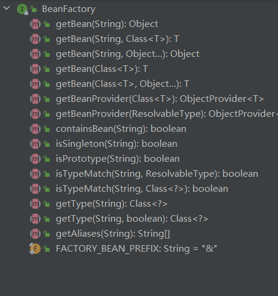
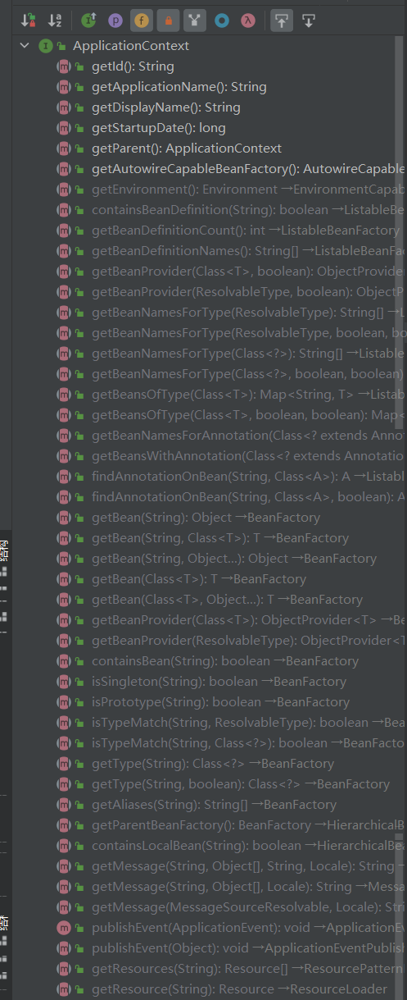
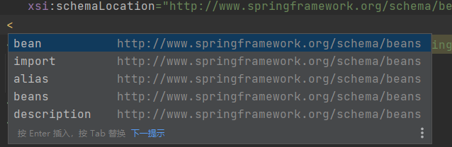
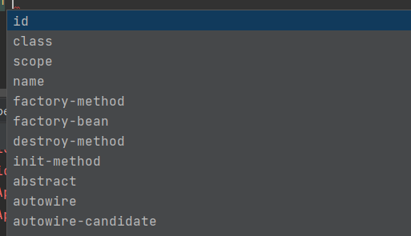
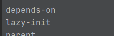
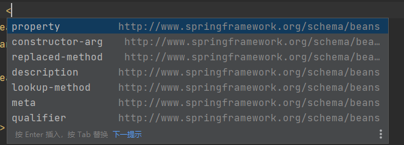
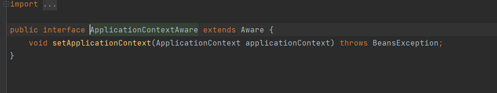

## 前言

本人陆陆续续学了两次spring了,都是跟着网上的教程来的,没有做过什么总结,总感觉欠缺了很多知识,让我用spring这个框架的时候,总是不熟悉,或者说我压根就还没懂spring,觉得spring只能用来写web后端,这次我打算好好学习,不跳着走,认认真真的总结一下spring,对spring有一个全新的了解

## 控制反转(IOC)和依赖注入(DI)

如果A对象依赖B对象,那就是意味着当我们创建或者使用A对象时需要创建一个B对象,那这样创建B对象控制权都在我们自己手里,如果引入IOC容器,我们创建A对象之后,就不需要再自己创建B对象,让IOC容器去帮我们创建B对象,然后将B对象交个A,这个叫**依赖注入**,本来创建B的权力在自己手里,现在创建B的权利交给了IOC容器,这就是**控制反转**

## 容器

在spring中,管理我们的对象的东西就叫做容器,而且在容器中,这些对象都被成为bean,容器记录着各个bean的元数据,比如bean与bean之间的依赖关系,是单实例bean还是多实例bean等等,BeanFactory 是所有容器类的父接口,它定义了配置框架和最基本的功能,而他的子接口ApplicationContext提供了更多的特定功能,我们可以做个对比图





是不是多了不少方法,beanfactory接口只有获取bean和获取一些简单的元数据的方法

接下来的学习主要是围绕**ApplicationContext**的实现类来学习

ApplicationContext 的自实现类中,有基于类路径的xml配置文件配置bean的ClassPathXmlApplicationContext,还有基于文件路径的xml配置文件配置bean的FileSystemXmlApplicationContext,还有基于注解配置bean的AnnotationConfigApplicationContext,在这些类里面,我们主要学习**ClassPathXmlApplicationContext**和**AnnotationConfigApplicationContext**

## Bean

### Bean的概述

spring 创建和管理bean是通过我们所给的配置元数据创建的,在容器内部这些bean的定义都是一个BeanDefinition对象,它记录了下面元数据:

- 包限定的类名：通常是被定义的 bean 的实际实现类。
- Bean 行为配置元素，说明 bean 在容器中的行为方式（作用域、生命周期回调等）。
- 对 bean 完成其工作所需的其他 bean 的引用。这些引用也称为协作者或依赖项。
- 在新创建的对象中设置的其他配置设置——例如，池的大小限制或管理连接池的 bean 中使用的连接数。

| 属性                     | 含义                             |
| ------------------------ | -------------------------------- |
| Class                    | 包限定类名                       |
| Name                     | bean的名字                       |
| Scope                    | 作用域(比如单实例或者原生实例)   |
| Constructor arguments    | 构造函数参数                     |
| Properties               | 字段属性值                       |
| Autowiring mode          | 自动装配                         |
| Lazy initialization mode | 懒加载                           |
| Initialization method    | 初始化方法(注意和构造函数的区别) |
| Destruction method       | 销毁方法                         |

### Bean命名

我们可以在xml配置文件中使用 id 和 name 属性对bean进行命名,一般采用驼峰命名,但是首字母小写,但是要记住哦,要保证bean的名字与其他bean的名字不冲突哦,一个bean可以有多个名字,我们还可以通过alias标签取别名,格式如下

```xml
<alias name="fromName" alias="toName"/>
<!-- fromName 是bean最初的名字  toName 是要取的别名>
```

### 实例化Bean

实例化bean的几种方式:

* 通过构造函数实例化
* 使用静态工厂方法实例化  (就是使用一个类的静态方法实例化一个bean,并不会创建这个类的对象)
* 使用实例工厂方法实例化 ( 就是使用一个对象的方法实例化一个bean, 所有我们必须先创建这个对象)

既然我们有了构造函数实例化的方法了,我们为什么还需要后两种呢?,那是因为第一个方法它只能创建所给定的类的对象,而后两种可以创建它的子类对象,这样就能拓展更强大的功能了

> 我们需要指定bean的class属性,如果一个类A中包含一个static的B类,我们需要使用 A的包限定类名$B

## 依赖注入

我们的项目通常是包含多个bean的,那么就肯定会存在bean与bean之间的依赖关系,容器在创建bean的时候,就需要将它所依赖的东西给注入进去

依赖注入分为两种,一是基于构造函数的依赖注入,二是基于setter的依赖注入

> 关于何时使用依赖注入,何时使用setter注入呢?
>
> 如果是强依赖,比如说我这个bean使用的时候必须依赖它,那这样我们可以使用构造函数注入
>
> 如果不是强依赖项,就是我可能需要它,也可能不需要它,那这样我们可以使用setter注入
>
> 如果使用第三方的类的时候,如果需要看他提供了何种方法,我们才能选择依赖注入的方式
>
> 总而言之,使用依赖注入的方式不是定死的,我们需要灵活使用

### 循环依赖

循环依赖主要出现在两个bean互相是对方的依赖,而且都是采用构造函数的方式注入

这种循环依赖是无法解决的,因为你想啊,你正常new 对象也new 不出来啊,就像先有鸡还是先有蛋?

## 配置文件

说了那么多,接下来就好好说说配置文件把(其实也没啥好说的)

```xml
<?xml version="1.0" encoding="UTF-8"?>
<beans xmlns="http://www.springframework.org/schema/beans"
    xmlns:xsi="http://www.w3.org/2001/XMLSchema-instance"
    xsi:schemaLocation="http://www.springframework.org/schema/beans
        https://www.springframework.org/schema/beans/spring-beans.xsd">

    <bean id="..." class="...">  
        <!-- collaborators and configuration for this bean go here -->
        
    </bean>

    <bean id="..." class="...">
        <!-- collaborators and configuration for this bean go here -->
    </bean>

    <!-- more bean definitions go here -->

</beans>
```

* **beans的子标签**

* 

* import 引入外部xml配置文件

* alias定义别名

* bean 标签就是声明一个bean,里面包含了它元数据,标签里面的属性有很多,**id**设置名字,**class**设置包限定类名,**scope**代表作用域,**name**也是设置名字(id优先级更高,但是这个设置的名字也能拿到bean),**factory-method**设置静态工厂方法,**factory-bean** 设置实例bean工厂,**destroy-method**设置销毁方法**,init-method**设置初始化方法,**autowire** 自动装配 byName 通过名字找有没有对应的setter方法,而不是看属性名字是否跟自己相同(依赖注入),byType  通过类型查看有没有对应的setter方法的参数是这个类型(依赖注入),constructor 构造器注入,通过类型查找,如果没有找到对应的bean会报错,depends-on 显示声明我依赖哪个bean,lazy-init 延迟初始化,当我们需要的时候再初始化,默认是一开始就初始化

   

  

* **bean的子标签**
* 
* property 依赖注入
* constructor-arg 构造方法注入

## 自定义bean的性质

分为两个:

* 通过生命周期钩子函数
* 实现Aware接口

### 生命周期钩子函数

这里的钩子函数大致分为两个,一个是初始化,一个是销毁,我们可以通过实现InitializingBean,DisposableBean接口的方式来实现,也可以通过注解的方式,也可以通过配置文件,第一种不太推荐,代码耦合了,但是生命周期钩子函数执行步骤是:

初始化 

* 注解定义的初始化函数
* 跟生命周期相关接口的初始化函数
* 自定义的init方法(配置文件里面设置的)

销毁步骤跟初始化一样

### 实现Aware接口

实现了某些Aware接口之后,容器初始化的时候这些aware接口对应的处理类会执行这个aware接口所规定的方法,我们实现了这些方法,所以也能自定义很多功能



比如比如说这个aware子接口,它就可以帮助我们拿到容器

