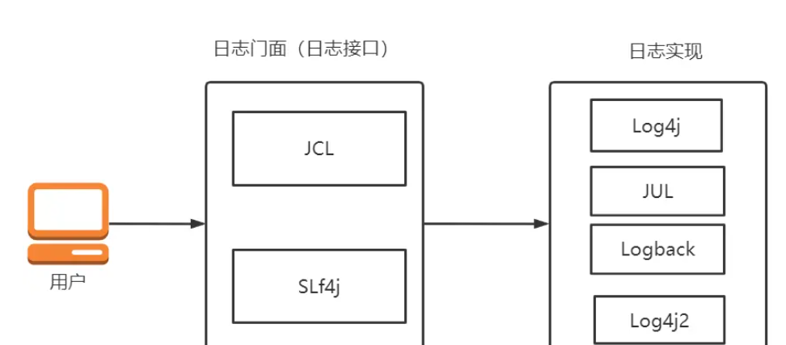

# 前言

> 源码看了又看,忘了又忘,还不如多学学怎么用吧

## 全家桶

Spring 全家桶（Spring Ecosystem）包括许多项目和模块，以支持各种应用程序开发需求。以下是 Spring 全家桶中的一些主要项目：

1. Spring Framework：核心框架，提供了依赖注入（DI）、面向切面编程（AOP）、事件处理等基本功能。

2. Spring Boot：简化 Spring 应用程序开发的框架，提供了自动配置、内嵌容器、快速创建微服务等特性。

3. Spring Cloud：基于 Spring Boot 的微服务框架，提供了服务发现、配置中心、断路器等分布式系统开发组件。

4. Spring Data：提供了统一的数据访问层解决方案，包括对关系型数据库、NoSQL 数据库和其他数据存储技术的支持。

5. Spring Security：提供了强大的安全解决方案，支持认证、授权、攻击防护等功能。

6. Spring Integration：提供了企业集成模式的实现，用于集成不同系统和服务。

7. Spring Batch：用于创建高性能批处理应用程序，支持任务调度、分块处理等功能。

8. Spring Web MVC：用于构建基于 Servlet API 的 Web 应用程序，支持 RESTful API、表单处理、文件上传等功能。

9. Spring WebFlux：用于构建响应式 Web 应用程序，支持非阻塞 I/O、异步处理等功能。

10. Spring WebSocket：提供了 WebSocket 通信支持，用于构建实时 Web 应用程序。

11. Spring AMQP：提供了对高级消息队列协议（AMQP）的支持，用于实现消息队列通信。

12. Spring Cloud Stream：基于 Spring Boot 的消息队列框架，提供了对多种消息中间件的抽象和统一接口。

13. Spring Cloud Data Flow：用于构建数据集成和实时数据处理管道的微服务框架。

14. Spring Cloud Gateway：基于 Spring Boot 的 API 网关，提供了路由、过滤、限流等功能。

15. Spring Cloud Function：提供了将 Spring Boot 应用程序作为函数进行部署的支持，用于无服务器计算场景。

以上只是 Spring 全家桶中的部分项目。随着社区的不断发展，Spring 生态系统不断扩展，为开发者提供了丰富的工具和组件。更多关于 Spring 项目的详细信息，可以访问 Spring 官方网站：https://spring.io/projects

> 后面的代码都是基于springboot, 但是很多东西都是spring框架的核心概念

# spring

## 什么是spring

Spring Framework 是一个开源的 Java 应用框架，由 Rod Johnson 创立于 2003 年。它旨在简化企业级 Java 开发，提供了一套完整的解决方案，用于创建各种类型的 Java 应用程序，包括 Web、桌面和分布式应用。Spring Framework 的主要特性如下：

1. Inversion of Control（IoC，控制反转）：Spring Framework 提供了一个 IoC 容器，负责管理对象之间的依赖关系。通过使用控制反转，开发者可以将关注点集中在业务逻辑上，而不是依赖关系的管理和实例化过程。
2. Dependency Injection（DI，依赖注入）：依赖注入是实现 IoC 的一种方法。Spring Framework 支持构造器注入和属性注入，使得对象之间的依赖关系可以在配置文件或注解中声明，从而提高代码的可测试性和可维护性。
3. Aspect-Oriented Programming（AOP，面向切面编程）：Spring Framework 提供了 AOP 支持，允许开发者将横切关注点（如日志记录、事务管理等）从核心业务逻辑中分离出来。这有助于提高代码的模块化程度和可读性。


## 注册bean

在Spring Boot中，有多种方式注册Bean（组件），每种方式都有其使用方法、注意事项、优缺点。以下是主要的注册方式：

### 1. 使用@Component、@Service、@Repository和@Controller注解：

使用方法：将这些注解添加到类上，以便让Spring将其作为组件（Bean）自动注册到上下文中。每个注解都具有特定的用途和语义，但它们都是@Component注解的特殊化版本。

注意事项：确保这些类在组件扫描的路径下，否则Spring将无法自动检测和注册这些组件。

优点：简单易用，易于理解。

缺点：使用注解，与Spring框架产生了耦合。

### 2. 使用@Configuration和@Bean注解：

使用方法：使用@Configuration注解标记配置类，而@Bean注解用于在配置类中定义Bean。在配置类中，每个带有@Bean注解的方法将生成一个Bean，方法的返回值类型决定了Bean的类型，方法名默认为Bean的名称。

> 这种方式只会注入这个bean进去,而不会去扫描它内部的其他一些注入bean的注解

注意事项：确保配置类在组件扫描的路径下。

优点：易于管理，可在一个配置类中集中定义多个Bean，提高代码的可维护性。

缺点：与Spring框架产生了耦合。

### 3. 使用Java配置类和@BeanFactoryPostProcessor：

使用方法：在Java配置类中实现BeanFactoryPostProcessor接口，然后在`postProcessBeanFactory`方法中手动注册Bean。这种方式适用于更高级的用例，例如动态注册Bean。

注意事项：要确保实现了BeanFactoryPostProcessor接口的类被Spring扫描到。

优点：灵活，适用于高级用例和动态注册Bean。

缺点：相对复杂，需要更多的代码。

### 4. 使用XML配置文件：

使用方法：在XML文件中使用`<bean>`标签定义Bean，然后在启动类或配置类上使用@ImportResource注解导入XML配置文件。

注意事项：确保XML配置文件位于类路径下，且@ImportResource注解正确指向文件。

优点：与Spring框架的耦合相对较低，易于在不同项目中复用。

缺点：与Java配置相比，XML配置可读性较差，且需要额外维护一个配置文件。

总结：根据具体需求和场景选择合适的方式来定义和注册Bean。在大多数情况下，使用注解（如@Component、@Service等）和@Configuration类是最简单且推荐的方式，因为它们易于理解和维护。当有高级需求或需要动态注册Bean时，可以使用BeanFactoryPostProcessor。如果希望降低与Spring框架的耦合，可以考虑使用XML配置文件。


## 作用域


## 注入方式

在Spring Boot中，有几种常见的注入Bean的方式。每种方式都有其适用场景、优缺点以及注意事项。以下是主要的注入方式：

### @Autowired

可以使用@Autowired注解在字段、构造函数或方法上进行依赖注入。Spring会自动寻找与目标类型匹配的Bean并注入。

优点：

- 易于使用，代码简洁。
- 能在字段、构造函数和方法上使用。

缺点：

- 依赖于Spring特定的注解，降低了代码的可移植性。

注意事项：

- 如果没有找到与目标类型匹配的Bean，**Spring将抛出一个异常。为了避免这种情况，可以将@Autowired注解的required属性设置为false。**
- 当存在多个匹配的Bean时，**可以使用@Qualifier注解指定Bean的名称来消除歧义。**

### @Resource

@Resource注解是JavaEE提供的注解，可用于字段和方法上。它根据名称或类型查找匹配的Bean。

优点：

- 不依赖于Spring特定的注解，更具可移植性。
- 默认按名称查找Bean，当名称匹配失败时，再按类型查找。

缺点：

- **不能用于构造函数上。**
- 功能相对较少。

注意事项：

- 当存在多个匹配的Bean时，可以设置@Resource注解的name属性来消除歧义。

### @Inject

@Inject注解来自于Java的依赖注入规范（JSR-330），可用于字段、构造函数和方法上。它根据类型查找匹配的Bean。

优点：

- 不依赖于Spring特定的注解，具有更好的可移植性。
- 能在字段、构造函数和方法上使用。

缺点：

- **需要额外引入javax.inject依赖。**

注意事项：

- 如果没有找到与目标类型匹配的Bean，Spring将抛出一个异常。
- 当存在多个匹配的Bean时，可以使用@Named注解指定Bean的名称来消除歧义。

### 使用构造函数注入

通过在类的构造函数上添加@Autowired或@Inject注解，可以实现依赖注入。这是推荐的注入方式，因为它可以确保对象在创建时就已经注入了依赖，使得对象处于有效状态。

优点：

- 可以确保对象在创建时就已经注入了依赖，使得对象处于有效状态。
- 有助于实现不可变对象，提高代码的健壮性。

缺点：

- 当注入大量依赖时，构造函数可能变得复杂。

注意事项：

- **当使用构造函数注入时，如果只有一个构造函数，可以省略@Autowired或@Inject注解。**


## @Import注解

`@Import`注解是Spring框架中用于导入其他配置类的注解。当您需要将多个Java配置类组合在一起时，可以使用`@Import`注解将其他配置类导入到当前配置类中。这样可以实现配置类之间的模块化，提高代码的可维护性和可读性。

例如，假设您有两个配置类`AppConfig1`和`AppConfig2`，您可以在主配置类中使用`@Import`注解将这两个配置类导入：

```java
@Configuration
@Import({AppConfig1.class, AppConfig2.class})
public class MainConfig {
    // ...
}
```

在这个例子中，`MainConfig`类导入了`AppConfig1`和`AppConfig2`两个配置类。当`MainConfig`被加载时，`AppConfig1`和`AppConfig2`中定义的所有Bean也将被注册到Spring应用程序上下文中。

使用`@Import`注解可以将配置类进行分组和模块化，以便于管理和组织。这有助于将不同功能或模块的配置分离，使得代码更加清晰和易于维护。


## AOP

AOP（Aspect-Oriented Programming，面向切面编程）是一种编程范式，用于将通用功能（如日志记录、安全检查等）从业务逻辑代码中分离出来，以提高代码的模块化程度。在 Spring Boot 中，可以使用 Spring AOP 框架实现 AOP 功能。以下是一些 AOP 相关的概念：

1. Aspect（切面）：封装横切关注点（如日志记录、事务管理等）的模块。切面可以包含多个通知（Advice）。

2. Advice（通知）：在特定连接点（Join Point）执行的动作。根据执行时机的不同，通知可以分为前置通知、后置通知、环绕通知、异常通知和最终通知。

3. Pointcut（切点）：定义在哪些连接点应用通知的表达式。切点确定了通知应该在何时、何地执行。

4. Join Point（连接点）：程序执行过程中的某个特定点，如方法调用、异常抛出等。连接点是通知实际应用的地方。

5. Target（目标对象）：被通知的对象，即包含业务逻辑的对象。

6. Proxy（代理）：由 AOP 框架创建的目标对象的代理，用于在调用目标方法前后插入通知的逻辑。

在 Spring Boot 中使用 AOP，通常需要进行以下步骤：

1. 引入依赖：首先，在 `pom.xml` 文件中引入 Spring AOP 相关依赖。

```xml
<dependency>
    <groupId>org.springframework.boot</groupId>
    <artifactId>spring-boot-starter-aop</artifactId>
</dependency>
```

2. 定义切面：创建一个类，并使用 `@Aspect` 注解标注该类为切面。在切面类中，定义通知方法，并使用相应的通知注解（如 `@Before`、`@After`、`@Around` 等）标注这些方法。

```java
import org.aspectj.lang.annotation.Aspect;
import org.aspectj.lang.annotation.Before;

@Aspect
@Component
public class LoggingAspect {

    @Before("execution(* com.example.demo.service.*.*(..))")
    public void logBefore(JoinPoint joinPoint) {
        System.out.println("Method called: " + joinPoint.getSignature().getName());
    }
}
```

在这个示例中，我们定义了一个名为 `LoggingAspect` 的切面，它包含一个前置通知方法 `logBefore`，用于在 `com.example.demo.service` 包下的所有方法执行前记录日志。

3. 配置 AOP：在 Spring Boot 中，AOP 通常是自动配置的。但是，在某些情况下，你可能需要自定义 AOP 的配置。在这种情况下，可以创建一个配置类，并使用 `@EnableAspectJAutoProxy` 注解开启 AOP 自动代理。

```java
import org.springframework.context.annotation.EnableAspectJAutoProxy;
import org.springframework.context.annotation.Configuration;

@Configuration
@EnableAspectJAutoProxy
public class AopConfig {
// 可以在此处自定义 AOP 相关的 Bean 或配置
}
```


### 通知

在通知方法中，可以使用一些特定的参数来获取关于目标方法和执行上下文的信息。以下是一些常用的通知方法参数：

1. JoinPoint：表示连接点的对象，提供了许多与目标方法相关的信息。一般在前置通知（`@Before`）、后置通知（`@After`）、异常通知（`@AfterThrowing`）和最终通知（`@AfterReturning`）中使用。`JoinPoint` 接口提供了以下一些常用方法：

    - `Signature getSignature()`：获取目标方法的签名信息。
    - `Object[] getArgs()`：获取目标方法的参数列表。
    - `Object getTarget()`：获取目标对象，即包含业务逻辑的对象。
    - `Object getThis()`：获取代理对象，即 AOP 框架创建的代理。
    - `SourceLocation getSourceLocation()`：获取源代码位置信息。

2. ProceedingJoinPoint：扩展自 `JoinPoint` 接口，表示可继续执行的连接点。一般在环绕通知（`@Around`）中使用。`ProceedingJoinPoint` 提供了一个额外的方法：

    - `Object proceed() throws Throwable`：执行目标方法。在环绕通知中，可以通过调用此方法来控制何时执行目标方法。

3. MethodInvocation：表示方法调用连接点的对象。它扩展自 `JoinPoint` 接口，并提供了一些额外的方法，如 `Method getMethod()`（获取目标方法的 `java.lang.reflect.Method` 对象）。在 Spring AOP 中，`MethodInvocation` 接口的实例通常作为 `JoinPoint` 或 `ProceedingJoinPoint` 的实现。

除了这些参数，还可以在通知方法中使用 `@annotation`、`@args`、`@target` 和 `@within` 等注解来绑定特定的目标方法参数、注解、目标对象类型等信息。例如，可以使用 `@annotation` 注解来获取目标方法上的自定义注解：

```java
@Before("execution(* com.example.demo.service.*.*(..)) && @annotation(myAnnotation)")
public void logBefore(JoinPoint joinPoint, MyAnnotation myAnnotation) {
    // ...
}
```

在这个示例中，`logBefore` 方法有两个参数：`JoinPoint` 和 `MyAnnotation`。`MyAnnotation` 参数使用 `@annotation` 注解绑定目标方法上的 `MyAnnotation` 注解。这样，在通知方法中，可以访问目标方法上的 `MyAnnotation` 注解及其属性值。

了解这些参数及其用法可以帮助你在通知方法中获取关于目标方法和执行上下文的详细信息，从而实现更复杂的横切关注点逻辑。

## 后置处理器

### 定义

Spring中有一些后置处理器，它们可以在Bean的生命周期中的不同阶段进行拦截，从而扩展或自定义Bean的行为。按照B**ean在Spring容器中被加载的顺序**，下面是一些常见的后置处理器及其用途和作用时机：

1. BeanDefinitionRegistryPostProcessor：
用途：它允许在**Bean定义被加载到容器之前，修改或添加Bean定义**。可以用于动态注册Bean或修改Bean的元数据。
作用时机：在所有Bean定义被加载到容器之前，调用postProcessBeanDefinitionRegistry()方法。

2. BeanFactoryPostProcessor：
用途：**它允许在Bean定义被加载且尚未实例化Bean之前修改Bean的定义**。主要用于修改Bean的配置元数据。
作用时机：在所有Bean定义都已加载到容器且还未实例化Bean时，调用postProcessBeanFactory()方法。

3. InstantiationAwareBeanPostProcessor：
用途：**它允许在Bean实例化之前和之后进行自定义处理**，例如替换Bean的实例、改变属性值等。
作用时机：在Bean实例化之前调用postProcessBeforeInstantiation()方法，实例化之后调用postProcessAfterInstantiation()方法，然后在设置属性前调用postProcessProperties()方法。

4. BeanPostProcessor：
用途：它允许在Bean初始化之后执行一些自定义逻辑，例如修改Bean的属性或执行其他配置。对所有的Bean都生效。
作用时机：**在Bean的初始化方法（如afterPropertiesSet()或自定义的init-method）之前和之后**，分别调用postProcessBeforeInitialization()和postProcessAfterInitialization()方法。

5. DestructionAwareBeanPostProcessor：
用途：**它允许在Bean销毁之前执行一些自定义逻辑，例如释放资源、清理缓存等**。
作用时机：在Bean销毁之前调用postProcessBeforeDestruction()方法。

按照Bean的加载顺序，这些后置处理器都在Bean的生命周期中的不同阶段起作用。通过实现相应的接口并注册到Spring容器，可以灵活地扩展Bean的行为。

### spring默认提供的后置处理器

Spring框架默认提供了一些内置的后置处理器，这些后置处理器负责处理各种功能和任务。以下是一些常见的内置后置处理器及其用途：

1. ApplicationContextAwareProcessor：
用途：负责处理实现了ApplicationContextAware、ResourceLoaderAware、ApplicationEventPublisherAware和MessageSourceAware接口的Bean，为它们注入相应的依赖。

2. InitDestroyAnnotationBeanPostProcessor：
用途：**处理带有@PostConstruct和@PreDestroy注解的Bean，分别在Bean初始化后和销毁前执行相应的方法。**

3. AutowiredAnnotationBeanPostProcessor：
用途：**处理带有@Autowired、@Value和@Inject注解的Bean，负责自动装配Bean的属性、方法和构造函数。**

4. RequiredAnnotationBeanPostProcessor：
用途：处理带有@Required注解的Bean，确保标注了@Required注解的属性已经被设置，否则抛出异常。

5. CommonAnnotationBeanPostProcessor：
用途：**处理带有@Resource、@PostConstruct和@PreDestroy注解的Bean，分别负责依赖注入和在Bean初始化后、销毁前执行相应的方法。**

6. EventListenerMethodProcessor：
用途：处理带有@EventListener注解的方法，将它们注册为事件监听器。

7. DefaultEventListenerFactory：
用途：为@EventListener注解的方法提供默认的事件监听器实例。

8. ConfigurationClassPostProcessor (**BeanDefinitionRegistryPostProcessor**)：
用途：**处理带有@Configuration、@Bean、@ComponentScan、@Import和@PropertySource注解的配置类，负责解析和注册Bean定义。**

9. ScheduledAnnotationBeanPostProcessor：
用途：处理带有@Scheduled注解的方法，将它们注册为计划任务。

这些内置后置处理器由Spring框架自动注册，并在不同的生命周期阶段处理各种功能和任务。它们使得开发人员能够更加便捷地使用Spring框架的功能。

# spring boot 


## 自动配置原理

Spring Boot 的自动配置是它的一个核心功能，它通过预先定义的默认配置和约定优于配置（Convention over Configuration）的原则，简化了应用程序的配置。自动配置的原理主要依赖以下几个关键技术：

1. 条件注解：Spring Boot 使用条件注解（如 `@ConditionalOnClass`、`@ConditionalOnBean`、`@ConditionalOnMissingBean` 等）来根据当前应用程序上下文和类路径的情况来决定是否应用某个配置。这些注解使得 Spring Boot 能够在满足特定条件时自动配置所需的组件。

2. 自动配置类：Spring Boot 提供了许多自动配置类，它们是带有 `@Configuration` 注解的 Java 配置类，包含了一系列预定义的默认配置。这些自动配置类通常以 `AutoConfiguration` 结尾，例如 `DataSourceAutoConfiguration`、`WebMvcAutoConfiguration` 等。这些自动配置类会在应用程序启动时被加载，并根据条件注解决定是否应用这些默认配置。

3. `spring.factories` 文件：`spring.factories` 文件是 Spring Boot 的一个关键配置文件，它位于 `META-INF` 目录下。该文件定义了许多自动配置类和启用器，它们在应用程序启动时被 Spring Boot 自动发现和加载。自动配置类和启用器都是通过 `org.springframework.boot.autoconfigure.EnableAutoConfiguration` 键列出的。

4. `@EnableAutoConfiguration` 注解：这个注解通常在 Spring Boot 的主配置类或启动类上使用（通过 `@SpringBootApplication` 注解间接启用，因为 `@SpringBootApplication` 包含了 `@EnableAutoConfiguration`）。该注解负责激活自动配置功能，并从 `spring.factories` 文件中加载自动配置类。

整个自动配置过程如下：

1. 当您的应用程序启动时，Spring Boot 会加载带有 `@SpringBootApplication` 注解的主类。
2. `@SpringBootApplication` 注解包含了 `@EnableAutoConfiguration` 注解，这个注解会激活自动配置功能。
3. Spring Boot 读取 `spring.factories` 文件，加载并实例化其中定义的自动配置类。
4. 对于每个自动配置类，Spring Boot 根据条件注解的结果决定是否应用它们。
5. 在满足条件的情况下，自动配置类会将默认配置和相关组件注册到应用程序上下文中。

通过这个自动配置原理，Spring Boot 能够在适当的时机为应用程序提供合适的默认配置，从而简化开发过程。当然，也可以覆盖这些默认配置，以满足特定的需求。

## 配置文件

Spring Boot中的配置文件是用于配置应用程序的属性和参数的文件。Spring Boot支持多种类型的配置文件，包括属性文件、**YAML文件**、JSON文件等. 配置文件可以包含应用程序的所有配置参数，例如数据库连接信息、日志配置、服务器端口等。这些参数可以通过@ConfigurationProperties注解和@Value注解在应用程序中访问。

Spring Boot 提供了许多有用的特性，以简化配置文件的使用。以下是一些配置文件中的特殊用法：

### 配置文件的多环境支持：

Spring Boot 支持使用不同的配置文件来区分不同的环境（如开发、测试和生产环境）。您可以在 `application.yml` 或 `application.properties` 文件中使用 `spring.profiles.active` 属性来激活特定的环境配置文件。例如，在 `application.yml` 文件中：

```yaml
spring:
  profiles:
    active: dev
```

这将激活名为 `application-dev.yml` 的配置文件。您还可以通过命令行参数或环境变量来覆盖此属性。

### 配置文件中的占位符

您可以在配置文件中使用 `${...}` 占位符引用其他属性。例如：

```properties
app.message=Hello, Spring Boot!
app.greeting=${app.message} Welcome to our application!
```

在这个例子中，`app.greeting` 的值将包含 `app.message` 的值。

### 配置文件的优先级

Spring Boot 允许您将配置文件放在不同的位置，如项目的根目录、`config/` 目录、类路径等。不同位置的配置文件具有不同的优先级。例如，项目根目录下的 `application.properties` 文件的优先级高于类路径下的 `application.properties` 文件。这意味着在多个位置定义相同的属性时，具有较高优先级的配置文件中的值将覆盖较低优先级的配置文件中的值。

### 使用 YAML 配置文件中的锚点和别名

在 YAML 格式的配置文件中，您可以使用锚点（`&`）和别名（`*`）来避免重复。例如：

```yaml
app:
  dataSource:
    default: &default
      driverClassName: org.h2.Driver
      url: jdbc:h2:mem:testdb
      username: sa
      password: password
    primary: *default
    secondary:
      <<: *default
      url: jdbc:h2:mem:anotherdb
```

在这个例子中，我们使用了锚点和别名来避免重复定义 `default` 数据源的属性。

### 获取pom.xml的环境变量

在配置文件中使用"@@"通常是指使用**Maven资源过滤器**，用于将Maven构建过程中的**项目属性值替换到配置文件中**。

在Maven中，可以使用"@变量名@"的形式来引用项目属性，例如"@artifactId@"引用项目的artifactId值，"@version@"引用项目的版本号等等。除了这些内置的变量之外，还可以在pom.xml文件中定义自己的属性，并在配置文件中使用"@@自定义变量名@@"的形式来引用它们。

例如，在pom.xml文件中定义了一个自定义属性my-property：

```xml
<properties>
  <my-property>hello world</my-property>
</properties>
```

然后在配置文件中使用"@@"引用它：

```properties
my.property.value=@my-property@
```

在Maven构建过程中，Maven会自动将"@@"语法替换成对应的属性值，因此上面的配置文件将被替换成：

```properties
my.property.value=hello world
```

需要注意的是，在配置文件中使用"@@"时，变量名需要与pom.xml文件中定义的属性名保持一致，否则无法正确地替换属性值。


## 配置文件读取

在 Spring Boot 中，常用的配置文件格式有两种：`.properties` 和 `.yml`（或 `.yaml`）。Spring Boot 自动加载项目根目录下的 `application.properties` 或 `application.yml` 文件作为默认的配置文件。您可以使用以下方式来读取配置文件中的值：

### 使用 `@Value` 注解

在需要注入配置值的地方，使用 `@Value` 注解并指定配置的键。例如，假设 `application.properties` 文件中有一个属性 `app.message`：

```properties
app.message=Hello, Spring Boot!
```

您可以使用 `@Value` 注解将该属性值注入到一个变量中：

```java
import org.springframework.beans.factory.annotation.Value;
import org.springframework.stereotype.Component;

@Component
public class AppConfig {

    @Value("${app.message}")
    private String message;

    public String getMessage() {
        return message;
    }
}
```

### 使用 `@ConfigurationProperties` 注解

为了更方便地管理和验证配置，您可以使用 `@ConfigurationProperties` 注解将配置文件中的属性值绑定到一个 Java 对象上。首先，创建一个带有 `@ConfigurationProperties` 注解的类，并为该类的字段添加 getter 和 setter 方法：

```java
import org.springframework.boot.context.properties.ConfigurationProperties;
import org.springframework.stereotype.Component;

@Component
@ConfigurationProperties(prefix = "app")
public class AppConfig {

    private String message;

    public String getMessage() {
        return message;
    }

    public void setMessage(String message) {
        this.message = message;
    }
}
```

在这个示例中，`prefix = "app"` 表示将配置文件中以 `app` 为前缀的属性绑定到 `AppConfig` 类的字段上。

### 使用 `Environment` 对象

在 Spring 中，您还可以使用 `Environment` 对象来访问配置文件中的属性值。首先，将 `Environment` 注入到您的组件中：

```java
import org.springframework.core.env.Environment;
import org.springframework.stereotype.Component;

@Component
public class AppConfig {

    private final Environment env;

    public AppConfig(Environment env) {
        this.env = env;
    }

    public String getMessage() {
        return env.getProperty("app.message");
    }
}
```

这种方法适用于在运行时动态访问配置值的情况。

这些方法可以应用于不同的配置文件格式（`.properties` 或 `.yml`）。您可以根据实际需求和偏好选择合适的方式来读取配置文件中的值。


## 监听器


### 常用监听器与事件

Spring Boot中的监听器和事件是基于Spring框架的事件驱动模型。下面列出了一些常见的监听器和事件：

监听器（Listener）：

1. ApplicationListener：这是一个通用的监听器接口，用于监听各种类型的事件。你可以实现此接口并根据需要定义自己的监听器。

2. ServletContextListener：这是Java Servlet规范中的监听器，用于在Web应用程序的生命周期中监听ServletContext的创建和销毁事件。

3. HttpSessionListener：这是Java Servlet规范中的监听器，用于在Web应用程序的生命周期中监听HttpSession的创建和销毁事件。

4. ServletRequestListener：这是Java Servlet规范中的监听器，用于在Web应用程序的生命周期中监听ServletRequest的创建和销毁事件。

事件（Event）：

1. ContextRefreshedEvent：当ApplicationContext初始化或刷新时触发此事件。

2. ContextStartedEvent：当ApplicationContext启动时触发此事件。

3. ContextStoppedEvent：当ApplicationContext停止时触发此事件。

4. ContextClosedEvent：当ApplicationContext关闭时触发此事件。

5. ServletContextInitializedEvent：当ServletContext初始化时触发此事件。

6. ServletContextDestroyedEvent：当ServletContext销毁时触发此事件。

7. HttpSessionCreatedEvent：当HttpSession创建时触发此事件。

8. HttpSessionDestroyedEvent：当HttpSession销毁时触发此事件。

9. ServletRequestInitializedEvent：当ServletRequest创建时触发此事件。

10. ServletRequestDestroyedEvent：当ServletRequest销毁时触发此事件。

11. ApplicationEnvironmentPreparedEvent：在应用环境准备完成且ApplicationContext创建之前触发此事件。

12. ApplicationPreparedEvent：在ApplicationContext创建完成但尚未刷新时触发此事件。

13. ApplicationReadyEvent：在ApplicationContext刷新并启动后触发此事件，此时应用已经准备好接受请求。

14. ApplicationFailedEvent：当应用启动失败时触发此事件。

15. SpringApplicationEvent：**这是所有Spring Boot事件的基类，可以用于监听所有Spring Boot相关事件**。

通过实现监听器并监听相应的事件，你可以在应用程序的生命周期中的特定时刻执行特定操作。此外，你还可以创建自定义事件和监听器，以满足特定的业务需求。

### springboot启动过程中发出的事件

Spring Boot在启动过程中会主动触发一系列事件，这些事件通常用于在应用程序生命周期的不同阶段执行特定的操作。以下是Spring Boot启动过程中的一些关键事件：

1. ApplicationStartingEvent：在Spring Boot应用程序开始运行，但任何处理开始之前触发。这是启动过程中触发的第一个事件。

2. ApplicationEnvironmentPreparedEvent：在应用环境准备完成且ApplicationContext创建之前触发。此时，应用已经加载了配置文件并准备好了环境。

3. ApplicationContextInitializedEvent：在ApplicationContext准备好后触发，但在它被刷新前。此时，已经注册了bean定义，但bean实例还没有被创建。

4. ApplicationPreparedEvent：在ApplicationContext创建完成但尚未刷新时触发。此时，所有bean定义已经加载到容器中，但bean实例尚未创建。

5. ContextRefreshedEvent：当ApplicationContext初始化或刷新时触发。此时，所有bean已经被创建并初始化。 **从这一步开始,我们通过注解定义的事件监听器才会响应事件**

6. ServletWebServerInitializedEvent：在嵌入式Servlet容器（如Tomcat、Jetty等）初始化完成时触发。此时，应用程序已经准备好处理HTTP请求。

7. ApplicationStartedEvent：在ApplicationContext刷新并启动后触发，但在任何应用程序和命令行运行器（ApplicationRunner和CommandLineRunner）开始之前。此时，应用程序已经准备好处理业务逻辑。

8. ApplicationReadyEvent：在所有应用程序和命令行运行器（ApplicationRunner和CommandLineRunner）执行完成后触发。此时，应用已经准备好接受请求，此事件表明应用已完全启动并处于运行状态。

9. ApplicationFailedEvent：当应用启动失败时触发。这个事件只有在启动过程中出现异常时才会触发。

通过监听这些事件，你可以在应用程序的生命周期中的特定时刻执行特定操作。例如，在`ApplicationReadyEvent`触发时执行一些初始化任务，或者在`ApplicationFailedEvent`触发时执行错误处理操作。

### 创建监听器

#### 基于@EventListener 

Spring Boot中的事件监听器允许您对应用程序中发生的事件进行响应。这些事件包括应用程序生命周期事件、自定义事件等。要使用事件监听器，请遵循以下步骤：

1. 创建事件：
   如果您要监听的是自定义事件，首先需要创建一个事件类。自定义事件类需要继承`org.springframework.context.ApplicationEvent`。

例如：

```java
public class CustomEvent extends ApplicationEvent {
    private String message;

    public CustomEvent(Object source, String message) {
        super(source);
        this.message = message;
    }

    public String getMessage() {
        return message;
    }
}
```

2. 创建事件监听器：
   在需要监听事件的类中创建一个方法，该方法将在事件发生时被调用。然后使用`@EventListener`注解标记此方法，并指定要监听的事件类型。

例如：

```java
@Component
public class CustomEventListener {

    @EventListener
    public void handleCustomEvent(CustomEvent event) {
        System.out.println("Received custom event: " + event.getMessage());
    }
}
```

3. 发布事件：
   要触发事件，需要将事件发布到应用程序上下文中。您可以通过注入`org.springframework.context.ApplicationEventPublisher`并调用其`publishEvent()`方法来实现。

例如：

```java
@Service
public class CustomEventPublisher {
    private final ApplicationEventPublisher eventPublisher;

    public CustomEventPublisher(ApplicationEventPublisher eventPublisher) {
        this.eventPublisher = eventPublisher;
    }

    public void publishCustomEvent(String message) {
        CustomEvent event = new CustomEvent(this, message);
        eventPublisher.publishEvent(event);
    }
}
```

4. 使用事件监听器：
   现在您已经准备好使用事件监听器。当您需要触发事件时，只需调用`CustomEventPublisher`中的`publishCustomEvent()`方法，事件监听器将自动响应事件。

例如，在Controller类中使用`CustomEventPublisher`：

```java
@RestController
public class CustomEventController {

    private final CustomEventPublisher customEventPublisher;

    public CustomEventController(CustomEventPublisher customEventPublisher) {
        this.customEventPublisher = customEventPublisher;
    }

    @GetMapping("/triggerEvent")
    public String triggerEvent() {
        customEventPublisher.publishCustomEvent("Hello, this is a custom event!");
        return "Event triggered";
    }
}
```

通过上述步骤，您可以在Spring Boot应用程序中使用事件监听器来监听和响应特定事件。

#### 基于接口

有些事件并不支持上面那种方法,当然支持上面那种方法的,一定可以基于接口使用, 我们来定义一个session创建与销毁的监听器

```java

import org.springframework.stereotype.Component;

import javax.servlet.http.HttpSessionEvent;
import javax.servlet.http.HttpSessionListener;

@Component
public class MyHttpSessionEventListener implements HttpSessionListener {
    @Override
    public void sessionCreated(HttpSessionEvent se) {
        System.out.println("session创建: " + se.getSession().getId());
    }

    @Override
    public void sessionDestroyed(HttpSessionEvent se) {
        System.out.println("session销毁: " + se.getSession().getId());
    }
}
```


## 日志

### 日志门面和日志实现




JUL是jdk自带，在java.util.logging包下的Logger类

Log4j是Apache下的一款开源的日志框架

**Logback是由log4j创始人设计的另一个开源日志组件，性能比log4j要好**

Log4j 2是对Log4j的升级版，参考了logback的一些优秀的设计

Log4j2主要有以下特色:

性能提升：Log4j 2包含基于LMAX Disruptor库的下一代**异步记录器**。在多线程方案中，与Log4j 1.x和Logback相比，异步Logger的吞吐量高18倍，延迟降低了几个数量级

自动重载配置：与Logback一样，Log4j 2可以在修改后自动重新加载其配置。与Logback不同，它在进行重新配置时不会丢失日志事件

无垃圾机制：在稳态日志记录期间，Log4j 2 在独立应用程序中是无垃圾的，而在Web应用程序中是低垃圾的。这样可以减少垃圾收集器上的压力，并可以提供更好的响应时间性能

### 使用日志框架

Spring Boot内置了对日志的支持，它为开发者提供了一个统一、易于配置的日志框架。默认情况下，**Spring Boot使用Logback作为其日志实现**。然而，它也提供了对其他日志框架（如Log4j2）的支持，可以通过简单的配置进行切换。

日志级别：
Spring Boot支持以下日志级别，按照日志输出的详细程度递减排列：

1. ERROR：错误级别，仅记录错误信息。
2. WARN：警告级别，记录警告和错误信息。
3. INFO：信息级别，记录信息、警告和错误信息。**这是Spring Boot的默认日志级别**。
4. DEBUG：调试级别，记录调试、信息、警告和错误信息。比INFO级别的日志更详细。
5. TRACE：追踪级别，记录所有日志信息，包括追踪、调试、信息、警告和错误信息。这是最详细的日志级别。

#### 方式一

为了在你的应用程序中使用日志，你需要导入适当的日志API。对于Spring Boot，默认情况下，**你应该使用SLF4J（Simple Logging Facade for Java）API**。首先，在你的Java类中导入以下包：

```java
import org.slf4j.Logger;
import org.slf4j.LoggerFactory;
```

然后，创建一个`Logger`实例：

```java
private static final Logger logger = LoggerFactory.getLogger(YourClassName.class);
```

现在，你可以使用`logger`实例记录不同级别的日志：

```java
logger.error("这是一条错误日志");
logger.warn("这是一条警告日志");
logger.info("这是一条信息日志");
logger.debug("这是一条调试日志");
logger.trace("这是一条追踪日志");
```

#### 方式二

使用lombok注解,自动帮我们生成一个log对象

```java
@Component
@Log
@Slf4j
public class MyHttpSessionEventListener implements HttpSessionListener {

    @Override
    public void sessionCreated(HttpSessionEvent se) {

        log.info("session创建: " + se.getSession().getId());
        System.out.println("session创建: " + se.getSession().getId());
    }

    @Override
    public void sessionDestroyed(HttpSessionEvent se) {
        System.out.println("session销毁: " + se.getSession().getId());
    }
}

```


### 日志配置

Spring Boot允许你通过`application.properties`或`application.yml`文件轻松地配置日志。以下是一些常见的日志配置选项：

- 日志级别配置：通过`logging.level`属性设置包或类的日志级别。例如：
  ```properties
  logging.level.root=WARN
  logging.level.com.example.demo=DEBUG
  ```

- 日志文件配置：通过`logging.file.name`或`logging.file.path`属性设置日志输出文件。例如：
  ```properties
  logging.file.name=myapp.log
  logging.file.path=logs
  ```

- 日志文件的滚动策略、最大文件大小等配置：在Logback或Log4j2的配置文件中设置。例如，在`src/main/resources`目录下创建一个名为`logback-spring.xml`的文件，然后自定义相关配置。

### 配置文件

Spring Boot 在启动时会自动检测项目 `src/main/resources` 目录下的一些特定命名的配置文件，并根据这些文件的名称来确定它们的用途。对于日志配置，Spring Boot 会检查以下文件名：

- Logback：`logback-spring.xml`、`logback.xml`
- Log4j2：`log4j2-spring.xml`、`log4j2.xml`

当 Spring Boot 找到这些文件中的一个时，它会自动将其用作日志系统的配置。在这些文件中，你可以使用相应日志框架的语法和配置元素来定制日志系统的行为。

请注意，对于 Logback，推荐使用 `logback-spring.xml` 而不是 `logback.xml`。使用 `logback-spring.xml` 文件名，你可以利用 Spring Boot 提供的一些额外特性，例如使用 Spring Profile 进行条件化配置。而使用 `logback.xml`，这些特性将不可用。

总之，Spring Boot 通过检测特定的文件名来识别日志配置文件，并在启动过程中自动应用这些配置。


```xml
<?xml version="1.0" encoding="UTF-8"?>
<configuration>
    <include resource="org/springframework/boot/logging/logback/base.xml" />

    <!-- 设置日志级别 -->
    <logger name="com.example.demo" level="DEBUG" />

    <!-- 控制台日志输出 -->
    <appender name="CONSOLE" class="ch.qos.logback.core.ConsoleAppender">
        <encoder>
            <pattern>%d{yyyy-MM-dd HH:mm:ss.SSS} [%thread] %-5level %logger{36} - %msg%n</pattern>
        </encoder>
    </appender>

    <!-- 文件日志输出 -->
    <appender name="FILE" class="ch.qos.logback.core.rolling.RollingFileAppender">
        <file>logs/app.log</file>
        <encoder>
            <pattern>%d{yyyy-MM-dd HH:mm:ss.SSS} [%thread] %-5level %logger{36} - %msg%n</pattern>
        </encoder>
        <rollingPolicy class="ch.qos.logback.core.rolling.TimeBasedRollingPolicy">
            <!-- 设置滚动策略 -->
            <fileNamePattern>logs/app-%d{yyyy-MM-dd}.log</fileNamePattern>
            <maxHistory>30</maxHistory>
        </rollingPolicy>
    </appender>

    <!-- 将输出引用到控制台和文件日志 -->
    <root level="INFO">
        <appender-ref ref="CONSOLE" />
        <appender-ref ref="FILE" />
    </root>
</configuration>

```

滚动策略是用于管理日志文件的生成和清理的一种策略。当日志文件的大小或时间达到一定阈值时，滚动策略会自动将当前日志文件“滚动”为一个新的日志文件。这样可以避免日志文件无限增长，同时使得日志易于查找和管理。

以下是一些常见的滚动策略：

1. 基于大小的滚动策略（Size-Based Rolling Policy）：当日志文件大小达到指定值时，创建一个新的日志文件。例如，在 Logback 中，可以使用 `ch.qos.logback.core.rolling.SizeBasedTriggeringPolicy` 来实现这种策略。

2. 基于时间的滚动策略（Time-Based Rolling Policy）：根据时间间隔（如每天、每小时等）创建新的日志文件。例如，在 Logback 中，可以使用 `ch.qos.logback.core.rolling.TimeBasedRollingPolicy` 来实现这种策略。

3. 混合滚动策略：结合基于大小和基于时间的滚动策略，当满足其中任一条件时，创建新的日志文件。例如，在 Logback 中，可以将 `SizeBasedTriggeringPolicy` 和 `TimeBasedRollingPolicy` 一起使用。

此外，滚动策略还可以包含日志文件的清理策略，如最大日志文件数量、最长日志保留期限等。在达到这些限制时，最早的日志文件将被自动删除。

以 Logback 的 `TimeBasedRollingPolicy` 为例，以下是一个配置示例：

```xml
<appender name="FILE" class="ch.qos.logback.core.rolling.RollingFileAppender">
    <file>logs/app.log</file>
    <encoder>
        <pattern>%d{yyyy-MM-dd HH:mm:ss.SSS} [%thread] %-5level %logger{36} - %msg%n</pattern>
    </encoder>
    <rollingPolicy class="ch.qos.logback.core.rolling.TimeBasedRollingPolicy">
        <!-- 每天滚动日志文件 -->
        <fileNamePattern>logs/app-%d{yyyy-MM-dd}.log</fileNamePattern>
        <!-- 保留最近30天的日志 -->
        <maxHistory>30</maxHistory>
    </rollingPolicy>
</appender>
```

在这个示例中，滚动策略被设置为每天创建一个新的日志文件，同时保留最近 30 天的日志。当超过 30 天时，最早的日志文件将被自动删除。

滚动策略在日志管理中起着重要作用，有助于防止日志文件过大，提高日志文件的可读性和可维护性。要了解更多关于滚动策略的详细信息，请参阅相应日志框架的官方文档。


## actuator

用来检测项目运行状况

搭配spring-boot-admin **来可视化的监控** spring-boot 程序的运行状态

## Mybatis-Plus

### 导入依赖

```
<dependency>
            <groupId>com.baomidou</groupId>
            <artifactId>mybatis-plus-boot-starter</artifactId>
            <version>3.5.3.1</version>
        </dependency>
```

### 配置数据源

```
spring:
  datasource:
    url: jdbc:mysql://localhost:3306/mybatis?useUnicode=true&characterEncoding=utf-8&useSSL=false
    username: root
    password: root
    driver-class-name: com.mysql.cj.jdbc.Driver
```


### 命名规则

在 MyBatis-Plus 中，数据库表名、字段名和 Java 对象名（实体类名）及其属性名之间的映射关系通常遵循以下规则：

1. 数据库表名与实体类名：
   - 数据库表名通常使用下划线命名法，例如 `user_info`。
   - Java 实体类名应使用驼峰命名法（Pascal Case），例如 `UserInfo`。
   - 如果数据库表名与实体类名不匹配，可以使用 `@TableName` 注解指定实体类对应的数据库表名，例如 `@TableName("user_info")`。
2. 数据库字段名与实体类属性名：
   - 数据库字段名通常使用下划线命名法，例如 `first_name`。
   - Java 实体类属性名应使用小驼峰命名法（Camel Case），例如 `firstName`。
   - 如果数据库字段名与实体类属性名不匹配，可以使用 `@TableField` 注解指定属性对应的数据库字段名，例如 `@TableField("first_name")`。

在 MyBatis-Plus 的默认配置下，框架会自动将下划线命名法的数据库表名和字段名映射到驼峰命名法的实体类名和属性名。因此，只要遵循这些命名规则，通常不需要额外的注解来指定映射关系。

当然，如果您的项目有特殊的命名规则，您可以根据实际需求调整这些映射关系。使用 `@TableName` 和 `@TableField` 注解可以灵活地定制实体类与数据库表之间的映射关系。

> 一定要注意Mybatis-Plus和springboot版本的关系,切记切记

### 属性名字或者类名与关键字冲突

使用TableName 和 TableField

```java
@Data
@TableName("message")  // 指定表名字
public class Message {
    @TableId(type = IdType.AUTO)  // 自增
    private long id;
    @TableField("`like`")
    private int like;  // 这里与关键字冲突,用双引号加反引号
    private String text;
    private long carId;
    private long userId;
}

```

> 尽量不要跟关键字冲突


### 代码生成

导入依赖

```
 <dependency>
            <groupId>com.baomidou</groupId>
            <artifactId>mybatis-plus-generator</artifactId>
            <version>3.4.1</version>
        </dependency>
```


编写代码

```java
package com.example;

import com.baomidou.mybatisplus.generator.AutoGenerator;
import com.baomidou.mybatisplus.generator.config.DataSourceConfig;
import com.baomidou.mybatisplus.generator.config.GlobalConfig;
import com.baomidou.mybatisplus.generator.config.PackageConfig;
import com.baomidou.mybatisplus.generator.config.StrategyConfig;
import com.baomidou.mybatisplus.generator.config.rules.NamingStrategy;

public class test {

    public static void main(String[] args) {
        // 1. 创建 AutoGenerator 对象
        AutoGenerator generator = new AutoGenerator();

        // 2. 配置数据源
        DataSourceConfig dataSourceConfig = new DataSourceConfig();
        dataSourceConfig.setUrl("jdbc:mysql://localhost:3306/test");
        dataSourceConfig.setDriverName("com.mysql.cj.jdbc.Driver");
        dataSourceConfig.setUsername("root");
        dataSourceConfig.setPassword("mysql666.");
        generator.setDataSource(dataSourceConfig);

        // 3. 配置全局策略
        GlobalConfig globalConfig = new GlobalConfig();
        globalConfig.setOutputDir(System.getProperty("user.dir") + "/src/main/java");
        globalConfig.setAuthor("Your Name");
        globalConfig.setOpen(false);
        generator.setGlobalConfig(globalConfig);

        // 4. 配置包信息
        PackageConfig packageConfig = new PackageConfig();
        packageConfig.setParent("com.example");
        packageConfig.setModuleName("test1");
        generator.setPackageInfo(packageConfig);

        // 5. 配置生成策略
        StrategyConfig strategyConfig = new StrategyConfig();
        strategyConfig.setNaming(NamingStrategy.underline_to_camel);
        strategyConfig.setColumnNaming(NamingStrategy.underline_to_camel);
        strategyConfig.setEntityLombokModel(true);
        strategyConfig.setRestControllerStyle(true);
        strategyConfig.setInclude("car_info","message","order","user"); // 要生成的表名
        generator.setStrategy(strategyConfig);

        // 6. 执行生成
        generator.execute();
    }
}


```

执行一遍即可

**他就会帮我们生成好实体类与mapper还是service,还有controller**


## jwt认证

JWT是指JSON Web Token（JSON网络令牌），是一种用于在网络应用之间传递信息的开放标准（RFC 7519）。它可以作为一种轻量级的安全性传输方式，用于在发送方和接收方之间传递声明。这些声明可以被验证和信任，因此可以用来实现单点登录、用户认证等功能。

JWT由三部分组成，分别是头部（Header）、载荷（Payload）和签名（Signature）。头部包含关于JWT的元数据，如加密算法和类型。载荷包含声明，即要传输的信息，例如用户的ID、过期时间等。签名则是用于验证消息的完整性和认证信息发送方的值。

JWT具有无状态、可扩展、易于传输等特点，因此广泛应用于Web应用程序、移动应用程序和IoT设备等场景。

下面是生成 JWT 的详细流程：

1. 创建 header（头部）：JWT 的 header 包含两部分：token 类型（typ）和使用的哈希算法（alg）。通常，header 是一个 JSON 对象，例如：
   ```
   {
     "alg": "HS256",
     "typ": "JWT"
   }
   ```
   其中，alg 指定了用于签名的算法，常见的有 HS256、HS384、HS512、RS256 等。typ 用于声明数据结构类型，这里是 JWT。

2. 创建 payload（负载）：payload 包含实际需要传递的数据。它通常是一个 JSON 对象，可以包含多个键值对。这些键值对被称为 claims（声明）。有三种类型的 claims：registered（注册）、public（公共）和 private（私有）声明。示例：
   ```
   {
     "sub": "1234567890",
     "name": "John Doe",
     "iat": 1516239022
   }
   ```
   其中，sub 是主题，name 是用户名称，iat 是 token 发布时间。

3. **对 header 和 payload 进行 Base64Url 编码**：将 header 和 payload 分别进行 Base64Url 编码。Base64Url 是一种对 URL 安全的编码方式。编码后的 header 和 payload 称为 JWT 的第一部分和第二部分。

   > 这个Base64Url 编码只是对数据进行了格式化,并没有加密,所以客户端是可以通过这两个东西拿到数据的

4. 连接编码后的 header 和 payload：将编码后的 header 和 payload 用英文句号（.）连接起来，形成一个字符串，如下所示：
   ```
   base64UrlEncodedHeader.base64UrlEncodedPayload
   ```

5. 生成签名：使用指定的哈希算法（如 HS256）对连接后的字符串进行哈希计算，同时用一个密钥（secret）对哈希值进行签名。这将生成一个签名，确保 JWT 在传输过程中没有被篡改。

   > 这里才是加密过程

6. 连接签名：将签名进行 Base64Url 编码后，再与前面生成的字符串用英文句号（.）连接，得到完整的 JWT：
   ```
   base64UrlEncodedHeader.base64UrlEncodedPayload.base64UrlEncodedSignature
   ```
   这个 JWT 可以在需要的场景下传递给其他服务进行认证和授权。

在生成 JWT 后，接收方可以对其进行解码和验证。验证的过程包括解码 header 和 payload，然后使用相同的哈希算法和密钥重新生成签名，如果新生成的签名与接收到的 JWT 中的签名相同，则说明该 JWT 是有效且未被篡改的。

> 在认证的过程中,我们只需要进行同样的前五步,得到前面然后和token的前面进行对比,如果相同就认证成功,不同就说明比篡改了


## 好用的工具类

### jackson

Jackson是一个Java语言的JSON库，用于在Java对象和JSON数据之间进行转换。它可以将Java对象序列化为JSON字符串，也可以将JSON字符串反序列化为Java对象。Jackson可以处理任意复杂度的Java对象，包括对象的继承关系、嵌套关系、集合和映射等。同时，Jackson还支持各种常见的JSON数据格式，包括JSON对象、JSON数组、JSON字符串、JSON数值、JSON布尔值和JSON null值等。

Jackson是一个功能强大、高效稳定的JSON库，在Java开发中被广泛使用。Jackson的主要优点包括：

1. 速度快：Jackson采用了高效的JSON处理算法，可以快速地将Java对象序列化为JSON字符串或者将JSON字符串反序列化为Java对象。
2. 易于使用：Jackson提供了简单易用的API，开发者可以快速地上手并进行相关操作。
3. 可扩展性强：Jackson提供了丰富的注解和接口，可以方便地扩展和定制自己的序列化和反序列化处理逻辑。
4. 配置灵活：Jackson支持各种配置选项，可以控制序列化和反序列化的行为，满足不同应用场景的需求。
5. 开源免费：Jackson是一款开源的JSON库，可以免费使用，并且有一个活跃的社区在维护和更新它的功能。

#### 导入依赖

```xml
<dependency>
            <groupId>com.fasterxml.jackson.core</groupId>
            <artifactId>jackson-core</artifactId>
            <version>2.13.0</version>
        </dependency>
        <dependency>
            <groupId>com.fasterxml.jackson.core</groupId>
            <artifactId>jackson-databind</artifactId>
            <version>2.13.0</version>
        </dependency>
        <dependency>
            <groupId>com.fasterxml.jackson.core</groupId>
            <artifactId>jackson-annotations</artifactId>
            <version>2.13.0</version>
        </dependency>
```

> 当然springboot已经帮我们导入好了

#### 常用方法

Jackson提供了很多实用的方法，以下是一些常用的方法：

1. `ObjectMapper.writeValueAsString(Object obj)`

该方法将Java对象序列化为JSON字符串，并返回字符串表示。例如：

```java
ObjectMapper objectMapper = new ObjectMapper();
Person person = new Person("张三", 25);
String json = objectMapper.writeValueAsString(person);
System.out.println(json); // 输出：{"name":"张三","age":25}
```

2. `ObjectMapper.writeValue(File file, Object obj)`

该方法将Java对象序列化为JSON字符串，并将结果写入指定的文件。例如：

```java
ObjectMapper objectMapper = new ObjectMapper();
Person person = new Person("张三", 25);
File file = new File("person.json");
objectMapper.writeValue(file, person);
```

3. `ObjectMapper.readValue(String json, Class<T> valueType)`

该方法将JSON字符串反序列化为Java对象，并返回Java对象的实例。例如：

```java
ObjectMapper objectMapper = new ObjectMapper();
String json = "{\"name\":\"张三\",\"age\":25}";
Person person = objectMapper.readValue(json, Person.class);
System.out.println(person.getName()); // 输出：张三
```

4. `ObjectMapper.readValue(File file, Class<T> valueType)`

该方法将JSON文件反序列化为Java对象，并返回Java对象的实例。例如：

```java
ObjectMapper objectMapper = new ObjectMapper();
File file = new File("person.json");
Person person = objectMapper.readValue(file, Person.class);
```

5. `JsonNode.get(String fieldName)`

该方法获取JSON节点中指定字段名对应的节点。例如：

```java
ObjectMapper objectMapper = new ObjectMapper();
String json = "{\"name\":\"张三\",\"age\":25}";
JsonNode jsonNode = objectMapper.readTree(json);
String name = jsonNode.get("name").asText();
int age = jsonNode.get("age").asInt();
```

6. `JsonNode.iterator()`

该方法返回JSON节点的所有子节点的迭代器。例如：

```java
ObjectMapper objectMapper = new ObjectMapper();
String json = "{\"name\":\"张三\",\"friends\":[{\"name\":\"李四\",\"age\":28},{\"name\":\"王五\",\"age\":30}]}";
JsonNode jsonNode = objectMapper.readTree(json);
Iterator<JsonNode> iterator = jsonNode.get("friends").iterator();
while (iterator.hasNext()) {
    JsonNode friend = iterator.next();
    String name = friend.get("name").asText();
    int age = friend.get("age").asInt();
}
```

7. `JsonNode.isArray()`

该方法判断JSON节点是否为数组类型。例如：

```java
ObjectMapper objectMapper = new ObjectMapper();
String json = "{\"name\":\"张三\",\"friends\":[{\"name\":\"李四\",\"age\":28},{\"name\":\"王五\",\"age\":30}]}";
JsonNode jsonNode = objectMapper.readTree(json);
if (jsonNode.get("friends").isArray()) {
    // ...
}
```

8. `JsonNode.isObject()`

该方法判断JSON节点是否为对象类型。例如：

```java
ObjectMapper objectMapper = new ObjectMapper();
String json = "{\"name\":\"张三\",\"friends\":[{\"name\":\"李四\",\"age\":28},{\"name\":\"王五\",\"age\":30}]}";
JsonNode jsonNode = objectMapper.readTree(json);
if (jsonNode.isObject()) {
    // ...
}
```

9. `ObjectNode.put(String fieldName, JsonNode value)`

该方法向JSON对象节点中添加一个字段，并设置字段值。例如

```java
ObjectMapper objectMapper = new ObjectMapper();
ObjectNode objectNode = objectMapper.createObjectNode();
objectNode.put("name", "张三");
objectNode.put("age", 25);
JsonNode friendsNode = objectMapper.createArrayNode()
        .add(objectMapper.createObjectNode().put("name", "李四").put("age", 28))
        .add(objectMapper.createObjectNode().put("name", "王五").put("age", 30));
objectNode.set("friends", friendsNode);
```

10. `ArrayNode.add(JsonNode value)`

该方法向JSON数组节点中添加一个子节点。例如：

```java
ObjectMapper objectMapper = new ObjectMapper();
ArrayNode arrayNode = objectMapper.createArrayNode();
arrayNode.add(objectMapper.createObjectNode().put("name", "李四").put("age", 28));
arrayNode.add(objectMapper.createObjectNode().put("name", "王五").put("age", 30));
```

以上是Jackson库中一些常用的方法，可以满足大部分的需求。当然，Jackson还提供了很多其他的方法，开发者可以根据自己的需要进行查阅和使用。

#### 常用注解

Jackson提供了许多注解，用于控制Java对象和JSON数据之间的转换。以下是一些常用的Jackson注解：

1. `@JsonAnyGetter`和`@JsonAnySetter`

**`@JsonAnyGetter`和`@JsonAnySetter`注解可以用于处理一些未知的属性**。`@JsonAnyGetter`注解标注在任意属性的获取方法上，`@JsonAnySetter`注解标注在任意属性的设置方法上。使用这两个注解可以让Jackson在序列化和反序列化时忽略一些不确定的属性。

2. `@JsonProperty`

`@JsonProperty`**注解可以用于指定Java对象字段和JSON属性之间的映射关系**。可以在Java对象字段上使用`@JsonProperty`注解指定JSON属性的名称，例如：

```java
public class Person {
    @JsonProperty("fullName")
    private String name;
    private int age;
    // ...
}
```

在这个例子中，`@JsonProperty("fullName")`注解将Java对象字段`name`与JSON属性`fullName`建立了映射关系。在将Java对象序列化为JSON字符串或者将JSON字符串反序列化为Java对象时，Jackson都会使用这个映射关系来确定Java对象字段和JSON属性之间的对应关系。

3. `@JsonIgnore`

`@JsonIgnore`注解可以用于标注Java对象字段，**指定在序列化和反序列化时忽略该字段**。例如：

```java
public class Person {
    private String name;
    @JsonIgnore
    private int age;
    // ...
}
```

在这个例子中，`@JsonIgnore`注解标注在Java对象字段`age`上，表示在将Java对象序列化为JSON字符串或者将JSON字符串反序列化为Java对象时，忽略`age`字段。

4. `@JsonFormat`

`@JsonFormat`**注解可以用于指定Java对象字段的日期格式和时区**。例如：

```java
public class Person {
    private String name;
    @JsonFormat(pattern = "yyyy-MM-dd HH:mm:ss", timezone = "GMT+8")
    private Date birthDate;
    // ...
}
```

在这个例子中，`@JsonFormat`注解指定了Java对象字段`birthDate`的日期格式为`yyyy-MM-dd HH:mm:ss`，时区为`GMT+8`。在将Java对象序列化为JSON字符串或者将JSON字符串反序列化为Java对象时，Jackson会根据这个注解来进行日期格式和时区的转换。

5. `@JsonInclude`

`@JsonInclude`**注解可以用于指定在序列化时忽略为空的Java对象字段**。例如：

```java
public class Person {
    private String name;
    @JsonInclude(JsonInclude.Include.NON_NULL)
    private Integer age;
    // ...
}
```

在这个例子中，`@JsonInclude`注解指定了Java对象字段`age`在序列化时不包括空值。也就是说，如果`age`字段为`null`，在将Java对象序列化为JSON字符串时，Jackson会忽略这个字段。

除了上面介绍的注解


### Hutool

一个Java基础工具类，对文件、流、加密解密、转码、正则、线程、XML等JDK方法进行封装，组成各种Util工具类，同时提供以下组件：

| 模块               | 介绍                                                         |
| ------------------ | ------------------------------------------------------------ |
| hutool-aop         | JDK动态代理封装，提供非IOC下的切面支持                       |
| hutool-bloomFilter | 布隆过滤，提供一些Hash算法的布隆过滤                         |
| hutool-cache       | 简单缓存实现                                                 |
| hutool-core        | 核心，包括Bean操作、日期、各种Util等                         |
| hutool-cron        | 定时任务模块，提供类Crontab表达式的定时任务                  |
| hutool-crypto      | 加密解密模块，提供对称、非对称和摘要算法封装                 |
| hutool-db          | JDBC封装后的数据操作，基于ActiveRecord思想                   |
| hutool-dfa         | 基于DFA模型的多关键字查找                                    |
| hutool-extra       | 扩展模块，对第三方封装（模板引擎、邮件、Servlet、二维码、Emoji、FTP、分词等） |
| hutool-http        | 基于HttpUrlConnection的Http客户端封装                        |
| hutool-log         | 自动识别日志实现的日志门面                                   |
| hutool-script      | 脚本执行封装，例如Javascript                                 |
| hutool-setting     | 功能更强大的Setting配置文件和Properties封装                  |
| hutool-system      | 系统参数调用封装（JVM信息等）                                |
| hutool-json        | JSON实现                                                     |
| hutool-captcha     | 图片验证码实现                                               |
| hutool-poi         | 针对POI中Excel和Word的封装                                   |
| hutool-socket      | 基于Java的NIO和AIO的Socket封装                               |
| hutool-jwt         | JSON Web Token (JWT)封装实现                                 |

可以根据需求对每个模块单独引入，也可以通过引入`hutool-all`方式引入所有模块。

```
<dependency>
    <groupId>cn.hutool</groupId>
    <artifactId>hutool-all</artifactId>
    <version>5.8.18</version>
</dependency>
```

按需引入

```
<dependency>
    <groupId>cn.hutool</groupId>
    <artifactId>hutool-core</artifactId>
    <version>5.8.18</version>
</dependency>
```


# springMVC


### 异常类


#### HttpMessageNotReadableException

在 Spring Boot 应用程序中，HttpMessageNotReadableException 异常通常代表请求的消息无法读取或解析。这个异常通常是由于以下原因之一导致的：

1. 请求的 Content-Type 不正确：如果请求的 Content-Type 不正确，例如请求头中的 Content-Type 是 application/json，但请求体中的数据格式不是 JSON 格式，则会导致 HttpMessageNotReadableException 异常。
2. 请求体中的数据格式不正确：如果请求体中的数据格式不正确，例如请求体中的 JSON 数据格式不符合要求，或者请求体中缺少必要的属性等，也会导致 HttpMessageNotReadableException 异常。
3. 请求体中的数据长度不正确：如果请求体中的数据长度超出了服务器预期的范围，也可能导致 HttpMessageNotReadableException 异常。

当发生 HttpMessageNotReadableException 异常时，Spring Boot 会自动返回一个 HTTP 400 Bad Request 响应，提示客户端请求的消息无法读取或解析。

### 过滤器

下面是定义过滤器的几种方式


#### FilterRegistrationBean

在 Spring Boot 中，你可以通过实现 `javax.servlet.Filter` 接口并注册一个 `Filter` Bean 来创建一个过滤器。下面是创建一个简单过滤器的步骤：

1. 首先，创建一个 Java 类，实现 `javax.servlet.Filter` 接口。在这个类中，你需要实现 `init`、`doFilter` 和 `destroy` 方法。

```java
import javax.servlet.*;
import javax.servlet.annotation.WebFilter;
import java.io.IOException;

public class MyFilter implements Filter {

    @Override
    public void init(FilterConfig filterConfig) throws ServletException {
        // 初始化操作，例如加载配置、设置参数等
    }

    @Override
    public void doFilter(ServletRequest request, ServletResponse response, FilterChain chain) throws IOException, ServletException {
        // 在此处执行过滤逻辑，例如请求头检查、权限验证等
        // ...

        // 如果符合过滤条件，继续执行后续过滤器和请求处理
        chain.doFilter(request, response);
    }

    @Override
    public void destroy() {
        // 清理操作，例如释放资源、清理缓存等
    }
}
```

2. 然后，将创建的过滤器类注册为 Spring Bean 并配置过滤器顺序。你可以通过创建一个 `FilterRegistrationBean` Bean 来实现这一点。

```java
import org.springframework.boot.web.servlet.FilterRegistrationBean;
import org.springframework.context.annotation.Bean;
import org.springframework.context.annotation.Configuration;

@Configuration
public class FilterConfig {

    @Bean
    public FilterRegistrationBean<MyFilter> myFilterRegistration() {
        FilterRegistrationBean<MyFilter> registration = new FilterRegistrationBean<>();
        registration.setFilter(new MyFilter());
        registration.addUrlPatterns("/*"); // 设置过滤器拦截的 URL 模式
        registration.setOrder(1); // 设置过滤器的执行顺序
        return registration;
    }
}
```

在这个示例中，我们创建了一个名为 `MyFilter` 的过滤器，并通过 `FilterConfig` 类将其注册为一个 Spring Bean。`MyFilter` 会拦截所有的 URL（通过 `addUrlPatterns("/*")` 配置），并设置其执行顺序为 1（通过 `setOrder(1)` 配置）。

现在，每当有请求到达应用时，`MyFilter` 都会在请求进入控制器之前执行。你可以在 `doFilter` 方法中实现你的过滤逻辑，例如权限检查、日志记录等。

#### @Component` 和 `@Order 注解

在过滤器类上添加 `@Component` 和 `@Order` 注解，将过滤器作为 Spring Bean 进行注册，同时指定执行顺序。这种方式适用于需要 Spring 执行自动扫描的情况。

```java
import javax.servlet.*;
import javax.servlet.annotation.WebFilter;
import java.io.IOException;
import org.springframework.core.annotation.Order;
import org.springframework.stereotype.Component;

@Component
@Order(1)
public class MyFilter implements Filter {

    @Override
    public void init(FilterConfig filterConfig) throws ServletException {
        // 初始化操作，例如加载配置、设置参数等
    }

    @Override
    public void doFilter(ServletRequest request, ServletResponse response, FilterChain chain) throws IOException, ServletException {
        // 在此处执行过滤逻辑，例如请求头检查、权限验证等
        // ...

        // 如果符合过滤条件，继续执行后续过滤器和请求处理
        chain.doFilter(request, response);
    }

    @Override
    public void destroy() {
        // 清理操作，例如释放资源、清理缓存等
    }
}
```

#### 使用 `@WebFilter` 注解：

在过滤器类上添加 `@WebFilter` 注解，指定要拦截的 URL 模式。同时，需要在启动类上添加 `@ServletComponentScan` 注解以启用自动扫描。这种方式主要用于 Servlet 容器的过滤器，而不是 Spring 的过滤器，因此在过滤器中无法自动注入其他 Spring Bean。

```java
import javax.servlet.*;
import javax.servlet.annotation.WebFilter;
import java.io.IOException;

@WebFilter(urlPatterns = "/*", filterName = "myFilter")
public class MyFilter implements Filter {

    @Override
    public void init(FilterConfig filterConfig) throws ServletException {
        // 初始化操作，例如加载配置、设置参数等
    }

    @Override
    public void doFilter(ServletRequest request, ServletResponse response, FilterChain chain) throws IOException, ServletException {
        // 在此处执行过滤逻辑，例如请求头检查、权限验证等
        // ...

        // 如果符合过滤条件，继续执行后续过滤器和请求处理
        chain.doFilter(request, response);
    }

    @Override
    public void destroy() {
        // 清理操作，例如释放资源、清理缓存等
    }
}
```

启动类添加 `@ServletComponentScan` 注解：

```java
import org.springframework.boot.SpringApplication;
import org.springframework.boot.autoconfigure.SpringBootApplication;
import org.springframework.boot.web.servlet.ServletComponentScan;

@SpringBootApplication
@ServletComponentScan
public class MyApplication {
    public static void main(String[] args) {
        SpringApplication.run(MyApplication.class, args);
    }
}
```


### 权限校验的几种方式

#### 过滤器


#### 拦截器


#### AOP + RestControllerAdvice

AOP

```java
package com.example.project.AOP;


import com.example.project.excption.LoginError;
import org.aspectj.lang.ProceedingJoinPoint;
import org.aspectj.lang.annotation.Around;
import org.aspectj.lang.annotation.Aspect;
import org.springframework.stereotype.Component;
import org.springframework.web.context.request.RequestContextHolder;
import org.springframework.web.context.request.ServletRequestAttributes;

import javax.servlet.http.HttpServletRequest;

/**
 * 检查用户是否登录
 */
@Aspect
@Component
public class LoginCheck {

    @Around("@annotation(com.example.project.annotation.LoginCheckAnnotation)")  // 只对需要校验的方法进行检查
    public Object checkLogin(ProceedingJoinPoint pjp) throws Throwable {
        HttpServletRequest request = ((ServletRequestAttributes) RequestContextHolder.getRequestAttributes()).getRequest();  // 拿到request对象
        Object userinfo = request.getSession().getAttribute("userinfo");
        if(userinfo == null){
            throw new LoginError("用户未登录");
        }
        return pjp.proceed();
    }

}
```

RestControllerAdvice里面去检测这个异常就可以了


### 请求响应流程

1. 接收请求：客户端（如浏览器或其他应用）向服务器发起 HTTP 请求。请求首先到达服务器上的 Web 服务器，例如 Tomcat、Jetty 或 Undertow。
2. 过滤器（Filter）链：在请求到达 Spring Boot 应用之前，它会经过一系列的过滤器。这些过滤器可以用于处理跨域请求、安全性、编码等问题。过滤器按照定义的顺序依次执行。
3. 请求进入 Spring DispatcherServlet：在过滤器链处理完成后，请求进入 Spring 的核心 Servlet，即 DispatcherServlet。DispatcherServlet 负责将请求路由到合适的控制器（Controller）方法。
4. 解析请求映射：DispatcherServlet 查找与请求 URL 匹配的控制器方法。这是通过处理器映射（HandlerMapping）完成的，它会根据请求的 URL、HTTP 方法和其他条件找到匹配的控制器方法。
5. 参数解析与数据绑定：在找到匹配的控制器方法后，Spring 会解析请求参数并将其绑定到方法参数上。这是通过参数解析器（ArgumentResolver）完成的。参数解析器可以处理各种类型的参数，例如路径参数、查询参数、请求体等。
6. 参数校验：根据需要，Spring 可以对请求参数进行校验。例如，可以使用 JSR-303/JSR-380 校验注解（如 `@NotNull`、`@Size` 等）对请求参数进行校验。
7. 执行控制器方法：参数解析和校验完成后，Spring 会调用匹配的控制器方法并传入解析后的参数。在控制器方法中，可以处理业务逻辑并返回响应数据。
8. AOP 切面：在执行控制器方法时，可以使用 AOP 为目标方法添加切面。切面可以包含前置通知（Before Advice）、后置通知（After Advice）、环绕通知（Around Advice）等，用于实现日志记录、权限控制等功能。
9. 返回值处理：控制器方法执行完成后，Spring 会处理其返回值。返回值处理器（ReturnValueHandler）负责将返回值转换为最终的 HTTP 响应。例如，可以使用 `@ResponseBody` 注解将返回值序列化为 JSON，或者返回一个视图名称（如 "index"）以渲染 HTML 页面。
10. 异常处理：在请求处理过程中，可能会抛出异常。这时，可以使用 `@ControllerAdvice` 或 AOP 的 `@Around` 通知来捕获和处理异常。异常处理方法可以根据异常类型返回不同的错误响应。
11. 视图解析与渲染：如果控制器方法返回的是一个视图名称（例如 "index"），Spring 会使用视图解析器（ViewResolver）来找到与视图名称匹配的视图模板（如 Thymeleaf、Freemarker、JSP 等）。然后，视图模板将使用控制器方法返回的数据渲染 HTML 页面。
12. 生成 HTTP 响应：经过视图渲染或返回值处理后，Spring 会将结果封装成一个 HTTP 响应。响应包括 HTTP 状态码、响应头和响应体。响应体可能包含 JSON 数据、HTML 页面等。
13. 响应过滤器链：在发送响应给客户端之前，响应会经过一系列的过滤器。这些过滤器可以用于处理响应头、响应体等。与请求过滤器链类似，响应过滤器链中的过滤器按照定义的顺序依次执行。
14. 发送响应：最后，Web 服务器将 HTTP 响应发送回客户端。客户端收到响应后可以解析响应数据并采取相应的操作。


### 自定义404处理

#### 方法一

在Spring Boot中，如果你想在@ControllerAdvice类中捕获404异常（Not Found异常），你需要实现`ErrorController`接口并重写`getErrorPath`方法。这样，你可以在@ControllerAdvice类中处理404异常。

首先，创建一个类实现`ErrorController`接口：

```java
import org.springframework.boot.web.servlet.error.ErrorController;
import org.springframework.web.bind.annotation.RequestMapping;
import org.springframework.web.bind.annotation.RestController;

@RestController
public class CustomErrorController implements ErrorController {

    @RequestMapping("/error")
    public ResponseEntity<?> handleError(HttpServletRequest request) {
        Integer statusCode = (Integer) request.getAttribute("javax.servlet.error.status_code");
        if (statusCode == HttpStatus.NOT_FOUND.value()) {
            throw new NotFoundException("资源未找到");
        }
        return ResponseEntity.status(HttpStatus.INTERNAL_SERVER_ERROR).body("内部服务器错误");
    }

    @Override
    public String getErrorPath() {
        return "/error";
    }
}
```

然后，在你的@ControllerAdvice类中处理`NotFoundException`：

```java
import org.springframework.web.bind.annotation.ControllerAdvice;
import org.springframework.web.bind.annotation.ExceptionHandler;
import org.springframework.web.servlet.ModelAndView;

@ControllerAdvice
public class GlobalExceptionHandler {

    @ExceptionHandler(NotFoundException.class)
    public ModelAndView handleNotFoundException(NotFoundException ex) {
        ModelAndView modelAndView = new ModelAndView();
        modelAndView.addObject("error", ex.getMessage());
        modelAndView.setViewName("error/404");
        return modelAndView;
    }

    // 其他异常处理方法...
}
```

这样，当发生404异常时，将会触发`NotFoundException`，然后在`GlobalExceptionHandler`类中处理该异常。

#### 方式二

除了上述方法外，还有一种简单的方法可以在 `@ControllerAdvice` 类中捕获404异常，那就是通过捕获 `NoHandlerFoundException`。首先，你需要在 `application.properties` 或 `application.yml` 文件中启用此功能。

在 `application.properties` 中添加以下内容：

```properties
spring.mvc.throw-exception-if-no-handler-found=true
spring.resources.add-mappings=false
```

或者在 `application.yml` 中添加以下内容：

```yaml
spring:
  mvc:
    throw-exception-if-no-handler-found: true
  resources:
    add-mappings: false
```

这样，Spring Boot会将404视为一个异常，并抛出`NoHandlerFoundException`。现在，在你的 `@ControllerAdvice` 类中处理这个异常：

```java
import org.springframework.web.bind.annotation.ControllerAdvice;
import org.springframework.web.bind.annotation.ExceptionHandler;
import org.springframework.web.servlet.ModelAndView;
import org.springframework.web.servlet.NoHandlerFoundException;

@ControllerAdvice
public class GlobalExceptionHandler {

    @ExceptionHandler(NoHandlerFoundException.class)
    public ModelAndView handleNoHandlerFoundException(NoHandlerFoundException ex) {
        ModelAndView modelAndView = new ModelAndView();
        modelAndView.addObject("error", "资源未找到");
        modelAndView.setViewName("error/404");
        return modelAndView;
    }

    // 其他异常处理方法...
}
```

现在，当发生404异常时，`NoHandlerFoundException` 会被捕获并在 `GlobalExceptionHandler` 类中处理。这种方法相对简单，不需要实现 `ErrorController` 接口。

在Spring Boot中，将 `spring.resources.add-mappings` 设置为 `false` 是为了禁用默认的静态资源处理。当你使用 `spring.mvc.throw-exception-if-no-handler-found=true` 配置选项启用 `NoHandlerFoundException` 时，这一设置可以确保404异常被正确处理。

Spring Boot默认配置了静态资源处理，如CSS、JS、图片等。如果没有禁用静态资源处理，当访问一个不存在的静态资源时，Spring Boot将不会抛出 `NoHandlerFoundException`，而是直接返回404状态码。这意味着你的 `@ControllerAdvice` 类将无法捕获到404异常。

通过将 `spring.resources.add-mappings` 设置为 `false`，你可以关闭默认的静态资源处理。这样，无论是访问不存在的静态资源还是其他类型的资源，Spring Boot都会抛出 `NoHandlerFoundException`，使得你的 `@ControllerAdvice` 类能够捕获到所有的404异常。需要注意的是，**禁用默认的静态资源处理后，你需要自己配置静态资源处理规则。**

如果你的应用程序没有使用静态资源，或者已经配置了自定义的静态资源处理规则，那么直接禁用默认的静态资源处理不会有任何问题。如果你需要使用默认的静态资源处理规则，可以考虑使用我在之前回答中提到的实现 `ErrorController` 接口的方法来捕获404异常。


# Spring Security 

Spring Security 是一个用于为 Java 应用程序提供身份验证和授权功能的安全框架。在 Spring Boot 中，Spring Security 可以轻松集成，提供自动配置和默认安全设置。以下是 Spring Security 在 Spring Boot 应用中的工作机制和工作流程：

1. 配置和启动：当 Spring Boot 检测到 Spring Security 在 classpath 中时，它会自动启用 Spring Security，并提供基本的安全配置。你可以通过在配置文件中添加自定义配置或创建自定义的 `WebSecurityConfigurerAdapter` 类来覆盖默认配置。

2. 过滤器链：Spring Security 在应用中使用 Servlet 过滤器链来处理 HTTP 请求。过滤器链中包含多个过滤器，负责处理不同的安全功能，如身份验证、授权、跨站请求伪造保护（CSRF）等。当一个请求到达应用时，它首先经过过滤器链的处理。

3. 身份验证：在过滤器链中，`UsernamePasswordAuthenticationFilter` 负责处理基于表单的登录请求。**这个过滤器会尝试从请求中提取用户名和密码**，然后将它们封装成一个 `Authentication` 对象。接着，`AuthenticationManager` 负责处理这个 `Authentication` 对象，将其传递给相应的 `AuthenticationProvider`，如 `DaoAuthenticationProvider`。`AuthenticationProvider` 会调用 `UserDetailsService` 来加载用户的详细信息（如密码、角色等），并将其与请求中提供的凭据进行比较。如果凭据匹配，`AuthenticationProvider` 会返回一个已认证的 `Authentication` 对象，包含用户的详细信息和授权。

4. 授权：Spring Security 使用 `AccessDecisionManager` 来处理授权决策。当一个已认证的请求尝试访问受保护的资源时，`AccessDecisionManager` 会检查用户的授权（如角色、权限等）是否允许访问该资源。如果用户具有相应的授权，请求将被允许访问资源；否则，将返回一个 HTTP 403（Forbidden）响应。

5. 异常处理：Spring Security 使用 `AuthenticationEntryPoint` 和 `AccessDeniedHandler` 来处理身份验证和授权异常。例如，当未认证的用户尝试访问受保护资源时，`AuthenticationEntryPoint` 会返回一个 HTTP 401（Unauthorized）响应，通常会引导用户登录。当已认证的用户尝试访问不具有权限的资源时，`AccessDeniedHandler` 会返回一个 HTTP 403（Forbidden）响应。

6. 会话管理：Spring Security 提供了会话管理功能，包括创建新会话、超时设置和并发控制等。此外，Spring Security 支持持久化会话数据，以便在应用重启后还能保持会话状态。

7. 注销：Spring Security 提供了注销功能，允许用户安全地结束会话并清除相关的认证信息。默认情况下，用户可以通过访问 `/logout` URL 发起注销请求。`LogoutFilter` 负责处理这些请求，并调用配置的 `LogoutHandler` 实现来执行注销操作，如清除安全上下文、使当前会话失效、删除持久化的会话数据等。注销完成后，可以将用户重定向到指定的 URL，通常是登录页面或主页。

8. 记住我：Spring Security 支持“记住我”功能，允许用户在关闭浏览器或会话过期后仍然保持登录状态。该功能通过在用户浏览器中设置一个特殊的 cookie 来实现。在接收到请求时，`RememberMeAuthenticationFilter` 会检查这个 cookie，如果存在并有效，它会自动为用户创建一个已认证的安全上下文，无需重新登录。你可以在配置中启用和自定义“记住我”功能，例如设置 cookie 的有效期、加密密钥等。

9. 跨站请求伪造（CSRF）保护：Spring Security 提供了 CSRF 保护功能，可以防止恶意网站伪造用户的请求。默认情况下，Spring Security 会为所有的 POST、PUT、DELETE 等非幂等请求启用 CSRF 保护。要实现这个功能，`CsrfFilter` 会在每个请求中查找一个名为 `_csrf` 的 token（通常以参数或 HTTP 头的形式传递），并将其与服务器端存储的 token 进行比较。如果 token 不存在或不匹配，请求将被拒绝。开发者需要在表单提交和 AJAX 请求中正确携带 CSRF token，以确保请求能够通过验证。

10. 跨域资源共享（CORS）配置：Spring Security 支持 CORS 配置，允许在不同域名之间进行安全的资源共享。你可以通过 `WebSecurityConfigurerAdapter` 定义全局或特定的 CORS 策略，例如允许的源、请求方法、头部等。

11. 自定义扩展：Spring Security 提供了许多扩展点，允许开发者根据需求定制安全功能。例如，你可以实现自定义的 `UserDetailsService`、`AuthenticationProvider`、`AccessDecisionVoter` 等，以支持特定的认证和授权策略。此外，Spring Security 支持 OAuth2、OpenID Connect、SAML 等多种身份验证和单点登录（SSO）协议，可以通过添加相应的依赖和配置来集成这些协议。

    

# 补充

## BeanFactory 和 FactoryBean

`BeanFactory` 和 `FactoryBean` 是 Spring 框架中两个重要的概念，它们在功能和用途上有一些区别。

1. `BeanFactory`：

`BeanFactory` 是 Spring 框架中最基本的容器，它负责管理和创建 Bean。`BeanFactory` 是一个接口，包含了 Bean 的创建、配置和管理的基本功能。在实际应用中，我们通常使用它的扩展接口 `ApplicationContext`，后者提供了更多的高级特性，如事件发布、国际化支持等。

主要功能：

- 负责创建和管理 Bean。
- 提供对 Bean 的依赖注入的支持。
- 实现了基本的 IoC（控制反转）容器功能。

2. `FactoryBean`：

`FactoryBean` 是一个接口，通常用于封装复杂对象的创建过程。当一个 Bean 的创建过程比较复杂，或者需要进行一些特殊的初始化操作时，可以考虑实现 `FactoryBean` 接口。这样，容器在获取 Bean 时，会调用 `FactoryBean` 的 `getObject()` 方法来创建 Bean 实例。

主要功能：

- 封装复杂对象的创建过程。
- 提供一种自定义 Bean 创建和初始化的机制。

总结：

- `BeanFactory` 是 Spring 容器的基础接口，负责创建和管理 Bean。实际应用中，通常使用 `ApplicationContext`。
- `FactoryBean` 是一个接口，用于封装复杂对象的创建过程。通过实现 `FactoryBean`，可以自定义 Bean 的创建和初始化逻辑。

以下是一个简单的 `FactoryBean` 示例：

```java
@Component
public class MyFactoryBean implements FactoryBean<MyObject> {

    @Override
    public MyObject getObject() throws Exception {
        // 创建和初始化 MyObject 实例
        MyObject myObject = new MyObject();
        myObject.initialize();
        return myObject;
    }

    @Override
    public Class<?> getObjectType() {
        return MyObject.class;
    }

    @Override
    public boolean isSingleton() {
        return true;
    }
}
```

在这个例子中，`MyFactoryBean` 实现了 `FactoryBean` 接口，并负责创建和初始化 `MyObject` 类的实例。当 Spring 容器需要获取 `MyObject` 类的实例时，会调用 `MyFactoryBean` 的 `getObject()` 方法。

## 


