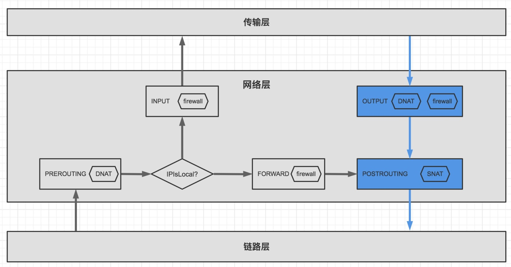
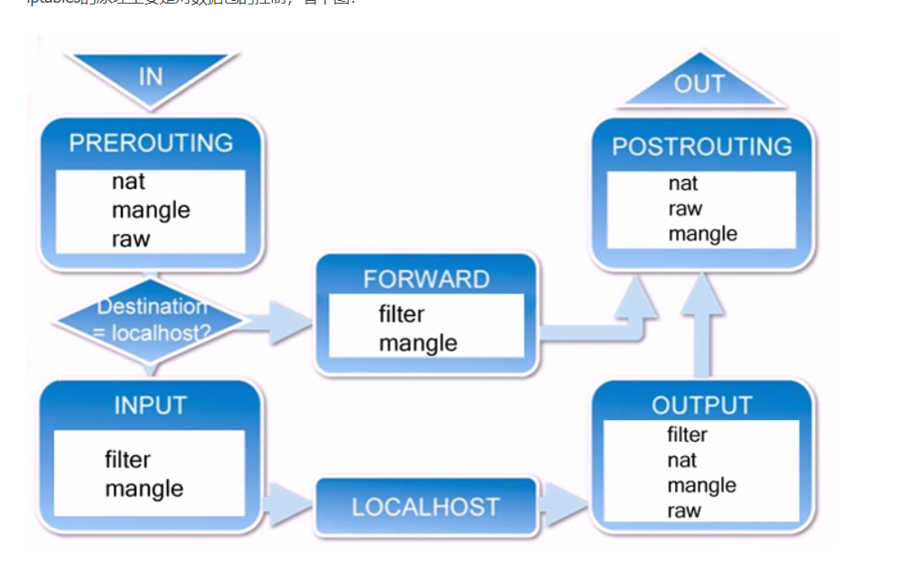
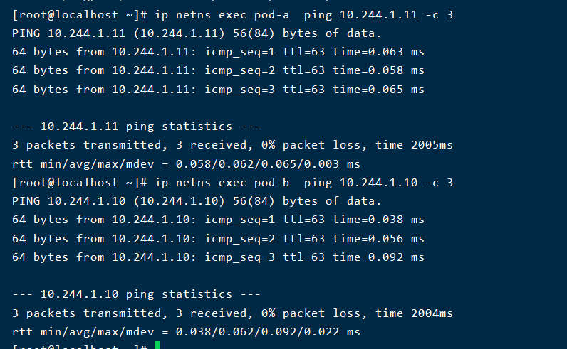

## 文章一

### 基础知识

#### 向外发送一个数据包

* 查找目的地址的路由信息,如果是直连路由,则在邻居表中找到他的Mac地址,然后把数据包直接发给他
* 如果不是直连路由,则在邻居表中找默认路由的Mac地址,把数据包发给默认路由对应的设备
* 如果找不到路由信息,那么就是不可达
* 如果邻居表中找不到Mac地址,就发起ARP请求询问
* 发出去的数据帧,Mac地址一直在变,但是只要不经历nat(snat和dnat),那么ip地址是全程不会变的

#### 接收到一个数据包

* 如果数据帧的目标Mac地址不是自己的Mac地址,而且也不是广播Mac地址(ff:ff:ff:ff),且网卡没有开启混杂模式,则拒绝收包,混杂模式就是所有的帧我都接受
* 如果是目标地址是广播Mac地址,那就进入ARP请求处理
* 如果目标Mac地址就是自己的Mac地址,也要分几种情况讨论
* * 目标ip地址是本机,则上送到上一层协议继续处理
  * 如果目标ip不在本机,如果开启了路由转发,则转发这个分组,否则就丢弃这个分组

对于一台linux主机来说，影响网络方面的配置主要有以下几个:

* 网卡,网卡的配置,ip地址啊,是否开启,也可以虚拟出一张网卡
* 端口: 1-65535 所有进程共用
* iptabels 规则,配置主机的防火墙策略和NAT规则
* 路由表
* 邻居表,就是跟主机在同一个交换机下的ip与Mac地址的对应关系表

拥有一个网络隔离空间,就相当于拥有了一台新的主机,它的网络都是全新的

### pod与主机互通

模拟一个pod出来

> 主机ip为192.168.100.100

```shell
# 创建一个ns
ip netns add ns1
# 查看这个ns的网卡信息
ip netns exec ns1 ip link show
# 增加两张互连的虚拟网卡
ip link add ns1-eth0 type veth peer name veth-ns1 
# 将其中一张网卡插到ns1中
ip link set ns1-eth0 netns ns1 
# 启动ns1中的网卡
ip netns exec ns1 ip link set ns1-eth0 up
# 启动留在主机中的网卡
ip link set veth-ns1 up 
# 给ns1中的网卡添加ip地址
ip netns exec ns1 ip addr add 172.20.1.10/24 dev ns1-eth0  

# 此时还是无法ping通主机的,会显示网络不可达(找不到路由信息,就会出现不可达,验证了前面我们说的),因为我们还没有配置路由表,数据包不知道往哪里发送
ip netns exec ns1 ping -c 3 192.168.100.100 

# 我们需要配置ns1中的路由表,增加一条默认路由,这下就能找到路由信息了
ip netns exec ns1 ip route add default via 172.20.1.1 dev ns1-eth0 
# 现在去ping已经不是不可达了,而是一直等待,没有响应,这是为什么呢?,我们填的网关地址是不存在的,当然找不到他的物理地址,我们有两种方式,一种是给另一端的网卡(也就是我们的网关)设置这个ip地址,还有就是给另一端的网卡的ARP开启一切都应答,不管什么ip地址,我都答复)
# 方式一,给对端网卡这是ip
ip addr add 172.20.1.1/24 dev veth-ns1
# 方式二,开启一切应答模式
echo 1 > /proc/sys/net/ipv4/conf/veth-ns1/proxy_arp 
# 现在查看邻居表中有没有对端网卡的Mac地址
ip netns exec ns1 ip neigh 

# 如果使用了方式一,那么直接就能ping通主机了,因为添加ip的时候,会自带添加一条路由信息,如果使用方式二,我们还得自己添加路由信息,不然主机不知道数据包往哪发送,我们得告诉主句,来自172.20.1.10的数据都忘veth-ns1这个网卡发送
ip route add 172.20.1.10 dev veth-ns1
```

### pod访问外网

如果pod需要访问外网,我们需要开启主机的转发功能,不然是无法访问外网的

```
echo 1 > /proc/sys/net/ipv4/ip_forward
```

然后还要开启snat

```
iptables -A POSTROUTING -t nat -s 172.20.1.10 -j MASQUERADE
```

我们现在进入ns1 ping 百度就可以啦

```shell
[root@localhost ~]# ip netns exec ns1 ping -c 4  www.baidu.com
PING www.baidu.com (198.18.0.74) 56(84) bytes of data.
64 bytes from 198.18.0.74 (198.18.0.74): icmp_seq=1 ttl=127 time=0.452 ms
64 bytes from 198.18.0.74 (198.18.0.74): icmp_seq=2 ttl=127 time=1.01 ms
64 bytes from 198.18.0.74 (198.18.0.74): icmp_seq=3 ttl=127 time=0.788 ms
^C
--- www.baidu.com ping statistics ---
3 packets transmitted, 3 received, 0% packet loss, time 2003ms
rtt min/avg/max/mdev = 0.452/0.750/1.012/0.232 ms
```

## 文章二

### 基础知识

#### netfilter

linux的收发包是非常复杂的,为了让用户可以在收发包的过程中对数据包进行修改和过滤,linux引入了netfilter子系统,在收发包的过程中,添加了五个扩展点:

* NF_INET_PRE_ROUTING（PREROUTING,数据包刚到达的时候会经过这个点,**主要用来做DNAT**

* NF_INET_LOCAL_IN（INPUT） 数据要经过本机的传输层的时候会经过这个点,通常用于完成防火墙的入站检测

* NF_INET_FORWARD（FORWARD） 数据包要经过本机转发的时候会经过这个点,通常用于防火墙的转发过滤

* NF_INET_LOCAL_OUT（OUTPUT） 从本机发送的数据包都要经过这个点,通常用来做DNAT和防火墙出站检测

* NF_INET_POST_ROUTING（POSTROUTING） 数据包离开本机的时候要经过的点,通常用来做**SNAT**,注意和上面这个OUTPUT的区别,output是从本机发送的数据,POSTROUTING还包括转发的数据包

  

几个关键流程:

* 主机应用程序发送数据到外部会经过的点:  OUTPUT->POSTROUTING
* 主机应用程序接受外部数据会经历的点: POSTROUTING->INPUT
* 主机上的其他pod(可以理解为其他虚拟机器)发送数据到外部,也就是转发数据: PREROUTING->FORWARD->POSTROUTING

> pod虽然是主机的一个进程,但是在收发包的流程却和普通的进程大不相同,pod相当于一台虚拟主机

#### iptables

虽然linux为我们预留了5个扩展点,但是扩展函数编写起来非常困难,我们可以通过iptables简化(但是我也觉得比较麻烦)



```shell
iptables -A INPUT -t filter -s 192.168.1.10 -j DROP
```

固定前缀参数

* -A 追加一条规则到后面
* -I 前面插入一条规则,让它的优先级更高
* -D 删除规则
* -N 删除链
* -F 清空所有规则或者链
* -X 删除一条用户自定义链
* -P 更改链的默认策略
* -L 展示这条链的规则

五条链(就是对应的五个拓展点):

* PREROUTING
* INPUT
* FORWORD
* OUTPUT
* POSTROUTING

-t 后面表示要操作的表:

* filter 表  用于拦截或者放行,不修改包,如果不指定,模式是filter表
* nat表 用于修改ip数据包的源/目地址
* mangle表 主要用于给数据打标记

数据包的匹配规则:

* -s 代表匹配源ip地址
* --sport 代表匹配源端口
* -dport 代表匹配目标端口
* -p 代表匹配协议类型
* -d 代表匹配目标地址

-j 后面接动作:

* DROP 丢弃这个数据包
* ACCEPT 接收这个数据包
* RETURN 返回上一条数据链
* SNAT 源地址转换 后面要跟 转换的地址
* DNAT 目标地址转化,后面要跟指定的目标地址
* MASQUERADE 对进入该链的包进行数据源地址转换,但是不需要指定源地址,会自动根据发送网卡的源地址作为转化源地址

举几个例子:

```
# 增加一条规则: 将本机应用程序待发送到10.96.0.100 的包的目标地址变成10.244.3.10 ( OUTPUT 代表发送出去的数据包, -t表示要进行nat转化,-j代表DNAT转化)
iptables -A OUTPUT -t nat -d 10.96.0.100 -j DNAT --to-destination 10.244.3.10
```

```
# 将来到本机的数据包的目标地址为10.96.0.100变成10.244.3.10
iptables -A PREROUTING -t nat -d 10.96.0.100 -j DNAT --to-destination 10.244.3.10
```

```
# 将源地址是172.20.1.10 的数据包进行snat转化,并且自动选取网卡ip为源ip
iptables -A POSTROUTING -t nat -s 172.20.1.10 -j MASQUERADE
```

```
# 本机应用接收来自192.168.8.166:80协议是tcp的数据包
iptables -A INPUT -t filter -s 192.168.8.166 -p tcp --dport 80 -j ACCEPT
```




这个就是

### 主机间的pod进行通信

创建pod-a

```
ip netns add pod-a
ip link add eth0 type veth peer name veth-pod-a  
ip link set eth0 netns pod-a  
ip link set veth-pod-a up 
ip netns exec pod-a ip addr add 10.244.1.10/24 dev eth0 
ip netns exec pod-a ip link set eth0 up 

ip netns exec pod-a ip route add default via 169.254.10.24 dev eth0 onlink
echo 1 > /proc/sys/net/ipv4/conf/veth-pod-a/proxy_arp
ip route add 10.244.1.10 dev veth-pod-a
```

创建pod-b

```
ip netns add pod-b
ip link add eth0 type veth peer name veth-pod-b  
ip link set eth0 netns pod-b  
ip link set veth-pod-b up 
ip netns exec pod-b ip addr add 10.244.1.11/24 dev eth0 
ip netns exec pod-b ip link set eth0 up 

ip netns exec pod-b ip route add default via 169.254.10.24 dev eth0 onlink
echo 1 > /proc/sys/net/ipv4/conf/veth-pod-b/proxy_arp
ip route add 10.244.1.11 dev veth-pod-b
```

主机进行的操作

```
echo 1 > /proc/sys/net/ipv4/ip_forward
# 这个代表允许转发源网络地址是10.244.1开头的目标地址是10.244开头的数据包
iptables -I FORWARD -s 10.244.1.0/24 -d 10.244.1.0/24 -j ACCEPT 
```

测试能不能ping通

```
ip netns exec pod-a  ping 10.244.1.11 -c 3
ip netns exec pod-b  ping 10.244.1.10 -c 3
```



没问题的

### 用iptables 模拟k8s的service

其实我们只需要将service对应的ip做dnat转换,转换到对应的pod就OK了,用10.96.0.10 代替service的ip地址

```
iptables -A PREROUTING -t nat -d 10.96.0.100 -j DNAT --to-destination 10.244.1.11
# 将请求10.96.0.100的流量转发给pod-b就可以了
```

#### pod-a ping  service

这个时候我们用pod-a ping 10.96.0.100那肯定是没问题的

```
ip netns exec pod-a ping -c 5 10.96.0.100
```

#### 主机ping service

我们这个时候用主机ping这个ip地址应该是不可以的,但是我的虚拟机不知道为啥就可以,很神奇,按照流程来说,我们应该要在output这个链上加上DNAT才行,

```
iptables -A OUTPUT -t nat -d 10.96.0.100 -j DNAT --to-destination 10.244.1.11
```

#### pod-b ping service

我们用pod-b 去ping service,这个能不能ping通呢? 答案是不可以哦,因为经过了DNAT转化后,pod-b发送的数据包的源ip和目的ip都是自己的ip地址了,一般连接外面的网卡默认都不会接收源ip是自己的数据包

查看开关情况

```
ip netns exec pod-b sysctl net.ipv4.conf.eth0.accept_local
```

> ip netns exec pod-b sysctl -w net.ipv4.conf.eth0.accept_local=1 按理说我把这个值变成1是不是就行了,但是我测试后发现不行

我们可以通过修改源ip地址的方式,做一次snat就可以了

```
# iptables -d POSTROUTING -t nat -s 10.244.1.11 -j MASQUERADE  这种方式其实不太好,这是将所有源地址是10.244.1.11都变成本机ip了,这样有缺陷的,我们需要将源地址与目的地址都是10.244.1.11 做一次转化
iptables -A POSTROUTING -t nat -d 10.244.1.11 -s 10.244.1.11 -j MASQUERADE
```

我们可以发现使用podip 和 clusterip 的区别就在与clusterip 仅仅多做了了一次地址转换在PREROUTING这条链上做了dnat转换,走的转发路径也都是一样的

## 文章三

### 跨主机pod通信

准备两台结点

node1: 192.168.100.100

node2: 192.168.100.101

#### node1创建pod-a(192.168.10.10)

```
ip netns add pod-a
ip link add eth0 type veth peer name veth-pod-a
ip link set eth0 netns pod-a
ip netns exec pod-a ip addr add 192.168.10.10/24 dev eth0
ip netns exec pod-a ip link set eth0 up
ip netns exec pod-a ip route add default via 169.254.10.24 dev eth0 onlink
ip link set veth-pod-a up
echo 1 > /proc/sys/net/ipv4/conf/veth-pod-a/proxy_arp
echo 1 > /proc/sys/net/ipv4/ip_forward
iptables -I FORWARD -s 192.168.0.0/16 -d 192.168.0.0/16 -j ACCEPT
ip route add 192.168.10.10 dev veth-pod-a scope link
```

#### node2创建pod-b(192.168.11.10)

```
ip netns add pod-b
ip link add eth0 type veth peer name veth-pod-b
ip link set eth0 netns pod-b
ip netns exec pod-b ip addr add 192.168.11.10/24 dev eth0
ip netns exec pod-b ip link set eth0 up
ip netns exec pod-b ip route add default via 169.254.10.24 dev eth0 onlink
ip link set veth-pod-b up
echo 1 > /proc/sys/net/ipv4/conf/veth-pod-b/proxy_arp
echo 1 > /proc/sys/net/ipv4/ip_forward
iptables -I FORWARD -s 192.168.0.0/16 -d 192.168.0.0/16 -j ACCEPT
ip route add 192.168.11.10 dev veth-pod-b scope link
```

此时pod与各自主机是能够ping 通的, 但是pod与pod之间还是无法ping通的

```
ip route add 192.168.11.0/24 via 192.168.100.101 dev ens33 onlink 
```

```
ip route add 192.168.10.0/24 via 192.168.100.100 dev ens onlink 
```

我们可以在主机一种的pod-a中开一个服务

```
ip netns exec pod-a nohup socat TCP4-LISTEN:80,fork exec:cat 2>&1 &   
```

