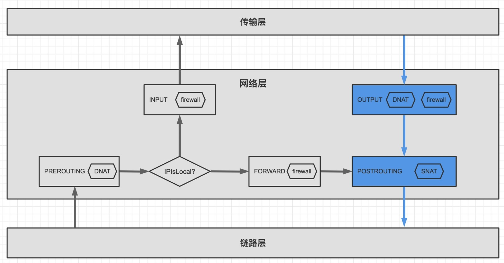

## 前言

> 此文章转载于https://cloud.tencent.com/developer/inventory/21543/article/1869600,我觉得写得非常好,怕他哪天不见了,就记录下来了

上一篇文章中我们介绍了pod与主机互通及pod访问外网的原理，在这一章我们将介绍pod与pod的相互访问以及外部服务访问pod的方式，由此引出k8s的service的几种类型、使用场景和相关的实现原理。

> 本文将继续沿用上一章的习惯，用linux network namespace（下面简称ns）来代表pod，注意我们说的pod就特指是hostNetwork为false的pod

我们将在一个节点模拟创建几个pod,用iptables的方式模拟实现clusterIP和nodeport的方式暴露到节点外。

开始之前，我们还是先上关于阅读本章内容需要掌握的linux网络知识。

## netfilter

linux收发包流程是一个贼复杂的过程，为了让用户可以在收发包的过程中对数据包进行修改或过滤，linux从2.4版本开始引入了netfilter子系统，在收发包的数据路径中的关键节点上提供扩展（hook）点，这些扩展点上可以编写扩展函数对数据包进行过滤和修改，扩展点一共有五个点，主要有：

- `NF_INET_PRE_ROUTING（PREROUTING）`，数据包刚到达时会经过这个点，通常用来完成DNAT的功能。
- `NF_INET_LOCAL_IN（INPUT）`，数据包要进入本机的传输层时会经过这个点，通常用来完成防火墙入站检测。
- `NF_INET_FORWARD（FORWARD）`，数据包要通过本机转发时会经过这个点，通常用来完成防火墙转发过滤。
- `NF_INET_LOCAL_OUT（OUTPUT）`，从本机的数据包要出去的时候会经过这个点，通常用来做DNAT和防火墙出站检测。
- `NF_INET_POST_ROUTING（POSTROUTING）`，数据包离开本机前会经过这个点，通常用来做SNAT。


图一：netfilter

为什么要了解这个netfilter呢？因为k8s的serviceIP实现（无论是iptables和ipvs）、NetworkPolicy的实现都与这个netfilter的流程息息相关，对于netfilter需要get到几个关键的流程：

- 主机的应用程序接收外部的数据包会经过的点：PREROUTING -> INPUT


图二：主机应用程序接收数据包流程

- 主机的应用程序发送数据包到外部会经过的点：OUTPUT -> POSTROUTING



图三：主机应用程序发送数据包流程

- 主机上的pod发送的数据包去外部或去主机的另一个pod：PREROUTING -> FORWARD -> POSTROUTING


图四：主机上的pod发送数据去外部或主机的另一个pod的流程

> 主机上运行的pod虽然也是主机上的一个进程，但pod发送数据包出去的流程却和主机的其它进程不一样，这个点刚开始笔者也曾经困惑过，因为pod在新的ns中，所以它的发包流程是和主机收到另一台主机的数据然后转发的流程一样的；

- 另外注意图中的IPIsLocal点，会判断数据包的目标IP是否为本机IP，如果是，则往INPUT点走；当IP不是本机IP，就会看net.ipv4.ip_forward是否为1,是则继续走朝FORWARD走，为0则丢弃，所以要设置为1才能为主机上的pod提供流量转发功能；

掌握这几个流程对于我们后面使用iptables及理解k8s的service的实现很有帮助，下面的内容我们会多次用到这几个流程。

虽然linux为我们预留了5个扩展点，但编写扩展函数的难度贼大，需要了解很多上下文，随便一个错误就会让主机蓝屏死机什么的，贼刺激，所以我们要找个更容易使用的工具，iptables就是这个工具，它在netfilter子系统的扩展点上已经实现了对数据包的匹配和修改，然后提供命令行让用户可以轻松地制定规则，我们只需要告诉它怎么匹配和把包修改成什么就行了，有了iptables，数据包的拦截与修改就变得容易了。

## iptables

大多数linux发行版都默认集成了iptables，先通过一个简单的iptables命令来了解一下：

```js
iptables -A INPUT -t filter -s 192.168.1.10 -j DROP
```

复制

上面的命令是一条防火墙入站规则，意思是指不允许来源为192.168.1.10的IP访问本机的服务；

我们来详细解释下上面的命令，iptables是命令的固定前缀

- ```
  -A
  ```

   是指后面追加一条规则，其它：

  - -I是前面插入规则，优先级更高
  - `-D`是删除规则
  - `-N`是新增加链
  - `-F`清除链上的所有规则或所有链
  - `-X`删除一条用户自定义链
  - `-P`更改链的默认策略
  - `-L`展示指定的链上的规则

- `INPUT`是iptables链的名称，指示当前规则工作在哪个netfilter的扩展点，iptables有五条固定的链，与netfilter子系统的扩展点一一对应，分别是：INPUT、OUTPUT、PREROUTING、FORWARD、POSTROUTING；根据上面对netfilter的扩展点的功能解释，防火墙规则一般只工作在INPUT/OUTPUT/FORWARD三个扩展点，而我们是要限制访问本机运行的服务，而INPUT点专门负责入站检测规则，所以选择了INPUT点；所以说我们要先了解netfilter子系统的五个点才能更好地使用iptables；

- ```
  -t
  ```

  指定当前命令操作所属的表，主要有：

  - filter表，主要用于拦截或放行，不修改包；如果不指定，则默认为filter表
  - nat表，主要用于修改IP包的源/目标地址
  - mangle表，主要用于给数据包打标记
  - raw表，没用过不知道干什么的哈哈
  - security表，没用过

- ```
  -s
  ```

  是数据包的匹配规则，配置规则可以一个或多个，多个是与的效果，这里

  ```
  -s
  ```

  是匹配来源IP的意思，还有其它：

  - `-d`是匹配目标IP
  - `--sport`是匹配来源端口
  - `--dport`是匹配目标端口
  - `-p tcp`是匹配协议类型

- ```
  -j DROP
  ```

  是执行的动作，这里是跳转到

  ```
  DROP
  ```

  链，iptables有几个预定义的链：

  - `DROP`丢弃进入该链的包
  - `ACCEPT`接受进入该链的包
  - `RETURN`返回上一级链
  - `SNAT`源地址转换，要指定转换后的源地址，下面会有示例
  - `DNAT`目标地址转换，要指定转换后目标地址
  - `MASQUERADE`对进入该链的包进行源地址转换，与SNAT类似，但不用指定具体的转换后的源地址，会自动应用发送网卡的地址作为源地址，通常都用这条链完成SNAT

再来看几个iptables的命令：

- 把本机应用发往10.96.0.100的数据包的目标地址换成10.244.3.10上，注意是要影响本机应用，所以用的是OUTPUT链（注意图3），clusterIP主要就是使用下面的这条规则完成：

```js
iptables -A OUTPUT -t nat -d 10.96.0.100 -j DNAT --to-distination 10.244.3.10
```

复制

- 上面的规则只对本机的应用程序发送的流量有影响，对于本机的pod发出的流量没有影响，如果要影响本机的pod，还要再加一条，规则都一样，就是工作在PREROUTING链（注意图4）：

```js
iptables -A PREROUTING -t nat -d 10.96.0.100 -j DNAT --to-distination 10.244.3.10
```

复制

- 对本机发送的数据包中来源IP为172.20.1.10的数据包进行源地址伪装，注意修改源地址只有一个点可以用，就是POSTROUTING，下面的规则就是配置pod上外网时使用的：

```js
iptables -A POSTROUTING -t nat -s 172.20.1.10 -j MASQUERADE
```

复制

- 允许来源IP为192.168.6.166并访问本机的TCP80端口：

```js
iptables -A INPUT -t filter -s 192.168.8.166 -p tcp --dport 80 -j ACCEPT
```

复制


为了使数据包能够尽量正常地处理与转发，iptables上的规则创建会有一些限制，例如我们不能在POSTROUTING链上创建DNAT的规则，因为在POSTROUTING之前，数据包要进行路由判决，内核会根据当前的目的地选择一个最合适的出口，而POSTROUTING链的规则是在路由判决后发生，在这里再修改数据包的目的地，会造成数据包不可到达的后果，所以当我们用iptables执行如下命令时：

```js
iptables -A POSTROUTING -t nat -d 192.168.8.163 -j DNAT --to-distination 192.168.8.162

iptables:Invalid argument. Run `dmesg` for more information.

##执行dmesg命令会看到iptables提示：DNAT模块只能在PREROUTING或OUTPUT链中使用
##x_tables:iptables:DNAT target:used from hooks POSTROUTING,but only usable from PREROUTING/OUTPUT
```

复制

简单了解iptables后，我们再来看看为什么k8s会设计service这个东西。

## 为什么k8s会设计service

主要是因为下面两个原因：

- pod的特性是快速创建快速销毁，所以pod的IP是不固定的，要让调用方有个固定依赖，所以需要一个VIP出来代表一个服务

> pod的IP为什么不固定？一般的cni给pod分配IP时都是一个集群节点占用一个24位子网（就是NODE-CIDR，通常我们会在安装k8s集群时指定一个POD-CIDR，例如：10.244.0.0/16，然后k8s会给每一个集群节点分配一个24位的子网，例如：10.244.2.0/24，然后所有10.244.2开头的POD都是在这个节点上运行的），podIP固定就意味着pod必须在一个固定的k8s集群节点，如果那个节点挂了，那pod就永远起不来了，这与k8s的设计相悖，k8s是要应用不要依赖具体的硬件资源； 当然也不是说pod的IP就一定不能固定，这要看具体的cni而言，比如flannel就是上面说的那种情况，但也有能实现的，比如我们自研的mustang，就实现了有状态应用的固定IP，一个POD多网卡等（广告一波）

- 一般来说为了追求应用的高可用，一个应用会部署多个pod，这时需要一个VIP充当多个pod的流量[负载均衡](https://cloud.tencent.com/product/clb?from=10680)器

## service的几种类型分别有什么使用场景

- ***clusterIP***：只能在集群的节点和pod中访问，解决的就是集群内应用间的相互访问的问题；
- ***nodeport***：通过节点的地址和端口把pod暴露到集群外，让集群外的应用能访问集群内的应用，设置服务类型为nodeport时，是在clusterIP的基础上再给节点开个端口转发（是特定节点还是每一个节点要看externalTrafficPolicy的值，Cluster是每一个节点都开，Local是只在pod运行的节点开），所以nodeport的服务也会有一个clusterIP
- ***loadBalancer***：因为使用nodeport方式时，免不了要在应用的调用方写死一个集群节点的IP，这并非高可用的方式，所以又有了使用第三方[负载均衡器](https://cloud.tencent.com/product/clb?from=10680)的方式，转发到多个节点的nodeport，这种类型通常需要用户扩展个控制器与云平台或所属IDC机房的负载均衡器打通才能生效，普通安装的k8s集群一般类型为loadBalancer的服务都是pending状态；loadBalancer是在nodeport的基础之上再创建个lb，所以也是会先分配一个clusterIP，再创建节点的端口转发。
- ***headless***：应用内多个副本彼此间互相访问，比如要部署到mysql的主从，从的副本想要找主的副本；
- ***externalName***：其实只是相当于dns的cname记录

了解这些以后，我们试着用iptables模拟一个k8s的service吧，我们会在一个节点创建两个pod，分别叫pod-a、pod-b，然后学iptables模拟一个VIP，这个VIP会把流量转给pod-b，最后试着在节点和pod-a中使用这个VIP访问pod-b，最后再试试在pod-b中用VIP访问自身会是什么情况，以此来解释hairpin flow的场景

## 先在主机创建两个pod

在我们测试的主机上创建两个pod，pod与主机连接的配置过程我们上一章已经介绍过，这里我们就直接上命令，不再一一解释：

1. 创建pod-a（10.244.1.10）

```js
ip netns add pod-a
ip link add eth0 type veth peer name veth-pod-a  
ip link set eth0 netns pod-a  
ip link set veth-pod-a up 
ip netns exec pod-a ip addr add 10.244.1.10/24 dev eth0 
ip netns exec pod-a ip link set eth0 up 

ip netns exec pod-a ip route add default via 169.254.10.24 dev eth0 onlink
echo 1 > /proc/sys/net/ipv4/conf/veth-pod-a/proxy_arp
ip route add 10.244.1.10 dev veth-pod-a
```

复制

1. 创建pod-b（10.244.1.11）

```js
ip netns add pod-b
ip link add eth0 type veth peer name veth-pod-b  
ip link set eth0 netns pod-b  
ip link set veth-pod-b up 
ip netns exec pod-b ip addr add 10.244.1.11/24 dev eth0 
ip netns exec pod-b ip link set eth0 up 

ip netns exec pod-b ip route add default via 169.254.10.24 dev eth0 onlink
echo 1 > /proc/sys/net/ipv4/conf/veth-pod-b/proxy_arp
ip route add 10.244.1.11 dev veth-pod-b
```

复制

为了确保两个pod能ping通，还需要：

```js
echo 1 > /proc/sys/net/ipv4/ip_forward
iptables -I FORWARD -s 10.244.0.0/16 -d 10.244.0.0/16 -j ACCEPT 
```

复制

如无意外，应该可以在pod-a中ping通pod-b了

```js
ip netns exec pod-a ping -c 5 10.244.1.11

PING 10.244.1.11 (10.244.1.11) 56(84) bytes of data.
64 bytes from 10.244.1.11: icmp_seq=1 ttl=63 time=0.090 ms
64 bytes from 10.244.1.11: icmp_seq=2 ttl=63 time=0.081 ms
64 bytes from 10.244.1.11: icmp_seq=3 ttl=63 time=0.062 ms
64 bytes from 10.244.1.11: icmp_seq=4 ttl=63 time=0.062 ms
64 bytes from 10.244.1.11: icmp_seq=5 ttl=63 time=0.054 ms
--- 10.244.1.11 ping statistics ---
5 packets transmitted, 5 received, 0% packet loss, time 136ms
rtt min/avg/max/mdev = 0.054/0.069/0.090/0.017 ms
```

复制

我们用iptables搞起来！

## 用iptables模拟实现k8s服务

### 模拟cluterIP

用iptables模拟VIP：10.96.0.100，并把流量转到pod-b，命令如下：

```js
iptables -A PREROUTING -t nat -d 10.96.0.100 -j DNAT --to-destination 10.244.1.11
```

复制

好了，可以跑去pod-a中试试用clusterIP去ping一下pod-b了

```js
ip netns exec pod-a ping -c 5 10.96.0.100

PING 10.96.0.100 (10.96.0.100) 56(84) bytes of data.
64 bytes from 10.96.0.100: icmp_seq=1 ttl=63 time=0.112 ms
64 bytes from 10.96.0.100: icmp_seq=2 ttl=63 time=0.084 ms
64 bytes from 10.96.0.100: icmp_seq=3 ttl=63 time=0.064 ms
64 bytes from 10.96.0.100: icmp_seq=4 ttl=63 time=0.084 ms
64 bytes from 10.96.0.100: icmp_seq=5 ttl=63 time=0.054 ms
--- 10.96.0.100 ping statistics ---
5 packets transmitted, 5 received, 0% packet loss, time 135ms
rtt min/avg/max/mdev = 0.054/0.079/0.112/0.022 ms
```

复制

> 咦？在iptables模式下，clusterIP都是ping不通的啊？其实只是kube-proxy在实现时只根据ip+端口+协议精确匹配才转发，这才导致clusterIP不能ping，我们上面只是IP匹配，所以icmp协议也会正常转，当然也就可以ping得通了。

这个时候在测试主机上用clusterIP能ping通pod-b吗？

```js
ping -c 5 10.96.0.100

PING 10.96.0.100 (10.96.0.100) 56(84) bytes of data.
--- 10.96.0.100 ping statistics ---
5 packets transmitted, 0 received, 100% packet loss, time 133ms
```

复制

答案是不行？为什么呢？回忆一下上面提过的netfilter流程，本机应用程序的包出去时只比过OUTPUT和POSTROUTING（注意图2），而我们刚刚的命令只在PREROUTING上生效，为了测试主机也能访问clusterIP，还要再增加一条规则：

```js
iptables -A OUTPUT -t nat -d 10.96.0.100 -j DNAT --to-destination 10.244.1.11
```

复制

然后在测试主机上也可以ping通了

### hairpin flow

如果在pod-b中用clusterIP去ping它自己呢？

```js
ip netns exec pod-b ping -c 5 10.96.0.100

PING 10.96.0.100 (10.96.0.100) 56(84) bytes of data.
--- 10.96.0.100 ping statistics ---
5 packets transmitted, 0 received, 100% packet loss, time 129ms
```

复制

不通，因为从pod-b出来的数据包，经过目标地址转换后，又回到了pod-b，这时来源IP也是pod-b，pod-b的的eth0网卡一般会有一个开关：

```js
ip netns exec pod-b bash ## 进入pod-b的ns中运行bash
sysctl net.ipv4.conf.eth0.accept_local  ## 显示的结果是：net.ipv4.conf.eth0.accept_local = 0
```

复制

这个开关指示是否允许eth0网卡接收源IP为本机IP的数据包，默认是不允许，于是内核协议栈会把这个包丢掉，所以就不通了；

为了能ping通，我们需要让进入pod-b的数据包的源IP转换成非pod-b的IP，就是说我们要在netfilter流程中对数据包做一次源地址转换，iptables中能做SNAT的点只有一个，就是POSTROUTING，于是：

```js
iptables -A POSTROUTING -t nat -d 10.244.1.11 -s 10.244.1.11 -j MASQUERADE
```

复制

经过上面的命令配置后，在pod-b中也能用vip ping自身了

```js
ip netns exec pod-b ping -c 5 10.96.0.100

PING 10.96.0.100 (10.96.0.100) 56(84) bytes of data.
64 bytes from 10.96.0.100: icmp_seq=1 ttl=63 time=0.059 ms
64 bytes from 10.96.0.100: icmp_seq=2 ttl=63 time=0.081 ms
64 bytes from 10.96.0.100: icmp_seq=3 ttl=63 time=0.068 ms
64 bytes from 10.96.0.100: icmp_seq=4 ttl=63 time=0.082 ms
64 bytes from 10.96.0.100: icmp_seq=5 ttl=63 time=0.065 ms
--- 10.96.0.100 ping statistics ---
5 packets transmitted, 5 received, 0% packet loss, time 82ms
rtt min/avg/max/mdev = 0.059/0.071/0.082/0.009 ms
```

复制

***这就是我们说的hairpin flow的场景：pod通过clusterIP访问自已***

### k8s中kube-proxy中如何用iptables处理hairpin flow场景？

在使用iptables实现service的k8s集群的节点上，截取一段iptables规则：（用iptables-save命令，为了显示简洁均把注释省略，链的名称也简化为-1后缀了）

```js
-A PREROUTING  -j KUBE-SERVICES  ##基操，就像上面例子一样，接管从pod过来的流量
-A OUTPUT  -j KUBE-SERVICES      ##基操，就像上面例子一样，接管从主机应用出来的流量

-A KUBE-SERVICES -d 10.96.252.6/32 -p tcp -m tcp --dport 80 -j KUBE-SVC-1  ##这是基操，每个服务都有一条这样的规则

-A KUBE-SVC-1  -j KUBE-SEP-1 ##这条链一开始看着感觉很多余，为什么不直接DNAT呢？

-A KUBE-SEP-1 -s 10.90.2.233/32  -j KUBE-MARK-MASQ ##把来源为自身的做了标记
-A KUBE-SEP-1 -p tcp  -m tcp -j DNAT --to-destination 10.90.2.233:80 ##这也是基操
```

复制

上面显示的规则中第4条，为什么不直接转给最后一条，而是在中间加一个来源地址为自身时跳到`KUBE-MARK-MASQ`？

来看看`KUBE-MARK-MASQ`是干什么的？

```js
-A KUBE-MARK-MASQ -j MARK --set-xmark 0x4000/0x4000
```

复制

先是标记了一下，然后在POSTROUTING的点进行了源地址转换：

```js
-A KUBE-POSTROUTING -m mark --mark 0x4000/0x4000 -j MASQUERADE
```

复制

在PREROUTING点中先标记一下，这是hairpin场景的流量（因为PREROUTING中还不能做SNAT，所以只能先记下），然后在POSTROUTING点中再对标记过的流量进行SNAT，这一系列的操作其实就是为了实现上面的hairpin的场景

### 模拟NodePort

因为是具体到IP+端口了，所以也只能转到IP+端口，所以不能用ping来验证了，下面模拟把访问主机的tcp33888端口的流量都转给pod-b的80端口：

```js
iptables -A OUTPUT -t nat -m addrtype --dst-type LOCAL -m tcp -p tcp --dport 33888 -j DNAT --to-destination 10.244.1.11:80
iptables -A PREROUTING -t nat -m addrtype --dst-type LOCAL -m tcp -p tcp --dport 33888 -j DNAT --to-destination 10.244.1.11:80
```

复制

> 上面因为我们要接管两个点的流量，所以配置两条规则，实际的k8s的kube-proxy在实现时会设计更加合理的链来避免规则大量重复定义，上面只是为了演示效果

`-m addrtype --dst-type LOCAL`的意思是匹配主机所有IP（笔者使用的主机用vbox虚拟的虚拟机，有两个IP，192.168.6.160和10.0.2.15）验证之前，先在pod-b启动一个socat服务监听80端口，这个服务会把把收到的内容原样返回

```js
ip netns exec pod-b nohup socat TCP4-LISTEN:80,fork exec:cat 2>&1 &   
```

复制

接着在主机上用nc访问：（笔者的主机IP为：192.168.6.160）

```js
nc 192.168.6.160 33888   ## 或者 nc 10.0.2.15 33888 也是可以的
hello ##这是我发送的内容
hello ##这是服务返回的内容，符合预期
```

复制

在pod-a中验证：

```js
ip netns exec pod-a nc 10.0.2.15 33888
hello world
hello world
```

复制

> 然后nodeport下的hairpin flow的处理方式和clusterIP是一样的，甚至其实是上到同一条链上去处理的

## 一些误解

1. 相对于直接访问podIP，使用clusterIP来访问因为多一次转发，会慢一些；
   - 其实只是在发送的过程中修改了数据包的目标地址，两者走的转发路径是一模一样的，没有因为使用clusterIP而多一跳，当然因为要做nat会有一些些影响，但影响不大
2. 使用nodeport因为比clusterIP又多一次转发，所以更慢；
   - 没有，nodeport是一次直接就转成了podIP，并没有先转成clusterIP再转成podIP。

## 为什么NetworkPolicy不用限制serviceIP却又能生效？

我们用NetworkPolicy限制不允许pod-a使用pod-b的IP访问pod-b，但没有限制pod-a用clusterIP访问pod-b，怎么用clusterIP也访问不了pod-b呢？

因为：

- 在pod中使用clusterIP访问另一个pod时，防火墙策略的应用是在所在主机的FORWARD点，而把clusterIP转成podIP是在之前的PREROUTING点就完成了
- 在主机中使用clusterIP访问一个pod时，防火墙策略的应用是在主机的OUTPUT点，而把clusterIP转成podIP也是在OUTPUT点，不过在防火墙策略之前

***所以防火墙策略其实从来都不会遇到clusterIP，因为在到达防火墙策略前，clusterIP都已经被转成podIP了，所以我们的网络策略只需要专心限制podIP即可\***

## 留两个问题

1. 使用ipvs模式时，k8s集群的每个节点会有一张叫kube-ipvs0的网卡，网卡下挂着所有的clusterIP，有什么作用？
2. 下面这条iptables规则到底有什么作用？

```js
-A KUBE-FORWARD -m conntrack --ctstate RELATED,ESTABLISHED -j ACCEPT
```

复制

下一章我们会专门介绍跨节点pod通信的几种方式