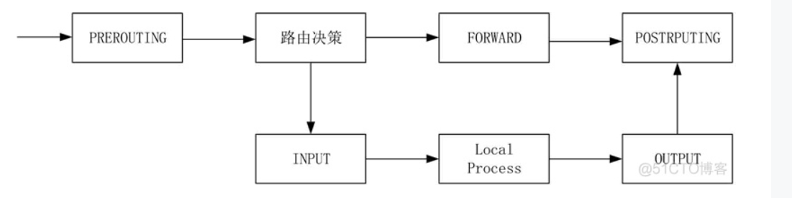
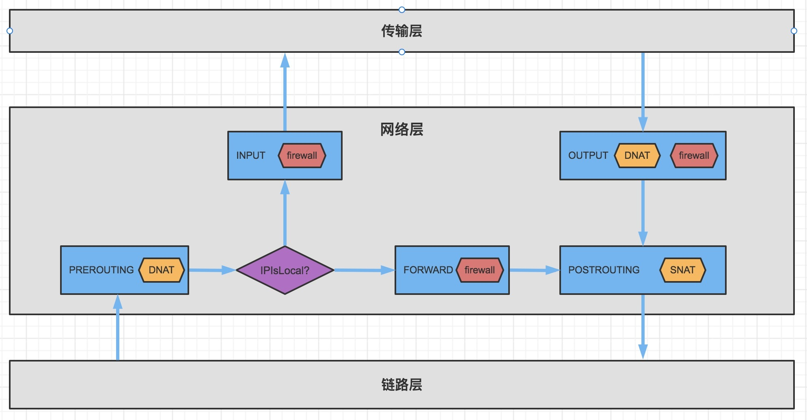
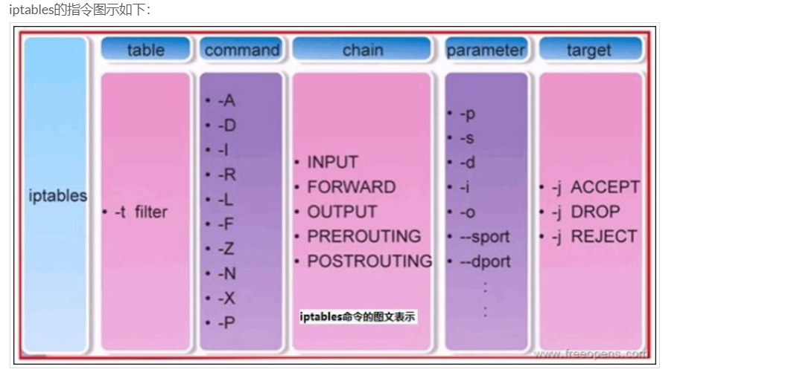
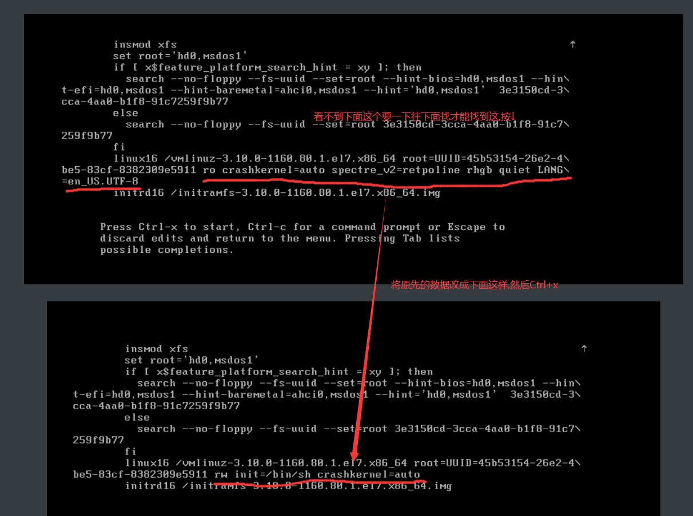
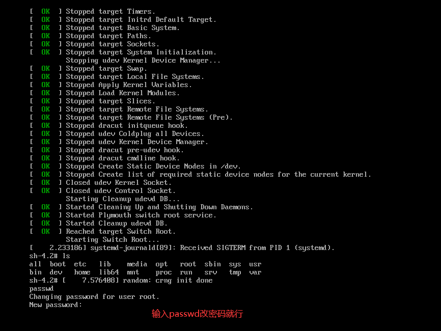
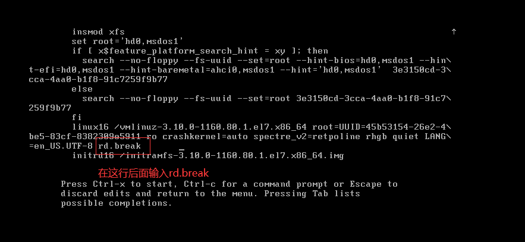
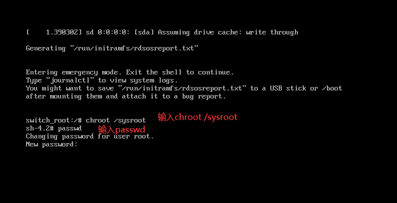

---

title: Linux基础
date: 2022/11/24
tags: linux
---

# 前言

以下总结全部基于CentOS Linux release 7.6.1810 (Core) 总结出来的命令,不同版本对应的命令可能不同

> 小技巧: 当我们不会某个命令时,我们可以使用 命令 --help 来查看它的参数及使用

# 系统目录结构

## 必须存在的目录

* /bin 里面存放着一些经常使用的命令
* /boot 存放着linux启动时的核心文件
* /dev 里面存放着linux外部设备文件
* /etc 里面存放系统管理需要的配置文件
* /lib 存放着基本的动态链接共享库 
* /media 放置可移除的设备,U盘 DVD这些
* /mnt 临时挂在其他设备,与media差不多
* /opt 给额外软件所摆放的目录
* /run 用来放置系统启动的时候产生的信息 /var/run 软连接了这个目录
* /sbin 超级管理员使用的系统管理工具
* /srv 用于放某些服务器所需要的数据 
* /temp 临时文件 系统会开机自动删除
* /usr (unix software resource) 很多用户的应用程序和文件都放在这个文件下面(可分享,不变动),和windows的C:\Program Files 类似
* /usr/bin  /bin就是软连接了这个目录,所以与/bin的作用一样
* /usr/sbin  /sbin 也是软连接了这个目录
* /usr/lib  /lib 就是软连接了这个目录
* /usr/local 放置我们安装软件的地方
* /usr/share 放置共享只读的数据
* /var(variable) 里面放着不断扩充的东西,比如一些日志信息,mysql的数据文件

## 建议存在的目录

* /proc 是系统内存的映射文件,它是虚拟文件,在内存中,并不在硬盘中,里面包含了很多进程的信息

* /home 用户家目录

* /lost + found 非法关机存放的文件

* /root 超级用户的家目录

* /sys 也是虚拟目录,记录核心与系统硬件的信息

  

# 文件与目录管理

## 文件基本属性

d rwx r-x r-x 3 root root 4096 Nov  6 21:14

文件类型 文件拥有者的权限 文件组用户权限 其他人的权限 硬链接计数 文件拥有者 文件所属组 大小 最后修改时间

这些文件拥有者,所属组,其他人其实都只是为了把权限分配的清楚点

### 文件类型

* d 目录(direction)
* L(l) 软连接(ln)
* c 字符块设备(char)
* b 块设备(block)
* p 管道文件(pipe)
* s 本地套接字文件(socket)
* \- 普通文件(使用find命令的时候,f代表普通文件)

## 文件/目录属性操作

文件/目录权限: rwx  读写执行   

### 默认权限

文件默认权限  -rw-rw-rw- 就所有人都只有读写权限

目录默认权限 -rwxrwxrwx 所有人都有读写执行权限  (至于目录为什么要有执行权限,请看额外补充[目录权限与文件权限的区别](#t1))

有人就会说了,我明明创建一个目录,不是所有人都有这个权限啊,比如

```shell
mkdir testdir
ll -ld ./testdir

drwxr-xr-x. 2 root root 6 11月 27 15:22 testdir

```

你看输出的权限,明明跟你说的不是一回事.

别急,后面还有个umask呢

### umask

这个东西就是在默认权限上,需要减掉的权限

```shell
# 输入这个命令看输出什么
[root@localhost ~]# umask
0022
# 输出0022 
#第一个数字是特殊权限,暂时不管 第二个数字代表拥有者要减去的权限
#第三个数字代表所有组要减去的权限,第四个数字代表其他人要减去的权限

```

这个数字是可以自己更改的

```shell
umask 002 
# 比如我们默认创建文件的时候,不想其他人读,我们就可以设置成这样
```

umask设置仅在设置它的终端会话中有效。当你在终端中设置umask值时，**它只会影响当前会话，不会影响其他终端或用户会话**。umask是一个用于控制文件和目录默认权限的设置，当用户在当前会话中创建新的文件或目录时，这些默认权限将会应用。

如果你想要永久更改umask设置，可以在用户的配置文件（例如，~/.bashrc、~/.bash_profile或~/.profile）中设置。这样，在每次新的终端会话开始时，这些设置都会被应用。

对于系统范围的umask设置，可以在全局配置文件（例如，/etc/profile或/etc/bash.bashrc）中进行更改。c

### chattr

chattr 命令（change attributes）用于更改文件或目录的扩展属性。这些扩展属性控制文件或目录在文件系统上的行为。例如，你可以设置一个文件为不可修改（immutable），这样就无法对其进行删除、重命名或更改

* \-   取消某一个属性   \+ 增加某一个属性 
* +a 只能增加内容,不能修改和删除 -a代表取消
* +i 不能被删除、改名、设置链接也无法写入或新增数据！-i代表取消

### lsattr

查看隐藏属性(不是查看隐藏文件哦)

```shell
[root@localhost ~]# lsattr -d test4
-----a---------- test4
```

你会看到这个与ls输出还是有区别的

### chown 

更改文件所有者命令:    chown [-R] 所有者:所属组  文件/目录               -R代表递归下去,否则的话只变当前目录

### chmod

常用参数:

* a 对所有人操作
* u 对所有者操作
* g 所属对用户组操作
* o 对其他人操作

更改文件权限: 

* chmod [-R] 777 用数字代表修饰的权限 1执行 2 写 4读取  和位置刚好对应上   比如  rwx   4 2 1
* chmod [-R] a+x-w 用符号去更改权限
* chmod 7777 还有一种下面这个特殊权限的写法 第一个代表特殊权限   后三个就是跟上面的一样

### 特殊权限SUID ,SGID,SBIT

#### SUID(set uid)

在具有执行权限的应用程序上(而不是shell脚本哈),对拥有者新增s权限,

这个权限的作用是,在可执行的文件的基础上,让**执行者**暂时具有**拥有者的权限**,什么意思呢? 我举个栗子,比如/etc/shadow普通用户用cat是无法查看里面的内容的,但是我们用chmod **u+s**  /usr/bin/cat之后, 普通用户再执行cat /etc/shadow是能够看到里面内容了,还有就是passwd命令,它修改了/etc/shadow里面的东西,普通用户是不是也能通过这个命令修改密码?但是我们不能够手动的去修改/etc/passwd吧!!,所以这些特殊权限的出现都是为了解决问题的,感觉这个特殊权限的出现就是为了解决,**让普通用户只有用指定命令,才能查看或者修改文件或者目录里面的东西**,**重点还是修改,一般连看都不会让看**

这里我们自己做一个演示

这里有root 和 djm 两个用户 操作目录在/root/test4中

首先root用户编写一段c++代码命名为test.cpp查看/etc/shdow(这个文件的权限是000)里面的东西

```c++
#include<iostream>
#include<fstream>
using namespace std;
int main(){
        ifstream in("/etc/shadow");
        char buff[80];
        in>>buff;
        cout<<buff<<endl;
        in.close();
} 
```

```shell
[root@localhost test4] g++ -o test test.cpp  #编译
[root@localhost test4] ./test  #运行
root:$1$6TJ77l9F$sizoIqVNB4hGQWtYlu5.S.::0:99999:7:::  # 我们看到是能够出现东西的

```

切换到djm这个用户去执行这个脚本

```shell
[djm@localhost test4]$ ./test

[djm@localhost test4]$

#我们发现什么都没有输出,因为里面肯定出错了,没有权限去读这个文件
```

我们将这个应用程序拥有者加上s权限,再让djm去执行

``` shell
[root@localhost test4] chmod u+s test
[root@localhost test4] su djm
[djm@localhost test4] ./test
root:$1$6TJ77l9F$sizoIqVNB4hGQWtYlu5.S.::0:99999:7:::
[djm@localhost test4]  #发现能够顺利的读出来了 
```


#### SGID

* 在所属组具有执行权限的应用程序上(而不是shell脚本哈),对所属组新增s权限,这样的话执行者暂时拥有了用户组的权限
* 在所属组具有执行权限的目录上,对所属组新增s权限,执行者就能够拥有目录的所属组的权限了,**而且这个执行者创建的东西,所属组会变成跟目录所属组一样(默认创建文件的所属组是用户的当前组哦)**

```
chmod g+s test
chmod g-s test
```


#### SBIT

在具有**执行权限的目录**上,对其他人新增t权限,在这个目录下,除了root和我自己还有目录所有者,别人都不能删掉我的文件(包括跟我一个组的人),纵使他在这个目录下有写权限

### file

查看文件的类型,这个函数还是挺有用的,可以准确的判断出文件里面的东西,以及文件的特殊权限,还有打包方式这些啊

## 文件和目录的操作

### mv

移动文件 mv 源地址 目标地址

### r m

统一用 rm -rf 目标地址 (强烈不推荐使用这个命令 要删除文件时候,直接使用mv 移动到回收站 到时候定期删除回收站就行)

### cp

复制文件  统一用 cp -r  源文件或者目录 目标文件或者目录   

* -p 连同属性一起复制过去(不使用这个参数,使用cp命令的时候,可能改变文件的属性, 比如源文件所有者是djm这个用户,我在root用户使用命令复制的话,目标文件的所有者就会变成root)
* -d 如果是链接文件,则复制链接文件属性,而不是链接文件指向的那个文件(如果不加这个参数,复制的是链接文件所链接的那个文件)
* -r 复制目录
* -u 如果目的地址文件存在且比源地址文件时间旧或者目的地址文件不存在才进行复制

### ln 

硬链接计数或者创建软链接 

创建硬链接 ln 源文件(**这里必须使用绝对路径**) 目标文件

创建软连接 ln -s 源文件 目标文件

软连接与硬链接的区别: 软链接相当于快捷方式 当别人使用它时,先找到目标地址再使用,硬链接相当于指向同一个物理块

### mkdir

创建目录 统一用 mkdir -p 目录

## 查看文件

###  ls

查看指定文件或者目录信息,ls 可以用来查看文件大小,但是并不能用来查看目录总共大小,它查看的只是这个目录的大小

常用参数:

* -a 显示所有文件
* -l 显示文件信息
* -h 显示文件大小(带单位)
* -F 显示目录后缀

### cat 

可以查看文件内容,建议查看小文件内容(毕竟终端缓存有限) 也可以写入内容 cat > file 

### tac

倒着查看文件内容 和 cat正好反着来

### nl

打印文件带有行号

### more

可以翻页查看

### head

默认查看前十行,可以指定行数 head -行数

### tail

跟head差不多 不过是看后面

### basename

查看路径中最后一个/对应的字符串

```bash
basename /home/user/documents/file.txt # 输出file.txt
```


### dirname

查看路径在倒数第二个/对应的目录名字(如果没有就输出/)

```shell
basename /home/user/documents/file.txt # 输出documents
```


# 用户信息与管理

## UID

* UID=0 这个代表是系统管理员,我们可以在创建用户的时候指定它的UID让他也成为系统管理员,拥有root权限
* UID = 1-999 系统账号 1-200 系统自己创建 201-999 用户可以创建
* UID = 1000+  这个是给用户自己用的

##  su

切换用户

* su username  切换到另一个用户
* su -l username 连带环境变量这些过去

## sudo

这是个动词,然后后面的用户做

* sudo 命令 默认是root用户执行
* sudo -u user  命令 让 user用户执行

##  useradd

添加一个用户(**如果没有让设置密码,可以通过passwd 用户名 设置密码**),这个命令必须是具有sudo权限的用户才可以使用

##  userdel

删除一个用户 sudo userdel **-r** username 这里如果不使用-r 的话,不会删除用户的家目录,这个命令要慎用哦,它会把/etc/passwd,/etc/shadow,这些记录了它的数据都删掉哦,这样的话,这个用户就彻底不能用啦,如果我们只是不想让这个用户使用了,我们可以设置用户密码失效,或者过期

## usermod

修改用户信息,其实是为了修改当时useradd里面设置或者默认的参数值

```shell
user -c 
usermod -a -G 用户组 用户名  #将用户添加到某个组
usermod -g 用户组 用户名 #将用户改成某个组
usermod -l 新用户名字 旧用户名
usermod -s 修改登录shell

usermod --help 更多的请看这个
```

## groups

查看当前用户属于哪些组

## newgrp

一个用户可能属于多个用户组,当用户创建文件的时候,那这个文件是属于当前这个用户所在的组的,我们可以通过这个命令修改当前用户所在组,然后改变创建的文件的用户组,前提是这个用户必须属于待转变的组

## gpasswd

让用户成为一个群组的管理员,可以添加删除用户,也可以更改群组密码

```shell
[root@localhost ~]# gpasswd -A djm project  # 让djm成为project的管理员
[djm@localhost ~]$ gpasswd -a root project # djm 让root加入这个组
[djm@localhost ~]$ gpasswd -d root project # djm 让root退出这个组
```


## passwd

* -S 查看用户的密码相关信息(失效时间,加密方式,......)    djm PS 2022-11-18 0 99999 7 -1 (密码已设置，使用 MD5 算法。)
* passwd username 修改密码
* -l 让用户密码失效(用户则无法登陆)
* -u 让用户密码生效

## chage

修改密码的相关信息,但是不能修改密码哦, 如果对passwd -S 列出来的信息看不太明白,可以使用chage -l看的更加详细

```
[root@localhost shelltest]# chage -l djm
最近一次密码修改时间                                    ：11月 18, 2022
密码过期时间                                    ：从不
密码失效时间                                    ：从不
帐户过期时间                                            ：从不
两次改变密码之间相距的最小天数          ：0
两次改变密码之间相距的最大天数          ：99999
在密码过期之前警告的天数        ：7
```

## pwck

检查/etc/passwd与/etc/shadow里面的信息是否一致,如果不一致,会提示修改

##  查看所有用户信息

cat /etc/passwd

```shell
root:x:0:0:root:/root:/bin/bash
bin:x:1:1:bin:/bin:/sbin/nologin
daemon:x:2:2:daemon:/sbin:/sbin/nologin
adm:x:3:4:adm:/var/adm:/sbin/nologin

格式:  用户名 用户密码(x代表设有密码,加密密码在/etc/shadow里面)  用户id 用户组id 描述信息 主目录(也就是家目录,登录后的目录) 默认shell(用户登录后启动这个shell进程,将用户的操作传递给内核,我们可以通过设置这个shell程序,让用户只能运行指定程序,而不登录)
```

## 查看所有用户名

```shell
cat /etc/passwd | awk 'BEGIN {FS=":"}{print $1}'
```

## 查看所有用户组

```shell
 cat /etc/group | awk 'BEGIN {FS=":"}{print $1}'
```


## 查看所有用户密码(加密了的)

cat /etc/shadow

```shell
用户名：加密密码：最后一次修改密码时间：最小修改密码时间间隔：密码有效期：密码需要变更前的警告天数：密码过期后的宽限时间：账号失效时间：保留字段
root:$1$Mladfbadfdsqyh$x/vIgIfuiYp.XZybGThAB1:19302:0:99999:7:::
bin:*:17834:0:99999:7:::
polkitd:!!:17962::::::
# 如果加密密码为*,!这些就是为了让密码失效
```

## 查看所有用户组信息

```
dockerroot:x:980:
hjc:x:1001:
project:x:1003:djm,hjc
git:x:1002:
docker:x:979:
用户组名称:密码:用户组id:属于该组的用户
```

# 磁盘管理

## df

用于查看分区的总容量 剩余容量 以及用掉的容量

* -a 列出所有分区
* -h 将大小变成人容易看懂的大小
* -k 以KB为单位显示分区大小
* -m 以MB为单位显示分区大小
* df 文件或者目录 会显示这个文件或者目录所在分区的情况

## da

用于查看文件或者目录所占大小

* -a 查看所有子目录和文件的大小,默认是只看所有子目录大小的
* -h 就是说人话啦
* -s 只显示指定目录大小,不列出它的子目录所占大小
* -S 子目录大小与我的大小分开计算  就是当前目录的大小就是文件所占大小 不包括子目录
* -k 以kB显示
* -m 以MB显示

# 压缩与解压

## tar

涉及的参数:

* c 压缩
* x 解压
* z 以gzip方式解压缩
* j 以bzip2方式解压缩
* v 显示解压缩过程
* f 指定压缩包名字
* -C  如果要解压到其他目录去

### 压缩

```
tar czvf  压缩包名字.tar(.tar.gz 它两压缩方式一样) 待压缩文件
tar cjvf  压缩包名字.tar.bz2 待压缩文件
```

### 解压

```
tar xzvf 压缩包名字.tar -C 解压到的目录(必须存在)
tar xjvf 压缩包名字.tar.bz2 -C
```

## zip

### 压缩

```
zip -r 压缩包名字.zip 待压缩文件
```

### 解压

```
unzip 压缩包名字 -d 解压路径
```

## xz

先压缩成tar 在压缩成tar.xz  xz -z 压缩包.tar

先解压缩成tar  xz -d 压缩包的.tar.xz

# 查找命令

## find

主要功能 根据指定的信息 查找文件/目录的路径 这个查找比较慢,一般也不太常用

格式是 : find 查找路径 参数类型 参数

常用参数:

* -name 根据文件名字进行查询  可以进行模糊查询 * 代表任意多字符 ? 代表一个字符

* -type 根据文件类型进行查找

* -size 根据文件大小进行查找 +4M 代表(4M,无穷大) -4M 代表(0,3M] 4M 代表(3M,4M]

* -maxdepth 最多搜索到第几层

* -mindepth 最少从第几层搜索

  > 如果想把搜索出来的结果当成参数传递给后面的命令 直接使用管道是不行的, 管道是将后一个命令的输入流和前一个的输出流结合到一起,而不是将它变成参数给后一个命令

同时执行多个操作

* -exec 后面可以接待执行的命令,最后得接{} \; 代表结束
* -ok 它跟exec的功能时相似的 不过它是询问式的 问用户是否要进行后面的操作
* xargs 它是一个单独的命令 可以将前一个命令的输出流解析成参数给后面的命令 find -name test -type d | xargs ls

##  locate

这个命令是去linux系统自己维护的数据库中查找,每天自动更新,所以实时更新的文件它会找不到必须先更新它的数据库

> sudo updatedb

* 单纯根据名字查找文件 locate 文件名 (查找数据库中所有路径包含关键字的文件或者目录)
* 根据路径查找(必须是绝对路径) locate 绝对路径  (**查找所有路径中** 以这个**路径开头的路径对应的文件或者目录**)
* -i 忽略大小写
* -n 显示前几个
* -r 使用正则表达式

## whereis

在预定义目录下找文件  whereis filename  

* -l 查看预定义的目录
* -b 查找二进制文件

`whereis` 命令默认搜索的路径在各种系统中可能有所不同，但通常，它会在下列路径中搜索：

- `/bin`
- `/sbin`
- `/usr/bin`
- `/usr/sbin`
- `/usr/local/bin`
- `/usr/local/sbin`
- `/usr/include`
- `/usr/share/man`
- `/usr/share/info`

这些路径通常包含了大部分的系统命令、库文件、头文件和文档

# 文本三剑客

## grep

grep 和 find 的区别 在于 grep是查找文件里面的东西

格式: grep "搜索内容" 搜索目录/文件 参数

常用参数:

* -r 如果要搜索目录下文件内容的东西 必须使用这个参数
* -i 忽略大小写
* -n 显示搜索内容所在文件行
* -v 排除掉满足要求的行
* -w 整个单词匹配
* -C 指定匹配行的前后几行
* -B 指定匹配行的前面几行
* -A 指定匹配行的后面几行

如果不写搜索文件 而且也没有使用-r 参数 则会根据输入内容进行匹配

如果不写搜索文件 但是使用了-r 参数 则会执行执行这样的命令 grep "搜索内容" -r /  相当于全盘文件内容查找

常见用法

```
ps -aux | grep -v grep | grep ssh  # 搜索进程的时候排除grep进程
cat /etc/passwd | grep -n djm  # 显示行号
```


## sed

sed可以利用脚本处理文件或者输入流,可以编辑,删除,新增文件里面的东西

参数:

* -e 以指定脚本操作文本
* -f 以指定脚本文件操作文本
* -n 仅显示脚本操作后的文本
* -i 修改源文件

动作:

* a 新增
* c 取代
* d 删除
* i 插入
* p 打印
* s 取代(可以使用正则)

关于s 取代:

1. **默认替换**：`sed 's/old/new/' file`。这将会替换每一行中的第一个匹配到的`old`。
2. **全局替换**：`sed 's/old/new/g' file`。添加`g`选项（代表 global），这将会替换每一行中所有匹配到的`old`。
3. **替换第n个匹配**：`sed 's/old/new/n' file`。这里的`n`是一个数字，代表替换每一行中的第`n`个`old`。例如，`s/old/new/2`将会替换每一行中的第二个`old`。
4. **替换在指定行范围内的匹配**：`sed '1,3 s/old/new/g' file`。这将会替换在第一行到第三行中所有匹配到的`old`。

```
sed -i "1a hello world" log.txt
sed -i "1a 你好" log.txt
sed -i "2c hello world hello world" log.txt
sed -i "1d" log.txt
sed -i "1i 你好" log.txt
sed -i "s/hello world/你好/g;s/你好/nihao/g" log.txt
```


## awk

将文件或者输入流的一行按照 **空格或者制表符(我们也能指定分隔符)拆开分成若干个参数供后面函数使用**

基本语法:  awk 'pattern {action}' file   pattern 是模式 相当于一个if   action是执行动作, 里面可以使用

常用参数

* -F 指定输入分割符
* -f 指定脚本文件读取命令
* -v 用户指定一个变量的值(可以用于内置变量,也可以用于自定义变量)

内置变量

* FS 指定输入分割符

* OFS 指定输出分割符 **只有print里面用逗号分割的变量才会被输出分割符替代**

* NF 字段数量(主要用于取倒数的第一个,减几个就是倒数几个)

* NR 表示当前在多少行

  

```shell
# 取出用户名字和它的shell
cat /etc/passwd | awk -v FS=":" -v a=" 的登录shell是 " '{print NR  $1 a $(NF)}'
```

在 `awk` 中，美元符号 `$` 的使用主要取决于你想要访问的是字段（field）还是变量（variable）。

1. **字段（Field）**：如果你想要访问输入行的特定字段，你需要使用 `$` 符号。例如，`$1` 代表第一个字段，`$2` 代表第二个字段，等等。`$0` 是一个特例，它代表整行内容。

2. **变量（Variable）**：如果你想要访问一个变量，就不应该使用 `$` 符号。例如，`NR` 是一个内置变量，代表当前行号，`NF` 是一个内置变量，代表当前行的字段数量。你也可以使用 `-v` 选项来定义自己的变量，这种情况下同样不应该使用 `$` 符号。

所以总的来说，在 `awk` 的 `action` 部分，如果你想要访问字段，就应该使用 `$` 符号；如果你想要访问变量，就不应该使用 `$` 符号。

# vim的使用

## 命令模式

### 进入输入模式

命令模式下的光标比较大,是覆盖了当前字符的,光标前就是这个字符前面,光标后就是这个字符后面

* i 当前光标前输入
* a 光标后输入
* I行首输入
* A行尾输入
* o向下插入新行
* O向上插入新行

### 移动

h 向左 j向下 k向上 l 向右

* 0 移动到行首
* ^ 移动到行首字母
* $ 移动到行尾
* gg 移动到文件第一行行首
* G 移动到文件最后一行行尾
* nG 移动到第几行
* n+回车 向下移动多少行
* w 下一个字开头
* b 上一个字开头
* fx 移动到本行的下一个x字符开头
* ctrl + u (up)向上翻半页
* ctrl + d (down)向下翻半页

### 代码格式化

gg=G

### 删除命令

* x 删除光标所在位置
* X 删除光标前一个位置
* dw 删除当前光标到这个单词结束的部分  比如 aa光标位置ww  会删除 ww
* d0 删除当前位置到这一行开头的字符串
* d$ 删除当前位置到这一行结尾的字符串
* dd 删除当前行
* ndd 删除n行 

### 撤销与重做

* u 撤销命令
* Ctrl + r 重做

### 复制与粘贴

* yy 复制当前行
* p 粘贴 小写粘贴到当前行下边 大写粘贴到当前行上边
* nyy 复制n行

### 打开到指定行

```shell
vim file +100
```

## 末行模式

### 查找

```
/word  向后查找
?word 向前查找
按 n 执行上一次操作
按 N 反向执行上一次操作
```

### 替换

```
1,$ s/查找字符/替换字符/g  等价于 %s/查找字符/替换字符/g
替换1-最后一行的所有字符

s/查找字符/替换字符/g
替换当前行的所有字符

s/查找字符/替换字符/
替换当前行第一个匹配的字符
```


# yum的使用

yum为什么会出现? 它解决了什么问题?

在最开始的时候,linux一般使用编译源码的方式安装应用程序,这样太麻烦了,后来出现了rpm包管理工具 只需要下载好.rpm包(这个包是编译好了的包)然后使用rpm安装就行,但是它有个缺点就是如果一个应用程序需要其他依赖,还得自己手动再去下载其他依赖,所以yum诞生了, 它将所有rpm包放在仓库中,安装一个rpm包时会自动下载它依赖的rpm包,我们也可以更改/etc/yum.repos.d/ 里面的文件更改yum仓库源

## 更改为阿里源

```shell
mv /etc/yum.repos.d/CentOS-Base.repo /etc/yum.repos.d/CentOS-Base.repo.bak
wget -O /etc/yum.repos.d/CentOS-Base.repo http://mirrors.aliyun.com/repo/Centos-7.repo
wget -O /etc/yum.repos.d/epel.repo http://mirrors.aliyun.com/repo/epel-7.repo
yum clean all #清除原先缓存
yum makecache # 构建现在仓库缓存
yum update # 更新程序
```


## 常用命令

* yum check-update 列出所有可以更新的软件
* yum update (软件名字) 如果没有跟软件名字则更新所有软件 这个更新不会删除原来的软件
* yum insall 软件名字   安装软件,这个过程可以会下载其他依赖,系统会询问你是否下载, 如果不想系统询问 可以 yum -y install
* yum list 查看服务器提供的所有软件
* yum upgrade  它和update功能差不多 不过它会删除过时的软件 而且还会更新系统内核
* yum remove 删除软件包(也就是卸载)
* yum search 搜索软件包
* yum list updates 查看哪些软件可以更新 


# 查看/操作系统信息命令

## systemctl

常用参数

* start 开启服务
* stop 关闭服务
* status 查看服务状态
* enable 设置服务开机自启动
* disable 关机开启自启动
* restart 重启服务


## hostname

查看当前主机名

## hostnamectl

修改主机名

```shell
hostnamectl set-hostname name
```


## fuser

查看哪个进程正在使用当前文件或者目录

## lsof

主要用于查看进程打开的文件名称和数目 (非root用户使用时,可能看不到root用户的某些信息),linux 万物皆文件,所以也能查看进程对应的网络信息

这个命令的功能太强大了,下面就只写几个好用一点的

* lsof -i :port 显示使用port 端口的进程信息 (把-i 看成Internet)
* lsof -i  tcp(udp) 显示所有tcp(udp)的网络信息 
* 上面两个是可以组合的 比如 lsof -i tcp:22
* lsof -c vsftpd 显示 vsftpd 打开的文件
* lsof -p pid 显示pid对应的进程打开的文件
* lsof -u djm 显示djm这个用户打开的文件
* lsof 文件  显示占用这个文件的进程

## ps

查看系统进程

* ps -a 查看当前用户的所有进程
* ps -aux 显示所有用户的进程,并且列出进程所属用户

## top

可以查看内存和交换区已经用了多少,还剩多少,cpu的状态

各个进程的占用资源的实时信息

类似于windows的资源管理器

## uptime

查看系统运行的时间,当前登录用户,工作负载

```
[root@localhost shelltest]# uptime 
 11:12:42 up  1:25,  3 users,  load average: 6.26, 4.86, 3.35
```


## sysctl

`sysctl` 是一个在 Unix 和 Linux 操作系统中用于**读取和修改内核参数的命令**。这些内核参数存储在 `/proc/sys/` 目录下，可以影响操作系统的各种行为。

**这些内核参数包括网络设置、内存使用、文件系统行为等等**。例如，`net.ipv4.ip_forward` 参数控制着是否开启 IPv4 转发（也就是是否允许作为路由器使用），而 `vm.swappiness` 参数控制着操作系统在什么情况下开始使用交换空间。

`sysctl` 命令可以有以下形式：

- `sysctl parameter_name`：显示指定参数的当前值。
- `sysctl -w parameter_name=value`：修改指定参数的值。这个操作可能需要 root 权限**，并且只会对当前会话生效。在重启后，修改将失效。**
- `sysctl -p file`：加载指定的配置文件，通常用于在系统启动时设置参数。如果没有指定文件，那么默认加载 `/etc/sysctl.conf` 文件。

需要注意的是，不是所有的参数都可以修改，一些核心的参数可能是只读的。此外，修改内核参数可能会影响系统的稳定性和安全性，所以在没有明确的理由和了解可能的影响之前，不建议随便修改。

## 查看系统版本

```shell
cat /etc/os-release
cat /etc/centos-release
```

## 查看日志信息(journalctl)

我们平时开启了很多服务,这些服务都是后台运行,那它们的日志信息我们就不能看到,不过linux提供了Systemd来管理所有日志信息,我们只需要通过journalctl这个命令就能查看

* **journalctl -u 查看指定服务的日志** 
* journalctl -k 查看内核日志
* journalctl -b 查看启动日志
* -n 查看最近几行的
* -r 查看最旧的几行
* -f 实时显示

## 查看CPU型号

```shell
dmidecode -s processor-version
```

## 查看CPU详细信息

```shell
cat /proc/cpuinfo
```

## 查看物理cpu个数

```
cat /proc/cpuinfo | grep "physical id" | sort | uniq|wc -l
```

## 查看一个CPU是几核

```
cat /proc/cpuinfo | grep "cores"|uniq
```

## 查看CPU逻辑核心数

逻辑核心数 = CPU个数*CPU核数

```
cat /proc/cpuinfo | grep "processor" |wc -l
```

## 例行性工作调度

# 其他命令

## kill

用于杀死或者停止一个进程

* kill -1 重新加载进程
* kill -9 杀死进程

## wc

用于统计文件中 字符数 行数 单词数目

* wc -l 统计行数
* wc -w 统计单词数目
* wc -c 统计字符数
* wc  依次显示上面三个

## watch

可以设置运行同一个命令的间隔

* -n 设置时间间隔
* -d 显示变化的部分

## tee

这个命令主要将输入流的东西写到文件里面去

* -i  忽略中断
* -a 追加到文件里面去,而不是覆盖

```shell
ls | tee test.txt  #将ls的输出全部放到test.txt中去
tee test.txt # 将我们自己的输入写到文件里面去
```


## pwd 

显示当前工作目录

## touch

文件不存在则创建文件,文件存在更新修改时间

## which

查看非内建命令的位置

## date

查看或者设置系统时间

## clock

查看或者设置硬件时间

## tzselect

选择时区

## lastlog

查看用户上一次登录时间

# shell 编程

## set

定义一个变量

## unset

删除一个变量

## 变量的使用方式

比如有个变量x 

赋值  x=1

取值 \$x  或者 \${x} 推荐使用后者 ,  不要和$()搞混哦,\$() 是执行里面的

计算 \$(($x+1))


## decalre

* -i 声明为 整数类型
* +i 删除为整数类型
* -f 显示函数内容
* -p 显示属性名字和值
* -r 增加为只读属性
* -x 设置为全局变量
* +x 设置为自订变量

## 变量的测试与替换

|        表达式        | str没有设定 | str为空字符串 | str设定了且不为空字符串 |
| :------------------: | :---------: | :-----------: | :---------------------: |
|  var=\${str-expr}    \|  var=\$expr  |   var=\$str    \|    var=\$str       |||
| **var=${str:-expr}** |  var=$expr  |   var=$expr   |        var=$str         |||
|   var=${str+expr}    |  var=$str   |   var=$expr   |        var=$expr        |||
|   var=${str:+expr}   |  var=$str   |   var=$str    |        var=$expr        |||
|  这个也太难记住了吧  |             |               |                         |

## 变量的数值运算

\$( **(\$a\*\$b)** ) 中间这个括号不能省

举个例子    a=1,b=2   $(\$a\*\$b) => \$(1*2)  这个式子bash是看不懂的哦 因为 \$()是代表执行里面的命令  而 \$((1\*2)) 会被计算是因为(1\*2)代表的命令是计算

## test

test命令主要用于判断

###   文件是否存在或者权限判定

* -e name 是否有文件名或者目录名为name
* -f name 文件是否存在
* -d name 目录是否存在
* -r name 是否可读
* -w name 是否可写
* -x name 是否可执行
* -u name 是否具有suid权限
* -g name 是否具有sgid权限
* -k name 是否具有 sbit权限

### 整数判定

* -eq 是否相等
* -ne 是否不相等
* -gt 大于
* -lt 小于
* -ge >=
* -le <=

### 字符串判定

* -z string 是否是空串
* -n string 是否不是空串
* == 两个字符串是否相等
* != 两个字符串是否不相等

### 多重判定

* -a and
* -o or
* ! 取反

### []代替test

我们经常用[] 代替test 这里要主要格式

[  "a" == "b" ] 要注意空格哦 ,还有就是使用变量名的时候最好用"$a" 这种

## 预设变量

* $0 文件名字
* $# 变量个数
* $@ 全部变量
* $* 全部变量  
* $1......n 输入的参数

## 条件判断

### if

```shell
if [];then
elif [];then
else
fi
```

### case

```shell
case $1 in
变量|常量)
	代码段
	;;
变量)
	代码段
	;;
esac
```

## for

```shell
for var in a b c
do
done
```

## while

```shell
while [ 判断表达式 ] 
do
done
```


## 函数

函数里面也有预设变量哦 

```shell
#函数的定义
function func(){
	echo $@
}
# 必须先定义才能使用
func 1 2 3
```

## shell 脚本debug

* -n 检查语法不执行
* -v 执行前将命令输出到屏幕
* -x 将用到的命令才输出到屏幕

# 例行性工作

## at

## crontab

# 程序管理

## &

我们在一个终端中,是可以在后台执行多个任务的,只需要使用 & 跟在最后面就行

```shell
 tar -zpcvf /tmp/etc.tar.gz /etc &
 #备份/etc目录
 # 这个时候,我们还是可以操作前台的
```

## jobs

我们可以通过这个命令来查看当前终端的后台任务

```shell
[root@localhost shelltest]# jobs
[1]+  运行中               sh test.sh > test.txt &

```

* -l 列出pid
* -r 列出正在背景中进行工作
* -s 列出停止了的工作

## fg

如果我们想让后台的工作拿到前台来,可以使用这个命令

```shell
fg 工作号
#比如上列中将工作号为1的拿到前台来工作
fg 1
# 如果不输入工作号,则会拿取有+号的任务,列如下面会那去2号任务
[1]-  运行中               sh test.sh > test.txt &
[2]+  运行中               sh test.sh > test1.txt &

```

拿到前台来工作后,我们可以使用Ctrl+z来停止这个任务并且丢到后台去,但是没有删除哦(ctrl+c 会删除这个任务)

## bg

这个命令可以使后台的停止了的任务重新执行

```shell
# 我们将上面的2号任务拿到前台
[root@localhost shelltest]# fg 
sh test.sh > test1.txt

# 然后按ctrl+z 停止它
^Z
[2]+  已停止               sh test.sh > test1.txt

# 我们可以输入下面这个命令重新后台运行那个任务
bg 2 

[root@localhost shelltest]# bg 2
[2]+ sh test.sh > test1.txt &
[root@localhost shelltest]# jobs
[1]-  运行中               sh test.sh > test.txt &
[2]+  运行中               sh test.sh > test1.txt &
[root@localhost shelltest]# 

```

## kill 

如果我们想结束一个工作,可以使用kill命令  格式 kill   -singnal %number  (必须是%number哦,不然默认是进程号)

* -9 %number 强制删除
* -15 %number 正常删除

## nohub

默认情况下,所有的工作都是在当前终端的背景下执行的哦,当我们终端退出后,所有的工作都将结束,这当然是我们不想看到的,所有我们可以通过这个命令,可以让终端机退出后依然执行

```shell
nohub sh test.sh > test4.txt & 
```


# 网络相关

## 测试桥接哪些ip能用

```sh
for str in "10.8.38" "10.8.39"  # 这里的ip得换成自己的
do
        i=1
while [ $i -lt 255 ]
do
        str1="$str.$i"
        sed -i  "1,\$s/^IPADD.*\$/IPADDR=$str1/g"  ./ifcfg-ens33 > log.txt

        systemctl restart network # 这里是可以优化的地方,但是我
        # ifconfig ens33 $str1 
        if [ $? -eq 0 ];then
                curl  --connect-timeout 1  -s http://www.baiud.com > log.txt # 如果局域网里面能够ping的话建议用ping
                if [ $? -eq 0 ];then
                         echo "$str1 isok"
                         echo "$str1 isok" >> ok.txt
                else
                        echo "$str1 not ok"
                fi
                        i=$(($i+1))

        else
                sleep 1
        fi


done

done


```

在这个/etc/sysconfig/network-scripts执行这个命令

## firewall-cmd

* firewall-cmd --state 查看运行状态
* firewall-cmd --zone=public --list-posts 查看开放的端口
* firewall-cmd --zone=public --add-port=80/tcp --permanent 打开端口
* firewall-cmd --zone=public --remove-port=80/tcp --permanent 关闭端口
* **firewall-cmd --reload**  所有开放端口关闭端口,都需要重新使用这个命令才能生效

增加端口开关脚本

openport (输入参数为一个时,开启一个端口,两个时,开启[a,b) 左闭右开 )

```shell
if [ "$#" -gt "0" ]; then
        if [ "$#" -eq "1" ]; then
                firewall-cmd --zone=public --add-port=$1/tcp --permanent > /dev/null
        elif [ "$#" -eq "2" ]; then
                a=$1
                b=$2
                [ "$1" -gt "$2" ]&&a=$2                 
                [ "$1" -gt "$2" ]&&b=$1
                for((i=$a;i<$b;i++))
                do
                        firewall-cmd --zone=public --add-port=$i/tcp --permanent > /dev/null
                done            
        fi
        if [ "$?" -eq "0" ]; then
                firewall-cmd --reload > /dev/null
                echo "success"
        fi
 
fi
```

closeport(参数与openport同理)

```shell
if [ "$#" -gt "0" ]; then
        if [ "$#" -eq "1" ]; then
                firewall-cmd --zone=public --remove-port=$1/tcp --permanent > /dev/null
        elif [ "$#" -eq "2" ]; then
                a=$1
                b=$2
                [ "$1" -gt "$2" ]&&a=$2                 
                [ "$1" -gt "$2" ]&&b=$1
                for((i=$a;i<$b;i++))
                do
                        firewall-cmd --zone=public --remove-port=$i/tcp --permanent > /dev/null
                done            
        fi
        if [ "$?" -eq "0" ]; then
                firewall-cmd --reload > /dev/null
                echo "success"
        fi
 
fi
```

## netstat

查看网络状态

* -t 显示tcp相关选项
* -u 显示udp相关选项
* -n 拒绝使用别名 能用数字的用数字(不然看不了端口号)
* -l 仅显示正在监听的网络的信息
* -p 显示对应进程pid 以及其名字
* -a 显示所有连线的socket

## ifconfig

查看电脑网卡信息

```shell
# 查看所有网卡信息
ipconfig 
# 查看指定网卡信息
ipconfig ens33
# 配置网卡ip (临时有效,但是用了这个之后,路由什么的都没有了,很烦,就上不了网ss)
ifconfig ens33 192.168.100.1 
# 开关网卡(临时
ifconfig ens33 up/down
```

## ip

这个命令操作的所有信息都是零时的,关机后再重启就没有了

```shell
ip link show                     # 显示网络接口信息
ip link set ens33 up             # 开启网卡
ip link set ens33 down            # 关闭网卡
ip link set ens33 promisc on      # 开启网卡的混合模式
ip link set ens33 promisc offi    # 关闭网卡的混个模式
ip link set ens33 txqueuelen 1200 # 设置网卡队列长度
ip link set ens33 mtu 1400        # 设置网卡最大传输单元
ip addr show     # 显示网卡IP信息
ip addr add 192.168.0.1/24 dev ens33 # 设置ens33网卡IP地址192.168.0.1
ip addr del 192.168.0.1/24 dev ens33 # 删除ens33网卡IP地址

ip route show # 显示系统路由
ip route add default via 192.168.1.254   # 设置系统默认路由
ip route list                 # 查看路由信息
ip route add 192.168.4.0/24  via  192.168.0.254 dev ens33 # 设置192.168.4.0网段的网关为192.168.0.254,数据走ens33接口
ip route add default via  192.168.0.254  dev ens33        # 设置默认网关为192.168.0.254
ip route del 192.168.4.0/24   # 删除192.168.4.0网段的网关
ip route del default          # 删除默认路由
ip route delete 192.168.1.0/24 dev ens33 # 删除路由
ip neigh list # 查看邻居表

ip netns add nstest # 增加网络命名空间
ip netns exec nstest bash # 进入某个网络命名空间
ip netns exec nstest ip a # 在某个网络命明空间里面执行命令

ip link add veth-a type veth peer name veth-b # 建立两张虚拟网卡,这两个网卡是直连的,协议是以太网
ip link set veth-b netns nstest # 把网卡交给某个命名空间
```


## route

## iptables

它是linux内核中的包过滤防火墙,它包含四个表(filter(包过滤表),nat(地址转化表),mangle(修改数据标记位规则表),raw(跟踪数据规则表)), 5 个规则链。每个规则表中可能包含多个数据链：INPUT（入站数据过滤）、OUTPUT（出站数据过滤）、FORWARD（转发数据过滤）、PREROUTING（路由前过滤）和POSTROUTING（路由后过滤）





语法格式



iptables [-t table] COMMAND [chain] CRETIRIA -j ACTION

常用参数

* -t 指定要操作的规则表,默认为filter表
* COMMAND 子命令
* chain 指明链路
* CRETIRIA 匹配参数
* ACTION 触发动作

子命令常用选项

* -L 列出表规则
* -F 清空表规则
* -A 添加防火墙规则
* -D 删除防火墙规则
* -I 插入表规则
* -R 替换防火墙规则

触发动作

* ACCEPT 允许包通过
* DROP 丢弃包
* REJECT 拒绝数据包
* LOG 将数据包信息记录 syslog 曰志
* DNAT 目标地址转换
* SNAE 源地址转换
* MASQUERADE 地址欺骗
* REDIRECT 重定向

**设置规则的时候就是这样    对一个表里的一个链,如果数据包满足这个要求, 就执行这个表对应的操作**

**在处理数据包的时候就是这样:  查看这个链上所有的表规则, 根据之前的设置的匹配规则,执行相应的操作**

## 设置代理

```shell
declare -x all_proxy="socks://192.168.100.1:7890/"
declare -x http_proxy="http://192.168.100.1:7890/"
declare -x no_proxy="localhost,127.0.0.0/8,::1"
```

## 配置网络信息

配置文件位置：

1. **CentOS / RHEL / Fedora**：在这些基于 Red Hat 的系统中，网络接口配置文件通常位于 `/etc/sysconfig/network-scripts/` 目录下，文件名为 `ifcfg-<interface>`，例如 `ifcfg-eth0`。
2. **Debian / Ubuntu**：在这些基于 Debian 的系统中，网络接口配置文件通常在 `/etc/network/interfaces` 或者 `/etc/netplan/` 目录下。Ubuntu 18.04 及以上版本默认使用 Netplan，配置文件通常以 `.yaml` 结尾。
3. **Arch Linux / Manjaro**：在这些系统中，网络接口的配置通常在 systemd-networkd 或 NetworkManager 中完成。
4. **openSUSE / SLES**：在这些系统中，网络接口的配置文件通常位于 `/etc/sysconfig/network/` 目录下。

```shell
TYPE="Ethernet"        # 网卡类型
PROXY_METHOD="none"    # 代理方式
BROWSER_ONLY="no"	   
BOOTPROTO="none"	   # ip设置方式  none:不使用协议,自己指定  static: 静态ip,自己指定  dhcp: 动态获取
DEFROUTE="yes"		   # 默认路由
IPV4_FAILURE_FATAL="no" 
IPV6INIT="yes"		    
IPV6_AUTOCONF="yes"
IPV6_DEFROUTE="yes"
IPV6_FAILURE_FATAL="no"
IPV6_ADDR_GEN_MODE="stable-privacy"
NAME="ens33"  			# 网卡物理设备名称
UUID="3ebc507c-6401-4454-b5ff-4108c88f230a"
DEVICE="ens33"           # 网卡设备名称,必须和name一样
ONBOOT="yes"			# 是否开机自启动
## 如果没有用 dhcp协议的话,下面这些就得自己指定
IPADDR="192.168.100.3"   # ip地址
NETMASK="255.255.255.0"  # 子网掩码   PREFIX=24  推荐用这个,写起来方便
GATEWAY="192.168.100.2"  # 网关
DNS1="192.168.100.2"     # dns服务器,可以指定多个 比如 DNS2="114.114.1"
```

## NetworkManager  与 network的区别

`NetworkManager` 和 `network` 都是 Linux 系统中用来管理网络连接的服务，但它们有一些重要的不同：

1. **NetworkManager** 是一个动态的网络控制和配置系统，主要用于桌面环境，也可用于移动设备如笔记本电脑。NetworkManager 试图让网络配置尽可能简单和自动化，它会自动连接到以前的网络，处理 Wi-Fi 连接，管理 VPN 连接等。NetworkManager 还可以管理各种类型的网络接口，包括有线、无线和移动宽带。

2. **network（或 network.service）** 是一种更传统的网络管理服务，通常用于服务器或不经常改变网络配置的系统。它通常用于在系统启动时应用静态的网络配置，例如 IP 地址，网关，DNS 服务器等。一旦网络配置被设置，除非管理员手动改变，否则通常不会改变。

简单来说，NetworkManager 更适合需要动态和自动网络配置的系统，例如桌面系统或笔记本电脑，而 network 服务更适合需要静态和稳定网络配置的系统，例如服务器。

你选择使用哪种服务取决于你的特定需求。如果你需要动态处理多种网络连接，或者你的网络设置经常改变，那么 NetworkManager 可能是更好的选择。如果你的网络设置相对固定，你希望有完全的控制权，那么 network 服务可能是更好的选择。

如果我们希望手动配置网络的话,我们得把NetworkManager 禁用掉

```
systemctl stop NetworkManager 
systemctl disable NetworkManager 
```


# 玩转linux network namespace

## 创建一个网络命令空间并且与主机相通

```shell

ip netns add nstest
ip link add veth-a type veth peer name veth-b  # 创建两张虚拟网卡
ip link set veth-b netns nstest # 将网卡分给nstest
ip netns exec nstest ip a # 查看nstest的网卡信息
# 现在还不能通信,除非你可以在数据链路层发送帧
ip addr add 10.0.0.1/24 dev veth-a # 为主机上的veth-a网卡添加ip
ip netns exec nstest ip addr add 10.0.0.2/24 dev veth-b # 为nstest上的veth-b网卡添加ip

#启动两张网卡
ip link set dev veth-a up
ip netns exec nstest  ip link set dev veth-b up
# 查看路由,这个时候会多出来一条路由记录
ip route 

# 检测是否能够ping通
ping 10.0.0.2 -c 4 
ip netns exec nstest ping 10.0.0.1 -c 4

```

> 删掉网络空间就会把两个相连的网卡删掉   ip netns delete nstest

## 创建两个网络空间并且能够互通

> 其实也差不多,这不过一头在另外一个ns中

```shell
# 添加两个命名空间
ip netns add ns1
ip netns add ns2
# 创建两张互连网卡
ip link add veth-a type veth peer name veth-b
# 给两张网卡分配到两个命名空间中
ip link set veth-a netns ns1
ip link set veth-b netns ns2
#启动网卡
ip netns exec ns1 ip link set veth-a up
ip netns exec ns2 ip link set veth-b up
# 分配ip
ip netns exec ns1 ip addr add 10.0.0.1/24 dev veth-a
ip netns exec ns2 ip addr add 10.0.0.2/24 dev veth-b
# 测试连通
ip netns exec ns1 ping 10.0.0.2 -c 4
ip netns exec ns2 ping 10.0.0.1 -c 4
```

> ping 不通自己的原因是 lo本地回环网卡没开
>
> ip netns list 是在/var/run/netns 里面查找ns

# SELinux


# 额外补充

## <span id="t1">目录权限与文件权限的区别  </span>
**文件权限**: 给了某个权限就能用某个权限,没给权限就不能用,比如没给x权限,你就不能执行这个程序,哎,有人就刚我了,它说我这里有个shell脚本,**用sh能够执行啊,大哥,你那是把脚本里面的东西读出来一句一句给sh去执行**呢,你把读权限关了试试,如果我们不是文件的拥有者(root除外),我们无法更改文件的路径,权限,所有者

**目录权限**: 如果我们没有 这个目录的 x权限,我们是无法进入这个目录的(也就是把当前工作目录变成这个目录,例如cd命令就无法使用),也无法查看里面的东西(最多看到文件名),也就没有办法对这个目录执行任何命令, 在 x权限的基础上,有了r权限,我们才能这个这个目录下面的文件的属性,这个目录下的东西又有它们的权限, 在有了x权限的基础上,有了w权限,我们可以在这个文件夹里删除任何数据,创建任何数据(没有特殊权限参与),不管这个文件或者文件夹属于谁.

**工作目录**:就是pwd显示的目录,如果我们不能把某个目录当成我们的工作目录(即 没有x权限,那么我们是无法对这个目录执行任何命令的

总结:**如果我们开放一个目录的权限,首先要开放x权限,只给r,w是没有用的**,如果我们要给一个文件权限,我们可以看着给,是只给读还是只给执行,还是混着来

## sudoers文件如何编写

```shell
#为单独一个用户设置 
root    ALL=(ALL)       ALL
#用户名  可以在哪些主机上下达命令 可以切换的账号  可以执行的命令

#为一个群组设置(只要是这个群组的人就可以享受下面的这个配置)
%wheel  ALL=(ALL)       ALL
#群组名称 可以在哪些主机上下达命令 可以切换的账号  可以执行的命令  

#上面配置好后,使用sudo的时候,需要输入自己的密码,还是挺麻烦的
#无密码使用sudo
%wheel  ALL=(ALL)       NOPASSWD:ALL
root    ALL=(ALL)       NOPASSWD:ALL
```


## 重定向

\> 代表 覆盖

\>\> 代表追加

## 什么是管道命令(|)

> 用来连接多条命令,前一个**命令正确**后,其**输出流会变成后一个命令的输入流**(此时前一个命令的输出不会再打印到终端),**而不是参数** 
>
> 我个人当时难以区分的就是参数与输入流 参数的参数,输入流是输入流,不要搞混了,有些命令可以带参数,但是不具备输入流
>
> **管道命令还可以当连接命令来用,可以连接很多命令,这些命令都会执行**


## 配置PATH环境变量的方法

### 方式一

可以在 ~/.bash_profile(只有当前用户可以用) 或者 /etc/profile(全部用户都可以用) 的末尾加上 

```shell
export PATH=$PATH:目录的绝对路径(必须是目录和绝对路径)
```

然后 再 source  ~/.bash_profile 或者 /etc/profile

这两个的区别在于 一个只有当前用户生效,一个全局生效

其实也可以在 ~/.bashrc里面更改

### 方式二

通过软连接把应用程序连接到已经在PATH的路径下 列如 /urs/bin

```
ln -s 程序绝对地址 /usr/bin
```

## 命令与服务的区别

命令运行一次就结束了,比如ls,cd 这些,都是放在环境变量下面的,而服务是启动后就一直再后台跑,接收请求,响应请求

## 设置回收站

建议使用rm 命令的时候一定要格外注意特别是 rm -rf ./ 与 rm -rf / 我的建议是都是用绝对路径,另外也不要配置管道命令来使用

用别名把rm替换成mv这个命令,然后移动到回收站中,我这里做一个简易的回收站

```shell
# 创建回收站目录
mkdir /trash

vim /etc/bashrc

# 在最后面输入

alias rm=trash

trash(){
    mv $@ /trash #这个路径必须和回收站路径一样
}
rmtrash(){
         read -p "确定要清空回收站吗?[y/n]" confirm
    [ $confirm == 'y' ] || [ $confirm == 'Y' ] && /bin/rm -rf /trash/* #这个路径也要和回收站路径一样
}

#输入完成后退出,更新
source /etc/bashrc
```

千万不要用 mv /* 所以这个回收站还是没啥用 

## 如何设置系统时间

linux有系统时间与硬件时间的区别,我们更改系统时间的同时,也要同步硬件时间

### 方式一

使用date命令更改

```shell
date -s "2022-11-11 20:00:00"
#同步硬件时间
clock --systohc
```

这种方式只能一次生效,当你的系统没有运行了,时间也会停止.

### 方式二(推荐)

使用tzselect更改时区

```shell
tzselect
# 输入完后根据提示选择即可
#选择完后会输出下面一段信息
#ou can make this change permanent for yourself by appending the line
#	TZ='Asia/Shanghai'; export TZ
#to the file '.profile' in your home directory; then log out and log in again.


#最后一定要进行下一步,将上面选择的时区信息加到启动配置文件中去(系统启动之后才会看到时间更改)
echo "TZ='Asia/Shanghai'; export TZ" >> /etc/profile
```

## export

终端分 自订变量与环境变量 通过set 或者 直接赋值的变量是 自订变量,**通过export的会变成环境变量**,**每个子程序会复制父程序的环境变量,而不会复制父程序的自订变量**,

## source与sh的区别

source 或者 . **不另开进程执行脚**本,而sh 或者 ./ 会另开进程执行脚本,**source 能够使用 当前终端的自订变量,sh不能**

## nonloginshell和loginshell的区别

在Unix和类Unix系统中，shell通常分为两种类型：登录shell（login shell）和非登录shell（non-login shell）。他们之间的主要区别在于他们启动时执行的配置文件不同。

1. **登录shell（login shell）**：当用户从命令行界面登录到系统（例如通过SSH或在控制台上登录），或者使用`su - username`命令切换用户时，会启动一个登录shell。登录shell在启动时会读取并执行一些配置文件，例如`/etc/profile`，`~/.bash_profile`，`~/.bash_login`，`~/.profile`（取决于具体的shell类型）。

2. **非登录shell（non-login shell）**：当用户在已登录的会话中启动一个新的shell（例如通过运行`bash`或`sh`命令），或者通过图形用户界面（如GNOME或KDE）启动一个终端模拟器时，会启动一个非登录shell。非登录shell不会读取上述的配置文件，但会读取其他的配置文件，例如`~/.bashrc`。

因此，你可以根据需要在不同的配置文件中设置不同的环境变量和别名。例如，你可能希望一些只在登录时需要的环境变量（例如，设置启动程序或会话路径）在`~/.bash_profile`中设置，而一些在每次启动shell时都需要的设置（例如，命令别名或提示符设置）在`~/.bashrc`中设置。

另外，`/sbin/nologin`和`/bin/false`是特殊类型的shell，它们被称为禁止shell（disallowed shell）。这些shell被分配给那些不需要或不应该拥有shell访问权限的用户（例如，系统用户或服务用户）。尝试登录到这样的用户会失败，因为这些shell会立即退出，而不提供交互式命令行界面。

`/sbin/nologin`是**为那些不需要或不应该拥有完全shell访问权限的用户设置的shell类型**。**这些用户通常是系统用户或服务用户，它们主要用于运行系统服务或进程，而不是供人类用户登录和交互**。

举个例子，你可能有一个运行web服务器（例如Apache）的用户，这个用户可能会被设置为`/sbin/nologin`。这意味着没有人可以登录到这个用户账户进行交互，**但是Apache服务可以以这个用户的身份运行，可以访问这个用户拥有的文件和资源**。

这样设置的主要原因是出于安全考虑。如果一个攻击者能够通过某种方式获取到这个用户的密码，他们也无法登录到这个账户，因为它的shell被设置为了`/sbin/nologin`。这增加了系统的安全性。

## 各个环境配置文件的区别

我们得先区分loginshell 与 nonloginshell 的区别,loginshell是用户登录取得bash的时候需要完整的登录流程,nologinshell 是 当我们登录后,再启动子bash程序,是不需要再登录的,这个就是nologinshell

/etc/profile (loginshell 才会去读) 是 **每个用户登录取得bash的时候会读取一遍的文件**

~/.bash_profile(loginshell 才会去读)  bash 读取完全局的/etc/profile 后 会读取用户自己的配置文件, 它其实有个顺序,  .bash_profile .bash_login  .profile  **只要前面的文件存在,后面的文件就不会被读取**,我们可以看一下.bash_profile 的内容:

```shell
if [ -f ~/.bashrc ]; then    
        . ~/.bashrc   
fi
PATH=$PATH:$HOME/bin

```

我们发现它还会去找 家目录下的 bashrc文件

~/.bashrc(nonloginshell 才会去读),我们每启动一个子终端,就回去读取一次的文件,我们可以看一下文件内容

```shell
alias rm='rm -i'
alias cp='cp -i'
alias mv='mv -i'
if [ -f /etc/bashrc ]; then
        . /etc/bashrc
fi
```

我么发现它还去读了/etc/bashrc 这个配置文件

这些东西都是在root用户下看的哦,不同的用户可能不同

**总结:  在loginshell 中 bash 会去读取/etc/profile   ~/.bash_profile ,在 nonloginshell中bash 会去读取~/.bashrc里面的东西,这些是bash会帮我们自动读取的,如果需要读其他配置文件,我们需要在上面的shell中写好读取哪些文件**

## 特殊变量中$* 与 $@ 的区别

如果直接使用$* 与 $@ 他们没有任何区别,如果 加上双引号,"$*"循环遍历的时候是一个整体,而"$@" 则是 分开遍历

```shell
# 传入参数 1 2 3 4
for i in "$@"
do
        echo $i
done
# 输出
# 1
# 2
# 3
# 4
for i in "$*"
do
        echo $i
done
#输出 1 2 3 4

```

## 查看端口占用情况

### 查看端口是否被占用

```shell
lsof -i :80
#或者
netstat -tunlp | grep 80
```

### 查看进程占用哪个端口

```shell
netstat -tunlp | grep nginx(进程大概名字)
```

## 测试远程端口是否开放

```shell
yum install telnet

telnet ip port
```


##  如何上传文件到服务器

### 使用ftp

这里有一个容易搞混的地方就是,linux 里面是不是带有一个ftp 命令,这个是一个命令,而不是一个服务,它相当于ftp客户端,可以上传文件到服务器,所以要想使用ftp传输文件到服务器需要先在服务器中启动一个ftp服务

安装ftp服务器并且启动

```shell
# 安装ftp服务器
yum install vsftpd -y
#启动ftp服务器
systemctl start vsftpd
#记得关闭防火墙,如果不关闭防火墙就需要开启端口
```

启动后需要注意的是它的配置文件

```shell
ls  /etc/vsftpd
# ftpusers  user_list  vsftpd.conf  vsftpd_conf_migrate.sh
user_list: 里面的用户无法登陆ftp服务器
vsftpd.conf: 里面ftp服务器的相关配置
```

推荐一款客户端ftp工具

[https://filezilla-project.org/](https://filezilla-project.org/)

其实也可以直接使用windows自带的,直接在资源管理器的路径里面输入 ftp://192.168.183.128/

注意点: 使用ftp时,就只能操作当前ftp用户的家目录,其他的目录是操作不了的

### 使用scp 

格式:

scp 参数 源地址 目的地址

将源地址的东西 放到目的地址上面 ,所以可以实现上传与下载

```shell
# 上传普通文件
scp root@192.168.183.128:路径 ./ 
# 上传目录文件
scp -r root@192.168.183.128:路径 ./
# 下载相反就可以了
```

## 如何下载网上文件

### wget

* -b 后台下载 输出的东西会写到日志文件中去
* -q 就是不输出日志
* -O 就是起别名 wget -O 别名  url
* 可以支持多个文件下载 url之间用空格隔开就行
* -i 可以实现批量下载 wget -i test.txt  test.txt里面写上要下载的url路径
* -c 适合下载大文件,如果网路被中断,就会暂停之前的下载,如果我们不使用这个参数就会从头下载,所以这个参数可以继续之前的下载

```
wget -c https://dlcdn.apache.org/tomcat/tomcat-9/v9.0.75/bin/apache-tomcat-9.0.75.zip
```


### curl

这个命令的功能可以充当一个http客户端,可以发起http请求,所以也可以下载文件

* -O url
* 

## network服务启动失败

在CentOS系统上，目前有NetworkManager和network两种网络管理工具。如果两种都配置会引起冲突。由于一般我们都是使用 network 配置静态ip，可能是关机（某种缘故）导致NetWorkManager自动配置，发生了冲突，所以把它禁用掉就好了。

```shell
systemctl stop NetworkManager
systemctl disable NetworkManager
```

## 通过公钥远程连接

如果两边机器都没有秘钥的话得先生成秘钥

```
ssh-keygen
```

一路回车下去

### 手动放入公钥

将本地的公钥放入被登录机器的authorized_keys中,如果文件不存在就需要创建

```
cd ~/.ssh
touch authorized_keys # 创建文件,然后将公钥放入这里面就可以了
```

### 通过命令放入公钥

```
 ssh-copy-id root@192.168.100.101
```

然后输入对方密码即可

### 修改authorized_keys权限

```
chmod 600 ~/.ssh/authorized_keys
```


## ssh 设置好公钥还是需要密码验证

这个大概率是权限问题,我们可以通过下面这个查看日志

```shell
journalctl --unit=sshd

Nov 21 10:09:47 localhost.localdomain sshd[2760]: Authentication refused: bad ownership or modes for file /home/git/.ssh/authorized_keys
```

发现权限出了错误,我们只需要更改权限就可以了

```shell
cd ~/.ssh
chmod 700 .
chmod 600 authorized_keys
```

## 同一个服务开启多个

我们有时候可能需要多个一样的服务,下面以ftp服务器为例

```shell
# 复制一份配置文件
cp /etc/vsftpd/vsftpd.conf /etc/vsftpd/vsftpd2.conf
# 修改端口
vim /etc/vsftpd/vsftpd2.conf
#增加一行
listen_port=555

# 配置启动服务脚本
cp /usr/lib/systemd/system/vsftpd.service /usr/lib/systemd/system/vsftpd2.service
# 更改配置文件位置
vim /usr/lib/systemd/system/vsftpd2.service
 
[Service]
Type=forking
ExecStart=/usr/sbin/vsftpd /etc/vsftpd/vsftpd2.conf  # 改成我们刚刚新增的配置文件

# 重新载入配置文件
systemctl daemon-reload

# 查看我们的服务是否加载进来了
 systemctl list-unit-files | grep vsftpd
 # 输出下面这个vsftpd2就代表加载进来了
vsftpd.service                                disabled
vsftpd2.service                               disabled
vsftpd@.service                               disabled
vsftpd.target                                 disabled
# 查看状态
systemctl status vsftpd2
#启动服务
systemctl start vsftpd2

```

## 关闭交换区

```shell
# 删除交换区的内容
swapoff -a
# 让交换区启动不挂载
vim /etc/fstab

UUID=053918e3-e0ed-4a26-be89-61424b5d40ab /                       xfs     defaults        0 0
UUID=32920875-4523-4302-a295-1267fd27952d /boot                   xfs     defaults        0 0
#UUID=9c3b3cd9-6cd2-4b4c-8395-38f081300bd8 swap                    swap    defaults        0 0 # 注释掉这一行

```

## 桌面系统开关

```shell
# 关闭桌面,开启命令模式
systemctl set-default multi-user.target
# 开启桌面
systemctl set-default graphical.target

# 记得重启
reboot
```


## 忘记密码了怎么办(centos 7)

没忘记root密码 直接passwd修改用户密码

忘记root密码  采用单用户进入

方式一

刚启动系统时 就按 e 键 跳转到启动配置页面 **将 ro 及其后面的这一行的字符全部删掉变成** rw init=/bin/sh crashkernel=auto

然后 **Ctrl+x**  就会进入单用户模式 然后输入passwd 就能更改密码






方式二

刚启动系统时 就按 e 键 跳转到启动配置页面 ,然后新增rd.break,ctrl+x然后chroot /sysroot 然后 passwd就行了






# 踩过的坑

## 1.SELinux策略

这是一个安全策略,它默认是开启的,只要任何违反策略的行动都会被禁止,我们对这个策略不了解当然不知道怎么才能访问,怎么就不可以访问,我当时在centos7上,安装了一个nginx,然后把访问根目录放在了root目录下,权限也都开放了,还是403,最后把这个玩意弄成disable就行了

```
vim /etc/selinux/config
把SELINUX=enforceing
改成SELINUX=disable

```

当然,这样我们就失去了selinux的防护,作为一个爱好linux的人,当然要借此把linux的权限搞清楚

# 小技巧

1.当我们的服务起不来,没有提示信息的时候,一定要去找报错信息,起服务的时候把它能显示信息的参数全部带上,没找到解决办法,就去用systemctl status 去看看有什么提示没

```


```

