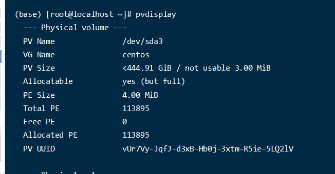

# 服务器用户家目录空间不足

服务器出现问题的时候磁盘情况

```
df -h
```

输出如下:(具体数值我记不上了, 情况是这么个情况)

```
[root@localhost ~]# df -h
文件系统                 容量  已用  可用 已用% 挂载点
devtmpfs                  63G     0   63G    0% /dev
tmpfs                     63G     0   63G    0% /dev/shm
tmpfs                     63G   12M   63G    1% /run
tmpfs                     63G     0   63G    0% /sys/fs/cgroup
/dev/mapper/centos-root   50G   23G   27G   17% /
/dev/sda2               1014M  414M  601M   41% /boot
/dev/sda1                200M   12M  189M    6% /boot/efi
/dev/sdb1                  6T   81M  5.9T    1% /data
/dev/mapper/centos-home  379G  378.9G  12k   99% /home
tmpfs                     13G     0   13G    0% /run/user/1001
tmpfs                     13G   56K   13G    1% /run/user/1000
tmpfs                     13G     0   13G    0% /run/user/0

```

这里的/home目录空间是已经不够了的, 我们需要对他进行扩充

这里是/dev/mapper/centos-home  挂载到了/home目录,  经过查找得知,  这是一种逻辑卷,  具体可以参考额外知识点

现在我们的目的就是扩展这个逻辑卷,  可以查看当前逻辑卷所在卷组

```

```




# 额外知识点

逻辑卷（Logical Volume）和物理卷（Physical Volume）是逻辑卷管理器（LVM）中的两个重要概念，它们在功能和用途上有显著区别。以下是它们的主要区别：

**物理卷（Physical Volume，PV）**

- **定义**：物理卷是硬盘上的实际存储设备或存储设备的分区，是 LVM 的最底层组成部分。它们可以是整个磁盘、磁盘分区或 RAID 设备。
- **作用**：物理卷提供了实际存储空间，供卷组（Volume Group，VG）使用。
- **创建**：通过 `pvcreate` 命令可以将一个物理存储设备初始化为物理卷。
- **标识**：物理卷在系统中通过设备文件标识，例如 `/dev/sda1`、`/dev/sdb1`。

**逻辑卷（Logical Volume，LV）**

- **定义**：逻辑卷是 LVM 提供的一个虚拟存储设备，用户和应用程序可以将其视为一个普通分区。逻辑卷建立在卷组之上，卷组则由物理卷组成。
- **作用**：逻辑卷用于存储数据，并提供了灵活的存储管理功能，如动态调整大小、创建快照等。
- **创建**：通过 `lvcreate` 命令可以在卷组中创建逻辑卷。
- **标识**：逻辑卷在系统中也通过设备文件标识，例如 `/dev/mapper/centos-home` 或 `/dev/centos/home`。

**卷组（Volume Group，VG）**

- **定义**：卷组是 LVM 中的中间层，它将多个物理卷聚合成一个统一的存储池。
- **作用**：卷组将物理卷的存储空间进行管理和分配，并为逻辑卷提供存储空间。
- **创建**：通过 `vgcreate` 命令可以创建卷组，并将物理卷加入到卷组中。

**总结**

- **物理卷（PV）**：实际存储设备或其分区，是 LVM 的最基础组成部分。
- **卷组（VG）**：由多个物理卷组成的存储池，用于管理和分配存储空间。
- **逻辑卷（LV）**：虚拟存储设备，建立在卷组之上，提供灵活的数据存储和管理功能。

这种层次结构使得 LVM 可以提供高度灵活的存储管理，允许在不影响数据的情况下调整存储空间的分配和使用。

**图示关系**

```
[物理卷 PV1]   [物理卷 PV2]   [物理卷 PV3]
      |             |             |
      +-------------+-------------+
                    |
                [卷组 VG]
                    |
         +----------+----------+
         |                     |
  [逻辑卷 LV1]           [逻辑卷 LV2]
```

现在我们可以查看 /dev/mapper/centos-home 这个逻辑卷的情况

```sh
lvdisplay /dev/mapper/centos-home
lvdisplay /dev/centos/home  #这样也是可以的
```

