# 前言

学习了python,觉得python简单好用,那它的web框架肯定也不错,就想着学了以后拿来自己用

# 环境搭建

## 安装Django 4.0.4

```
pip install django==4.0.4
```

## 查看版本

```
python -m django --version
```

# 文件介绍

我们通过pycharm可以直接创建Django项目,它会默认给我们创建一些文件,然后通过命令行新建一个app

```
python manager.py startapp test1
```

我们也可以使用 djang-admin startproject mysite

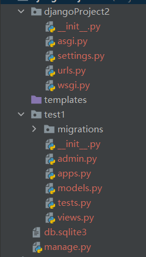


```
djangoProject
    - djangoProject   # 对整个程序进行配置
    	- init.py         # 一个空文件，它告诉Python这个目录应该被看做一个Python包
    	- settings.py     # 项目配置文件
    	- url.py          # URL对应关系（路由）
   		- wsgi.py         # 遵循WSIG规范，uwsgi + nginx
	- manage.py           # 一个命令行工具，可以使你用多种方式对Django项目进行交互
	- templates           # 放前端页面的地方
	-test1			# app配置以及代码
		- admin.py        #对应应用后台管理配置文件。
  		- apps.py         #对应应用的配置文件。
  		- models.py       #数据模块，数据库设计就在此文件中设计。后面重点讲解
  		- tests.py        #自动化测试模块，可在里面编写测试脚本自动化测试
  		- views.py        #视图文件，用来执行响应代码的。你在浏览器所见所得都是它处理的。  我们的业务代码就写在这里面
  		- init.py		 # 包初始文件
		- migrations      #数据迁移、移植文目录，记录数据库操作记录，内容自动生成。
  		- __init__.py

```

最后我们还需要在 settings文件里面 加入我们这个APP

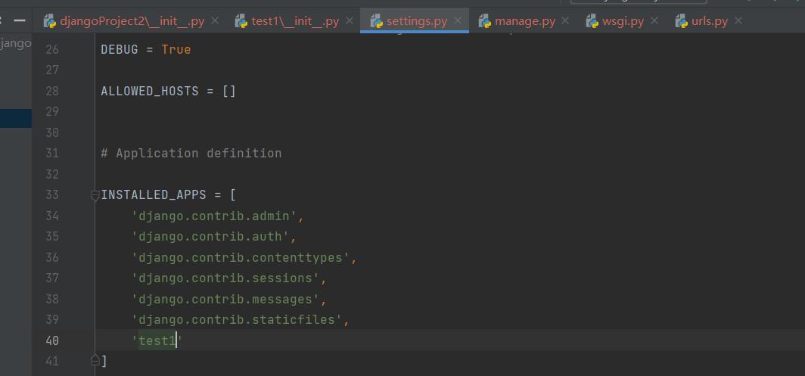


## 官方介绍

让我们看看 [`startproject`](https://docs.djangoproject.com/zh-hans/4.1/ref/django-admin/#django-admin-startproject) 创建了些什么:

```
mysite/
    manage.py
    mysite/
        __init__.py
        settings.py
        urls.py
        asgi.py
        wsgi.py
```

这些目录和文件的用处是：

- **最外层的 `mysite/` 根目录只是你项目的容器**， 根目录名称对 Django 没有影响，你可以将它重命名为任何你喜欢的名称。
- `manage.py`: 一个让你用各种方式管理 Django 项目的命令行工具。你可以阅读 [django-admin 和 manage.py](https://docs.djangoproject.com/zh-hans/4.1/ref/django-admin/) 获取所有 `manage.py` 的细节。
- **里面一层的 `mysite/` 目录包含你的项目**，它是一个纯 Python 包。它的名字就是当你引用它内部任何东西时需要用到的 Python 包名。 (比如 `mysite.urls`).
- `mysite/__init__.py`：一个空文件，告诉 Python 这个目录应该被认为是一个 Python 包。如果你是 Python 初学者，阅读官方文档中的 [更多关于包的知识](https://docs.python.org/3/tutorial/modules.html#tut-packages)。
- `mysite/settings.py`：Django 项目的配置文件。如果你想知道这个文件是如何工作的，请查看 [Django 配置](https://docs.djangoproject.com/zh-hans/4.1/topics/settings/) 了解细节。
- `mysite/urls.py`：Django 项目的 URL 声明，就像你网站的“目录”。阅读 [URL调度器](https://docs.djangoproject.com/zh-hans/4.1/topics/http/urls/) 文档来获取更多关于 URL 的内容。
- `mysite/asgi.py`：作为你的项目的运行在 ASGI 兼容的 Web 服务器上的入口。阅读 [如何使用 ASGI 来部署](https://docs.djangoproject.com/zh-hans/4.1/howto/deployment/asgi/) 了解更多细节。
- `mysite/wsgi.py`：作为你的项目的运行在 WSGI 兼容的Web服务器上的入口。阅读 [如何使用 WSGI 进行部署](https://docs.djangoproject.com/zh-hans/4.1/howto/deployment/wsgi/) 了解更多细节。


```
python manage.py startapp polls
```

这将会创建一个 `polls` 目录，它的目录结构大致如下：

```
polls/
    __init__.py
    admin.py
    apps.py
    migrations/
        __init__.py
    models.py
    tests.py
    views.py
```


> 
>
> Django会对每一次的访问请求重新载入一遍 Python 代码。所以你不需要为了让修改的代码生效而频繁的重新启动服务器。然而，一些动作，比如添加新文件，将不会触发自动重新加载，这时你得自己手动重启服务器。

# 常用命令


django-admin startproject djangoproject   通过django-admin创建一个Django项目


* python manage.py runserver port or ip:port  启动项目
* python manage.py startapp appname  给项目新增一个新应用
* python manage.py makemigrations  将模型的更改记录到app/migrations下面  相当于编写sql语句
* python manage.py migrate 将app/migrations下的修改更改到数据库,相当于执行sql语句
* python manage.py test appname 执行app的测试方法
* python manage.py createsuperuser 创建超级用户


# settings配置

基本设置:

- SECRET_KEY: 用于为密码重置、cookie等敏感数据进行加密和签名。这是一个必需的设置项，确保它在生产环境中保持私密。
- DEBUG: 控制是否启用调试模式。当启用调试模式时，Django会显示详细的错误信息。建议在开发环境中将其设置为True，生产环境中设置为False。
- ALLOWED_HOSTS: 用于指定允许访问站点的主机列表。在生产环境中，将此设置为允许的域名列表以增加安全性。
- INSTALLED_APPS: 包含所有应用程序的列表，可以是Django自带的或第三方的应用程序。这些应用程序将被包含在项目中，以便Django可以找到和使用它们。
- MIDDLEWARE: 中间件类的列表，用于处理请求/响应处理过程中的全局操作。例如，跨站请求伪造防护、用户认证等。

数据库设置:

- DATABASES: 配置项目使用的数据库连接。默认情况下，Django使用SQLite数据库。您可以通过修改此选项来更改数据库类型（如PostgreSQL, MySQL等）。

URL设置:

- ROOT_URLCONF: 项目的根URL配置。这通常指向项目中的urls.py文件，用于定义所有URL模式。
- STATIC_URL: 静态文件（如CSS, JavaScript等）的URL前缀。例如：`/static/`。
- MEDIA_URL: 用户上传的媒体文件（如图片，音频等）的URL前缀。例如：`/media/`。

模板设置:

- TEMPLATES: 一个包含模板配置的字典列表。配置选项包括模板引擎、模板文件夹的位置等。

国际化和本地化设置:

- LANGUAGE_CODE: 默认语言代码，如'zh-hans'（简体中文）或'en-us'（美国英语）。
- TIME_ZONE: 默认时区设置。例如，'Asia/Shanghai'或'UTC'。
- USE_I18N: 启用或禁用国际化（多语言支持）。
- USE_L10N: 启用或禁用本地化（使用地区格式显示数据）。
- USE_TZ: 启用或禁用时区支持。

静态文件设置:

- STATIC_URL: 静态文件的URL前缀。Django在查找静态文件时会使用这个前缀。
- STATICFILES_DIRS: 包含额外静态文件目录的列表，Django会在这些目录中查找静态文件。默认情况下会在每个app目录下查找static文件夹里面的东西
- STATIC_ROOT: 静态文件的集中存储路径。运行`collectstatic`命令时，Django会将所有静态文件收集到这个目录中。

# 路由配置

## 简单示例

在 Django中 一个URL对应一个函数,因此我们想新增一个URL就得在 urls.py中新增一个记录 和 views.py中新增一个函数

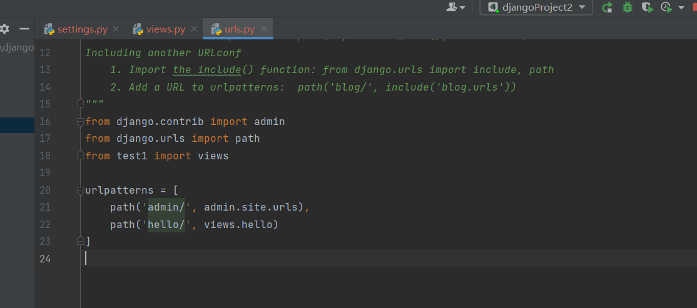

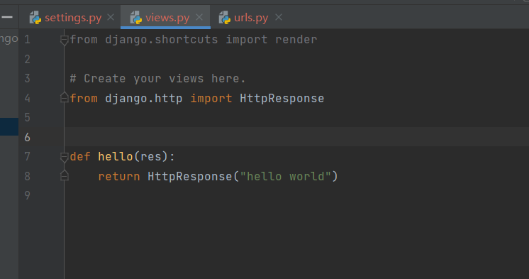

我们可以访问看一下: [127.0.0.1:8000/hello/](http://127.0.0.1:8000/hello/)

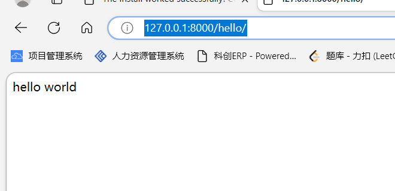

## url配置规则

一般情况下我们都是这么写的

```
urlpatterns = [
    path(路径表达式, views视图函数，参数，别名),
]
参数说明：
1、一个表达式字符串
2、一个可调用对象，通常为一个视图函数或一个指定视图函数路径的字符串
3、可选的要传递给视图函数的默认参数（字典形式）
4、一个可选的name参数(别名)
```

如果我们需要捕获url中的参数的话,我们需要自己使用 \<类型:名字\> 这种方式来捕获

```
path(user/<int:id>,视图,参数,别名)
```

 **注意点:**

1. 要捕获一段url中的值，需要使用尖括号；
2. 可以转换捕获到的值为指定类型，比如例子中的`<int:name>`。默认情况下，捕获到的结果保存为字符串类型，不包含**`/`**这个特殊字符；
3. 规则的前面不需要添加**`/`**，因为默认情况下，每个url都带一个最前面的**`/`**。比如：articles, 不能写成 /articles。

### 匹配例子

```
urlpatterns = [
    path('admin/', admin.site.urls),
    path('hello/', views.hello),
    path('user/<int:id>', views.user),
]

```

**当我们访问 /user/10 这个url的时候  后台会调用   view.user(request,id=10)**,这样是不是就很清晰明朗了

> 我们需要注意请求参数是不会影响到我们的路径匹配的,也就是说 /hello 和 /hello?a=10 是一样的
>
> 对于 最后面的/ 这个分隔符,我的建议是加上 比如 我们写的是 hello  那么 hello 能够匹配,那么hello/ 不能匹配,如果我们写的是hello/ 那么两个都能匹配上

### path转换器

我们刚说的路径参数中,默认是字符串格式, 我们可以自己指定转化器,将它变成其他类型

1、str：匹配任何非空字符串，但不含斜杠/，如果你没有专门指定转换器，那么这个是默认使用的；
2、int：匹配0和正整数，返回一个int类型
3、slug：可理解为注释、后缀、附属等概念，是url拖在最后的一部分解释性字符。该转换器匹配任何ASCII字符以及连接符和下划线，比如’ building-your-1st-django-site‘；
4、uuid：匹配一个uuid格式的对象。为了防止冲突，规定必须使用破折号，所有字母必须小写，例如’075194d3-6885-417e-a8a8-6c931e272f00‘ 。返回一个UUID对象；

在举几个列子吧

```
urlpatterns = [
    path('articles/2003/', views.special_case_2003),
    path('articles/<int:year>/', views.year_archive),
    path('articles/<int:year>/<int:month>/', views.month_archive),
    path('articles/<int:year>/<int:month>/<slug:slug>/', views.article_detail),
    ]
```

1、/articles/2005/03/ 将匹配第三条，并调用views.month_archive(request, year=2005, month=3)；

2、/articles/2003/匹配第一条，并调用views.special_case_2003(request)；

3、/articles/2003将一条都匹配不上，因为它最后少了一个斜杠，而列表中的所有模式中都以斜杠结尾；

4、/articles/2003/03/building-a-django-site/ 将匹配最后一个，并调用views.article_detail(request, year=2003, month=3, slug="building-a-django-site"


### 自定义路径转换器

对于更复杂的匹配需求，您可以定义自己的路径转换器。自定义，就是单独写一个类，它包含下面的内容：
1、类属性regex：一个字符串形式的正则表达式属性；
2、to_python(self, value) 方法：一个用来将匹配到的字符串转换为你想要的那个数据类型，并传递给视图函数。如果不能转换给定的值，则会引发ValueError。

3、to_url(self, value)方法：将Python数据类型转换为一段url的方法，上面方法的反向操作。

比如我们在urls.py里面写一个转换器

```
class convert:
    regex='[0-9]'

    def to_python(self,value):
        return int(value)

    def to_url(self,value):
        return f'{value:4d}'
register_converter(convert,'d')

urlpatterns = [
    path('admin/', admin.site.urls),
    path('hello/', views.hello),
    path('user/<int:id>', views.user),
    path('user/<int:id>/<d:t>', views.user), # 使用转换器
]
```

### 使用正则表达式

如果path和自定义转换器不能满足要求我们可以使用正则表达式,但是我们不能使用path了,得用re_path,如果需要捕获路径参数,我们可以使用命名分组(?P<name>pattern)

```
urlpatterns = [
    path('articles/2003/', views.special_case_2003),
    re_path(r'^articles/(?P<year>[0-9]{4})/$', views.year_archive),
    re_path(r'^articles/(?P<year>[0-9]{4})/(?P<month>[0-9]{2})/$', views.month_archive),
    re_path(r'^articles/(?P<year>[0-9]{4})/(?P<month>[0-9]{2})/(?P<slug>[\w-]+)/$', views.article_detail),
    ]
```

### re_path 和 path 区别

path 可以将 路径参数进行转化,re_path 不可以,匹配到的参数都是字符串

re_path 可以使用正则表达式匹配,path不可以

path 匹配参数是 < 类型:名字> 的方式  re_path匹配参数是 命名分组的方式


## 官方对path的用法解释

函数 [`path()`](https://docs.djangoproject.com/zh-hans/4.1/ref/urls/#django.urls.path) 具有四个参数，两个必须参数：`route` 和 `view`，两个可选参数：`kwargs` 和 `name`。现在，是时候来研究这些参数的含义了。


### [`path()`](https://docs.djangoproject.com/zh-hans/4.1/ref/urls/#django.urls.path) 参数： `route`

`route` 是一个匹配 URL 的准则（类似正则表达式）。当 Django 响应一个请求时，它会从 `urlpatterns` 的第一项开始，按顺序依次匹配列表中的项，直到找到匹配的项。

这些准则不会匹配 GET 和 POST 参数或域名。例如，URLconf 在处理请求 `https://www.example.com/myapp/` 时，它会尝试匹配 `myapp/` 。处理请求 `https://www.example.com/myapp/?page=3` 时，也只会尝试匹配 `myapp/`。


### [`path()`](https://docs.djangoproject.com/zh-hans/4.1/ref/urls/#django.urls.path) 参数： `view`

当 Django 找到了一个匹配的准则，就会调用这个特定的视图函数，并传入一个 [`HttpRequest`](https://docs.djangoproject.com/zh-hans/4.1/ref/request-response/#django.http.HttpRequest) 对象作为第一个参数，被“捕获”的参数以关键字参数的形式传入。稍后，我们会给出一个例子。


### [`path()`](https://docs.djangoproject.com/zh-hans/4.1/ref/urls/#django.urls.path) 参数： `kwargs`

任意个关键字参数可以作为一个字典传递给目标视图函数。本教程中不会使用这一特性。


### [`path()`](https://docs.djangoproject.com/zh-hans/4.1/ref/urls/#django.urls.path) 参数： `name`

为你的 URL 取名能使你在 Django 的任意地方唯一地引用它，尤其是在模板中。这个有用的特性允许你只改一个文件就能全局地修改某个 URL 模式。


## 错误页面处理

当Django找不到与请求匹配的URL时，或者当抛出一个异常时，将调用一个错误处理视图。错误视图包括400、403、404和500，分别表示请求错误、拒绝服务、页面不存在和服务器错误。它们分别位于：

- handler400 —— django.conf.urls.handler400。
- handler403 —— django.conf.urls.handler403。
- handler404 —— django.conf.urls.handler404。
- handler500 —— django.conf.urls.handler500。

这些值可以在根urls.py中设置

我们只需要将函数赋值给这些值就可以了,要注意这些函数必须得有两个参数,一个是request,一个是exception,这个exception的名字必须是这个名字

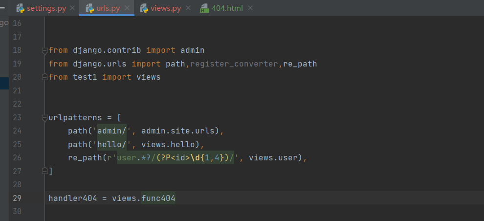

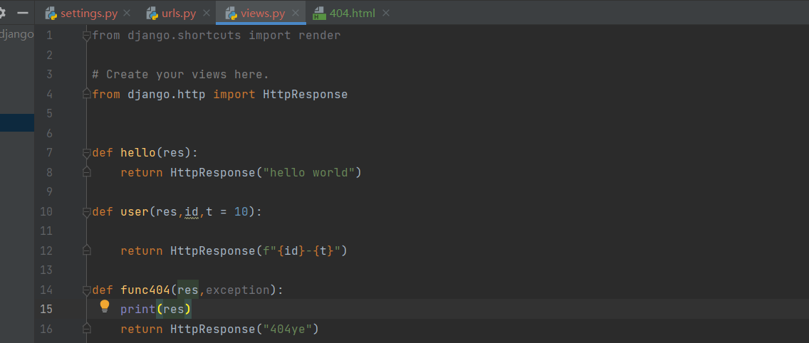

> 这里还需要把settings.py里面的DEBUG改为False

## url分层转发

如果所有路由全部写在根urls.py的urlpatterns中的话,那么可能会出现很多冗余的前缀路劲,我们不妨把具有相同的前缀路径写在一块

### 方法一 转发给不同urls.py

```
from django.urls import include, path
urlpatterns = [
    path('student/', include('student.urls')),
    path('teacher/', include('teacher.urls')),
]
```

比如学生跟老师分别在不同的APP中,我们就可以这样

### 方法二 转发给一个列表

```
from django.urls import include, path
student = [
	path("socre/",student.getsocre)
]
teacher = [
	path("student/",teacher.getstudent)
]
urlpatterns = [
    path('student/', include(studnet)),
    path('teacher/', include(teacher)),
]
```

> 就算url分层转发,参数捕获还是跟前面一样

# MVC与MVT

## MVC

**M** ：数据存取部分，由django数据库层处理，本章要讲述的内容。
**V**：选择显示哪些数据要显示以及怎样显示的部分，由视图和模板处理。
**C**：根据用户输入委派视图的部分，由 Django 框架根据 URLconf 设置，对给定 URL 调用适当的 Python 函数。

## MVT

在Django里，由于 C层由框架自行处理，而 Django 里更关注的是模型（Model）、模板(Template)和视图（Views），所以Django 也被称为 MTV框架 。在MTV开发模式中：
**M** ：代表模型（Model），即数据存取层。 该层处理与数据相关的所有事务： 如何存取、如何验证有效
**T** ：代表模板(Template)，即表现层。 该层处理与表现相关的决定： 如何在页面或其他类型文档中进行显示。
**V** ：代表视图（View），即业务逻辑层。 该层包含存取模型及调取恰当模板的相关逻辑。 你可以把它看作模型与模板之间的桥梁。

# 视图

在Django中, 一个url对应的函数就是一个视图, 我们可以通过视图函数响应各式各样的东西

在一个http请求中会产生两个核心对象,一个是HTTPRequest 和 HTTPResponse, 一个包含用户请求信息,一个包含响应信息

## HttpRequest

里面包含了各式各样的方法和属性,供我们去得到请求信息

> 任何可能用于更改系统状态的请求应该使用 `POST` —— 比如一个更改数据库的请求。`GET` 应该只被用于不会影响系统状态的请求。

### 属性

- `method`：HTTP 请求方法，例如 `GET`、`POST` 等。
- `path`：请求的 URL 路径部分，不包括查询参数。
- `GET`：一个包含 GET 请求参数的字典。只会包含请求路径中的参数
- `POST`：一个包含 POST 请求参数的字典。只会包含请求体里面的参数内容
- `COOKIES`：一个包含客户端发送的所有 Cookie 的字典。
- `FILES`：一个包含所有上传文件的字典。 字典里面的键是参数名字,值是文件
- `META`：一个包含请求元数据的字典。注意 只有当请求方法是 `POST`，至少有一个文件字段被实际发布，并且发布请求的 `<form>` 有 `enctype="multipart/form-data"` 属性时，才会包含数据。否则 `request.FILES` 将为空。
- `content_type`：请求正文的 MIME 类型，例如 `text/plain`、`application/json` 等。
- `content_params`：一个包含请求正文的 MIME 类型的参数的字典。
- `body`：请求正文的字节表示。
- `user`：表示当前请求的用户对象。如果用户未通过身份验证，则该属性将是匿名用户对象。
- `auth`：包含通过 HTTP 身份验证传递的用户名和密码的元组。
- `session`：表示当前请求的会话对象。
- `scheme`：表示使用的网络协议，通常为 `http` 或 `https`。
- `path_info`：URL 路径的附加部分。例如，如果请求的 URL 为 
- `encoding`：表示请求正文的编码格式。
- `content_length`：表示请求正文的字节数。
- `headers`: 请求头

### 方法

- `get_full_path()`：返回请求的完整路径，包括查询参数。
- `get_host()`：返回请求的主机名，包括端口号（如果有）。
- `get_port()`：返回请求的端口号。
- `get_raw_uri()`：返回原始请求的 URI，包括查询参数和片段标识符。
- `get_signed_cookie(key, default=RAISE_ERROR, salt='', max_age=None)`：返回已签名的 Cookie 的值，如果 Cookie 不存在则返回默认值。如果无法验证 Cookie，则引发 `django.core.signing.BadSignature` 异常。
- `get_full_url()`：返回完整的 URL，包括主机名、端口号和路径。
- `is_ajax()`：如果请求是通过 AJAX 发送的，则返回 `True`。
- `is_secure()`：如果请求是通过 HTTPS 发送的，则返回 `True`。
- `is_valid()`：如果请求是有效的，则返回 `True`。该方法的实现由 Django 的安全中间件提供，可以用于检查请求是否受到 CSRF 攻击。
- `read()`：读取请求正文的全部内容，并将其作为字符串返回。如果请求正文太大，则不建议使用该方法，因为它会将所有内容读取到内存中，可能会导致内存不足错误。
- `readline()`：读取请求正文的下一行，并将其作为字符串返回。该方法在处理大型请求正文时比 `read()` 更有效。

### META属性字典里面包含的属性

`META` 字典中包含了许多键值对，其中一些常用的键值对如下：

- `CONTENT_TYPE`：请求正文的 MIME 类型。
- `CONTENT_LENGTH`：请求正文的长度（以字节为单位）。
- `HTTP_USER_AGENT`：客户端浏览器的 User-Agent 字符串。
- `HTTP_REFERER`：包含当前请求页面的 URL，通常用于追踪用户的浏览历史。
- `HTTP_HOST`：请求的主机名和端口号。
- `HTTP_ACCEPT_LANGUAGE`：客户端浏览器的首选语言。
- `QUERY_STRING`：请求 URL 中的查询参数。
- `REMOTE_ADDR`：客户端的 IP 地址。
- `REMOTE_HOST`：客户端的主机名（如果可用）。
- `REMOTE_USER`：如果客户端已经进行了身份验证，则包含用户名。
- `SERVER_NAME`：服务器的主机名。
- `SERVER_PORT`：服务器的端口号。
- `SERVER_PROTOCOL`：使用的 HTTP 协议的名称和版本号。

### 获取客户端ip地址

```
@csrf_exempt
def getclientip(res:HttpRequest):
    return HttpResponse(res.META["REMOTE_ADDR"])
```

### 上传文件

```
@csrf_exempt
def uploadfile(res:HttpRequest):
    file = res.FILES.get("file")
    print(type(file))
    # 获得文件大小
    print(f"{file.size}B")
    with open(f"{file}","wb") as file2:

        for data in file:
            file2.write(data)
    return HttpResponse("上传成功")
```


## HttpResponse

这个是响应数据回去的对象, 我们可以响应很多类型的数据,比如json html xml 等等

### 属性

- `content`：响应内容。它可以是字符串、字节序列或文件对象。
- `charset`：响应的字符集。
- `status_code`：HTTP响应状态码。
- `reason_phrase`：HTTP响应状态码对应的原因短语。
- `cookies`：一个包含所有Cookie的字典，其中键是Cookie的名称，值是Cookie的值。
- `closed`：一个布尔值，指示响应是否已关闭。

### 方法

- `__init__(content=None, status=None, reason=None, charset=None, content_type=None)`：初始化HttpResponse对象。
- `write(content)`：向响应中写入内容。
- `flush()`：刷新响应内容，使其可用于传输。
- `set_cookie(key, value='', max_age=None, expires=None, path='/', domain=None, secure=False, httponly=False, samesite=None)`：设置响应的Cookie。
- `delete_cookie(key, path='/', domain=None)`：从响应中删除Cookie。
- `setdefault(key, value)`：返回响应头的值，如果键不存在，则设置键的值为给定的值。
- `items()`：返回响应头的键值对，作为元组的列表。
- `keys()`：返回响应头的键列表。
- `values()`：返回响应头的值列表。
- `has_header(header)`：检查响应头是否存在给定的标头。
- `get(value, default=None)`：获取响应头中给定键的值。如果键不存在，则返回给定的默认值。

### render

这个是渲染html返回

```
def render(
    request, template_name, context=None, content_type=None, status=None, using=None
):
     content = loader.render_to_string(template_name, context, request, using=using)
     return HttpResponse(content, content_type, status)
```

我们可以看到他的返回值还是一个HTTPResponse对象,只不过这个内容是渲染出来的

### redirect

这个是重定向

```
@csrf_exempt
def testdirect(res:HttpRequest):
# 如果项目路径是 http://127.0.0.1:8000/,这个函数的请求路径为 http://127.0.0.1:8000/testdirect
	# 这样是相对项目路径   http://127.0.0.1:8000/hello/
	return redirect("/hello/") http://127.0.0.1:8000/testdirect/hello/
	# 这样是相对当前路径下路径 
    return redirect("hello/") 
    # 注意,后面这个/绝对不能省
```

对于render 和 redirect区别就是 如果是render的话 地址栏路径不会变化的,所以刷新页面的话就会重新渲染,redirect的就是地址栏会变化,刷新页面就是就是请求

# 管理后台

Django为我们提供了一个很方便的管理后台,我们只需要少量的操作就能管理数据库里面的模型数据

首先得保证数据库中已经有了管理后台需要的各种表

## 创建各种表

```
python manage.py makemigrations
python manage.py migrate
```

## 创建管理员账号密码

```
python manage.py createsuperuser  # 按照提示创建好账号
```

## 将自己的app注册

我们必须注册好自己的app才能对其模型进行管理

```
# 在settings.py中
INSTALLED_APPS = [
    'django.contrib.admin',
    'django.contrib.auth',
    'django.contrib.contenttypes',
    'django.contrib.sessions',
    'django.contrib.messages',
    'django.contrib.staticfiles',
    'app01.apps.Test1Config'
]
```


## 创建自己的模型

在自己的app下的models.py中创建模型

```
class User(models.Model):
    name = models.CharField(max_length=10,verbose_name="名字")
    password = models.CharField(max_length=50,verbose_name="密码")
    def __str__(self):
        return f"{self.name}"
```

创建这个模型对应的表

```
python manage.py makemigrations app01
python manage.py migrate app01
```

## 将自己模型托管给admin管理

在app下的admin.py中注册模型(多个app也是这样)

```
from .models import User
admin.site.register(User)
```

这样我们登录后就能看到了

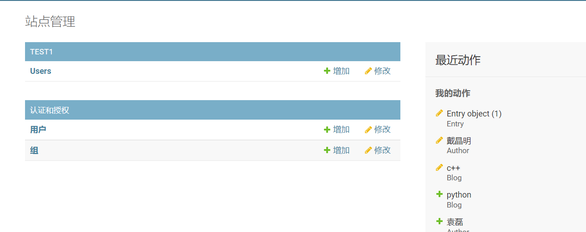

我们可以对其进行增删改查,有没有发现这个Users并不是那么好看,我们后续可以通过一些操作进行更改

# ORM 

在python中 我们不需要自己去写sql语句, 一个类对应一张表,一个对象对应一条数据,它包含了对这个数据的增删改查操作,因此我们只需要去定义类就可以了

> 使用ORM之前一定要把APP注册到settings文件中去

我们定义一个类

```
class User(models.Model):
    name = models.CharField(max_length=10,verbose_name="名字")
    nametest = models.CharField(max_length=10,default=None)
    age = models.IntegerField()
    def __str__(self):
        return f"{self.name}"
```

然后在pycharm运行manage.py输入下面命令

```
makemigrations test1  # 对数据模型进行修改,这里会输出我们对表进行了哪些操作,但是不会同步到数据库
migrate test1 # 将操作同步到数据库
```

执行完后我们会发现数据库中会多一张表test1_user


名字为app名字_小写类名,如果我们不指定主键,Django会默认创建一个自增主键为id

## 数据模型字段及其属性

字段是模型中最重要的内容之一，也是唯一必须的部分。字段在Python中表现为一个类属性，体现了数据表中的一个列。Django不允许下面两种字段名：1、与Python关键字冲突。2、字段名中不能有两个以上下划线在一起，因为两个下划线是Django的查询语法。也不要使用clean、save、delete等Django内置的模型API名字，防止命名冲突。

### 常用字段

**1、AutoField**  ---自增列 = int(11)  如果没有的话，默认会生成一个名称为 id 的列，如果要显示的自定义一个自增列，必须将给列设置为主键 primary_key=True。
**2、CharField**  ---字符串字段 单行输入，用于较短的字符串，如要保存大量文本, 使用 TextField。必须 max_length 参数，django会根据这个参数在数据库层和校验层限制该字段所允许的最大字符数。
**3、BooleanField**  ---布尔类型=tinyint(1)  不能为空，Blank=True
**4、ComaSeparatedIntegerField**  ---用逗号分割的数字=varchar  继承CharField，所以必须 max_lenght 参数，
**5、DateField**  ---日期类型 date  对于参数，auto_now = True 则每次更新都会更新这个时间；auto_now_add 则只是第一次创建添加，之后的更新不再改变。
**6、DateTimeField**  ---日期类型 datetime  同DateField的参数
**7、Decimal**  ---十进制小数类型 = decimal  必须指定整数位max_digits和小数位decimal_places
**8、EmailField**  ---字符串类型（正则表达式邮箱） =varchar  对字符串进行正则表达式  一个带有检查 Email 合法性的 CharField，不接受 maxlength 参数。
**9、FloatField**  ---浮点类型 = double  浮点型字段。 必须提供两个 参数， 参数描述：
max_digits：总位数(不包括小数点和符号）
decimal_places：小数位数。如：要保存最大值为 999 (小数点后保存2位)，你要这样定义字段：FloatField(…，max_digits=5， decimal_places=2)，要保存最大值一百万(小数点后保存10位)的话，你要这样定义：FloatField(…，max_digits=19， decimal_places=10)
**10、IntegerField**  ---整形  用于保存一个整数
**11、BigIntegerField**  ---长整形

```
integer_field_ranges = {
    'SmallIntegerField': (-32768, 32767),
    'IntegerField': (-2147483648, 2147483647),
    'BigIntegerField': (-9223372036854775808, 9223372036854775807),
    'PositiveSmallIntegerField': (0, 32767),
    'PositiveIntegerField': (0, 2147483647),
}
```

**12、IPAddressField**  ---字符串类型（ip4正则表达式）  一个字符串形式的 IP 地址， (如 “202.1241.30″)。
**13、GenericIPAddressField**  ---字符串类型（ip4和ip6是可选的）  参数protocol可以是：both、ipv4、ipv6  验证时，会根据设置报错
**14、NullBooleanField**  ---允许为空的布尔类型  类似 BooleanField， 不过允许 NULL 作为其中一个选项。 推荐使用这个字段而不要用 BooleanField 加 null=True 选项。 admin 用一个选择框 　　　　<select> (三个可选择的值： “Unknown”， “Yes” 和 “No” ) 来表示这种字段数据。
**15、PositiveIntegerField**  ---正Integer  类似 IntegerField， 但取值范围为非负整数（这个字段应该是允许0值的…可以理解为无符号整数）
**16、PositiveSmallIntegerField**  ---正smallInteger 正小整型字段，类似 PositiveIntegerField， 取值范围较小(数据库相关)SlugField“Slug” 是一个报纸术语。 slug 是某个东西的小小标记(短签)， 只包　　含字母，数字，下划线和连字符。它们通常用于URLs。 若你使用 Django 开发版本，你可以指定 maxlength。 若 maxlength 未指定， Django 会使用默认长度： 50，它接受一个额外的参数：
prepopulate_from: 来源于slug的自动预置列表
**17、SlugField**  ---减号、下划线、字母、数字  它们通常用于URLs。
**18、SmallIntegerField**  ---数字  数据库中的字段有：tinyint、smallint、int、bigint.  类似 IntegerField， 不过只允许某个取值范围内的整数。(依赖数据库)
**19、TextField**  ---字符串=longtext ，一个容量很大的文本字段， admin 管理界面用 <textarea>多行编辑框表示该字段数据。
**20、TimeField**  ---时间 HH:MM[:ss[.uuuuuu]]  时间字段，类似于 DateField 和 DateTimeField。
**21、URLField**  ---字符串，地址正则表达式  用于保存URL。若 verify_exists 参数为 True (默认)， 给定的 URL 会预先检查是否存在(即URL是否被有效装入且没有返回404响应).
**22、BinaryField**  ---二进制
**23、ImageField**  ---图片  类似 FileField， 不过要校验上传对象是否是一个合法图片。用于保存图像文件的字段。其基本用法和特性与FileField一样，只不过多了两个属性height和width。默认情况下，该字段在HTML中表现为一个ClearableFileInput标签。在数据库内，我们实际保存的是一个字符串类型，默认最大长度100，可以通过max_length参数自定义。真实的图片是保存在服务器的文件系统内的。
**height_field参数：**保存有图片高度信息的模型字段名。width_field参数：保存有图片宽度信息的模型字段名。
使用Django的ImageField需要提前安装pillow模块，pip install pillow即可。
**使用FileField或者ImageField字段的步骤：**
在settings文件中，配置MEDIA_ROOT，作为你上传文件在服务器中的基本路径（为了性能考虑，这些文件不会被储存在数据库中）。再配置个MEDIA_URL，作为公用URL，指向上传文件的基本路径。请确保Web服务器的用户账号对该目录具有写的权限。
添加FileField或者ImageField字段到你的模型中，定义好upload_to参数，文件最终会放在MEDIA_ROOT目录的“upload_to”子目录中。
所有真正被保存在数据库中的，只是指向你上传文件路径的字符串而已。可以通过url属性，在Django的模板中方便的访问这些文件。例如，假设你有一个ImageField字段，名叫mug_shot，那么在Django模板的HTML文件中，可以使用{{object.mug_shot.url}}来获取该文件。其中的object用你具体的对象名称代替。
可以通过name和size属性，获取文件的名称和大小信息。

**24、FilePathField**  ---选择指定目录按限制规则选择文件，有三个参数可选， 其中”path”必需的，这三个参数可以同时使用， 参数描述：
path：必需参数，一个目录的绝对文件系统路径。 FilePathField 据此得到可选项目。 Example： “/home/images”；
match：可选参数， 一个正则表达式， 作为一个字符串， FilePathField 将使用它过滤文件名。 注意这个正则表达式只会应用到 base filename 而不是路径全名。 Example： “foo。*\。txt^”， 将匹配文件 foo23.txt 却不匹配 bar.txt 或 foo23.gif；
recursive：可选参数， 是否包括 path 下全部子目录，True 或 False，默认值为 False。
match 仅应用于 base filename， 而不是路径全名。 如：FilePathField(path=”/home/images”， match=”foo.*”， recursive=True)…会匹配 /home/images/foo.gif 而不匹配 /home/images/foo/bar.gif
**25、FileField**  ---文件上传字段。 要求一个必须有的参数： upload_to， 一个用于保存上载文件的本地文件系统路径。 这个路径必须包含 strftime formatting， 该格式将被上载文件的 date/time 替换(so that uploaded files don’t fill up the given directory)。在一个 model 中使用 FileField 或 ImageField 需要以下步骤：在你的 settings 文件中， 定义一个完整路径给 MEDIA_ROOT 以便让 Django在此处保存上传文件。 (出于性能考虑，这些文件并不保存到数据库。) 定义 MEDIA_URL 作为该目录的公共 URL。 要确保该目录对 WEB 服务器用户帐号是可写的。在你的 model 中添加 FileField 或 ImageField， 并确保定义了 upload_to 选项，以告诉 Django 使用 MEDIA_ROOT 的哪个子目录保存上传文件。你的数据库中要保存的只是文件的路径(相对于 MEDIA_ROOT)。 出于习惯你一定很想使用 Django 提供的 get_<fieldname>_url 函数。举例来说，如果你的 ImageField 叫作 mug_shot， 你就可以在模板中以 {{ object。get_mug_shot_url }} 这样的方式得到图像的绝对路径。
**26、PhoneNumberField**  ---一个带有合法美国风格电话号码校验的 CharField(格式：XXX-XXX-XXXX)
**27、USStateField**  ---美国州名缩写，由两个字母组成（天朝人民无视）。
**28、XMLField**  ---XML字符字段，校验值是否为合法XML的 TextField，必须提供参数：
schema_path：校验文本的 RelaxNG schema 的文件系统路径。

### 常用选项参数

1. **max_length**：字符串类型字段的最大长度。例如，定义一个 CharField 时可以指定 max_length=100 来限制字段长度不超过 100 个字符。
2. **name**: 设置字段在数据库列中的名字
3. **default**：字段的默认值。例如，定义一个 BooleanField 时可以指定 default=False，表示默认值为 False。
4. **null**：字段是否可以为空值。例如，定义一个 CharField 时可以指定 null=True，表示该字段可以为空值。
5. **blank**：字段是否可以为空字符串。例如，定义一个 CharField 时可以指定 blank=True，表示该字段可以为空字符串。注意该选项与 `null` 不同， [`null`](https://docs.djangoproject.com/zh-hans/4.1/ref/models/fields/#django.db.models.Field.null) 选项仅仅是数据库层面的设置，而 [`blank`](https://docs.djangoproject.com/zh-hans/4.1/ref/models/fields/#django.db.models.Field.blank) 是涉及表单验证方面。如果一个字段设置为 [`blank=True`](https://docs.djangoproject.com/zh-hans/4.1/ref/models/fields/#django.db.models.Field.blank) ，在进行表单验证时，接收的数据该字段值允许为空，而设置为 [`blank=False`](https://docs.djangoproject.com/zh-hans/4.1/ref/models/fields/#django.db.models.Field.blank) 时，不允许为空
6. **choices**：一个可选值列表。例如，定义一个 CharField 时可以指定 choices=[('M', 'Male'), ('F', 'Female')]，表示该字段只能取值为 'M' 或 'F'。sex=models.IntegerField(choices=[(0,'男'),(1,'女'),],default=1)
7. **help_text**：字段的帮助文本。例如，定义一个 CharField 时可以指定 help_text='Enter your full name.'，表示在表单中该字段下方显示该帮助文本。
8. **verbose_name**：字段的人类可读名称。例如，定义一个 CharField 时可以指定 verbose_name='Full Name'，表示该字段在 Admin 界面上显示的名称为 'Full Name'。
9. **unique**：字段的值是否必须是唯一的。例如，定义一个 CharField 时可以指定 unique=True，表示该字段的值必须唯一。
10. **primary_key**：字段是否为主键。例如，定义一个 IntegerField 时可以指定 primary_key=True，表示该字段为模型的主键。
11. **auto_created**：字段是否是自动生成的。例如，定义一个 ForeignKey 时可以指定 auto_created=True，表示该字段是自动生成的。
12. **upload_to**：上传文件的路径。例如，定义一个 ImageField 时可以指定 upload_to='photos'，表示上传的图片将保存在项目根目录下的 photos 文件夹中。
13. **validators**：一个验证器列表。例如，定义一个 CharField 时可以指定 validators=[validate_slug]，表示该字段需要通过 validate_slug 函数的验证。
14. **editable**：指定字段是否可以在 Admin 界面中编辑。例如，定义一个 CharField 时可以指定 editable=False，表示该字段不能在 Admin 界面中编辑。
15. **error_messages**：指定验证错误时的错误消息。例如，定义一个 CharField 时可以指定 error_messages={'required': 'Please enter your name.'}，表示在验证时如果该字段为空，会显示 'Please enter your name.' 的错误消息。

19. **db_column**：指定字段在数据库中的列名。例如，定义一个 CharField 时可以指定 db_column='full_name'，表示该字段在数据库中的列名为 'full_name'。

20. **db_index**：指定字段是否需要创建索引。例如，定义一个 CharField 时可以指定 db_index=True，表示该字段需要创建索引。

21. **db_tablespace**：指定该字段所在的数据库表空间。例如，定义一个 CharField 时可以指定 db_tablespace='my_tablespace'，表示该字段所在的数据库表空间为 'my_tablespace'。

22. **db_collation**：指定该字段在数据库中使用的排序规则。例如，定义一个 CharField 时可以指定 db_collation='utf8mb4_bin'，表示该字段在数据库中使用 utf8mb4_bin 排序规则。

24. **serialize**：指定字段在序列化时是否被包含。例如，定义一个 CharField 时可以指定 serialize=False，表示该字段在序列化时不被包含。

25. **unique_for_date**：指定该字段在某个日期范围内必须是唯一的。例如，定义一个 DateTimeField 时可以指定unique_for_date='pub_date'，表示该字段在 pub_date 字段的日期范围内必须是唯一的。

26. **unique_for_month**：指定该字段在某个月份范围内必须是唯一的。例如，定义一个 DateTimeField 时可以指定 unique_for_month='pub_date'，表示该字段在 pub_date 字段的月份范围内必须是唯一的。

27. **unique_for_year**：指定该字段在某个年份范围内必须是唯一的。例如，定义一个 DateTimeField 时可以指定 unique_for_year='pub_date'，表示该字段在 pub_date 字段的年份范围内必须是唯一的。

## 多个模型之间的关系

假设有两张表 A,B  我们要通过A的一条数据查找出B中的一条数据

* 一对一   A中的一条数据只对应B中的一条数据,B中的一条数据也只对应A中的一条数据 **OneToOneField**比如通过账号查找个人信息
* 一对多   A 中的一条数据对应B中的多条数据 比如 一个班级对应多个学生 **ForeignKey**
* 多对多   A 中的一条数据对应B中的多条数据,但是B中的一条数据也对应A中的多条数据 比如一个学生有多个老师的课,一个老师也有多个学生  **ManyToManyField**,这个往往需要一个第三张表来记录多对多的关系

### OneToOneFiled

**用来限制一对一的关系,就算创建了一个新的对象(一行数据),当我们写入数据库的时候,也是更新,而不是新创建**

`OneToOneField` 字段可以设置以下属性：

- `to`: 必须指定，表示与之关联的模型。
- `on_delete`: 必须指定，表示当关联的模型实例被删除时如何处理该实例。可以选择从模型中删除该实例，或将该字段设置为 `null` 或 `default` 值，或引发异常。
- `related_name`: 指定反向关系的名称，用于从关联的模型中引用该模型。默认引用名字为 模型名字小写

这个related_name 有必要讲一下, 相当于建立了一个双向关系,我能得到你,你也能得到我,我们现在有一个个人信息表和个人简历表

```
# 个人信息
class Person(models.Model):
    name = models.CharField(max_length=100)
    age = models.IntegerField()
    def __str__(self):
        return f"name:{self.name},age:{self.age}"

# 个人简历
class Profile(models.Model):
    person = models.OneToOneField(Person, on_delete=models.CASCADE, related_name='profile')
    bio = models.TextField()
    website = models.URLField()
    def __str__(self):
        return f"bio:{self.bio},website:{self.website}\n{self.person}"
```

我们下面来看一下通过Person得到Profile

```
person = Person.objects.create(**{"name":"djm","age":20})  
profile = Profile.objects.create(person=person,bio="hh",website="http://www.baidu.com") 
# 上面创建了两个对象,分别写入了数据库
# 我们现在来通过person得到profile信息

# 这样是不是就实现了互相查找
person = Person.objects.get(id=1)
print(person.profile)  

profile = Profile.objects.get(id=1)
print(profile.person)

```

> 这个related_name这是设置名字而已,就算我们没有设置,它会默认使用类名小写

我们可以通过ForeignKey(unique=True)代替OneToOneField

### ForeignKey

这个可以做多一对多,一张表的外键是另一张表的加了唯一性约束或者主键的字段

我们经常使用它的下面属性:

`to_field`：指定关联的模型中用于关联的字段，默认为模型的主键字段。

`on_delete`：当关联的对象被删除时，指定ForeignKey的处理方式，可以取以下值：

- CASCADE：级联删除,把关联了这个对象的数据全部删除
- PROTECT：保护模式，当存在外键关联时，阻止删除
- SET_NULL：设置外键为NULL
- SET_DEFAULT：设置外键为默认值
- SET()：将外键设置为给定值或调用给定函数

`related_name`: 指定反向关系的名称，用于从关联的模型中引用该模型,默认引用属性名字为  模型名字小写_set

### ManyToManyField

在Django中，ManyToManyField是一种用于表示多对多关系的字段类型，它允许两个模型之间建立多对多的关联关系。**ManyToManyField需要通过中间表来实现关联**，**该中间表**记录了两个关联模型之间的多对多关系。

- `on_delete`：指定ManyToManyField所关联的模型被删除时的处理方式。
- `related_name`：用于设置反向引用的名称，用于通过关联对象进行反向查询。默认情况下，反向引用名称为`<model>_set`。注意和一对一的那个区别,这里多了_set,因为它是多个 
- `related_query_name`：用于设置反向查询的名称。
- `through`：指定用于关联两个模型的中间表模型。如果没有指定，Django将自动创建一个中间表。
- `through_fields`：指定用于关联两个模型的中间表模型中的字段。如果没有指定，Django将自动查找中间表模型中的外键。
- `symmetrical`：指定关系是否是对称的，如果设置为True，则表示两个模型之间的关系是对称的。默认为True。
- `db_table`：指定用于中间表的数据库表名。
- `db_constraint`：指定是否需要在中间表中创建外键约束。默认为True。
- `blank`和`null`：与其他字段一样，也可以设置`blank`和`null`属性，表示ManyToManyField是否可以为空。

举个例子吧

我们有作者和图书两个类

```
class Author(models.Model):
    name = models.CharField(max_length=100)

class Book(models.Model):
    title = models.CharField(max_length=100)
    authors = models.ManyToManyField(Author)

```

一本书可以由多个作者写,一个作者也可以写多本书,我们只需要在Author或者Book中加一个多对多字段就行,另外一个可以通过 模型名字_set得到另外一个数据

book表(app01_book)

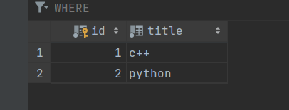

author表(app01_author)

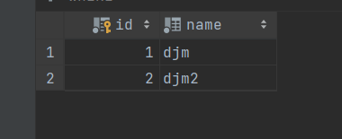

他们之间的关系表(名字默认为 app名字\_具有多对多字段模型名字\_另一个模型名字)(app01_book_author)

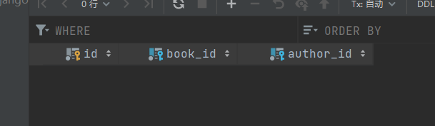

我们现在添加他们之间的关系

c++由两个人创作, python只由djm创作

```
titles = ["c++","python"]
cbook,pbook = [Book.objects.get(title=title) for title in titles]

authors = ["djm","djm2"]
djm,djm2 = [Author.objects.get(name=name) for name in authors]

# 通过书添加作者
cbook.authors.add(djm,djm2)
# 通过作者添加书
djm2.book_set.add(pbook)  # 这个访问方式可以通过related_name修改

```

现在查看关系表

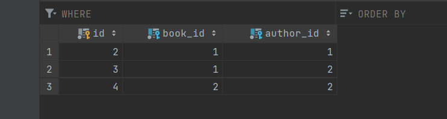

## 模型元数据Meta

Meta类的作用是为模型类提供一些额外的元数据信息，以控制模型类的行为和与其他模型类的交互。通过设置Meta类中的属性和方法，可以使模型类更容易理解和使用，也可以提高模型类与数据库的交互效率.

> 这个元数据就像表的元数据,我们可以对表进行一些约束

比如我们就可以通过给定元数据修改模型在admin页面中的展现方式等等....

我们来看看它的常用属性吧

1. `db_table`：指定模型类在数据库中的表名。
2. `ordering`：指定查询结果的排序方式。
3. `verbose_name`和`verbose_name_plural`：分别指定模型类在后台管理站点中的显示名称和复数形式的显示名称。
4. `unique_together`：指定哪些字段组合在一起必须是唯一的。
5. `index_together`：指定哪些字段组合需要创建索引。
6. `permissions`：指定模型类的权限，可以用于控制用户对模型类的访问和操作。
7. `abstract`：指定模型类是否是抽象类。
8. `app_label`：指定模型类所属的应用程序的名称。
9. `verbose_name`和`verbose_name_plural`：分别指定模型类在后台管理站点中的显示名称和复数形式的显示名称

我们可以修改verbose_name和verbose_name_plural来修改模型在admin平台显示的名字(管理后台那个例子)

```
class User(models.Model):
    name = models.CharField(max_length=10,verbose_name="名字")
    password = models.CharField(max_length=50,verbose_name="密码")
    def __str__(self):
        return f"{self.name}"
    class Meta:
        verbose_name = "用户"
        verbose_name_plural = verbose_name
```

我们来对比一下前后

没有加元数据前

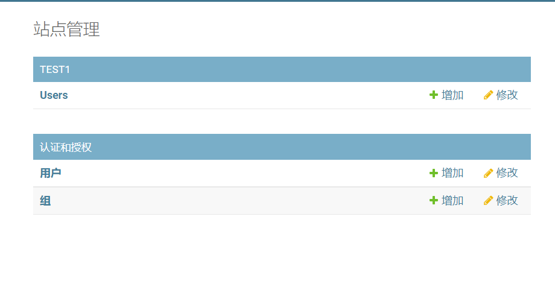

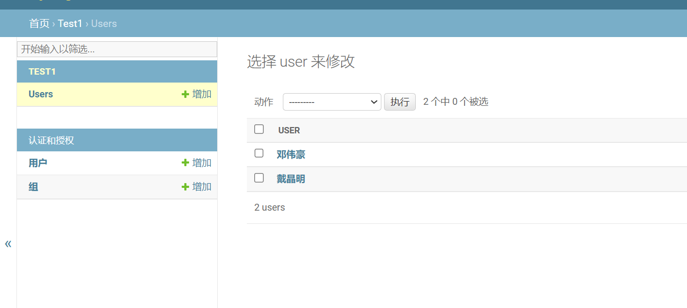

加了元数据后

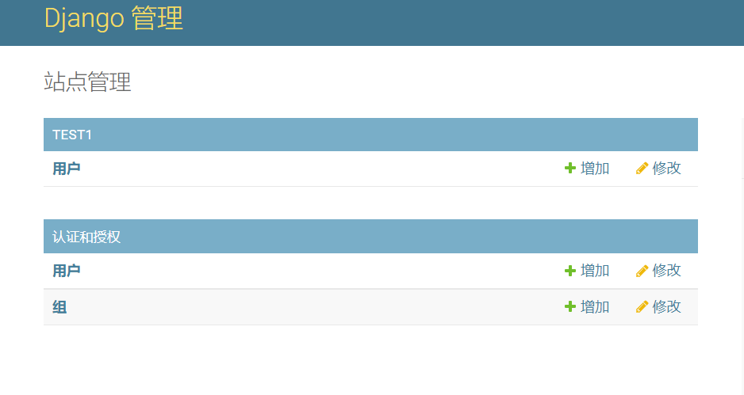

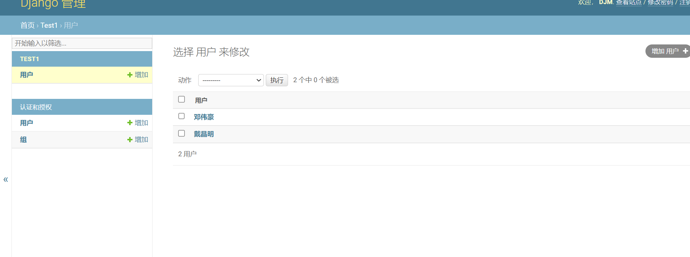


## 操作表的API

一旦创建 数据模型 后，Django 自动给予你一套数据库抽象 API，允许你创建，检索，更新和删除对象

要从数据库检索对象，要通过模型类的 Manager 构建一个 QuerySet。一个 QuerySet 代表来自数据库中对象的一个集合。

你能通过模型的 Manager 获取 QuerySet。每个模型至少有一个 Manager，默认名称是 objects,只能通过模型类来访问，不能通过模型实例来访问

### 对象常用方法

save  保存到数据库

delete 从数据库中删除 (如果数据库中没有的话报错)


### objects常用方法

objects常用方法就是QuerySet 里面的常用方法,我们可以直接看QuerySet 中的方法

### QuerySet 常用方法

1. filter(**kwargs): 用于筛选出满足给定查找参数的对象。参数可以是模型字段和值的映射。

   示例：`Post.objects.filter(title__icontains='django', published=True)`

2. exclude(**kwargs): 与filter相反，返回不满足给定参数的对象。

   示例：`Post.objects.exclude(published=True)`

3. get(**kwargs): 返回满足给定查找参数的单个对象。如果没有找到或找到多个对象，会抛出异常。

   示例：`Post.objects.get(id=1)`

4. all(): 返回QuerySet中包含的所有对象。

   示例：`Post.objects.all()`

5. none(): 返回一个空的QuerySet。

   示例：`Post.objects.none()`

6. count(): 返回QuerySet中的对象数量。

   示例：`Post.objects.count()`

7. exists(): 检查QuerySet是否包含任何对象。这比使用count()更高效。

   示例：`Post.objects.exists()`

8. order_by(*fields): 对查询结果进行排序。默认是升序，使用负号(-)表示降序。

   示例：`Post.objects.order_by('-publish_date', 'title')`

9. distinct(*fields): 返回QuerySet中不重复的对象。

   示例：`Author.objects.distinct('country')`

10. values(*fields): 返回一个包含字典的QuerySet，其中包含指定字段的值。**这个就相当于分组**,当我们使用后面的aggregate,或者annotate时就相当于对这个字段分组进行的

    示例：`Post.objects.values('id', 'title')`

11. values_list(*fields, flat=False): 返回一个包含元组（或单值，如果设置了flat=True）的QuerySet，其中包含指定字段的值。

    示例：`Post.objects.values_list('id', 'title')`

12. first(): 返回QuerySet中的第一个对象，如果没有对象，则返回None。

    示例：`Post.objects.first()`

13. last(): 返回QuerySet中的最后一个对象，如果没有对象，则返回None。

    示例：`Post.objects.last()`

14. aggregate(*args, **kwargs): 对查询结果进行聚合操作，如计数、求和、平均值等。

    示例：`from django.db.models import Count, Avg`

    ```
     Post.objects.aggregate(Count('author'), Avg('views'))
    ```

    

15. annotate(*args, **kwargs): 为查询结果的每个对象添加注解，如计数、求和、平均值等。

    示例：`from django.db.models import Count`

    ```
    Author.objects.annotate(post_count=Count('post'))
    ```

16. select_related(*fields): 对于ForeignKey和OneToOneField字段，执行一个SQL join并包括查询中指定的相关对象。

    示例：`Post.objects.select_related('author')`

17. prefetch_related(*related_lookups): 用于对多对多关系和反向ForeignKey关系的查询优化。

    示例：`Author.objects.prefetch_related('post_set')`

18. using() 操作哪个数据库的数据

19. raw(sql, params=None, translations=None): 执行原始SQL查询，并返回一个包含指定模型实例的RawQuerySet。

    示例：`Post.objects.raw('SELECT * FROM blog_post WHERE published = 1')`

    

    

### **aggregate 与 annotate 的区别**

aggregate会对当前QuerySet的所有数据当成一个分组,执行聚合函数,而且返回值还是一个字典

annotate 会根据values中的分组执行聚合函数,返回值是QuerySet  里面包含很多字典(如果不使用values的话,每个数据自己是一个分组,而且返回值是一个queryset,里面包含的是对象)

在实际应用中，您可以根据需要选择使用`aggregate()`或`annotate()`。如果您需要对整个数据集执行聚合操作，可以使用`aggregate()`。如果您需要在分组的基础上执行聚合操作，可以使用`annotate()`

### Q对象

我们发现objects中的参数连接起来后都是  and连接 ,如果我们想使用or连接的话,我们就得使用Q对象

```
from django.db.models import Q

Q(question__startswith='Who') | ~Q(pub_date__year=2005)
```

我们可以对其进行普通的逻辑操作

### F对象

F对象在Django中用于在查询或更新操作中引用字段的值。它允许在查询中**使用模型字段的当前值，而不是传递一个固定值**。F对象位于`django.db.models`模块中

1. 比较字段值：假设我们有一个博客模型，其中有两个字段：浏览次数（views）和点赞次数（likes）。我们想找出浏览次数大于点赞次数的文章：

```
from django.db.models import F

Post.objects.filter(views__gt=F('likes'))
```

这里，`views__gt=F('likes')`表示筛选出views字段的值大于likes字段的值的对象。

2. 更新字段值：假设我们想要在文章的浏览次数上加1，我们可以使用F对象实现这个功能：

```
from django.db.models import F

Post.objects.update(views=F('views') + 1)
```

这里，`views=F('views') + 1`表示将每篇文章的views字段的值加1。

3. 对字段值进行计算：F对象可以与标准Python运算符一起使用，例如加法、减法、乘法和除法。例如，如果我们想要计算文章的点赞率（点赞次数除以浏览次数），我们可以这样做：

```
from django.db.models import F, ExpressionWrapper, FloatField

Post.objects.annotate(like_ratio=ExpressionWrapper(F('likes') / F('views'), output_field=FloatField()))
```

这里，我们使用`annotate`方法和`ExpressionWrapper`创建了一个名为`like_ratio`的新字段，该字段表示每篇文章的点赞率。

注意：当使用F对象执行运算时，可能会遇到数据库间的不一致性。为了避免这个问题，可以使用`django.db.models.functions`模块中的数据库函数。例如，对于上面的点赞率计算，我们可以使用`Div`函数：

```
from django.db.models import F
from django.db.models.functions import Div

Post.objects.annotate(like_ratio=Div(F('likes'), F('views')))
```

总之，F对象在Django查询中非常有用，它可以让你直接引用模型字段的值，而不是传递固定值。这样可以让你编写更灵活、更高效的查询。

### 每个 QuerySet 都是唯一的

每次精炼一个 QuerySet，你就会获得一个全新的 QuerySet，后者与前者毫无关联。每次精炼都会创建一个单独的、不同的 QuerySet，能被存储，使用和复用。


### QuerySet 是惰性的

QuerySet 是惰性的 —— 创建 QuerySet 并不会引发任何数据库活动。你可以将一整天的过滤器都堆积在一起，Django 只会在 QuerySet 被 计算 时执行查询操作。来瞄一眼这个例子:

```
>>> q = Entry.objects.filter(headline__startswith="What")
>>> q = q.filter(pub_date__lte=datetime.date.today())
>>> q = q.exclude(body_text__icontains="food")
>>> print(q)
```

虽然这看起来像是三次数据库操作，实际上只在最后一行 (print(q)) 做了一次。一般来说， QuerySet 的结果直到你 “要使用” 时才会从数据库中拿出。当你要用时，才通过数据库 计算 出 QuerySet

## 数据库事务

在Django中，事务是用于确保一组数据库操作要么全部成功执行，要么全部失败，从而维护数据库的一致性。Django提供了几种使用事务的方法：

1. **使用装饰器**：`django.db.transaction.atomic`是一个装饰器，可以用来确保被装饰的函数中的数据库操作在一个原子事务中执行。如果函数中的任何操作失败，整个事务将被回滚。

   ```
   pythonCopy codefrom django.db import transaction
   
   @transaction.atomic
   def create_user_and_profile(username, email):
       user = User.objects.create(username=username, email=email)
       profile = UserProfile.objects.create(user=user)
   ```

   在上面的示例中，`create_user_and_profile`函数被`@transaction.atomic`装饰器包裹，确保`User`和`UserProfile`的创建操作在一个原子事务中执行。

2. **使用上下文管理器**：`django.db.transaction.atomic`还可以作为上下文管理器使用，将一段代码块包含在一个原子事务中。

   ```
   pythonCopy codefrom django.db import transaction
   
   def create_user_and_profile(username, email):
       with transaction.atomic():
           user = User.objects.create(username=username, email=email)
           profile = UserProfile.objects.create(user=user)
   ```

   在上面的示例中，我们使用`with transaction.atomic()`语句确保代码块中的`User`和`UserProfile`的创建操作在一个原子事务中执行。

3. **手动管理事务**：在某些情况下，您可能需要更精细地控制事务的行为。Django提供了`transaction.commit()`、`transaction.rollback()`和`transaction.set_autocommit()`等方法，以便手动管理事务。

   请注意，手动管理事务可能导致更复杂的代码和更高的错误风险。因此，除非有特殊需求，否则建议使用`transaction.atomic`装饰器或上下文管理器。

总之，在Django中，您可以使用`django.db.transaction.atomic`装饰器或上下文管理器来确保一组数据库操作在一个原子事务中执行。这有助于确保数据库的一致性和数据完整性。在需要更精细的事务控制时，您还可以使用手动管理事务的方法，但这可能导致代码更加复杂。

# 模板

Django 模板语言是一种简单的、可扩展的标记语言，用于在 Django 视图中呈现数据。它包括变量、标签和过滤器。以下是 Django 模板语法的基本概述。

## 基本语法

### 变量

变量是从视图传递给模板的数据。在模板中，变量用双大括号`{{ }}`括起来。

### 特定标签

标签是用于执行特定操作的模板指令。它们用大括号和百分号``括起来。Django 提供了许多内置标签，也允许您创建自定义标签。

- for：遍历列表或字典
- if/elif/else：条件判断
- include：包含另一个模板的内容
- block/extends：模板继承
- load：加载自定义标签和过滤器
- with：创建模板中的局部变量

### 过滤器

过滤器用于在模板中对变量执行某些操作。它们在变量后使用管道符`|`表示。以下是一些内建过滤器：

- lower：将文本转换为小写
- date：格式化日期
- length：获取列表或字符串的长度
- default：设置默认值
- escape：转义HTML字符
- safe：标记变量内容为安全的HTML  可以将我们的变量字符串变成html

## 上下文

我们在模板中能够使用的变量都是在上下文中能找到的

### Django帮我们添加好的变量

1. `django.template.context_processors.debug`:
   - `debug`: 布尔值，表示当前是否处于调试模式（由`settings.DEBUG`决定）。
2. `django.template.context_processors.request`:
   - `request`: 当前的HttpRequest对象，包含请求的详细信息，如URL、HTTP方法、GET/POST参数等。
3. `django.template.context_processors.media`:
   - `MEDIA_URL`: 用于访问媒体文件的基本URL（由`settings.MEDIA_URL`定义）。
4. `django.template.context_processors.static`:
   - `STATIC_URL`: 用于访问静态文件的基本URL（由`settings.STATIC_URL`定义）。
5. `django.contrib.auth.context_processors.auth`:
   - `user`: 表示当前已登录的用户，或者是一个匿名用户。
   - `perms`: 一个对象，包含当前用户的所有权限。
6. `django.contrib.messages.context_processors.messages`:
   - `messages`: 当前请求中的一次性消息（flash messages），通常用于显示成功、错误或信息提示

### 如何自己往上下文中添加变量

以下是一些常见的方法来将变量放入上下文：

1. 使用render()函数：
   render()函数是在视图中渲染模板并将结果作为HttpResponse返回的最常用方法。它接受三个参数：请求对象（request）、模板名称和上下文字典（可选）。
2. 使用TemplateView类：
   如果你使用基于类的视图（class-based views），可以通过在TemplateView子类中定义get_context_data()方法来添加上下文变量
3. 使用上下文处理器（context processors）：
   上下文处理器是一种将全局变量添加到所有模板上下文的方法。要创建一个上下文处理器，你需要编写一个函数，该函数接受一个request参数并返回一个字典。然后将此函数添加到settings.py中的TEMPLATES选项的'context_processors'列表中


# 需要注意的点

## 创建数据模型对象的方式

如果我们使用的是普通方式的创建对象的话,必须使用save方法,不然不会保存到数据库,  如果我们使用的是 objects.create的方法的话就不需要使用save方法

## 修改数据后要调用save方法

我们对对象的属性进行修改后必须使用save方法才能修改到数据库

# 出现的问题


## related_query_name失效

我发现如果只是单纯的在定义字段的时候加入related_query_name, 在运行的时候,并不能反向拿到对象

# 额外补充


## 如何发送QQ邮件

1. 首先，确保已经安装了 `django-smtp-ssl` 包。 pip install django-smtp-ssl
2. 登录你的 QQ 邮箱，然后进入 [设置 -> 账户 -> POP3/IMAP/SMTP/Exchange/CardDAV/CalDAV服务](https://mail.qq.com/cgi-bin/frame_html) 页面，开启 SMTP 服务。注意，开启后会获得一个授权码，记下这个授权码，稍后在 Django 项目中使用。
3. 在 `searchproject` 项目的 `settings.py` 文件中，配置邮件发送设置，使用 QQ 邮箱的 SMTP 服务器和刚刚获得的授权码：

```
EMAIL_BACKEND = 'django_smtp_ssl.SSLEmailBackend'
EMAIL_HOST = 'smtp.qq.com'
EMAIL_PORT = 465
EMAIL_USE_SSL = True
EMAIL_HOST_USER = 'your-qq-email@example.com'  # 你的 QQ 邮箱地址
EMAIL_HOST_PASSWORD = 'your-qq-email-authorization-code'  # 你的 QQ 邮箱授权码
```

写一个简单的例子吧

```
from django.core.mail import EmailMultiAlternatives
from email.utils import formataddr
def send_verification_code(to_email, verification_code):
    subject = f'搜题系统验证码'
    plain_text_message = f'您的验证码为: {verification_code},五分钟内有效'
    html_message = f'<p>您的验证码为: <span style="color: blue; text-decoration: underline;">{verification_code}</span>,五分钟内有效</p>'
    from_email = formataddr(('搜题系统',settings.EMAIL_HOST_USER))  # 设置发件人名字和邮箱

    email = EmailMultiAlternatives(subject, plain_text_message, from_email, [to_email])
    email.attach_alternative(html_message, "text/html")
    email.send()

```

## 使用内置缓存框架

