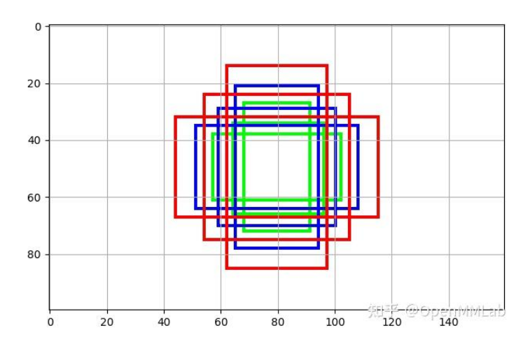

# 训练流程

1. 特征提取：backbone+neck
2. 损失计算：head
3. 验证: head.predict->val_evaluator

## 损失计算

损失计算部分是放在head里面， head又分为anchorfreehead和anchorhead

损失计算步骤：

1. 将特征分别经过分类和回归分支得到分类得分cls_scores和目标框预测bboxes
2. 用cls_scores和bboxes和真实框计算损失

### anchorhead

分类得分cls_scores: [batch,锚框数量*类别，H，W]

和目标框预测bboxes: [batch, 锚框数量*4， H，W]

损失计算步骤：

1. 得到锚框
2. 使用锚框根据不同的正负样本分配算法得到哪些是正样本以及他负责预测哪个真实框， 这里就得到标签了也就是lable_target
3. 计算目标框和类别损失

这里有个要注意的点： 坐标计算损失的时候用什么格式去计算， 这个取决于我们的损失函数， 如果是iou这种， 就必须使用绝对坐标去计算， 这种就需要把reg_decoded_bbox设置为true，将预测框解码， 如果是l1这种就需要将真实框去编码，reg_decoded_bbox设置为false。 reg_decoded_bbox控制的是在编码空间还是解码空间计算损失

### anchorfreehead


# 预测流程

1. 特征提取：backbone+neck
2. 预测：head + 解码 + nms

# assigner

它的**核心职责**是：**在训练阶段，为模型生成的大量“预测候选框”（Priors，例如 Anchors 或 Queries）分配一个“学习目标”**。

这个“学习目标”具体来说就是：

1. **正样本 (Positive Sample)**：这个候选框应该负责预测某一个**特定的**“真实物体框” (Ground-Truth, GT BBox)。
2. **负样本 (Negative Sample)**：这个候选框应该负责预测“背景” (Background)。
3. **忽略样本 (Ignored Sample)**：这个候选框在训练中将被忽略，不计入损失函数。

## MaxIoUAssigner

这是最常用和最基础的分配器。它的规则（以 `pos_iou_thr=0.7`, `neg_iou_thr=0.3` 为例）是：

1. **规则一 (正样本):** 对于**每一个** `gt_bbox`，找到和它 IoU 最高的那个 `prior`（锚点），将这个 `prior` 分配为正样本。
   - *目的：确保每个真实物体（GT）都至少有一个锚点（Prior）负责预测它。*
2. **规则二 (正样本):** 对于**每一个** `prior`，计算它和**所有** `gt_bboxes` 的最大 IoU。如果这个最大 IoU $\ge 0.7$ ( `pos_iou_thr` )，也将它分配为正样本。
3. **规则三 (负样本):** 对于**每一个** `prior`，如果它和**所有** `gt_bboxes` 的最大 IoU $< 0.3$ ( `neg_iou_thr` )，则将其分配为负样本（背景）。
4. **规则四 (忽略样本):** 如果一个 `prior` 不满足以上任何规则（即它的最大 IoU 在 $[0.3, 0.7)$ 之间），它将被标记为“忽略”，不参与损失计算。

# 数据格式约定

## 传递格式

框架本身对于模块之间的传输是没有约定的， 它提供的是一个统一的变量名字， 比如data_sample, 传递的时候 \*data_sample 或者\*\*data_ 通过这种方式解开, 这样就把不同数量的函数统一为相同函数了

## 数据内部格式

对于数据内部的格式， 框架也没有约定， 比如对于真实框的数据， 可能是xyxy格式， 也可能是xywh格式， 还有从检测头出来的格式是真实位置还是偏移，这个要看我们用的模块， 这部分也是比较容易搞混的地方， 下面列举这个

* coco真实框： 加载出来的数据就是xyxy格式（原始数据是xywh), 这个也是经过缩放后得到的

# 答疑解惑

### 配置文件的背后

mmdetection框架通过配置文件就能做到模型搭建, 那么他是如何得知这些模块在哪的呢? 这就涉及到了python的装饰类, 我们会发现很多类似这样的代码

```python
@MODELS.register_module()  # 后续版本貌似检测头主干那些全部用这个了
@DATASETS.register_module()
.....
```

这个会把定义的模块注册到mmdet框架管理的容器中, 其实就是一个字典, 名字到包名的对应

最后通过懒加载(这里也算不上真正的懒加载, 因为只要使用其中任意一个模块, 就会把所有模块全部导入) 把预先定义好的模块全部加载进去, 这个是mmdet/model/\_\_init\_\_.py

```
# Copyright (c) OpenMMLab. All rights reserved.
from .backbones import *  # noqa: F401,F403
from .data_preprocessors import *  # noqa: F401,F403
from .dense_heads import *  # noqa: F401,F403
from .detectors import *  # noqa: F401,F403
from .language_models import *  # noqa: F401,F403
from .layers import *  # noqa: F401,F403
from .losses import *  # noqa: F401,F403
from .mot import *  # noqa: F401,F403
from .necks import *  # noqa: F401,F403
from .reid import *  # noqa: F401,F403
from .roi_heads import *  # noqa: F401,F403
from .seg_heads import *  # noqa: F401,F403
from .task_modules import *  # noqa: F401,F403
from .test_time_augs import *  # noqa: F401,F403
from .trackers import *  # noqa: F401,F403
from .tracking_heads import *  # noqa: F401,F403
from .vis import *  # noqa: F401,F403
```

## 锚框是什么？

锚框相当于我们预定义的一系列框，比如我们可以在图中预先画很多框，让模型只要去微调这些框就行， 当然这里面有很多框是无效的， 后续通过分类得分过滤，

产生方法就是就图片看成一个被strde划分的网格， 我们在网格左上角开始画一系列的框， 让这些框去预测这个区域



一个相同大小的图片的锚框是一摸一样的
