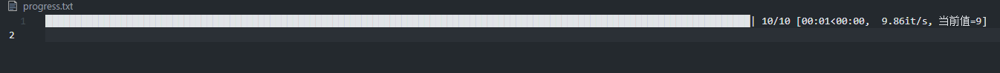

# Numpy

## 提取数据

### 1. 索引

这种方式就跟数组的使用是一模一样的

```python
arr = np.array([[1,2,3], [4,5,6], [7,8,9]])
arr[0] # [1,2,3]
arr[0,0] # [1]  等价于arr[(0,0)]
arr[[0,1]] # [[1,2,3],[4,5,6]]
```

### 2.切片

其实索引就是一种特殊切片, 我个人觉得可以这么理解

```python
arr = np.array([[1,2,3], [4,5,6], [7,8,9]])
arr[0] # [1,2,3] 等价于 arr[0,:]
arr[[0,1]] # [[1,2,3],[4,5,6]] 等价于arr[[0,1], :]
```

### 总结

np里面的数组有多少维度, 默认取数据的时候, 就能指定多少维度, 不指定就是全选, 默认维度指定是从左到右

通过这种理解方式, 我们就很容易得知取了数据之后还有多少维度

**需要注意的点就是 () 和 [] 的区别, () 就相当于正常取数据里面有个数据就是设置几个维度, 而[]只是设置一个维度** 

```python
a[(1,2,3)] => a[1,2,3]
a[[1,2,3]] => a[[1,2,3], :]
```

# tqdm


## 保留tqdm最后一次输出

有时候我们想要得到tqdm的最后一次输出, 并把它写入文件, 方便我们日后查看, 如果使用tqdm的file参数功能, 我们会发现保留了很多行, 因为动态的本质就是每次都输出, 但是文件不像控制台提供了很多控制功能, 所以我们需要自己将最后一次输出写到文件中

```python
from tqdm import tqdm
import time


class FinalOutputTqdm(tqdm):
    def __init__(self, *args, file_path="progress.txt", **kwargs):
        # 提前打开文件句柄，确保生命周期可控
        self.file = open(file_path, "w")
        super().__init__(*args, **kwargs)

    def close(self):
        if not self.disable:  # 确保只执行一次
            final_str = self.format_meter(**self.format_dict)
            self.file.write(final_str + "\n")
            self.file.close()  # 关闭文件句柄
            self.disable = True  # 标记为已关闭
        super().close()

    def __del__(self):
        # 确保在析构时调用 close（即使未显式关闭）
        if not self.disable:
            self.close()


# 测试代码
pbar = FinalOutputTqdm(range(10), desc="进度")
for i in pbar:
    time.sleep(0.1)
    pbar.set_postfix({"当前值": i})
```

查看文件内容



