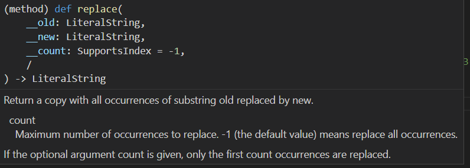
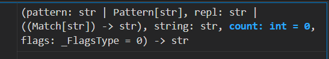
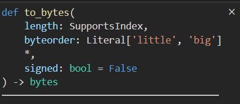
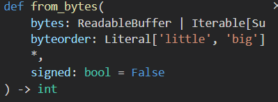
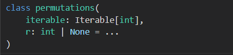
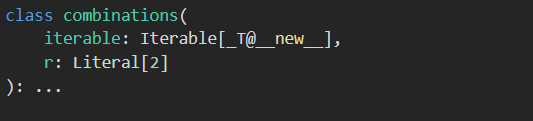

## 基本数据结构

### 序列分解为单独变量

对于一个可分解对象(迭代器,生成器,列表,元组,集合),我们可以直接用变量去接收里面的值

```python
l = [1,2,3,4,5]
a,b,c,d,e = l

# 如果数量不匹配则会报错
# a,b = l   # ValueError: too many values to unpack (expected 2)

# 如果我们只想要一些数据的话,可以用占位符(可以是任何字符,我们习惯用_),_代表占用一个 *_ 代表占用一群

_ , a , *_ = l
print(a) # 2
```

> 如果解压出来的数据里面又包含序列,我们还想解压的话,必须使用()包裹起来
>
> a = [1,(2,3)]
>
> b,(c,d) = a

#### 举例实用性

去除一个列表的最高值和最低值,求中间值的平均值

```python
def average(socres):
    first,*mid,last = socres
    return sum(mid) / len(mid)

print(average([5,4,3,2,1]))
```

### 保留最后N个元素

我们希望我们的队列中只保留最后N个元素,当元素超过N的时候就把前面的删掉,我们可以用队列实现

```python
from collections import deque

queue = deque(maxlen=5)  # 只保留最后五个
queue.extend([1,2,3,4,10,6,7])
for i in queue: 
    print(i)

```

> 注意 append 和 extend 的区别 ,append是添加一个元素,extend是把后面这个可迭代对象拆开放进去

> 列表适合做栈,不适合做队列,它的出队列是o(N)时间复杂度

### 获得最大或者最小的N个元素

从可迭代数据中或者最大或者最小的N个元素

```python
import heapq
import pprint
portfolio = [
    {'name': 'IBM', 'shares': 100, 'price': 91.1},
    {'name': 'AAPL', 'shares': 50, 'price': 543.22},
    {'name': 'FB', 'shares': 200, 'price': 21.09},
    {'name': 'HPQ', 'shares': 35, 'price': 31.75},
    {'name': 'YHOO', 'shares': 45, 'price': 16.35},
    {'name': 'ACME', 'shares': 75, 'price': 115.65}
]

pprint.pprint(heapq.nsmallest(2,portfolio,lambda x:x['price']))
pprint.pprint(heapq.nlargest(2,portfolio,lambda x:x['price']))
```

heapq的使用

```python
import heapq
nums = [10,34,1,3,5]
heapq.heapify(nums)  # 必须得先进行排序
print(heapq.heappop(nums)) # 删除堆顶
heapq.heappush(nums,20) # 添加一个元素
print(nums)
```

### 字典中的键映射多个值

其实就是利用列表这些数据结构当成键对应的值,然后可以往这个列表中多添加些数据,其实还是只能一个键对应一个值

我们可以自己这样

```python
a = {}
a.setdefault("name",[]).append("djm")
a.setdefault("name",[]).append("nb")
print(a)

```

当然,看着这么多代码还是有点不舒服的,我们就用python提供的 defaultdict吧

```python
from collections import defaultdict

a = defaultdict(list)  # 帮我们的值默认初始化为 list
a["name"].append("djm")
a["name"].append("nb")
print(a)
```

### 控制字典顺序

当我们遍历字典的时候,发现出来的数据并不是我们原先添加进去的顺序,因为这个用的是hash算法来放位置的,如果我们想要按添加时候的顺序来遍历数据就要用  orderdict ,它的底层多了一个双向链表,这也就意味着内存的增加,所以我们要酌情使用

```python
from collections import OrderedDict

d = OrderedDict()
d['foo'] = 1
d['bar'] = 2
d['spam'] = 3
d['grok'] = 4
# Outputs "foo 1", "bar 2", "spam 3", "grok 4"
for key in d:
    print(key, d[key])		
```

### 切片命名

如果对于一个固定的切片大小,而且要经常使用,我们不妨使用slice 函数来生成切片序列

```python
s = slice(1,-1,2)  
a = [1,2,3,4,5,6]
b = [2,3,4,5,6]
print(a[s])
print(b[s])
```

### counter

这个类可以用来对一个存放有可hash的对象的可迭代的列表进行计数,厉害的是它还可以进行数据运算,还有其他的强大的功能,比我们自己用dict 去计数要方便很多

```python
from collections import Counter
import random

a = [int(random.random()*3) for i in range(5)]
b = [int(random.random()*3) for i in range(5)]
print(a)  # [2, 2, 0, 0, 2]
print(b) # [2, 2, 1, 1, 0]

# Counter跟dict的方法差不多
ca = Counter(a)
cb = Counter(b) 
print(ca)  # Counter({2: 3, 0: 2})
print(cb)  # Counter({2: 2, 1: 2, 0: 1})

# 求出前2个数量最多的,列表里面套元组,而且是已经排好序的
print(ca.most_common(2))  # [(2, 3), (0, 2)]
print(cb.most_common(2))  #  [(2, 2), (1, 2)]

# 做数学运算
print(ca-cb) # Counter({2: 1, 0: 1})
print(ca+cb) # Counter({2: 5, 0: 3, 1: 2})
```

### 提供关键字排序函数

在排序的时候,我们有时候会按照一些自定义规则排序,或者是使用关键字排序,我们可以使用lambda,也可以使用python提供的函数

```python
from operator import attrgetter,itemgetter
from pprint import pprint

rows = [
    {'fname': 'Brian', 'lname': 'Jones', 'uid': 1003},
    {'fname': 'David', 'lname': 'Beazley', 'uid': 1002},
    {'fname': 'John', 'lname': 'Cleese', 'uid': 1001},
    {'fname': 'Big', 'lname': 'Jones', 'uid': 1004}
]
class User:
    def __init__(self, user_id):
        self.user_id = user_id

    def __repr__(self):
        return 'User({})'.format(self.user_id)
users = [User(23), User(3), User(99)]

# itemgetter(key) 相当于 lambda x:x[key]
pprint(sorted(rows,key=itemgetter("lname")))
# attrgetter(key) 相当于  lambda x:x.getter(key)
print(sorted(users, key=attrgetter("user_id")))
```

### 根据某个字段分组

有时候我们希望根据某个字段分组,然后依次遍历这个分组,这是非常使用的一个东西,如果让我们自己来遍历的话,必须得先定义一个变量比较是否属于一个分组,这样太麻烦了,我们看看python提供的groupby函数

```python
from itertools import groupby
from operator import itemgetter
rows = [
    {'address': '5412 N CLARK', 'date': '07/01/2012'},
    {'address': '5148 N CLARK', 'date': '07/04/2012'},
    {'address': '5800 E 58TH', 'date': '07/02/2012'},
    {'address': '2122 N CLARK', 'date': '07/03/2012'},
    {'address': '5645 N RAVENSWOOD', 'date': '07/02/2012'},
    {'address': '1060 W ADDISON', 'date': '07/02/2012'},
    {'address': '4801 N BROADWAY', 'date': '07/01/2012'},
    {'address': '1039 W GRANVILLE', 'date': '07/04/2012'},
]
# 必须先排好序
rows.sort(key=itemgetter("date"))

# 根据日期分组,得到每个分组里面数据,以及分组数量
groups = 0
for date, items in groupby(rows,key=itemgetter("date")):
    groups += 1
    print(f'第{groups}分组的内容为:')
    for item in items:
        print(item)

```

> 记得先排好序

### 将下标序列变成命名序列

有时候我们通过下标访问序列的方式让代码看起来很不清晰,不知道这个下标表示什么意思,我们不妨将这个序列变成命名分组,这样我们可以通过.名字的方法访问数据

```python
from collections import namedtuple

# 名字,语文,数学
Students = [
    ["djm",10,20],
    ["dd",80,20],
    ["aa",10,90],
    ["cc",100,20],
]
# 求每个学生总分

# 使用下标
for student in Students:
    print(student[0],":",student[1]+student[2])

# 使用命名分组
Student = namedtuple("Student",["name","chinese","math"])
for student in Students:
    student = Student(*student) # 这里必须使用参数展开符
    print(student.name,":",student.chinese+student.math)

```

这种方法是不是可以让代码看起来更直观

记住这里生成的对象里面的数据是不可以变的,它这个对象跟元组差不多,都是不可变对象,如果非要更改,必须使用_replace方法生成一个新的对象

### 合并多个字典

现在有多个字典或者映射，你想将它们从逻辑上合并为一个单一的映射后执行某些操作， 比如查找值或者检查某些键是否存在。其实也就是用个链表将多个dict连接起来,查找的时候从当前一直向后查找

```python
from collections import ChainMap
a = {'x':1,'y':2}
b = {'x':2,'z':3}

m = ChainMap(a,b)
print(m["x"])  # 1
print(m["z"])  # 3
m["u"] = 10  #  相当于 a["u"] = 10
print(m) # ChainMap({'x': 1, 'y': 2, 'u': 10}, {'x': 2, 'z': 3})
```

### 二分查找库

`bisect`模块提供了以下两个主要函数：

- `bisect_left(a, x, lo=0, hi=len(a))`：在已排序的列表a中查找元素x应该插入的位置，返回值是一个整数，表示x应该插入的位置。如果x已经存在于a中，则返回与之相等的元素的左侧位置。`lo`和`hi`参数用于指定查找范围，默认是整个列表a。
- `bisect_right(a, x, lo=0, hi=len(a))`：与`bisect_left()`函数类似，但如果x已经存在于a中，则返回与之相等的元素的右侧位置。

除此之外，`bisect`模块还提供了以下两个函数，用于在已排序的序列中插入元素：

- `insort_left(a, x, lo=0, hi=len(a))`：将元素x插入到已排序的列表a中，并保持列表的升序排列。
- `insort_right(a, x, lo=0, hi=len(a))`：与`insort_left()`函数类似，但如果x已经存在于a中，则将x插入到相等元素的右侧。

## 字符串

### 指定分隔符分割字符串

我们可以用字符串提供的split方法 以及 更强大的re.split方法,前者只能指定一个分隔符

```python
import re

line = 'asdf fjdk; afed, fjek,asdf, foo'

# 只能指定一个分隔符
print(line.split(';')) #['asdf fjdk', ' afed, fjek,asdf, foo']
print(line.split(',;')) # ['asdf fjdk; afed, fjek,asdf, foo']

# 可以指定多个分隔符
print(re.split(r'[ ,;]+',line)) #['asdf', 'fjdk', 'afed', 'fjek', 'asdf', 'foo']

# 如果指定分组的话分割好的列表中会包含分隔符
print(re.split(r'([ ,;]+)',line)) #['asdf', ' ', 'fjdk', '; ', 'afed', ', ', 'fjek', ',', 'asdf', ', ', 'foo']
```

### 多个开头或者结尾匹配

如果我们要看一个字符串的开头或者结尾是否满足一群要求,我们可以在endswith 或者 startswith中传递一个**元组**

```python
url = "http://www.baidu.com"
def ishttp(url):
    return url.startswith(("http","https"))
print(ishttp(url))
print(ishttp("https://www.baidu.com"))
```

### 使用通配符匹配字符串

就像用shell里面的通配符去匹配字符串一样,我们需要使用fnmatch模块

```python
import fnmatch

print(fnmatch.fnmatch("A.TXT","*.txt")) # windows下为True  linux下为False
print(fnmatch.fnmatchcase("A.TXT","*.txt")) # False

```

### 将将字符串变量变成原始字符串

有时候我们希望不要进行转义,就要原始字符串,有两种方法,如果是在定义的时候,可以用r加在前面,如果是一个变量,我们可以用repr函数

```python
a = '\n' # 输出换行
a = repr(a) # \n
a = r'\n' # \n
```

### 字符串的替换

有两种方法,一个是字符串自带的replace方法,还有一个就是re模块的sub方法,这个方法比较强大

replace定义



re.sub函数定义



```python
import re

text = 'yeah, but no, but yeah, but no, but yeah'

# replace 默认全部替换,我们也可以限制替换数量
print(text.replace("yeah","yep")) # yep, but no, but yep, but no, but yep
print(text.replace("yeah","yep",2)) # yep, but no, but yep, but no, but yeah

text = 'now is 3/17/2023, now is 3/17/2023'
# sub 中的 替换字符串正则表达式可以使用 匹配字符串中的分组
print(re.sub(r"(\d{1,2})/(\d{1,2})/(\d{4})",r'\3-\2-\1',text)) # now is 2023-17-3, now is 2023-17-3

# 还可以指定替换数量
print(re.sub(r"(\d{1,2})/(\d{1,2})/(\d{4})",r'\3-\2-\1',text,1)) # now is 2023-17-3, now is 3/17/2023

# 如果替换逻辑比较复杂,我们也可以用回调函数,函数的参数类型为 re.Match
def func(m): 
    print(m)
    return f"{m.group(3)}-{m.group(2)}-{m.group(1)}"
print(re.sub(r"(\d{1,2})/(\d{1,2})/(\d{4})",func,text)) # now is 2023-17-3, now is 2023-17-3

# 我们还可以用subn获得替换了多少次
print(re.subn(r"(\d{1,2})/(\d{1,2})/(\d{4})",r'\3-\2-\1',text)) # ('now is 2023-17-3, now is 2023-17-3', 2)
```

### 字符与数字的相互转换

我们有时候需要使用一个字符的ASCII码对应的数字,也需要将一个数字对应的字符

使用 ord 可以将一个字符变成数字,  chr可以将数值变成字符

```python
print(chr(69)) # E
print(ord('D')) # 68
```

### 字符串的拼接

对于少量的字符串我们可以使用 + 连接起来, 对应很多的字符串拼接我们可以使用 ''.join这样会快很多, join方法是将调用者为分割符,连接所有字符串

```python
import time
a = "10"
b = "20"

n = 1000000

start = time.time()
s = ""
for i in range(n):
    s += a+b
end = time.time()
print(f"+拼接字符串耗时{end-start}s") #1.0576465129852295s
start = time.time()
s = ""
s = s.join(a+b for i in range(n))
end = time.time()
print(f"join拼接字符串耗时{end-start}s") # 0.15259289741516113s
```

> 当n的不多的时候,两者差不多,当n比较大的时候差距就明显了

### 字符串与字节的转换

我们在文件操作的时候,通常要用到字符串和字节的转换

```python

```


## 数字 日期 时间

### 浮点数的精确运算

我们都知道,使用float变量计算是肯定有误差的,我们需要使用decimal模块

```python
from decimal import Decimal

print(4.2+2.1) #6.300000000000001

num = Decimal("4.2") + Decimal("2.1")
print(num) # 6.3
```

### 二进制八进制十六进制十进制转化

我们可以将十进制数据变成对应进制的字符串,也可以用int函数将对应的进制字符串变成10进制

```python
x = 100
print(bin(x)) #0b1100100
print(oct(x)) #0o144
print(hex(x)) #0x64

print(format(x,'b'))#1100100
print(format(x,'o'))#144
print(format(x,'x'))#64


print(0B1111) # 15
print(0O1111) # 585
print(0X1111) # 4396


print(int("1111",2)) #15
print(int("1111",8)) #585
print(int("1111",16)) #4396
```

### 字节与整数的相互转换

你有一个字节字符串并想将它解压成一个整数。或者，你需要将一个大整数转换为一个字节字符串。

调用整数提供的方法





```python
a =-128

print(a.to_bytes(4,"big",signed=True)) # b'\xff\xff\xff\x80'

print(int.from_bytes(b'\xff\xff\xff\x80\x80',"big",signed=True))
```

> 我们可以通过bit_length() 来获得需要的字节数量

### 无穷大和NaN

```python
nan = float("Nan")
inf = float("inf")  # 大小写无所谓
finf = float("-inF")
print(nan)
print(inf)
print(finf)
```

无穷大数在执行数学计算的时候会传播

NaN值会在所有操作中传播，而不会产生异常

NaN值的一个特别的地方时它们之间的比较操作总是返回False

测试一个NaN值得唯一安全的方法就是使用 `math.isnan()`

### 大型数组运算

当我们有大量的数组数据需要计算的时候,我们可以用Numpy这个库,这个库比我们用循环快很多

```python
import numpy as np
a = np.array([1,2,3,4,5])
a[1] = 10
b = np.array([4,5,6,7,8])

print(type(a)) #<class 'numpy.ndarray'>
print(a+10) #[11 20 13 14 15]
# 注意和列表的区别
print(a*2) # [ 2 20  6  8 10]

a = [[1,2,3],[4,5,6]]
a = np.array(a)
print(a[1,1]) # 这里也是numpy独有的  5
```

> numpy有很多厉害的功能,这里就不介绍了,上面这些都只是数组的运算,而不是矩阵的运算,我们得用matrix去产生矩阵

### 随机选择

从一个序列中随机抽取若干元素，或者想生成几个随机数

```python
import random
a = [1,2,3,4,5]

# 随机选一个
print(random.choice(a))
# 随机选多个,可以包含位置的数
print(random.choices(a,k=3))
# 随机选出多个不同位置的数,注意是位置,如果列表中的数不同,选出来的数肯定也不相同
print(random.sample(a,3))
# 打乱顺序
random.shuffle(a)
print(a)
# 随机产生一个[a,b]之间的整数
print(random.randint(10,20))
# 随机产生一个[0,1)的小数
print(random.random())
```

### 日期与时间的转换

有时候需要得到时间信息,以及时间之间的转换,我们可以用datetime模块,这个模块可以自己处理闰年

```python
import datetime

# timedelta代表的是一个时间段,可以设置天数,小时,分钟,秒,毫秒,微秒  小时会被转化成秒,微秒会转化成秒
fivedays = datetime.timedelta(days=5)
tendays = 2*fivedays  # 可以执行基本运算
print(tendays.days)  # 得到天数 10
print(tendays.seconds) # 0s
print(tendays.total_seconds())  # 得到全部秒数

#日期的运算
datea = datetime.datetime(2002,4,5)
dateb = datetime.datetime(2001,4,5)


# 运算结果是一个时间段,a-b 和 b-a结果一样
subdate = dateb-datea

print((datea-dateb).days) # 相差了 365天
print((datea-dateb).seconds) # 0s

# adddate = datea + dateb 日期与日期不支持加法

datec = datea + fivedays   #  日期与时间段支持加法
print(datec)   # 2002-4-10

datec = datetime.datetime(2023,3,17)

print(datec.year)
print(datec.month)
print(datec.day)
print(datec.weekday())  # 从0开始的 0代表星期一

# 计算上个周五的日期
now = datetime.datetime.now()
prefive = now-datetime.timedelta(7-(now.weekday()-4))
print(prefive.date())
```

> 如果涉及大量的日期时间计算,推荐使用第三方包,calendar是用来打印日历这些的

## 迭代器和生成器

### 使用生成器代替迭代器

如果用迭代器的话,我们需要自己去维护很多状态,而使用生成器,就方便很多了,它会自己保存好局部变量

我们来对比一下吧

#### 自己实现迭代器

```python
class Node:
    def __init__(self,value) -> None:
        self._value = value
        self.left = None
        self.right = None
    def setleft(self,node):
        self.left = node
    def setright(self,node):
        self.right = node
    def __iter__(self):
        return helpIterator(self)
    def __str__(self) -> str:
        return f"node({self._value})"

class helpIterator:
    def __init__(self,node) -> None:
        self.node = node
        self.leftiter = None
        self.rightiter = None
    def __iter__(self):
        return self
    def __next__(self):
        if self.node == None:
            raise StopIteration
        if self.leftiter is None:
            self.leftiter = iter(helpIterator(self.node.left))
            return self.node
        elif self.rightiter is None:
            try:
                value = next(self.leftiter)
                return value
            except StopIteration as s:
                self.rightiter = iter(helpIterator(self.node.right))
                return next(self)
        else:
            return next(self.rightiter)


root = Node(10)
root.setleft(Node(11))
root.setright(Node(12))

for val in root:
    print(val)

```

#### 使用生成器生成迭代器

```python
class Node:
    def __init__(self,value) -> None:
        self._value = value
        self.left = None
        self.right = None
    def setleft(self,node):
        self.left = node
    def setright(self,node):
        self.right = node

    def __iter__(self):
        yield self
        if self.left is not None:
            yield from iter(self.left)
        if self.right is not None:
            yield from iter(self.right)

    def __str__(self) -> str:
        return f"node({self._value})"
    

root = Node(10)
left = Node(11)
right = Node(14)
root.setleft(left)
root.setright(right)
left.setleft(Node(12))
left.setright(Node(13))
right.setleft(Node(15))
right.setright(Node(16))

for val in root:
    print(val)


```

> 对比一下,真是节省了不少代码啊,太牛了

### 反向迭代

反向迭代必须实现\_\_reversed()\_\_方法,它的返回值也必须是一个具有\_\_next()\_\_方法的对象

```python
class test:
    def __iter__(self):
        for i in range(10):
            yield i
    def __reversed__(self):
        for i in range(10,0,-1):
            yield i

print(list(reversed(test())))
```

### itertools

#### islice

我们可能只需要迭代器的一部分数据,那么我们可以使用itertools.islice方法

```python
import itertools

def testiter():
    n = 0
    while(True):
        yield n
        n += 1

it = testiter()
# 它的用法跟range差不多
print(list(itertools.islice(it,10,20))) #[10, 11, 12, 13, 14, 15, 16, 17, 18, 19]
```

#### dropwhile

跳过某些符合要求的的数据直到一个不符合要求的数据

```python
import itertools

def testiter():
   a = [i for i in range(20)]
   yield from a

it = testiter()

# 当数据小于5的时候就丢弃
print(list(itertools.dropwhile(lambda x:x<5,it))) # [5, 6, 7, 8, 9, 10, 11, 12, 13, 14, 15, 16, 17, 18, 19]
```

#### 排列与组合

permutations 可以进行排列  combinations可以进行组合



​													

```python
import itertools
l = [1,2,2]


# 选取前N个数据进行排列
for i in itertools.permutations(l,3): 
    print(i)  # 返回的是一个元组

# 选取N个数据进行组合,N个数据不能选取同一个位置
for i in itertools.combinations(l,2):
    print(i)

# 选取N个数据进行组合,N个数据能选取同一个位置
for i in itertools.combinations_with_replacement(l,2):
    print(i)

```

> 要注意他们的区别哦   另外如果元素里面有相同的数据,使用这个方法得到的结果并不正确

### 迭代索引

我们发现使用迭代器并没有记录我们当前是第几个,如果我们需要索引可以使用enumerate函数,这个函数使用起来就很优雅了,我们不需要额外定义一个变量去计数

```python

for index,num in enumerate(range(10,0,-1),1):
    print(f"第{index}个数:{num}")
# 第1个数:10
# 第2个数:9
# 第3个数:8
# 第4个数:7
# 第5个数:6
# 第6个数:5
# 第7个数:4
# 第8个数:3
# 第9个数:2
# 第10个数:1

```

### 同时迭代多个序列

我们可以使用zip函数同时迭代多个序列,但是迭代次数以最短的为主

```python
for i,j in zip(range(10),range(11,0,-1)):
    print((i,j))

# (0, 11)
# (1, 10)
# (2, 9)
# (3, 8)
# (4, 7)
# (5, 6)
# (6, 5)
# (7, 4)
# (8, 3)
# (9, 2)

# 如果需要最长的为主的话
import itertools
for i,j in itertools.zip_longest(range(10),range(11,0,-1)):
	print((i,j))
        
# (0, 11)
# (1, 10)
# (2, 9)
# (3, 8)
# (4, 7)
# (5, 6)
# (6, 5)
# (7, 4)
# (8, 3)
# (9, 2)
# (None, 1)
```


### 连续迭代不同集合

如果我们对不同的集合里面的数据有相同操作,我平时肯定是写两段相同的代码,或者是拼接起来,这样都不是最好的选择,我们可以使用chain

```python
a = [1,2,3,4,5]
b = [1,2,3,4,5]

# 循环求和
sums = 0
for i in a:
    sums += i
for i in b:
    sums += i

print(sums)

# 使用加法
print(sum(a+b))

# 使用chain
import itertools
print(sum(itertools.chain(a,b)))
```

> chain 比加法要快,而且使用加法对于集合,有时候可不是那么友好,毕竟有去重功能

### 按顺序连续迭代不同序列

如果我们有两个序列,他们都是有序的,但是我们想将他们合并然后使用,如果让我们自己来,肯定还要判断大小,我们不妨使用heapq.merge

```python
import heapq
a = [1,4,6,8,9]
b = [2,3,8,10,11]

print(list(heapq.merge(a,b))) # [1, 2, 3, 4, 6, 8, 8, 9, 10, 11]
```

### 使用迭代器代替while

使用iter函数,如果所给参数不是一个可迭代对象而是一个函数的话,那么会一直调用这个函数,直到返回值满足要求

```python
# 根据输入求和,直到输入quit
print(sum(map(int,iter(input,"quit"))))
```

## 文件与io

> 其实对于文件读写的文本模式与二进制模式, 文本模式只能写入字符串, 二进制模式只能写入字节,  其实本质没有什么区别,都是写入01数据, 之所以二进制模式会乱码是因为我们写入了多字节数据,比如整数 ,文本编辑器打开的时候将这些多个字节拆分来译码,那当然就会造成乱码了,如果我们只写写入字符串,无论哪种模式,只要跟文本编辑器的编码一样,那就都不会乱码 

### 输出重定向

我们可以将print的输出内容写入到文件里面去,必须是文本模式,如果是二进制模式的话,会出错,因为文本模式与二进制模式打开的文件对象不是一样的,他们的写入方法需要的参数有区别,一个是字符串,一个是字节数据,而print只能传递字符串

```python
a = [1,2,3]
with open("test.txt","wt",encoding="UTF-8") as f:
    print(a,file=f)
```

### 模拟文件io

我们可以通过 io 模块的StringIO 和 BytesIO 来模拟文件IO,在一些单元测试中用得着

```python
import io

files = io.StringIO("helloworld")
print(files.read())

fileb = io.BytesIO(b'hello world')
print(fileb.read())
```

### 读写压缩文件

导入相应的模块就行了

```python
import gzip


with gzip.open("test.gz","wb") as f:
    f.write(b"12345")
```

### os中相关的函数

```python
import os

filepath = r"C:\Users\asus\Desktop\hexoblog\source\_posts\python\代码文件\python实用技巧\迭代器跟生成器\ostest.py"

print(os.path.basename(filepath)) # 文件名字 ostest.py
print(os.path.dirname(filepath))  # 目录名字
print(os.path.isabs(filepath))    # 是否是绝对路径  True
print(os.path.isdir(filepath))    # 是否是目录 False
print(os.path.isfile(filepath))   # 是否是文件 True
print(os.path.islink(filepath))   # 是否是链接文件 False
print(os.path.ismount(filepath))  # 是否是挂载文件 False
print(os.path.exists(filepath))   # 文件是否存在  True
print(os.path.getsize(filepath))  # 文件大小

import time
def strftime(seconds):
    return time.strftime("%Y-%m-%d %H:%M:%S",time.localtime(seconds))
print(strftime(os.path.getatime(filepath)))  # 上一次文件访问时间
print(strftime(os.path.getmtime(filepath)))  # 上一次文件修改时间
print(strftime(os.path.getctime(filepath)))  # 上一次文件元信息修改时间 比如文件名字更改 文件权限变化
```

1. `os.rename(src, dst)`：重命名文件或目录，将src改名为dst。
2. `os.stat(path)`：获取指定路径的文件或目录的状态信息。
3. `os.access(path, mode)`：检查指定路径的文件或目录是否有指定的权限。
4. `os.chmod(path, mode)`：修改指定路径的文件或目录的权限。
5. `os.utime(path, times)`：修改指定路径的文件或目录的访问和修改时间。
6. `os.walk(top, topdown=True, onerror=None, followlinks=False)`：遍历指定目录及其子目录中的所有文件和目录。
7. `os.environ`：一个包含环境变量的字典对象。
8. `os.getenv(var)`：获取指定环境变量的值。
9. `os.putenv(var, value)`：设置指定环境变量的值。
10. `os.system(command)`：在命令行上执行指定的命令。
11. `os.startfile(path)`：使用关联程序打开指定的文件。
12. `os.popen(command[, mode[, bufsize]])`：打开一个管道用于读取命令的输出。
13. `os.pipe()`：创建一个管道并返回两个文件描述符，一个用于读取，一个用于写入。
14. `os.dup(fd)`：复制文件描述符。
15. `os.execl(path, arg0, arg1, ..., argN)`：替换当前进程的映像，使用指定的可执行文件。
16. `os.abort()`：生成异常，中止当前进程。
17. `os.kill(pid, signal)`：发送指定的信号给进程。
18. `os.waitpid(pid, options)`：等待指定的子进程结束并返回其状态。
19. `os.getpid()`：获取当前进程的ID。
20. `os.getppid()`：获取当前进程的父进程ID。
21. `os.getuid()`：获取当前进程的用户ID。
22. `os.getgid()`：获取当前进程的组ID。
23. `os.setuid(uid)`：设置当前进程的用户ID。
24. `os.setgid(gid)`：设置当前进程的组ID。
25. `os.system()`：在新进程中执行系统命令。
26. `os.times()`：获取当前进程的CPU时间和系统时间等信息。
27. `os.cpu_count()`：获取当前系统的CPU核心数。
28. `os.listdir(path)`：返回指定目录下的文件和目录列表。
29. `os.link(src, dst)`：创建指向现有文件的硬链接。
30. `os.symlink(src, dst)`：创建指向现有文件的符号链接。

## 元编程

### 让装饰器保留函数元信息

普通的装饰器并不会保留函数的元信息,比如name doc 这些,我们可以使用functools里面的wraps装饰器

```python
from functools import wraps
def logger(func):
    @wraps(func)
    def wrapper(*args,**kwds):
        print(f"{func}被调用")
        return func(*args,**kwds)
    return wrapper

@logger
def func(a,b):
   a-=1
   b-=1
   return a+b

print(func.__name__)  # 如果不使用wraps会输出wrapper,使用wraps会输出func
```

> 如果使用了wraps, 我们还可以通过 func.\_\_wrapped\_\_得到原始函数

### 属性描述符

既然是属性描述符,它当然是描述一个属性, 而且这个属性必须是**类的属性**,有了属性描述符,我们就可以对这个属性进行限制,检查

如果一个类实现了\_\_get\_\_ 方法,他就是一个属性描述符,比如一个function类,属性描述符只有在类或者对象通过点的方式去调用才会生效

因此我们可以解释为什么对象调用方法不用写self参数, function对象就是一个属性描述符,  它会帮我们执行的时候自动加入self参数 

```python
class test:
    def hello(self):
        pass

t = test()
print(t.hello,test.hello,sep="\n") 
# <bound method test.hello of <__main__.test object at 0x00000236D2D2E4C0>>
# <function test.hello at 0x00000236D2D81700>
```

我们发现这两个方法并不一样,这是因为在function 里面的 get方法返回的值不一样导致的

## 包和模块

### 运行目录或者压缩文件

如果我们在目录中定义了\_\_main\_\_文件的话,我们就可以使用 python 目录名字 这样的方式运行目录 , 如果我们的压缩包也包含\_\_main\_\_文件的话,我们也可以直接使用 python 压缩包的方式运行

