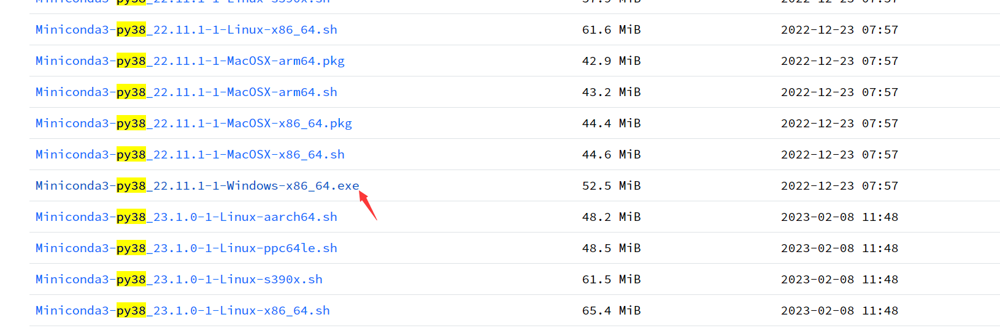
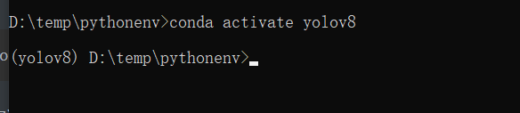
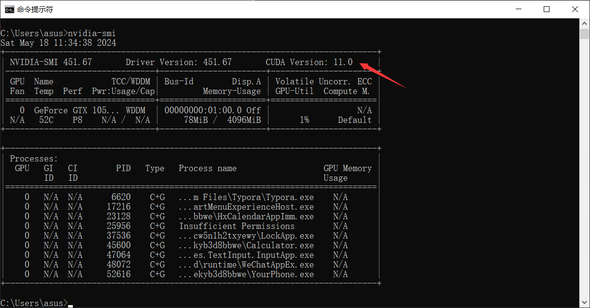
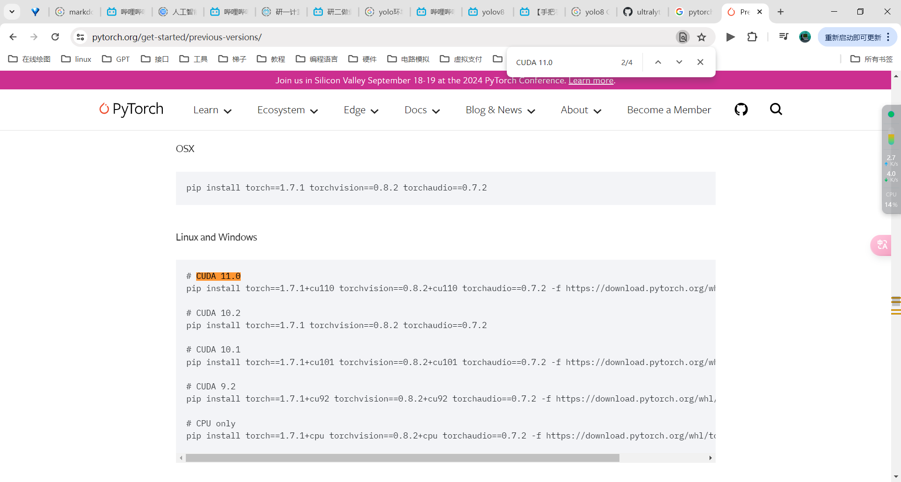
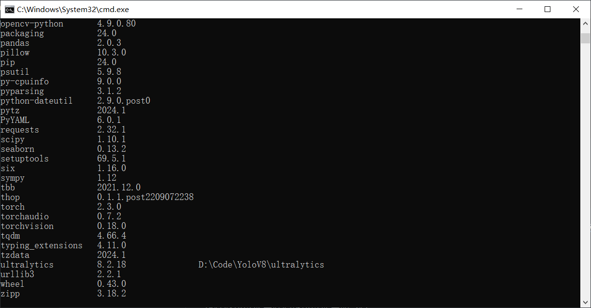

# 安装miniconda

找到[地址](https://mirrors.tuna.tsinghua.edu.cn/anaconda/miniconda/), 下载对应版本, 我这里选择Windows 以及 python3.8



下载后安装, 记得勾选添加到环境变量, 这样就能在控制台使用conda

# 创建yolov8虚拟环境


```
conda create -n yolov8 python=3.8 
```

激活和退出

```
conda activate yolov8  
conda deactivate
```




# 安装pytorch

首先先激活使用虚拟环境

```
conda activate yolov8  
```

找到显卡版本

```
navidia-smi
```



安装pytorch

去官网搜索找到自己对应的版 我这里是11.0



```
pip install torch==1.7.1+cu110 torchvision==0.8.2+cu110 torchaudio==0.7.2 -f https://download.pytorch.org/whl/torch_stable.html
```

# 安装yolov8

## pip直接安装

这种安装方式无法修改源码, 不推荐

```
pip install ultralytics
```

然后可以命令行使用它, 也能在代码中import它

```
yolo predict model=yolov8n.pt source='https://ultralytics.com/images/bus.jpg'
```

这里就不使用这种方式安装, 就卸载掉

```
pip uninstall ultralytics
```

## pip源码安装

使用git将源码克隆下来, 也可以下载压缩包

```
git clone https://github.com/ultralytics/ultralytics.git
```

然后进入目录

```
cd ultralytics
```

执行下面命令安装, 这样做的目的是更改库源码目录到这里, 然后我们修改了这里的源码, 就会对其他引用yolo库目录的项目起作用

```
pip install -e .
```

> 这样既可以使用源码也可以使用命令行

使用pip list 就能查看了



这里显示ultralytics库在我们自己的目录下