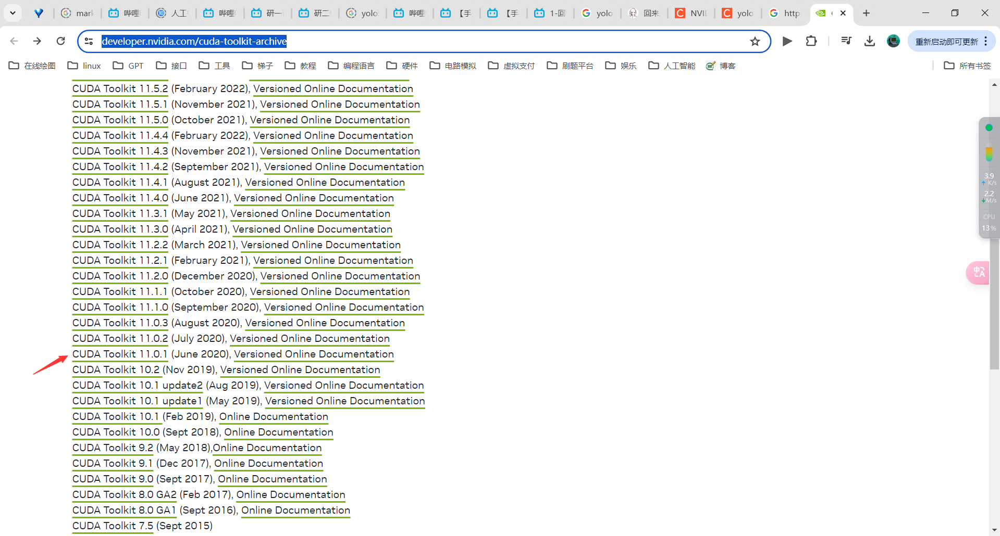
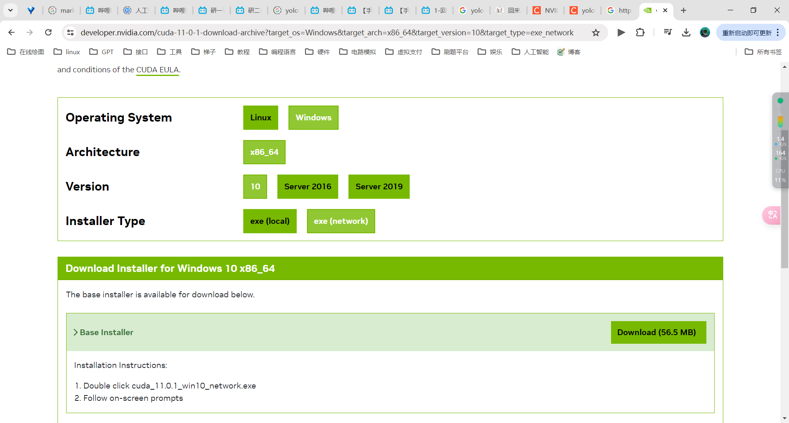
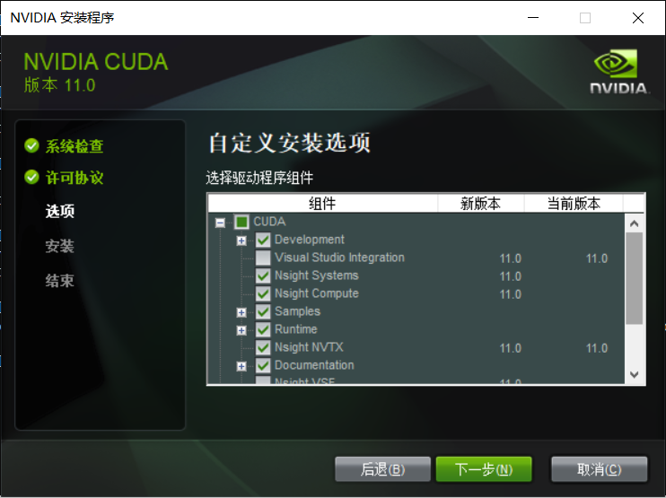
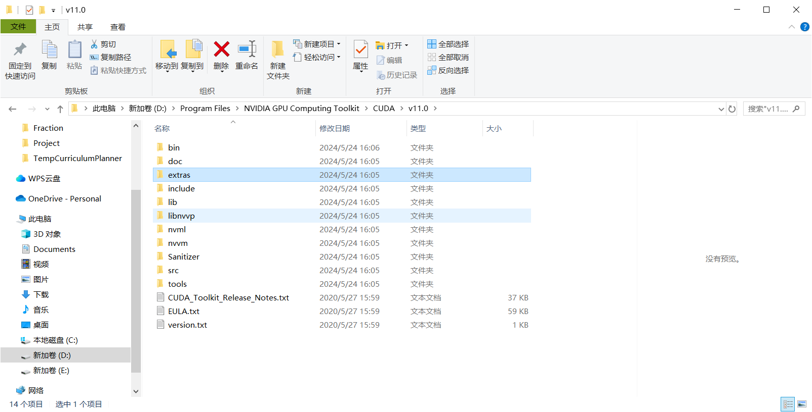
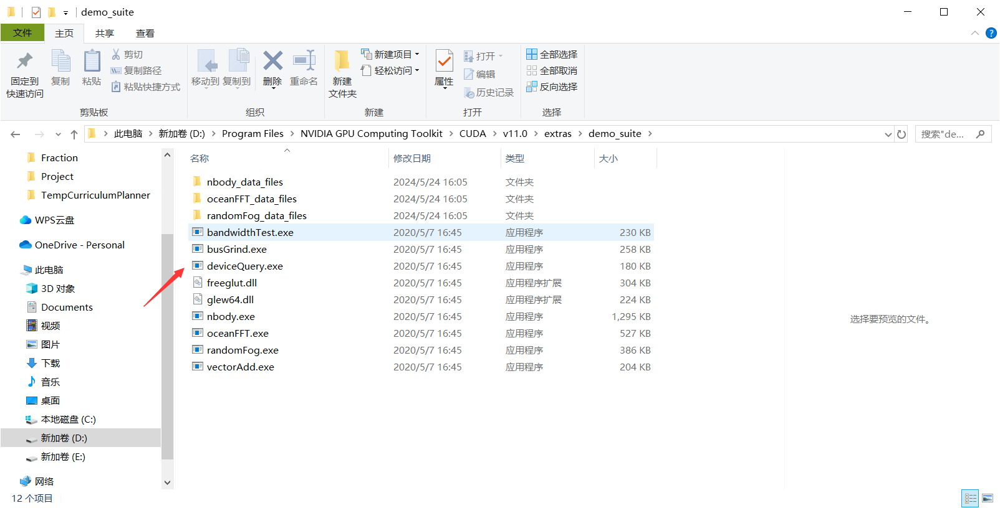
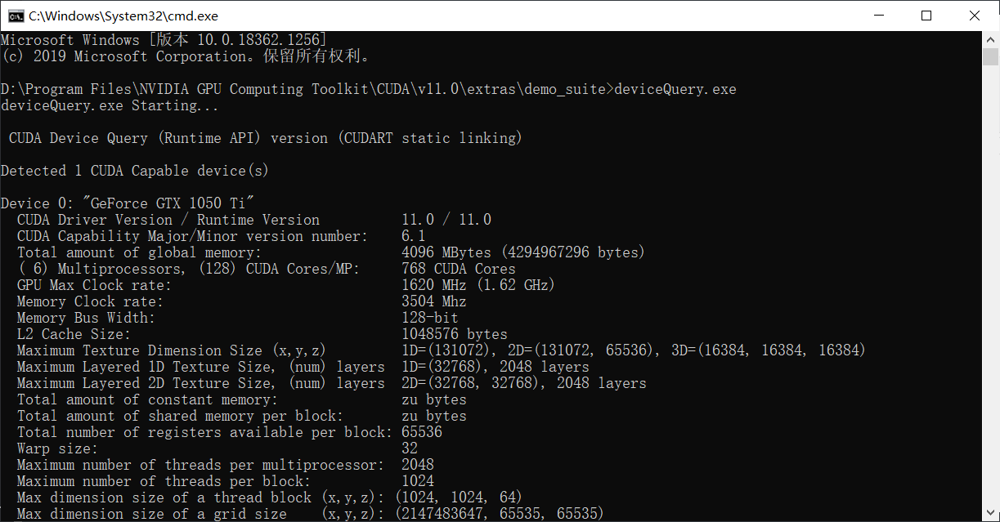

# 安装miniconda

找到[地址](https://mirrors.tuna.tsinghua.edu.cn/anaconda/miniconda/), 下载对应版本, 我这里选择Windows 以及 python3.8


下载后安装, 记得勾选添加到环境变量, 这样就能在控制台使用conda

# 创建yolov8虚拟环境


```
conda create -n yolov8 python=3.9
```

激活和退出

```
conda activate yolov8  
conda deactivate
```


# 安装pytorch

首先先激活使用虚拟环境

```
conda activate yolov8  
```

找到显卡版本

```
navidia-smi
```


安装pytorch

去[官网](https://pytorch.org/get-started/previous-versions/)搜索找到自己对应的版 我这里是11.0


```
pip install torch==1.7.1+cu110 torchvision==0.8.2+cu110 torchaudio==0.7.2 -f https://download.pytorch.org/whl/torch_stable.html
```

# 安装yolov8

## pip直接安装

这种安装方式无法修改源码, 不推荐

```
pip install ultralytics
```

然后可以命令行使用它, 也能在代码中import它

```
yolo predict model=yolov8n.pt source='https://ultralytics.com/images/bus.jpg'
```

这里就不使用这种方式安装, 就卸载掉

```
pip uninstall ultralytics
```

## pip源码安装

使用git将源码克隆下来, 也可以下载压缩包

```
git clone https://github.com/ultralytics/ultralytics.git
```

然后进入目录

```
cd ultralytics
```

执行下面命令安装, 这样做的目的是更改库源码目录到这里, 然后我们修改了这里的源码, 就会对其他引用yolo库目录的项目起作用

```
pip install -e .
```

> 这样既可以使用源码也可以使用命令行

使用pip list 就能查看了


这里显示ultralytics库在我们自己的目录下

# 安装cuda

如果我们想要显卡来跑项目, 就需要安装cude,  去到这个[地址](https://developer.nvidia.com/cuda-toolkit-archive), 根据前面自己的显卡版本选择cuda版本



找到里面的本地安装吧, 感觉好一点



然后进入界面安装即可, 但是网上说这里有个问题, 可以去看看, [地址](https://blog.csdn.net/weixin_43062964/article/details/127888350), 是跟vs一些相关的,  如果安装过了vs系列桌面开发环境的应该就没什么,  取消勾选这两个



安装完成后建议重启电脑, windows这个傻逼控制台有时候不能及时更新环境变量

检测是否安装成功(这个检测并不准确)

```
nvcc -V
```

我们只需要去到安装目录查看是否有这些东西



进入extra/demo_suite , 然后再控制台运行这个程序





这样就安装成功了

# 安装CUDNN


# yolo使用GPU

通过下面代码可以看是否能够检测到GPU

```python
import torch

# 检查 CUDA 是否可用
cuda_available = torch.cuda.is_available()
print(f"CUDA available: {cuda_available}")

# 获取 GPU 的数量
cuda_device_count = torch.cuda.device_count()
print(f"CUDA device count: {cuda_device_count}")

# 如果有可用的 GPU，打印每个 GPU 的名称
if cuda_device_count > 0:
    for i in range(cuda_device_count):
        print(f"CUDA device {i}: {torch.cuda.get_device_name(i)}")
else:
    print("No CUDA device detected.")

```

如果检测不到,  可能是torch的一些问题, 需要使用对的版本, 我也是更新后才能检测到的

```
pip install torch torchvision torchaudio --index-url https://download.pytorch.org/whl/cu110
```

使用GPU来跑

```
from ultralytics import YOLO
import torch

# 检查是否有可用的 GPU
device = torch.device('cuda' if torch.cuda.is_available() else 'cpu')
print(f"Using device: {device}")

# 加载模型并将其移动到 GPU（如果有的话）
model = YOLO('yolov8n.pt').to(device)

# 训练模型，指定数据配置文件，并设置使用 GPU
model.train(data='data.yaml', workers=0, epochs=20, batch=8, device=device)

```

# 参考文档

1. https://blog.csdn.net/weixin_43062964/article/details/127888350  
2. https://blog.csdn.net/qq_53817374/article/details/135854702
3. 