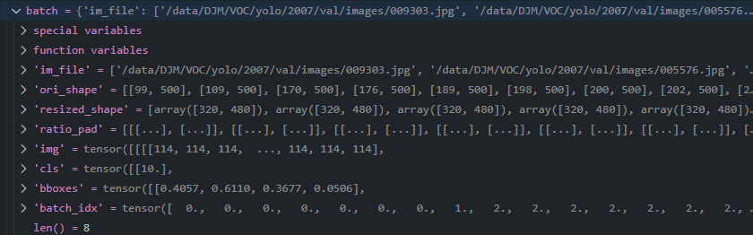
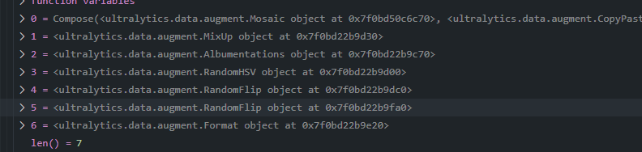
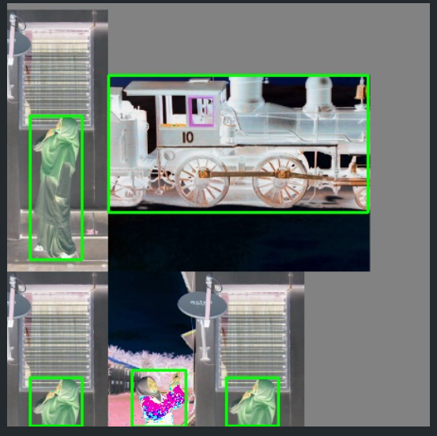
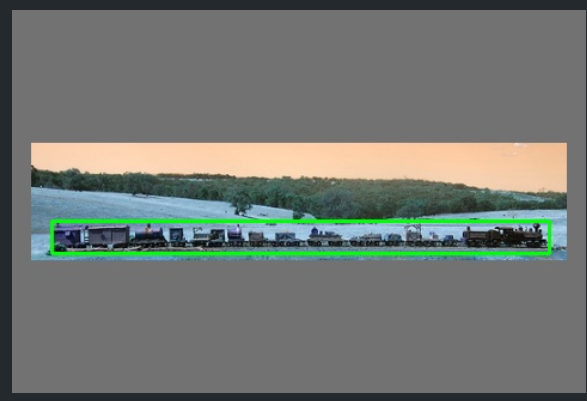
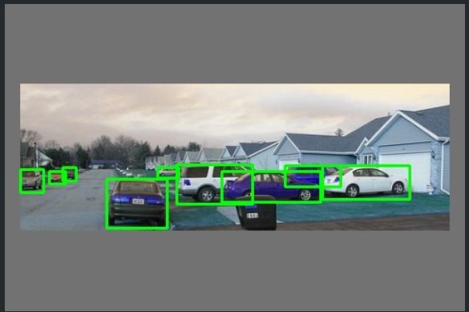

> 本文是结合yolov8及其以后的框架做的总结


# 数据集构建规则

1. 必须使用中心点加宽高模式, 而且必须都归一化, 所有值必须大于等于0

```python
assert lb.shape[1] == 5, f"labels require 5 columns, {lb.shape[1]} columns detected"
points = lb[:, 1:]
assert points.max() <= 1, f"non-normalized or out of bounds coordinates {points[points > 1]}"
assert lb.min() >= 0, f"negative label values {lb[lb < 0]}"
```


# 数据集yaml编写规则

yolo的数据集加载类是LoadImagesAndLabels, 他搜索数据的方式如下:

1. 从所给目录拿到这个目录及其子目录下的所有文件

2. 然后进行筛选, 只保留图片文件

3. 根据图片文件搜索图片对应的标签文件, 方式很简单 **替换图片路径中最后一个 images 为 lables**

   代码如下:

   ```python
    sa, sb = f"{os.sep}images{os.sep}", f"{os.sep}labels{os.sep}"  # /images/, /labels/ substrings
    return [sb.join(x.rsplit(sa, 1)).rsplit(".", 1)[0] + ".txt" for x in img_paths]
   ```

根据这个规则, 我们其实就很容易搞懂怎么存放标签和图片, 只要标签和图片路径最后一个images和labels不同就行

比如: /images/a/b/c 和 /labels/a/b/c 可以, /a/b/c/images 和 /a/b/c/images 也可以, 这样就满足了大家喜欢的两种布局, 真的很巧妙


# 模型构建

根据模型yaml文件动态搭建,  源码如下:

```python
def parse_model(d, ch):
    """Parses a YOLOv5 model from a dict `d`, configuring layers based on input channels `ch` and model architecture."""
    LOGGER.info(f"\n{'':>3}{'from':>18}{'n':>3}{'params':>10}  {'module':<40}{'arguments':<30}")
    anchors, nc, gd, gw, act, ch_mul = (
        d["anchors"],
        d["nc"],
        d["depth_multiple"],
        d["width_multiple"],
        d.get("activation"),
        d.get("channel_multiple"),
    )
    if act:
        Conv.default_act = eval(act)  # redefine default activation, i.e. Conv.default_act = nn.SiLU()
        LOGGER.info(f"{colorstr('activation:')} {act}")  # print
    if not ch_mul:
        ch_mul = 8
    na = (len(anchors[0]) // 2) if isinstance(anchors, list) else anchors  # number of anchors
    no = na * (nc + 5)  # number of outputs = anchors * (classes + 5)

    layers, save, c2 = [], [], ch[-1]  # layers, savelist, ch out
    for i, (f, n, m, args) in enumerate(d["backbone"] + d["head"]):  # from, number, module, args
        m = eval(m) if isinstance(m, str) else m  # eval strings
        for j, a in enumerate(args):
            with contextlib.suppress(NameError):
                args[j] = eval(a) if isinstance(a, str) else a  # eval strings

        n = n_ = max(round(n * gd), 1) if n > 1 else n  # depth gain
        if m in {
            Conv,
            GhostConv,
            Bottleneck,
            GhostBottleneck,
            SPP,
            SPPF,
            DWConv,
            MixConv2d,
            Focus,
            CrossConv,
            BottleneckCSP,
            C3,
            C3TR,
            C3SPP,
            C3Ghost,
            nn.ConvTranspose2d,
            DWConvTranspose2d,
            C3x,
        }:
            c1, c2 = ch[f], args[0]
            if c2 != no:  # if not output, 保证输出通道数是ch_mul的倍数
                c2 = make_divisible(c2 * gw, ch_mul)

            args = [c1, c2, *args[1:]]
            if m in {BottleneckCSP, C3, C3TR, C3Ghost, C3x}:
                args.insert(2, n)  # number of repeats
                n = 1
        elif m is nn.BatchNorm2d:
            args = [ch[f]]
        elif m is Concat:
            c2 = sum(ch[x] for x in f)
        # TODO: channel, gw, gd
        elif m in {Detect, Segment}:
            args.append([ch[x] for x in f])
            if isinstance(args[1], int):  # number of anchors
                args[1] = [list(range(args[1] * 2))] * len(f)
            if m is Segment:
                args[3] = make_divisible(args[3] * gw, ch_mul)
        elif m is Contract:
            c2 = ch[f] * args[0] ** 2
        elif m is Expand:
            c2 = ch[f] // args[0] ** 2
        else:
            c2 = ch[f]

        m_ = nn.Sequential(*(m(*args) for _ in range(n))) if n > 1 else m(*args)  # module
        t = str(m)[8:-2].replace("__main__.", "")  # module type
        np = sum(x.numel() for x in m_.parameters())  # number params
        m_.i, m_.f, m_.type, m_.np = i, f, t, np  # attach index, 'from' index, type, number params
        LOGGER.info(f"{i:>3}{str(f):>18}{n_:>3}{np:10.0f}  {t:<40}{str(args):<30}")  # print
        save.extend(x % i for x in ([f] if isinstance(f, int) else f) if x != -1)  # append to savelist
        layers.append(m_)
        if i == 0:
            ch = []
        ch.append(c2)
    return nn.Sequential(*layers), sorted(save)
```

这个东西确实好, 比起我们用代码构建模型方便太多了

在模型训练过程中, 会记录每一层输出的东西, 如果某一层的来源有多个个, 就需要在上一层的时候就使用concat进行连接, 前向传播源码如下

```python
def _forward_once(self, x, profile=False, visualize=False):
        """Performs a forward pass on the YOLOv5 model, enabling profiling and feature visualization options."""
        y, dt = [], []  # outputs
        for m in self.model:
            if m.f != -1:  # if not from previous layer
                x = y[m.f] if isinstance(m.f, int) else [x if j == -1 else y[j] for j in m.f]  # from earlier layers, 如果有多层就使用多层数据, 这样下面的时候就必须使用concat, m就必须是concat, 或者在这里就concat
            if profile:
                self._profile_one_layer(m, x, dt)
            x = m(x)  # run
            y.append(x if m.i in self.save else None)  # save output
            if visualize:
                feature_visualization(x, m.type, m.i, save_dir=visualize)
        return x
```


# 缓存

yolo提供了 cache这个选项, 有三种: 

1. ram 在dataset里面一次将图片全部加载到内存中, 这种在使用的时候是最快的
2. disk 会在图片路径下创建同名的.npy文件, 需要的时候就是加载这个文件了, 这个文件是经过了处理图片后的numpy数组格式, 加载的时候更快
3. 不使用--cache, 每次使用图片的时候都从磁盘加载图片

有时候我们有疑惑, 为什么训练的时候三种速度一样?

**因为图片加载速度高于GPU训练速度**, 这个就要归功于pytorch的DataLoader了, 他会启用多个工作进程, 在GPU训练的时候,每个进程加载2*batch_size(可以自己设置)个数据到缓存队列中, 如果数据不大, 加载速度就可能快于GPU训练速度, 所以需要用的时候数据已经在内存了, 这样的话, 三个就没有区别

# 衡量标准计算

模型的好坏一般有些评判标准, 精度, 召回率, f1分数, AP, mAP(50, 50-95)

AP 是指 一个类别的平均精度, 是通过在一个Iou阈值下, 不同置信度产生的精度和召回率曲线与坐标轴围成的面积

mAP 就是指所有类别的平均了, mAP50 指 Iou为0.5的情况下, mAP的值,  mAP50-95 是指Iou 从0.5-0.95的mAP的平均值

Iou越大, 说明对于检测越加严格, 同样置信度越大, 也越严格


yolo中mAP计算步骤:

1. 首先根据不同的iou阈值得到预测框是否正确, 得到一个tp数组维度通常是(N, 10), N代表预测框数量, 10代表不同iou(0.5:0.95)
2. 然后根据预测框的置信度排序, 置信度大的在前面, 这里是为了快速得到不同置信度下tp和fp的框有多少, 如果在置信度大的时候,tp都为true, 那么置信度小的时候也会为true
3. 根据置信度的从大到小的变化, 我们能得到不同的精确度和召回率, 然后通过插值函数就能得到AP了

超参数设置

# 展示图片和目标框

## 方式1 编写函数

### 展示一张图片

```python
import os
import cv2
import numpy as np
from pathlib import Path


def show_one_image_with_boxes(image_path, box_format="xywh", normalized=True, box_color=(0, 255, 0), thickness=2):
    """
    展示图片及其目标框。

    参数:
        image_path (str): 图片文件路径。
        box_format (str): 目标框格式，支持 'xyxy' 或 'xywh'。
        normalized (bool): 目标框是否归一化。
        box_color (tuple): 目标框颜色，默认绿色 (BGR格式)。
        thickness (int): 目标框线条粗细。
    """
    # 1. 检查图片路径是否存在
    if not os.path.exists(image_path):
        raise FileNotFoundError(f"图片文件不存在: {image_path}")

    # 2. 推断目标框路径（将 'images' 替换为 'labels'）
    label_path = image_path.replace("images", "labels").replace(".jpg", ".txt").replace(".png", ".txt")
    if not os.path.exists(label_path):
        raise FileNotFoundError(f"目标框文件不存在: {label_path}")

    # 3. 读取图片
    image = cv2.imread(image_path)
    if image is None:
        raise ValueError(f"无法读取图片: {image_path}")
    image_height, image_width, _ = image.shape

    # 4. 读取目标框
    with open(label_path, "r") as f:
        lines = f.readlines()
    boxes = []
    for line in lines:
        parts = line.strip().split()
        if len(parts) < 4:
            continue  # 忽略无效行
        # 提取目标框坐标
        if box_format == "xyxy":
            x1, y1, x2, y2 = map(float, parts[1:5])
        elif box_format == "xywh":
            cx, cy, w, h = map(float, parts[1:5])
            x1 = cx - w / 2
            y1 = cy - h / 2
            x2 = cx + w / 2
            y2 = cy + h / 2
        else:
            raise ValueError(f"不支持的目标框格式: {box_format}")

        # 如果目标框是归一化的，反归一化
        if normalized:
            x1 *= image_width
            y1 *= image_height
            x2 *= image_width
            y2 *= image_height

        boxes.append((int(x1), int(y1), int(x2), int(y2)))

    # 5. 在图片上绘制目标框
    for box in boxes:
        x1, y1, x2, y2 = box
        cv2.rectangle(image, (x1, y1), (x2, y2), box_color, thickness)

    # 6. 展示图片
    cv2.imshow("Image with Boxes", image)
    cv2.waitKey(0)
    cv2.destroyAllWindows()


```

### 展示目录图片

```python
def show_dir_images_with_labels(
    image_dir: str,
    label_dir: str = "labels",
    names: dict = None,
    show_labels: bool = True,
    color: tuple = (0, 255, 0),  # BGR 格式
    thickness: int = 2,
    font_scale: float = 0.6,
    wait_key: int = 0,
    image_extensions: tuple = (".jpg", ".jpeg", ".png", ".bmp"),
):
    """
    逐张显示图片及其标注框（关闭当前窗口后显示下一张）

    参数：
    - image_dir: 包含图片的目录路径
    - label_dir: 标注文件目录（默认与图片目录同级）
    - names: 类别名称字典 {id: name}
    - show_labels: 是否显示类别标签
    - color: 标注框颜色 (BGR)
    - thickness: 框线粗细
    - font_scale: 标签字体大小
    - wait_key: 窗口等待时间（毫秒，0=等待按键）
    - image_extensions: 支持的图片格式
    """
    # 构建完整label路径
    image_path = Path(image_dir)
    label_path = image_path.parent / label_dir

    # 获取所有图片文件
    image_files = sorted([f for f in image_path.glob("*") if f.suffix.lower() in image_extensions])

    print(f"Found {len(image_files)} images to visualize")

    for img_file in image_files:
        # 获取对应的label文件
        label_file = label_path / f"{img_file.stem}.txt"

        # 检查label文件是否存在
        if not label_file.exists():
            print(f"⚠️ Label file not found: {label_file}")
            continue

        # 读取图片
        img = cv2.imread(str(img_file))
        if img is None:
            print(f"❌ Failed to read image: {img_file}")
            continue

        # 获取图片尺寸
        img_h, img_w = img.shape[:2]

        # 读取标注信息
        with open(label_file, "r") as f:
            lines = f.readlines()

        # 解析标注数据
        for line in lines:
            parts = line.strip().split()
            if len(parts) < 5:
                print(f"⚠️ Invalid annotation in {label_file}: {line}")
                continue

            # 解析类别和坐标（支持带置信度的格式）
            cls_id = int(parts[0])
            x_center = float(parts[1]) * img_w
            y_center = float(parts[2]) * img_h
            width = float(parts[3]) * img_w
            height = float(parts[4]) * img_h

            # 转换为xyxy坐标
            x1 = int(x_center - width / 2)
            y1 = int(y_center - height / 2)
            x2 = int(x_center + width / 2)
            y2 = int(y_center + height / 2)

            # 绘制边界框
            cv2.rectangle(img, (x1, y1), (x2, y2), color, thickness)

            # 添加类别标签
            if show_labels:
                label = str(names[cls_id]) if names else str(cls_id)
                (tw, th), _ = cv2.getTextSize(label, cv2.FONT_HERSHEY_SIMPLEX, font_scale, 1)

                # 标签背景
                cv2.rectangle(img, (x1, y1 - th - 5), (x1 + tw, y1 - 2), color, -1)
                # 标签文字
                cv2.putText(img, label, (x1, y1 - 7), cv2.FONT_HERSHEY_SIMPLEX, font_scale, (255, 255, 255), 1)

        # 显示图片
        winname = f"Preview - {img_file.name}"
        cv2.imshow(winname, img)
        cv2.waitKey(wait_key)
        cv2.destroyWindow(winname)

```


## 方式二(调试过程使用)

使用yolo自带的方法

```python
from ultralytics.utils.plotting import plot_images


# 直接调用plot_images函数
def plot_batch(batch_data):
    plot_images(
        images=batch_data["img"],  # [1,3,H,W] uint8 tensor
        batch_idx=batch_data["batch_idx"].clone().cpu().numpy(),  # [2,] numpy数组
        cls=batch_data["cls"].flatten().clone().cpu().numpy(),  # [2,] numpy数组
        bboxes=batch_data["bboxes"],  # 转换到xyxy格式 (函数内部会处理归一化)
        paths=list(batch_data["im_file"]),  # 图像路径列表
        fname="debug_batch_visualization.jpg",
        save=True,
    )

```

使用自定义的方法

```python
import cv2
def save_image_with_boxes(
    image,  # 输入的图片（可以是归一化或未归一化的）
    boxes,  # 边界框参数列表（每个框的格式由 mode 决定）
    output_path="image1.jpg",  # 输出文件路径
    mode="xywh",  # 边界框模式：'xyxy' 或 'xywh'
    box_colors=None,  # 边界框颜色列表（BGR格式，默认绿色）
    thickness=2,  # 边界框线条粗细
    normalized=True,  # 边界框参数是否归一化
):
    """
    将图片和多个指定的边界框写入文件中。

    参数:
        image: 输入的图片（可以是归一化或未归一化的）。
        output_path: 输出文件路径。
        mode: 边界框模式，支持 'xyxy' 或 'xywh'。
        boxes: 边界框参数列表，每个框的格式由 mode 决定。
        box_colors: 边界框颜色列表（BGR格式，默认绿色）。
        thickness: 边界框线条粗细（默认2）。
        normalized: 边界框参数是否归一化（默认False）。
    """

    image = image.clone().cpu().numpy()

    # 如果图片的值在 [0, 1] 范围内，将其缩放到 [0, 255]
    image = (image * 255).astype(np.uint8)

    # 将通道顺序从 (C, H, W) 转换为 (H, W, C)
    image = np.transpose(image, (1, 2, 0))

    image = np.ascontiguousarray(image)

    # 获取图片的高度和宽度
    height, width = image.shape[:2]

    # 如果没有指定颜色，默认使用绿色
    if box_colors is None:
        box_colors = [(0, 255, 0)] * len(boxes)

    # 确保颜色列表长度与边界框数量一致
    if len(box_colors) != len(boxes):
        raise ValueError("box_colors 的长度必须与 boxes 的长度一致")

    # 遍历所有边界框并绘制
    for box, color in zip(boxes, box_colors):
        if mode == "xyxy":
            if normalized:
                # 将归一化的 xyxy 转换为绝对坐标
                x1, y1, x2, y2 = box
                x1, y1, x2, y2 = int(x1 * width), int(y1 * height), int(x2 * width), int(y2 * height)
            else:
                # 直接使用绝对坐标
                x1, y1, x2, y2 = map(int, box)
        elif mode == "xywh":
            if normalized:
                # 将归一化的 xywh 转换为绝对坐标
                cx, cy, w, h = box
                x1 = int((cx - w / 2) * width)
                y1 = int((cy - h / 2) * height)
                x2 = int((cx + w / 2) * width)
                y2 = int((cy + h / 2) * height)
            else:
                # 直接使用绝对坐标
                cx, cy, w, h = box
                x1 = int(cx - w / 2)
                y1 = int(cy - h / 2)
                x2 = int(cx + w / 2)
                y2 = int(cy + h / 2)
        else:
            raise ValueError("mode 必须是 'xyxy' 或 'xywh'")

        # 在图片上绘制边界框
        cv2.rectangle(image, (x1, y1), (x2, y2), color, thickness)

    # 保存图片
    cv2.imwrite(output_path, image)
    print(f"图片已保存到 {output_path}")
```

# 几个关键点的数据格式(默认)

如果我们想尽可能多的利用yolo框架提供的东西, 我们就需要知道我们应该传什么样的数据给yolo, 以及yolo给我们什么样的数据

## 模型输入

### 数据增强

yolo经过数据增强这些东西后, 会将数据变成一个字典, 我们来看看字典信息



1. im_file 代表图片地址
2. ori_shape 代表原始图片大小
3. resized_shape 代表resize之后的大小  (resize的操作是: 将最大边先满足要求, 然后小边跟着缩放, 是**等比缩放**, 然后再进行填充, 达到所需大小)
4. ratio_pad 是填充的比例
5. img 是图片原始数据
6. cls 和 bboxes, batch_idx要组合来看,  当前box属于那个batch也就是哪个图片, 以及他的类别是什么

> 图片resize之后, 目标框也被resize到符合要求的

### 取消数据增强

我们可以通过设置一些超参数来取消数据增强

```python
model.train(
        augment=False,
        hsv_h=0.0,
        hsv_s=0.0,
        hsv_v=0.0,
        degrees=0.0,
        translate=0.0,
        scale=0.0,
        shear=0.0,
        perspective=0.0,
        flipud=0.0,
        fliplr=0.0,
        mosaic=0.0,
        mixup=0.0,
        copy_paste=0.0,
    )
```


### 训练阶段

训练阶段, yolo会采取几种数据增强的方法, 使得我们的图片以及目标框跟原始并不一样



我们可以通过调试查看经过数据增强后的图片是什么样的



### 预测阶段

预测阶段采用的是rect模式, 没有采用数据增强, 关于rect模式就是通过**按宽高比分组**和**减少填充**来优化计算效率和内存占用,将宽高比相似的图片分为一组






## nms输入

对于yolo里面nms的输入, 她要求的格式是 [batch, num_classes+4, num_boxes] 这里的num_classes 代表类别数量, 其里面数值的具体含义是置信度(是我们通常理解的目标框置信度和分类置信度的组合), 4代表预测框的中心点+宽高,  而且**预测框的大小必须是没有归一化的数据**(这涉及到后面的map计算)

# resume训练

这个简单, 定义模型的时候传入中断训练的last.pt文件, 然后train的时候带上resume=True,  **注意一定要传last.pt文件, 否则就无效**

# 自定义模型

我的想法就是: 我以后肯定要接触很多其他模型, 以及我自己可能有一些想法啊要做实验啥的,  我不可能每次都手动去搭建整个框架, 比如数据加载啊, 训练啊这些, 我希望我只需要完成我的模型, 损失函数计算即可. 所以我们只需要结合上一个章节的记住关键点数据我们只需要传这些数据给yolo框架就行

## 基于yaml

这种方法网上有大把教程, 我这里提一嘴就是为了说明, 有时候基于yaml是无法完成我想要的效果的, 比如我想修改损失函数, 再比如我在中间层可能还有一些其他想法等等,  当然我们也可以结合这个方法和后面方法

## 继承关键类

我们只需要继承几个关键类并且实现几个关键方法, 几个属性即可

**这里需要提一嘴, 这些类中都贯穿了一个args属性或者说参数, 他就是整个yolo框架可以指定的参数,  他是cfg 和 overrides 的组合, 一般cfg是系统默认参数, 而overrides是我们指定的, 而且overrides优先级高于cfg**

### Model类

这个类是给用户使用的一个接口, 能够完成训练, 验证, 预测, 是所有功能的集大成者

```python
from ultralytics.engine.model import Model
class Yolov1(Model):
    # model是告诉使用什么模型, 可以是yaml文件, 也可以是.pt文件
    # task是告诉模型做什么任务, 和后面的tesk_map联动
    # verbose是构建模型过程中是否输出结果
    def __init__(self, model: str = "yolov1.yaml", task: str = None, verbose: bool = False) -> None:
        super().__init__(model, task, verbose)

    @property
    def task_map(self):
        """Map head to model, trainer, validator, and predictor classes."""
        return {
            "detect": {
                "model": Yolov1Model,
                "trainer": YoloV1Trainer,
                "predictor": Yolov1Predictor,
                "validator": Yolov1Validator,
            }
        }
```

光看这个代码是不是觉得我们要使用yolo框架实现自定义模型是不是非常简单, 没错!!!

我们再看看Model类内部干了什么事情吧

```python
def __init__(
        self,
        model: Union[str, Path] = "yolov8n.pt",
        task: str = None,
        verbose: bool = False,
    ) -> None:
    self.callbacks = callbacks.get_default_callbacks()  # 回调函数, 在模型关键点地方执行函数
    self.predictor = None  # reuse predictor  预测器
    self.model = None  # model object 模型
    self.trainer = None  # trainer object 训练器
    self.ckpt = None  # if loaded from *.pt  如果model是.pt文件加载过来,模型的参数就保留在这
    self.cfg = None  # if loaded from *.yaml 如果是yaml文件加载的模型, yaml文件就保留在这
    self.ckpt_path = None 
    self.overrides = {}  # overrides for trainer object  额外参数保留的点
    self.metrics = None  # validation/training metrics  记录指标
    self.session = None  # HUB session  是否是hub里面的模型
    self.task = task  # task type  模型是做什么任务的
    model = str(model).strip()   
	
    # 如果是hub里面的模型就下载
    # Check if Ultralytics HUB model from https://hub.ultralytics.com
    if self.is_hub_model(model):
        # Fetch model from HUB
        checks.check_requirements("hub-sdk>=0.0.12")
        session = HUBTrainingSession.create_session(model)
        model = session.model_file
        if session.train_args:  # training sent from HUB
            self.session = session

    # Check if Triton Server model
    elif self.is_triton_model(model):
        self.model_name = self.model = model
        return

    # Load or create new YOLO model
    if Path(model).suffix in {".yaml", ".yml"}:
        self._new(model, task=task, verbose=verbose)
    else:
        self._load(model, task=task)
```

我们发现init里面主要就是干了把模型加载进来, 但是后续还会加载一遍模型, 这里加载模型, 如果是yaml文件作为模型的话, 这里的_new是一点意义没有的, 如果是.pt文件的话, 就是为了把模型参数加载进来

根据我们刚刚定义的task_map里面就可以看到我们需要实现哪几个类了

* model
* trainer
* validator 
* predictor (非必须)

### BaseModel

这里是定义我们网络结构的地方, 当然我们这里也可以直接使用yolo的模型结合yaml文件来定义, 不过如果我们的网络很简单, 我觉得还是自己搭建比较方便

需要完成的几个点

* yaml属性必须实现而且还必须用这条语句
* stride需要指定, 网络下采样倍数
* model 必须指定, 实际就是我们的模型
* save 必须指定, 可以为空
* for循环的东西也不能省, 他和上面这个是联动的, 主要是用于yaml构建网络使用, 我们可以指定一些空的
* init_criterion函数必须实现, 里面返回损失函数

> 需要注意的是, 模型的输出格式要和后续计算损失, 验证这些要对的上

```python
from ultralytics.nn.tasks import BaseModel

from ultralytics.utils.torch_utils import initialize_weights

from ultralytics.utils import LOGGER


from ultralytics.nn.tasks import yaml_model_load

import torch

from torch import nn

class Yolov1Model(BaseModel):
    def __init__(self, cfg="yolov1.yaml", nc=80, verbose=True):  # model, input channels, number of classes
        super().__init__()
        self.yaml = cfg if isinstance(cfg, dict) else yaml_model_load(cfg)  # 这里的yaml属性必须要实现

        self.backboneNames = self.yaml["backbone"]

        self.stride = torch.Tensor([32])

        self.backbone = build_backbone(self.backboneNames, [3])
        feat_dim = self.backbone.feat_dim

        self.head = nn.Conv2d(feat_dim, nc + 4 + 1, 1)

        self.model = nn.Sequential(self.backbone, self.head, nn.Sigmoid())

        self.save = []
        for i, m in enumerate(self.model):
            m.i = i
            m.f = -1

        self.C = nc

        initialize_weights(self)
        if verbose:
            self.info()
            LOGGER.info("")

    def init_criterion(self):
        return Yolov1Loss(self, self.C)
```

### Loss类

既然上面出现了loss, 我们就干脆在这里讲了, loss我们可以完全自己实现,  因为模型的输出格式是我们定的, 我们想怎么算怎么算, 不需要具体实现什么, 但是返回值是有说法的, 第一个是loss总值, 第二个就是后面trainer里面我们指定各个loss的名字对应的值了

需要实现

* \__call__方法

```python
class Yolov1Loss:
    def __init__(self, model, C=20, lambda_coord=5, lambda_noobj=0.5):
        device = next(model.parameters()).device
        self.device = device
        self.criterion_mse = nn.MSELoss()
        self.criterion_ce = nn.CrossEntropyLoss()
        self.C = C
        self.lambda_coord = lambda_coord  # 坐标损失权重
        self.lambda_noobj = lambda_noobj  # 无目标损失权重

    def process(self, targets, batch_size, grid):
        process_targets = torch.zeros((batch_size, grid[0], grid[1], 5 + self.C), device="cpu")
        bboxes = targets["bboxes"]
        cls = targets["cls"]
        for i, batch_idx in enumerate(targets["batch_idx"]):
            batch_idx = int(batch_idx)
            x, y, w, h = bboxes[i]
            c = int(cls[i])
            grid_x, grid_y = int(x * grid[1]), int(y * grid[0])
            x = x * grid[1] - grid_x
            y = y * grid[0] - grid_y
            process_targets[batch_idx, grid_y, grid_x, :5] = torch.tensor([x, y, w, h, 1])
            process_targets[batch_idx, grid_y, grid_x, 5 + c] = 1
        process_targets = process_targets.to(self.device)
        return process_targets

    def __call__(self, preds, batch):
        preds = preds.permute(0, 2, 3, 1).contiguous()
        batch_size = preds.shape[0]
        grid = (preds.shape[1], preds.shape[2])
        target = self.process(batch, batch_size=batch_size, grid=grid)
        # 分离预测结果
        pred_bbox = preds[..., :5]  # x, y, w, h, confidence
        pred_class = preds[..., 5:]  # 分类部分

        # 分离真实值
        target_bbox = target[..., :5]  # x, y, w, h, confidence
        target_class = target[..., 5:]  # 分类部分

        # 存在目标的掩码
        obj_mask = target[..., 4] > 0  # 目标掩码
        noobj_mask = target[..., 4] == 0  # 无目标掩码

        # 坐标损失（仅对有目标的网格计算）
        coord_loss = self.lambda_coord * self.criterion_mse(pred_bbox[obj_mask][..., :4], target_bbox[obj_mask][..., :4])

        # 置信度损失
        confidence_loss_obj = self.criterion_mse(pred_bbox[obj_mask][..., 4], target_bbox[obj_mask][..., 4])
        confidence_loss_noobj = self.lambda_noobj * self.criterion_mse(pred_bbox[noobj_mask][..., 4], target_bbox[noobj_mask][..., 4])

        # 分类损失（仅对有目标的网格计算）
        class_loss = self.criterion_mse(pred_class[obj_mask], target_class[obj_mask])

        # 总损失
        loss = coord_loss + confidence_loss_obj + confidence_loss_noobj + class_loss
        return loss, torch.tensor(
            [coord_loss.item(), class_loss.item(), confidence_loss_obj.item()],
            device=self.device,
        )
```


### DetectionTrainer

这个就是我们的训练器, 里面有些训练的东西, 什么优化器啊, dataloader啊, 等等

我们这里选择直接继承DetectionTrainer而不是BaseTrainer, 因为DetectionTrainer帮我们实现了很多好用的东西, 比如dataloader这些, 我们不可能自己去写的

需要实现的点

* get_model函数 用于获取模型
* get_validator函数 用于获取验证器, 还能指定损失名字
* preprocess_batch函数(可选), 用于在训练前对数据做一些处理, 一般用不到

```python
from copy import copy
from ultralytics.models.yolo.detect.train import DetectionTrainer

class YoloV1Trainer(DetectionTrainer):
    def get_model(self, cfg=None, weights=None, verbose=True):
        model = Yolov1Model(cfg, nc=self.data["nc"], verbose=verbose)
        if weights:
            model.load(weights=weights)
        return model

    def get_validator(self):
        self.loss_names = "box_loss", "cls_loss", "con_loss"

        return Yolov1Validator(self.test_loader, save_dir=self.save_dir, args=copy(self.args), _callbacks=self.callbacks)
```

### DetectionValidator

这个是验证器, 负责计算指标的地方,  我们也只需要实现下面几个东西

* preprocess函数(可选), 我们可以在验证之前对batch数据做一些处理, 也可以保留一些信息方便后续的postprocess,因为后续他只会给预测数据
* postprocess 函数, 用于对结果后处理, 一般我们需要将preds结果进行解码, 然后进行nms,  我们需要做的是进行解码将结果变成 [batch, 4+类别, 预测框个数], **这里的4是xywh格式而且必须是真实位置而不是归一化的数据**

```python
from ultralytics.models.yolo.detect.val import DetectionValidator
import torch


class Yolov1Validator(DetectionValidator):
    def __init__(self, dataloader=None, save_dir=None, pbar=None, args=None, _callbacks=None):
        super().__init__(dataloader, save_dir, pbar, args, _callbacks)

    def preprocess(self, batch):
        self.batch = batch
        return super().preprocess(batch)

    def postprocess(self, preds):

        shape = self.batch["img"].shape
        # # 获取输入图像的宽高
        w, h = shape[-1], shape[-2]

        # # # 对预测结果进行解码
        preds = decode_box(preds, w, h)

        return super().postprocess(preds)
```

### DetectionPredictor

这个就简单了, 和上面的后处理很像, 只是我们不需要前处理保留图片大小

```python
from ultralytics.models.yolo.detect.predict import DetectionPredictor

class DJMDetectionpredictor(DetectionPredictor):
    
    
    def postprocess(self, preds, img, orig_imgs):
       
        
        w, h = img.shape[-1], img.shape[-2]
        
        preds = decode_box(preds, w, h)
        
    
        return super().postprocess(preds, img, orig_imgs)
```

# 问题记录

## 验证的时候显存一直上升

单独使用val去验证模型的时候, 显存占用一直在上升, 尤其是在batch中的图片shape变化的时候,  我猜测就是rect这个模式的问题,  将rect设置为False就解决了

```python
 metrics = model.val(
        data="cfg/datasets/VOC.yaml",
        batch=32,
        imgsz=640,
        device=0,
        workers=20,
        name=f"val_yolov1_{backbone}_iou={iou}_conf={conf}_",
        conf=conf,
        iou=iou,
        save_json=True,
        rect=False
    )
```

