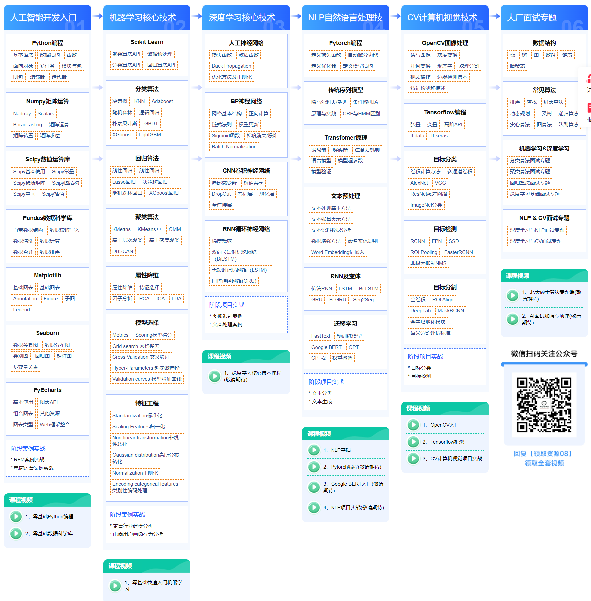
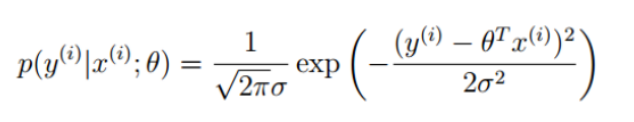
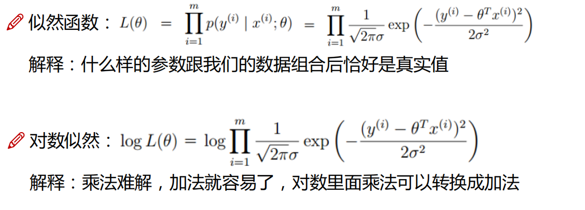
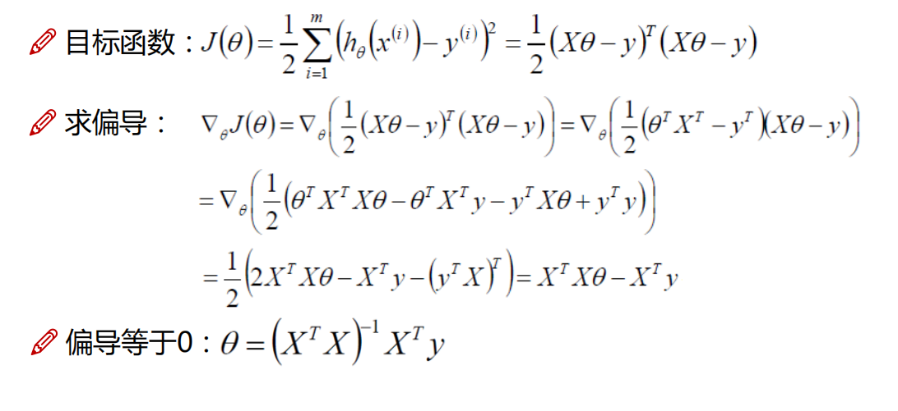
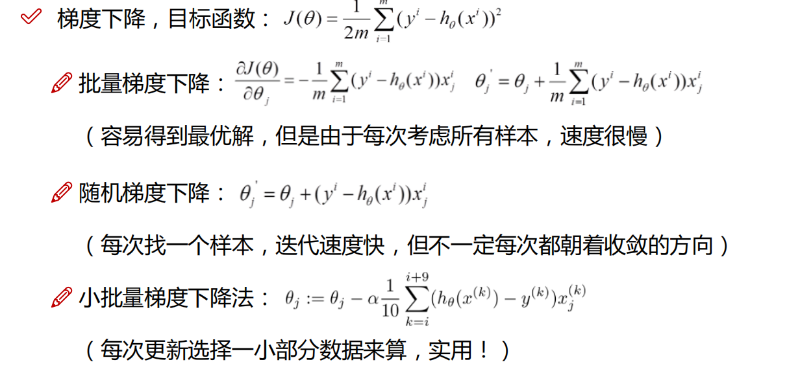

# 学习路线图

用一张黑马的图来看看具体有些什么东西吧

# 机器学习

机器学习（Machine Learning，简称ML）是一种人工智能（Artificial Intelligence，简称AI）技术，**它使计算机能够从数据中自动学习和改进，而无需明确编程**。机器学习涉及算法和统计模型的开发，这些算法和模型可以分析和识别数据中的模式，并根据这些模式进行预测或决策。机器学习的主要类型包括：

1. **监督学习**：在这种方法中，模型在包含输入和输出的已标记数据集上进行训练，学习从输入映射到输出的关系。
2. **无监督学习**：在这种方法中，模型在未标记的数据集上进行训练，目标是发现数据中的隐藏模式或结构。
3. **半监督学习**：结合监督和无监督学习的方法，使用少量已标记数据和大量未标记数据进行训练。
4. **强化学习**：通过试错法进行学习，模型通过与环境交互并获得反馈（奖励或惩罚）来优化其行为。

> 我对机器学习的理解在于,  给计算机数据, 让它找到里面的隐藏规律,  我们不需要知道这个规律, 但是我们可以使用这个规律做很多事情, 比如预测, 决策

人工智能的难点在于 黑盒型, 以及难以掌握性, 它不像传统的数据结构算法, 传统的算法是很明确的, 我们是能一步步验证的, 但是人工智能的算法通常很难自己一步步验证, 一步步看效果,  虽然我们可以评估它, 但我们对他训练出来的规律是那种看不透抓不着的感觉

### 主要难点

1. **黑盒性**：许多机器学习算法，尤其是深度学习模型，内部机制复杂且难以解释。这使得我们难以理解模型是如何做出决策的。
2. **可解释性**：传统算法的每一步都是明确的，可以追踪和调试，而**机器学习模型，特别是复杂的神经网络，很难逐步验证每一步的效果。**
3. **训练过程的不可预测性**：机器学习模型的训练过程涉及大量的参数调整和数据处理，结果可能具有高度的不确定性和不可预测性。
4. **数据依赖性**：模型的性能严重依赖于训练数据的质量和数量，不同的数据集可能导致完全不同的模型行为。

## 线性回归

## 定义

用于预测一个目标变量（通常称为因变量）与一个或多个特征变量（自变量）之间的关系。线性回归模型假设目标变量与特征变量之间存在线性关系，即目标变量可以表示为特征变量的线性组合。

## 模型求解

线性回归模型的目标是通过最小化误差平方和来求解模型参数，使得模型的预测值尽可能接近实际观测值**。直观上，我们希望误差平方和越小越好，这样模型的拟合效果就越好。**

在统计学领域，为了形式化这种思想，我们引入了条件概率的概念。我们假设在给定模型参数和自变量的情况下，**预测值与真实值之间的关系可以表示为一个条件概率。具体来说，给定模型参数和自变量，预测值等于真实值的概率应该最大化**。

为了实现这一目标，我们使用似然函数，即所有数据点的条件概率乘积。我们希望最大化似然函数，从而找到最优的模型参数。由于直接最大化似然函数通常比较复杂，我们常常取对数来简化计算过程，这样目标变为最大化对数似然函数。

### 最小二乘法

最小二乘法是直接通过公式推导, 然后直接用自变量和因变量推导出来参数的过程,  这就没有体现出来学习的过程, 而且如果公式中的矩阵不可逆,最小二乘法也不能使用了, 下面是他的推导过程

对对数似然函数中的参数求偏导:

### 梯度下降

梯度下降是一种迭代优化算法，通过计算损失函数的梯度，并沿着梯度的反方向逐步更新参数，以找到最小值

1. 批量梯度下降: 在每次迭代中使用整个训练数据集来计算梯度并更新参数。
2. 随机梯度下降
3. 小批量梯度下降

### 最小二乘法和梯度下降对比

最小二乘法是一种解析方法，通过最小化预测值与实际值之间误差的平方和来拟合模型参数。

梯度下降是一种迭代优化算法，通过计算损失函数的梯度，并沿着梯度的反方向逐步更新参数，以找到最小值。

1. **计算方式**：
   - 最小二乘法：通过解析方法一次性求解。
   - 梯度下降：通过迭代方法逐步逼近最优解。
2. **适用范围**：
   - 最小二乘法：适用于线性、小规模数据集问题。
   - 梯度下降：适用于线性、非线性、大规模数据集和复杂模型。
3. **计算复杂度**：
   - 最小二乘法：高（需要矩阵求逆）。
   - 梯度下降：相对低（每次迭代计算量小）。
4. **灵活性**：
   - 最小二乘法：低，局限于特定条件下使用。
   - 梯度下降：高，广泛适用于各种优化问题。