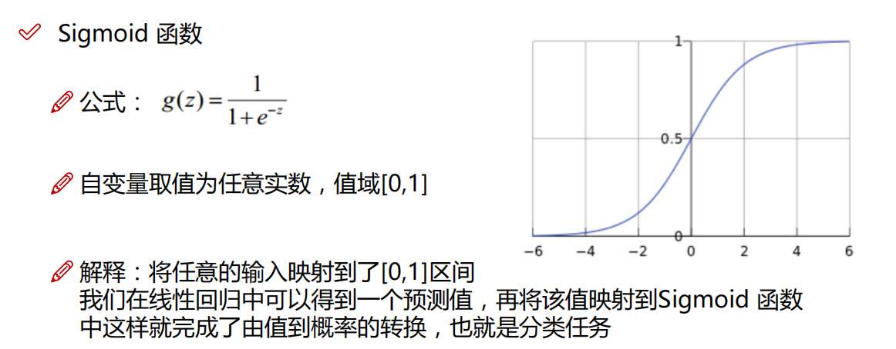
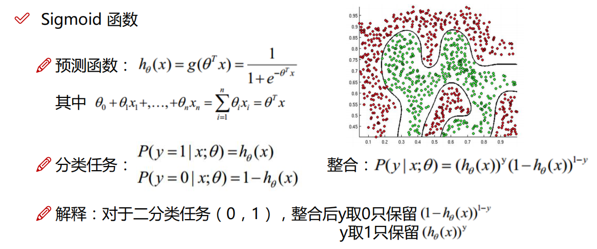
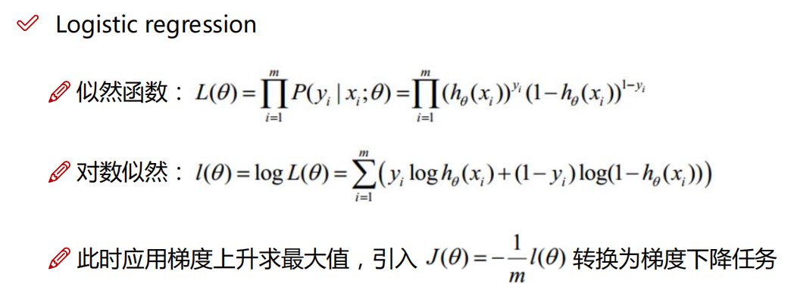
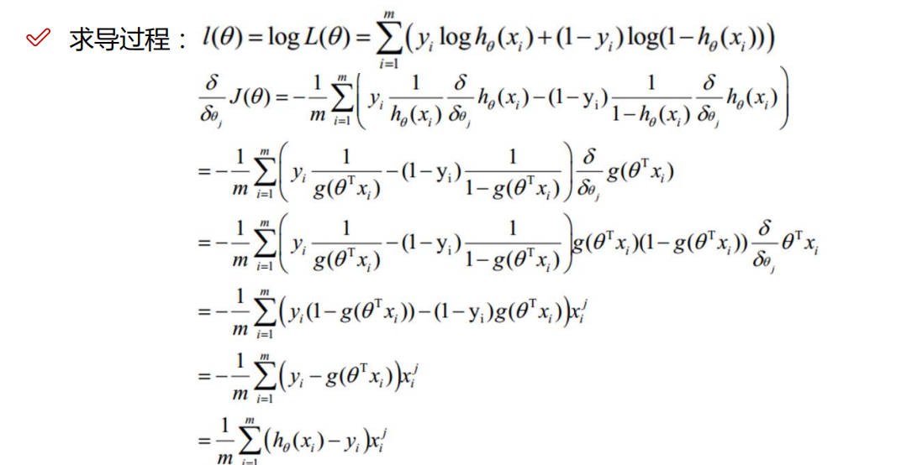
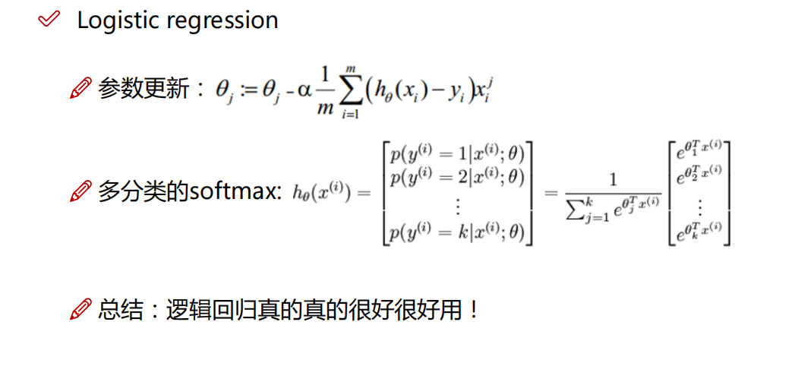

# 学习路线图

用一张黑马的图来看看具体有些什么东西吧

# 术语

## 参数 (Parameters)

参数是模型在训练过程中通过数据学习得到的值。这些值直接影响模型的预测能力。不同类型的模型有不同的参数。例如：

- **线性回归**中的参数是回归系数（权重）和偏置项。
- **神经网络**中的参数是权重和偏置项。

在模型训练过程中，这些参数通过优化算法（如梯度下降）进行调整，以最小化损失函数，从而提高模型的预测精度。

## 超参数 (Hyperparameters)

超参数是在模型训练之前设置的值，它们不会在训练过程中通过数据学习到，而是需要通过实验或交叉验证等方法来选择。超参数控制模型的训练过程和模型的复杂度。常见的超参数包括：

- **学习率**（learning rate）：控制梯度下降算法中步长的大小。
- **正则化参数**（regularization parameters）：控制正则化项的强度，以防止过拟合。
- **决策树中的深度**（depth of decision tree）：控制树的最大深度。
- **神经网络中的隐藏层数**（number of hidden layers）和每层的神经元数目（number of neurons per layer）。

### 参数和超参数的区别

1. **学习方式**：
   - **参数**：通过训练数据学习得到。
   - **超参数**：通过先验知识、实验或交叉验证设置。

2. **调节方式**：
   - **参数**：通过优化算法（如梯度下降）自动调整。
   - **超参数**：通常需要人工设定，使用网格搜索、随机搜索或贝叶斯优化等方法进行调节。

在实际操作中，超参数的选择往往需要大量的实验和调优，以找到最佳的模型配置，从而获得最佳的性能。

## 损失函数

损失函数（Loss Function）是用于衡量机器学习模型的预测结果与实际结果之间差异的一种函数。它是模型训练过程中的核心要素，因为它提供了一个衡量标准来评估模型的表现，并指导模型的优化和更新。通过最小化损失函数的值，模型可以提高其预测的准确性和性能。

# 机器学习

机器学习（Machine Learning，简称ML）是一种人工智能（Artificial Intelligence，简称AI）技术，**它使计算机能够从数据中自动学习和改进，而无需明确编程**。机器学习涉及算法和统计模型的开发，这些算法和模型可以分析和识别数据中的模式，并根据这些模式进行预测或决策。机器学习的主要类型包括：

1. **监督学习**：在这种方法中，模型在包含输入和输出的已标记数据集上进行训练，学习从输入映射到输出的关系。
2. **无监督学习**：在这种方法中，模型在未标记的数据集上进行训练，目标是发现数据中的隐藏模式或结构。
3. **半监督学习**：结合监督和无监督学习的方法，使用少量已标记数据和大量未标记数据进行训练。
4. **强化学习**：通过试错法进行学习，模型通过与环境交互并获得反馈（奖励或惩罚）来优化其行为。

> 我对机器学习的理解在于,  给计算机数据, 让它找到里面的隐藏规律,  我们不需要知道这个规律, 但是我们可以使用这个规律做很多事情, 比如预测, 决策

人工智能的难点在于 黑盒型, 以及难以掌握性, 它不像传统的数据结构算法, 传统的算法是很明确的, 我们是能一步步验证的, 但是人工智能的算法通常很难自己一步步验证, 一步步看效果,  虽然我们可以评估它, 但我们对他训练出来的规律是那种看不透抓不着的感觉

## 主要难点

1. **黑盒性**：许多机器学习算法，尤其是深度学习模型，内部机制复杂且难以解释。这使得我们难以理解模型是如何做出决策的。
2. **可解释性**：传统算法的每一步都是明确的，可以追踪和调试，而**机器学习模型，特别是复杂的神经网络，很难逐步验证每一步的效果。**
3. **训练过程的不可预测性**：机器学习模型的训练过程涉及大量的参数调整和数据处理，结果可能具有高度的不确定性和不可预测性。
4. **数据依赖性**：模型的性能严重依赖于训练数据的质量和数量，不同的数据集可能导致完全不同的模型行为。

## 线性回归

### 定义

用于预测一个目标变量（通常称为因变量）与一个或多个特征变量（自变量）之间的关系。**线性回归模型假设目标变量与特征变量之间存在线性关系，即目标变量可以表示为特征变量的线性组合。**

### 模型求解

线性回归模型的目标是通过最小化误差平方和来求解模型参数，使得模型的预测值尽可能接近实际观测值**。直观上，我们希望误差平方和越小越好，这样模型的拟合效果就越好。**

在统计学领域，为了形式化这种思想，我们引入了条件概率的概念。我们假设在给定模型参数和自变量的情况下，**预测值与真实值之间的关系可以表示为一个条件概率。具体来说，给定模型参数和自变量，预测值等于真实值的概率应该最大化**。

> 这里一般是选择正态分布概率模型, 我们其实也可以根据需要使用其他概率模型, 比如后续的逻辑分布就是另外的一个模型

为了实现这一目标，我们使用似然函数，即所有数据点的条件概率乘积。我们希望最大化似然函数，从而找到最优的模型参数。由于直接最大化似然函数通常比较复杂，我们常常取对数来简化计算过程，这样目标变为最大化对数似然函数。

#### 最小二乘法

最小二乘法是直接通过公式推导, 然后直接用自变量和因变量推导出来参数的过程,  这就没有体现出来学习的过程, 而且如果公式中的矩阵不可逆,最小二乘法也不能使用了, 下面是他的推导过程

对对数似然函数中的参数求偏导:

#### 梯度下降

梯度下降是一种迭代优化算法，通过计算损失函数的梯度，并沿着梯度的反方向逐步更新参数，以找到最小值

1. 批量梯度下降: 在每次迭代中使用整个训练数据集来计算梯度并更新参数。
2. 随机梯度下降
3. 小批量梯度下降

#### 最小二乘法和梯度下降对比

最小二乘法是一种解析方法，通过最小化预测值与实际值之间误差的平方和来拟合模型参数。

梯度下降是一种迭代优化算法，通过计算损失函数的梯度，并沿着梯度的反方向逐步更新参数，以找到最小值。

1. **计算方式**：
   - 最小二乘法：通过解析方法一次性求解。
   - 梯度下降：通过迭代方法逐步逼近最优解。
2. **适用范围**：
   - 最小二乘法：适用于线性、小规模数据集问题。
   - 梯度下降：适用于线性、非线性、大规模数据集和复杂模型。
3. **计算复杂度**：
   - 最小二乘法：高（需要矩阵求逆）。
   - 梯度下降：相对低（每次迭代计算量小）。
4. **灵活性**：
   - 最小二乘法：低，局限于特定条件下使用。
   - 梯度下降：高，广泛适用于各种优化问题。

### 多项式回归

多项式回归是一种用于处**理变量间非线性关系的回归分析方法**。它通过为模型引入自变量的高次项，比如平方或立方项，使模型能够拟合更复杂的数据形态。这种方法的关键在于它实质上仍然是线性回归的一个扩展，因为这些高次项被视作新的独立变量。这样，多项式回归就能使用标准的线性回归技术来解决。

在实际应用中，多项式回归模型的选择很重要，模型的复杂度（即多项式的最高次数）需要仔细选择以避免过拟合，即模型在训练集上表现出色但在新的数据集上表现不佳的情况。过拟合是多项式回归中常见的问题，特别是在模型阶数较高时。

为了解决过拟合问题，可以采用正则化技术，如岭回归和Lasso回归。岭回归通过添加一个与系数平方成正比的惩罚项（L2正则化）来控制系数的大小，而Lasso回归通过添加一个与系数绝对值成正比的惩罚项（L1正则化），不仅减少系数大小，还能实现系数的稀疏化，即某些系数可能变为零，从而简化模型。

总的来说，多项式回归是一种强大的工具，适用于揭示变量之间复杂的非线性关系。然而，选择合适的模型复杂度和采用适当的正则化方法是保证模型泛化能力和避免过拟合的关键。

## 逻辑回归

逻辑回归是一种统计学中的回归分析方法，用于处理因变量是分类变量的情况。**它主要用于二分类问题**，即因变量只有两个可能的结果（例如，是或否、成功或失败）。逻辑回归通过使用一个或多个自变量来预测一个事件发生的概率。

> 逻辑回归可以实现多分类,  但是思想还是二分类,  就是将多分类问题看成多个二分类就行

逻辑回归的核心思想是，**它不直接预测分类结果，而是预测结果发生的概率**。这是通过使用逻辑函数（或称为sigmoid函数）实现的，该函数输出一个介于0到1之间的值，表示概率。

> 标签中谁是1, 这个模型得到概率就代表 分类结果是他的概率是多少

### 求解

选择sigmoid函数作为模型,  应为他的函数值就0-1之间, 而且也覆盖了全部的自变量值

这里h(x)还是代表在当前x,参数下,  y预测值与真实值相同的概率是多少,  还是利用最大似然函数,  我们希望得到的参数尽可能的让所有点概率比较大

接着就是求导这些

然后我们就可以使用梯度下降算法来解这个题目了, 是不是就很熟悉

在多分类中,    标签的一个维度代表数据量,  一个维度代表分类个数,    参数中 一个维度代表分类个数, 一个维度代表分类个数

## 聚类

聚类（Clustering）是一种无监督学习技术，它的目的是将数据集中的对象分成若干个簇（Clusters），使得同一簇内的对象彼此之间的相似性尽可能大，而不同簇之间的对象的相似性尽可能小。聚类广泛应用于数据挖掘、图像处理、模式识别、市场分析等领域。

### 聚类的基本概念

1. **簇（Cluster）**：簇是指在某种相似度或距离度量标准下，相互接近或相似的一组数据点。
2. **相似度度量**：用于衡量数据点之间的相似性或距离。常见的度量方法有欧氏距离、曼哈顿距离、余弦相似度等。
3. **簇中心（Centroid）**：在一些聚类算法中，每个簇都有一个中心点，代表该簇的中心位置。

### 常见的聚类算法

#### 1. K均值聚类（K-Means Clustering）
K均值聚类是一种迭代算法，其目标是将数据集划分为K个簇，每个簇由其簇中心代表。基本步骤如下：
- 初始化K个簇中心。
- 将每个数据点分配到最近的簇中心，形成K个簇。
- 重新计算每个簇的簇中心，即所有簇内数据点的平均值。
- 重复上述步骤，直到簇中心不再变化或达到最大迭代次数。

#### 2. 层次聚类（Hierarchical Clustering）
层次聚类通过构建树状的聚类结构（树状图或树状结构）来实现数据点的分层聚类。它有两种主要方法：
- **自底向上（凝聚）**：从每个数据点开始，将最相似的簇合并，直到所有数据点聚合成一个簇。
- **自顶向下（分裂）**：从一个包含所有数据点的大簇开始，逐步将其分裂为更小的簇，直到每个数据点单独成为一个簇。

#### 3. DBSCAN（Density-Based Spatial Clustering of Applications with Noise）
DBSCAN是一种基于密度的聚类算法，能够发现任意形状的簇，并识别噪声点。它定义了以下概念：
- **核心点（Core Point）**：在给定半径内包含至少指定数量数据点的点。
- **边界点（Border Point）**：不满足核心点条件，但在某个核心点的半径内。
- **噪声点（Noise Point）**：既不是核心点也不是边界点的点。

#### 4. 均值漂移聚类（Mean Shift Clustering）
均值漂移是一种基于密度的非参数聚类算法，通过平滑的密度估计来识别簇中心。它通过在特征空间中迭代移动数据点，直到所有点收敛到密度峰值位置，从而形成簇。

### 聚类的应用

- **图像分割**：将图像中的像素点聚类为不同的区域，进行图像分割和对象识别。
- **市场细分**：将客户分为不同的群体，以便进行个性化营销策略。
- **文档聚类**：将文档按主题进行分类，以便于信息检索和组织。
- **异常检测**：识别数据集中与其他数据点显著不同的异常点。

### 结论

聚类是一种强大的无监督学习方法，通过将数据分组为若干簇，揭示数据内在结构和相似性。不同的聚类算法适用于不同类型的数据和应用场景，选择合适的聚类方法是实现有效数据分析的关键。

# 数据预处理