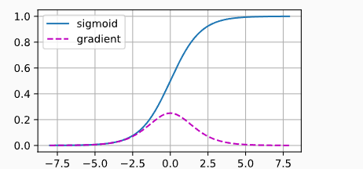

> [学习链接](zh.d2l.a)

# 前言

神经网络就是用来学习一种我们无法通过公式和算法显式的写出来的规则, 比如 目标检测,  我们人脑能很快的从一副图像中检测某个物体, 并且分类, 但是我们是无法直接写出这个检测和分类的代码的, 所以我们需要神经网络这个黑盒子去帮我们隐式的表达出来

# 前馈神经网络(FNN)

即多层感知机(MLP),  输入层 与 隐藏层 之间, 以及隐藏层和输出层之间 采用全连接的方式

## 激活函数

有了激活函数, 我们可以将多层感知机的表达能力变得更强,而不局限于线性表达, 如果没有激活函数, 多层感知机和线性模型那些没有啥区别, 这里可以以一个只有一个隐藏层的模型推导
$$
 \mathbf{O} = (\mathbf{X} \mathbf{W}^{(1)} + \mathbf{b}^{(1)})\mathbf{W}^{(2)} + \mathbf{b}^{(2)} = \mathbf{X} \mathbf{W}^{(1)}\mathbf{W}^{(2)} + \mathbf{b}^{(1)} \mathbf{W}^{(2)} + \mathbf{b}^{(2)} = \mathbf{X} \mathbf{W} + \mathbf{b}.
$$

# 卷积神经网络(CNN)

这个给我的感觉就是用来做特征提取,  使用一小块的卷积核 依次去以某种模式去匹配一个矩阵(图像, 以及其他能被矩阵表达的东西), 然后得出匹配的特征, 然后做池化, 如此往复, 最后再使用前馈神经网络输出东西

* 卷积核: 用来做特征匹配的, 也是需要学习的参数, 卷积核的通道数与输入数据的通道数是一样的.  一个卷积核就是一种特征提取
* 池化: 降低计算复杂度, 减少过拟合,保留我们需要的信息, 只会改变宽高, 不会改变通道数
* 感受野: 能看到原始输入数据区域大小

## 现代卷积神经网络

### AlextNet

改良LeNet, 使用了Relu作为激活函数,

### VGG

引入块的概念, 将一系列操作(卷积, 激活,池化)封装成块

### NiN

引入1*1卷积改变通道数

引入1*1卷积 加上全局平均池化 代替一般卷积神经网络最后的全连接层, 1\*1卷积不会保留了各通道之间的空间信息

### GoogleLet

定义了一个Inception块, 里面包含了各种卷积块大小操作, 最后连接这些操作产生的数据, 引入了四条并行路径

### ResNet

用来克服深层次卷积神经网络失效的问题,  f(x) = x+g(x)

### DenseNet

ResNet的变种, f(x) =[ x, g(x), g1(x+g(x)) ......]

# 循环神经网络(RNN)

前馈神经网络是没有记忆能力的, 不能根据之前的输入做出不同的输出, 只要是相同的东西都是同样的输出, 而循环神经网络是有记忆能力的, 他能理解上下文

循环神经网络的记忆力体现在引入了隐状态,  他每一步都会根据当前的输入以及上一次的隐状态生成这一次的隐状态并且记录下来, 所以根据不同的生成隐状态的方式就能引出一些现在循环神经网络模型:

* LSTM
* GRU
* BRNN(双向循环网络)

# 注意力机制

他是一种模仿人类注意力的机制，能够让模型在处理复杂任务时更关注某些关键的信息或部分

举个例子:  你手里有很多同事的笔记（键），你自己有一个具体的问题（查询），你要从这些笔记中找到和你问题最相关的信息（值）。你可能会在不同的同事那里找到不同程度的帮助，所以你会根据他们的经验来判断谁的笔记最有价值（注意力权重）。最后，你整合了最有帮助的内容，得到了答案。

* **查询**是你当前想要解决的问题。

* **键**是整个上下文背景，告诉你每个部分的信息如何相互关联。

* **值**是你从键中提取的答案或信息。

* **注意力权重**决定了你应该关注哪些信息，并忽略哪些不相关的部分。

我们的模型就是需要训练出如何根据输入得到查询, 键, 值,  根据输入得到关注的点(查询), 得到 不同部分(键), 不同部分中的关键信息(值),  然后计算查询与键的注意力权重, 然后将权重与值加权得到输出(整合)

## 注意力评分函数

这个是根据键和查询得到关于值的权重

### 加性注意力评分函数

将键和值通过两个不同线性变化映射到同一个长度, 然后相加经过一个激活函数, 然后再做一个线性变化(内积)变成长度为1得到这个值的权重
$$
a(q, k) = w_v^T \tanh(W_q q + W_k k) \in \mathbb{R}
$$

### 缩放点积注意力评分函数

这个需要键和值特征长度是相同的, 直接相乘然后除以长度的开方

## 多头注意力

将q,k,v映射到相同的维度, 然后分成指定头, 然后每个头上做注意力, 最后汇聚起来, 再映射出去

# 额外笔记

* 权重衰退: 其实就是正则化, 让复杂的权重产生更大的损失, 这样可以避免过拟合

* 丢弃法: 也就是dropout,  通过丢弃一些节点(训练过程中), 相当于加入一些噪音, 提高模型的鲁棒性和泛化能力, **也是相当于正则化**,  p的概率丢弃这个节点输出, 1-p的概率将输出除以1-p 其实这样的话会发现这一层的输出均值不变

* 数值稳定性: 训练过程中可能出现梯度爆炸或者梯度消失, 这样都会对模型的训练产生问题, 我们希望模型的训练比较稳定, 一般通过控制反向传播和前馈传播的时候, 让输出的大小满足均值为0, 方差为一个固定值,  这可以通过权重初始化(一般是正态分布)来做到(但是也仅限于前期, 因为后期权重会发生变化, 可能就偏离了原始分布)

* batchNorm:  用于固定小批量里面的均值和方差, 可以加速模型收敛速度, 但是一般不会改变模型精度, 相比权重初始化, 这个东西可以在全局爆炸数据满足某种分布, 而权重初始化只能在开始的时候保证满足某种分布

  

# 反思总结

## 梯度更新

我以前总是以为上一层的参数更新所用的梯度 是瓜分上一层的梯度, 因为我以前看过一个课程, 他举例子正好是 t = 1/2*x + 1/2\*y, 这样的话就会导致反向传播的时候, x和y的梯度正好是相同的并且是t的梯度一半,  但是其实不是, 实际在反向传播中，梯度是按链式法则计算的，每个变量的梯度是**单独求导并独立传递**的, 是用t的梯度乘以dt/dx

借此机会正好谈一下梯度消失和梯度爆炸, 正是因为这种链式求导法则, 会导致梯度消失和梯度爆炸

### 梯度消失

如果我们采用sigmoid这类激活函数, 就会出现这种问题, 还有就是如果数据初始就很小, 累乘的时候会导致梯度很小,

sigmoid的激活函数的导数最大也就只有0.25而且越往两边数值都接近0了, 这样很容易导致梯度变得很小

还有就是链式法则累乘: da * db * dc * dd

### 梯度爆炸

正是因为链式法则, 如果初始化的时候, 其中的参数都很大的话, 就会导致梯度直接爆炸了

# 感受

学习深度学习半年有余, 我个人的感觉难点就在于, 我们不知道模型为什么学成这样,  如果我们能知道模型为什么学成这样,  我们就很容易知道模型在哪里不足, 就可以加以修改,   他这种特性就来自于, 他中间的输出值是没有含义的, 应该说对于我们来说, 是没有含义的, 我们是无从得知的,  他不像算法题,  哪里出问题了, 我们很容易就调试好了

