# 背景

**传统部署时代：** 早期,是直接将应用程序部署在物理机上，无法对应用程序进行资源限制,如果有多个应用,就会出现资源分配的问题,比如一个应用占据大量资源,使用其他应用性能下降,一种解决方案是单个应用放在单个服务器上,这样的话,虽然做到了资源隔离,但是如果一个应用程序资源利用率不高的时候,剩余的资源又无法分配各其他应用程序,而且物理服务器的维护成本变得很高。

**虚拟化部署时代：** 作为解决方案，引入了虚拟化功能，它允许您在单个物理服务器的 CPU 上运行多个虚拟机VM。虚拟化功能允许应用程序在 VM 之间隔离，并提供安全级别，因为一个应用程序的信息不能被另一应用程序自由地访问。

**容器部署时代：** 容器类似于 VM，但是它们具有轻量级的隔离属性，可以在应用程序之间共享操作系统OS。因此，容器被认为是目前最轻量级的。容器与 VM 类似，具有自己的文件系统、CPU、内存、进程空间等。由于它们与基础架构分离，因此可以跨云和 OS 分发进行移植。而在容器时代，Docker容器引擎是最流行的一个。


Kubernetes 为你提供了一个**可弹性运行分布式系统**的框架。 Kubernetes 会满足你的**扩展要求、故障转移你的应用、提供部署模式**等

k8s提供的功能有:

* **服务发现和负载均衡**   使用ip或者dns名称暴露容器ip,让service发现,当service流量过大的时候,会负载均衡到这些容器中
* **存储编排**  允许自动挂载选择的存储系统
* **自动部署和回滚**   通过更改期望状态,就能够实现容器的自动部署和历史版本回滚
* **自动完成装箱计算** 在用户提供了容器需要的资源的基础上,k8s根据容器实际情况分配资源,以最佳方式利用资源
* **自我修复**  k8s 可以重新启动失败的容器,或者替换容器,或者杀死不响应的容器
* **秘钥和配置管理** Kubernetes 允许你存储和管理敏感信息，例如密码、OAuth 令牌和 ssh 密钥。 你可以在不重建容器镜像的情况下部署和更新密钥和应用程序配置，也无需在堆栈配置中暴露密钥

# 核心组件 

## APIServer

系统管理指令的统一入口,担负着统揽全局的重任,任何对资源的增删改查都得交给它后才能交给etcd

功能:

* 对外提供restful的管理接口,方便对资源对象的增删改查
* 配置k8s资源对象,将资源对象的当前状态与期望状态存储在etcd中,供其他组件使用,除了etcd,k8s没有其他的持久化结点
* 系统日志收集,并且提供api供访问

## scheduler

在可用的工作结点列表通过算法选取一个结点与待调度的pod进行绑定

调度算法:

首先经历一系列的Predicates判断这个pod能不能在我这个结点上运行,下面列举在default算法中可用的Predicates

* PodFitsHostPorts: 查看pod容器需要用的宿主机端口是否有冲突
* podFitsResources: 检查结点上的资源是否够用,就是检测结点已有pod对资源的需求量+待调度的pod资源需求量 是否超过工作结点的容量
* NoDiskConfict: 检查容器挂在的卷是否有冲突,只对特定的容器卷有效,因为这些容器卷有它们自己的挂载规则,比如禁止两个pod共享同一个容器卷
* NoVolumeZoneConfict: 检查pod的挂载卷的zone限制是否与node对应的zone-lable相匹配
* MatchNodeSelector: 检查工作结点的lables属性是否和pod的结点标签选择器是否一致
* hostname: 如果在pod中指定了宿主机,那么将会调度他到指定的宿主机结点上运行

经历了上述硬性筛选之后,顺利过关的工作结点就会来到打分流程,下面列举打分策略:

* LeastRequestedPriority: 计算原则是尽可能的将pod调度到资源占用比小的结点上
* BalanceResourceAllocation: 调度时尽可能选取cpu和内存利用率相近的结点
* SelectorSpreadPriority: 对于相同的service的pod在节点上尽可能的分散
* NodeAffinityPriority: 根据用户指定pod的工作结点亲和性进行打分
* ImageLocalityPriorite: 根据pod需要的镜像进行打分,pod需要的镜像大小和越大(pod可以运行多个容器),打分越高

最后计算加权和,看哪个工作结点分高

## controller manager

管理k8s中的各种控制器,确保这些资源永远保持在用户所预期的状态

controller manager 控制pod与工作结点等资源正常运行的本质,就是靠这些控制器定时对pod,工作结点等资源进行检查,然后判断实际状态是否与期望状态一直,不一致的话则会通知apiserver进行增删改.

服务端点控制: **检测pod与service之间的对应关系是否正常,**保证始终运行在用户所期望的状态

副本管理控制器:  保证实际副本数量与期望数量一致

垃圾回收控制器: 删除处于终止状态pod的信息,不是删除容器哦

结点控制器: 检查工作结点是否可用,工作结点通过kubelet定时发送数据给master结点,如果在一段时间内没有发送,则认为工作结点不可以工作

资源配额控制器:  对一个namespace 的资源进行配置

## kubelet

kubelet是工作结点中最重要的进程,负责创建和管理容器,还有容器和镜像的垃圾回收

## kube-proxy

实现服务发现与负载均衡,在后端pod的ip发生变化的时候,也能察觉到,并且维护着service与pod之间的对应关系,将发往service的流量正确的导向pod

## etcd

主要用于分布式系统中数据一致性的问题,服务发现

## 核心组件协作流程

### 创建pod

我们通过kubectl发起一个创建pod的请求后,kubectl会先检查命令是否正确,然后解析命令生成的pod资源文件发送给apiserver,apiserver收到请求后,进行用户认证,授权,和资源配额控制,验证通过后,apiserver调用etcd的存储接口在后台数据库创建一个pod对象,scheduler通过apiserve监听到需要创建pod,然后从etcd获取可用工作结点列表和待调度的pod,在发现有待调度的pod且有工作结点的时候,会通过筛选结点,给结点打分,选出最优结点,然后调用apiserver提供的api在etcd中创建一个binding对象,描述在一个工作结点绑定运行的所有pod信息,kubelet监听到apiserver上要创建pod,然后在本地创建对应的pod

# 基础环境部署

## 前期准备

用了三台虚拟机,都是centos7 

192.168.100.3  master结点

192.168.100.4  work1结点

192.168.100.5  work2结点

### 修改hostname

```shell
# master上执行
hostnamectl set-hostname master
exec bash
# work1 上执行
hostnamectl set-hostname work1
exec bash
# work2 上执行
hostnamectl set-hostname work2
```

### 配置hosts文件(所有结点)

```shell
# 两台机器都执行
cat >> /etc/hosts << EOF
192.168.100.3  master
192.168.100.4  work1
192.168.100.5  work2
192.168.100.3  cluster-endpoint
EOF
```

### 配置ssh互信(所有结点)

```shell
# 所有机器都执行
ssh-keygen
# 一直回车得到秘钥

ssh-copy-id -i ~/.ssh/id_rsa.pub root@master
ssh-copy-id -i ~/.ssh/id_rsa.pub root@work1
ssh-copy-id -i ~/.ssh/id_rsa.pub root@work2
```

### 设置时间同步(所有结点)

```shell
yum install chrony -y
systemctl start chronyd
systemctl enable chronyd
chronyc sources
```

### 关闭防火墙(所有结点)

```shell
systemctl stop firewalld
systemctl disable firewalld
```

### 关闭交换区(所有结点)

```shell
swapoff -a
sed -ri 's/.*swap.*/#&/' /etc/fstab
```

### 禁用seninux(所有结点)

```shell
setenforce 0
sed -i 's/^SELINUX=enforcing$/SELINUX=disabled/' /etc/selinux/config
```

### 允许 iptables 检查桥接流量(所有结点)

```shell
modprobe br_netfilter

cat <<EOF | sudo tee /etc/modules-load.d/k8s.conf
overlay
br_netfilter
EOF

modprobe overlay
modprobe br_netfilter

# 设置所需的 sysctl 参数，参数在重新启动后保持不变
cat <<EOF | sudo tee /etc/sysctl.d/k8s.conf
net.bridge.bridge-nf-call-iptables  = 1
net.bridge.bridge-nf-call-ip6tables = 1
net.ipv4.ip_forward                 = 1
EOF

# 应用 sysctl 参数而不重新启动
sudo sysctl --system
```

### 安装docker(所有结点)

```shell
# 配置yum源
cd /etc/yum.repos.d ; mkdir bak; mv CentOS-Base.repo bak/
wget -O /etc/yum.repos.d/CentOS-Base.repo http://mirrors.aliyun.com/repo/Centos-7.repo
# wget -O /etc/yum.repos.d/CentOS-Base.repo http://mirrors.aliyun.com/repo/Centos-8.repo (这个是centos8的源)

# 安装yum-config-manager配置工具
yum -y install yum-utils
# 设置yum源
yum-config-manager --add-repo http://mirrors.aliyun.com/docker-ce/linux/centos/docker-ce.repo
# 安装docker-ce版本
yum install -y docker-ce
# 启动
systemctl start docker
# 开机自启
systemctl enable docker
# 查看版本号
docker --version

# Docker镜像源设置
cat >/etc/docker/daemon.json<<EOF
{
   "registry-mirrors": ["http://hub-mirror.c.163.com"]
}
EOF
# 加载
systemctl reload docker

```

### 配置k8s源(所有结点)

```shell
cat > /etc/yum.repos.d/kubernetes.repo << EOF
[k8s]
name=k8s
enabled=1
gpgcheck=0
baseurl=https://mirrors.aliyun.com/kubernetes/yum/repos/kubernetes-el7-x86_64/
EOF
```

### 将 sandbox_image 镜像源设置为阿里云 google_containers 镜像源(一条一条命令来哦)(所有结点)

```shell
# 导出默认配置，config.toml这个文件默认是不存在的
containerd config default > /etc/containerd/config.toml
grep sandbox_image  /etc/containerd/config.toml
# 把 sandbox_image = "registry.k8s.io/pause:3.6"(不同版本对应的可能不同)
# 改成 sandbox_image = "registry.aliyuncs.com/google_containers/pause/pause:3.6"
sed -i "s#registry.k8s.io/pause#registry.aliyuncs.com/google_containers/pause#g"   /etc/containerd/config.toml
grep sandbox_image  /etc/containerd/config.toml
```

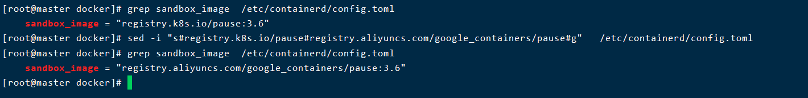

### 配置container国内镜像源

```
# 打开配置文件
vim /etc/containerd/config.toml 

# 改成下面这种格式
 [plugins."io.containerd.grpc.v1.cri".registry.mirrors]
      [plugins."io.containerd.grpc.v1.cri".registry.mirrors."docker.io"]
         endpoint = ["https://o13jbvy6.mirror.aliyuncs.com"]

# 重启containerd
systemctl daemon-reload
systemctl restart containerd
systemctl status containerd

```

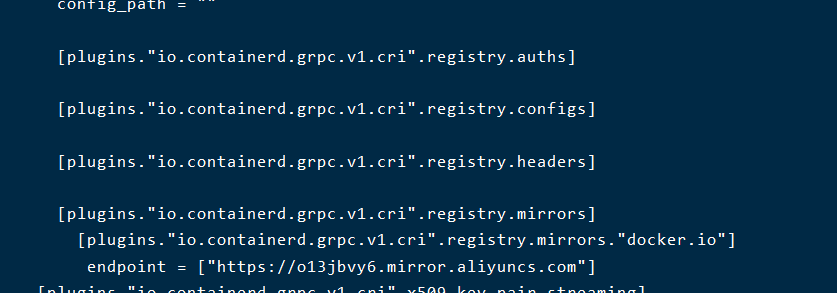

得一层一层来,https://blog.csdn.net/cyxinda/article/details/124999938 (可以参考这个博客)

### 配置 containerd cgroup 驱动程序 systemd(所有结点)

```shell
sed -i 's#SystemdCgroup = false#SystemdCgroup = true#g' /etc/containerd/config.toml
systemctl restart containerd
```

### 安装 kubeadm，kubelet 和 kubectl(所有结点)

```shell
# 不指定版本就是最新版本，当前最新版就是1.24.1
yum install -y kubelet-1.24.1  kubeadm-1.24.1  kubectl-1.24.1 --disableexcludes=kubernetes
# disableexcludes=kubernetes：禁掉除了这个kubernetes之外的别的仓库
# 设置为开机自启并现在立刻启动服务 --now：立刻启动服务
systemctl enable --now kubelet

# 查看状态，这里需要等待一段时间再查看服务状态，启动会有点慢
systemctl status kubelet
```

### 使用kubeadm初始化集群(master)

下载好镜像

```shell
docker pull registry.aliyuncs.com/google_containers/kube-apiserver:v1.24.1
docker pull registry.aliyuncs.com/google_containers/kube-controller-manager:v1.24.1
docker pull registry.aliyuncs.com/google_containers/kube-scheduler:v1.24.1
docker pull registry.aliyuncs.com/google_containers/kube-proxy:v1.24.1
docker pull registry.aliyuncs.com/google_containers/pause:3.7
docker pull registry.aliyuncs.com/google_containers/etcd:3.5.3-0
docker pull registry.aliyuncs.com/google_containers/coredns:v1.8.6
```

设置kubectl 自动补全

```shell
# 来到家目录
cd ~
echo 'source <(kubectl completion bash)' >>~/.bashrc
# 重新加载bash
exec bash
```

初始化

```shell
kubeadm init \
  --apiserver-advertise-address=192.168.100.3 \
  --image-repository registry.aliyuncs.com/google_containers \
  --control-plane-endpoint=cluster-endpoint \
  --kubernetes-version v1.24.1 \
  --service-cidr=10.1.0.0/16 \
  --pod-network-cidr=10.244.0.0/16 \
  --v=5
  
 # –image-repository string：    这个用于指定从什么位置来拉取镜像（1.13版本才有的），默认值是k8s.gcr.io，我们将其指定为国内镜像地址：registry.aliyuncs.com/google_containers
# –kubernetes-version string：  指定kubenets版本号，默认值是stable-1，会导致从https://dl.k8s.io/release/stable-1.txt下载最新的版本号，我们可以将其指定为固定版本（v1.22.1）来跳过网络请求。
# –apiserver-advertise-address  指明用 Master 的哪个 interface 与 Cluster 的其他节点通信。如果 Master 有多个 interface，建议明确指定，如果不指定，kubeadm 会自动选择有默认网关的 interface。这里的ip为master节点ip，记得更换。
# –pod-network-cidr             指定 Pod 网络的范围。Kubernetes 支持多种网络方案，而且不同网络方案对  –pod-network-cidr有自己的要求，这里设置为10.244.0.0/16 是因为我们将使用 flannel 网络方案，必须设置成这个 CIDR。
# --control-plane-endpoint     cluster-endpoint 是映射到该 IP 的自定义 DNS 名称，这里配置hosts映射：192.168.0.113   cluster-endpoint。 这将允许你将 --control-plane-endpoint=cluster-endpoint 传递给 kubeadm init，并将相同的 DNS 名称传递给 kubeadm join。 稍后你可以修改 cluster-endpoint 以指向高可用性方案中的负载均衡器的地址。
```

执行提示出来的命令

```
mkdir -p $HOME/.kube
sudo cp -i /etc/kubernetes/admin.conf $HOME/.kube/config
sudo chown $(id -u):$(id -g) $HOME/.kube/config
```

此时master结点还是notready的状态

```
kubectl get nodes 
```

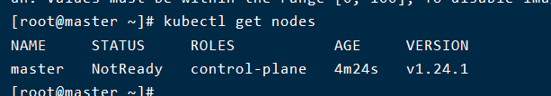

需要安装一个网络插件

### 安装网络插件(master结点)

```
#提前下载好镜像
docker pull quay.io/coreos/flannel:v0.14.0
# 这里可能不成功,最好是下载好这个文件然后上传到虚拟机,在执行这个命令
kubectl apply -f https://raw.githubusercontent.com/coreos/flannel/master/Documentation/kube-flannel.yml
```

```
# 查看所有pod的状态
kubectl get pods -A 
```

当所有pod都在running的时候,主节点就准备好了

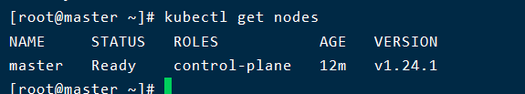

### work结点加入集群

```
# 在master结点上面执行下面命令得到加入主节点的命令
kubeadm token create --print-join-command
```

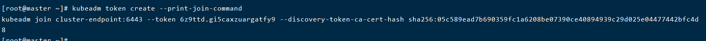

```
#在work1结点中输入这个命令
kubeadm join cluster-endpoint:6443 --token 6z9ttd.gi5caxzuargatfy9 --discovery-token-ca-cert-hash sha256:05c589ead7b690359fc1a6208be07390ce40894939c29d025e04477442bfc4d8 
```

等待一段时间后,在主节点中查看所有结点是否都准备好了

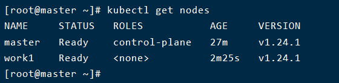

## 安装dashboard

```
kubectl apply -f https://raw.githubusercontent.com/kubernetes/dashboard/v2.6.0/aio/deploy/recommended.yaml
# 可能会下载不下来,建议本地用梯子下载好后,传到虚拟机上
```

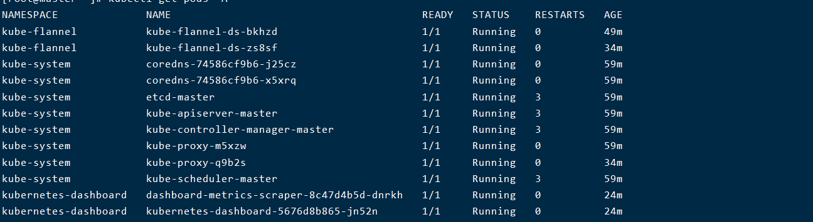

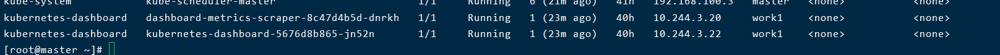

需要等到kubernetes-dashboard的所有pod都在running后才能访问哦,有可能会出现镜像拉取失败

通过端口访问

```
kubectl edit svc kubernetes-dashboard -n kubernetes-dashboard
#上面命令会打开一个文件,我们需要修改一些配置
# 输入 /type 搜索到目标位置

#   type: ClusterIP   将这个东西变成
#   type: NodePort   
#  要注意yaml的语法哦,空格
# 然后保存退出

# 看dashboard 运行在哪个端口
kubectl get svc -A |grep kubernetes-dashboard 
```

> 如果在Google浏览器里面输入 https://ip:端口显示不安全,而且不让进去的话,就在键盘直接输入 thisisunsafe 然后就可以进去了

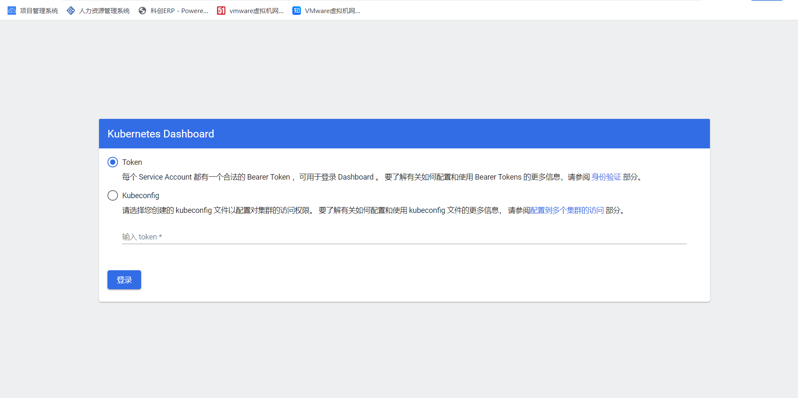

#### 创建账户

```
cat >ServiceAccount.yaml<<EOF
apiVersion: v1
kind: ServiceAccount
metadata:
  name: admin-user
  namespace: kubernetes-dashboard
---
apiVersion: rbac.authorization.k8s.io/v1
kind: ClusterRoleBinding
metadata:
  name: admin-user
roleRef:
  apiGroup: rbac.authorization.k8s.io
  kind: ClusterRole
  name: cluster-admin
subjects:
- kind: ServiceAccount
  name: admin-user
  namespace: kubernetes-dashboard
EOF
kubectl apply -f ServiceAccount.yaml
```

#### 获取token

```
kubectl -n kubernetes-dashboard create token admin-user
```


# k8s 资源对象

## 资源的创建方式

1. 通过命令行的方式
2. 通过yaml的方式

## namespace

名称空间,用来隔离集群资源,默认只隔离资源,不隔离网络

```shell
kubectl get ns   #用来查看名称空间
```

我们以后创建的资源不指定名称空间,默认在default的名称空间

命令行创建

* kubectl create ns hello  创建名称空间
* kubectl delete ns hello 删除名称空间

通过配置文件也可以

```yaml
apiVersion: v1
kind: Namespace
metadata:
  name: hello
```

* 创建 kubectl apply  -f hello.yaml
* 删除 kubectl delete -f hello.yaml

## pod

运行中的一组容器,pod是k8s中应用的最小单位

容器被封装在pod中,pod可以有一个或者多个容器,k8s不是直接操作容器,而是直接操作pod

创建一个pod

```
kubectl run mynginx --image=nginx
```

## deployment

这个资源对象可以控制pod,使pod可以拥有多副本,扩缩容,自愈,故障转移,版本回退,滚动更新

### 多副本

```
kubectl create deploy my-dep --image=nginx --replicas=3  # 创建三个pod资源对象,每个pod里面有个nginx容器
```

### 扩缩容

我们可以使用scale 或者修改配置文件的方式实现更改pod的个数

#### 扩容

使用scale这个子命令

```shell
kubectl scale --replicas=5 deploy/my-dep
```

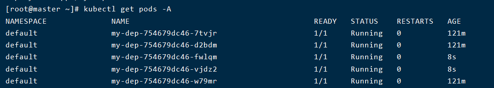

#### 缩容

修改配置文件

```
kubectl edit deploy/my-dep
```

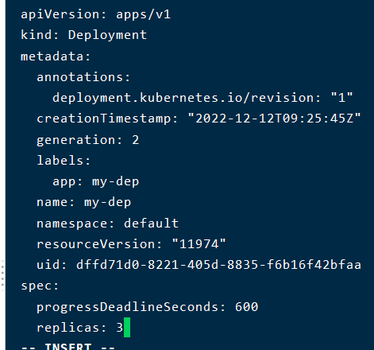

修改为3然后保存退出

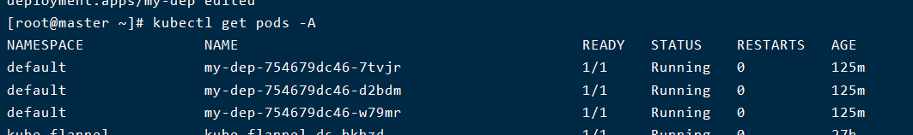

### 自愈,故障转移

我们可以通过删除pod,停止虚拟机的方法验证

#### 验证自愈

```
kubectl delete pod -n default my-dep-754679dc46-vbhfs
```

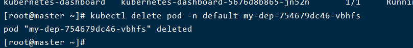

我们会发现k8s又帮我们重新起了一个pod

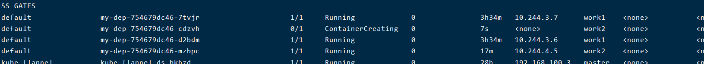

#### 故障转移

我们可以通过停掉一个虚拟机假装它崩了,关掉之后,k8s不会立即就重新开启新的pod,而是要等一段时间后才会

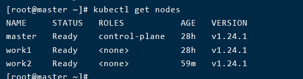

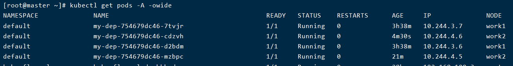

过了一段时间后

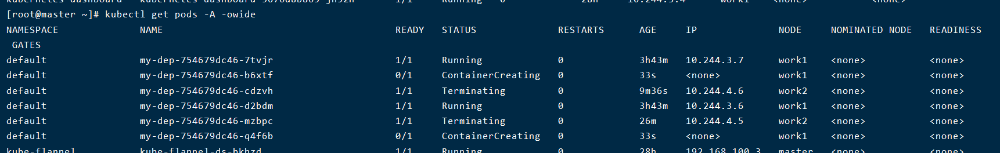

#### 滚动更新

我们可以更新镜像的方式看到这个过程

```shell
# 方式一
kubectl set image deployment/my-dep nginx=nginx:1.16.1 --record
# 方式二 通过配置文件修改镜像名字
kubectl edit deployment/my-dep
```

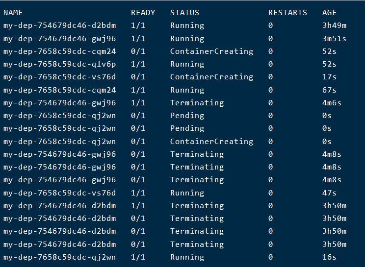

我们发现是先启动一个新的pod然后再杀死老的pod

### 版本回退

有时候新版本可能出现问题了,我们需要回退到原来的版本

```shell
# 查看历史版本
kubectl rollout history deployment/my-dep
# 查看某个历史版本信息
kubectl rollout history deployment/my-dep --revision=2
#回滚到上一次版本
kubectl rollout undo deployment/my-dep
#回滚到指定版本
kubectl rollout undo deployment/my-dep --to-revision=2 
```


## service

### 作用

service是k8s中一个很重要的资源对象,首先,因为pod存在重新调度的问题,pod的ip地址在k8s中是不固定的,因此需要一个代理来确保使用pod的应用不需要知道pod的真实ip地址,只需要知道service的ip地址和端口号,另外一个原因就是当创建了多个pod副本的时候,service能够实现负载均衡

> service主要由一个ip地址和一个标签选择器 组成,它的ip是不会变化的,ip跟它的生命周期一样

### 使用

```shell
kubectl expose deploy/mydep --port=8080 --target-port=80
# --port 是service资源对象的内部暴露端口,80是pod的端口
```

```shell
#查看 创建的service的ip
 kubectl get service
```

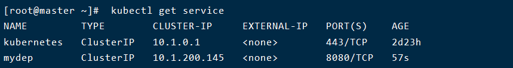

> 我们可以在yaml文件中配置service的ip,指定暴露端口,和service的名字,暴露类型,也可以通过命令行使用kubectl指定
>
> --cluster-ip 指定 service的ip  --name 指定service的名字 --type 指定暴露类型

创建service对象后,k8s还会创建一个名字和service的名字相同的endpoints对象,该对象保存了所有标签符合要求的pod的ip和端口

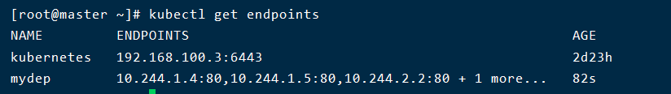

可以通过describe 查看更详细内容

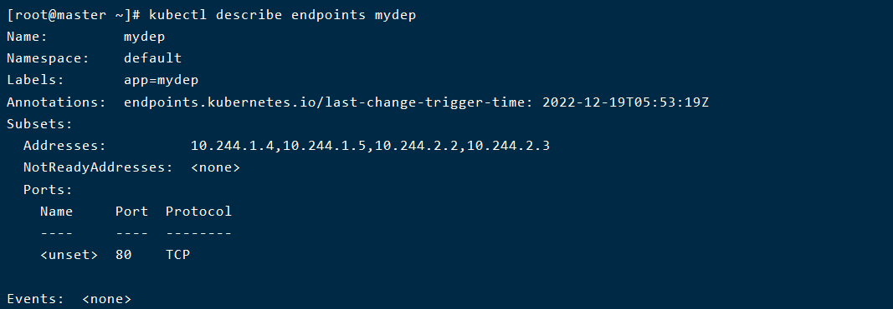

目前还只能集群内部访问这个ip,还能够使用域名的方式+端口访问(这个只能在pod内部访问)

```shell
# 使用ip+端口
curl 10.1.200.145:8080
# 使用域名  name.namespace."svc"(必须在pod内部)
curl mydep.default.svc
```

由于默认使用的是 ClusterIp的方式暴露,因此只能集群内部访问,我们要使用NodePort的方式暴露端口

```shell
# 删掉原先的svc
kubectl delete svc mydep
# 使用NodePort方式暴露
kubectl expose deploy/mydep --port=8080 --target-port=80 --type=NodePort
```

```shell
# 查看对外暴露的端口
kubectl get svc
```

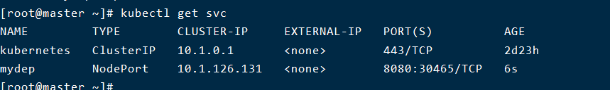

8080是对内部开放的端口,30645是对外部的端口

我们可以使用任意一个结点的ip+这个端口访问内部的nginx

> NodePort 方式暴露的端口在30000-32767之间

### 服务自发现机制

当我们新建立好一个service的资源对象的时候,会将这个pod的ip和端口等信息注入到所有的pod中,这样所有的pod都能访问这个资源,这个就是k8s的服务自发现机制

两种支持的service发现机制: 环境变量注入和DNS

#### 环境变量注入方式

kubelet在创建pod时会自动添加所有可用的service环境变量到该pod中去,因此pod就能访问service,但是这样有个缺点就是,得先创建service,再创建pod,已经创建的pod无法访问后面创建的service

#### DNS方式

可以通过为k8s集群增加DNS服务器组件,每增加一个service,在DNS服务器中,在其他pod中访问它的域名就能通过DNS服务器得到它的域名,然后配合指定的端口,就能访问到service这个资源对象了

这个方法也有它的缺点:

* 由于缓存的问题,如果service在这中间出现了故障,那么pod里面缓存的ip就不准确
* 每个pod频繁请求DNS,也会给系统带来比较大的负荷

### service的工作原理

k8s集群中的结点都运行着kube-proxy,它是实现service的主要组件,它有两种工作模式

#### userspace

每建立一个service,kube-proxy就会在宿主机上监听一个端口,与这个service对应起来,当收到serviceip+端口的流量时,通过定制好的iptabels将流量重定向到这个端口,然后kube-proxy将流量代理到指定的pod里面

#### iptables

这个模式下,kube-proxy只负责建立iptables的路由规则,其余工作由iptabels的内核完成

> k8s的service的设计原则:任何一个结点上的kube-proxy都能够正确的将流量导向任何一个被service代理的pod,而这个kube-proxy不需要和被代理的pod在同一个宿主机

# 存储抽象

我们如果使用本地容器卷的模式,当主机挂掉了之后,k8s转移pod到其他主机上,但是其他主机上没有这个容器卷,因此我们要整一个共享的存储空间

## 环境准备

```shell
yum install -y nfs-utils  # 所有结点安装
```

主节点

```shell
#nfs主节点
echo "/nfs/data/ *(insecure,rw,sync,no_root_squash)" > /etc/exports

mkdir -p /nfs/data
systemctl enable rpcbind --now
systemctl enable nfs-server --now
#配置生效
exportfs -r
```

工作结点

```shell
showmount -e 192.168.100.3

#执行以下命令挂载 nfs 服务器上的共享目录到本机路径 /root/nfsmount
mkdir -p /nfs/data

mount -t nfs 192.168.100.3:/nfs/data /nfs/data
# 写入一个测试文件
echo "hello nfs server" > /nfs/data/test.txt
```


# 创建资源YAML详解

定义k8s的资源对象配置文件yaml一般包含四个部分

* apiVersion 这个表示版本 不同的api版本创建的资源对象可能不一样
* kind 资源类型,表示你要创建什么样的资源,一般有 Pod Deployment Service Ingress 等等
* metadata 表示元数据,资源名称,所属namespace 标签
* spec 资源规范字段,比如用什么容器,重启策略         

## 创建pod 

总结

```yaml
apiVersion: v1       #必选，版本号，例如v1
kind: Pod       #必选，Pod
metadata:       #必选，元数据
  name: string       #必选，Pod名称
  namespace: string    #必选，Pod所属的命名空间
  labels:      #自定义标签
    - name: string     #自定义标签名字
  annotations:       #自定义注释列表
    - name: string
spec:         #必选，Pod中容器的详细定义
  containers:      #必选，Pod中容器列表
  - name: string     #必选，容器名称
    image: string    #必选，容器的镜像名称
    imagePullPolicy: [Always | Never | IfNotPresent] #获取镜像的策略 Alawys表示下载镜像 IfnotPresent表示优先使用本地镜像，否则下载镜像，Nerver表示仅使用本地镜像
    command: [string]    #容器的启动命令列表，如不指定，使用打包时使用的启动命令
    args: [string]     #容器的启动命令参数列表
    workingDir: string     #容器的工作目录
    volumeMounts:    #挂载到容器内部的存储卷配置
    - name: string     #引用pod定义的共享存储卷的名称，需用volumes[]部分定义的的卷名
      mountPath: string    #存储卷在容器内mount的绝对路径，应少于512字符
      readOnly: boolean    #是否为只读模式
    ports:       #需要暴露的端口库号列表
    - name: string     #端口号名称
      containerPort: int   #容器需要监听的端口号
      hostPort: int    #容器所在主机需要监听的端口号，默认与Container相同
      protocol: string     #端口协议，支持TCP和UDP，默认TCP
    env:       #容器运行前需设置的环境变量列表
    - name: string     #环境变量名称
      value: string    #环境变量的值
    resources:       #资源限制和请求的设置
      limits:      #资源限制的设置
        cpu: string    #Cpu的限制，单位为core数，将用于docker run --cpu-shares参数
        memory: string     #内存限制，单位可以为Ei, Pi, Ti, Gi, Mi , Ki ，将用于docker run --memory参数
      requests:      #资源请求的设置
        cpu: string    #Cpu请求，容器启动的初始可用数量
        memory: string     #内存清楚，容器启动的初始可用数量
    livenessProbe:     #对Pod内个容器健康检查的设置，当探测无响应几次后将自动重启该容器，检查方法有exec、httpGet和tcpSocket，对一个容器只需设置其中一种方法即可
      exec:      #对Pod容器内检查方式设置为exec方式
        command: [string]  #exec方式需要制定的命令或脚本
      httpGet:       #对Pod内个容器健康检查方法设置为HttpGet，需要制定Path、port
        path: string   # 请求路径
        port: number   # 端口
        host: string   # 地址
        scheme: string  # 协议
        HttpHeaders:
        - name: string
          value: string
      tcpSocket:     #对Pod内个容器健康检查方式设置为tcpSocket方式
         port: number
       initialDelaySeconds: 0  #容器启动完成后首次探测的时间，单位为秒
       timeoutSeconds: 0   #对容器健康检查探测等待响应的超时时间，单位秒，默认1秒
       periodSeconds: 0    #对容器监控检查的定期探测时间设置，单位秒，默认10秒一次
       successThreshold: 0
       failureThreshold: 0
       securityContext:
         privileged:false
    restartPolicy: [Always | Never | OnFailure]#Pod的重启策略，Always表示一旦不管以何种方式终止运行，kubelet都将重启，OnFailure表示只有Pod以非0退出码退出才重启，Nerver表示不再重启该Pod
    nodeSelector: obeject  #设置NodeSelector表示将该Pod调度到包含这个label的node上，以key：value的格式指定
    imagePullSecrets:    #Pull镜像时使用的secret名称，以key：secretkey格式指定
    - name: string
    hostNetwork:false      #是否使用主机网络模式，默认为false，如果设置为true，表示使用宿主机网络
   volumes:       #在该pod上定义共享存储卷列表
   - name: string     #共享存储卷名称 （volumes类型有很多种）
      emptyDir: {}     #类型为emtyDir的存储卷，与Pod同生命周期的一个临时目录。为空值
      hostPath: string     #类型为hostPath的存储卷，表示挂载Pod所在宿主机的目录
        path: string     #Pod所在宿主机的目录，将被用于同期中mount的目录
      secret:      #类型为secret的存储卷，挂载集群与定义的secre对象到容器内部
        scretname: string  
        items:     
        - key: string
          path: string
      configMap:     #类型为configMap的存储卷，挂载预定义的configMap对象到容器内部
        name: string
        items:
        - key: string

```

尝试

```yaml
apiVersion: v1  # 指定api版本 必选
kind: Pod   # 指定资源类型 必选
metadata:   # 元数据 必选
  name: my-nginx   # 设置pod名称 必选
  namespace: default  # 指定命名空间 必选
  labels: # 自定义标签,这个标签可以在选择pod的时候起作用
   run: nginx
spec:  # 描述pod里面的容器 必选
  containers: # 容器列表 必选
  - name: mynginx # 容器名字
    image: nginx # 容器镜像
    imagePullPolicy: IfNotPresent  # 镜像拉取策略,Always 总是下载镜像  IfNotPresent 本地不存在再下载 Never 仅使用本地镜像
    command: [/docker-entrypoint.sh] # 指定容器启动命令
    args: [ "nginx", "-g", "daemon off;" ]  # 指定参数
    workingDir: /
    volumeMounts:  # 容器卷的配置
    - name: html  # 指定容器卷名字
      mountPath: /usr/share/nginx/html # 挂在到容器的目录
    ports:   # 需要暴露端口的配置
    - name: web   
      containerPort: 80  # 容器需要暴露的端口
      hostPort: 80  # 宿主机需要暴露的端口
      protocol: TCP  # 使用协议
    env:  # 指定容器环境变量
    - name: djm  # 变量名字
      value: nb  # 变量值
    resources: # 资源限制和请求设置
      limits:  # 资源限制
        cpu: 1 # 限制CPU的核数
        memory: 200Mi  # 限制内存 
    livenessProbe: #对Pod内个容器健康检查的设置，当探测无响应几次后将自动重启该容器，检查方法有exec、httpGet和tcpSocket，对一个容器只需设置其中一种方法即可
       httpGet: # 进行http请求检查容器健康状态
         path: /  # 请求路径
         port: 80   # 端口
         host: localhost # 主机
       initialDelaySeconds: 1  # 启动后一秒检查  单位都是秒
       timeoutSeconds: 1  # 超时时间
       periodSeconds: 10  # 检查周期
     restartPolicy: Always  # 重启策略 Always 只要容器挂了,就重启, OnFailure pod以非0 表示退出才容器 Never 表示不重启
  volumes:       #在该pod上定义共享存储卷列表
  - name: html     #共享存储卷名称 （volumes类型有很多种）
    nfs:  # 使用nfs
      server: 192.168.100.3
      path: /nfs/data/nginx
        
```

检测我们的健康检查生效,失败的原因是没有文件,我们需要在宿主机上放一个文件,在宿主机上

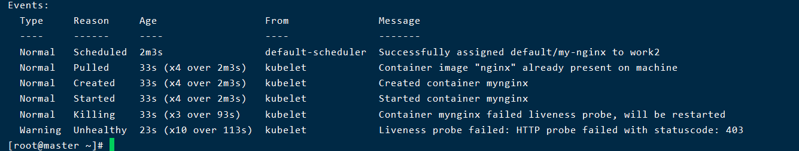

验证环境变量

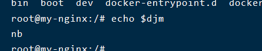

## 创建Deployment

总结

```yaml
apiVersion: apps/v1  # 指定api版本，此值必须在kubectl api-versions中 
kind: Deployment  # 指定创建资源的角色/类型  
metadata:  # 资源的元数据/属性
  name: demo  # 资源的名字，在同一个namespace中必须唯一
  namespace: default # 部署在哪个namespace中
  labels:  # 设定资源的标签
    app: demo
    version: stable
spec: # 资源规范字段
  replicas: 1 # 声明副本数目
  revisionHistoryLimit: 3 # 保留历史版本
  selector: # 选择器
    matchLabels: # 匹配标签
      app: demo
      version: stable
  strategy: # 策略
    rollingUpdate: # 滚动更新
      maxSurge: 30% # 最大额外可以存在的副本数，可以为百分比，也可以为整数
      maxUnavailable: 30% # 示在更新过程中能够进入不可用状态的 Pod 的最大值，可以为百分比，也可以为整数
    type: RollingUpdate # 滚动更新策略
  template: # 模版
  ## 后面就是创建pod的yaml代码了,没有kind和apiVersion两个模块
    metadata: # 资源的元数据/属性
      annotations: # 自定义注解列表
        sidecar.istio.io/inject: "false" # 自定义注解名字
      labels: # 设定资源的标签
        app: demo
        version: stable
    spec: # 资源规范字段
      containers:
      - name: demo # 容器的名字  
        image: demo:v1 # 容器使用的镜像地址  
        imagePullPolicy: IfNotPresent # 每次Pod启动拉取镜像策略，三个选择 Always、Never、IfNotPresent
                                      # Always，每次都检查；Never，每次都不检查（不管本地是否有）；IfNotPresent，如果本地有就不检查，如果没有就拉取
        resources: # 资源管理
          limits: # 最大使用
            cpu: 300m # CPU，1核心 = 1000m
            memory: 500Mi # 内存，1G = 1024Mi
          requests:  # 容器运行时，最低资源需求，也就是说最少需要多少资源容器才能正常运行
            cpu: 100m
            memory: 100Mi
        livenessProbe: # pod 内部健康检查的设置
          httpGet: # 通过httpget检查健康，返回200-399之间，则认为容器正常
            path: /healthCheck # URI地址
            port: 8080 # 端口
            scheme: HTTP # 协议
            # host: 127.0.0.1 # 主机地址
          initialDelaySeconds: 30 # 表明第一次检测在容器启动后多长时间后开始
          timeoutSeconds: 5 # 检测的超时时间
          periodSeconds: 30 # 检查间隔时间
          successThreshold: 1 # 成功门槛
          failureThreshold: 5 # 失败门槛，连接失败5次，pod杀掉，重启一个新的pod
        readinessProbe: # Pod 准备服务健康检查设置
          httpGet:
            path: /healthCheck
            port: 8080
            scheme: HTTP
          initialDelaySeconds: 30
          timeoutSeconds: 5
          periodSeconds: 10
          successThreshold: 1
          failureThreshold: 5
        #也可以用这种方法  
        #exec: 执行命令的方法进行监测，如果其退出码不为0，则认为容器正常  
        #  command:  
        #    - cat  
        #    - /tmp/health  
        #也可以用这种方法  
        #tcpSocket: # 通过tcpSocket检查健康 
        #  port: number
        ports:
          - name: http # 名称
            containerPort: 8080 # 容器开发对外的端口
            protocol: TCP # 协议
      imagePullSecrets: # 镜像仓库拉取密钥
        - name: harbor-certification
      affinity: # 亲和性调试
        nodeAffinity: # 节点亲和力
          requiredDuringSchedulingIgnoredDuringExecution: # pod 必须部署到满足条件的节点上
            nodeSelectorTerms: # 节点满足任何一个条件就可以
            - matchExpressions: # 有多个选项，则只有同时满足这些逻辑选项的节点才能运行 pod
              - key: beta.kubernetes.io/arch
                operator: In
                values:
                - amd64
```


尝试


# k8s网络网络原理


> 在k8s集群的节点中使用docker ps，总是会发现一堆名为pause的容器，就是这个原因，pause是为多个业务容器提供共享的ns的

# 删除


## 删除资源对象

### 删除单个pod

```shell
kubectl delete pods -n namespace podname
```

### 删除deployment

```shell
kubectl delete deploy -n namesapce deployname
```

### 删除service

```
kubectl delete svc -n namesapce svc
```


## 删除单个工作结点

master 结点上执行

```shell
# 让资源对象不会往这个结点上调度
kubectl cordon nodename
# 在master结点上执行,驱逐一个结点,最好在这这个命令之前把在这个结点上的pod删掉
kubectl drain nodename
# 删除节点
kubectl delete node nodename

#如果没有删掉结点上的pod,其实这个时候结点上的pod在其他地方还能访问到,那些规则还存在,等过一段时间后,k8s发现这个结点删除了,会让这些pod转移到其他机器上
```

node结点上执行(为了下次加入集群方便,不报错)(这个时候所有的iptables的规则,以及虚拟网卡,还都存在,我们必须手动清除)

```shell
# 清除旧的信息
kubeadm reset -f
# 能重启一下最好
```

## 删除整个集群

```shell
# 删除所有结点
kubectl delete node --all

# 清理主节点
kubeadm reset -f
rm -fr ~/.kube/  /etc/kubernetes/*  /var/lib/etcd/*

# 清理工作结点
kubeadm reset -f

# 重启一下,或者手动删除iptables规则和网卡

# 如果不想使用了,可以把服务也停了
systemctl enable kubelet --now
```

> 删除定义好的那些规则(这个是全部删除)
>
> iptables -F && iptables -t nat -F && iptables -t mangle -F && iptables -X

# 额外补充

### 自动补全

```shell
# kubectl 
source <(kubectl completion bash)
kubectl completion bash >/etc/bash_completion.d/kubectl

# source <(helm completion bash)
# helm completion bash >/etc/bash_completion.d/helm

# crictl (containered)
source <(crictl completion bash)
crictl completion bash >/etc/bash_completion.d/crictl
```

### 不会写yaml配置文件怎么办

我们只要记得kubectl的命令可以,可以用这个命令来生成yaml文件(不过会有冗余内容哦

```shell
# 创建一个depolyment资源对象的yaml
kubectl create deploy mydep --image=nginx --replicas 5  -o yaml --dry-run=client > depoly.yaml
# 创建一个service 的 yaml
kubectl expose deploy mydep --port=8080 --target-port=80 --type=NodePort -o yaml --dry-run=client > depoly.yaml

# 如果当前资源对象已经存在(这种方式产生的冗余东西会更多)
kubectl get deploy mydep -o wide > depoly.yaml  
kubectl get svc mydep -o wide > depoly.yaml
```

### pod创建流程

kubectl 一次pod创建流程中,各个组件干的活:

kubectl 将命令解析成生成创建pod的参数,通过apiserver提供的接口传递过去

apiserver 收到后,先进行上下文和pod元数据验证两者的namespace是否匹配,不匹配则创建失败,成功则将一些系统元数据(创建时间,uid)注入到pod中,然后检测元数据中系统必须项是否存在,如果为空则抛出异常,终止创建.如果一切顺利,在etcd中持久化pod信息,然后将创建pod的工作交给kube-scheduler和kubelet

kube-scheduler 根据待调度的pod以及可用的工作结点根据算法选取一个最优的绑定策略,然后告诉apiserve选取哪个结点部署pod,apiserve收到后发送请求给结点上的kubelet

kubelet 根据要求只会容器运行时创建容器就可以了


# 遇到的坑和解决办法

有时候虚拟机重启后,网络插件创建的虚拟网卡就没有了,那么有时候这个pod就访问不了了,我们需要重新部署网络插件

```
# master 结点执行 , 删除网络插件
kubectl delete -f kube-flannel.yml
# 删除网卡(所有结点执行)
sudo ifconfig cni0 down
sudo ip link delete cni0
sudo ifconfig flannel.1 down
sudo ip link delete flannel.1
sudo rm -rf /var/lib/cni/flannel/*
sudo rm -rf /var/lib/cni/networks/cbr0/*
sudo rm -rf /var/lib/cni/cache/*
sudo rm -f /etc/cni/net.d/*
sudo systemctl restart kubelet
sudo systemctl restart containerd
sudo chmod a+w /var/run/containerd/containerd.sock

#再次master结点部署网络插件
kubectl apply -f kube-flannel.yml

```

