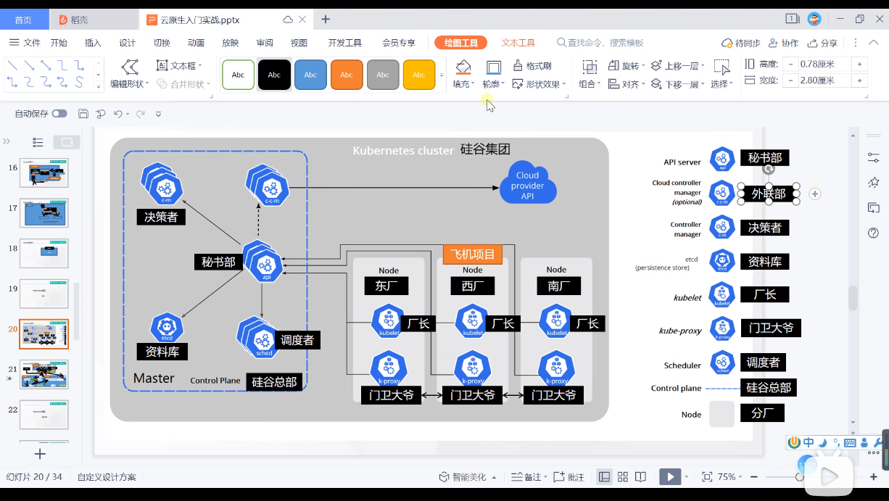

## 前言

这个总结都是跟着b站雷丰阳老师的课程总结的

## 基本概念

master结点: 管理work结点,不干重货

work结点: 重任务基本放在work结点上




masternode 总部

workernode 工厂

kubelet 相当于厂长(所以每个结点里面都得安装kubelet)

controller-manager 决策者

sheduler 调度者

ETCD 键值数据库,放公司文件的地方

api-server 秘书(所以人都要跟他打交道)

kube-proxy 门卫大爷 (知道每个工厂的信息,可以负载均衡)

kubectl 控制总部的东西,向总部发送命令

每个结点还得安装好容器运行时环境,就是docker

## 集群搭建流程

1. 每台机器安装**docker kubelet** kubectl  kbdeadm,后面两个可以搭建好了后就可以删除了(主节点不要删除)
2. 选择一个主节点,kubeandm init 之后,就会拥有总部的所有东西
3. 工作结点通过kubeadm join 到主节点,就会产生kube-proxy

## kubeadm创建集群

### 基础环境

两台台虚拟机的ip地址

```
master: 192.168.100.3
work1: 192.168.100.4
```

注意点: 

* 主机名一定不能相同,可以通过hostnamectl set-hostname 修改
* 关闭交换区
* 允许桥接流量

```shell
#各个机器设置自己的域名
hostnamectl set-hostname xxxx


# 将 SELinux 设置为 permissive 模式（相当于将其禁用）
sudo setenforce 0
sudo sed -i 's/^SELINUX=enforcing$/SELINUX=permissive/' /etc/selinux/config

#关闭swap
swapoff -a  
sed -ri 's/.*swap.*/#&/' /etc/fstab

#允许 iptables 检查桥接流量
cat <<EOF | sudo tee /etc/modules-load.d/k8s.conf
br_netfilter
EOF

cat <<EOF | sudo tee /etc/sysctl.d/k8s.conf
net.bridge.bridge-nf-call-ip6tables = 1
net.bridge.bridge-nf-call-iptables = 1
net.ipv4.ip_forward = 1
EOF
sudo sysctl --system
```

### 安装kubelet、kubeadm、kubectl

```shell
cat <<EOF | sudo tee /etc/yum.repos.d/kubernetes.repo
[kubernetes]
name=Kubernetes
baseurl=http://mirrors.aliyun.com/kubernetes/yum/repos/kubernetes-el7-x86_64
enabled=1
gpgcheck=0
repo_gpgcheck=0
gpgkey=http://mirrors.aliyun.com/kubernetes/yum/doc/yum-key.gpg
   http://mirrors.aliyun.com/kubernetes/yum/doc/rpm-package-key.gpg
exclude=kubelet kubeadm kubectl
EOF


sudo yum install -y kubelet-1.20.9 kubeadm-1.20.9 kubectl-1.20.9 --disableexcludes=kubernetes

sudo systemctl enable --now kubelet
```

### 集群部署

#### 下载各个机器所需要的镜像

```shell
#创建脚本
sudo tee ./images.sh <<-'EOF'
#!/bin/bash
images=(
kube-apiserver:v1.20.9
kube-proxy:v1.20.9
kube-controller-manager:v1.20.9
kube-scheduler:v1.20.9
coredns:1.7.0
etcd:3.4.13-0
pause:3.2
)
for imageName in ${images[@]} ; do
docker pull registry.cn-hangzhou.aliyuncs.com/lfy_k8s_images/$imageName
done
EOF

#赋予脚本执行权限,并且执行脚本
chmod +x ./images.sh && ./images.sh
```

#### 初始化主节点

```shell
#所有机器添加master域名映射，以下需要修改为自己的
echo "192.168.100.3  cluster-endpoint" >> /etc/hosts
 echo "192.168.100.4  work1" >> /etc/hosts
 echo "192.168.100.3 master" >> /etc/hosts

#主节点初始化
kubeadm init \
--apiserver-advertise-address=192.168.100.3  \
--control-plane-endpoint=cluster-endpoint \
--image-repository registry.cn-hangzhou.aliyuncs.com/lfy_k8s_images \
--kubernetes-version v1.20.9 \
--service-cidr=10.96.0.0/16 \
--pod-network-cidr=192.168.0.0/16
# 原来是192.168.0.0/16 的这个地址段的,但是因为我的虚拟机ip都是192.168开头的,所以我得改掉子网掩码,后面配置网络组件也需要去修改一下
#所有网络范围不重叠
```

初始化的时候遇到的问题:

> ```shell
> [kubelet-check] It seems like the kubelet isn't running or healthy.
> [kubelet-check] The HTTP call equal to 'curl -sSL http://localhost:10248/healthz' failed with error: Get http://localhost:10248/healthz: dial tcp 127.0.0.1:10248: connect: connection refused.
> 
> #谷歌后给我的解决方案是:
> sudo vim /etc/docker/daemon.json
> #在里面加入这句话
> "exec-opts": ["native.cgroupdriver=systemd"]
> ```

成功后输出(记录一下有用哦,后面工作结点加入的时候需要下面命令

```

To start using your cluster, you need to run the following as a regular user:

  mkdir -p $HOME/.kube
  sudo cp -i /etc/kubernetes/admin.conf $HOME/.kube/config
  sudo chown $(id -u):$(id -g) $HOME/.kube/config

Alternatively, if you are the root user, you can run:

  export KUBECONFIG=/etc/kubernetes/admin.conf

You should now deploy a pod network to the cluster.
Run "kubectl apply -f [podnetwork].yaml" with one of the options listed at:
  https://kubernetes.io/docs/concepts/cluster-administration/addons/

You can now join any number of control-plane nodes by copying certificate authorities
and service account keys on each node and then running the following as root:

  kubeadm join cluster-endpoint:6443 --token 8r6nj9.sws27aao7stqfbni \
    --discovery-token-ca-cert-hash sha256:6ec63f3707eeb9a41b4c3ac68fce38ca77f5d9246c252f37a638295168ca34b9 \
    --control-plane 

Then you can join any number of worker nodes by running the following on each as root:

kubeadm join cluster-endpoint:6443 --token 8r6nj9.sws27aao7stqfbni \
    --discovery-token-ca-cert-hash sha256:6ec63f3707eeb9a41b4c3ac68fce38ca77f5d9246c252f37a638295168ca34b9 


```

初始化完毕后,根据提示输入下面命令**(要执行下面命令后使用kubectl get nodes 才能看到信息哦,不然会提示错误)**

```shell
mkdir -p $HOME/.kube
sudo cp -i /etc/kubernetes/admin.conf $HOME/.kube/config
sudo chown $(id -u):$(id -g) $HOME/.kube/config
```


#### 安装网络组件

```shell
# curl https://docs.projectcalico.org/manifests/calico.yaml -O 这个是最新版的下载
# curl https://docs.projectcalico.org/v3.20/manifests/calico.yaml -O 这个版本我用了之后不行有个容器一直起不来
# curl https://docs.projectcalico.org/archive/v3.21/manifests/calico.yaml -O
# 还要把ip给改一下,我们上面改了默认的ip网段的
vim calico.yaml

#   # no effect. This should fall within `--cluster-cidr`.
#            - name: CALICO_IPV4POOL_CIDR
#              value: "192.168.0.0/16
#  把这里的注释打开,并且改成这样


kubectl apply -f calico.yaml
```

> 遇到问题: error: unable to recognize "calico.yaml": no matches for kind "PodDisruptionBudget" in version "policy/v1",版本对不上
>
> k8s要求一定要版本对上,Google后上面命令已经没有问题了,一定要根据自己的k8s版本来选择组件

> calico 默认会找 **eth0**网卡，如果当前机器网卡不是这个名字，可能会无法启动，需要手动配置以下。
>
> 我这里网卡名是 ens33，不符合默认条件，需要修改 calico.yaml 手动指定一下。
>
> 直接搜索 CLUSTER_TYPE,然后添加一个和 CLUSTER_TYPE 同级的 **IP_AUTODETECTION_METHOD **字段，具体如下：
>
> ```yaml
> # value 就是指定你的网卡名字，我这里网卡是 ens33，然后直接配置的通配符 ens.*
> - name: IP_AUTODETECTION_METHOD  
>   value: "interface=ens.*"
> ```
>
> 

#### 加入工作结点

在每个工作机器上输入下面命令

```shell
kubeadm join cluster-endpoint:6443 --token 8dzlpt.w6fveozx4s4vfyl7 \
    --discovery-token-ca-cert-hash sha256:1d0f8781c1aaa5f8e65ee4028ef15c03230fe7f8908828e0c6d0066d7fd0492f 
```

> 遇到问题: 工作结点加入的时候,出现端口占用问题 , 谷歌说
>
> kubeadm reset    
>
> 重启后发现确实解决问题

> 另外 这个令牌是有一定的时间期限的当这个令牌到期后,我们需要在master结点的机器上执行下面命令得到新的令牌
>
> kubeadm token create --print-join-command
>
> 然后将创建的新的令牌在工作结点上去执行

每个结点都有一定的自愈能力,我们关机开机后,他也会自动重启

```shell
# 在主机里输入下面命令,然后查看各个结点的状态
kubectl get nodes
```

#### 安装dashboard 可视化界面

##### 部署

```shell
kubectl apply -f https://raw.githubusercontent.com/kubernetes/dashboard/v2.3.1/aio/deploy/recommended.yaml
```

下载不了这个文件的话,就用本地用梯子下载好,然后上传上去,再apply

##### 设置访问端口

```shell
kubectl edit svc kubernetes-dashboard -n kubernetes-dashboard
#上面命令会打开一个文件,我们需要修改一些配置
# 输入 /type 搜索到目标位置

#   type: ClusterIP   将这个东西变成
#   type: NodePort   
#  要注意yaml的语法哦,空格
# 然后保存退出

# 看dashboard 运行在哪个端口
kubectl get svc -A |grep kubernetes-dashboard 

# [root@master ~]# kubectl get svc -A |grep kubernetes-dashboard 
# kubernetes-dashboard   dashboard-metrics-scraper   ClusterIP   10.96.75.255    <none>        8000/TCP               
# kubernetes-dashboard   kubernetes-dashboard        NodePort    10.96.115.112   <none>        443:30297/TCP         
        
```

然后我们如果要访问这个网站,必须看哪个结点上开启了kubernetes-dashboard-658485d5c7-slksv 这个容器,就用他的ip+这个端口就行

然后我的work1 开启了kubernetes-dashboard-658485d5c7-slksv  这个容器,所以用这个ip可以可以进去

```shell
# 去搜哪个有这个就用它的ip 
docker ps | grep kubernetes-dashboard-658485d5c7-slksv 
```


> 如果在Google浏览器里面输入 https://ip:端口显示不安全,而且不让进去的话,就在键盘直接输入 thisisunsafe 然后就可以进去了

#### 创建访问账号

我们发现需要登录,所有要创建账号

```shell
#创建访问账号，准备一个yaml文件； 
vi dash.yaml
```

```yaml
apiVersion: v1
kind: ServiceAccount
metadata:
  name: admin-user
  namespace: kubernetes-dashboard
---
apiVersion: rbac.authorization.k8s.io/v1
kind: ClusterRoleBinding
metadata:
  name: admin-user
roleRef:
  apiGroup: rbac.authorization.k8s.io
  kind: ClusterRole
  name: cluster-admin
subjects:
- kind: ServiceAccount
  name: admin-user
  namespace: kubernetes-dashboard
```

```shell
# 然后执行
kubectl apply -f dash.yaml
```


然后获得令牌

```shell
#获取访问令牌
kubectl -n kubernetes-dashboard get secret $(kubectl -n kubernetes-dashboard get sa/admin-user -o jsonpath="{.secrets[0].name}") -o go-template="{{.data.token | base64decode}}"
```

```
eyJhbGciOiJSUzI1NiIsImtpZCI6ImNhWXVDWjVPU2ZMUmlMUFBjQVBYOHBVcjY2NEkzMFRYTFJyT29aMHI2X1UifQ.eyJpc3MiOiJrdWJlcm5ldGVzL3NlcnZpY2VhY2NvdW50Iiwia3ViZXJuZXRlcy5pby9zZXJ2aWNlYWNjb3VudC9uYW1lc3BhY2UiOiJrdWJlcm5ldGVzLWRhc2hib2FyZCIsImt1YmVybmV0ZXMuaW8vc2VydmljZWFjY291bnQvc2VjcmV0Lm5hbWUiOiJhZG1pbi11c2VyLXRva2VuLThzeGhuIiwia3ViZXJuZXRlcy5pby9zZXJ2aWNlYWNjb3VudC9zZXJ2aWNlLWFjY291bnQubmFtZSI6ImFkbWluLXVzZXIiLCJrdWJlcm5ldGVzLmlvL3NlcnZpY2VhY2NvdW50L3NlcnZpY2UtYWNjb3VudC51aWQiOiJiY2Y1ZGM4NS0yNWQ1LTQxZTgtOTNjYy0xNTI5N2FhYjE3OWIiLCJzdWIiOiJzeXN0ZW06c2VydmljZWFjY291bnQ6a3ViZXJuZXRlcy1kYXNoYm9hcmQ6YWRtaW4tdXNlciJ9.XK2C65JnSqMs58bPyVS-4XvUVhAfwgxBkABFIduNZIzvgR0niUnETWrnKOjUsEdhlxNMatieDByZwC5-yR88opwj-2FNDQMAlnL5ZHskz8QICYvhhKlE-q0RuauuSeDTMyGi4Jpbe-IgsssHAQWNDWoi87JXoWykNTnBqR4k7K0AONuL5ZaSNXBzeoJ92xAeOCttPXnA3N7Uc1uGq01iU9KUV08bkCYRfz_BG5-x7cIoJXeHs27lkrguIC62TE9Hy0jZkspUt6rdAHGiuXKRHC3WUls5NiPFX3N5G7jeTXtrP4gbBxjkZ2MYQqIwyOvQS3we349Cv0RgV27RRZiEDw
```


## k8s 核心概念

### 资源的创建方式

1. 通过命令行的方式
2. 通过yaml的方式

### namespace

名称空间,用来隔离集群资源,默认只隔离资源,不隔离网络

```shell
kubectl get ns   #用来查看名称空间
```

我们以后创建的资源不指定名称空间,默认在default的名称空间

命令行创建

* kubectl create ns hello  创建名称空间
* kubectl delete ns hello 删除名称空间

通过配置文件也可以

```yaml
apiVersion: v1
kind: Namespace
metadata:
  name: hello
```

* 创建 kubectl apply  -f hello.yaml
* 删除 kubectl delete -f hello.yaml

### pod

运行中的一组容器,pod是k8s中应用的最小单位

容器被封装在pod中,pod可以有一个或者多个容器,k8s不是直接操作容器,而是直接操作pod


## 删除集群

```shell
#所有结点停止kubelet 
systemctl stop kubelet

# 所有结点删掉所有容器
docker rm -f  $(docker ps -aq)

#主节点 删掉配置文件
rm -rf /etc/kubernetes/manifests/kube-apiserver.yaml
rm -rf  /etc/kubernetes/manifests/kube-controller-manager.yaml
rm -rf /etc/kubernetes/manifests/kube-scheduler.yaml
rm -rf  /etc/kubernetes/manifests/etcd.yaml
rm -rf  /var/lib/etcd
rm -rf ~/.kube


# 工作结点
rm -rf /etc/kubernetes/kubelet.conf
rm -rf  /etc/kubernetes/pki/ca.crt
```

## 额外补充

#### 设置kubectl 自动补全

前提是kubectl安装好了哦,一般设置单用户就好了

```shell
# 来到家目录
cd ~

echo 'source <(kubectl completion bash)' >>~/.bashrc

# 重新加载bash
exec bash

```

