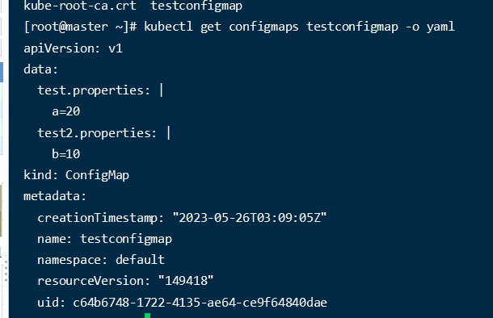
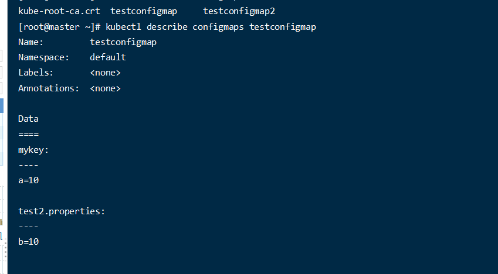
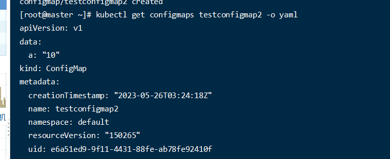
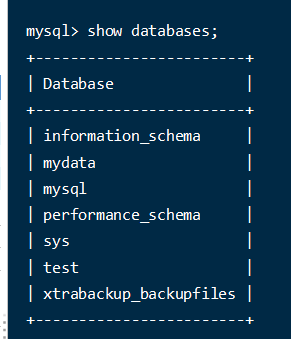

# 资源对象


## pod

`Pod` 代表的是集群上处于运行状态的一组 [容器](https://kubernetes.io/zh-cn/docs/concepts/overview/what-is-kubernetes/#why-containers) 的集合, 也就是说一个pod里面可以有多个容器,  **容器是容器运行时的最小调度单位**, **在k8s中pod才是最小调度单位**

当在你的集群中运行了某个 Pod，但是 Pod 所在的 [节点](https://kubernetes.io/zh-cn/docs/concepts/architecture/nodes/) 出现致命错误时， **所有该节点上的 Pod 的状态都会变成失败**。Kubernetes 将这类失败视为最终状态： **即使该节点后来恢复正常运行**，也需要创建新的 `Pod` 以恢复应用。

任何给定的 Pod （由 UID 定义）从不会被“重新调度（rescheduled）”到不同的节点； 相反，这一 Pod 可以被一个新的、几乎完全相同的 Pod 替换掉。 如果需要，新 Pod 的名字可以不变，但是其 UID 会不同。

**一个pod里面的容器在同一个网络命名空间 可以通过localhost 互相访问**

### 容器重启策略

1. `Always`：无论容器的退出状态码是什么，都将重启容器。这是默认策略。
2. `OnFailure`：只有当容器以非零状态码退出时，才会重启容器。
3. `Never`：不论容器的退出状态码是什么，都不会重启容器。

容器重启不会删除pod,当重启次数超过一定次数后, 这个pod就会进入CrashLoopBackOff, 所以这个

### init容器

在 [Pod](https://kubernetes.io/zh-cn/docs/concepts/workloads/pods/) 内的应用容器启动之前运行。Init 容器可以包括一些**应用镜像中不存在的实用工具和安装脚本**。可以通过挂载卷的方式为其他应用容器做一些事情,  如果有多个init容器的话, 会按照顺序依次执行init容器,然后启动主容器, 如果失败的话,后面的容器和主容器都不会启动, 而且会按照重启策略来进行操作,   所以说我们可以在init容器中做一些先决条件判断, 等到满足了再退出init容器, 然后继续启动其他init容器和主容器

> init容器是在pause之后运行, pause 会配置网络和容器卷

> 只有修改init容器的镜像才会重启pod,其他都不会影响

举一个官网例子解释一下

```yaml
apiVersion: v1
kind: Pod
metadata:
  name: myapp-pod
  labels:
    app.kubernetes.io/name: MyApp
spec:
  containers:
    - name: myapp-container
      image: busybox:1.28
      command: ["sh", "-c", "echo The app is running! && sleep 3600"]  # 只有当myservice和mydb服务都可用时，才会执行该容器的命令
  initContainers:
    - name: init-myservice
      image: busybox:1.28
      command:
        [
          "sh",
          "-c",
          "until nslookup myservice.$(cat /var/run/secrets/kubernetes.io/serviceaccount/namespace).svc.cluster.local; do echo waiting for myservice; sleep 2; done",
        ]  # 通过nslookup命令检查myservice服务是否可用，如果不可用则休眠2s，然后再次检查，直到myservice服务可用
    - name: init-mydb
      image: busybox:1.28
      command:
        [
          "sh",
          "-c",
          "until nslookup mydb.$(cat /var/run/secrets/kubernetes.io/serviceaccount/namespace).svc.cluster.local; do echo waiting for mydb; sleep 2; done",
        ] # 通过nslookup命令检查mydb服务是否可用，如果不可用则休眠2s，然后再次检查，直到mydb服务可用

```


### 探针


在 Kubernetes 中，探针（Probe）是 Kubernetes 使用的一种机制，**通过其中的一些函数来检测 Pod 中容器的状态**。这些探针检查的状态包括是否存活、是否已就绪以及是否能够成功运行等。根据探测结果，Kubernetes 可以做出相应的决定，如重启容器、重新调度、以及发送服务不可用的信号。

有三种类型的探针：

1. **Liveness Probe**：这种探针用来检测容器是否还在运行。如果探针检测失败，**Kubernetes 将会杀掉并重启容器**。
2. **Readiness Probe**：这种探针用来检测容器是否已准备好接收请求。如果探针检测失败**，Pod 会从其服务的 Endpoint 中被移除**，直至探针再次成功。**不会干掉容器**
3. **Startup Probe**：这种探针用来检测应用程序在启动过程中是否成功。如果这个探针失败到指定次数，Kubernetes 将会杀掉并重启容器，如果探测成功，其他探针才会开始工作, **只要检测成功之后就不会再检测**

存活探针 和就绪探针   他们分别用来检测 容器是否存活  和 是否就绪   关于为什么需要存活探针这个很好说明,  当容器不能正常工作的时候但是容器又不会自己退出的话, pod其实还是运行状态的,但是k8s是检测不出来的,  所以我们需要一个存活探针来定义检测容器是否正常运行,如果不能正常工作的话就重启容器

探针检测机制有三种

1. **ExecAction**：在容器内执行指定命令，如果返回零则认为成功。 对应资源字段 exec
2. **TCPSocketAction**：对指定端口上的容器进行 TCP 检查，如果端口开放则认为成功。 对应资源字段 tcpSocket
3. **HTTPGetAction**：对指定的端口和路径上的容器进行 HTTP Get 请求，如果返回状态码在 200 到 399 之间则认为成功。 对应资源字段 httpGet

> 就绪探针也会一直工作

### 容器生命周期钩子函数

 当一个容器启动后，Kubernetes 将立即发送 postStart 事件,调用指定的钩子函数；在容器被终结之前， Kubernetes 将发送一个 preStop 事件,调用指定的钩子函数。容器可以为每个事件指定一个处理程序。

```
apiVersion: v1
kind: Pod
metadata:
  name: lifecycle-pod
spec:
  containers:
    - name: lifecycle-demo-container
      image: busybox
      command: ["sh", "-c", "sleep 6000"]
      lifecycle:
        postStart:
          exec:
            command: ["/bin/sh", "-c", "echo 'postStart Hook: Everything is up and running!' > /usr/share/message"]
        preStop:
          exec:
            command: ["/bin/sh", "-c", "echo 'preStop Hook: Preparing for shutdown!' > /usr/share/message"]

```

> 生命周期钩子 `postStart` 和 `preStop` 中的命令的输出并不会被写入到容器的 stdout 或 stderr，因此你不能通过 `kubectl logs` 命令查看这些输出

### DNS策略

在 Kubernetes 中，每个 Pod 都有一个 DNS 策略，它决定了 Pod 中容器的 `/etc/resolv.conf` 文件如何被配置。这个文件被用来解析 DNS 请求。DNS 策略可以设置为以下几种值：

- `Default`: 默认情况下，Pod 的 DNS 解析配置从节点上继承。
- `ClusterFirst`: 如果 Pod 运行在启用了 DNS 的集群中，并且 Pod 的 `dnsPolicy` 被设置为 `ClusterFirst`，那么当 Pod 尝试访问一个服务（如 `my-svc.my-namespace.svc.cluster-domain.example`），它首先会使用集群内部的 DNS 服务进行名称解析。
- `ClusterFirstWithHostNet`: 对于使用了主机网络的 Pod，其 DNS 解析配置应设为 `ClusterFirstWithHostNet`。这将让这些 Pod 能够通过 Kubernetes 的 DNS 服务解析其他服务的名称，同时也能解析主机网络中的 DNS。
- `None`: 如果设置为 `None`，你可以通过 `dnsConfig` 选项自定义 DNS 解析参数。

对于pod里面的/etc/resolv.conf解释

- `search default.svc.cluster.local svc.cluster.local cluster.local`：这是搜索域条目，**当试图访问一个没有指定全域名（FQDN）的主机时，系统会尝试在这些域名后面添加这个搜索域**，以便完成主机名的解析。比如，在这个设置下，如果你尝试访问 `headless-service`，那么系统首先会尝试解析 `headless-service.default.svc.cluster.local`，如果没有找到，那么会尝试解析 `headless-service.svc.cluster.local`，最后会尝试解析 `headless-service.cluster.local`。
- `nameserver 10.1.0.10`：**这是 DNS 服务器的 IP 地址，这个 IP 地址是 Kubernetes 集群内部的 DNS 服务器**（通常是 CoreDNS 或 kube-dns）的 IP 地址。
- `options ndots:5`：这是一个设置项，表示如果一个域名中包含的点的数量大于等于这个值，那么就会直接进行全域名解析，而不会再添加搜索域。在这个设置下，如果你尝试访问 `a.b.c.d.e`（这个域名中包含了 4 个点），那么系统就会直接尝试进行全域名解析，而不会添加搜索域。

在我们自定义dns的时候, 也就是配置上面三项东西

### 静态pod

静态pod是在每个结点上执行的,它是通过kubelet进行管理创建的,  但是无法通过apisever去管理它,  因此他也不能使用一些集群中的资源,比如pvc,configmap,service 等等

## 命名空间

在 Kubernetes 中，命名空间（Namespace）**是一种将集群资源分隔成多个虚拟集群的机制**。命名空间为名称提供了一个范围。**资源的名称需要在命名空间内保持唯一，但不需要跨命名空间保持唯一**。不同的命名空间可以有相同名称的资源。

命名空间的主要用途包括：

1. **资源隔离**：命名空间可以用来在物理集群中创建多个虚拟集群。每个命名空间的资源（如 Pod、服务和部署等）是隔离的，**这可以防止一个命名空间中的应用干扰其他命名空间中的应用**。

2. **权限控制**：命名空间可以和 RBAC（基于角色的访问控制）一起使用，以限制用户或应用对特定命名空间的访问。例如，你可以创建一个命名空间，然后授予一个用户对该命名空间的编辑权限，这样该用户就可以在这个命名空间中创建和管理资源，但不能影响其他命名空间。

3. **资源配额**：命名空间还可以和 Resource Quotas 一起使用，以限制命名空间可以使用的资源数量。例如，你可以为一个命名空间设置一个限制，以防止它使用过多的 CPU 或内存资源。

4. **组织和标签**：命名空间也可以用来组织和标记资源。这对于大型集群或多租户集群特别有用，你可以使用命名空间将相关的应用和服务组织在一起，或者将开发环境、测试环境和生产环境的资源分隔开。

总的来说，命名空间是 Kubernetes 中的一个重要概念，它提供了一种有效的方式来隔离、管理和组织集群资源。


## Deployments

Deployment 是一种高级概念，**用于描述预期的应用程序状态**，并使 Kubernetes **能够改变实际状态以达到预期状态**。当我们修改了描述状态的时候, k8s会帮我们去改变实际状态达到预期状态,  比如我们缩放pod数量,以及修改容器镜像.

资源文件

```yaml
apiVersion: apps/v1

kind: Deployment # 资源类型
metadata:
  name: nginx-deployment # 名字
  labels:
    app: nginx # 标签
spec:
  replicas: 3 # pod副本数量
  selector: # 必须字段
    matchLabels:
      app: nginx # 匹配什么样的pod  这里必须和下面的pod的标签一样
  template: # 必须字段
    metadata: # 这里面不需要name属性, 由k8s自动生成
      labels: # pod 标签
        app: nginx
    spec: # pod具体的东西
      containers:
        - name: nginx # 容器名字

          image: nginx:1.14.2

          ports: # 容器使用pod的端口
            - containerPort: 80
```

在 Kubernetes 中，当你进行滚动更新时，可以设置两个关键的参数来控制更新过程中 Pod 的数量：

1. **`maxSurge`**：这个参数定义了相对于所需 Pod 数量的最大超出值。这意味着你可以在更新过程中允许有多少个额外的 Pod。这些额外的 Pod 可以保证在更新过程中有足够的容量来处理应用的负载。这个参数可以是绝对数字（例如 "5"）或者是百分比（例如 "20%"）。
2. **`maxUnavailable`**：**这个参数定义了相对于所需 Pod 数量的最大不可用值**。这意味着你可以在更新过程中允许有多少个 Pod 是不可用的。这个参数可以是绝对数字（例如 "5"）或者是百分比（例如 "20%"）。


## ReplicaSet

它通常用来保证给定数量的、完全相同的 Pod 的可用性

Deployment 是一个更高级的概念，它管理 ReplicaSet，并向 Pod 提供声明式的更新以及许多其他有用的功能。 **因此，我们建议使用 Deployment 而不是直接使用 ReplicaSet**

## statefulset

**无论怎么调度，每个 Pod 都有一个永久不变的 ID**。

- 稳定的、唯一的网络标识符。**这个只是标识符,不是ip, 把pod删除之后, 名字不变,但是ip是会变的**
- 稳定的、持久的存储。
- 有序的、优雅的部署和扩缩。
- 有序的、自动的滚动更新。


## DaemonSet 

DaemonSet 是 Kubernetes 中的一种工作负载对象，**它确保了在每一个或某些特定的集群节点上都运行一个 Pod 的副本**。

DaemonSet 在以下场景中非常有用：

1. **集群级别的日志收集**：例如，你可能希望在每个节点上都运行一个日志收集的 Pod，如 Fluentd 或 Logstash，以收集该节点上所有 Pod 的日志。

2. **集群级别的监控**：例如，你可能希望在每个节点上都运行一个监控的 Pod，如 Prometheus Node Exporter，以收集该节点的硬件和操作系统指标。

3. **节点级别的网络配置**：例如，你可能希望在每个节点上都运行一个网络代理的 Pod，如 Calico 或 kube-proxy，以处理网络路由和负载均衡。

DaemonSet 通过在新节点加入集群时自动在其上部署 Pod，以及在节点被移除时自动删除这些 Pod，来保证每个或某些特定的节点上都有 Pod 运行。这使得 DaemonSet 在需要在每个节点上运行特定服务的场景中非常有用。

## service

在Kubernetes（K8s）中，Service是一种抽象，用于将运行在一组Pods上的应用程序公开为网络服务。与Pod的生命周期相对独立，Service用于连接到Pod。

这里有一些Service的主要用途和特性：

1. **负载均衡和服务发现**：Service可以用作内部的负载均衡器，并且可以通过其DNS名称被发现。每个Service都有一个IP地址（在Service的生命周期内不变），其他Pod可以通过这个IP地址连接到Service。此外，Kubernetes还提供DNS服务，每个Service在Kubernetes集群内部都有一个DNS名称，可以使用此名称连接到Service。

2. **稳定的网络接口**：当背后的Pod被销毁和重新创建时，Service保持其IP地址和DNS名称不变，这为Pods提供了一个稳定的接口。

3. **支持多种服务发现模式**：Service支持多种服务发现模式，包括使用环境变量和DNS进行服务发现。

4. **网络策略**：可以使用NetworkPolicies来定义允许哪些Pod连接到Service。

5. **服务代理**：Service可以公开集群的内部Pods以供外部访问。例如，你可以使用NodePort或LoadBalancer类型的Service将Pods公开到集群外部。

总的来说，Kubernetes中的Service主要用于管理访问Pods的网络访问策略，并为Pods提供负载均衡和服务发现。下面是一个简单地配置项

```yaml
apiVersion: v1
kind: Service
metadata:
  name: nginx-service-hello
spec:
  selector:
    app: nginx-hello
  ports:
    - port: 80
      targetPort: 80
  type: ClusterIP  # 暴露类型,这个只能在集群内部访问, 还有NodePort 可以在集群外部访问,  还有一个LoadBalancer可以多做一个负载均衡
```

在集群内部我们可以使用 serviceip+端口访问  在集群外部我们可以使用 nodeip +端口访问   在pod里面 我们可以通过前两种方式访问, 也可以通过 \<servicename\>.\<namespace\>.svc.\<clusterdomain\> 的域名访问, 后面这个clusterdomain没有设置的话就不用写

### 无头服务

在定义service的时候将ClusterIP 指定为None, 这样的话就不会分配ip给service

在 Kubernetes 中，无头服务（Headless Service）主要是用来对同一个服务的多个后端 Pod 进行服务发现。无头服务与常规服务的主要区别在于，无头服务没有一个稳定的集群 IP 地址，而是直接返回后端 Pod 的 IP 地址列表。**当应用程序需要直接与单个后端 Pod 进行通信**，或者需要知道后端所有 Pod 的 IP 地址时，无头服务就非常有用

无头服务能够为每个pod生成一个dns记录,  记录格式如下   podname.servicename.namespace.svc.cluster.local  例如一个mysql的pod的域名如下  mysql-statefulset-0.mysql-service.default.svc.cluster.local,    

## ingress

Ingress是Kubernetes提供的一种HTTP路由资源，它允许在集群中的服务接收从集群外部来的HTTP和HTTPS流量。Ingress包含一组路由规则，这些规则指导外部的入站连接到集群中的服务。

Ingress可以提供以下功能：

1. **路径基于的路由**：你可以配置Ingress以便基于URL路径来路由流量。例如，请求路径为"/user"的请求可以被路由到"users"服务，而路径为"/products"的请求可以被路由到"products"服务。

2. **主机名基于的路由**：你也可以配置Ingress以便基于请求的主机名来路由流量。例如，"user.example.com"的请求可以被路由到"user"服务，而"products.example.com"的请求可以被路由到"products"服务。

3. **SSL/TLS终止**：Ingress允许你定义SSL/TLS证书，以便你的服务可以接收安全的HTTPS连接。

4. **负载均衡**：Ingress可以工作在多个副本的服务上，提供负载均衡。

使用Ingress的方式有很多种，这主要取决于你所使用的Ingress controller。Ingress controller是实现Ingress的一个组件，它负责实现Ingress的规则。有许多第三方提供了Ingress controller，例如NGINX, Traefik, HAProxy等。

为了使用Ingress，需要安装一个Ingress controller，并定义一个或多个Ingress资源。Ingress资源包含了路由规则的定义，例如如何根据请求路径或主机名路由流量。

我这里使用nginx

```
kubectl apply -f https://raw.githubusercontent.com/kubernetes/ingress-nginx/controller-v1.7.1/deploy/static/provider/cloud/deploy.yaml
```

这是一个使用Ingress的例子：

```yaml
apiVersion: networking.k8s.io/v1
kind: Ingress
metadata:
  name: nginx-ingress-hello

spec:
  ingressClassName: nginx
  rules:
    - host: hello.djm.com
      http:
        paths:
          - path: /
            pathType: Prefix
            backend:
              service:
                name: nginx-service-hello
                port:
                  number: 80
    - host: hello2.djm.com
      http:
        paths:
          - path: /
            pathType: Prefix
            backend:
              service:
                name: nginx-service-hello2
                port:
                  number: 81
```

在这个例子中，任何到"myapp.example.com"的HTTP请求都会被路由到名为"my-service"的服务，服务的端口为8080。

## 定向调度

将pod调度到指定的结点上, 通过标签选择器指定到指定的结点上

我们给某个结点打个标签

```
kubectl label nodes work1 ssd=666
```

然后再资源配置文件里面指定需要结点具有标签

```
apiVersion: apps/v1
kind: Deployment
metadata:
  name: selectnode-deployment
spec:
  replicas: 2
  selector:
    matchLabels:
      app: selectnode-pod
  template:
    metadata:
      labels:
        app: selectnode-pod
    spec:
      containers:
        - name: selectnode-container
          image: nginx
          ports:
            - containerPort: 80
      nodeSelector:
        ssd: "666"

```

尽管 NodeSelector 很简单易用，但是它有一些缺点和局限性：

1. **不支持复杂表达式**：NodeSelector 只支持基于等式的匹配，例如 "disktype=ssd"。这就意味着你不能使用更复杂的表达式，例如否定（not in）或者范围选择。
2. **没有软约束**：NodeSelector 提供的是硬性约束，这意味着如果没有符合条件的节点，Pod 就无法被调度。然而，有时我们可能想要的是一种"偏好"（preference）或者"软"约束，即如果可能，Pod应该被调度到符合条件的节点，但是如果没有符合条件的节点，Pod 也可以被调度到其他节点。
3. **没有排他性**：如果你想让某些节点只运行特定的 Pod，或者让某些 Pod 只运行在特定的节点，NodeSelector 无法满足这种需求。你需要使用 taints 和 tolerations 来实现这种排他性。

因为以上的缺点，Kubernetes 在 NodeSelector 的基础上引入了更强大的节点选择机制，如 Node Affinity/Anti-Affinity 和 Taints and Tolerations。这些更先进的机制可以提供更多的灵活性，满足更多复杂的需求。

## 亲和性


# 容器卷


## configMap

### 定义

ConfigMap 是 Kubernetes 中用于存储配置数据的一种资源对象。**它用于将配置信息与容器分离，并以一种解耦的方式将配置注入到容器中**。下面是 ConfigMap 的一些常见用途和用法：

1. **应用配置**：你可以将应用程序的配置参数（如数据库连接字符串、日志级别、环境变量等）存储在 ConfigMap 中，并将它们注入到容器中，使得应用程序能够动态获取配置信息。

2. **命令行参数**：如果你的容器需要特定的命令行参数来启动或配置应用程序，你可以将这些参数存储在 ConfigMap 中，并在容器启动时将其传递给应用程序。

3. **环境变量**：你可以将环境变量存储在 ConfigMap 中，并将它们注入到容器中，以便应用程序能够访问这些环境变量。

4. **配置文件**：你可以将配置文件存储在 ConfigMap 中，并将它们挂载到容器中的指定路径，以供应用程序读取。

5. **共享配置**：你可以创建一个 ConfigMap，并将其共享给多个 Pod，这样这些 Pod 就可以共享相同的配置信息。

ConfigMap 的使用方式有两种：

- **环境变量注入**：将 ConfigMap 中的配置数据以环境变量的形式注入到容器中。这种方式适用于配置信息较少的情况，可以通过在 Pod 的配置中使用 `env` 字段来设置环境变量。

- **卷挂载**：将 ConfigMap 中的配置数据以文件的形式挂载到容器中。这种方式适用于配置信息较多、或者需要以文件形式进行操作的情况，可以通过在 Pod 的配置中使用 `volumes` 和 `volumeMounts` 字段来挂载 ConfigMap。

总的来说，ConfigMap 提供了一种灵活、可扩展的方式来管理容器的配置数据，并且能够与其他 Kubernetes 资源对象（如 Deployment、StatefulSet、DaemonSet 等）无缝集成。

> 在 Kubernetes 中，如果使用了 ConfigMap 卷，当 ConfigMap 的内容发生更改时，这些更改最终会反映到挂载了这个 ConfigMap 的 Pod 中。这是由 kubelet 实现的，它会定期检查挂载的 ConfigMap 是否是最新的，并根据需要更新它。
>
> 然而，由于 kubelet 使用了本地缓存，并且这个缓存是基于 TTL (Time To Live) 机制的，所以从 ConfigMap 更新到 Pod 的延迟可能会达到 kubelet 的同步周期 + ConfigMap 缓存的 TTL。默认情况下，这个延迟可能会达到 2 分钟。

### 创建方式

#### 通过命令行直接创建

```
kubectl create configmap <映射名称> <数据源>
```

创建文件类型的configmap

```
kubectl create configmap testconfigmap --from-file=./configMap/
```



自定义键名字

```
kubectl create configmap testconfigmap --from-file=mykey=./configMap/test.properties --from-file=./configMap/test2.properties
```




创建环境变量类型

```
kubectl create configmap testconfigmap2 --from-env-file=./configMap/test.properties
```



#### 使用yaml配置文件

使用k8s的资源对象形式

```
apiVersion: v1
kind: ConfigMap
metadata:
  name: special-config
  namespace: default
data:
  SPECIAL_LEVEL: very
  SPECIAL_TYPE: charm
  my-file.txt: |
    Hello, this is the content of my file.
    This is the second line.
    And here is the third line.
```

结合Kustomize 来使用,  定义一个名字为Kustomization.yaml 的文件, 必须是这个文件名字

```
configMapGenerator:
- name: special-config-2
  literals:
  - special.how=very
  - special.type=charm
```

```
kubectl apply -k .
```

> 对于configmap里面的东西, 最终都会在pod里面产生一个 key 文件  文件内容为 value

### 使用

pod里面引入它

```yaml
apiVersion: v1
kind: Pod
metadata:
  name: configmap-pod
spec:
  containers:
    - name: test
      image: nginx
      volumeMounts:
        - name: config-vol
          mountPath: /etc/config
      envFrom:
      - configMapRef:
          name: testconfigmap-5fcc4d2fdt
      env:
      - name: djm
        valueFrom:
         configMapKeyRef:
         name: testconfigmap-5fcc4d2fdt 
         key: test.properties
  volumes:
    - name: config-vol
      configMap:
        name: testconfigmap-5fcc4d2fdt
        # items:   如果使用了这个配置项的话,就会按照需要的数据挂载
```


## emptyDir

**当pod在结点上运行的时候这个emptyDir就存在了**,`emptyDir` 卷不是持久化的，它的生命周期与所在的 Pod 相关联。当 Pod 被删除时，`emptyDir` 卷中的数据也会被清空。如果需要在容器之间共享数据并且需要持久化，可以考虑使用其他类型的持久化卷，如 `hostPath`、`PersistentVolumeClaim` 等。 主要用于在 Pod 的容器之间共享数据

## hostPath

它允许将主机（节点）上的文件或目录直接挂载到 Pod 中的容器中。

使用 hostPath 卷，可以在 Pod 中访问主机上的文件系统资源，这对于需要与主机交互或需要访问主机上的特定文件或目录的应用程序非常有用。

hostPath 卷的使用需要小心，因为它可以让容器访问主机上的敏感文件和目录。在使用 hostPath 卷时，请务必确保对主机上的文件和目录进行了适当的限制和安全配置，以避免潜在的安全风险。

以下是 hostPath 卷的一些常见用途：

1. 日志文件：容器可以将日志文件写入主机上的特定目录，这样可以方便地通过主机上的工具或进程对日志进行处理和分析。
2. 配置文件：某些应用程序可能需要读取主机上的特定配置文件，例如数据库连接信息或证书文件。
3. 主机资源访问：某些应用程序可能需要与主机上的设备进行交互，例如读取传感器数据或控制硬件。

需要注意的是，hostPath 卷对于跨节点或跨集群的场景并不适用，因为它依赖于主机上的文件系统路径。在使用 hostPath 卷时，需要考虑安全性、可移植性和主机资源的限制。

## Secret

### 定义

在 Kubernetes 中，Secret **用于存储和管理敏感数据**，如密码、API 密钥、证书等。Secret 的主要目的是提供一种安全且可管理的方式，用于在应用程序和容器中存储敏感信息。

以下是一些使用 Secret 的常见场景和用途：

1. 存储数据库凭据：Secret 可以用于存储数据库的用户名和密码，以供应用程序连接和认证数据库时使用。这样可以避免将敏感信息直接硬编码到应用程序的代码中。

2. 存储 API 密钥和令牌：Secret 可以用于存储与外部服务通信所需的 API 密钥、令牌或访问凭据。这样可以在应用程序中引用 Secret，而不必明文存储这些敏感信息。

3. 存储证书和密钥：Secret 可以用于存储 TLS/SSL 证书和私钥，以供应用程序启用加密通信。这对于保护应用程序的网络通信是至关重要的。

4. 共享配置文件：Secret 可以用于共享容器之间的配置文件，如配置文件、密钥文件等。这样可以确保敏感的配置数据得到安全地传递和存储。

5. 指定镜像拉取凭据：Secret 可以用于存储私有镜像仓库的认证凭据，以便容器可以拉取受保护的镜像。

Secret 以编码形式存储在 Kubernetes 中，只有具有访问权限的实体才能解码和使用其中的数据。Secret 可以在 Pod 中被挂载为 Volume 或作为环境变量注入到容器中，以便应用程序可以方便地访问和使用其中的敏感数据。

需要注意的是，尽管 Secret 可以提供一定程度的安全性，但仍然需要谨慎处理和管理敏感数据。确保对 Secret 的访问权限进行适当的配置，并遵循最佳实践来保护敏感数据的安全性。

### 创建

#### 使用命令行

它的创建方式跟configmap是差不多的,只不过中间多了一个类型

```
kubectl create secret generic mysql --from-literal=username=djm --from-literal=password=12345
```

查看

```
 kubectl get secrets mysql -o jsonpath='{.data.username}' | base64 --decode
 kubectl get secrets mysql -o jsonpath='{.data.password}' | base64 --decode
```

#### 使用配置文件

```yaml
apiVersion: v1
kind: Secret
metadata:
  name: mysecret
type: Opaque
data:
  username: YWRtaW4=  # 这里必须使用base64编码的东西
  password: MWYyZDFlMmU2N2Rm
```

第二种

```yaml
apiVersion: v1
kind: Secret
metadata:
  name: mysecret
type: Opaque
stringData:  # 这样可以不编码
  config.yaml: |
    apiUrl: "https://my.api.com/api/v1"
    username: <user>
    password: <password> 
```

如果果某个主键同时出现在 `data` 和 `stringData` 字段中，`stringData` 所指定的键值具有高优先级。

#### 使用Kustomize

必须叫做kustomization.yaml

```
secretGenerator:
- name: database-creds
  literals:
  - username=admin
  - password=1f2d1e2e67df
```

### 使用

```yaml
apiVersion: v1
kind: Pod
metadata:
  name: secret-test-pod
spec:
  containers:
    - name: test-container
      image: nginx
      volumeMounts:
        # name 必须与下面的卷名匹配
        - name: secret-volume
          mountPath: /etc/secret-volume
          readOnly: true
  # Secret 数据通过一个卷暴露给该 Pod 中的容器
  volumes:
    - name: secret-volume
      secret:
        secretName: test-secret
        # items:  默认是拿到所有的键和值
        # - key: xxx
        # - path: xxx

```


## subpath

使用 `subPath` 字段可以在共享同一卷的多个容器中选择不同的子路径来挂载，以实现对特定子路径的独立访问和修改。

### 使用

```
apiVersion: v1
kind: Pod
metadata:
  name: my-lamp-site
spec:
    containers:
    - name: mysql
      image: mysql
      env:
      - name: MYSQL_ROOT_PASSWORD
        value: "rootpasswd"
      volumeMounts:
      - mountPath: /var/lib/mysql
        name: site-data
        subPath: mysql
    - name: php
      image: php:7.0-apache
      volumeMounts:
      - mountPath: /var/www/html
        name: site-data
        subPath: html
    volumes:
    - name: site-data
      persistentVolumeClaim:
        claimName: my-lamp-site-data
```

使用环境变量

```
apiVersion: v1
kind: Pod
metadata:
  name: pod1
spec:
  containers:
  - name: container1
    env:
    - name: POD_NAME
      valueFrom:
        fieldRef:
          apiVersion: v1
          fieldPath: metadata.name
    image: busybox:1.28
    command: [ "sh", "-c", "while [ true ]; do echo 'Hello'; sleep 10; done | tee -a /logs/hello.txt" ]
    volumeMounts:
    - name: workdir1
      mountPath: /logs
      # 包裹变量名的是小括号，而不是大括号
      subPathExpr: $(POD_NAME)
  restartPolicy: Never
  volumes:
  - name: workdir1
    hostPath:
      path: /var/log/pods
```

这样能够让容器只能访问卷中的一部分数据,做到安全隔离

1. **文件或目录的隔离：** 如果一个卷被多个容器共享，并且每个容器只需要访问卷中的特定文件或目录，那么可以使用`subPath`为每个容器指定不同的路径。这样，每个容器只能看到卷中的一部分内容，而不是整个卷。
2. **保护重要文件：** 有时候，一个卷可能包含一些重要的文件或目录，我们不希望容器修改或删除它们。在这种情况下，我们可以使用`subPath`将卷中的非关键部分映射到容器，保护关键文件不被容器访问。
3. **多容器应用程序：** 对于需要多个容器共同工作的应用程序（例如，一个容器写入数据，另一个容器读取和处理数据），可以使用`subPath`来确保每个容器都能访问到它需要的数据部分。


## nfs安装

安装nfs工具包

```shell
yum install -y nfs-utils  
```

nfs服务器上执行命令

```shell
# 共享文件夹地址
echo "/nfs/data/ *(insecure,rw,sync,no_root_squash)" > /etc/exports

mkdir -p /nfs/data
systemctl enable rpcbind --now
systemctl enable nfs-server --now
#配置生效
exportfs -r
```

需要使用的服务器

```shell
showmount -e 192.168.100.3

#执行以下命令挂载 nfs 服务器上的共享目录到本机路径 /root/nfsmount
mkdir -p /nfs/data

mount -t nfs 192.168.100.3:/nfs/data /nfs/data
# 写入一个测试文件
echo "hello nfs server" > /nfs/data/test.txt
```


## PV 和PVC

在Kubernetes中，PersistentVolume (PV) 和 PersistentVolumeClaim (PVC) 是两种API资源，用于抽象存储细节并提供一个统一的管理模式。这样可以使用户和管理员与底层存储系统的实现细节解耦。

1. PersistentVolume (PV)：PV是集群中的一部分存储，它已经由管理员提前配置好。这是集群中的资源，就像节点(Node)是集群的资源一样。PV是卷的插件，像volumes一样，但是具有独立于任何使用PV的特定Pod的生命周期。这个API对象用于存储和使用者的细节分离，比如NFS，Ceph，GlusterFS，AWS EBS，Azure Disk或GCE PD等。

2. PersistentVolumeClaim (PVC)：PVC则是用户存储的请求。它和Pod类似，Pod会消耗node资源，而PVC会消耗PV资源。PVC可以请求特定大小和访问模式的存储（如可以读写一次，或者可以读写多次）。

简单的说，管理员创建了PV，用户创建PVC去使用PV。通过PVC可以挂载到Pod上，就像挂载磁盘一样。这个过程和真实世界中用户去申请存储空间的过程类似：系统管理员会配置可供用户使用的存储，然后用户根据需要去申请使用。PV和PVC的设计就是为了模拟这个过程，使得Kubernetes集群内部的存储管理变得更加通用和灵活。

这里使用nfs作为存储服务

创建pv

```yaml
apiVersion: v1
kind: PersistentVolume
metadata:
  name: my-nfs-pv0
spec:
  capacity:
    storage: 200Mi  # 容量大小
  volumeMode: Filesystem  # 文件系统类型
  accessModes:
    - ReadWriteOnce  # 访问模式 有 ReadWriteOnce、ReadOnlyMany、ReadWriteMany
  persistentVolumeReclaimPolicy: Retain  # 回收策略
  storageClassName: nfs  # 存储类型名字,在pvc中使用
  nfs:
    path: /nfs/data # NFS 共享路径
    server: 192.168.100.3 # NFS 服务器 IP 地址
```

创建pvc

```yaml
apiVersion: v1
kind: PersistentVolumeClaim
metadata:
  name: my-pvc
spec:
  accessModes:
    - ReadWriteOnce
  resources:
    requests:
      storage: 100Mi
  storageClassName: "nfs"  # 和 pv 中的 storageClassName 对应
```

## StorageClass

StorageClass 是 Kubernetes 中的一个 API 对象，它用于描述管理员提供的一种 "类"。不同的 "类" 可能会映射到不同的服务质量等级，备份策略，或由群集管理员确定的其他策略。例如，一个集群可能有多个 StorageClass 对象，一个使用 SSD，另一个使用慢速磁盘。

当管理员创建了一个 StorageClass，用户就可以在他们的 PersistentVolumeClaim 中引用这个 StorageClass，**以动态的方式申请 PersistentVolume**。当创建 PersistentVolumeClaim 时，Kubernetes 的存储控制器将自动创建和配置相应的 PersistentVolume。

[搭建链接](https://blog.csdn.net/weixin_49343462/article/details/121831380)

```
apiVersion: storage.k8s.io/v1
kind: StorageClass
metadata:
  name: local-storage  # StorageClass 名称
provisioner: nfs.csi.k8s.io  # Provisioner 名称
parameters:
  server: 192.168.100.3  # NFS 服务器 IP 地址
  share: /nfs/data/  # NFS 共享路径
reclaimPolicy: Delete  # 回收策略,貌似不起作用
volumeBindingMode: WaitForFirstConsumer  # 绑定模式, WaitForFirstConsumer 表示等待第一个消费者的时候再绑定, Immediate 表示立即绑定
mountOptions:
  - vers=3
  - noresvport

```

[配置文件地址](https://github.com/djmnb/blog/blob/master/%E4%BB%A3%E7%A0%81%E5%92%8C%E8%B5%84%E6%96%99/%E5%89%8D%E7%AB%AF/%E4%BB%A3%E7%A0%81%E6%96%87%E4%BB%B6/html/volume/storageclass-nfs-Test.yaml)


# 补充

## deployment和replaceset的区别

Deployment 和 ReplicaSet 在 Kubernetes 中都用于管理 Pod 的生命周期，但他们之间有一些重要的区别：

1. **更新策略**：当你更改 Pod 模板时，**Deployment 会自动更新所有由其管理的 Pod**，这是通过滚动更新实现的。而当你更改 ReplicaSet 的 Pod 模板时，**它不会更新现有的 Pod，只会影响将来创建的 Pod**。

2. **版本控制**：Deployment 在执行滚动更新时，会为每个新的 Pod 模板创建一个新的 ReplicaSet，并保留旧的 ReplicaSet，这样就可以轻松地回滚到之前的版本。而 ReplicaSet 不支持这种版本控制和回滚机制。

3. **用途**：通常，你会直接使用 Deployment 来管理 Pod，因为它提供了更多的功能，如滚动更新和版本控制。而 ReplicaSet 通常由 Deployment 在幕后创建和管理，你不常直接使用 ReplicaSet。

总的来说，Deployment 和 ReplicaSet 都可以确保一定数量的 Pod 正在运行，但 Deployment 提供了更多的功能，包括滚动更新和版本控制。而 ReplicaSet 更简单，主要在幕后由 Deployment 管理，也可以用于一些更简单的用途，例如保持一定数量的 Pod 在运行，不需要版本控制和滚动更新等功能。

## deployment 和 statefulset的区别

容器卷确实能够提供持久化存储，但对于有状态应用，这通常是不够的。**因为有状态应用的每个副本可能需要访问到它自己的数据，而 Deployment 并不保证一个 Pod 总是能访问到同一个卷**。这是因为 Deployment 中的 Pod 没有**稳定的网络标识**，当一个 Pod 被删除并重新创建时，**它的网络标识会改变，这就导致了它可能无法再访问到之前的数据**。

而 StatefulSet 解决了这个问题。它为每个副本提供了稳定的网络标识和持久化存储，这样每个副本就能够一直访问到自己的数据，即使它被删除并重新创建。

## configmap/secret的热更新

如果pod是环境变量引入了其中的东西 或者是 挂在文件的时候使用了subpath项,那是无法热更新只有删除pod重新启动, 如果是挂载容器卷而且没有使用subpath的方式,那是可以更新的


## 给端口命名

在端口映射的时候,给pod里面的容器端口指定名字, 这样可以在后续使用,但是要注意这个命名不能超过15个字符,  这样我们如果修改了端口,就不用一个个去改

```
	  ports:
        - name: http-port
          containerPort: 80
      livenessProbe:
        httpGet:
          path: /index.html
          port: http-port
        initialDelaySeconds: 15
        periodSeconds: 20
        failureThreshold: 4
      readinessProbe:
        httpGet:
          path: /index.html
          port: http-port
        initialDelaySeconds: 5
        periodSeconds: 10
        failureThreshold: 2
        timeoutSeconds: 1
```

## 无头service和service的区别

在 Kubernetes 中，Service 和 Headless Service 都可以为一组 Pod 提供一个网络访问的入口点，但在 DNS 的构成和解析上，它们有一些关键的区别。

对于一个常规的 Service（即非 Headless Service），Kubernetes 的 DNS 服务会为它分配一个对应的 DNS 名称，并将这个名称解析为 Service 的 Cluster IP。这样，当你访问这个 DNS 名称时，流量会被发送到 Service 的 Cluster IP，然后根据 Service 的负载均衡规则分发到后端的 Pod。Service 的 DNS 格式如下：

```shell
<service-name>.<namespace-name>.svc.cluster.local
```

然而，对于一个 Headless Service（即 Service 的 `.spec.clusterIP` 被设置为 `None`），Kubernetes 的 DNS 服务会为这个 Service 的每一个后端 Pod 创建一个对应的 DNS 记录。每个 Pod 的 DNS 记录会解析为 Pod 的 IP。这样，当你访问这个 Service 的 DNS 名称时，你会得到所有后端 Pod 的 IP 列表。Headless Service 的 DNS 格式如下：

```shell
<pod-name>.<service-name>.<namespace-name>.svc.cluster.local
```

Headless Service 的主要用途是为每个 Pod 提供一个唯一且稳定的网络标识，这对于一些需要集群感知或主从复制功能的应用，如数据库系统（MongoDB，Cassandra，MySQL等）非常有用。

## kube-proxy 和 网络插件

kube-proxy 和 Kubernetes 网络插件实现的是两个不同的网络功能，它们都是 Kubernetes 网络模型的一部分，但各自负责不同的任务。

kube-proxy 负责在 Kubernetes 集群中**实现服务发现和负载均衡**。当你创建一个 Kubernetes Service 时，kube-proxy 会在每个节点上设置 iptables 规则或 IPVS 规则，将到达 Service IP 和端口的流量转发到 Service 后端的 Pod IP 和端口。这是实现 Service 抽象的关键部分。

然而，**kube-proxy 并不负责 Pod 之间的网络通信，也不负责为 Pod 分配 IP 地址**。这些任务是由 Kubernetes 网络插件来完成的。根据 Kubernetes 网络模型，每个 Pod 都应该有一个独一无二的 IP 地址，所有 Pod 应该能够直接通过 IP 地址互相通信，不需要 NAT。要实现这个模型，需要有一个网络插件来管理网络路由和 IP 地址分配。

所以，kube-proxy 和网络插件在 Kubernetes 网络中都有各自的角色和职责。虽然它们都参与到网络流量的转发中，但它们处理的上下文和目标是不同的。

# 实战

说明:  如果使用了动态创建pv的方式的话, 一定要记得自己创建好storageclass

## empty使用

使用configmap卷提供一段脚本,  一个容器执行这个脚本每隔一秒修改容器卷里面的index.html的数据, 另外一个nginx容器显示index.html

[配置文件地址](https://github.com/djmnb/k8sResourceTest/blob/master/emptyTestPod.yaml)

## 探针的使用

对一个nginx使用了三个探针, 一个是存活探针,一个是就绪探针,一个是启动探针, 都是通过httpGet访问index.html页面, 看是不是返回200到300之前

[配置文件地址](https://github.com/djmnb/k8sResourceTest/blob/master/pod/probeuserpod.yaml)

## 蓝绿发布

首先创建一个service, 两个deployment, 一个蓝版本,一个绿版本,   一开始先选择蓝版本, 然后修改标签再切换到绿版本

[配置文件地址](https://github.com/djmnb/k8sResourceTest/blob/master/deployment/bluegreendeployment.yaml)


## 主从数据库

[参考链接](https://www.jb51.net/article/271825.htm)

创建了一个configmap 写入了两个配置文件,  一个是开启主数据的log-bin  另外一个是开启从节点只读

使用了两个service:

* mysql 这个service是一个无头的service,  可以为pod提供一个dns解析,  这样我们就可以使用 域名的方式指定访问主数据库
* mysql-read 这个service 是一个clusterip类型的service  可以做负载均衡,  读数据的时候访问这个service就行

提供了两个初始化容器和两个主容器,他们的作用如下:

- `init-mysql`初始化容器会根据Pod的序号（StatefulSet保证Pod的有序性）来生成MySQL的server-id，并且根据是否是主节点来选择使用master.cnf或slave.cnf。
- `clone-mysql`初始化容器会使用Xtrabackup工具，从序号小一位的Pod中复制数据。如果Pod是第一个（mysql-0），或者已经有数据了，就会跳过这一步。
- `mysql`主容器运行MySQL服务器，配置允许空密码，并且设置了就绪探针和活动探针。
- `xtrabackup`主容器使用Xtrabackup工具，提供数据备份的功能。如果是从节点，它还会尝试启动MySQL的复制功能。

[资源文件地址](https://github.com/djmnb/k8sResourceTest/blob/master/project/mysql-statefulset.yaml)

> 这里要注意内存的分配量, 如果太多了,到时候会出现污点这些

在主数据库里面创建一个数据库,看从数据库是否能够显示

```
kubectl exec -it mysql-0 -- bash
mysql -uroot
create database mydata;
# 退出数据库,退出容器后

# 查看从数据库
kubectl exec -it mysql-1 -- mysql
show databases;

kubectl exec -it mysql-2 -- mysql
show databases;
```



操作没问题

## 部署一个springboot项目

就用了一个简单的springboot项目,  读取mysql数据库里面的数据展示到前端页面,  使用初始化容器将项目jar包下载到pod里面,   使用就绪探针检测服务是否启动起来了,  使用存活探针检测容器是否正常工作,  使用configmap存放一些普通环境变量,  用secret存放mysql密码

[配置文件地址](https://github.com/djmnb/k8sResourceTest/blob/master/project/springboot-project.yaml)

  

# 错误

## CrashLoopBackOff

"CrashLoopBackOff" 表示在 Kubernetes 中，Pod 在一段时间内**重启次数过多**，到达一定限制后就会进入这个状态，进入这个状态的 Pod 将会被**暂时禁止启动**。这种情况下，Kubelet 会使用指数型的退避策略（例如，5s、10s、20s、40s...），在每次失败重启后的一段时间再次尝试重启容器，从而避免过多消耗资源。

## 镜像错误

在 Kubernetes 中，`ErrImagePull` 和 `ImagePullBackOff` 两种错误状态都是与镜像拉取相关的。

- **ErrImagePull**：这是一个状态，表示 Kubernetes 尝试拉取 Docker 镜像，但发生了错误。这可能是因为各种原因，如无法找到镜像、无法连接到 Docker registry、没有正确的凭证来访问私有的 Docker registry 等。

- **ImagePullBackOff**：这个状态表示 Kubernetes 尝试拉取镜像但失败了，并且现在正在退避，也就是说，它在一段时间内不会再尝试拉取这个镜像。这通常发生在连续多次尝试拉取镜像失败之后。这是 Kubernetes 的一个保护机制，防止由于频繁的失败尝试而耗尽资源。

总的来说，`ErrImagePull` 是 Kubernetes 在尝试拉取镜像时遇到错误的立即反应，而 `ImagePullBackOff` 是在多次尝试失败之后的一种退避机制。这两种状态都表示镜像拉取失败，但 `ImagePullBackOff` 表示 Kubernetes 正在暂停一段时间，不再尝试拉取这个镜像。