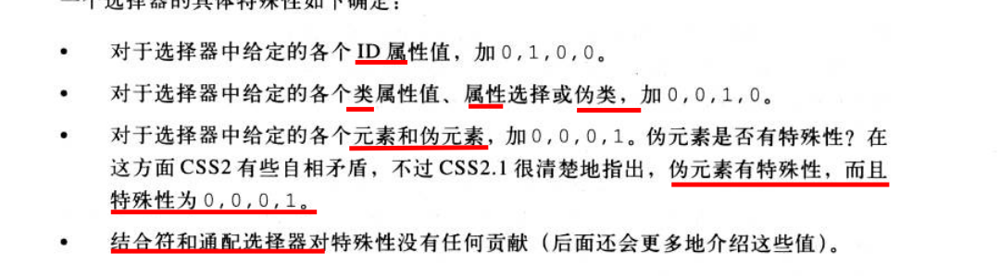
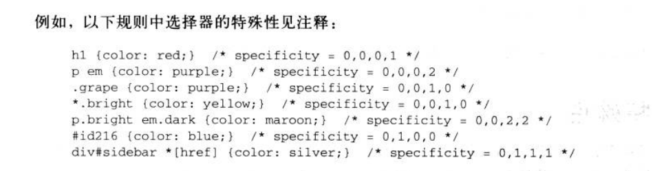
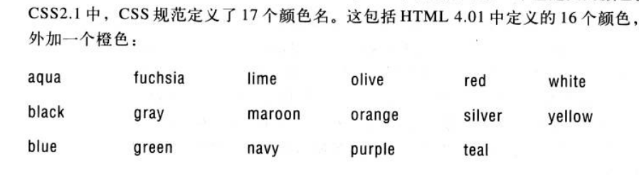

# 前言

以前总是学了忘,忘了学,后面发现还是很多东西都没掌握,所以这次我打算看书系统学习一下

# HTML

HTML是一种用于创建Web页面的标记语言。HTML的全称是**Hyper Text Markup Language**，即超文本标记语言。它是Web页面的基础，用于定义页面的结构、内容和样式。

浏览器根据这些标记对我们要展示的文本进行相应的布局,让文本不在那么单调

## 元素

元素也就是那些标签,比如p,div这些 ,元素可以按照不同的功能分成几类元素

### 替换元素与非替换元素

替换元素就是它这个标签代表的是其他的一些数据,比如图片,输入框这些,它本身不是文档内容直接显示

非替换元素就是在原本的文档内容上对其进行修饰

### 块级元素与行内元素

块级元素会**填满父元素的宽度**,也就是说在父元素的区域里面, 它的左右将不再有其他任何元素,常见的块级元素有p,div

行内元素的只会占据自己的宽度,并不会自动填满父元素宽度,比如span,a   而且对行内元素设置width与height不会生效,垂直方向的内,外边距会被应用,但是不会推开其他行内元素


## 元素的父子关系

如果一个元素在某一个元素的包含下,比如  A包含B,那么 B就是A的父亲元素,  同理就还有祖先元素这些

# CSS

CSS是层叠样式表（Cascading Style Sheets）的缩写，是一种用于定义Web页面外观和布局的标记语言。它与HTML结合使用，可以为页面中的各种元素设置样式，如字体、颜色、背景、边框、布局等等。CSS可以分离出页面的内容和样式，使页面更加清晰和易于维护

CSS的作用如下：

1. 分离内容和样式：CSS可以将页面的内容和样式分离，使页面更加清晰和易于维护。通过将样式定义在CSS文件中，可以在多个页面中重复使用相同的样式，避免在每个页面上重复定义样式。
2. 提高页面加载速度：CSS可以提高页面的加载速度。通过将样式定义在外部的CSS文件中，浏览器可以将样式和页面内容分别下载和缓存，从而使页面加载更快。
3. 提供样式继承：CSS可以提供样式的继承。通过使用继承，可以将样式从父元素传递到子元素，减少重复的代码，提高页面的可维护性。
4. 提供响应式设计：CSS可以提供响应式设计，使页面可以在不同的设备上自适应布局。通过使用CSS媒体查询，可以根据屏幕尺寸和分辨率等条件调整页面布局和样式。

> “层叠”一词表示了CSS的样式规则可以叠加，即多个样式可以同时应用于同一元素，并且可以通过优先级来确定应用的顺序。当多个样式规则冲突时，CSS会按照一定的优先级规则进行层叠和应用，使最终的样式符合预期。
>
> 此外，CSS还具有继承机制，即子元素可以继承父元素的样式，从而减少了代码的冗余。这种继承机制也可以看作一种层叠机制，因为子元素的样式会叠加在继承自父元素的样式之上。

## 选择器

通过使用CSS选择器，可以非常精确地选择页面中的元素，并为它们应用各种样式,而且他还具有下面的优点

1. 精确选择元素：CSS选择器可以非常精确地选择HTML元素，使开发人员可以为每个元素应用自己的样式。通过选择器，开发人员可以选择页面中任何一个或多个元素，对它们进行样式的设置。
2. 简化CSS代码：CSS选择器可以帮助开发人员简化CSS代码。通过使用选择器，可以为多个元素同时应用相同的样式，避免重复的代码。
3. 提高页面性能：CSS选择器可以提高页面的性能。通过使用选择器，可以减少浏览器渲染页面所需的时间，使页面更快地加载和显示。
4. 增强代码可读性：CSS选择器可以增强代码的可读性。通过使用选择器，可以更加清晰地表达代码的意图，使代码更易于理解和维护。

### 基本规则

#### 结构

选择器 + 代码块 代码块中属性得用;分开    选择器代表要选择哪些元素, 代码块代表要进行什么操作

#### 选择器分组

如果有多个选择器想应用同一个样式,那么多个选择器之间得用逗号分开


### 元素选择器

就是通过标签名选择元素,这个是最基本的选择器,我们开看看下面这些

```
p,div{
    color: red;
    font-size: 5px;
}
```

### 通配符选择器

就是选择所有元素

```
*{
    color: red;
}
```

### 类选择器和id选择器

类选择器是选中具有相同class属性的元素, id 选择器只选择一个 id相同的元素

```
/* 类选择器 */
.myclass{
    color: green;
}
/* id选择器 */
#myid{
    color: black;
}
```

如果有一群元素要应用相同的样式,我们可以使用类选择器,如果是具体某一个元素要用某个样式,可以用id选择器

一个元素可以有多个类,但是只能一个id

```
<p id="pid" class="class1 class2"></p>
```

### 属性选择器

属性选择器可以根据元素是否具有某个属性,或者属性值等于给定的值选择出元素

```
/* 单属性选择器 */
a[href]{
    color: yellow;
}
/* 属性满足要求的选择器 */
a[href="hello"]{
    color: wheat;
}

/* 多属性选择器 */
p[data][datashow]{
    border: 1px solid red;
}
```

全部形式如下

1. `[attribute]`：选择所有带有指定属性的元素。
2. `[attribute=value]`：选择所有带有指定属性值的元素。
3. `[attribute~=value]`：选择所有属性值中包含指定单词的元素，其中单词可以通过空格分隔。
4. `[attribute|=value]`：选择所有属性值以指定值开头，或以指定值开头后紧跟一个连字符的元素，通常用于选择语言子代码。
5. `[attribute^=value]`：选择所有属性值以指定值开头的元素。
6. `[attribute$=value]`：选择所有属性值以指定值结尾的元素。
7. `[attribute*=value]`：选择所有属性值包含指定值的元素。

### 后代选择器

后代选择器就是选择某个元素的子元素,**通过空格**将选择器隔开就变成了了后代选择器

1. （空格）：选择后代元素，即嵌套在某个元素内部的所有子元素，可以是任意深度的子孙元素。
2. `>`：选择直接子元素，即嵌套在某个元素内部的所有直接子元素。
3. `+`：选择相邻兄弟元素，即在同一父元素下，位于某个元素后面且紧随其后的元素。
4. `~`：选择兄弟元素，即在同一父元素下，位于某个元素后面的所有元素。

```
ul li {
  list-style-type: square;
}
ul > li {
  font-weight: bold;
}
/* h1 和  p在同一个父亲元素下 而且 p位于h1后面 紧紧挨着  只能选1个或者0个 */
h1 + p {
  font-style: italic;
}
/* h1 和  p在同一个父亲元素下 而且 p位于h1后面 可以不用紧紧挨着 */
h1 ~ p {
  font-style: italic;
}
```

### 伪类选择器

伪类（pseudo-class）是用来描述元素特定状态的关键词，它可以与选择器组合使用，用于选择 HTML 文档中特定状态的元素。它们可以用于许多不同的场景，比如用于**链接状态的样式**、**表单元素的状态**、鼠标交互状态、元素位置等

1. `:active`：表示当前激活的元素。
2. `:checked`：表示被选中的元素（用于 input 类型为 checkbox 或 radio 的元素）。
3. `:disabled`：表示被禁用的元素。
4. `:empty`：表示没有任何子元素的空元素。
5. `:enabled`：表示可用的元素。
6. `:first-child`：表示是其父元素的第一个子元素。
7. `:first-of-type`：表示是其父元素的某种类型的第一个子元素。
8. `:focus`：表示获得焦点的元素。
9. `:hover`：表示鼠标悬停在上面的元素。
10. `:lang(language)`：表示使用指定语言的元素。
11. `:last-child`：表示是其父元素的最后一个子元素。
12. `:last-of-type`：表示是其父元素的某种类型的最后一个子元素。
13. `:not(selector)`：表示不匹配指定选择器的元素。
14. `:nth-child(n)`：表示是其父元素的第 n 个子元素。
15. `:nth-last-child(n)`：表示是其父元素的倒数第 n 个子元素。
16. `:nth-last-of-type(n)`：表示是其父元素的某种类型的倒数第 n 个子元素。
17. `:nth-of-type(n)`：表示是其父元素的某种类型的第 n 个子元素。
18. `:only-child`：表示是其父元素的唯一子元素。
19. `:only-of-type`：表示是其父元素的某种类型的唯一子元素。
20. `:root`：表示文档的根元素。
21. `:target`：表示与文档的 URL 指定的相应元素匹配的元素。

### 伪元素选择器

CSS 中的伪元素（pseudo-elements）是一种虚拟的元素，它们不是 HTML 文档中实际存在的元素，而是被 CSS 用来在文档中生成特殊效果的元素。伪元素以双冒号 `::` 开头，并且是选择器的一部分。

伪元素与伪类（pseudo-classes）有所不同。伪类用于描述元素的某个特殊状态（例如鼠标悬停、被点击等），而伪元素则用于描述元素的某个部分（例如第一行文本、第一个字母等）。

CSS 中的一些常见伪元素包括：

- `::before`：在元素内部的内容前插入一个虚拟元素。
- `::after`：在元素内部的内容后插入一个虚拟元素。
- `::first-letter`：选中元素的第一个字母。
- `::first-line`：选中元素的第一行文本。
- `::selection`：选中元素中被用户选择的部分。
- `::marker`：选中列表项的标记符号。

使用伪元素可以实现很多特殊效果，比如可以使用 `::before` 和 `::after` 伪元素来添加一些装饰性的元素，比如 icon、箭头等。可以使用 `::first-letter` 和 `::first-line` 伪元素来对文本进行特殊样式处理，比如首字母大写、第一行缩进等。可以使用 `::selection` 伪元素来对选中的文本进行特殊样式处理，比如高亮、背景色等。

### 选择器优先级

CSS选择器优先级是指在多个CSS规则应用到同一个HTML元素时的同一个属性的时候，如何决定哪个规则的样式会被实际应用。优先级是根据以下4个等级来确定的：

1. 内联样式（Inline Styles）
2. ID选择器（ID Selectors）
3. 类、伪类和属性选择器（Class, Pseudo-class, and Attribute Selectors）
4. 元素和伪元素选择器（Element and Pseudo-element Selectors）

优先级从高到低排序，可以表示为一个四位数：(a, b, c, d)。当比较两个选择器的优先级时，我们可以从左到右逐位进行比较。例如，如果一个选择器的优先级为(1, 0, 0, 0)，另一个选择器的优先级为(0, 1, 0, 0)，则第一个选择器的优先级更高。

> 如果使用了 !important 的话 就不需要看这个规则





对于第三位 和 第四位 这个是可以叠加的,比如有多个类一起选择

```

p.class1.class2{
    color: aqua;
}

.class1.class2{
    color: yellow;
}

.class3{
    color: red;
}

```

最后肯定显示的是aqua这个颜色

### 空格,逗号,和直接放一起的区别

我们来看一下下面这些选择器

```
p.class1.class2{
    color: red;
}

p.class1, .class2{
    color: blue;
}

p  .class1  .class2{
    color: #000;
}

```

直接放一起代表是一个选择器要满足这些要求,  逗号代表 两个选择器,空格代表后代选择器

## 属性的继承

CSS的继承性指的是，某个元素的样式不仅会应用于自身，也会传递给它的子元素。也就是说，如果一个元素设置了某个样式，那么这个样式会自动应用于它的所有子元素，除非子元素自己定义了相同的样式并覆盖了继承的样式。

CSS的继承性可以简化样式表的编写，因为可以通过将样式应用于父元素来一次性为多个元素设置相同的样式。例如，可以将文字颜色应用于整个页面的body元素，这样就会自动应用于页面中的所有子元素，而无需为每个元素都手动指定相同的文字颜色。

不过需要注意的是，并非所有的样式都具有继承性。例如，设置边框、背景图像、宽度等属性不会继承给子元素(**一般跟布局有关的就不会被继承**)。此外，继承的样式也可以被子元素覆盖，例如，如果子元素定义了自己的文字颜色，那么它会覆盖继承的父元素的颜色设置。因此，在设计样式时需要仔细考虑哪些属性应该具有继承性，哪些属性不应该具有继承性，以达到最佳的样式效果。

## 值和单位


### 值

包括整数小数百分数   百分数一般是相对于父元素来说,特殊一点的就是颜色的百分比,是相对于255来说

### 命名颜色



### 长度单位

使用单位可以让我们更精确地控制样式的外观和行为，同时也使得样式更具有可重用性和可维护性。

#### 绝对长度单位


1. 英寸（in）：1英寸等于2.54厘米。
2. 厘米（cm）：1厘米等于10毫米。
3. 毫米（mm）：1毫米等于0.1厘米。
4. 点（pt）：1点等于1/72英寸。
5. 派卡（pc）：1派卡等于12点。

这个不常用

#### 相对长度单位

CSS 中的相对长度单位是相对于某些其他长度单位的单位，它们的值是相对于父元素、根元素或者浏览器的默认字体大小等相对尺寸而言的，而不是固定的物理尺寸

相对长度单位有：

1. `em`：相对于当前元素的字体大小。例如，`font-size` 设置为 `16px`，如果一个元素的 `padding` 设置为 `1em`，那么它的 `padding` 大小为 `16px`。
2. `rem`：相对于根元素（即 `<html>` 元素）的字体大小。例如，如果根元素的 `font-size` 设置为 `16px`，那么一个元素的 `padding` 设置为 `1rem`，那么它的 `padding` 大小为 `16px`。
3. `vw`：相对于视窗宽度的百分比，其中 `1vw` 等于视口宽度的 `1%`。
4. `vh`：相对于视窗高度的百分比，其中 `1vh` 等于视口高度的 `1%`。
5. `vmin`：相对于视窗宽度和高度中较小的那个的百分比。
6. `vmax`：相对于视窗宽度和高度中较大的那个的百分比。

使用相对长度单位可以保证页面元素在不同尺寸的设备上以一致的比例缩放，提高了页面的可维护性和可扩展性。

## 字体

1. `font-family`: 用于设置文本的字体系列。可以指定多个字体，以逗号分隔。浏览器会按照指定的顺序查找可用的字体，如果找不到，则使用默认字体。

   示例：

   ```
   p {
     font-family: "Helvetica Neue", Helvetica, Arial, sans-serif;
   }
   ```

2. `font-size`: 用于设置文本的字体大小。可以使用绝对值（如像素、点等）或相对值（如百分比、em、rem等）。

   示例：

   ```
   ep {
     font-size: 16px;
   }
   ```

3. `font-weight`: 用于设置文本的字体粗细。可以使用数字（100、200、300等，400表示正常，700表示粗体）或关键字（如`normal`、`bold`、`bolder`、`lighter`）。

   示例：

   ```
   p {
     font-weight: bold;
   }
   ```

4. `font-style`: 用于设置文本的字体样式，通常用于斜体。可以使用关键字`normal`（默认值）、`italic`或`oblique`。

   示例：

   ```
   p {
     font-style: italic;
   }
   ```

5. `font-variant`: 用于设置文本的字体变体，例如小型大写字母。可以使用关键字`normal`（默认值）或`small-caps`。

   示例：

   ```
   p {
     font-variant: small-caps;
   }
   ```

6. `line-height`: 用于设置文本的行高。可以使用数值、百分比或单位（如像素、em等）。行高可以影响到文本的可读性、视觉美感、**垂直居中等方面。通过调整行高可以改变文本在行框盒子中的垂直位置，使文本垂直居中、上下留白合适、行间距匀称等**

   示例：

   ```
   p {
     line-height: 1.5;
   }
   ```

7. `font`: 是以上属性的简写。可以按照以下顺序一起设置：`font-style`, `font-variant`, `font-weight`, `font-size`/`line-height`, `font-family`。

   示例：

   ```
   p {
     font: italic small-caps bold 16px/1.5 "Helvetica Neue", Helvetica, Arial, sans-serif;
   }
   ```

​      在 `font` 的简写形式中，必须包括以下两个属性：

1. `font-size`：定义字体的大小；
2. `font-family`：定义字体的类型。

如果省略其中任何一个属性，则简写形式无效，样式将不会被应用。此外，`font-size` 和 `font-family` 的位置是可以互换的，但是为了代码可读性，建议按照上面的顺序书写。

## 文本属性

文本属性主要用于设置文本的样式和排版

1. `color`: 设置文本颜色。可设置为十六进制颜色值、RGB、RGBA、HSL、HSLA或颜色关键字。
2. `text-align`: 设置文本的水平对齐方式。可选值：`left`（左对齐）、`right`（右对齐）、`center`（居中对齐）、`justify`（两端对齐）。
3. `text-decoration`: 设置文本的装饰效果。可选值：`none`（无装饰）、`underline`（下划线）、`overline`（上划线）、`line-through`（删除线）。
4. `text-indent`: 设置文本的首行缩进。可设置具体单位（如像素、em等）或百分比。
5. `letter-spacing`: 设置文本的字符间距。可设置具体单位（如像素、em等）或`normal`（正常间距）。
6. `word-spacing`: 设置文本的单词间距。可设置具体单位（如像素、em等）或`normal`（正常间距）。
7. `line-height`: 设置文本的行高。可设置数值、百分比或具体单位（如像素、em等）。
8. `text-transform`: 设置文本的大小写转换。可选值：`none`（无转换）、`capitalize`（首字母大写）、`uppercase`（全部大写）、`lowercase`（全部小写）。
9. `white-space`: 设置文本的空白字符处理方式。可选值：`normal`（正常处理）、`nowrap`（不换行）、`pre`（保留空白字符）、`pre-wrap`（保留空白字符并换行）、`pre-line`（合并空白字符并换行）。
10. `text-overflow`: 设置文本溢出时的处理方式。可选值：`clip`（裁剪文本）、`ellipsis`（显示省略号）或自定义字符串。
11. `word-break`: 设置文本换行的规则。可选值：`normal`（正常换行）、`break-all`（任意位置换行）、`keep-all`（仅在允许的断点换行）。
12. `word-wrap` 或 `overflow-wrap`: 设置文本在长单词或 URL 地址等不规则字符串中的换行规则。可选值：`normal`（正常换行）、`break-word`（在最小宽度限制下尽可能换行）。
13. `text-shadow`: 设置文本的阴影效果。需要设置水平偏移、垂直偏移、模糊半径和阴影颜色。
14. `direction`: 设置文本的书写方向。可选值：`ltr`（从左到右，Left-to-Right）或`rtl`（从右到左，Right-to-Left）
15. `unicode-bidi`: 设置文本的双向排版。可选值：`normal`（正常双向排版）、`embed`（内嵌双向排版）、`bidi-override`（覆盖双向排版）、`isolate`（隔离双向排版）、`isolate-override`（隔离覆盖双向排版）或`plaintext`（无格式文本双向排版）。
16. `vertical-align`: 设置文本的垂直对齐方式。可选值：`baseline`（基线对齐）、`sub`（下标对齐）、`super`（上标对齐）、`top`（顶部对齐）、`text-top`（文本顶部对齐）、`middle`（居中对齐）、`bottom`（底部对齐）、`text-bottom`（文本底部对齐）或具体单位（如像素、百分比等）。
17. `tab-size`: 设置制表符的宽度。可设置为整数或具体单位（如像素、em等）。
18. `hyphens`: 设置文本的连字符（断字）使用。可选值：`none`（不使用连字符）、`manual`（手动插入连字符）、`auto`（自动插入连字符）。
19. `text-justify`: 设置文本的对齐方式（仅在 `text-align: justify` 下有效）。可选值：`auto`（自动对齐）、`inter-word`（词间对齐）、`inter-character`（字符间对齐）。

word-break 是当文本超出父元素宽度时,**允许在哪些地方换行**, 而word-wrap  是当文本超过父元素宽度的时候,**选择在一个合适的地方换行**


## 盒模型

盒模型是CSS中用于描述HTML元素布局的一种模型。它将每个HTML元素看作一个矩形盒子,每个盒子里面又包含了子盒子，由内容区域、内边距区域、边框区域和外边距区域四部分组成。这些部分的宽度和高度可以通过CSS进行调整和控制，从而实现灵活的布局效果。

在标准盒模型中，**元素的宽度和高度指的是其内容区域的宽度和高度**。而在IE盒模型中，**元素的宽度和高度包括了内容区域、内边距区域和边框区域**，这也是标准盒模型和IE盒模型的主要区别之一。在CSS中可以通过box-sizing属性来控制使用哪种盒模型，其取值可以是content-box（标准盒模型）和border-box（IE盒模型）。

## 背景

CSS中的背景属性用于设置元素的背景，包括背景颜色、背景图片、背景大小、背景重复方式等等。以下是常用的背景属性和它们的含义：

1. background-color：设置元素的背景颜色。可以设置任何有效的颜色值，如颜色名称、十六进制颜色码或RGB颜色值。
2. background-image：设置元素的背景图像。可以指定一个URL，或使用关键字none，表示没有背景图像。也可以使用线性渐变或径向渐变作为背景图像。
3. background-repeat：设置背景图像的重复方式。可以设置repeat（默认值，背景图像在水平和垂直方向上平铺）、repeat-x（仅在水平方向上平铺）、repeat-y（仅在垂直方向上平铺）、no-repeat（不平铺）。
4. background-position：设置背景图像的位置。可以使用关键字left、center、right和top、center、bottom，也可以使用像素、百分比等单位。
5. background-size：设置背景图像的大小。可以使用像素、百分比、cover(让背景图片缩放以完全覆盖背景区域，并保持其宽高比。可能会裁剪背景图片的某些部分)。和contain（让背景图片缩放以适应背景区域，保持其宽高比。可能会有留白，不会裁剪背景图片。）等值。
6. background-origin：设置背景图像的起点。可以设置为border-box（从边框开始绘制），padding-box（从内边距开始绘制），或content-box（从内容区开始绘制）。
7. background-clip：设置背景图像的裁剪区域。可以设置为border-box（不超出边框）、padding-box（不超出内边距）或content-box（不超出内容区）。
8. background-attachment：设置背景图像的滚动方式。可以设置为scroll（随元素滚动）或fixed（固定在视口，不随元素滚动）。

在使用背景属性时，需要注意一些问题，例如：

- 如果同时设置了background-image和background-color，而背景图像不透明，那么背景颜色将不可见。
- **背景图像的位置是相对于背景区域的，而不是相对于元素本身的**。
- 在某些情况下，背景图像可能会被剪切或拉伸，导致失真或不适当的显示。在这种情况下，可以尝试使用background-size或background-position属性进行调整。

我觉得下面这个属性基本就能应对所有的情况了

```
background-repeat: no-repeat;
background-size: cover;
background-position: center center;
```

CSS中，可以使用background属性将背景相关的属性设置在一起，而不必一个个单独设置。 background属性可以包含以下属性：

- background-color: 背景颜色
- background-image: 背景图片的URL
- background-repeat: 背景图片的重复方式（repeat, repeat-x, repeat-y, no-repeat）
- background-position: 背景图片的位置
- background-size: 背景图片的尺寸
- background-attachment: 背景图片的滚动方式（scroll, fixed）

在`background`简写属性中，至少要指定背景图片（`background-image`）和背景颜色（`background-color`）其中之一是必须的，其他属性都是可选的。如果没有指定背景颜色，会默认为透明色

## 浮动

在CSS中，浮动（float）是一种布局技术，它允许开发者将一个元素从文档流中移出，使其沿着其父容器的左侧或右侧边缘对齐。这样，其他元素可以围绕浮动元素进行排列。浮动最初是为了实现文字环绕图像而设计的，但后来它也被广泛应用于其他布局场景。**浮动会将元素变成块级元素**

浮动的主要作用包括：

1. 实现文字环绕图像效果。
2. 创建水平导航栏。
3. 实现多列布局。

浮动的特点

1. 脱离正常文档流：浮动元素会从正常的文档流中脱离，不再占据原先的位置。这意味着浮动元素后面的元素会忽略浮动元素的位置进行排列。
2. 沿着父容器边缘对齐：浮动元素会沿着其父容器的左侧或右侧边缘对齐。这取决于 `float` 属性的值，可以设置为 `left`、`right` 或 `none`。
3. 影响后续元素：浮动元素会影响其后续元素的排列方式。后续的行内元素和块级元素中的行内内容会围绕浮动元素排列。这使得实现文本环绕图片等效果成为可能。
4. 不会重叠：浮动元素之间不会发生重叠。如果有多个相邻浮动元素，它们会根据各自的宽度在同一行显示，直至容纳不下时才会换行。
5. 外边距不会合并：浮动元素的上外边距（margin-top）和下外边距（margin-bottom）不会与相邻元素的外边距发生合并。
6. 可能导致父元素高度塌陷：由于浮动元素脱离文档流，其父元素可能无法正确计算高度。这可能导致父元素的高度塌陷。为解决这个问题，可以使用清除浮动（clearfix）技术。
7. 与 `clear` 属性相关：`clear` 属性可以用来控制元素与浮动元素的关系，防止元素与浮动元素重叠。`clear` 属性可以设置为 `left`、`right`、`both` 或 `none`。

浮动会导致一些问题，比如父元素高度塌陷。为了解决这些问题，通常会使用清除浮动（clearfix）技术。在浮动元素之后添加一个空元素，为其设置 `clear` 属性，取值为 `left`、`right`、`both` 或 `none`，以清除浮动带来的影响。现在，很多开发者也倾向于使用Flexbox和Grid布局替代浮动来实现更复杂的布局需求。

## 定位


CSS3中的定位属性包括：

1. `position`：用于设置元素的定位方式，有`static`、`relative`、`absolute`、`fixed`和`sticky`等几种取值。
2. `top`、`right`、`bottom`、`left`：用于设置元素相对于父元素或前一个元素的定位偏移值。如果是百分比的话,就是父亲的宽度和高度的百分比
3. `z-index`：用于设置元素的层级关系。

这些属性的作用分别是：

- `position`：决定了一个元素是基于正常文档流定位还是相对于其父元素、文档或视口定位。
- `top`、`right`、`bottom`、`left`：用于设置元素相对于其定位的容器的上下左右偏移值。当元素的`position`值为`absolute`、`fixed`或`sticky`时，这些属性才会生效。
- `z-index`：用于设置元素的堆叠顺序，具有更高`z-index`值的元素将显示在具有较低`z-index`值的元素的上方。

在使用这些属性时需要注意：

- `top`、`right`、`bottom`、`left`属性只有在`position`的值为`absolute`、`fixed`或`sticky`时才会生效。
- `z-index`属性只能应用于定位元素（即`position`值为`absolute`、`fixed`或`sticky`的元素），对于非定位元素，`z-index`属性无效。
- `position`属性会改变元素的定位方式，一般来说，除非需要使用绝对或固定定位，否则最好不要使用`position`属性。

在使用 CSS 定位时，有一些需要注意的点：

1. 使用绝对定位或固定定位时，最好在元素的父元素中设置相对定位，以便让定位相对于父元素而不是整个页面。
2. 当使用相对定位时，元素会在其正常位置上留下空白，可以通过设置负值的 top、left、right、bottom 属性来调整元素的位置。
3. 使用定位时要注意层叠顺序，通过设置 z-index 属性来控制元素的层叠顺序。z-index 值越大的元素，越靠近视图者，也就是越显示在最上层。
4. 在某些情况下，会发生定位元素相互遮挡的情况，可以通过设置 visibility 属性或者使用透明度来解决。
5. 定位元素如果超出了其父元素的范围，可能会导致滚动条的出现，需要注意元素的位置和大小。

总之，在使用 CSS 定位时，需要注意元素的位置、层叠顺序、遮挡、滚动条等问题，以确保页面的正常显示和交互。

## Flexbox布局

Flexbox是CSS3中一种布局方式，可以方便地实现弹性的、响应式的布局，适用于各种屏幕尺寸的网页设计。

使用Flexbox布局，需要将父容器的display属性设置为flex或inline-flex，子容器的布局就会受到父容器的控制，可以使用flex-grow、flex-shrink、flex-basis等属性进行灵活的布局调整。

下面是一些常用的Flexbox布局属性：

1. flex-direction：指定子容器在主轴方向上的排列方式。默认为row，即横向排列；设置为column，则纵向排列。
2. justify-content：指定子容器在主轴上的对齐方式。默认为flex-start，即左对齐；其他取值包括flex-end、center、space-between、space-around等。
3. align-items：指定子容器在交叉轴上的对齐方式。默认为stretch，即拉伸；其他取值包括flex-start、flex-end、center、baseline等。
4. flex-wrap：指定子容器是否换行。默认为nowrap，即不换行；设置为wrap，则换行。
5. align-content：指定多行子容器在交叉轴上的对齐方式。只有在多行情况下生效。默认为stretch，即拉伸；其他取值包括flex-start、flex-end、center、space-between、space-around等。
6. order：指定子容器的排列顺序。默认为0，数字越小越靠前；可以设置为正数或负数。
7. flex：指定子容器的伸缩属性。flex属性是flex-grow、flex-shrink、flex-basis三个属性的简写形式，用于设置子容器的伸缩性、收缩性和初始大小。

## 媒体查询

CSS媒体查询（Media Query）是一种CSS3的技术，允许你根据设备的属性（如屏幕分辨率、屏幕尺寸、屏幕方向等）来针对不同设备展现不同的样式，实现响应式布局。

媒体查询可以通过在CSS样式表中定义媒体类型、媒体特性和媒体值的组合来控制不同设备的样式。媒体类型包括all（所有设备）、print（打印机设备）、screen（计算机屏幕设备）、speech（语音合成器设备）等，而媒体特性则包括宽度、高度、分辨率、方向、可视区域等等。

媒体查询可以使用`@media`规则进行定义。下面是一个简单的媒体查询示例：

```
/* 默认样式 */
body {
  background-color: lightblue;
}

/* 当屏幕宽度大于等于768px时应用的样式 */
@media screen and (min-width: 768px) {
  body {
    background-color: coral;
  }
}

/* 当屏幕宽度大于等于1024px时应用的样式 */
@media screen and (min-width: 1024px) {
  body {
    background-color: lightgreen;
  }
}

```

在上面的示例中，`@media`规则指定了`screen`作为媒体类型，`and`作为媒体特性与媒体类型之间的连接符，`(max-width: 600px)`指定了设备的最大宽度为600像素。因此，当设备宽度小于或等于600像素时，`body`元素的背景色将变为`lightblue`。

除了`max-width`之外，还有许多其他的媒体特性可以用来设置媒体查询，例如`min-width`、`orientation`、`resolution`等等。同时，媒体查询也支持逻辑运算符`not`、`and`和`only`，以及逗号分隔的多个媒体查询条件。

媒体查询可以嵌套使用，因此可以根据需要定义不同的媒体查询规则来适应不同的设备和场景。在使用媒体查询时，可以利用浏览器的开发者工具来模拟不同设备的屏幕大小和分辨率，以便进行样式的调试和优化。


> 好吧,我真的不适合学css
