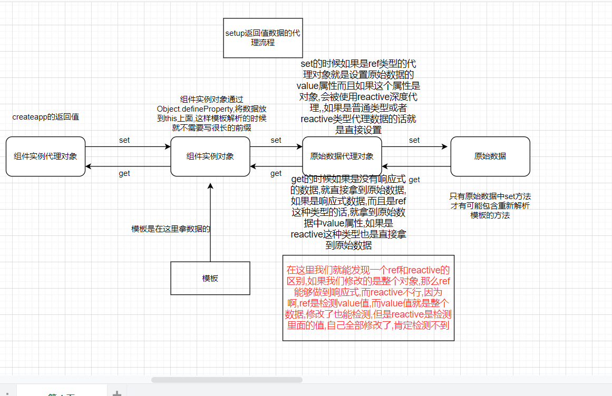

# Vue3带来了什么

## 1.性能的提升

- 打包大小减少41%

- 初次渲染快55%, 更新渲染快133%

- 内存减少54%

  ......

## 2.源码的升级

- 使用Proxy代替defineProperty实现响应式

- 重写虚拟DOM的实现和Tree-Shaking

  ......

## 3.拥抱TypeScript

- Vue3可以更好的支持TypeScript

## 4.新的特性

1. Composition API（组合API）

   - setup配置
   - ref与reactive
   - watch与watchEffect
   - provide与inject
   - ......
2. 新的内置组件
   - Fragment 
   - Teleport
   - Suspense
3. 其他改变

   - 新的生命周期钩子
   - data 选项应始终被声明为一个函数
   - 移除keyCode支持作为 v-on 的修饰符
   - ......

# 常用 Composition API

官方文档: https://v3.cn.vuejs.org/guide/composition-api-introduction.html

## 1.拉开序幕的setup

1. 理解：Vue3.0中一个新的配置项，值为一个函数。
2. setup是所有<strong style="color:#DD5145">Composition API（组合API）</strong><i style="color:gray;font-weight:bold">“ 表演的舞台 ”</i>。
3. 组件中所用到的：数据、方法等等，均要配置在setup中。
4. setup函数的两种返回值：
   1. 若返回一个对象，则对象中的属性、方法, 在模板中均可以直接使用。（重点关注！）
   2. <span style="color:#aad">若返回一个渲染函数：则可以自定义渲染内容。（了解）</span>
5. 注意点：
   1. 尽量不要与Vue2.x配置混用
      - Vue2.x配置（data、methos、computed...）中<strong style="color:#DD5145">可以访问到</strong>setup中的属性、方法。
      - 但在setup中<strong style="color:#DD5145">不能访问到</strong>Vue2.x配置（data、methos、computed...）。
      - 如果有重名, setup优先。
   2. setup不能是一个async函数，因为返回值不再是return的对象, 而是promise, 模板看不到return对象中的属性。（后期也可以返回一个Promise实例，但需要Suspense和异步组件的配合）

 vue2中data函数的返回值会被修改,,通过闭包保留原先的数据变量,通过get,set方法得到和修改这个变量,他自己就变成了代理对象,而且这些数据还会被代理到组件实例对象身上去,而且如果修改了数据,就会进行响应式处理

在vue3中setup的返回值不会被修改,但是他会被一个proxy对象代理 , 如果我们将一个函数返回出去了,那么这个函数里面的this就是这个代理对象,返回值也会被代理到组件实例对象身上去,**但是默认情况下修改数据不会进行响应式处理,我们能够修改数据,但是不会重新解析模板**,我们需要特殊的函数处理


##  2.ref函数

- 作用: 定义一个响应式的数据
- 语法: ```const xxx = ref(initValue)``` 
  - 创建一个包含响应式数据的<strong style="color:#DD5145">引用对象（reference对象，简称ref对象）</strong>。
  - JS中操作数据： ```xxx.value```
  - 模板中读取数据: 不需要.value，直接：```<div>{{xxx}}</div>```
- 备注：
  - 接收的数据可以是：基本类型、也可以是对象类型。
  - 基本类型的数据：响应式依然是靠``Object.defineProperty()``的```get```与```set```完成的。
  - 对象类型的数据：内部 <i style="color:gray;font-weight:bold">“ 求助 ”</i> 了Vue3.0中的一个新函数—— ```reactive```函数。返回值还是refimpl对象,还得通过value拿到代理的proxy对象

## 3.reactive函数

- 作用: 定义一个<strong style="color:#DD5145">对象类型</strong>的响应式数据（基本类型不要用它，要用```ref```函数）
- 语法：```const 代理对象= reactive(源对象)```接收一个对象（或数组），返回一个<strong style="color:#DD5145">代理对象（Proxy的实例对象，简称proxy对象）</strong>
- reactive定义的响应式数据是“深层次的”。
- 内部基于 ES6 的 Proxy 实现，通过代理对象操作源对象内部数据进行操作。

> 他代理的对象是跟对象的使用是一样的,ref代理的对象跟ref.value的对象的使用是一样的
>
> 被reactive代理的数组通过索引修改也能做到响应式

## 4.Vue3.0中的响应式原理

### vue2.x的代理

- 实现原理：

  - 对象类型：通过```Object.defineProperty()```对属性的读取、修改进行拦截（数据劫持）。

  - 数组类型：通过重写更新数组的一系列方法来实现拦截。（对数组的变更方法进行了包裹）。

    ```js
    Object.defineProperty(data, 'count', {
        get () {}, 
        set () {}
    })
    ```

- 存在问题：

  - **新增属性、删除属性, 界面不会更新**。
  - 直接通过下标修改数组, 界面不会自动更新。

### Vue3.0的代理

- 实现原理: 

  - 通过Proxy（代理）:  拦截对象中任意属性的变化, 包括：**属性值的读写、属性的添加、属性的删除等**。

  - 通过Reflect（反射）:  对源对象的属性进行操作。

  - MDN文档中描述的Proxy与Reflect：

    - Proxy：https://developer.mozilla.org/zh-CN/docs/Web/JavaScript/Reference/Global_Objects/Proxy

    - Reflect：https://developer.mozilla.org/zh-CN/docs/Web/JavaScript/Reference/Global_Objects/Reflect

      ```js
      new Proxy(data, {
      	// 拦截读取属性值
          get (target, prop) {
          	return Reflect.get(target, prop)
          },
          // 拦截设置属性值或添加新属性
          set (target, prop, value) {
          	return Reflect.set(target, prop, value)
          },
          // 拦截删除属性
          deleteProperty (target, prop) {
          	return Reflect.deleteProperty(target, prop)
          }
      })
      
      proxy.name = 'tom'   
      ```

通过代理,我们能够劫持到数据,然后进行响应式处理,在vue2中数据劫持的时候如果修改了数据,那么就会进行模板重新解析,但是在vue3中,我们必须使用相**应的响应式函数进行处理,这样在对数据修改后才能重新解析模板**

我们可以验证一下

```
setup() {
  return {
    b:1,
    a:ref(1),
  };
}
```

现在有a,b两个数据,当我们修改b的时候数据会变化,但是模板不会解析


我们点击b++


**这里我们将app组件实例对象放在window上,  发现b的值是2,但是页面还是1**

我们点击a++


我们会发现两个值都变了



## 5.reactive对比ref

-  从定义数据角度对比：
   -  ref用来定义：<strong style="color:#DD5145">基本类型数据</strong>。
   -  reactive用来定义：<strong style="color:#DD5145">对象（或数组）类型数据</strong>。
   -  备注：ref也可以用来定义<strong style="color:#DD5145">对象（或数组）类型数据</strong>, 它内部会自动通过```reactive```转为<strong style="color:#DD5145">代理对象</strong>。
-  从原理角度对比：
   -  ref通过``Object.defineProperty()``的```get```与```set```来实现响应式（数据劫持）。
   -  reactive通过使用<strong style="color:#DD5145">Proxy</strong>来实现响应式（数据劫持）, 并通过<strong style="color:#DD5145">Reflect</strong>操作<strong style="color:orange">源对象</strong>内部的数据。
-  从使用角度对比：
   -  ref定义的数据：操作数据<strong style="color:#DD5145">需要</strong>```.value```，读取数据时模板中直接读取<strong style="color:#DD5145">不需要</strong>```.value```。
   -  reactive定义的数据：操作数据与读取数据：<strong style="color:#DD5145">均不需要</strong>```.value```。

## 6.setup的两个注意点

- setup执行的时机
  - 在beforeCreate之前执行一次，this是undefined。

- setup的参数
  - props：值为对象，包含：组件外部传递过来，且组件内部声明接收了的属性。
  - context：上下文对象
    - attrs: 值为对象，包含：组件外部传递过来，但没有在props配置中声明的属性, 相当于 ```this.$attrs```。
    - slots: 收到的插槽内容, 相当于 ```this.$slots```。
    - emit: 分发自定义事件的函数, 相当于 ```this.$emit```。


## 7.计算属性与监视

### 1.computed函数

- 与Vue2.x中computed配置功能一致

- 写法

  ```js
  import {computed} from 'vue'
  
  setup(){
      ...
  	//计算属性——简写
      let fullName = computed(()=>{
          return person.firstName + '-' + person.lastName
      })
      //计算属性——完整
      let fullName = computed({
          get(){
              return person.firstName + '-' + person.lastName
          },
          set(value){
              const nameArr = value.split('-')
              person.firstName = nameArr[0]
              person.lastName = nameArr[1]
          }
      })
  }
  ```

### 2.watch函数

- 与Vue2.x中watch配置功能一致

- 两个小“坑”：

  - 监视reactive定义的响应式数据时：oldValue无法正确获取、默认开启了深度监视（deep配置失效）。
  - 监视reactive定义的响应式数据中**某个属性时**：deep配置有效。

  ```js
  //情况一：监视ref定义的响应式数据
  watch(sum,(newValue,oldValue)=>{
  	console.log('sum变化了',newValue,oldValue)
  },{immediate:true})
  
  //情况二：监视多个ref定义的响应式数据
  watch([sum,msg],(newValue,oldValue)=>{
      // 这里的newValue和oldValue有两个数据,sum和msg
  	console.log('sum或msg变化了',newValue,oldValue)
  }) 
  
  /* 情况三：监视reactive定义的响应式数据
  			若watch监视的是reactive定义的响应式数据，则无法正确获得oldValue！！
  			若watch监视的是reactive定义的响应式数据，会默认自动开启深度监视 
  */
  watch(person,(newValue,oldValue)=>{
  	console.log('person变化了',newValue,oldValue)
  },{immediate:true,deep:false}) //此处的deep配置不再奏效
  
  //情况四：监视reactive定义的响应式数据中的某个属性,注意这里得用函数
  watch(()=>person.age,(newValue,oldValue)=>{
  	console.log('person的age变化了',newValue,oldValue)
  }) 
  
  //情况五：监视reactive定义的响应式数据中的某些属性
  watch([()=>person.age,()=>person.name],(newValue,oldValue)=>{
  	console.log('person的age和name变化了',newValue,oldValue)
  })
  
  //特殊情况
  watch(()=>person.job,(newValue,oldValue)=>{
      console.log('person的job里面的东西变化了',newValue,oldValue)
  },{deep:true}) //这里得配置deep,因为这是一个属性对象,想要监视里面的东西,得用deep
  ```

### 3.watchEffect函数

- watch的套路是：既要指明监视的属性，也要指明监视的回调。

- watchEffect的套路是：不用指明监视哪个属性，监视的回调中用到哪个属性，那就监视哪个属性。

- watchEffect有点像computed：

  - 但computed注重的**计算出来的值**（回调函数的返回值），所以必须要写返回值。
  - 而watchEffec**t更注重的是过程**（回调函数的函数体），所以不用写返回值。

  ```js
  //watchEffect所指定的回调中用到的数据只要发生变化，则直接重新执行回调。
  watchEffect(()=>{
      const x1 = sum.value
      const x2 = person.age
      console.log('watchEffect配置的回调执行了')
  })
  ```

## 8.生命周期

- Vue3.0中可以继续使用Vue2.x中的生命周期钩子，但有有两个被更名：
  - ```beforeDestroy```改名为 ```beforeUnmount```
  - ```destroyed```改名为 ```unmounted```
- Vue3.0也提供了 Composition API 形式的生命周期钩子，与Vue2.x中钩子对应关系如下：(这些周期函数还能在配置项里面使用,如果要在setup里面定义要用前面的名字,我们还得引入这些东西)
  - `beforeCreate`===>`setup()`
  - `created`=======>`setup()`
  - `beforeMount` ===>`onBeforeMount`
  - `mounted`=======>`onMounted`
  - `beforeUpdate`===>`onBeforeUpdate`
  - `updated` =======>`onUpdated`
  - `beforeUnmount` ==>`onBeforeUnmount`
  - `unmounted` =====>`onUnmounted`

## 9.自定义hook函数

- 什么是hook？—— 本质是一个函数，把setup函数中使用的Composition API进行了封装。

- **类似于vue2.x中的mixin。**

- 自定义hook的优势: **复用代码, 让setup中的逻辑更清楚易懂。**

```
// hook/point.js

import {reactive,onMounted,onBeforeUnmount} from 'vue'
export default function (){
	//实现鼠标“打点”相关的数据
	let point = reactive({
		x:0,
		y:0
	})

	//实现鼠标“打点”相关的方法
	function savePoint(event){
		point.x = event.pageX
		point.y = event.pageY
		console.log(event.pageX,event.pageY)
	}

	//实现鼠标“打点”相关的生命周期钩子
	onMounted(()=>{
		window.addEventListener('click',savePoint)
	})

	onBeforeUnmount(()=>{
		window.removeEventListener('click',savePoint)
	})

	return point
}

// 在app.vue中引入
import usepoint from "./hook/point.js"


setup(){
	point = userpoint()  //当我们你在setup中使用这个函数的时候,就相当于把里面的代码放进来一样
}
```


## 10.toRef

- 作用：创建一个 ref 对象，其value值指向另一个对象中的某个属性。
- 语法：```const name = toRef(person,'name')```
- 应用:   **要将响应式对象中的某个属性单独提供给外部使用时**。简化我们的模板语法


- 扩展：```toRefs``` 与```toRef```功能一致，但可以批量创建多个 ref 对象，语法：```toRefs(person)```

```
 setup() {
    //数据
    let person = reactive({
      name: "张三",
      age: 18,
      job: {
        j1: {
          salary: 20,
        },
      },
    });
    //返回一个对象（常用）
    return {
      person,
      // name:toRef(person,'name'), 这里不能使用 name: ref(person.name) 
      // age:toRef(person,'age'),
      // salary:toRef(person.job.j1,'salary'),
      ...toRefs(person),  // 这样我们能够在模板中直接使用属性名字,而不用对象名字
    };
  }
```

> 注意这里不能使用ref 这样会导致数据不同步, 因为ref并没有引用原数据,而是一个新数据

## 11.总结

在setup中返回值都是一些数据和方法和计算属性,  如果要用监视,生命周期钩子函数,得引入这些东西,

如果要给数据添加响应式的功能,得用ref 和 reactive    基本数据类型用ref, 对象这些用reactive


# 其它 Composition API

## 1.shallowReactive 与 shallowRef

- shallowReactive：**只处理对象最外层属性的响应式**（浅响应式,只响应第一层数据）。
- shallowRef：只处理基本数据类型的响应式, **不进行对象的响应式处理**,这里其实也是第一层,只代理value数据,如果我们修改整个value的话,还有会响应的。

- 什么时候使用?
  -  如果有一个对象数据，结构比较深, 但变化时只是外层属性变化 ===> shallowReactive。
  -  如果有一个对象数据，后续功能不会修改该对象中的属性，而是生新的对象来替换(这里指的是把整个都替换掉会有响应,比不使用多了一个这个功能) ===> shallowRef。

## 2.readonly 与 shallowReadonly

- readonly: 让一个响应式数据变为只读的（深只读）。
- shallowReadonly：让一个响应式数据变为只读的（浅只读,第一层不能改,后面的层能改,整个数据也能改）。
- 应用场景: 不希望数据被修改时。

## 3.toRaw 与 markRaw

- toRaw：
  - 作用：将一个由```reactive```生成的<strong style="color:orange">响应式对象</strong>转为<strong style="color:orange">普通对象</strong>。
  - 使用场景：用于读取响应式对象对应的普通对象，对这个普通对象的所有操作，不会引起页面更新。
- markRaw：
  - 作用：**标记一个对象，使其永远不会再成为响应式对象**。
  - 应用场景:
    1. 有些值不应被设置为响应式的，例如复杂的第三方类库等。
    2. **当渲染具有不可变数据源的大列表时，跳过响应式转换可以提高性能**。

## 4.customRef

- 作用：创建一个自定义的 ref，并对其依赖项跟踪和更新触发进行显式控制。

- 实现防抖效果：

  ```vue
  <template>
  	<input type="text" v-model="keyword">
  	<h3>{{keyword}}</h3>
  </template>
  
  <script>
  	import {ref,customRef} from 'vue'
  	export default {
  		name:'Demo',
  		setup(){
  			// let keyword = ref('hello') //使用Vue准备好的内置ref
  			//自定义一个myRef
  			function myRef(value,delay){
  				let timer
  				//通过customRef去实现自定义
  				return customRef((track,trigger)=>{
  					return{
  						get(){
  							track() //告诉Vue这个value值是需要被“追踪”的
  							return value
  						},
  						set(newValue){
  							clearTimeout(timer)
  							timer = setTimeout(()=>{
  								value = newValue
  								trigger() //告诉Vue去更新界面
  							},delay)
  						}
  					}
  				})
  			}
  			let keyword = myRef('hello',500) //使用程序员自定义的ref
  			return {
  				keyword
  			}
  		}
  	}
  </script>
  ```

  

## 5.provide 与 inject

- 作用：实现<strong style="color:#DD5145">祖与后代组件间</strong>通信

- 套路：父组件有一个 `provide` 选项来提供数据，后代组件有一个 `inject` 选项来开始使用这些数据

- 具体写法：

  1. 祖组件中：

     ```js
     setup(){
     	......
         let car = reactive({name:'奔驰',price:'40万'})
         provide('car',car)
         ......
     }
     ```

  2. 后代组件中：

     ```js
     setup(props,context){
     	......
         const car = inject('car')
         return {car}
     	......
     }
     ```

## 6.响应式数据的判断

- isRef: 检查一个值是否为一个 ref 对象
- isReactive: 检查一个对象是否是由 `reactive` 创建的响应式代理
- isReadonly: 检查一个对象是否是由 `readonly` 创建的只读代理
- isProxy: 检查一个对象是否是由 `reactive` 或者 `readonly` 方法创建的代理

# Composition API 的优势

## 1.Options API 存在的问题

使用传统OptionsAPI中，新增或者修改一个需求，就需要分别在data，methods，computed里修改 。

<div style="width:600px;height:370px;overflow:hidden;float:left">
    
</div>
<div style="width:300px;height:370px;overflow:hidden;float:left">
     
</div>


## 2.Composition API 的优势

我们可以更加优雅的组织我们的代码，函数。让相关功能的代码更加有序的组织在一起。

<div style="width:500px;height:340px;overflow:hidden;float:left">
    
</div>
<div style="width:430px;height:340px;overflow:hidden;float:left">
    
</div>


# 新的组件

## 1.Fragment

- 在Vue2中: 组件必须有一个根标签
- 在Vue3中: 组件可以没有根标签, 内部会将多个标签包含在一个Fragment虚拟元素中
- 好处: 减少标签层级, 减小内存占用

> 不需要我们去写这个标签

## 2.Teleport

- 什么是Teleport？—— `Teleport` 是一种能够将我们的<strong style="color:#DD5145">组件html结构</strong>移动到**指定位置的技术**。

  ```vue
  <teleport to="移动位置"> // 这里可以放一些选择器
  	<div v-if="isShow" class="mask">
  		<div class="dialog">
  			<h3>我是一个弹窗</h3>
  			<button @click="isShow = false">关闭弹窗</button>
  		</div>
  	</div>
  </teleport>
  ```

## 3.Suspense

- **等待异步组件时渲染一些额外内容**，让应用有更好的用户体验

- 使用步骤：

  - 异步引入组件

    ```js
    import {defineAsyncComponent} from 'vue'
    const Child = defineAsyncComponent(()=>import('./components/Child.vue'))
    ```

  - 使用```Suspense```包裹组件，并配置好```default``` 与 ```fallback```

    ```vue
    <template>
    	<div class="app">
    		<h3>我是App组件</h3>
    		<Suspense>
    			<template v-slot:default>
    				<Child/>
    			</template>
    			<template v-slot:fallback>
    				<h3>加载中.....</h3>
    			</template>
    		</Suspense>
    	</div>
    </template>
    ```

# 其他

## 1.全局API的转移

- Vue 2.x 有许多全局 API 和配置。

  - 例如：注册全局组件、注册全局指令等。

    ```js
    //注册全局组件
    Vue.component('MyButton', {
      data: () => ({
        count: 0
      }),
      template: '<button @click="count++">Clicked {{ count }} times.</button>'
    })
    
    //注册全局指令
    Vue.directive('focus', {
      inserted: el => el.focus()
    }
    ```

- Vue3.0中对这些API做出了调整：

  - 将全局的API，即：```Vue.xxx```调整到应用实例（```app```）上

    | 2.x 全局 API（```Vue```） | 3.x 实例 API (`app`)                        |
    | ------------------------- | ------------------------------------------- |
    | Vue.config.xxxx           | app.config.xxxx                             |
    | Vue.config.productionTip  | <strong style="color:#DD5145">移除</strong> |
    | Vue.component             | app.component                               |
    | Vue.directive             | app.directive                               |
    | Vue.mixin                 | app.mixin                                   |
    | Vue.use                   | app.use                                     |
    | Vue.prototype             | app.config.globalProperties                 |

## 2.其他改变

- data选项应始终被声明为一个函数。

- 过度类名的更改：

  - Vue2.x写法

    ```css
    .v-enter,
    .v-leave-to {
      opacity: 0;
    }
    .v-leave,
    .v-enter-to {
      opacity: 1;
    }
    ```

  - Vue3.x写法

    ```css
    .v-enter-from,
    .v-leave-to {
      opacity: 0;
    }
    
    .v-leave-from,
    .v-enter-to {
      opacity: 1;
    }
    ```

- <strong style="color:#DD5145">移除</strong>keyCode作为 v-on 的修饰符，同时也不再支持```config.keyCodes```

- <strong style="color:#DD5145">移除</strong>```v-on.native```修饰符

  - 父组件中绑定事件

    ```vue
    <my-component
      v-on:close="handleComponentEvent"
      v-on:click="handleNativeClickEvent"
    />
    ```

  - 子组件中声明自定义事件

    ```vue
    <script>
      export default {
        emits: ['close']
      }
    </script>
    ```

- <strong style="color:#DD5145">移除</strong>过滤器（filter）

  > 过滤器虽然这看起来很方便，但它需要一个自定义语法，打破大括号内表达式是 “只是 JavaScript” 的假设，这不仅有学习成本，而且有实现成本！建议用方法调用或计算属性去替换过滤器。

- ......

# Vue3使用的区别

## setup 语法糖

### props

```js
    const props = defineProps(['foo']) 
    console.log(props.foo)
```

### emit

```js
    const emit = defineEmits(['event'])
	emit('event')
```

### 多个script

```vue
<script>
    export default{
        name:"Component"
    }
</script>

<script setup>
   //.....
</script>
```

### 自定义指令

```js
const myDirective = {
  // 在绑定元素的 attribute 前
  // 或事件监听器应用前调用
  created(el, binding, vnode, prevVnode) {
    // 下面会介绍各个参数的细节
  },
  // 在元素被插入到 DOM 前调用
  beforeMount(el, binding, vnode, prevVnode) {},
  // 在绑定元素的父组件
  // 及他自己的所有子节点都挂载完成后调用
  mounted(el, binding, vnode, prevVnode) {},
  // 绑定元素的父组件更新前调用
  beforeUpdate(el, binding, vnode, prevVnode) {},
  // 在绑定元素的父组件
  // 及他自己的所有子节点都更新后调用
  updated(el, binding, vnode, prevVnode) {},
  // 绑定元素的父组件卸载前调用
  beforeUnmount(el, binding, vnode, prevVnode) {},
  // 绑定元素的父组件卸载后调用
  unmounted(el, binding, vnode, prevVnode) {}
}
```


## 组件名字

使用语法糖的格式是无法定义组件

## 动态组件

在 Vue 3 中，动态组件是一种灵活的方式，可以在运行时动态改变要渲染的组件。使用动态组件可以让您的应用更具交互性，并实现代码复用。动态组件的核心概念是通过将组件赋给一个变量，然后使用特殊的 `<component>` 标签来渲染它。

要使用动态组件，您需要遵循以下步骤：

1. 在 `<script>` 中导入要使用的组件。
2. 将组件分配给一个响应式变量。
3. 在模板中使用 `<component :is="currentComponent">` 标签，其中 `currentComponent` 是存储当前组件的响应式变量。

下面是一个简单的动态组件示例：

```vue
<template>
  <div>
    <button @click="changeComponent">Toggle Component</button>
    <component :is="currentComponent" />
  </div>
</template>

<script setup>
import ComponentA from "./ComponentA.vue";
import ComponentB from "./ComponentB.vue";
import { ref } from "vue";

const currentComponent = ref("ComponentA");

const changeComponent = () => {
    currentComponent.value = currentComponent.value === "ComponentA" ? "ComponentB" : "ComponentA";
  };
</script>
```

在这个例子中，我们创建了一个动态组件，它会在 `ComponentA` 和 `ComponentB` 之间切换。当用户点击按钮时，`changeComponent` 函数会更新 `currentComponent` 的值，从而触发动态组件的切换。

需要注意的是，在使用动态组件时，Vue 会尽量重用现有的组件实例，以便更高效地更新 DOM。但这可能导致组件状态在切换时得不到清除。为了解决这个问题，您可以使用 `key` 属性强制 Vue 在切换组件时销毁旧的组件实例并创建新的实例：

```vue
<component :is="currentComponent" :key="currentComponent" />
```

这将确保在组件切换时，每个组件都会有一个全新的实例，从而避免潜在的状态问题。

## vue-router

Vue 3 使用 Vue Router 4，而 Vue 2 使用的是 Vue Router 3。虽然它们在使用方法和核心概念上非常相似，但是 Vue Router 4 为 Vue 3 带来了一些变化和改进。以下是 Vue 3 中路由使用的主要变化：

### 安装

```
npm install vue-router@next
```

### 创建路由实例

```js
const routes = [
  { path: '/', component: Home },
  { path: '/about', component: About },
]


const router = VueRouter.createRouter({
  history: VueRouter.createWebHashHistory(),
  routes,
})
export router
```

### 路由匹配

* 通配符路由（Wildcard routes）：在 Vue Router 4 中，匹配任意路径的通配符 `*` 被废弃。取而代之的是使用 `/:catchAll(.*)` 的方式来实现类似的功能。这里的catchAll我们可以随意命名
* 命名路由的子路由：在 Vue Router 3 中，命名路由可以有一个默认子路由。而在 Vue Router 4 中，如果一个命名路由具有一个默认子路由（没有名称和空路径），那么这将触发一个警告。为了解决这个警告，你可以将父路由的名称移动到子路由，或者为子路由添加一个名称。

### 路由守卫

全局前置守卫的定义方式发生了变化：

```
javascriptCopy code// Vue 2
router.beforeEach((to, from, next) => {
  // ...
});

// Vue 3
router.beforeEach((to, from) => {
  // ...
});
```

在 Vue Router 4 中，不再需要调用 `next()` 函数。可以直接返回一个响应或者 Promise。

### 路由使用

Vue Router 4 支持 Vue 3 的 Composition API，提供了一些新的函数，如 `useRoute` 和 `useRouter`，可以在 `setup` 函数中使用这些函数访问路由和路由信息。

```
import { useRoute, useRouter } from 'vue-router';
const route = useRoute(); // 获取当前激活路由的信息
const router = useRouter(); // 获取路由实例
console.log(router.params) // 获得路径参数
router.push('/'); // 使用路由实例的 push 方法导航到首页
```


### 路由缓存

关于 Vue 3 中的 Vue Router 4 与 Vue 2 中的 Vue Router 3 的缓存路由区别，实际上主要在于 `<keep-alive>` 组件的使用。

在 Vue Router 3 中，如果你想要缓存路由组件，可以使用 `<keep-alive>` 组件包裹 `<router-view>`：

```html
<!-- Vue 2 -->
<template>
  <div id="app">
    <keep-alive>
      <router-view></router-view>
    </keep-alive>
  </div>
</template>
```

在 Vue Router 4 中，你仍然可以使用 `<keep-alive>` 组件来缓存路由组件，但需要注意的是，Vue Router 4 引入了 `<router-view>` 组件的 `v-slot` API，用于在路由组件上设置属性。如果你使用了这个新的 API，那么在缓存路由组件时需要做一些调整：

```html
<!-- Vue 3 -->
<template>
  <div id="app">
    <router-view v-slot="{ Component }">
      <keep-alive>
        <component :is="Component"></component>
      </keep-alive>
    </router-view>
  </div>
</template>
```

在这个例子中，我们将 `<keep-alive>` 组件移动到了 `<router-view>` 的 `v-slot` 内部，并使用 `<component :is="Component"></component>` 来渲染路由组件。

总的来说，在 Vue 3 中使用 Vue Router 4 时，关于缓存路由的区别主要在于如何结合 `<keep-alive>` 组件和新的 `<router-view>` 组件的 `v-slot` API。其他方面，例如如何设置 `<keep-alive>` 组件的 `include` 和 `exclude` 属性等，与 Vue 2 中的用法基本相同。

## vuex

Vue 3 和 Vue 2 在 Vuex 使用方面的区别主要体现在 Vue 3 的新特性上，例如 Composition API。Vuex 4 专为 Vue 3 设计，但 Vuex 4 的核心概念（state、getters、mutations 和 actions）与 Vuex 3 基本相同。以下是 Vuex 在 Vue 3 中的一些变化：

### 安装和引入方式

在 Vue 3 中，你需要使用 `vuex@next` 来安装 Vuex 4：

```
npm install vuex@next
```

引入和使用的方式也有所改变：

```javascript
// Vue 2
import Vue from 'vue';
import Vuex from 'vuex';
Vue.use(Vuex);

// Vue 3
import { createStore } from 'vuex';
```

### 创建 Vuex store

Vue 3 中创建 Vuex store 的方式发生了变化：

```javascript
// Vue 2
const store = new Vuex.Store({
  state: {},
  mutations: {},
  actions: {},
  getters: {},
});

// Vue 3
const store = createStore({
  state: {},
  mutations: {},
  actions: {},
  getters: {},
});
```

Vuex 4 引入了 `createStore` 函数，用于创建 store 实例。

### 在 Vue 项目的 `main.js` 文件中引入和使用 Vuex store：

```javascript
// Vue 2
import Vue from 'vue';
import App from './App.vue';
import store from './store';

new Vue({
  store,
  render: h => h(App),
}).$mount('#app');

// Vue 3
import { createApp } from 'vue';
import App from './App.vue';
import store from './store';

const app = createApp(App);
app.use(store);
app.mount('#app');
```

### 使用 Composition API：

在 Vue 3 中，可以使用 Composition API 来访问 Vuex store。例如，可以在 `setup` 函数中使用 `useStore` 函数：

```javascript
import { computed } from 'vue';
import { useStore } from 'vuex';
const store = useStore();
const count = computed(() => store.state.count);
const increment = () => {store.commit('increment')};
```

除了这些变化之外，Vuex 在 Vue 3 中的核心概念和使用方法与 Vue 2 中的 Vuex 基本相同。在迁移过程中，只需注意这些变化，并根据 Vue 3 的文档进行相应的调整。

