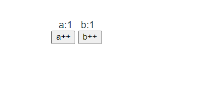

# 前言

感觉vue好像有好多很好用的组件,我就来看看


我还想添加一个在线问答的功能,在线问答就是利用ChatGPT提供的接口寻找更加准确的答案,这个在前端中需要做哪些事情?

# Vue2


## 引用vue

```
<script src="https://cdn.jsdelivr.net/npm/vue@2/dist/vue.js"></script>
```

## 模板语法

vue采用一种简洁的模板语法来绑定数据到 DOM。在 Vue 中，你可以在 HTML 模板中使用双大括号来插入文本，以及使用特殊的属性（称为指令）来实现数据绑定和其他功能。以下是 Vue 的一些主要模板语法特性：

1. 插值 (Interpolation)

   使用双大括号 将数据绑定到文本节点：

   ```
   <span>{{ message }}</span>
   ```

2. 属性绑定 (Attribute Binding)

   使用 v-bind 指令绑定 HTML 属性：

   ```
   
     简写方式
   ```

3. 条件渲染 (Conditional Rendering)

   使用 v-if、v-else-if 和 v-else 指令进行条件渲染：

   ```
   <div v-if="isVisible">显示内容</div>
   <div v-else-if="isError">错误信息</div>
   <div v-else>隐藏内容</div>
   ```

4. 循环渲染 (List Rendering)

   使用 v-for 指令渲染列表数据：

   ```
   <ul>
     <li v-for="item in items" :key="item.id">
       {{ item.text }}
     </li>
   </ul>
   ```

5. 事件监听 (Event Handling)

   使用 v-on 指令监听 DOM 事件：

   ```
   <button v-on:click="handleClick">点击我</button>
   <button @click="handleClick">点击我</button> 简写
   ```

6. 文本渲染 

   * v-text：用于更新元素的textContent
   * v-html：用于输出HTML字符串。(小心使用这个,可能会出现xss攻击)

7. v-cloak：解决在页面加载时出现的闪烁问题，可以在vue实例编译结束时，自动移除v-cloak属性。我们可以通过css和js对其进行一些操作,等到vue接管后移除这个属性

8. v-once：**只渲染元素和组件一次。随后的重新渲染, 元素/组件及其所有的子节点将被视为静态内容并跳过**。

9. v-pre  跳过模板编译,直接显示原始页面,可以减少一些渲染,比如我们一个容器里面不需要使用的指令的结点就可以不需要编译

10. 表单输入绑定 (Form Input Bindings)

   使用 v-model 指令实现双向数据绑定：

   ```
   <input v-model:value="message" placeholder="请输入内容">
   <input v-model="message" placeholder="请输入内容"> 简写
   ```

​		v-model 只能用于可以输入标签上

在表单字段,v-bind 是单向绑定, 只有当js数据发生变化的时候才会影响页面数据变化, 但是页面数据发生变化的时候,js变量数据不会发生变化,v-model是双向的

**模板中必须是在Vue对象身上有的变量才能使用**

**插值和指令里面要写js表达式**

## vue对象常用配置项

在创建一个 Vue 对象时，你需要向构造函数传递一个配置对象，其中包含一些属性和方法。以下是一些常用的配置项及其含义：

1. el: 指定 Vue 实例挂载到 DOM 的元素。可以是一个 CSS 选择器字符串，也可以是一个 HTML 元素。

   ```
   el: '#app'
   ```

2. data: 定义 Vue 实例的数据对象。这些数据会被 Vue 进行响应式处理，以便在数据变化时自动更新视图。

   ```
   // 对象式
   data: {
     message: 'Hello Vue!'
   }
   
   // 使用脚手架的时候必须使用这个方式,因为如果不使用这个方式的话,无法共享组件,数据会混乱
   // 函数式
   // 这里千万不能使用箭头函数
   data:function(){
   	return {
   		message:"Hello Vue!"
   	}
   }
   ```

3. methods: 定义 Vue 实例的方法。这些方法可以在模板中通过事件绑定或其他方式调用。

   ```
   methods: {
     handleClick: function () {
       alert('Button clicked!');
     }
   }
   ```

4. computed: 定义 Vue 实例的计算属性。计算属性是基于其他响应式数据进行计算的属性，会根据依赖数据的变化自动更新。

   ```
   computed: {
     reversedMessage: function () {
       return this.message.split('').reverse().join('');
     }
   }
   ```

5. watch: 定义 Vue 实例的监听器。监听器用于观察和响应数据的变化。

   ```
   watch: {
     message: function (newValue, oldValue) {
       console.log('新值:', newValue, '旧值:', oldValue);
     }
   }
   ```

6. components: 定义 Vue 实例的局部组件。这些组件只能在当前 Vue 实例的模板中使用。

   ```
   components: {
     'my-component': {
       template: '<div>自定义组件</div>'
     }
   }
   ```

7. props: 定义接收的属性，仅适用于 Vue 组件。

   ```
   props: ['title', 'content']
   ```

8. template: 定义组件的模板。可以是一个字符串模板，也可以是一个 HTML 元素。

   ```
   template: '<div>{{ message }}</div>'
   ```

9. mounted: 生命周期钩子，在 Vue 实例挂载到 DOM 之后调用。可以在这个钩子中执行一些初始化操作，如获取数据、添加事件监听器等。

   ```
   mounted: function () {
     console.log('Vue 实例已挂载');
   }
   ```

10. created: 生命周期钩子，在 Vue 实例创建完成后立即调用。此时，实例已完成以下配置：数据观测（data observer）、计算属性（computed properties）以及方法（methods）。

    ```
    created: function () {
      console.log('Vue 实例已创建');
    }
    ```

vue 在实例化过程中，会对这些配置项进行处理和初始化。以下是 Vue 对主要配置项所做的处理：

1. `data`：Vue 会将 `data` 中的属性添加到 Vue 实例上，并使这些属性变得响应式。这意味着当这些属性值发生变化时，Vue 会自动更新相关视图。Vue 还会将 `data` 属性代理到 Vue 实例本身，以便可以直接通过 `this.propertyName` 访问这些属性。
2. `computed`：Vue 会处理 `computed` 对象中定义的计算属性。计算属性是基于其他属性值（如 `data` 中的属性）计算得到的属性，它们会被缓存，只有当依赖的属性发生变化时，计算属性的值才会重新计算。
3. `watch`：Vue 会设置 `watch` 对象中定义的侦听器。侦听器允许你对 Vue 实例中的某个属性进行观察，当该属性的值发生变化时，侦听器会触发指定的回调函数。
4. `methods`：Vue 会将 `methods` 对象中定义的方法添加到 Vue 实例上，以便可以在 Vue 实例（如模板或其他方法）中使用这些方法。这些方法会自动绑定到 Vue 实例，因此可以在方法内部通过 `this` 访问 Vue 实例。
5. `el`：Vue 会将 `el` 选项作为挂载点，将 Vue 实例挂载到 DOM 元素上。你可以传递一个选择器字符串或一个 DOM 元素。Vue 会将编译好的模板替换这个元素。
6. `template`：Vue 会将 `template` 选项作为模板，用于渲染 Vue 实例。模板可以是一个字符串或一个 DOM 元素。在编译过程中，模板会被转换为虚拟 DOM，然后 Vue 会将虚拟 DOM 渲染为真实 DOM 并插入到页面中。
7. `components`：Vue 会注册 `components` 对象中定义的子组件。这些子组件可以在 Vue 实例的模板中使用，以便构建组件化的应用程序。
8. `props`：对于组件实例，Vue 会处理 `props` 对象中定义的属性。这些属性允许你从父组件向子组件传递数据。
9. `mixins`：Vue 会将 `mixins` 数组中的 mixin 对象合并到 Vue 实例的配置对象中。mixin 对象可以包含任意的 Vue 配置选项（如 `data`、`methods`、`computed` 等），这些选项将被合并到 Vue 实例中，实现代码复用

## MVVM模型

MVVM（Model-View-ViewModel）是一种软件架构设计模式，它将应用程序的逻辑、数据和界面分离。Vue.js 是一个基于 MVVM 模式的前端框架，它通过双向数据绑定在 Model（数据模型）和 View（视图）之间建立联系，而 ViewModel（视图模型）充当这两者之间的桥梁。

在 Vue 中，MVVM 的组成部分如下：

1. Model（数据模型）：在 Vue 中，Model 通常是一个 JavaScript 对象，它包含应用程序的数据和业务逻辑。Model 位于 Vue 实例的 data 属性中，是响应式的，即当数据发生变化时，Vue 会自动更新与之相关的视图。
2. View（视图）：视图是指用户界面，即 HTML 模板。在 Vue 中，视图使用模板语法与 Model 进行绑定，包括插值、属性绑定、事件监听等。当 Model 中的数据发生变化时，视图会自动更新。
3. ViewModel（视图模型）：ViewModel 是 Vue 实例本身，它充当 Model 和 View 之间的桥梁。ViewModel 监听 Model 中数据的变化，并通过双向数据绑定自动更新视图。同时，它还处理用户在视图中触发的事件，如按钮点击、表单提交等，并根据需要更新 Model。

Vue.js 的 MVVM 模式实现了 Model 和 View 之间的解耦，使得开发者可以专注于业务逻辑，而无需关心 DOM 操作和事件处理。这样可以提高代码的可维护性、可复用性和可测试性。

## 数据代理

在 Vue.js 中，**数据代理指的是 Vue 实例可以直接访问其 data 对象中的属性，而无需通过 data 对象本身**。这意味着你可以使用 `this.propertyName` 访问和操作 data 中的属性，而不是 `this.data.propertyName`。**数据代理简化了代码并提高了可读性**。

数据代理的原理是基于 JavaScript 的访问器属性（getter 和 setter）和 `Object.defineProperty` 方法实现的。Vue 在创建实例时，会遍历 data 对象的属性，并通过 `Object.defineProperty` 为每个属性定义 getter 和 setter。这样，当你访问或修改 Vue 实例上的属性时，实际上是通过代理访问或修改 data 对象中的对应属性。

以下是一个简化的数据代理实现示例：

```
function Vue(options) {
  this.data = options.data;
  this.proxyData();
}

Vue.prototype.proxyData = function () {
  for (const key in this.data) {
    if (this.data.hasOwnProperty(key)) {
      Object.defineProperty(this, key, {
        enumerable: true,
        configurable: true,
        get: () => {
          return this.data[key];
        },
        set: (newValue) => {
          this.data[key] = newValue;
        },
      });
    }
  }
};
```

## 数据劫持

vue.js 中的数据劫持是指框架通过劫持对象属性的 getter 和 setter 方法，以实现对数据的监听和响应式更新。当数据发生变化时，Vue.js 能够自动检测到这些变化，**并更新相关的视图**。数据劫持是 Vue.js 实现双向数据绑定和响应式更新的核心技术。

Vue.js 中的数据劫持主要是通过 `Object.defineProperty` 方法实现的。具体实现过程如下：

1. 遍历 data 对象的属性：在创建 Vue 实例时，框架会遍历 data 对象的所有属性。
2. 为每个属性定义 getter 和 setter：使用 `Object.defineProperty` 方法为每个属性定义访问器属性，即 getter 和 setter 方法。
3. 在 getter 中收集依赖：当访问某个属性时，getter 方法会被触发。在 getter 中，Vue.js 会收集当前属性的依赖（如计算属性、模板等）。
4. 在 setter 中触发更新：当修改某个属性时，setter 方法会被触发。在 setter 中，Vue.js 会通知与该属性相关的依赖进行更新，从而实现响应式更新。

以下是一个简化的数据劫持实现示例：

```
function observe(data) {
  if (!data || typeof data !== 'object') {
    return;
  }

  for (const key in data) {
    if (data.hasOwnProperty(key)) {
      let value = data[key];
      observe(value); // 递归处理嵌套对象

      Object.defineProperty(data, key, {
        enumerable: true,
        configurable: true,
        get: () => {
          console.log('访问:', key, value);
          return value;
        },
        set: (newValue) => {
          console.log('修改:', key, newValue);
          if (newValue !== value) {
            value = newValue;
            observe(newValue); // 如果设置了新的对象，则继续劫持新对象的属性
          }
        },
      });
    }
  }
}
```

这里利用了闭包能够保存临时变量的特点

### 劫持数据类型的区别

1. **对象**：对于对象，Vue 会遍历对象的所有属性，使用 Object.defineProperty（Vue 2.x）或 Proxy（Vue 3.x）对每个属性进行劫持。当属性值发生变化时，Vue 会被通知并触发视图更新。这种方法适用于对象，因为它可以精确地监视每个属性的变化。
2. **数组**：对于数组，Vue 会使用不同的策略进行数据劫持。使用 Object.defineProperty 或 Proxy 对数组的索引进行劫持并不是一个好主意，因为这样会导致性能问题。相反，Vue 使用一种基于原型链的方法来监视数组变化。Vue 会覆盖数组的一些原生方法，如 `push`、`pop`、`shift`、`unshift`、`splice`、`sort` 和 `reverse`。当这些方法被调用时，Vue 会执行原生操作，并同时通知视图更新。这样可以避免对数组索引进行劫持，从而提高性能。

如果我们的数组里面包含了对象比如这样

```
persons: [{ id: 1, age: 25, name: '张三' }]
```

persons[0].age = 30   这种方式可以检测到

persons[0] = { id: 1, age: 30, name: '张三' }  这种方式检测不到,因此不会更新视图

### 后期添加数据劫持

在 Vue 中，如果要在实例创建之后添加新的响应式属性，你不能直接将新属性添加到对象或数组中，因为 Vue 默认情况下无法检测到这种变化。相反，你需要使用 Vue 提供的特殊方法：`Vue.set()`（或 `this.$set()`）和 `Vue.delete()`（或 `this.$delete()`）。

以下是如何使用这些方法在 Vue 实例中添加和删除响应式属性的示例：

1. **为对象添加响应式属性**：

```
// 在 Vue 实例中添加一个新的响应式属性 `newProperty`
this.$set(this.someObject, 'newProperty', 'New Value');
```

1. **为数组添加响应式元素**：

```
// 向 Vue 实例中的数组添加一个新的响应式元素
this.$set(this.someArray, index, newValue);
```

需要注意的是，如果你要添加的属性本身是一个对象或数组，这个对象或数组中的值也将变成响应式的。

总之，在 Vue 实例创建之后，如果需要添加新的响应式属性，请使用 `Vue.set()`（或 `this.$set()`）方法。这将确保新属性是响应式的，并且在属性值发生变化时能够触发视图更新。

> 这个不能应用到vue._data 和 vue身上

## 收集表单数据

`v-model` 在表单输入框中绑定的值对应于 Vue 实例中的数据属性。当你在输入框中输入内容时，`v-model` 会自动将输入的值与 Vue 实例中的相应数据属性保持同步。这样，你可以轻松地访问和处理用户输入的数据。

手动连接值绑定和更改事件监听器可能会很麻烦：

```
<input
  :value="text"
  @input="event => text = event.target.value">
```

`v-model` 指令帮我们简化了这一步骤：

```
<input v-model="text">
```

以下是使用 `v-model` 在不同类型的表单元素中绑定的数据含义：

1. **文本输入框（`<input type="text">`）**：`v-model` 会绑定输入框中的文本值。当用户输入内容时，**输入框的值**将实时同步到 Vue 实例的相应数据属性。
2. **数值输入框（`<input type="number">`）**：`v-model` 会绑定输入框中的数值。与文本输入框类似，输入的数值会实时同步到 Vue 实例的相应数据属性。
3. **单选框（`<input type="radio">`）**：`v-model` 会绑定被选中的单选框的值。当用户选择一个单选框时，选中的值将同步到 Vue 实例的相应数据属性。
4. **复选框（`<input type="checkbox">`）**：**初始值会影响,如果是一个数据,代表是多个复选框,其他就是单个复选框**
   - 单个复选框：`v-model` 会绑定一个布尔值，表示复选框是否被选中。当用户选中或取消选中复选框时，布尔值将同步到 Vue 实例的相应数据属性。
   - 多个复选框：**`v-model` 会绑定一个数组**，其中包含所有被选中复选框的值。当用户选中或取消选中复选框时，数组将实时更新以反映当前选中的值。
5. **下拉列表（`<select>`）**：
   - 单选下拉列表：`v-model` 会绑定选中的选项的值。当用户选择一个选项时，选中的值将同步到 Vue 实例的相应数据属性。
   - 多选下拉列表：`v-model` 会绑定一个数组，其中包含所有被选中选项的值。当用户选中或取消选中选项时，数组将实时更新以反映当前选中的值。

这就是使用 `v-model` 在各种类型的表单输入框中绑定的数据含义。这些数据将实时同步到 Vue 实例中的相应数据属性，使得处理和验证用户输入变得更加简单。

### v-model的修饰符

1. **`.lazy`**：默认情况下，`v-model` 在输入框的 `input` 事件上进行同步。使用 `.lazy` 修饰符会将同步行为更改为在输入框的 `change` 事件上进行。这样，输入框的值只有在失去焦点时才会同步到 Vue 实例的数据属性。

   示例：

   ```
   <input v-model.lazy="message" />
   ```

2. **`.number`**：使用 `.number` 修饰符会将用户输入的值自动转换为 Number 类型。如果输入值无法被转换为有效的数字，结果将为 NaN。这在需要确保输入值为数字类型时非常有用。

   示例：

   ```
   <input v-model.number="age" type="text" />
   ```

3. **`.trim`**：`.trim` 修饰符用于自动去除用户输入的首尾空白字符。当输入框的值同步到 Vue 实例的数据属性时，首尾空白字符将被删除。

   示例：

   ```
   <input v-model.trim="message" />
   ```

## 事件绑定

在 Vue.js 中，使用 `v-on` 指令来绑定事件监听器。通过 `v-on`，你可以在 DOM 元素上绑定事件，例如点击、双击、键盘事件等，并调用 Vue 实例中的方法来处理这些事件。你还可以设置一些修饰符和传递参数来定制事件处理

以下是 `v-on` 的一些使用方法和设置:

### 绑定事件

使用 `v-on:eventName` 语法来绑定事件。将 `eventName` 替换为要监听的事件名称，例如 `click`、`dblclick`、`keydown` 等。

```
<button v-on:click="handleClick">点击我</button>
```

### 调用方法

在 Vue 实例的 `methods` 属性中定义事件处理方法，然后在 `v-on` 指令中指定该方法。

```
<script>
  new Vue({
    el: '#app',
    methods: {
      handleClick: function() {
        alert('按钮被点击了！');
      }
    }
  });
</script>
```

使用简写语法：`v-on` 支持简写语法 `@`。例如，可以使用 `@click` 代替 `v-on:click`。

```
<button @click="handleClick">点击我</button>
```

### **传递参数**

在事件处理方法中，可以接收事件对象作为参数。还可以在绑定事件时传递自定义参数。

```
<button @click="handleClick($event, '自定义参数')">点击我</button>

<script>
  new Vue({
    el: '#app',
    methods: {
      handleClick: function(event, customParam) {
        console.log(event, customParam);
      }
    }
  });
</script>
```

### **事件修饰符**

Vue.js 提供了一些事件修饰符，用于处理事件细节。事件修饰符以点 `.` 开头，跟在事件名称后面。

- `.stop`：阻止事件冒泡。(常用)
- `.prevent`：阻止事件的默认行为。(常用)
- `.once`：只触发一次事件处理函数。(常用)
- `.capture`：使用事件捕获模式而不是冒泡模式。
- `.self`：只在事件在当前元素（而非子元素）上触发时调用处理函数。
- `.passive`：以被动模式添加事件监听器。比如滚轮事件, 滚动之后我们需要去远程下载一张图片,如果不使用这个修饰符,滚动条得等到图片下载完毕才能滚动, 如果使用这个修饰符,不用等图片下载完毕就能滚动

```
<!-- 阻止事件冒泡 -->
<button @click.stop="handleClick">点击我</button>

<!-- 阻止事件默认行为 -->
<a @click.prevent="handleClick" href="https://example.com">点击我</a>

<!-- 使用事件捕获模式 -->
<button @click.capture="handleClick">点击我</button>

<!-- 只在当前元素触发事件 -->
<button @click.self="handleClick">点击我</button>

<!-- 只触发一次事件处理函数 -->
<button @click.once="handleClick">点击我</button>

<!-- 以被动模式添加事件监听器 -->
<button @click.passive="handleClick">点击我</button>
```

### **按键修饰符**

对于对于键盘事件，Vue.js 提供了按键修饰符来监听特定按键的事件。按键修饰符同样以点 `.` 开头，跟在事件名称后面。

以下是一些常见的按键修饰符：

- `.enter`
- `.tab`
- `.delete` (捕获 "删除" 和 "退格" 键)
- `.esc`
- `.space`
- `.up`
- `.down`
- `.left`
- `.right`

例如，你可以在 `keydown` 事件中使用按键修饰符来监听 Enter 键：

```
<input @keydown.enter="handleEnter" />

<script>
  new Vue({
    el: '#app',
    methods: {
      handleEnter: function() {
        console.log('按下了 Enter 键');
      }
    }
  });
</script>
```

你还可以自定义按键别名。在 Vue 实例的全局配置中，使用 `Vue.config.keyCodes` 对象添加自定义按键别名：

```
Vue.config.keyCodes.customKey = 123; // 将按键码 123 映射为 "customKey"

// 然后在模板中使用自定义按键修饰符
// <input @keydown.customKey="handleCustomKey" />
```

总结一下，Vue.js 中的事件绑定可以通过 `v-on` 指令实现，支持多种设置选项，如传递参数、使用事件修饰符和按键修饰符等。这些设置选项可以帮助你方便地处理不同场景下的事件监听和处理。

## 计算属性

Vue.js 中的计算属性（Computed properties）是一种特殊类型的属性，它们的值是通过其他属性（通常是 `data` 中的属性）进行计算得到的。计算属性在 Vue 实例的 `computed` 选项中定义。与普通属性不同，计算属性会被缓存，**只有当依赖的属性(Vue劫持了的数据)发生变化时**，计算属性的值才会重新计算。这有助于提高性能，特别是当计算过程复杂或计算代价较高时

计算属性主要包含两个配置项：`get` 和 `set`。

`get`：用于计算属性的计算函数。当访问计算属性时，`get` 函数将被调用，用于计算属性的值。通常，`get` 函数会根据其他属性（如 `data` 中的属性）的值来计算结果。默认情况下，如果你直接在 `computed` 对象中定义一个函数，那么它就是 `get` 函数。

```
javascriptCopy codecomputed: {
  fullName: function() {
    return this.firstName + " " + this.lastName;
  }
}
```

set`：用于设置计算属性的函数。当尝试修改计算属性的值时，`set` 函数将被调用。通常，`set` 函数会根据传入的新值来更新其他相关属性（如 `data` 中的属性）。

```
javascriptCopy codecomputed: {
  fullName: {
    get: function() {
      return this.firstName + " " + this.lastName;
    },
    set: function(newValue) {
      var names = newValue.split(" ");
      this.firstName = names[0];
      this.lastName = names[1];
    }
  }
}
```

在这个例子中，我们定义了一个名为 `fullName` 的计算属性，它具有 `get` 和 `set` 函数。当访问 `fullName` 时，`get` 函数将根据 `firstName` 和 `lastName` 属性计算结果。当尝试修改 `fullName` 的值时，`set` 函数将被调用，并根据新值更新 `firstName` 和 `lastName` 属性。

总之，计算属性的主要配置项包括 `get` 和 `set` 函数。`get` 函数用于计算属性的值，而 `set` 函数用于设置计算属性的值。通过这两个函数，你可以方便地处理基于其他属性的计算和更新逻辑。

### 计算属性的优势

1. **缓存**：计算属性会缓存计算结果。只有当依赖的属性发生变化时，计算属性才会重新计算。这有助于提高性能，特别是当计算过程复杂或计算代价较高时。
2. **响应式**：计算属性依赖于其他响应式属性。当依赖的属性发生变化时，计算属性会自动更新。这使得计算属性在处理复杂逻辑和依赖关系时非常方便。
3. **可读性**：计算属性可以将复杂的逻辑封装在一个属性中，提高代码的可读性和可维护性。

### 计算属性与方法的区别

尽管你也可以在 Vue 实例的 `methods` 选项中定义方法来实现类似的功能，但计算属性具有缓存和响应式的优势。当多次访问同一个计算属性时，计算属性会返回缓存的结果，而不是重新计算。相反，使用方法时，**每次调用方法**都会重新计算结果。因此，在性能和依赖处理方面，计算属性更具优势。

## 监视属性

监视属性（Watch properties）是 Vue 中用于观察和响应 Vue 实例上属性值变化的一种机制。**它允许你为某个属性指定一个回调函数**，当该属性的值发生变化时，回调函数将被调用。你可以在 Vue 实例的 `watch` 选项中定义监视属性。

以下是 `watch` 选项的一些配置：

**普通监视函数**：为要监视的属性提供一个回调函数。回调函数接收两个参数：新值（`newVal`）和旧值（`oldVal`）。

```
watch: {
  propertyName: function(newVal, oldVal) {
    // 在这里执行属性值变化时的操作
  }
}
```

**立即执行的监视函数**：如果你希望监视函数在 Vue 实例初始化时立即执行，可以使用 `handler` 属性定义回调函数，并将 `immediate` 属性设置为 `true`。

```
watch: {
  propertyName: {
    handler: function(newVal, oldVal) {
      // 在这里执行属性值变化时的操作
    },
    immediate: true
  }
}
```

**带延迟的监视函数**：如果你希望在属性值发生变化后延迟一段时间再执行回调函数，可以使用 `handler` 属性定义回调函数，并设置 `delay` 属性为一个毫秒值。

```
watch: {
  propertyName: {
    handler: function(newVal, oldVal) {
      // 在这里执行属性值变化时的操作
    },
    delay: 500 // 延迟 500 毫秒后执行回调函数
  }
}
```

**深度监视**：默认情况下，Vue 只监视属性的一级变化。如果你需要监视一个对象的嵌套属性，可以将 `deep` 属性设置为 `true`。

```
watch: {
  objectProperty: {
    handler: function(newVal, oldVal) {
      // 在这里执行属性值变化时的操作
    },
    deep: true // 深度监视嵌套属性变化
  }
}
```

> 除了使用new Vue的时候传入监视配置,也可以在后面使用 Vue的$watch方法
>
> 如果是多层结构的话  监视名字得这样  "a.b.c"

监视属性的主要用途是在属性值发生变化时执行某些操作，例如数据验证、数据获取、状态更新等。监视属性特别适用于处理异步或昂贵操作的情况。

**监视属性能够监视 vue自己通过Object.defineProperty方法往自己身上加的属性 比如 data里面的数据  计算属性**

值得注意的是，监视属性并非适用于所有情况。在很多情况下，计算属性可能是更好的选择，特别是当你需要根据其他属性计算一个值时。然而，监视属性在处理异步操作和昂贵操作时非常有用，因为它们允许你在属性值发生变化时执行特定操作。


## Class 与 Style 绑定

### class 绑定


在 Vue 中，你可以使用 `v-bind:class`（简写为 `:class`）动态地绑定 class。以下是一些常见的 class 绑定规则以及它们的使用方法：

**字符串语法**：直接将字符串作为 class 名传递给 `v-bind:class`。字符串中的类名将被添加到元素上。

```
<div v-bind:class="className"></div>
```

在这个例子中，`className` 可以是一个字符串，也可以是返回字符串的计算属性。

**对象语法**：使用对象语法，你可以根据对象的属性值（布尔值）动态地切换类。对象的属性名表示要绑定的类名，属性值为布尔值，决定是否应用该类。

```
<div v-bind:class="{ active: isActive, error: hasError }"></div>
```

在这个例子中，`active` 类将只在 `isActive` 为 `true` 时应用；`error` 类将只在 `hasError` 为 `true` 时应用。

**数组语法**：使用数组语法，你可以将一个包含类名的数组传递给 `v-bind:class`。数组中的所有类名将被添加到元素上。

```
<div v-bind:class="[classA, classB]"></div>
```

在这个例子中，`classA` 和 `classB` 都会被添加到元素上。它们可以是字符串或计算属性。

**数组语法中的对象**：在数组语法中，你还可以使用对象来根据条件切换类名。

```
<div v-bind:class="[{ active: isActive }, classB]"></div>
```

在这个例子中，`active` 类将只在 `isActive` 为 `true` 时应用；`classB` 总是会被添加到元素上。

**绑定组件的 class**：在自定义组件中，你可以使用 `v-bind:class` 来绑定类。这些类将被添加到组件的根元素上。

```
<my-component v-bind:class="{ active: isActive }"></my-component>
```

在这个例子中，如果 `isActive` 为 `true`，则 `active` 类将被添加到 `my-component` 的根元素上。

### style绑定

在 Vue 中，你可以使用 `v-bind:style`（简写为 `:style`）动态地绑定 style。以下是一些常见的 style 绑定规则以及它们的使用方法：

**对象语法**：使用对象语法，你可以将一个包含 CSS 属性及其值的对象传递给 `v-bind:style`。对象的属性名应为驼峰式（camelCase）或短横线分隔（kebab-case，需要加引号）的 CSS 属性名，属性值为相应的样式值。

```
<div v-bind:style="{ color: activeColor, fontSize: fontSize + 'px' }"></div>
```

在这个例子中，`activeColor` 和 `fontSize` 可以是 data 属性、计算属性或方法的返回值。

**数组语法**：使用数组语法，你可以将一个包含多个样式对象的数组传递给 `v-bind:style`。数组中的所有样式对象将被合并，并应用到元素上。

```
<div v-bind:style="[styleObjectA, styleObjectB]"></div>
```

在这个例子中，`styleObjectA` 和 `styleObjectB` 都应该是包含样式属性及其值的对象。它们可以是 data 属性、计算属性或方法的返回值。

**自动添加前缀**：Vue 会自动为某些需要浏览器前缀的 CSS 属性添加前缀，如 `transform`。你只需要写标准的 CSS 属性名，Vue 会自动处理浏览器兼容性问题。**绑定组件的 style**：在自定义组件中，你可以使用 `v-bind:style` 来绑定样式。这些样式将被添加到组件的根元素上。

```
<my-component v-bind:style="{ color: activeColor }"></my-component>
```

在这个例子中，`activeColor` 的值将被应用到 `my-component` 的根元素上。

> 我们绑定的class和style都是追加到标签的属性中的, 也就是说我们固定的属性并不会被删掉

## 条件渲染

ue 提供了一些指令来实现条件渲染。这些指令可以根据表达式的值动态地添加或删除元素。以下是 Vue 中常见的条件渲染指令：

**v-if**：`v-if` 指令用于根据一个表达式的真假值来决定是否渲染一个元素。如果表达式的值为真（truthy），则该元素将被渲染；否则，该元素将不会被渲染。

```
<div v-if="show">这个元素将根据 show 的值进行条件渲染。</div>
```

在这个例子中，如果 `show` 的值为真（truthy），则该元素将被渲染；否则，不会被渲染。

**v-else**：`v-else` 指令用于表示一个与 `v-if` 配套使用的“否则”分支。`v-else` 必须紧跟在一个带有 `v-if` 的元素之后，它们共同表示一个条件渲染的 if-else 结构。

```
<div v-if="show">这个元素将在 show 为真时渲染。</div>
<div v-else>这个元素将在 show 为假时渲染。</div>
```

在这个例子中，当 `show` 的值为真时，第一个元素将被渲染；否则，第二个元素将被渲染。

**v-else-if**：`v-else-if` 指令用于表示一个与 `v-if` 配套使用的“否则如果”分支。`v-else-if` 必须紧跟在一个带有 `v-if` 或 `v-else-if` 的元素之后，它们共同表示一个条件渲染的 if-elseif-else 结构。

```
<div v-if="type === 'A'">这个元素将在 type 为 'A' 时渲染。</div>
<div v-else-if="type === 'B'">这个元素将在 type 为 'B' 时渲染。</div>
<div v-else>这个元素将在 type 不是 'A' 或 'B' 时渲染。</div>
```

在这个例子中，根据 `type` 的值，将渲染不同的元素。

**v-show**：`v-show` 指令与 `v-if` 类似，也用于根据一个表达式的真假值来决定是否显示一个元素。但与 `v-if` 不同的是，`v-show` 不会实际移除或添加元素，而是通过 CSS 的 `display` 属性来控制元素的显示和隐藏。

```
htmlCopy code
<div v-show="show">这个元素将根据 show 的值进行显示或隐藏。</div>
```

在这个例子中，如果 `show` 的值为真,则该元素将被显示；否则，该元素将被隐藏。请注意，`v-show` 只是简单地切换元素的 CSS `display` 属性，而不是像 `v-if` 那样实际移除或添加元素。

**v-if 与 v-show 的区别**

尽管 `v-if` 和 `v-show` 都可以实现条件渲染，但它们在某些方面有所不同：

- `v-if` 是真正的条件渲染，它会在条件满足时将元素添加到 DOM，条件不满足时将元素从 DOM 移除。这意味着切换 `v-if` 的条件会触发组件的销毁与重建，以及过渡效果。
- `v-show` 只是简单地切换元素的 CSS `display` 属性。无论条件是否满足，元素始终存在于 DOM 中，只是显示或隐藏。这意味着 `v-show` 的切换不会触发组件的销毁与重建，以及过渡效果。

在选择 `v-if` 和 `v-show` 时，可以根据以下原则来决定：

- 如果需要频繁切换显示和隐藏的元素，使用 `v-show` 可能更合适，因为它不会导致组件的销毁与重建，性能较好。
- 如果元素可能永远不会被显示，或者条件改变较少的情况下，使用 `v-if` 更合适，因为它可以减少初始渲染的开销。

## 列表渲染

在 Vue 中，列表渲染是一种常见的需求。为了方便地渲染列表数据，Vue 提供了 `v-for` 指令。`v-for` 可以遍历数组或对象，并为每个元素生成一个模板实例。

以下是关于 Vue 中列表渲染的一些用法：

**遍历数组**：使用 `v-for` 遍历数组时，需要提供一个表达式，表示“元素 in 数组”。遍历过程中，每个元素都将被绑定到当前模板实例。

```
<ul>
  <li v-for="item in items">{{ item }}</li>
</ul>
```

在这个例子中，`items` 是一个数组，`item` 是数组中的每个元素。`v-for` 将为 `items` 中的每个元素生成一个 `<li>` 标签。

**遍历对象**：使用 `v-for` 遍历对象时，需要提供一个表达式，表示“(值, 键) in 对象”。遍历过程中，对象的每个属性都将被绑定到当前模板实例。

```
<ul>
  <li v-for="(value, key) in object">{{ key }}: {{ value }}</li>
</ul>
```

在这个例子中，`object` 是一个对象，`key` 是对象中的每个属性名，`value` 是对象中每个属性的值。`v-for` 将为 `object` 中的每个属性生成一个 `<li>` 标签。

**遍历指定次数**: 我们可以指定次数遍历

```
<p v-for="(n,i) in 5">{{i}}-{{n}}</p>
```

索引从0开始,数字从1开始

**遍历数组或对象时获取索引**：在遍历数组或对象时，你可以使用第三个参数获取当前元素的索引。

```
<!-- 遍历数组时获取索引 -->
<ul>
  <li v-for="(item, index) in items">{{ index }}: {{ item }}</li>
</ul>

<!-- 遍历对象时获取索引 -->
<ul>
  <li v-for="(value, key, index) in object">{{ index }} - {{ key }}: {{ value }}</li>
</ul>
```

**在组件上使用 `v-for`**：在自定义组件中，你可以使用 `v-for` 来遍历数据。遍历过程中，每个元素都将作为 prop 传递给组件。

```
<my-component v-for="item in items" v-bind:item="item" v-bind:key="item.id"></my-component>
```

在这个例子中，`items` 是一个数组，`item` 是数组中的每个元素。`v-for` 将为 `items` 中的每个元素生成一个 `my-component` 组件实例。请注意，为了提高性能和避免重复渲染，你应该使用 `v-bind:key` 为每个组件实例绑定一个唯一的键值（通常是数据的 ID）。


在 Vue 中的列表渲染中，`key` 属性是一个特殊的属性，用于跟踪每个节点的唯一性。**当 Vue 更新 DOM 时，它会尽可能地复用和重排现有的元素，而不是从头开始渲染。通过为每个列表项提供一个唯一的 `key`，可以帮助 Vue 更高效地识别和管理这些节点**。

以下是关于 `key` 属性的一些特点和好处：

1. **提高性能**：`key` 的主要作用是提高列表渲染的性能。当列表发生变化时（例如，添加、删除、重新排序等操作），Vue 会根据每个节点的 `key` 来判断是否可以复用现有的 DOM 元素。这可以避免不必要的渲染，从而提高性能。
2. **维护组件状态**：当你在列表中使用组件时，使用 `key` 可以帮助 Vue 维护组件的状态。在某些情况下，如果没有使用 `key`，当列表发生变化时，Vue 可能会复用组件实例，这可能导致组件状态出现问题。通过为每个组件实例提供一个唯一的 `key`，可以确保 Vue 正确地追踪和管理组件状态。
3. **唯一且稳定**：`key` 的值应该是唯一且稳定的，这样 Vue 才能正确地追踪节点。通常情况下，你可以使用数据项的唯一 ID 作为 `key`。在某些特殊情况下，你也可以使用其他唯一且稳定的值，例如索引（但这可能会导致性能和状态管理问题，因此不推荐）。

以下是一个使用 `key` 的列表渲染示例：

```
<ul>
  <li v-for="item in items" v-bind:key="item.id">{{ item.text }}</li>
</ul>
```

在这个例子中，`items` 是一个数组，每个元素都包含一个唯一的 `id`。`v-for` 为 `items` 中的每个元素生成一个 `<li>` 标签，并使用 `v-bind:key` 为每个标签绑定一个唯一的 `key`。

`key` 属性如何帮助 Vue 复用现有的 DOM 元素主要是通过 Vue 的 diff 算法实现的。当列表数据发生变化时，Vue 会通过这个算法比较**新旧虚拟 DOM 树**，以确定是否可以复用现有的 DOM 元素。`key` 在这个过程中起到了关键作用，它可以帮助 Vue 更准确地识别哪些节点可以被复用。

以下是关于 `key` 如何帮助复用 DOM 元素的简要说明：

1. **创建虚拟 DOM 树**：当 Vue 组件渲染时，它会创建一个虚拟 DOM 树来表示真实的 DOM 结构。虚拟 DOM 树是一个轻量级的 JavaScript 对象，它包含了节点的类型、属性、事件等信息。`key` 属性也会被包含在虚拟 DOM 节点中。
2. **比较新旧虚拟 DOM 树**：当组件状态发生变化时，Vue 会创建一个新的虚拟 DOM 树，并将其与旧的虚拟 DOM 树进行比较。这个比较过程称为 diff 算法。
3. **识别可复用节点**：在 diff 算法过程中，Vue 会尝试找到可以复用的节点。为了找到这些节点，Vue 需要确定新旧虚拟 DOM 树中的节点是否相同。**`key` 在这个过程中起到了重要作用。当两个节点具有相同的 `key` 时，Vue 认为它们是相同的**，因此可以尝试**复用现有的相同的 DOM** 元素。如果没有 `key` 或 `key` 不同，Vue 将创建一个新的 DOM 元素。
4. **更新 DOM**：根据 diff 算法的结果，Vue 会对真实的 DOM 进行更新。对于可以复用的节点，Vue 会更新其属性、事件等，而不是重新创建。这样可以避免不必要的渲染开销，提高性能。

总之，`key` 在 Vue 的列表渲染中扮演着重要的角色，它可以提高性能、确保正确的组件状态管理，以及帮助 Vue 更高效地追踪和管理节点。因此，在使用 `v-for` 进行列表渲染时，建议总是为每个节点提供一个唯一的 `key`。

## 过滤器

Vue.js 中的过滤器（filters）是一种特殊的函数，用于对数据进行格式化或转换。过滤器通常与插值表达式和 `v-bind` 指令一起使用，使得在模板中对数据进行格式化变得简单。

过滤器的主要用途是处理一些简单的文本格式化，如大小写转换、货币格式化、日期格式化等。它们不会改变原始数据，只是对数据进行转换后显示。

要在 Vue.js 中使用过滤器，需要遵循以下步骤：

1. **定义过滤器**：在 Vue 实例的 `filters` 选项中定义过滤器函数。**过滤器函数始终接收原始值作为第一个参数**，可以接受额外的参数,在使用的的时候直接函数式传参就行  。

   示例：

   ```
   filters: {
     repeatString(value, count, separator) {
       if (!value) return '';
       value = value.toString();
       return Array(count).fill(value).join(separator);
     }
   }
   
   ```

2. **使用过滤器**：在插值表达式或 `v-bind` 指令中，使用管道符（`|`）将原始值传递给过滤器函数。

   示例：

   ```
   <!-- 在插值表达式中使用过滤器 -->
   <p>{{ message | repeatString(3, ', ') }}</p>
   
   
   <!-- 在 v-bind 指令中使用过滤器 -->
   <p v-bind:title="message | repeatString(3, ', ')">Hover to see  title</p>
   ```

你还可以将多个过滤器链式使用，将一个过滤器的输出作为另一个过滤器的输入。只需用管道符（`|`）分隔过滤器名称即可。

示例：

```
htmlCopy code<!-- 链式使用过滤器 -->
<p>{{ message | repeatString(3, ', ') | reverse }}</p>
```

需要注意的是，Vue.js 过滤器的主要目的是处理简单的文本格式化，而不是用于处理复杂数值计算或逻辑。对于复杂数值计算或逻辑，建议使用计算属性或方法。

### 全局过滤器

在配置项里面写好的是局部过滤器,只能在局部使用,全局过滤器可以在任何 Vue 实例或组件中使用，而无需在每个实例中单独定义

以下是一个创建全局过滤器的示例：

1. **定义全局过滤器**：在创建 Vue 实例之前，使用 `Vue.filter()` 方法定义全局过滤器。该方法接受两个参数：过滤器名称（字符串）和过滤器函数。

```
Vue.filter('capitalize', function (value) {
  if (!value) return '';
  value = value.toString();
  return value.charAt(0).toUpperCase() + value.slice(1);
});
```

2. **使用全局过滤器**：在任何 Vue 实例或组件的插值表达式或 `v-bind` 指令中，使用管道符（`|`）将原始值传递给全局过滤器。

```
<!-- 在插值表达式中使用全局过滤器 -->
<p>{{ message | capitalize }}</p>

<!-- 在 v-bind 指令中使用全局过滤器 -->
<p v-bind:title="message | capitalize">Hover to see capitalized title</p>
```

全局过滤器在整个应用程序中都可以使用，这意味着你只需要在一个地方定义过滤器，就可以在多个 Vue 实例或组件中使用它。但请注意，**如果全局过滤器与局部过滤器同名，局部过滤器将优先使用**。

> 过滤器只支持插值语法跟 v-bind

## 自定义指令

在Vue中，自定义指令允许你为元素添加特定的行为，有时候这比组件更加方便。自定义指令可以帮助你封装和重用一些DOM操作逻辑，使代码更易于阅读和维护。

以下是如何创建和使用自定义指令的详细步骤：

**注册全局自定义指令**：

```
Vue.directive('focus', {
  inserted: function (el) {
    el.focus()
  }
})
```

**注册局部自定义指令**：

```
new Vue({
  el: '#app',
  directives: {
    focus: {  // 这个就是指令名字,但是使用的时候得用v-开头
      inserted: function (el) {
        el.focus()
      }
    }
  }
})
```

**在模板中使用自定义指令**：

```
<input v-focus>  // 注意使用 v-  +  指令名字
```

自定义指令的配置项：

- bind：指令第一次绑定到元素时调用，可以进行一次性的初始化设置。
- inserted：被绑定元素插入父节点时调用（仅需父节点存在，不必存在于document中）。
- update：所在组件的 VNode 更新时调用，可能在其子 VNode 更新之前。指令的值可能发生了改变，也可能没有。
- componentUpdated：指令所在组件的 VNode 及其子 VNode 全部更新后调用。
- unbind：指令与元素解绑时调用，可以进行一些清理工作。

> 如果是函数式的话,在bind和update会执行这个函数

钩子函数的参数：

- el：指令所绑定的元素，可用于直接操作DOM。
- binding：包含以下属性的对象：
  - **name**：指令名，不包括v-前缀。
  - **value**：指令的绑定值。例如：`v-focus="1 + 1"`中，绑定值为`2`。
  - oldValue：指令绑定的前一个值，仅在update和component Updated钩子中可用。
  - expression：字符串形式的指令表达式。例如：`v-focus="1 + 1"`中，表达式为`"1 + 1"`。
  - arg：传给指令的参数。例如：`v-focus:arg`中，arg为参数。
  - **modifiers**：**一个包含修饰符的对象**。例如：`v-focus.foo.bar`中，修饰符对象为`{ foo: true, bar: true }`。
- vnode：Vue编译生成的虚拟节点。
- oldVnode：上一个虚拟节点，仅在update和componentUpdated钩子中可用。

使用自定义指令时需要注意：

1. 不要在自定义指令中修改数据，尽量仅用于操作DOM。因为它并不具备响应式机制，可能导致数据和视图不一致。
2. 在编写自定义指令时，遵循Vue的单向数据流原则，尽量避免双向绑定。如果需要实现类似于双向绑定的功能，可以考虑使用组件或通过事件通信实现。
3. 避免在自定义指令中执行耗时操作，因为这可能导致界面卡顿或性能下降。对于复杂的操作，可以考虑使用计算属性、侦听器或生命周期钩子。
4. 注意指令的作用域。全局指令在整个应用中都可以使用，而局部指令仅在指定的Vue实例或组件中可用。如果指令具有通用性，可以注册为全局指令；如果仅在特定组件中使用，可以注册为局部指令。
5. 使用修饰符来扩展指令的功能。修饰符是以`.`分隔的特殊后缀，可以用于指示指令应以某种特定方式绑定。例如，你可以使用修饰符来表示在更新DOM时是否使用动画效果。
6. 注意自定义指令与Vue内置指令的命名冲突。避免使用与内置指令相同或相似的名称，以免发生意外的行为。
7. 在使用自定义指令时，确保对其参数、值和修饰符的处理正确。在钩子函数中，可以通过`binding`对象获取这些信息。

### 自己实现一个简单v-model

```
directives: {
    "my-model": {
        bind(el, bindding,vnode) {
            el.addEventListener('input', function(event){
                vnode.context[bindding.expression] = event.target.value
            });
            // 这里面的this是Window,而不是vm
            
        }
    }
}
```

我们给输入框的输入绑定了事件,只要输入了数据,就通过VNode拿到vm修改对应的数据

## 生命周期

ue的生命周期是指Vue实例或组件在其整个生命周期内经历的各个阶段。在这些阶段中，**Vue会触发一系列生命周期钩子函数**，这些函数可以让你在特定时机执行自定义的逻辑。了解生命周期及其钩子函数可以帮助你更好地管理组件的状态和资源。

Vue的生命周期主要包括以下几个阶段：

1. 创建阶段（Creation）：在这个阶段，Vue实例或组件开始创建，初始化数据和事件监听器。

   生命周期钩子函数：

   - `beforeCreate`: **在实例初始化之后、数据观测（data observer）和事件配置之前被调用**。
   - `created`: 在实例创建完成后被立即调用。此时，数据观测已经设置，**但DOM还没有生成**，`$el`属性还不可用。

2. 挂载阶段（Mounting）：在这个阶段，Vue实例或组件的模板将被**编译成虚拟DOM并挂载到真实DOM上**。

   生命周期钩子函数：

   - `beforeMount`: 在挂载开始之前被调用。**此时，模板已编译成渲染函数，但还没有挂载到真实DOM上**。
   - `mounted`: **在实例被挂载到真实DOM上后调用**。此时，你可以访问到DOM元素，但需要注意的是，**不保证子组件也都一起被挂载**。

3. 更新阶段（Updating）：在这个阶段，Vue实例或组件的数据发生变化，导致虚拟DOM重新渲染并更新真实DOM。

   生命周期钩子函数：

   - `beforeUpdate`: 在数据变化导致的虚拟DOM重新渲染和打补丁之前被调用。此时，**你可以在这个钩子函数中进一步改变数据，避免不必要的更新**。
   - `updated`: 在数据变化导致的虚拟DOM重新渲染和打补丁之后被调用。此时，**组件DOM已经更新**，**但不保证子组件也都已经更新**。**此时不要改数据**

4. 销毁阶段（Destruction）：在这个阶段，Vue实例或组件将被销毁，**移除所有的事件监听器和子组件**。

   生命周期钩子函数：

   - `beforeDestroy`: 在实例销毁之前被调用。此时，实例仍然完全可用，**你可以在这个钩子函数中执行清理操作**，如取消定时器或事件监听器。
   - `destroyed`: 在实例销毁之后被调用。此时，所有的事件监听器和子组件都已经被移除，**Vue实例的所有属性和方法都不再可用**。

通过在这些生命周期钩子函数中添加自定义逻辑，你可以在特定时机处理特定的任务，例如获取数据、操作DOM元素、监听或取消事件等

> 一定要使用普通方法而不是lambda方法,不然this就是window了


## 组件

Vue 组件（Component）是一种可复用的、独立的代码单元，它封装了 HTML、CSS 和 JavaScript 代码。组件的目的是将应用的各个部分划分成小的、独立的、可维护的单元，从而提高代码的复用性和可维护性。

组件有以下作用：

1. **模块化**：组件可以将复杂的 UI 划分成小的、独立的模块，使代码结构更加清晰，便于理解和维护。
2. **复用性**：组件可以在多个地方重复使用，避免重复编写相同的代码，提高开发效率。
3. **封装**：组件可以将其内部的实现细节隐藏起来，只暴露必要的接口，降低组件之间的耦合度，使组件更容易替换和升级。

### 非单文件组件

在 Vue 中，你可以使用以下几种方法来注册非单文件组件

**全局注册**：通过 `Vue.component()` 方法注册的组件可以在应用中的任何地方使用。这种方法将组件注册为全局可用。

```
Vue.component('my-component', {
  template: '<div>这是一个全局注册的组件！</div>',
  // 其他组件选项（如 data、methods 等）可在此定义
});

new Vue({
  el: '#app',
});
```

在模板中使用全局注册的组件：

```
<div id="app">
  <my-component></my-component>
</div>
```

**局部注册**：局部注册的组件只能在注册它的 Vue 实例和其子组件中使用。这种方法将组件注册为局部可用。

首先，定义一个组件：

```
const MyComponent = {
  template: '<div>这是一个局部注册的组件！</div>',
  // 其他组件选项（如 data、methods 等）可在此定义
};
```

接下来，在 Vue 实例中局部注册这个组件：

```
new Vue({
  el: '#app',
  components: {
    'my-component': MyComponent,
  },
});
```

在模板中使用局部注册的组件：

```
<div id="app">
  <my-component></my-component>
</div>
```

**使用 `Vue.extend()`**：`Vue.extend()` 函数可以创建一个组件构造器，然后你可以根据需要在不同的地方使用这个构造器来创建组件实例。

首先，使用 `Vue.extend()` 创建一个组件构造器：

```
const MyComponent = Vue.extend({
  template: '<div>这是使用 Vue.extend() 创建的组件！</div>',
  // 其他组件选项（如 data、methods 等）可在此定义
});
```

接下来，在 Vue 实例中使用这个组件构造器：

```
new Vue({
  el: '#app',
  components: {
    'my-component': MyComponent,
  },
});
```

在模板中使用通过 `Vue.extend()` 创建的组件：

```
<div id="app">
  <my-component></my-component>
</div>
```

这些方法都可以用来注册非单文件组件。全局注册的组件可以在整个应用范围内使用，而局部注册的组件仅在特定的 Vue 实例和其子组件中可用。**`Vue.extend()` 方法创建的组件构造器可以在多个地方重复使用**。根据实际需求选择合适的注册方式。

`Vue.extend()` 方法和直接使用字符串注册组件的区别在**于注册到全局组件的时候**, Vue.extend()得到的是一个构造函数,每次都是新的组件,而字符串的格式就相当于一个组件,每次使用都是一个组件,会共享状态

## vue脚手架

Vue 脚手架（Vue CLI，全称 Vue Command Line Interface）是一个基于 Vue.js 的官方命令行工具，旨在帮助开发者快速创建、开发和构建 Vue 项目。Vue 脚手架提供了一套完整的工具和预设选项，让你能专注于编写应用程序代码，而无需关注底层的构建配置和优化过程。

Vue 脚手架的主要功能和用途包括：

1. **快速创建 Vue 项目**：Vue 脚手架提供了一个简单的命令行界面，使得创建新的 Vue 项目变得非常容易。只需几个简单的命令，你就可以创建一个具有预先配置的 Vue 项目，包括目录结构、开发工具配置和基本的 Vue 模板。
2. **项目预设**：Vue 脚手架提供了一些预设选项，允许你根据项目需求选择不同的配置。例如，你可以选择是否需要 Vue Router、Vuex 或者其他第三方库。这可以减轻配置项目的负担，同时确保项目结构的一致性。
3. **开发服务器**：Vue CLI 集成了一个开发服务器（基于 webpack-dev-server），支持热模块替换（HMR）和其他开发功能，使得开发过程更为流畅。
4. **构建和优化**：Vue CLI 提供了一套用于构建和优化 Vue 项目的工具，包括压缩、代码分割、按需加载等功能。这些工具可以帮助你生成高性能的生产环境代码。
5. **可扩展性和插件系统**：Vue CLI 具有强大的可扩展性，允许你根据项目需求自定义构建配置。此外，Vue CLI 还提供了一个插件系统，使得开发者可以方便地为项目添加额外的功能。

总之，Vue 脚手架是一个强大且易于使用的工具，旨在帮助开发者快速创建、开发和构建 Vue 项目。它提供了一套预先配置的工具和选项，使得开发者可以专注于编写应用程序代码，而无需关注底层的构建和优化过程。

> 其实我们所见的功能就是将.vue文件变成html css js这些那

### 如何使用

安装vue/cli

```
npm install -g @vue/cli
```

创建项目

```
vue create projectname
```

启动项目

```
npm run serve
```


写好代码后,构建项目

```
npm run build
```

这将构建并优化项目代码，生成的文件将存放在 `dist` 目录下。


### 项目结构介绍

使用 Vue 脚手架（Vue CLI）创建的项目具有以下目录结构。请注意，根据你在创建项目时选择的预设选项，某些目录和文件可能略有不同。

```
my-project
├── node_modules/         # 项目依赖模块存放目录
├── public/               # 公共资源文件夹，不会被 webpack 处理，会直接复制到构建后的输出目录
│   ├── favicon.ico       # 网站图标
│   └── index.html        # 应用的入口 HTML 文件，可在此文件中添加全局资源引用
├── src/                  # 项目源代码目录
│   ├── assets/           # 资源目录，存放如图片、样式等静态资源，会被 webpack 处理
│   ├── components/       # Vue 组件目录
│   ├── views/            # 页面组件目录，通常用于存放路由组件（当使用 Vue Router 时）
│   ├── App.vue           # 根组件
│   ├── main.js           # 项目的入口文件，包括 Vue 实例化、引入全局资源等
│   └── router.js         # 路由配置文件（当使用 Vue Router 时）
├── tests/                # 测试文件目录
├── .browserslistrc       # 浏览器兼容性配置，用于配置目标浏览器版本
├── .eslintrc.js          # ESLint 配置文件，用于配置代码风格检查规则
├── .gitignore            # Git 忽略文件配置
├── babel.config.js       # Babel 配置文件，用于配置 JavaScript 编译选项
├── package.json          # 项目描述文件，包括项目信息、依赖管理、脚本等
└── vue.config.js         # Vue CLI 配置文件，用于自定义项目的构建配置（如果需要的话）

```


### 做些配置

#### 关闭代码检查

在vue.config.js中这么配置

```
module.exports = {
  lintOnSave: false,
};
```


### 项目分析

我们来看一下main.js这个入口文件

```
import Vue from 'vue'
import App from './App.vue'

// 关闭生产提示
Vue.config.productionTip = false

new Vue({
  // 渲染页面
  render: h => h(App),
}).$mount('#app')   //挂在到id为app的容器中
```

这里使用了一个新的渲染函数,因为我们现在是.vue的格式文件了,而且这里引入的vue是一个残缺版的vue

在开发过程中，**Vue 单文件组件（`.vue` 文件）的模板会被 Vue Loader 预编译为渲染函数**。因此，运行时版本的 Vue（不包含模板编译器）已经可以正常工作。这意味着，项目中的模板在构建时就已经被编译成 JavaScript，**不需要在浏览器中再进行模板编译**。这有助于提高性能和减小输出文件的体积。


## ref属性

在 Vue 中，`ref` 是一个特殊的属性，用于获取对 DOM 元素或 Vue 组件实例的引用。`ref` 属性的主要作用是允许你在 Vue 实例的方法或计算属性中访问 **DOM 元素**或**子组件实例(VC0**，从而可以对它们进行操作或获取信息。

使用 `ref` 属性的步骤如下：

1. 在需要引用的 DOM 元素或组件上添加 `ref` 属性，并为其分配一个唯一的标识符（字符串）。

   ```
   <input ref="myInput" />
   <my-component ref="myComponent"></my-component>
   ```

2. 在 Vue 实例中通过 `this.$refs` 对象访问指定的 `ref`。

   ```
   export default {
     methods: {
       doSomething() {
         // 访问 DOM 元素
         const myInputElement = this.$refs.myInput;
         console.log(myInputElement.value);
   
         // 访问组件实例
         const myComponentInstance = this.$refs.myComponent;
         myComponentInstance.someMethod();
       },
     },
   };
   ```

需要注意的是，`ref` 属性不是响应式的，因此在引用发生变化时不会触发 Vue 实例的更新。另外，`ref` 属性仅在 Vue 实例渲染完成后可用。在实例创建期间（如 `created` 生命周期钩子中）访问 `this.$refs` 可能会得到 `undefined`。因此，在需要使用 `ref` 的场景中，通常会在 `mounted` 或 `updated` 生命周期钩子中进行操作。

总之，`ref` 属性使你能够在 Vue 实例中访问和操作 DOM 元素或子组件实例，从而实现更复杂的交互和功能。

## props属性

`props` 是 Vue 组件中的一个概念，表示属性。它允许父组件向子组件传递数据。`props` 的主要用途是实现组件之间的数据流动和通信，使组件更加灵活和可复用。组件可以根据接收到的 `props` 数据来调整其行为和显示内容，这样组件就可以在不同的场景下重复使用。

关于 `props`，有一些注意事项：

1. **单向数据流**：`props` 数据流动是单向的，从父组件流向子组件。为了保持数据的一致性和可预测性，不建议子组件直接修改 `props`。如果需要在子组件中改变 `props` 的值，可以创建一个局部变量或使用计算属性。
2. **类型检查**：为了避免潜在的错误和数据不一致，建议在子组件中为 `props` 定义类型。Vue 提供了一个 `PropType` 工具，用于定义 `props` 的类型。这样，在传递非预期类型的数据时，Vue 将发出警告。
3. **默认值**：为了让组件在未接收到特定 `props` 数据时仍能正常工作，可以为 `props` 提供默认值。在定义 `props` 时，可以使用 `default` 选项来设置默认值。
4. **必需属性**：在某些场景下，子组件可能需要父组件传递某个 `props` 才能正常工作。为了确保组件的正确使用，可以将这些 `props` 标记为必需。在定义 `props` 时，可以使用 `required` 选项设置为 `true`。
5. **避免修改复杂数据类型**：虽然不建议直接修改 `props`，但在处理复杂数据类型（如对象和数组）时，Vue 无法阻止你修改 `props`。修改复杂数据类型可能导致父组件和子组件的数据不一致。为了避免这种情况，可以使用计算属性或方法创建数据副本，然后在子组件中操作副本。

props的数据是优先被代理到vc上面去的,  在beforecreate之前就有了,因此我们可以在data属性中使用

> 如果我们没有在组件中接收,那么会出现在vc的$attrs中

## 混入

在 Vue 中，混入（mixin）是一种代码重用机制，允许在多个组件间共享相同的功能、数据、生命周期钩子等。通过混入，你可以将组件的共同特性抽象成一个独立的对象，然后在需要的组件中引入该对象。这样可以避免重复代码，提高代码的可维护性和可读性。

混入的用途主要有以下几点：

1. **共享数据**：可以在混入对象中定义数据（data），然后在引入混入的组件中共享这些数据。
2. **共享方法**：可以在混入对象中定义方法，这些方法可以在引入混入的组件中使用。这对于多个组件中都需要的通用功能尤为有用。
3. **共享生命周期钩子**：混入对象中的生命周期钩子将在引入混入的组件的对应生命周期钩子之前调用。这可以用于在多个组件中执行相同的操作，例如获取数据、添加事件监听器等。
4. **共享计算属性和侦听器**：混入对象也可以包含计算属性和侦听器。这使得可以在多个组件中重用相同的逻辑。

需要注意的是，在使用混入时，**如果混入对象和组件本身具有相同的选项（例如同名的方法或数据），组件本身的选项将优先级更高**。**对于生命周期钩子，它们将首先调用混入对象中的钩子，然后调用组件本身的钩子**。

总之，混入是 Vue 中一种强大的代码重用机制，可以帮助你在多个组件间共享相同的功能、数据和逻辑，提高代码的可维护性和可读性。

### 局部混合

在mixin.js中写入

```
onst myMixin = {
  data() {
    return {
      mixinData: "I'm from mixin",
    };
  },
  methods: {
    mixinMethod() {
      console.log("Mixin method called!");
    },
  },
  created() {
    console.log("Mixin created hook!");
  },
};
```

在组件中引入

```
import myMixin from './mixin.js';

export default {
  mixins: [myMixin],
  created() {
    console.log("Component created hook!");
  },
  mounted() {
    this.mixinMethod();
    console.log(this.mixinData);
  },
};

```

### 全局混入

全局混入需要谨慎使用，因为它会影响到每个组件。在大型项目中，过度使用全局混入可能导致代码难以维护和理解。通常，只有在需要向所有组件添加某些功能或钩子时才应使用全局混入。

```
import Vue from 'vue';

const globalMixin = {
  created() {
    console.log('Global mixin created hook!');
  },
  methods: {
    globalMethod() {
      console.log('Global mixin method called!');
    },
  },
};

Vue.mixin(globalMixin);

```

## 插件

在 Vue 中，插件是一种可重用的代码块，可以为 Vue 应用程序添加全局功能、自定义指令、过滤器等。插件的主要目的是扩展 Vue 的核心功能，使其能够满足特定场景和需求。插件通常封装在模块中，可以在多个 Vue 项目中使用。

插件的工作原理：插件应该暴露一个 `install` 方法，当 Vue 使用该插件时，将自动调用此方法。`install` 方法接收两个参数：第一个是 Vue 构造函数本身，第二个是一个可选的选项对象，可以用于配置插件的行为。

以下是一个简单的 Vue 插件示例：

```
const MyPlugin = {
  install(Vue, options) {
    // 添加全局方法或属性
    Vue.myGlobalMethod = function () {
      console.log('MyPlugin global method called');
    };

    // 添加全局自定义指令
    Vue.directive('my-directive', {
      bind(el, binding, vnode, oldVnode) {
        // 逻辑...
      },
    });

    // 添加全局过滤器
    Vue.filter('myFilter', function (value) {
      // 返回处理后的值
      return value.toUpperCase();
    });

    // 注入组件选项
    Vue.mixin({
      created() {
        // 逻辑...
      },
    });

    // 添加实例方法
    Vue.prototype.$myMethod = function () {
      console.log('MyPlugin instance method called');
    };
  },
};

// 使用插件
Vue.use(MyPlugin);
```

在这个示例中，我们创建了一个名为 `MyPlugin` 的插件。该插件添加了一个全局方法、一个全局自定义指令、一个全局过滤器、一个混入以及一个实例方法。要在 Vue 应用程序中使用此插件，需要调用 `Vue.use()` 方法并将插件作为参数传递。

插件是 Vue 的一种强大扩展机制，可以帮助你为 Vue 添加全局功能、自定义指令、过滤器等，提高代码的可维护性和可读性。

> 我们只需要从别人那下载一个插件,我们只需要use一下就行,能够添加很多功能

## scoped

在 Vue 中，`scoped` 是一个特殊的属性，可以应用于单文件组件（SFC）的 `<style>` 标签。当你在 `<style>` 标签中添加 `scoped` 属性时，样式将只作用于当前组件。这意味着这些样式不会影响到其他组件，避免了全局 CSS 样式的污染和样式冲突。(css的层叠性是由我们引入的顺序来决定的)

`scoped` 的工作原理：当 Vue 编译组件时，**它会为每个组件的 DOM 元素添加一个唯一的属性（例如：`data-v-123456`）。然后，Vue 会根据这个属性调整样式规则，使它们只作用于具有相同属性值的元素。**,通过属性选择器和我们定义的选择器一起选择

## 组件自定义事件

在 Vue 中，组件可以通过自定义事件与其他组件进行通信。自定义事件允许子组件向父组件发送消息，实现组件之间的解耦和数据流的单向传递。自定义事件的使用主要包括以下两个步骤：

1. 子组件触发自定义事件： 子组件可以使用 `$emit` 方法触发自定义事件。`$emit` 方法接受两个参数：第一个参数是事件名（字符串），第二个参数是可选的，表示传递给事件监听器的数据。

   例如，在子组件中，可以触发一个名为 `my-event` 的自定义事件，并传递一个数据对象：

   ```
   this.$emit('my-event', { message: 'Hello from the child component!' });
   ```

2. 父组件监听自定义事件： 父组件可以在子组件的标签上使用 `v-on` 指令（或简写为 `@`）或者**使用子组件实例的 `$on` 方法为自定义事件添加监听器** 来监听自定义事件。当子组件触发事件时，父组件的事件监听器将被调用，传递给它的数据可以在监听器函数中使用。

   例如，在父组件模板中，可以监听子组件的 `my-event` 事件，并将其与一个处理函数绑定：

   ```
   <template>
     <div>
       <child-component @my-event="handleMyEvent" ref="childComponentRef"></child-component>  #使用标签方式
     </div>
   </template>
   
   <script>
   import ChildComponent from './ChildComponent.vue';
   
   export default {
     components: {
       ChildComponent,
     },
     methods: {
       handleMyEvent(payload) {
         console.log('Received message from child component:', payload.message);
       },
     },
     mounted() {
       // 使用 $refs 访问子组件实例，并为自定义事件添加监听器
       this.$refs.childComponentRef.$on('my-event', this.handleMyEvent);
     },
   };
   </script>
   ```

   当子组件触发 `my-event` 事件时，父组件的 `handleMyEvent` 方法将被调用，并接收到子组件传递的数据对象。

**需要注意的是，在这使用$on这种方法的情况下**，你需要确保在组件销毁时移除事件监听器，以避免内存泄漏。可以在父组件的 `beforeDestroy` 生命周期钩子中使用子组件实例的 `$off` 方法移除事件监听器：

```
beforeDestroy() {
  // 移除自定义事件监听器
  this.$off('my-event');
},
```

**当使用模板语法（`v-on` 或 `@`）绑定事件监听器时，你不需要担心手动解绑。**

**通过使用自定义事件，可以实现子组件向父组件发送消息的需求，从而实现组件之间的解耦和数据流的单向传递**。这是 Vue 组件通信的一种常用方法。

**如果要使用原生事件的话得使用native修饰符**,不然vue把这个事件当成的是自定义事件

## $nexttick

`nextTick` 是 Vue 中的一个方法，它的作用是将一个回调函数延迟到DOM 更新循环之后执行。在 Vue 应用中，数据改变后，Vue 会异步更新 DOM。`nextTick` 可以帮助你在 DOM 更新完成之后立即执行特定的操作。

`nextTick` 的常见用途包括：

1. 在 DOM 更新完成后执行某些操作。当你更改数据并希望在 DOM 更新后立即执行一些操作时，可以使用 `nextTick`。例如，你可能需要在更改数据后计算新的元素高度或宽度。
2. 解决因数据更改导致的竞争条件。有时，你可能会遇到因数据更改和 DOM 更新的异步性导致的竞争条件。在这种情况下，`nextTick` 可以确保在更新 DOM 之后执行某些操作，从而避免潜在的问题。

以下是一个 `nextTick` 的简单示例：

```
jsCopy codenew Vue({
  el: '#app',
  data: {
    message: 'Hello, Vue!'
  },
  methods: {
    updateMessage() {
      this.message = 'Message updated';
      this.$nextTick(() => {
        console.log('DOM updated:', this.$el.textContent);
      });
    }
  }
});
```

在这个示例中，我们更改了 `message` 属性的值，并在 `nextTick` 的回调函数中打印了更新后的 DOM 内容。这样，我们可以确保在 DOM 更新完成后执行 `console.log` 语句。

## 代理服务器

Vue 项目通常需要设置代理服务器，主要是为了解决开发环境中的跨域问题。由于浏览器的同源策略限制，直接向不同域的服务器发送请求会被阻止。使用代理服务器可以将请求转发到目标服务器，从而绕过同源策略。

Vue CLI 提供了内置的代理服务器功能，以便在开发过程中解决跨域问题。以下是如何在 Vue CLI 项目中使用代理服务器，

1. **配置代理服务器**：在 Vue CLI 项目的根目录中，找到或创建 `vue.config.js` 文件。在该文件中，配置 `devServer.proxy` 选项以设置代理规则。

   示例：

   ```
   module.exports = {
     devServer: {
       proxy: {
         '/api': {
           target: 'https://api.example.com',
           changeOrigin: true,
           pathRewrite: {
             '^/api': ''  // 如果不写这个,会带着原来的请求路径一起带过去
           }
         }
       }
     }
   };
   ```

   上述配置示例将所有以 `/api` 开头的请求代理到 `https://api.example.com`。

## 插槽slot

Vue 中的插槽（slots）是一种在组件模板中预留位置，允许父组件向子组件传递自定义内容。插槽的概念类似于 HTML 中的占位符，它们提供了一种灵活的方式来组合和重用组件。

Vue中有两种主要的插槽类型：普通插槽（匿名插槽）和具名插槽（命名插槽）。在 Vue 3.x 版本中，还引入了新的插槽类型：作用域插槽（Scoped Slots）。

1. 普通插槽（匿名插槽）： 普通插槽是默认的插槽类型，**当子组件中没有明确的插槽名称时，内容会默认分发到这些插槽**。在子组件中使用`<slot></slot>`标签定义，父组件可以在子组件标签内部放置内容，这些内容会替换子组件中的`<slot></slot>`标签。
2. 具名插槽（命名插槽）： 具名插槽允许你在组件中定义多个插槽，并使用不同的名字来区分。在子组件中，使用`<slot name="slotName"></slot>`来定义一个具名插槽。在父组件中，你可以使用`<template v-slot:slotName>` 或者 `<template #slotName>` 或者标签属性里面知名插槽比如(\<a  slot="name"\>的语法来指定要插入到具体插槽的内容。
3. 作用域插槽（Scoped Slots）： 作用域插槽是Vue 3.x引入的新概念，允许父组件接收子组件传递过来的数据，并在父组件中使用这些数据来渲染插槽内容。子组件中使用\<slot name=**"scopedSlotName"** :propName="propValue"\>\</slot\>来定义作用域插槽并传递数据。在父组件中，使用\<template v-slot:**scopedSlotName**="slotProps"\>(里面能够使用slotProps,它代表propValue)`或者`<template #scopedSlotName="slotProps">`的语法来获取子组件传递的数据，并在插槽内部使用这些数据。

使用 Vue 插槽时，需要注意以下几点：

1. 默认内容： 对于普通插槽和具名插槽，在定义插槽时可以在`<slot>`标签内部放置默认内容。如果父组件没有提供插槽内容，子组件会显示默认内容。这在某些情况下非常有用，比如可选的标题或说明性文本。
2. 动态插槽名： 有时，你可能需要根据一些条件来选择使用哪个插槽。在这种情况下，你可以使用动态插槽名。在父组件中，可以使用`<template v-slot:[dynamicSlotName]>`或`<template #[dynamicSlotName]>`的语法来定义动态插槽名。
3. 插槽传递限制： 需要注意的是，插槽内容在父组件的作用域内进行编译，而非子组件。这意味着在插槽内容中，你不能直接访问子组件的数据或方法。在作用域插槽中，可以通过子组件传递的数据来实现父子组件之间的数据交互。
4. 插槽命名规范： 为了避免命名冲突，建议使用具有一定意义的插槽名，这有助于提高代码的可读性。同时，遵循一定的命名规范（如驼峰式命名或短横线分隔式命名）可以确保插槽名在不同平台和环境下的一致性。
5. 作用域插槽的解构： 在使用作用域插槽时，可以利用解构语法简化插槽属性的访问。例如，如果子组件传递了一个名为`item`的属性，你可以使用`<template v-slot:scopedSlotName="{ item }">`或`<template #scopedSlotName="{ item }">`的语法直接获取`item`属性。


## 路由

Vue中的路由指的是Vue Router，它是一个官方提供的插件，用于处理单页面应用（SPA）的导航和页面间切换。Vue Router能实现以下功能：

1. 映射：它可以将不同的URL映射到不同的组件，让用户在访问不同的URL时看到对应的内容。
2. 嵌套路由：Vue Router支持嵌套路由，这意味着你可以在一个页面中嵌套使用多个组件，构建更复杂的页面结构。
3. 导航守卫：Vue Router提供了导航守卫功能，允许你在路由切换之前或之后执行一些操作，例如验证用户权限、页面访问权限等。
4. 路由懒加载：对于较大的应用，Vue Router可以实现路由懒加载，按需加载组件，提高应用的性能。
5. 响应式导航：Vue Router与Vue.js紧密集成，可以实现响应式导航，自动更新视图。

### 如何使用

#### 安装路由插件

```
npm i vue-router@3   # vue2安装版本
npm i vue-router@4   # vue3安装版本
```

#### 编写router配置项:

```js
//引入VueRouter
import VueRouter from 'vue-router'
//引入Luyou 组件
import About from '../components/About'
import Home from '../components/Home'

//创建router实例对象，去管理一组一组的路由规则
const router = new VueRouter({
	routes:[
		{
			path:'/about',
			component:About
		},
		{
			path:'/home',
			component:Home
		}
	]
})

//暴露router
export default router
```

#### 实现切换（active-class可配置高亮样式）

```vue
<router-link active-class="active" to="/about">About</router-link>
```

#### 指定展示位置

```vue
<router-view></router-view>
```

### 路由常用配置项

Vue Router 的路由配置是一个包含多个路由对象的数组，每个路由对象可以包含以下配置项：

1. **path**（必选）：表示路由的路径，它是一个字符串。路径可以包含动态参数（使用冒号 `:` 表示），例如 `/user/:id`。

2. **name**（可选）：表示路由的名称，它是一个字符串。为路由指定一个名称可以让你在使用编程式导航时通过名称而不是路径来引用路由。

3. **component**（必选）：表示与路由关联的 Vue 组件。当路由被匹配时，这个组件将被渲染。你可以直接提供一个组件对象，或者使用 `import()` 语法来实现组件的懒加载。

4. **components**（可选）：表示与路由关联的多个命名视图组件。它是一个包含组件名称与组件对象的键值对的对象。当使用命名视图时，可以使用此选项替代 `component`。

5. **redirect**（可选）：表示当访问此路由时重定向到的路径或命名路由。它可以是一个字符串（表示路径或路由名称），或者一个函数，该函数接收当前路由对象作为参数，返回一个字符串或一个包含 `path` 或 `name` 的对象。

6. **alias**（可选）：表示路由的别名。别名是一个字符串（表示路径）或一个字符串数组。当访问别名时，将渲染与原始路由关联的组件，但 URL 保持不变。

7. **children**（可选）：表示嵌套路由。它是一个包含多个路由对象的数组。当访问一个嵌套路由时，将渲染父路由关联的组件以及与嵌套路由关联的组件。

8. **meta**（可选）：表示路由的元信息。它是一个包含任意键值对的对象。这些信息可以在导航守卫或其他地方访问，以便实现特定的功能（例如权限控制）。

9. **props**（可选）：表示将路由参数作为组件的 `props` 传递给组件。它可以是一个布尔值、一个对象或一个函数。当设置为 `true` 时，将把 `params` 作为 `props` 传递；当设置为一个对象时，将把对象中的键值对作为 `props` 传递；当设置为一个函数时，将把函数的返回值作为 `props` 传递。

10. **beforeEnter**（可选）：表示路由的独享守卫(前置)。它是一个函数，接收三个参数：`to`、`from` 和 `next`。当访问此路由时，将执行此函数。可以在此函数中执行权限验证、数据获取等操作，并使用 `next()` 函数来控制导航的行为。`beforeEnter` 函数可以是异步的

11. **caseSensitive**（可选）：表示路由匹配是否区分大小写。它是一个布尔值，默认为 `false`。当设置为 `true` 时，路由匹配将区分 URL 路径的大小写。

12. **pathToRegexpOptions**（可选）：表示用于将 `path` 转换为正则表达式的选项。它是一个对象，可以包含 `path-to-regexp` 库支持的选项。例如，你可以使用 `{ strict: true }` 选项来要求 URL 路径的尾部斜杠严格匹配。

    

### 几个注意点

1. 路由组件通常存放在```pages```文件夹，一般组件通常存放在```components```文件夹。
2. 通过切换，“隐藏”了的路由组件，默认是被销毁掉的，需要的时候再去挂载。
3. 每个组件都有自己的```$route```属性，里面存储着自己的路由信息。
4. 整个应用只有一个router，可以通过组件的```$router```属性获取到。

### 多级路由

1. 配置路由规则，使用children配置项：

   ```js
   routes:[
   	{
   		path:'/about',
   		component:About,
   	},
   	{
   		path:'/home',
   		component:Home,
   		children:[ //通过children配置子级路由
   			{
   				path:'news', //此处一定不要写：/news
   				component:News
   			},
   			{
   				path:'message',//此处一定不要写：/message
   				component:Message
   			}
   		]
   	}
   ]
   ```

2. 跳转（要写完整路径）：

   ```vue
   <router-link to="/home/news">News</router-link>
   ```


### 路由的query参数

1. 传递参数

   ```vue
   <!-- 跳转并携带query参数，to的字符串写法 -->
   <router-link :to="/home/message/detail?id=666&title=你好">跳转</router-link>
   				
   <!-- 跳转并携带query参数，to的对象写法 -->
   <router-link 
   	:to="{
   		path:'/home/message/detail',
   		query:{
   		   id:666,
               title:'你好'
   		}
   	}"
   >跳转</router-link>
   ```

2. 接收参数：

   ```js
   $route.query.id
   $route.query.title
   ```

### 命名路由

1. 作用：可以简化路由的跳转。

2. 如何使用

   1. 给路由命名：

      ```js
      {
      	path:'/demo',
      	component:Demo,
      	children:[
      		{
      			path:'test',
      			component:Test,
      			children:[
      				{
                            name:'hello' //给路由命名
      					path:'welcome',
      					component:Hello,
      				}
      			]
      		}
      	]
      }
      ```

   2. 简化跳转：

      ```vue
      <!--简化前，需要写完整的路径 -->
      <router-link to="/demo/test/welcome">跳转</router-link>
      
      <!--简化后，直接通过名字跳转 -->
      <router-link :to="{name:'hello'}">跳转</router-link>
      
      <!--简化写法配合传递参数 -->
      <router-link 
      	:to="{
      		name:'hello',
      		query:{
      		   id:666,
                  title:'你好'
      		}
      	}"
      >跳转</router-link>
      ```

### 路由的params参数

1. 配置路由，声明接收params参数

   ```js
   {
   	path:'/home',
   	component:Home,
   	children:[
   		{
   			path:'news',
   			component:News
   		},
   		{
   			component:Message,
   			children:[
   				{
   					name:'xiangqing',
   					path:'detail/:id/:title', //使用占位符声明接收params参数
   					component:Detail
   				}
   			]
   		}
   	]
   }
   ```

2. 传递参数

   ```vue
   <!-- 跳转并携带params参数，to的字符串写法 ,如果要携带参数的话,得用模板字符串-->
   <router-link :to="/home/message/detail/666/你好">跳转</router-link>
   				
   <!-- 跳转并携带params参数，to的对象写法 -->
   <router-link 
   	:to="{
   		name:'xiangqing',
   		params:{
   		   id:666,
               title:'你好'
   		}
   	}"
   >跳转</router-link>
   ```

   > 特别注意：路由携带params参数时，**若使用to的对象写法**，**则不能使用path配置项，必须使用name配置！**

3. 接收参数：

   ```js
   $route.params.id
   $route.params.title
   ```

### 路由的props配置

​	作用：让路由组件更方便的收到参数

```js
{
	name:'xiangqing',
	path:'detail/:id',
	component:Detail,

	//第一种写法：props值为对象，该对象中所有的key-value的组合最终都会通过props传给Detail组件
	// props:{a:900}

	//第二种写法：props值为布尔值，布尔值为true，则把路由收到的所有params参数通过props传给Detail组件
	// props:true
	
	//第三种写法：props值为函数，该函数返回的对象中每一组key-value都会通过props传给Detail组件
	props(route){
		return {
			id:route.query.id,
			title:route.query.title
		}
	}
}
```

### ```<router-link>```的replace属性

1. 作用：控制路由跳转时操作浏览器历史记录的模式
2. 浏览器的历史记录有两种写入方式：分别为```push```和```replace```，```push```是追加历史记录，```replace```是替换当前记录。路由跳转时候默认为```push```
3. 如何开启```replace```模式：```<router-link replace .......>News</router-link>```

### 编程式路由导航

1. 作用：不借助```<router-link> ```实现路由跳转，让路由跳转更加灵活

2. 具体编码：

   ```js
   //$router的两个API
   this.$router.push({
   	name:'xiangqing',  // 这里也可以使用path,但是必须使用query,跟to的对象写法一样
   		params:{
   			id:xxx,
   			title:xxx
   		}
   })
   
   this.$router.replace({
   	name:'xiangqing',
   		params:{
   			id:xxx,
   			title:xxx
   		}
   })
   this.$router.forward() //前进
   this.$router.back() //后退
   this.$router.go() //可前进也可后退,参数是一个整数类型,可以为负数和正数,负数代表后退,正数代表前进
   ```

### 缓存路由组件

1. 作用：让不展示的路由组件保持挂载，不被销毁。

2. 具体编码：

   ```vue
   <keep-alive include="News">  <!-- 代表要缓存的组件,里面得是router-view标签,不写的话就代表全部缓存,可以是数组,不过得用绑定-->
       <router-view></router-view>
   </keep-alive>
   ```

### 两个新的生命周期钩子

1. 作用：**路由组件所独有的两个钩子，用于捕获路由组件的激活状态。**
2. 具体名字：
   1. ```activated```路由组件被激活时触发。
   2. ```deactivated```路由组件失活时触发。

### 路由守卫

1. 作用：对路由进行权限控制

2. 分类：全局守卫、独享守卫、组件内守卫

3. 全局守卫:

   ```js
   //全局前置守卫：初始化时执行、每次路由切换前执行
   router.beforeEach((to,from,next)=>{
   	console.log('beforeEach',to,from)
   	if(to.meta.isAuth){ //判断当前路由是否需要进行权限控制,这里涉及到元数据
   		if(localStorage.getItem('school') === 'atguigu'){ //权限控制的具体规则
   			next() //放行
   		}else{
   			alert('暂无权限查看')
   			// next({name:'guanyu'})
   		}
   	}else{
   		next() //放行
   	}
   })
   
   //全局后置守卫：初始化时执行、每次路由切换后执行
   router.afterEach((to,from)=>{
   	console.log('afterEach',to,from)
   	if(to.meta.title){ 
   		document.title = to.meta.title //修改网页的title
   	}else{
   		document.title = 'vue_test'
   	}
   })
   ```

4. 独享守卫:

   ```js
   beforeEnter(to,from,next){
   	console.log('beforeEnter',to,from)
   	if(to.meta.isAuth){ //判断当前路由是否需要进行权限控制
   		if(localStorage.getItem('school') === 'atguigu'){
   			next()
   		}else{
   			alert('暂无权限查看')
   			// next({name:'guanyu'})
   		}
   	}else{
   		next()
   	}
   }
   ```

5. 组件内守卫：

   ```js
   //进入守卫：通过路由规则，进入该组件时被调用
   beforeRouteEnter (to, from, next) {
   },
   //离开守卫：通过路由规则，离开该组件时被调用
   beforeRouteLeave (to, from, next) {
   }
   ```

### 路由器的两种工作模式


1. 对于一个url来说，什么是hash值？—— #及其后面的内容就是hash值。
2. hash值不会包含在 HTTP 请求中，即：hash值不会带给服务器。
3. hash模式：
   1. 地址中永远带着#号，不美观 。
   2. 若以后将地址通过第三方手机app分享，若app校验严格，则地址会被标记为不合法。
   3. 兼容性较好。
4. history模式：
   1. 地址干净，美观 。
   2. 兼容性和hash模式相比略差。
   3. 应用部署上线时需要后端人员支持，解决刷新页面服务端404的问题。

# Vue3

## Vue3带来了什么

### 1.性能的提升

- 打包大小减少41%

- 初次渲染快55%, 更新渲染快133%

- 内存减少54%

  ......

### 2.源码的升级

- 使用Proxy代替defineProperty实现响应式

- 重写虚拟DOM的实现和Tree-Shaking

  ......

### 3.拥抱TypeScript

- Vue3可以更好的支持TypeScript

### 4.新的特性

1. Composition API（组合API）

   - setup配置
   - ref与reactive
   - watch与watchEffect
   - provide与inject
   - ......
2. 新的内置组件
   - Fragment 
   - Teleport
   - Suspense
3. 其他改变

   - 新的生命周期钩子
   - data 选项应始终被声明为一个函数
   - 移除keyCode支持作为 v-on 的修饰符
   - ......

## 常用 Composition API

官方文档: https://v3.cn.vuejs.org/guide/composition-api-introduction.html

### 1.拉开序幕的setup

1. 理解：Vue3.0中一个新的配置项，值为一个函数。
2. setup是所有<strong style="color:#DD5145">Composition API（组合API）</strong><i style="color:gray;font-weight:bold">“ 表演的舞台 ”</i>。
3. 组件中所用到的：数据、方法等等，均要配置在setup中。
4. setup函数的两种返回值：
   1. 若返回一个对象，则对象中的属性、方法, 在模板中均可以直接使用。（重点关注！）
   2. <span style="color:#aad">若返回一个渲染函数：则可以自定义渲染内容。（了解）</span>
5. 注意点：
   1. 尽量不要与Vue2.x配置混用
      - Vue2.x配置（data、methos、computed...）中<strong style="color:#DD5145">可以访问到</strong>setup中的属性、方法。
      - 但在setup中<strong style="color:#DD5145">不能访问到</strong>Vue2.x配置（data、methos、computed...）。
      - 如果有重名, setup优先。
   2. setup不能是一个async函数，因为返回值不再是return的对象, 而是promise, 模板看不到return对象中的属性。（后期也可以返回一个Promise实例，但需要Suspense和异步组件的配合）

 vue2中data函数的返回值会被修改,,通过闭包保留原先的数据变量,通过get,set方法得到和修改这个变量,他自己就变成了代理对象,而且这些数据还会被代理到组件实例对象身上去,而且如果修改了数据,就会进行响应式处理

在vue3中setup的返回值不会被修改,但是他会被一个proxy对象代理 , 如果我们将一个函数返回出去了,那么这个函数里面的this就是这个代理对象,返回值也会被代理到组件实例对象身上去,**但是默认情况下修改数据不会进行响应式处理,我们能够修改数据,但是不会重新解析模板**,我们需要特殊的函数处理


###  2.ref函数

- 作用: 定义一个响应式的数据
- 语法: ```const xxx = ref(initValue)``` 
  - 创建一个包含响应式数据的<strong style="color:#DD5145">引用对象（reference对象，简称ref对象）</strong>。
  - JS中操作数据： ```xxx.value```
  - 模板中读取数据: 不需要.value，直接：```<div>{{xxx}}</div>```
- 备注：
  - 接收的数据可以是：基本类型、也可以是对象类型。
  - 基本类型的数据：响应式依然是靠``Object.defineProperty()``的```get```与```set```完成的。
  - 对象类型的数据：内部 <i style="color:gray;font-weight:bold">“ 求助 ”</i> 了Vue3.0中的一个新函数—— ```reactive```函数。返回值还是refimpl对象,还得通过value拿到代理的proxy对象

### 3.reactive函数

- 作用: 定义一个<strong style="color:#DD5145">对象类型</strong>的响应式数据（基本类型不要用它，要用```ref```函数）
- 语法：```const 代理对象= reactive(源对象)```接收一个对象（或数组），返回一个<strong style="color:#DD5145">代理对象（Proxy的实例对象，简称proxy对象）</strong>
- reactive定义的响应式数据是“深层次的”。
- 内部基于 ES6 的 Proxy 实现，通过代理对象操作源对象内部数据进行操作。

> 他代理的对象是跟对象的使用是一样的,ref代理的对象跟ref.value的对象的使用是一样的
>
> 被reactive代理的数组通过索引修改也能做到响应式

### 4.Vue3.0中的响应式原理

#### vue2.x的代理

- 实现原理：

  - 对象类型：通过```Object.defineProperty()```对属性的读取、修改进行拦截（数据劫持）。

  - 数组类型：通过重写更新数组的一系列方法来实现拦截。（对数组的变更方法进行了包裹）。

    ```js
    Object.defineProperty(data, 'count', {
        get () {}, 
        set () {}
    })
    ```

- 存在问题：

  - **新增属性、删除属性, 界面不会更新**。
  - 直接通过下标修改数组, 界面不会自动更新。

#### Vue3.0的代理

- 实现原理: 

  - 通过Proxy（代理）:  拦截对象中任意属性的变化, 包括：**属性值的读写、属性的添加、属性的删除等**。

  - 通过Reflect（反射）:  对源对象的属性进行操作。

  - MDN文档中描述的Proxy与Reflect：

    - Proxy：https://developer.mozilla.org/zh-CN/docs/Web/JavaScript/Reference/Global_Objects/Proxy

    - Reflect：https://developer.mozilla.org/zh-CN/docs/Web/JavaScript/Reference/Global_Objects/Reflect

      ```js
      new Proxy(data, {
      	// 拦截读取属性值
          get (target, prop) {
          	return Reflect.get(target, prop)
          },
          // 拦截设置属性值或添加新属性
          set (target, prop, value) {
          	return Reflect.set(target, prop, value)
          },
          // 拦截删除属性
          deleteProperty (target, prop) {
          	return Reflect.deleteProperty(target, prop)
          }
      })
      
      proxy.name = 'tom'   
      ```

通过代理,我们能够劫持到数据,然后进行响应式处理,在vue2中数据劫持的时候如果修改了数据,那么就会进行模板重新解析,但是在vue3中,我们必须使用相应的响应式函数进行处理,这样在对数据修改后才能重新解析模板

我们可以验证一下

```
setup() {
  return {
    b:1,
    a:ref(1),
  };
}
```

现在有a,b两个数据,当我们修改b的时候数据可以解析,但是模板不会解析


我们点击b++




这里我们将app组件实例对象放在window上,  发现b的值是2,但是页面还是1

我们点击a++


我们会发现两个值都变了


### 5.reactive对比ref

-  从定义数据角度对比：
   -  ref用来定义：<strong style="color:#DD5145">基本类型数据</strong>。
   -  reactive用来定义：<strong style="color:#DD5145">对象（或数组）类型数据</strong>。
   -  备注：ref也可以用来定义<strong style="color:#DD5145">对象（或数组）类型数据</strong>, 它内部会自动通过```reactive```转为<strong style="color:#DD5145">代理对象</strong>。
-  从原理角度对比：
   -  ref通过``Object.defineProperty()``的```get```与```set```来实现响应式（数据劫持）。
   -  reactive通过使用<strong style="color:#DD5145">Proxy</strong>来实现响应式（数据劫持）, 并通过<strong style="color:#DD5145">Reflect</strong>操作<strong style="color:orange">源对象</strong>内部的数据。
-  从使用角度对比：
   -  ref定义的数据：操作数据<strong style="color:#DD5145">需要</strong>```.value```，读取数据时模板中直接读取<strong style="color:#DD5145">不需要</strong>```.value```。
   -  reactive定义的数据：操作数据与读取数据：<strong style="color:#DD5145">均不需要</strong>```.value```。

### 6.setup的两个注意点

- setup执行的时机
  - 在beforeCreate之前执行一次，this是undefined。

- setup的参数
  - props：值为对象，包含：组件外部传递过来，且组件内部声明接收了的属性。
  - context：上下文对象
    - attrs: 值为对象，包含：组件外部传递过来，但没有在props配置中声明的属性, 相当于 ```this.$attrs```。
    - slots: 收到的插槽内容, 相当于 ```this.$slots```。
    - emit: 分发自定义事件的函数, 相当于 ```this.$emit```。


### 7.计算属性与监视

#### 1.computed函数

- 与Vue2.x中computed配置功能一致

- 写法

  ```js
  import {computed} from 'vue'
  
  setup(){
      ...
  	//计算属性——简写
      let fullName = computed(()=>{
          return person.firstName + '-' + person.lastName
      })
      //计算属性——完整
      let fullName = computed({
          get(){
              return person.firstName + '-' + person.lastName
          },
          set(value){
              const nameArr = value.split('-')
              person.firstName = nameArr[0]
              person.lastName = nameArr[1]
          }
      })
  }
  ```

#### 2.watch函数

- 与Vue2.x中watch配置功能一致

- 两个小“坑”：

  - 监视reactive定义的响应式数据时：oldValue无法正确获取、默认开启了深度监视（deep配置失效）。
  - 监视reactive定义的响应式数据中**某个属性时**：deep配置有效。

  ```js
  //情况一：监视ref定义的响应式数据
  watch(sum,(newValue,oldValue)=>{
  	console.log('sum变化了',newValue,oldValue)
  },{immediate:true})
  
  //情况二：监视多个ref定义的响应式数据
  watch([sum,msg],(newValue,oldValue)=>{
      // 这里的newValue和oldValue有两个数据,sum和msg
  	console.log('sum或msg变化了',newValue,oldValue)
  }) 
  
  /* 情况三：监视reactive定义的响应式数据
  			若watch监视的是reactive定义的响应式数据，则无法正确获得oldValue！！
  			若watch监视的是reactive定义的响应式数据，会默认自动开启深度监视 
  */
  watch(person,(newValue,oldValue)=>{
  	console.log('person变化了',newValue,oldValue)
  },{immediate:true,deep:false}) //此处的deep配置不再奏效
  
  //情况四：监视reactive定义的响应式数据中的某个属性,注意这里得用函数
  watch(()=>person.age,(newValue,oldValue)=>{
  	console.log('person的age变化了',newValue,oldValue)
  }) 
  
  //情况五：监视reactive定义的响应式数据中的某些属性
  watch([()=>person.age,()=>person.name],(newValue,oldValue)=>{
  	console.log('person的age和name变化了',newValue,oldValue)
  })
  
  //特殊情况
  watch(()=>person.job,(newValue,oldValue)=>{
      console.log('person的job里面的东西变化了',newValue,oldValue)
  },{deep:true}) //这里得配置deep,因为这是一个属性对象,想要监视里面的东西,得用deep
  ```

#### 3.watchEffect函数

- watch的套路是：既要指明监视的属性，也要指明监视的回调。

- watchEffect的套路是：不用指明监视哪个属性，监视的回调中用到哪个属性，那就监视哪个属性。

- watchEffect有点像computed：

  - 但computed注重的**计算出来的值**（回调函数的返回值），所以必须要写返回值。
  - 而watchEffec**t更注重的是过程**（回调函数的函数体），所以不用写返回值。

  ```js
  //watchEffect所指定的回调中用到的数据只要发生变化，则直接重新执行回调。
  watchEffect(()=>{
      const x1 = sum.value
      const x2 = person.age
      console.log('watchEffect配置的回调执行了')
  })
  ```

### 8.生命周期

- Vue3.0中可以继续使用Vue2.x中的生命周期钩子，但有有两个被更名：
  - ```beforeDestroy```改名为 ```beforeUnmount```
  - ```destroyed```改名为 ```unmounted```
- Vue3.0也提供了 Composition API 形式的生命周期钩子，与Vue2.x中钩子对应关系如下：(这些周期函数还能在配置项里面使用,如果要在setup里面定义要用前面的名字,我们还得引入这些东西)
  - `beforeCreate`===>`setup()`
  - `created`=======>`setup()`
  - `beforeMount` ===>`onBeforeMount`
  - `mounted`=======>`onMounted`
  - `beforeUpdate`===>`onBeforeUpdate`
  - `updated` =======>`onUpdated`
  - `beforeUnmount` ==>`onBeforeUnmount`
  - `unmounted` =====>`onUnmounted`

### 9.自定义hook函数

- 什么是hook？—— 本质是一个函数，把setup函数中使用的Composition API进行了封装。

- 类似于vue2.x中的mixin。

- 自定义hook的优势: **复用代码, 让setup中的逻辑更清楚易懂。**

```
// hook/point.js

import {reactive,onMounted,onBeforeUnmount} from 'vue'
export default function (){
	//实现鼠标“打点”相关的数据
	let point = reactive({
		x:0,
		y:0
	})

	//实现鼠标“打点”相关的方法
	function savePoint(event){
		point.x = event.pageX
		point.y = event.pageY
		console.log(event.pageX,event.pageY)
	}

	//实现鼠标“打点”相关的生命周期钩子
	onMounted(()=>{
		window.addEventListener('click',savePoint)
	})

	onBeforeUnmount(()=>{
		window.removeEventListener('click',savePoint)
	})

	return point
}

// 在app.vue中引入
import usepoint from "./hook/point.js"


setup(){
	point = userpoint()  //当我们你在setup中使用这个函数的时候,就相当于把里面的代码放进来一样
}
```


### 10.toRef

- 作用：创建一个 ref 对象，其value值指向另一个对象中的某个属性。
- 语法：```const name = toRef(person,'name')```
- 应用:   **要将响应式对象中的某个属性单独提供给外部使用时**。简化我们的模板语法


- 扩展：```toRefs``` 与```toRef```功能一致，但可以批量创建多个 ref 对象，语法：```toRefs(person)```

```
 setup() {
    //数据
    let person = reactive({
      name: "张三",
      age: 18,
      job: {
        j1: {
          salary: 20,
        },
      },
    });
    //返回一个对象（常用）
    return {
      person,
      // name:toRef(person,'name'), 这里不能使用 name: ref(person.name) 
      // age:toRef(person,'age'),
      // salary:toRef(person.job.j1,'salary'),
      ...toRefs(person),  // 这样我们能够在模板中直接使用属性名字,而不用对象名字
    };
  }
```

> 注意这里不能使用ref 这样会导致数据不同步, 因为ref并没有引用原数据,而是一个新数据

### 11.总结

在setup中返回值都是一些数据和方法和计算属性,  如果要用监视,生命周期钩子函数,得引入这些东西,

如果要给数据添加响应式的功能,得用ref 和 reactive    基本数据类型用ref, 对象这些用reactive


## 其它 Composition API

### 1.shallowReactive 与 shallowRef

- shallowReactive：**只处理对象最外层属性的响应式**（浅响应式,只响应第一层数据）。
- shallowRef：只处理基本数据类型的响应式, **不进行对象的响应式处理**。

- 什么时候使用?
  -  如果有一个对象数据，结构比较深, 但变化时只是外层属性变化 ===> shallowReactive。
  -  如果有一个对象数据，后续功能不会修改该对象中的属性，而是生新的对象来替换(这里指的是把整个都替换掉会有响应,比不使用多了一个这个功能) ===> shallowRef。

### 2.readonly 与 shallowReadonly

- readonly: 让一个响应式数据变为只读的（深只读）。
- shallowReadonly：让一个响应式数据变为只读的（浅只读,第一层不能改,后面的层能改,整个数据也能改）。
- 应用场景: 不希望数据被修改时。

### 3.toRaw 与 markRaw

- toRaw：
  - 作用：将一个由```reactive```生成的<strong style="color:orange">响应式对象</strong>转为<strong style="color:orange">普通对象</strong>。
  - 使用场景：用于读取响应式对象对应的普通对象，对这个普通对象的所有操作，不会引起页面更新。
- markRaw：
  - 作用：**标记一个对象，使其永远不会再成为响应式对象**。
  - 应用场景:
    1. 有些值不应被设置为响应式的，例如复杂的第三方类库等。
    2. **当渲染具有不可变数据源的大列表时，跳过响应式转换可以提高性能**。

### 4.customRef

- 作用：创建一个自定义的 ref，并对其依赖项跟踪和更新触发进行显式控制。

- 实现防抖效果：

  ```vue
  <template>
  	<input type="text" v-model="keyword">
  	<h3>{{keyword}}</h3>
  </template>
  
  <script>
  	import {ref,customRef} from 'vue'
  	export default {
  		name:'Demo',
  		setup(){
  			// let keyword = ref('hello') //使用Vue准备好的内置ref
  			//自定义一个myRef
  			function myRef(value,delay){
  				let timer
  				//通过customRef去实现自定义
  				return customRef((track,trigger)=>{
  					return{
  						get(){
  							track() //告诉Vue这个value值是需要被“追踪”的
  							return value
  						},
  						set(newValue){
  							clearTimeout(timer)
  							timer = setTimeout(()=>{
  								value = newValue
  								trigger() //告诉Vue去更新界面
  							},delay)
  						}
  					}
  				})
  			}
  			let keyword = myRef('hello',500) //使用程序员自定义的ref
  			return {
  				keyword
  			}
  		}
  	}
  </script>
  ```

  

### 5.provide 与 inject

- 作用：实现<strong style="color:#DD5145">祖与后代组件间</strong>通信

- 套路：父组件有一个 `provide` 选项来提供数据，后代组件有一个 `inject` 选项来开始使用这些数据

- 具体写法：

  1. 祖组件中：

     ```js
     setup(){
     	......
         let car = reactive({name:'奔驰',price:'40万'})
         provide('car',car)
         ......
     }
     ```

  2. 后代组件中：

     ```js
     setup(props,context){
     	......
         const car = inject('car')
         return {car}
     	......
     }
     ```

### 6.响应式数据的判断

- isRef: 检查一个值是否为一个 ref 对象
- isReactive: 检查一个对象是否是由 `reactive` 创建的响应式代理
- isReadonly: 检查一个对象是否是由 `readonly` 创建的只读代理
- isProxy: 检查一个对象是否是由 `reactive` 或者 `readonly` 方法创建的代理

## Composition API 的优势

### 1.Options API 存在的问题

使用传统OptionsAPI中，新增或者修改一个需求，就需要分别在data，methods，computed里修改 。

<div style="width:600px;height:370px;overflow:hidden;float:left">
    
</div>
<div style="width:300px;height:370px;overflow:hidden;float:left">
     
</div>


### 2.Composition API 的优势

我们可以更加优雅的组织我们的代码，函数。让相关功能的代码更加有序的组织在一起。

<div style="width:500px;height:340px;overflow:hidden;float:left">
    
</div>
<div style="width:430px;height:340px;overflow:hidden;float:left">
    
</div>


## 五、新的组件

### 1.Fragment

- 在Vue2中: 组件必须有一个根标签
- 在Vue3中: 组件可以没有根标签, 内部会将多个标签包含在一个Fragment虚拟元素中
- 好处: 减少标签层级, 减小内存占用

### 2.Teleport

- 什么是Teleport？—— `Teleport` 是一种能够将我们的<strong style="color:#DD5145">组件html结构</strong>移动到**指定位置的技术**。

  ```vue
  <teleport to="移动位置"> // 这里可以放一些选择器
  	<div v-if="isShow" class="mask">
  		<div class="dialog">
  			<h3>我是一个弹窗</h3>
  			<button @click="isShow = false">关闭弹窗</button>
  		</div>
  	</div>
  </teleport>
  ```

### 3.Suspense

- **等待异步组件时渲染一些额外内容**，让应用有更好的用户体验

- 使用步骤：

  - 异步引入组件

    ```js
    import {defineAsyncComponent} from 'vue'
    const Child = defineAsyncComponent(()=>import('./components/Child.vue'))
    ```

  - 使用```Suspense```包裹组件，并配置好```default``` 与 ```fallback```

    ```vue
    <template>
    	<div class="app">
    		<h3>我是App组件</h3>
    		<Suspense>
    			<template v-slot:default>
    				<Child/>
    			</template>
    			<template v-slot:fallback>
    				<h3>加载中.....</h3>
    			</template>
    		</Suspense>
    	</div>
    </template>
    ```

## 六、其他

### 1.全局API的转移

- Vue 2.x 有许多全局 API 和配置。

  - 例如：注册全局组件、注册全局指令等。

    ```js
    //注册全局组件
    Vue.component('MyButton', {
      data: () => ({
        count: 0
      }),
      template: '<button @click="count++">Clicked {{ count }} times.</button>'
    })
    
    //注册全局指令
    Vue.directive('focus', {
      inserted: el => el.focus()
    }
    ```

- Vue3.0中对这些API做出了调整：

  - 将全局的API，即：```Vue.xxx```调整到应用实例（```app```）上

    | 2.x 全局 API（```Vue```） | 3.x 实例 API (`app`)                        |
    | ------------------------- | ------------------------------------------- |
    | Vue.config.xxxx           | app.config.xxxx                             |
    | Vue.config.productionTip  | <strong style="color:#DD5145">移除</strong> |
    | Vue.component             | app.component                               |
    | Vue.directive             | app.directive                               |
    | Vue.mixin                 | app.mixin                                   |
    | Vue.use                   | app.use                                     |
    | Vue.prototype             | app.config.globalProperties                 |

### 2.其他改变

- data选项应始终被声明为一个函数。

- 过度类名的更改：

  - Vue2.x写法

    ```css
    .v-enter,
    .v-leave-to {
      opacity: 0;
    }
    .v-leave,
    .v-enter-to {
      opacity: 1;
    }
    ```

  - Vue3.x写法

    ```css
    .v-enter-from,
    .v-leave-to {
      opacity: 0;
    }
    
    .v-leave-from,
    .v-enter-to {
      opacity: 1;
    }
    ```

- <strong style="color:#DD5145">移除</strong>keyCode作为 v-on 的修饰符，同时也不再支持```config.keyCodes```

- <strong style="color:#DD5145">移除</strong>```v-on.native```修饰符

  - 父组件中绑定事件

    ```vue
    <my-component
      v-on:close="handleComponentEvent"
      v-on:click="handleNativeClickEvent"
    />
    ```

  - 子组件中声明自定义事件

    ```vue
    <script>
      export default {
        emits: ['close']
      }
    </script>
    ```

- <strong style="color:#DD5145">移除</strong>过滤器（filter）

  > 过滤器虽然这看起来很方便，但它需要一个自定义语法，打破大括号内表达式是 “只是 JavaScript” 的假设，这不仅有学习成本，而且有实现成本！建议用方法调用或计算属性去替换过滤器。

- ......

# 总结

## 计算属性与监视属性对比

计算属性和监视属性都是 Vue 中用于处理属性值变化的方法，但它们各自适用于不同的场景。以下是计算属性和监视属性的对比，以及它们的优缺点：

计算属性（Computed properties）：

优点：

1. 缓存：计算属性的结果会被缓存，只有当依赖的属性发生变化时，计算属性才会重新计算。这有助于提高性能，特别是在计算过程复杂或计算代价较高的情况下。
2. 响应式：计算属性自动跟踪它们所依赖的属性。当依赖的属性发生变化时，计算属性会自动更新。这使得计算属性在处理复杂逻辑和依赖关系时非常方便。
3. 可读性：计算属性可以将复杂的逻辑封装在一个属性中，提高代码的可读性和可维护性。

缺点：

1. 无法处理异步操作：计算属性的计算函数必须是同步的，无法直接处理异步操作，如 AJAX 请求等。

监视属性（Watch properties）：

优点：

1. 异步操作：监视属性在属性值发生变化时执行回调函数，可以很容易地处理异步操作，如 AJAX 请求等。
2. 灵活性：监视属性允许你针对属性值的变化执行特定操作，可以处理一些特定的副作用。

缺点：

1. 无缓存：监视属性的回调函数每次都会执行，不具备计算属性的缓存特性。因此，在性能方面可能不如计算属性。
2. 可读性：相较于计算属性，监视属性的逻辑可能分散在多个地方，导致代码可读性和可维护性较差。

总结： 计算属性和监视属性各有优缺点，它们适用于不同的场景。在需要根据其他属性计算一个值的情况下，计算属性通常是更好的选择。而在处理异步操作或需要根据属性值变化执行特定操作的场景中，监视属性可能更适合。根据实际需求和场景选择适当的方法来实现功能。

## name 配置项  文件名 引入组件名字

在 Vue 中，`name` 配置项、文件名和引入组件时使用的名字有一定的关联，但它们之间也存在区别。下面详细解释一下它们之间的联系和区别：

1. `name` 配置项：这是 Vue 组件的一个配置选项，用于指定组件的名字。组件的 `name` 主要用于调试（在 Vue Devtools 中显示）和递归组件（组件在其模板中调用自身）。`name` 对于组件的功能并不是必需的，但在实际开发中，为组件设置一个有意义的 `name` 是个好习惯，可以提高代码的可读性。
2. 文件名：这是 Vue 单文件组件（SFC）的物理文件名。通常，我们为每个组件使用一个 `.vue` 文件，并将文件名设置为与组件名相同或相似的名称。这样可以提高项目的组织性和可维护性。虽然文件名与组件名可能相似，但它们没有强制关联。文件名主要用于在文件系统中组织和查找组件。
3. 引入组件时使用的名字：当你在其他组件或模块中使用某个组件时，需要将其导入并为其分配一个名字。这个名字通常与组件的 `name` 配置项或文件名相同或相似，以保持一致性。然而，这并不是强制性的，你可以为导入的组件分配任何名字。在注册组件时，你可以使用这个名字作为局部组件的键。

总之，`name` 配置项、文件名和引入组件时使用的名字之间存在一定的关联，它们通常相同或相似以保持一致性。然而，它们之间并没有强制关联，每个部分都有各自的用途。在实际项目中，建议为这三个部分使用相同或相似的名称，以提高代码的可读性和可维护性。

对于 Vue 组件的 `name` 配置项、文件名和引入组件时使用的名字，有一些约束和建议需要遵循：

1. `name` 配置项：
   - 遵循 HTML 的命名规范，即只包含字母、数字、短横线（-）和下划线（_）。
   - 通常使用**驼峰命名（CamelCase）或短横线分隔命名（kebab-case）**。
   - 不能是保留字（如 `switch`、`if` 等），以避免与 HTML 标签冲突。
   - 建议使用有意义的名称，以便于理解组件的功能。
2. 文件名：
   - 遵循操作系统和文件系统的命名规范。
   - 通常使用**驼峰命名（CamelCase）或短横线分隔命名（kebab-case）**。
   - 文件扩展名应为 `.vue`，表示这是一个 Vue 单文件组件。
   - 建议使用与组件 `name` 相同或相似的文件名，以保持一致性。
3. 引入组件时使用的名字：
   - 遵循 JavaScript 变量命名规范，即只包含字母、数字、美元符号（$）和下划线（_），并且不能以数字开头。
   - 通常使用驼峰命名（CamelCase）。
   - 建议使用与组件 `name` 和文件名相同或相似的名字，以保持一致性。

遵循这些约束和建议，可以确保你的 Vue 项目具有良好的组织结构和可维护性。同时，使用一致的命名规范有助于提高代码的可读性。

## 组件通信

### 父子组件通信

在 Vue2 中，父组件和子组件之间通信的主要方法是通过 props 和自定义事件。这种通信方式实现了单向数据流，有助于保持代码的可维护性。以下是父子组件通信的方法及其注意事项：

1. 父组件向子组件传递数据（通过 props）：
   - 父组件在子组件标签上绑定属性，子组件通过 props 接收这些属性。
   - 子组件不应该直接修改接收到的 props 数据。如果需要修改，应该将其复制到子组件的局部状态（如 data 或 computed 属性）中。
   - 子组件应在 `props` 选项中声明接收的属性，以便 Vue 可以对其进行验证和响应式处理。
   - 可以为 props 提供类型、默认值和验证函数，以确保传递给子组件的数据是正确的。
   - 优先使用**驼峰式命名法（camelCase）为 props 命名**，**并在父组件中使用短横线分隔（kebab-case）的属性名**。
2. 子组件向父组件发送消息（通过自定义事件）：
   - 子组件使用 `$emit` 方法触发自定义事件，父组件通过 `v-on` 或 `@` 监听这些事件。
   - 避免在子组件中直接访问或修改父组件的状态。相反，应该使用自定义事件将数据发送给父组件，让父组件负责更新其状态。
   - **使用具有描述性的事件名，遵循 HTML 命名规范（字母、数字、短横线和下划线）**。
   - **如果使用非模板语法（如 `$on`）添加事件监听器，需要在父组件销毁时手动解绑，以避免内存泄漏**。

### 任意组件通信

#### 全局事件总线

全局事件总线是一种用于跨组件通信的方法，它允许不同组件之间发送和接收事件，而无需通过父子关系。全局事件总线通常是一个 Vue 实例，它用作中心事件分发器。这种方法对于兄弟组件、跨层级组件和不直接关联的组件之间的通信非常有用。

要实现全局事件总线，你可以按照以下步骤操作：

1. 创建全局事件总线实例：

   ```
   // eventBus.js
   import Vue from 'vue';
   export const EventBus = new Vue();
   ```

2. 在需要发送事件的组件中，使用全局事件总线的 `$emit` 方法触发事件：

   ```
   // ComponentA.vue
   import { EventBus } from './eventBus.js';
   
   // ...
   methods: {
     sendMessage() {
       EventBus.$emit('my-event', { message: 'Hello from Component A!' });
     },
   },
   // ...
   ```

3. 在需要接收事件的组件中，使用全局事件总线的 `$on` 方法监听事件：

   ```
   // ComponentB.vue
   import { EventBus } from './eventBus.js';
   
   // ...
   created() {
     EventBus.$on('my-event', this.handleMyEvent);
   },
   methods: {
     handleMyEvent(payload) {
       console.log('Received message from Component A:', payload.message);
     },
   },
   // ...
   ```

   同时，记得在组件销毁时移除事件监听器，以避免内存泄漏：

   ```
   // ComponentB.vue
   // ...
   beforeDestroy() {
     EventBus.$off('my-event', this.handleMyEvent);
   },
   // ...
   ```

使用全局事件总线，你可以在不同组件之间发送和接收事件，实现跨组件通信。但是，请注意，**全局事件总线可能导致组件之间的紧耦合和难以维护的代码**。因此，在使用全局事件总线时，请确保遵循良好的设计原则，尽量将组件之间的依赖关系保持在最低限度。对于大型应用程序，你可能需要考虑使用 Vuex 或其他状态管理解决方案以实现更好的组件通信和状态管理。

一个事件只能对应一个组件到另外一个组件的单向数据流动,这个使用起来可不是很方便

全局事件总线虽然可以实现跨组件通信，但也存在一些缺点：

1. 紧耦合：全局事件总线可能导致组件之间的紧耦合。当组件依赖于全局事件总线来进行通信时，它们可能会变得难以理解和维护。当应用程序变得更大时，跟踪和管理这些事件可能会变得复杂。
2. 不透明性：全局事件总线的使用使得数据流和组件之间的通信变得不太明显。与使用 props 和自定义事件的父子组件通信相比，全局事件总线可能导致组件之间的通信变得难以追踪和理解。
3. 内存泄漏：如果不正确地使用全局事件总线（例如，忘记在组件销毁时移除事件监听器），可能导致内存泄漏。这可能会影响应用程序性能，尤其是在长时间运行的单页应用程序中。
4. 命名冲突：**由于全局事件总线是一个共享实例，因此可能会出现命名冲突。当多个组件使用相同的事件名称时，可能会导致意外的行为和难以调试的问题。**
5. 缺乏规模化支持：对于大型应用程序，全局事件总线可能不是最佳选择。随着应用程序的扩展，管理全局事件和组件间通信可能变得困难。在这种情况下，**使用像 Vuex 这样的状态管理库可以提供更好的组织结构和可维护性**。

总之，虽然全局事件总线提供了跨组件通信的便利，但它也带来了一些缺点。在使用全局事件总线时，请确保遵循良好的设计原则，以便更好地管理组件之间的通信。在大型项目中，考虑使用状态管理库（如 Vuex）来实现更好的数据流管理和组件通信。

#### 发布与订阅模式

发布-订阅模式（Pub/Sub）是一种通信模式，用于在不相关的对象之间传递消息。在这种模式中，组件之间不直接通信。相反，它们通过一个中间代理（通常称为“消息代理”或“事件总线”）进行通信。发布者（Publisher）发布消息，而订阅者（Subscriber）订阅感兴趣的消息类型，并在相关消息到达时接收通知。

发布-订阅模式的主要优势之一是它可以解耦组件之间的依赖关系。发布者和订阅者之间没有直接的依赖关系，这使得它们更容易地独立地更改和重用。

**在前面的全局事件总线示例中，我们实际上已经实现了发布-订阅模式**。这里的全局事件总线充当了消息代理，允许组件发布消息并订阅感兴趣的消息类型。组件使用 `$emit` 方法发布消息，使用 `$on` 方法订阅消息，然后使用 `$off` 方法取消订阅。

当然，你也可以使用其他 JavaScript 库来实现发布-订阅模式，如 EventEmitter、EventTarget 或者第三方库（如 PubSubJS、postal.js 等）。这些库可以帮助你创建和管理事件总线，从而实现更易于维护和扩展的发布-订阅模式。

### 共享数据(vuex)

#### 基本概念

Vuex 是 Vue.js 应用程序的状态管理库，它采用集中式存储管理应用的所有组件状态，并以相应的规则**保证状态以一种可预测的方式**(就是我们必须提前定义好有哪些数据)发生变化。Vuex 在大型应用中非常有用，特别是当多个组件需要访问和修改共享数据时。

Vuex 可以帮助我们解决以下问题：

1. 组件间状态共享：当多个组件需要访问或修改同一数据时，将状态放在全局的 Vuex 存储中可以避免通过 props 和事件进行多层传递的问题。
2. 状态修改规范化：Vuex 提供了一种规范化的方法来修改状态，通过提交 mutations（同步操作）和 dispatching actions（异步操作），使得状态管理更加可预测和易于追踪。
3. 状态历史追踪与调试：Vuex 配合 Vue 开发者工具，可以非常方便地追踪状态变化的历史，从而更容易找到问题所在，提高调试效率。
4. 插件支持：Vuex 支持插件扩展，这使得开发者可以轻松地添加自定义功能，例如日志记录、持久化存储等。

以下是 Vuex 的主要概念：

1. State（状态）

​	 State 是 Vuex store 的状态对象，用于存储应用的全局数据。你可以将需要共享的数据定义在 state 中。在组件中，你可以通过 `this.$store.state` 访问 state 对象中的数据。

```
const store = new Vuex.Store({
  state: {
    count: 0,
    user: {
      name: 'John Doe',
      age: 30
    }
  }
});

```


2. Getters（计算属性）

Getters 是 Vuex store 的计算属性，用于根据 state 计算出衍生数据。它类似于 Vue 实例的计算属性，当依赖的 state 变化时，getters 会自动重新计算。你可以在组件中通过 `this.$store.getters` 访问 getters。

```
const store = new Vuex.Store({
  state: {
    count: 0
  },
  getters: {
    doubleCount(state) {
      return state.count * 2;
    }
  }
});

```


3. Mutations（变更）

Mutations 是用于修改 state 的唯一方法。它们是同步函数，接收 state 作为第一个参数，以及一个可选的 payload（载荷）作为第二个参数。你可以通过 `this.$store.commit('mutationName', payload)` 在组件中提交 mutation。

```
const store = new Vuex.Store({
  state: {
    count: 0
  },
  mutations: {
    increment(state, payload) {
      state.count += payload;
    }
  }
});

```


4. Actions（动作）

Actions 类似于 mutations，但它们负责处理异步操作。Actions 接收一个与 store 实例具有相同属性和方法的 context 对象作为第一个参数，以及一个可选的 payload 作为第二个参数。你可以通过 `this.$store.dispatch('actionName', payload)` 在组件中分发 action。

```
const store = new Vuex.Store({
  state: {
    count: 0
  },
  mutations: {
    increment(state, payload) {
      state.count += payload;
    }
  },
  actions: {
    asyncIncrement(context, payload) {
      setTimeout(() => {
        context.commit('increment', payload);
      }, 1000);
    }
  }
});

```

使用 Vuex 的基本步骤如下：

1. 安装并引入 Vuex。 vue2要使用3版本,vue3要使用4版本  npm i vuex@版本
2. 创建一个 Vuex store，配置 state、getters、mutations、actions 和 modules。
3. 将 store 注册到 Vue 实例。它是一个插件,我们得使用use
4. 在组件中使用 store 的 state、getters、mutations 和 actions。

综上所述，Vuex 是一个非常有用的状态管理库，可以帮助我们在 Vue.js 应用程序中更好地管理和维护状态。

#### 例子

我们来写个简单的例子

```
// src/store/index.js
import Vue from 'vue';
import Vuex from 'vuex';

Vue.use(Vuex);  // 创建store对象之间必须先引入vuex

export default new Vuex.Store({
  state: {
    count: 0
  },
  getters: {
    getCount: state => state.count
  },
  mutations: {
    increment(state) {  // 这里第一个参数必须是状态, 后面如果需要参数的话我们自己定义,只不过在commit的时候记得传递参数
      state.count++;
    },
    decrement(state) {
      state.count--;
    },
    reset(state) {
      state.count = 0;
    }
  },
  actions: {
    increment({ commit }) {  // 第一个参数必须是context,里面包含了commit函数,我们使用解构方法拿到commit, 后面如果需要参数的话我们自己定义,只不过在dispatch的时候记得传递参数
      commit('increment');
    },
    decrement({ commit }) {
      commit('decrement');
    },
    reset({ commit }) {
      commit('reset');
    }
  }
});

```

然后再main.js中配置好这个store,然后打印vc看看,多了$store


#### 辅助函数

Vuex 的四个辅助函数（`mapState`、`mapGetters`、`mapMutations` 和 `mapActions`）主要用于简化组件中访问 Vuex store 的方式。这些函数可以将 store 中的 state、getters、mutations 和 actions 映射到组件的计算属性或方法中，使得语法更加简洁

这些辅助函数分别用于不同的场景，它们可以映射到计算属性（`mapState` 和 `mapGetters`）或组件方法（`mapMutations` 和 `mapActions`）

##### mapState 和 mapGetters

数据用法：直接使用字符串数组映射 state,getters的键。

```
import { mapState,mapGetters  } from 'vuex';

export default {
  computed: {
    ...mapState(['count']), // 等同于 this.count === this.$store.state.count  这里必须使用数组
    ...mapGetters(['getCount']) // 等同于 this.getCount === this.$store.getters.getCount
  }
}
```

对象用法：使用对象的键值对映射到组件计算属性的名称。

```
import { mapState } from 'vuex';

export default {
  computed: {
    ...mapState({
      myCount: 'count' // 等同于 this.myCount === this.$store.state.count
    }),
    ...mpaGetters({
      myGetCount: 'getCount' // 等同于 this.myGetCount === this.$store.getters.getCount
    }),
    // 当然还有这种函数式
    ...mapState({
    	myCount: state=>state.count
    })
    
  }
}
```

##### mapMutations 和  mapActions

数组用法：直接使用字符串数组映射 mutations 的键。

```
import { mapMutations } from 'vuex';

export default {
  methods: {
    ...mapMutations(['increment']) // 等同于 this.increment(a) === this.$store.commit('increment',a)
  }
}
```

对象用法：使用对象的键值对映射到组件方法的名称。

```
import { mapMutations } from 'vuex';

export default {
  methods: {
    ...mapMutations({
      add: 'increment' // 等同于 this.add() === this.$store.commit('increment')
    })
  }
}
```

#### 模块化

Vuex 支持将 store 分割成模块（module）。每个模块拥有自己的 state、mutations、actions、getters，甚至是嵌套子模块。模块化使得 Vuex store 更易于组织和维护

我们在配置文件里面就得这么写

```

import vuex from "vuex"
import vue from "vue"

const student = {
    state: {
        studentlist:["djm"]
    },
    namespaced:true
}

const teacher = {
    state: {
        teacherlist:["djm"]
    },
    namespaced:true
}

vue.use(vuex)
export default new vuex.Store({
    modules: {
        student,teacher
    }
})

```

然后$store里面就不在是原先那样,state变了,不在是我们原先那个数据,而是分了模块


这个namespaced是为了使用那四个辅助函数,现在的四个辅助函数的使用跟前面差不多,只是第一个参数必须是模块名字,第二个参数才是需要拿到的东西

```
export default {
  computed: {
    ...mapGetters('student', ['studentlist'])
  },
 }
```

如果不使用辅助函数的话,就会像下面这样访问了

```
computed: {
  count() {
    return this.$store.state.counter.count;
  },
  getCount() {
    return this.$store.getters['counter/getCount'];
  }
},
methods: {
  increment() {
    this.$store.commit('counter/increment');
  },
  decrement() {
    this.$store.commit('counter/decrement');
  },
  incrementAsync() {
    this.$store.dispatch('counter/incrementAsync');
  }
}

```


## Vue3中setup中的方法和methods中方法this的区别

**setup中方法如果被提交到返回值中,那么this就是被代理了的返回值对象,如果没有在返回值中,那么this就是window**,methods方法中的this是组件实例对象

## vue3中给子组件添加v-model指令

当我们给子组件添加一个v-mdel指令之后,它会像如下一样

```
<CustomInput v-model = "searchText"/>

<CustomInput
  :modelValue="searchText"
  @update:modelValue="newValue => searchText = newValue"
/>

```

相当于添加了一个props,一个自定义事件 事件名字是update:modelValue,我们需要在子组件中声明这两个东西

```
<!-- CustomInput.vue -->
<script>
export default {
  props: ['modelValue'],
  emits: ['update:modelValue']
}
</script>

<template>
  <input
    :value="modelValue"
    @input="$emit('update:modelValue', $event.target.value)"
  />
</template>

```

当然我们也可以定义这个props的名字,这样就相当于下面这样

```
<MyComponent v-model:title="bookTitle" />

<CustomInput
  :title="bookTitle"
  @update:title="newValue => bookTitle = newValue"
/>

```


## 命名规则

### props 和 自定义事件

我们在子组件上定义的时候可以使用 HTML标签属性的风格  比如 user-name 但是我们接受的时候得  userName 这样接收,  当然我们也可以定义的时候使用userName这样,这是推荐定义的时候使用短横线分割两个单词的方法

绑定事件的时候可以  @some-event  子组件发起事件的时候可以  $emit("someEvent")
