## 前言

我是跟着B站[江科大自化协]( https://www.bilibili.com/video/BV1Mb411e7re/?share_source=copy_web&vd_source=25bfa760964880528c6259566561afed)学习并且总结

> 学习资料: https://pan.baidu.com/s/1vDTN2o8ffvczzNQGfyjHng 提取码：gdzf，链接里压缩包的解压密码：51

## 前期准备

### 硬件

* 一台51单片机(stc89c52)

### 软件安装

> 这些软件都在学习资料里面安装

#### Keil5 

##### 功能

用来编写程序

##### 安装

来到这个目录下(相对路径),点击这个exe文件然后安装好程序

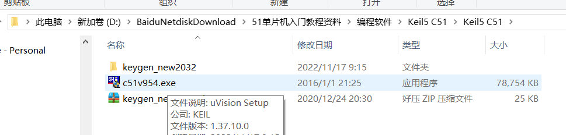

然后点击下面这个安装包,点击里面的应用程序破解

#### STC-ISP 

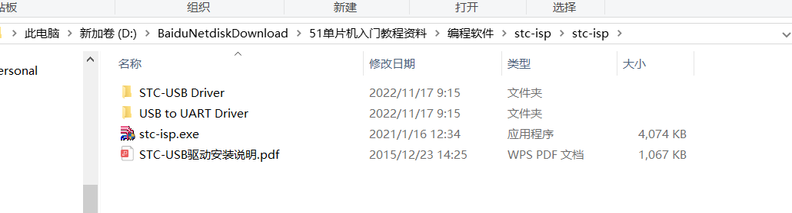

直接双击运行

用来将程序烧进单片机

#### 驱动程序

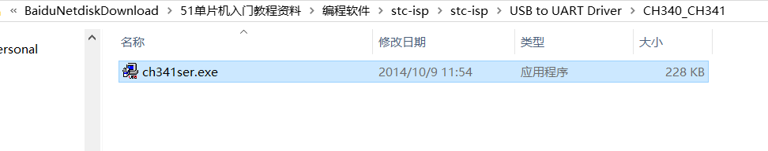

运行这个程序安装驱动

## 单片机介绍

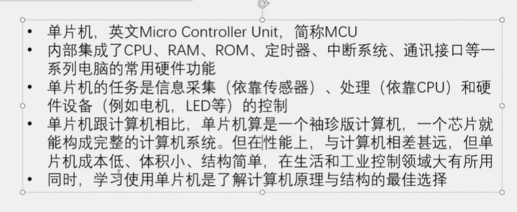

单片机可不止是一个CPU,它包含了CPU,可以算一台小型计算机了

因为英特尔开发了8051单片机内核,所以是8051内核的单片机都称为51单片机(8位)

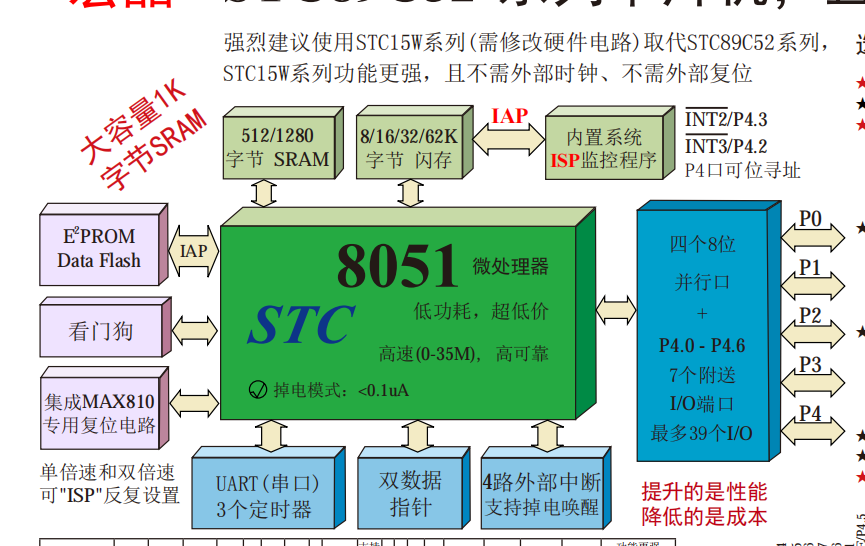

## keil5新建工程

点击project,然后选择新建一个工程

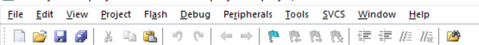

选择好路径后

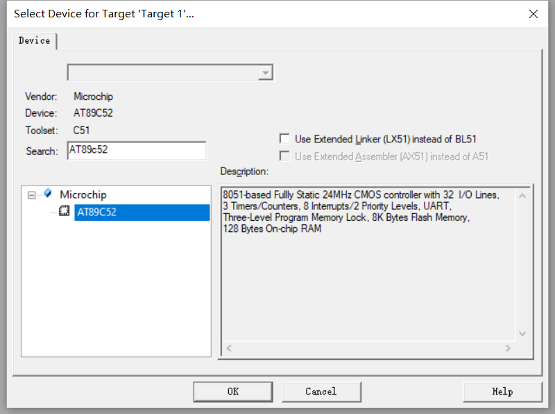

搜索这个东西,选择好后点击OK

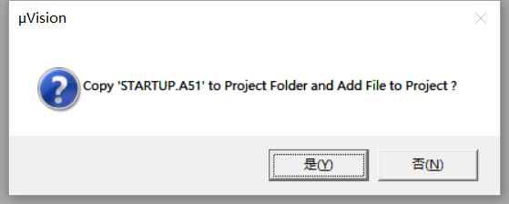

是和否都可以

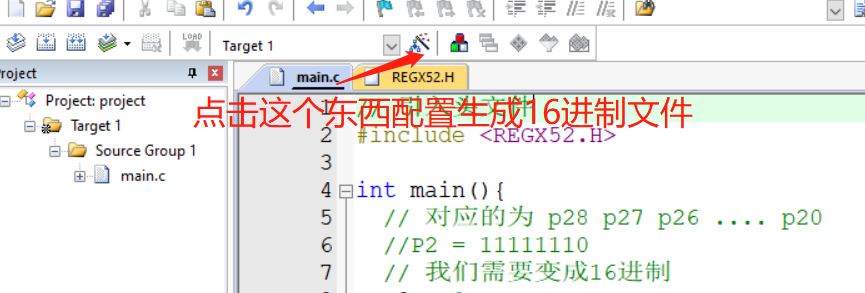

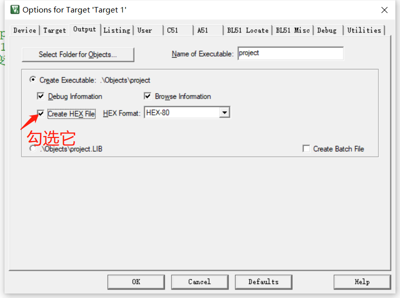

## 烧录程序

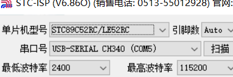

我这里要选择STC89C52RC 

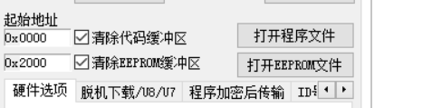

然后打开程序找到hex文件

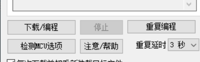

然后点下载/编程,然后重新开关单片机电源

## 点亮第一个LED灯

查看LED模块的电路图

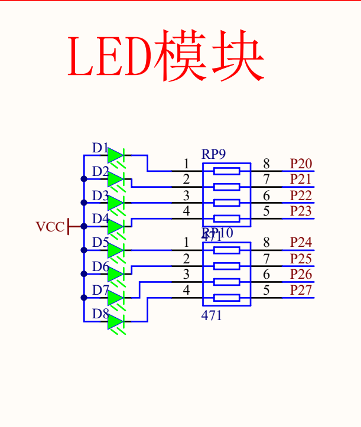

观察这个图以及结合二极管的特性我们需要设置io口为低电平为才能让二极管发光,我们接下来写代码只让P20发光

```c
// 引入头文件
#include <REGX52.H>

int main(){
	// 对应的为 p28 p27 p26 .... p20
	//P2 = 11111110  
	// 我们需要变成16进制
	P2 = 0xFE;
	// 如果不兜圈子的话,单片机会一直执行这个程序
	while(1){
	}
	
}
```

烧录程序后成功点亮

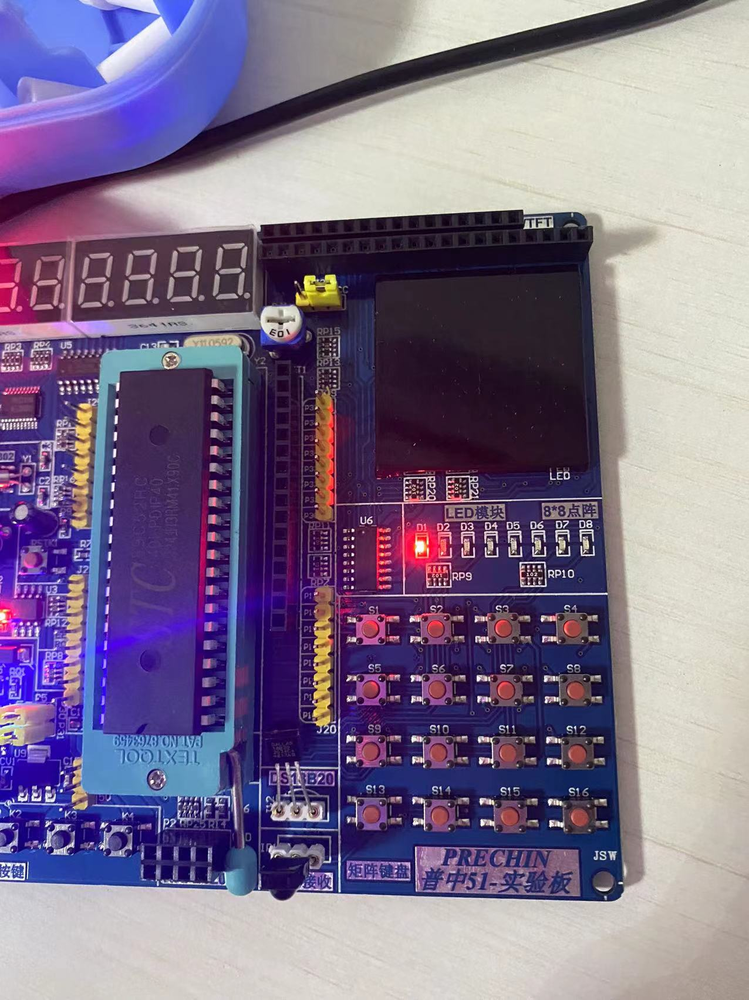

## 闪烁一个LED灯

这里我们需要用到一个延时函数

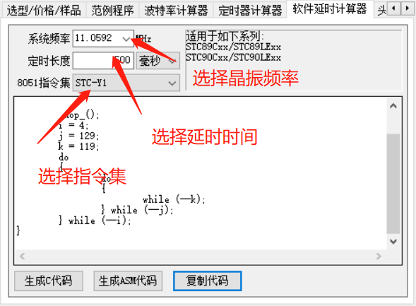

```
#include <REGX52.H>
// 引入一个头文件
#include <INTRINS.H>
void Delay500ms()		//@11.0592MHz
{
	unsigned char i, j, k;

	_nop_();
	i = 4;
	j = 129;
	k = 119;
	do
	{
		do
		{
			while (--k);
		} while (--j);
	} while (--i);
}


int main(){
	while(1){
		P2 = 0xFE;
		// 延时
		Delay500ms();
		P2 = 0xFF;
		//这里也不要忘记延时,不然直接就亮了
		Delay500ms();
	}
}

```

## LED流水灯

有了上面的基础,这个就简单了,我们自己封装一个延时函数

```c
#include <REGX52.H>
#include <INTRINS.H>

void Delay(unsigned int times)		//@11.0592MHz
{
	unsigned char i, j;
	while(times > 0){
		// 里面代表延时1ms
		_nop_();
		i = 2;
		j = 199;
		do
		{
			while (--j);
		} while (--i);
		times--;
	}
}


int main(){
	
	while(1){
		int i = 0;
		P2 = 0xFE;
		Delay(500);
		for(i = 0 ; i < 8; i++){
			Delay(500);
			P2 = P2 << 1;
			P2 += 1;
			Delay(500);
		}
	}
}
```


## 独立按键控制LED灯

### 独立按键

轻触按键相当于一种电子开关,按下时开关接通,松开时开关断开,实现原理是通过内部金属片受力弹动来实现接通和断开

当我们按下按键的时候**,io口对应的电压就会变成0**,会被寄存器检测到并且写入寄存器中,然后供我们使用

> 这里有人就有疑惑了,我们按下然后松开,这样寄存器的值不是没变吗?,对,最终结果是没变,但是单片机的频率好歹也有兆赫兹级别的吧,你按下后,程序在飞速运转,肯定能够检测到寄存器这个值的变化

独立按键的电路图

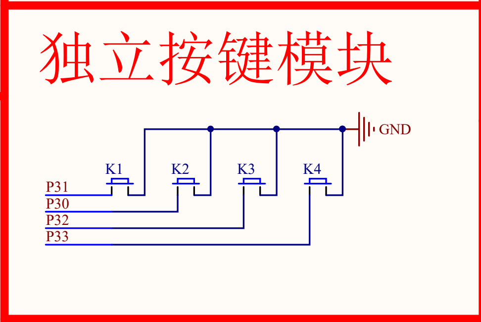

按下亮,松手熄灭

```c
#include <REGX52.H>

int main(){
	while(1){
		P2_0 = P3_1
	}
}

```

按一下取反LED灯亮灭情况

由于金属弹片会有抖动效果,因此当我们按下按键或者松开按键的时候,金属弹片都会抖动几下后才会进入静止状态,这个时间段的时候电压会上下摆动不稳定,会干扰单片机的检测,因此我们需要消抖,一是物理消抖(需要硬件支持),二是程序消抖(在按下之后等一段时间再去判断io口对应的寄存器数值)

```c
#include <REGX52.H>
#include <INTRINS.H>

void Delay1ms()		//@11.0592MHz
{
	unsigned char i, j;

	_nop_();
	i = 2;
	j = 199;
	do
	{
		while (--j);
	} while (--i);
}


void Delay(int times)		//@11.0592MHz
{
	while(times > 0){
		Delay1ms();
		times--;
	}
}

// 按下和抬起后才改变LED灯的状态
int main(){
	while(1){
		// 按下
		if(P3_1 == 0){
			Delay(20);
			// 一直按下
			while(P3_1 == 0);
			Delay(20);
			//抬起
			P2_0 = !P2_0;
		}
	}
}

```

独立按键控制LED显示二进制

```c
#include <REGX52.H>
#include <INTRINS.H>

void Delay1ms()		//@11.0592MHz
{
	unsigned char i, j;

	_nop_();
	i = 2;
	j = 199;
	do
	{
		while (--j);
	} while (--i);
}


void Delay(int times)		//@11.0592MHz
{
	while(times > 0){
		Delay1ms();
		times--;
	}
}


int main(){
	
	
	int i = 0;
	P2 = 0xFE;
	while(1){
		
		
		if( P3_1 == 0 ){
			Delay(20);
			while(P3_1 == 0);
			Delay(20);
			
			i++;
			if( i == 8) i = 0;
			P2 = 0xFF ^ (1<<i);
			
			
		}
		
		if( P3_0 == 0 ){
			Delay(20);
			while(P3_0 == 0);
			Delay(20);
			i--;
			if( i < 0 ) i = 7;
			P2 = 0xFF ^ (1<<i);
		}
	}
}

```

## 数码管显示

### 介绍

简单,廉价的显示器,是由多个发光二极管封装在一起组成的8字型的器件

> 8个发光二极管灯组成,7个段,一个点

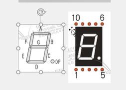

### 电路图

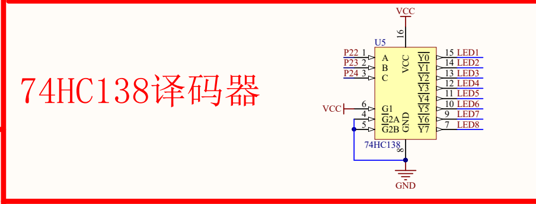

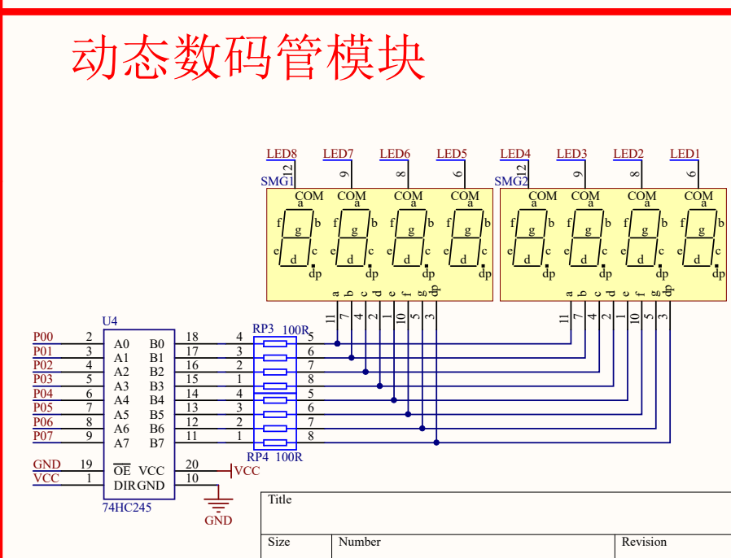

这个数码管跟138译码器一起工作的

> 138 译码器就是将3个二进制位表示成8个二进制位, 2^3 = 8,

驱动方式: 通过38译码器选择好某个LED,然后通过P0口给数据,看点亮哪些二极管

### 控制某个数码管显示数字

给第三个数码管显示6

三八译码器给101

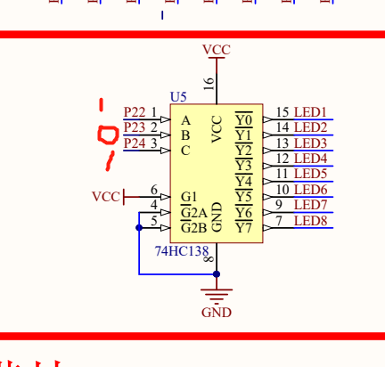

P0 口给 01111101

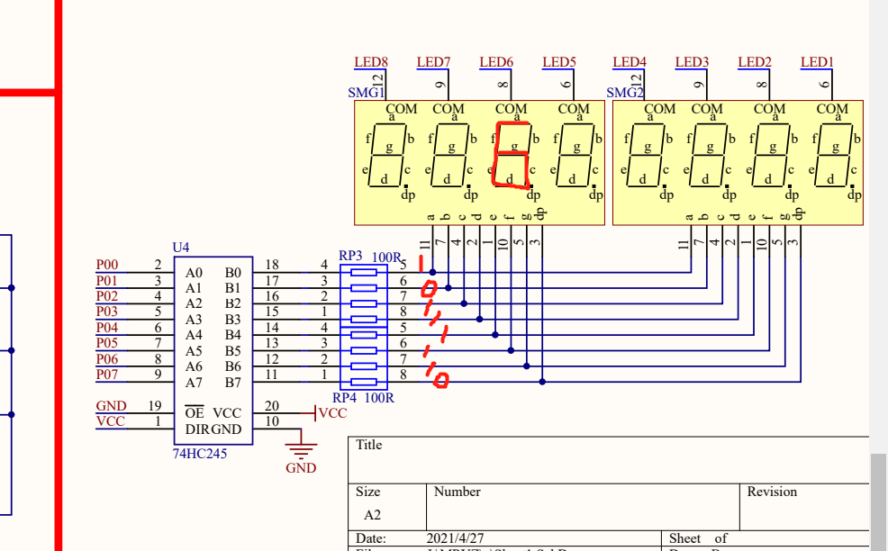

```c
#include <REGX52.H>

int main(){
	
	P2_2 = 1;
	P2_3 = 0;
	P2_4 = 1;
	P0 = 0x7D;
	
	while(1);
}		
```

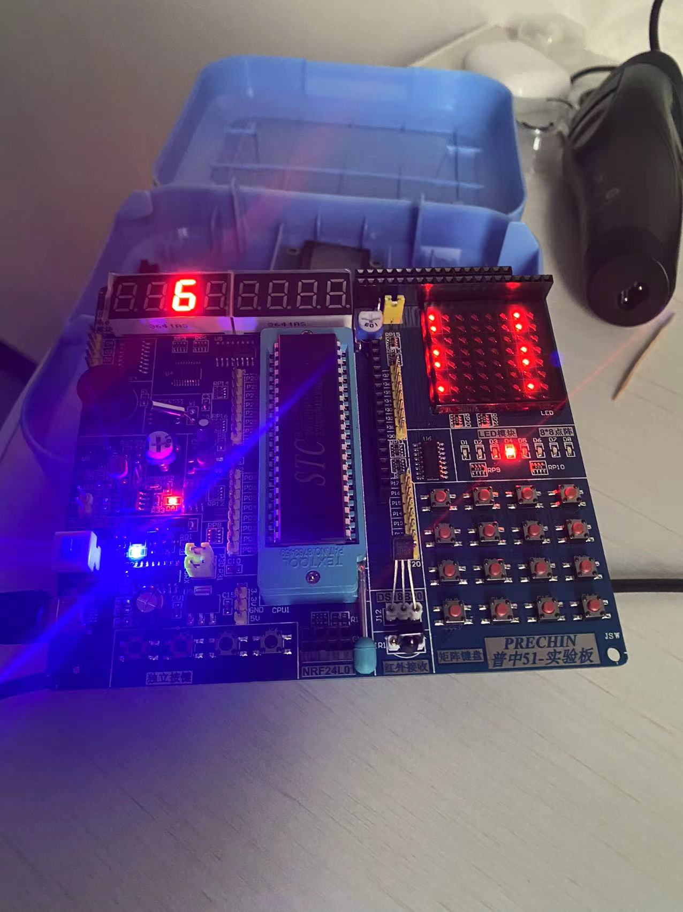

我们可以封装一个函数出来

```c
// 数码管数字对应的P0io口的16进制
unsigned char Numbers[] = {
	// 0011 1111   0
	0x3F,
	// 0000 0110   1
	0x06,
	// 0101 1001   2
	0x59,
	// 0100 1111   3
	0x4F,
	// 0110 0110   4
	0x66,
	// 0110 1101   5
	0x6D,
	// 0111 1101   6
	0x7D,
	// 0000 0111   7
	0x07,
	// 0111 1111   8
	0x7F,
	// 0110 1111   9
	0x6F,
	// 0111 0111   A
	0x77,
	// 0111 1100   b
	0x7C,
	// 0011 1001   C
	0x39,
	// 0101 1110   d
	0x5E,
	// 0111 1001   E
	0x79,
	// 0111 0001   F
	0x71,
	// 0000 0000   空
	0x00
	
};
// 该函数可以用来给指定位置的数码管指定显示数字
void Nixie(unsigned char Location,unsigned char Number){
	switch(Location){
		case 1: P2_4 = 1;P2_3 = 1;P2_2 = 1;break;
		case 2: P2_4 = 1;P2_3 = 1;P2_2 = 0;break;
		case 3: P2_4 = 1;P2_3 = 0;P2_2 = 1;break;
		case 4: P2_4 = 1;P2_3 = 0;P2_2 = 0;break;
		case 5: P2_4 = 0;P2_3 = 1;P2_2 = 1;break;
		case 6: P2_4 = 0;P2_3 = 1;P2_2 = 0;break;
		case 7: P2_4 = 0;P2_3 = 0;P2_2 = 1;break;
		case 8: P2_4 = 0;P2_3 = 0;P2_2 = 0;break;
	}
	
	P0 = Numbers[Number];
}
```

### 给第一个数码管循环显示0-F

```c
#include <REGX52.H>
#include <INTRINS.H>

void Delay(int times)		//@11.0592MHz
{
	unsigned char i, j;
	while(times > 0){
		// 里面代表延时1ms
		_nop_();
		i = 2;
		j = 199;
		do
		{
			while (--j);
		} while (--i);
		times--;
	}
}

// 数码管数字对应的P0io口的16进制
unsigned char Numbers[] = {
	// 0011 1111   0
	0x3F,
	// 0000 0110   1
	0x06,
	// 0101 1011   2
	0x5B,
	// 0100 1111   3
	0x4F,
	// 0110 0110   4
	0x66,
	// 0110 1101   5
	0x6D,
	// 0111 1101   6
	0x7D,
	// 0000 0111   7
	0x07,
	// 0111 1111   8
	0x7F,
	// 0110 1111   9
	0x6F,
	// 0111 0111   A
	0x77,
	// 0111 1100   b
	0x7C,
	// 0011 1001   C
	0x39,
	// 0101 1110   d
	0x5E,
	// 0111 1001   E
	0x79,
	// 0111 0001   F
	0x71,
	// 0000 0000   空
	0x00
	
};
// 该函数可以用来给指定位置的数码管指定显示数字
void Nixie(unsigned char Location,unsigned char Number){
	switch(Location){
		case 1: P2_4 = 1;P2_3 = 1;P2_2 = 1;break;
		case 2: P2_4 = 1;P2_3 = 1;P2_2 = 0;break;
		case 3: P2_4 = 1;P2_3 = 0;P2_2 = 1;break;
		case 4: P2_4 = 1;P2_3 = 0;P2_2 = 0;break;
		case 5: P2_4 = 0;P2_3 = 1;P2_2 = 1;break;
		case 6: P2_4 = 0;P2_3 = 1;P2_2 = 0;break;
		case 7: P2_4 = 0;P2_3 = 0;P2_2 = 1;break;
		case 8: P2_4 = 0;P2_3 = 0;P2_2 = 0;break;
	}
	
	P0 = Numbers[Number];
}

int main(){
	
	
	unsigned char i = 0;
	while( i < 16 ){
		Nixie(1,i);
		i++;
		Delay(2000);
	}
	while(1);
}
```

### 动态数码管显示

因为单片机的速度比较快,数码管的数字变化的也非常快,上一次在我们眼里显示的数码管数字在我们眼里的成像还没消失,就又产生了,因此的话数字就一直在我们眼中

```c
while(1){
		Nixie(1,1);
		Nixie(2,2);
		Nixie(3,3);
	}
```c

那有人就说了,我这样写不就行了么,其实还有点问题

这样显示的数据会有上一次的数据,,因为单片机显示数码管是这样的,

位选  段选  位选  段选 位选  段选  位选  段选  

但是啊,可能会出现这种情况,因为上一次段选并没有清0,下一次的位选到来的时候,会先显示上一次的段选数据

位选  **段选  位选**  段选 位选  段选  位选  段选  

然后下一个段选过来了,又显示一个数据,上一个数据之所以能够显示是因为单片机变化的很快,那为什么比较暗,那是因为电压不够稳定,一下子就变成了下一次的段选,而下一次的段选之后,这个电压能够稳定一段时间,因为下一次的位选不是它,因此会更亮一些,所以我们需要在每一次段选后面进行消影

```c
void Nixie(unsigned char Location,unsigned char Number){
	switch(Location){
		case 1: P2_4 = 1;P2_3 = 1;P2_2 = 1;break;
		case 2: P2_4 = 1;P2_3 = 1;P2_2 = 0;break;
		case 3: P2_4 = 1;P2_3 = 0;P2_2 = 1;break;
		case 4: P2_4 = 1;P2_3 = 0;P2_2 = 0;break;
		case 5: P2_4 = 0;P2_3 = 1;P2_2 = 1;break;
		case 6: P2_4 = 0;P2_3 = 1;P2_2 = 0;break;
		case 7: P2_4 = 0;P2_3 = 0;P2_2 = 1;break;
		case 8: P2_4 = 0;P2_3 = 0;P2_2 = 0;break;
	}
	
	P0 = Numbers[Number];
	Delay(1);
	P0 = 0;
	
}
```

就是在段选后立马把段选数据变成0,这样当下一个位选来的时候不会显示上一个数据

## LCD1062调试工具

将这个工具插到对应的接口上,插上去之后就不能使用p0io口了,因为已经被LCD占用了,还有P2_5,P2_6,P2_7

我们还需要引入驱动程序

## 矩阵键盘

为了减少I/O 口的占用,通常将按键排列从矩阵形式,采用逐行或者逐列扫描,就可以读出任意位置按键的状态

数码管的扫描是输出扫描,一个数据一个数据的显示,利用人眼暂留最终看起来是同时输出

矩阵键盘是输入扫描, 一个数据一个数据输入,最终汇总一起处理,这样看起来是同时检测

> 我们可以逐行和逐列扫描得到那个按键按下,这里我们按照逐列扫描,因为逐行扫描的时候,会有io口冲突,影响蜂鸣器响,比较头痛
>
> 如果是逐行扫描,那就是依次给行对应的io口低电平,然后读取列io口,看哪些是低电平,就代表被按下了

### 电路图

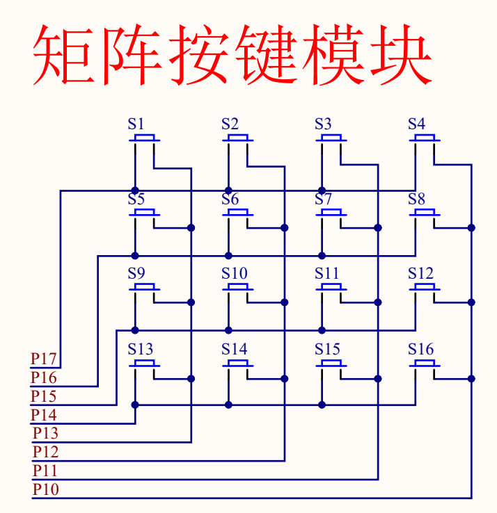

### 获取按下的数字

我们先选中某一列,再看这一行上的按键是否被按下,然后就能得到这个数字

我们自己封装获取数字的函数

MatrixKey.c

```c
#include <REGX52.H>
#include "Delay.h"


// 选出这一列中哪个数字被选中
unsigned char GetKey(unsigned char startnum){
	unsigned int i = 0;
	unsigned char temp = 0;
	for( i = 0; i < 4 ; i++){
		// 如果按下
		if(((P1>>(7-i)) & 1) == 0){
			Delay(20);
			while( ((P1>>(7-i)) & 1) == 0 );  // 一直按下
			Delay(20);
			
			return startnum + i*4;
		}
	}
	return 0;
}


unsigned char MatrixKey(){
	unsigned int i = 0;
	unsigned char Key = 0;
	for( i = 0; i < 4; i++){
		P1 = (~(1<<(3-i))) & 0xFF;
		Key = GetKey(i+1);
		if( Key != 0 ) return Key; 
	}
	return Key;
	
	
}
```

> 遇到个小坑,就是 == 的优先级比 & 高 操蛋

main.c代码

```c
#include <REGX52.H>
#include "Delay.h"
#include "LCD1602.h"
#include "MatrixKey.h"
int main(){
	unsigned char num;
	LCD_Init();
	
	while(1){
		num = MatrixKey();
		
		if(num != 0){
			LCD_ShowNum(1,1,num,2);
		}
	}
	return 0;
}

```

### 密码判断

这个就简单了,直接上源码

```c
#include <REGX52.H>
#include "Delay.h"
#include "LCD1602.h"
#include "MatrixKey.h"
int main(){
	unsigned char num;
	unsigned int password = 0;
	LCD_Init();
	
	LCD_ShowString(1,1,"Password:");
	LCD_ShowNum(2,1,password,4);
	while(1){
		num = MatrixKey();
		
		if(num != 0){
			// 1-10 代表输入密码
			if( num <= 10 ){
				password = password*10 + num % 10;
				password %= 10000;
			}
			
			else if( num == 11 ) {
				if ( password == 1234){
					LCD_ShowString(1,11, "RIGHT");
				}else{
					LCD_ShowString(1,11, "ERROR");
				}
			}
		
			else if ( num == 12 ){
				password = 0;
				LCD_ShowString(1,11, "     ");
			}
			
			LCD_ShowNum(2,1,password,4);
			
		}
		
		
	}
	return 0;
}

```


## 中断系统

stc89c52中断源个数有8个:外部中断0,定时器0中断,外部中断1,定时器1中断,串口中断,外部中断2,外部中断3

各个定时器对应的中断号

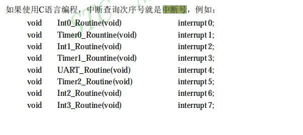

### 电路图

最新的电路图

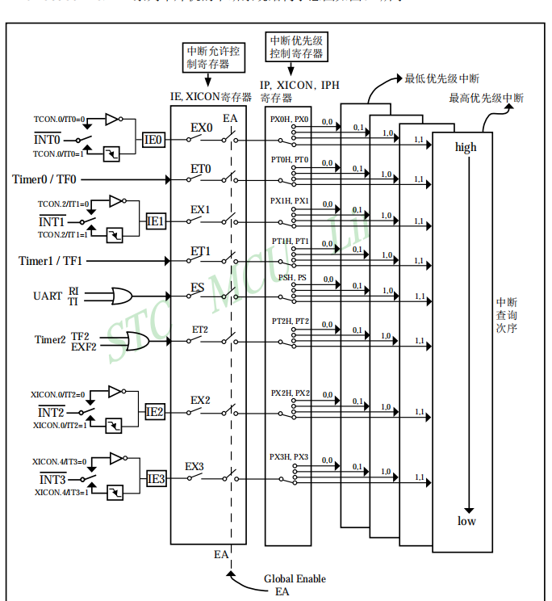

传统电路图

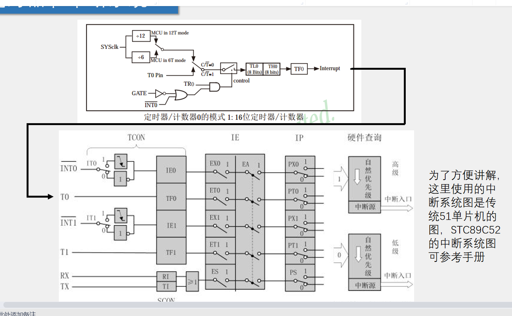

### 中断寄存器

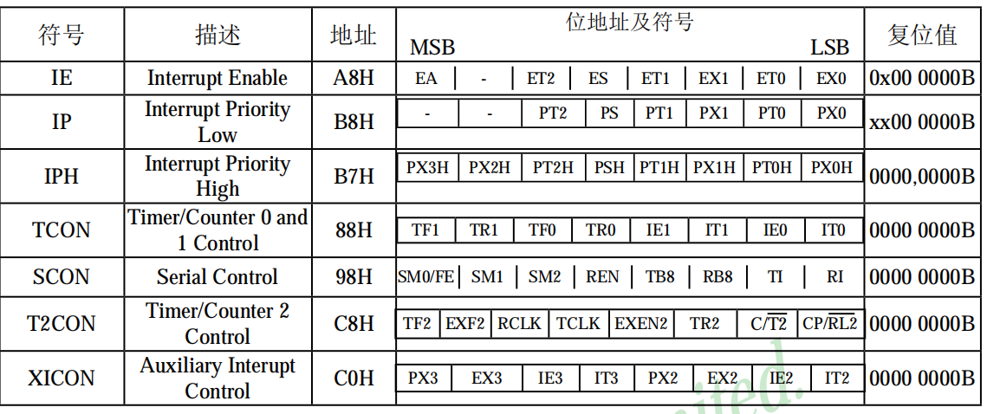

#### 中断允许寄存器IE和XICON

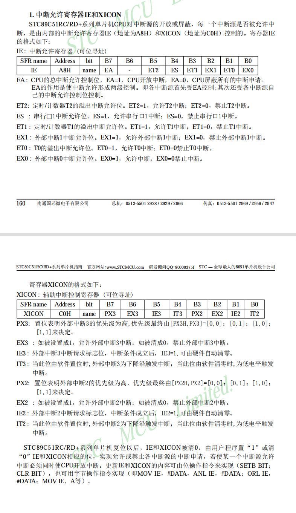

#### 中断优先级控制寄存器IP/XICON和IPH

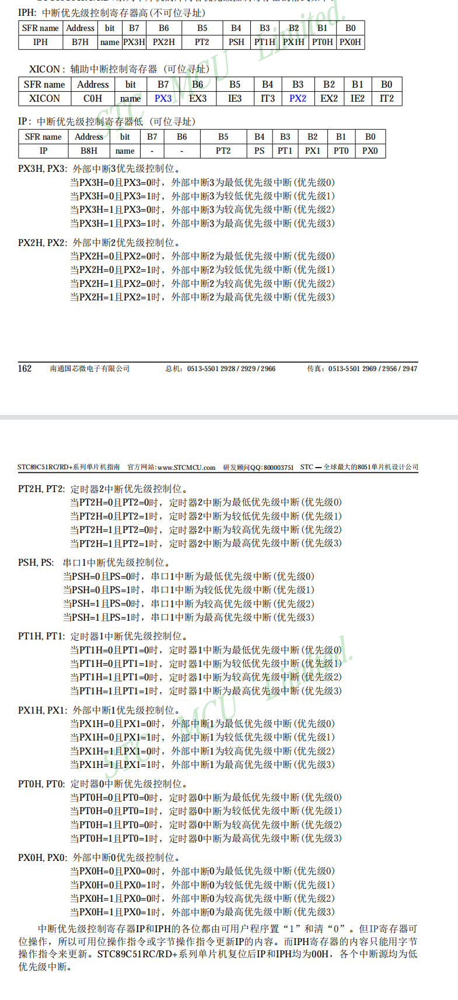


## 定时器

51单片机的定时器属于单片机的内部资源,其他电路连接和运转均在单片机内完成

delay的时候,单片机是不能做其他操作的,但是定时器不同,开启定时器后,我们还能做其他的事

STC89C52 有三个定时器: T0 T1 T2,  T0 和 T1 与传统的51单片机兼容, T2是此型号单片机增加的资源

> 定时器的资源和单片机的型号是关联在一起的,不同型号可能会有不同的定时器个数和操作方式,但是一般来说,T0 和 T1 的操作方式是51单片机共有的

STC89C52 的 T0 和 T1 均有几种工作模式:

* 模式0: 13位定时器
* 模式0: 16位定时器( 常用)   能计2^16=65536 这个么多个数
* 模式2: 8位自动重装  当TL溢出的时候,自动将TH的值装载到TL,这样比模式0更精确,因为少了两条赋值语句
* 模式3: 两个8位计数器

定时器分为三个部分: 计数系统,时钟,中断系统

工作流程:时钟每来一个脉冲就加1,加到65535的时候就会溢出变成0,然后将TF0标志位变成1,就会发生中断

时钟脉冲可以来自两个地方,一个是系统时钟(定时器模式),另外可以由外部引脚提供(计数器模式),我们可以通过配置C/T这个寄存器来选择

系统时钟是由晶振提供一个固定的频率,一个周期就是1us

### 电路图


### 定时器相关寄存器

寄存器是连接软硬件的媒介,在单片机中寄存器就是一段特殊的RAM存储器,一方面,寄存器可以存储数据,另一方每一个寄存器背后可以控制电路的连接方式

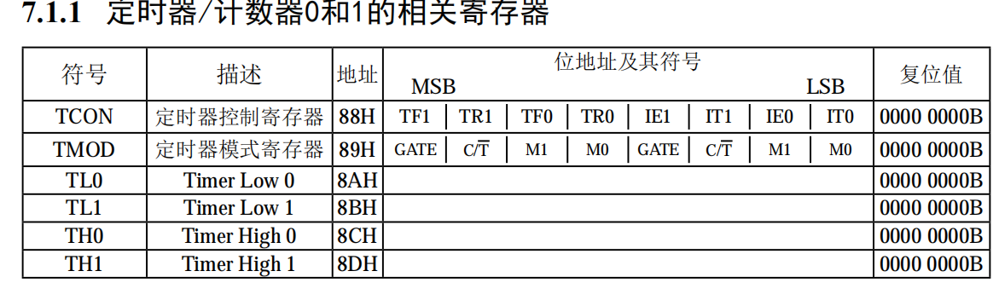

#### 控制寄存器 TCON (可位寻址)

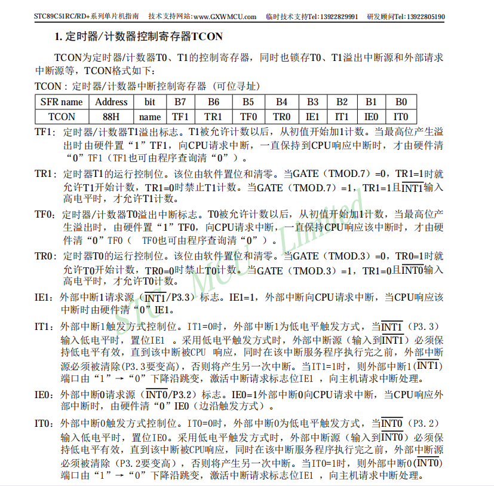

```
每一位名字后面的0 1 代表定时器0 1
列如TF1 代表计时器1的溢出标志位 TF0代表计时器0的溢出标志位
TF: 溢出标志位,当计数器满了之后由硬件置1,向CPU发起中断,中断处理时由硬件置0
TR: 定时器的运行控制位,由软件置位和清零,当工作模式寄存器的GATE为为0时  TR = 1时开始计数,TR = 0 时停止计数 GATE为1时 需要TR=1 INT为高电压的时候开始计数
IE: 外部中断使能位
IT: 外部中断触发方式
```


#### 工作模式寄存器TMOD(不可位选址)

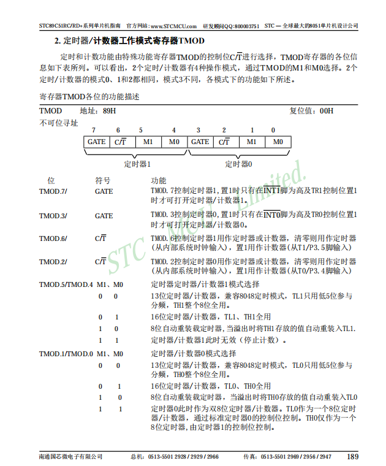

```
GATE: 选择 控制定时器的模式,有两种:0 代表 TR单独控制 1代表TR和INT一起控制
C/T: 选择时钟系统: 0是内部系统时钟,1外部时钟系统
M1,M0  控制定时器的工作模式 0 0 模式0  0 1 模式 1 ... 
```


#### 计数单元寄存器(TL TH)

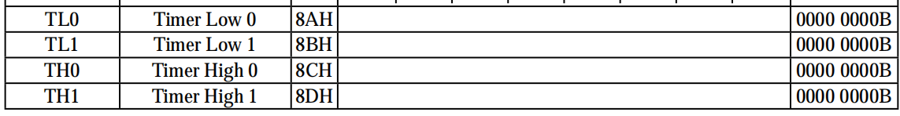

如果是16位计数器工作模式的话,TL和TH一起控制计数大小 

### 定时器配置

以定时器0为例

```c
	//配置TMOD,不可位寻址   后四位控制T0   
	// 门控端 内部时钟还是外部时钟  M1 M0  (定时器模式)
	// 0 0 0 1
	
	TMOD = TMOD & 0xF0; // 清0
	TMOD = TMOD | 0xF1; // 赋值
	
	// 配置 TCON 可位寻址
	TR0 = 1;  // 开启定时器0
	TF0 = 0;  // 清0标志位
	
	// 配置计数单元,1us计数加一次,因此65536us 中断一次 我们需要配置成1ms 产生一次中断,给初始值为64536
	// 64536 = 0xFC18
	TL0 = 0x18;
	TH0 = 0xFC;
	
	
	// 配置中断寄存器
	ET0 = 1;  // 开启T0计时器中断
	EA = 1;   // 开启总开关中断
	PT0 = 0; // 设置优先级
```

### 按键控制流水灯的移动方向

```c
#include <REGX52.H>

#include <INTRINS.H>
#include "Timer0.h"
#include "Delay.h"
#include "Key.h"

unsigned char keyNumber,keyMode = 0;
int main(){
	Timer0_Init();
	
	
	P2 = 0xFE;
	while(1){
		 
		keyNumber = Key();
		
		
		if(keyNumber == 1) keyMode = 0;
		if(keyNumber == 2) keyMode = 1;
		

		
		
		
	}
	return 0;
}


void Timer0_Routine() interrupt 1{
	
	static unsigned int count = 0;
	count++;
	TL0 = 0x18;
	TH0 = 0xFC;
	if(count == 1000){
		count = 0;
		if(keyMode == 0) P2 = _cror_(P2,1);  // 循环向右移位
		if(keyMode == 1) P2 = _crol_(P2,1);  // 循环向左移位
	}
}


```

### 时钟系统

```c
#include <REGX52.H>

#include <INTRINS.H>
#include "Timer0.h"
#include "LCD1602.h"

void Show_Clock();
unsigned char hour = 23,min = 59,second = 55;
int main(){
	Timer0_Init();
	LCD_Init();
	LCD_ShowString(1,1,"CLOCKS:");
	LCD_ShowString(2,1,"  :  :  ");
	
	while(1){
		 Show_Clock();
		
	}
	return 0;
}

void Show_Clock(){
	LCD_ShowNum(2,1,hour,2);
	LCD_ShowNum(2,4,min,2);
	LCD_ShowNum(2,7,second,2);
}

void Timer0_Routine() interrupt 1{
	
	static unsigned int count = 0;
	count++;
	TL0 = 0x18;
	TH0 = 0xFC;
	if(count == 1000){
		count = 0;
		second++;
		if(second>=60){
			min++;
			second = 0;
			if(min>=60){
				hour++;
				min = 0;
				if(hour>=24){
					hour = 0;
				}
			}
		}
	}
}

```


## 串口通信

串口是一种应用十分广泛的通讯接口,串口成本低,容易使用,通信线路简单,可实现两个设备的互相通信.

单片机的串口可以使单片机与单片机,单片机与电脑,单片机与各样的模块互相通信,极大的扩展了单片机的应用范围,增强了单片机系统的硬件实力( 一个单片机的能力有限,如果可以通信,可以让其他模块处理数据,然后再发送给单片机)

51单片机内部自带UART(通用异步收发器),可实现单片机的串口通信


电平标准是数据1和数据0的表示方式,是规定的电压与数据对应的关系,串口常用电平标准:

* TTL 电平: +5V表示1,0v表示0
* RS232电平: -3~-15v表示1,+3~+15表示0
* RS485电平: 两线压差+2~+6v表示1,-2~-6V表示0,需要两根线传输一端到另一端的数据

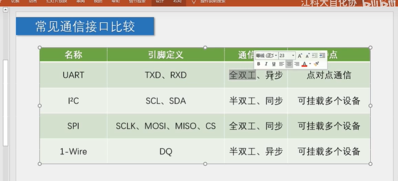


STC89C52 有1个UART,有四种工作模式:

* 模式0: 同步移位寄存器
* **模式1**: 8位UART,波特率可变
* 模式2: 9位UART,波特率固定
* 模式3: 9位UART,波特率可变

> 9位UART 多一位校验位(奇偶校验)

### 简单电路图

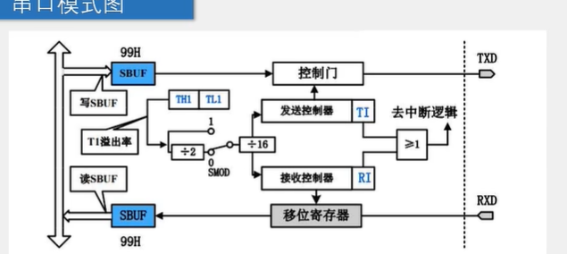


### 串口相关寄存器

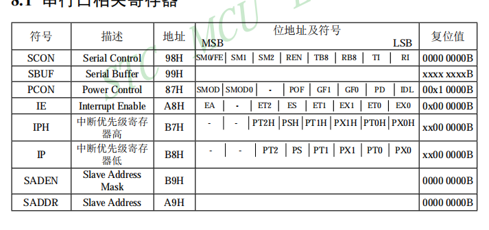

### 串行口控制寄存器SCON和PCON

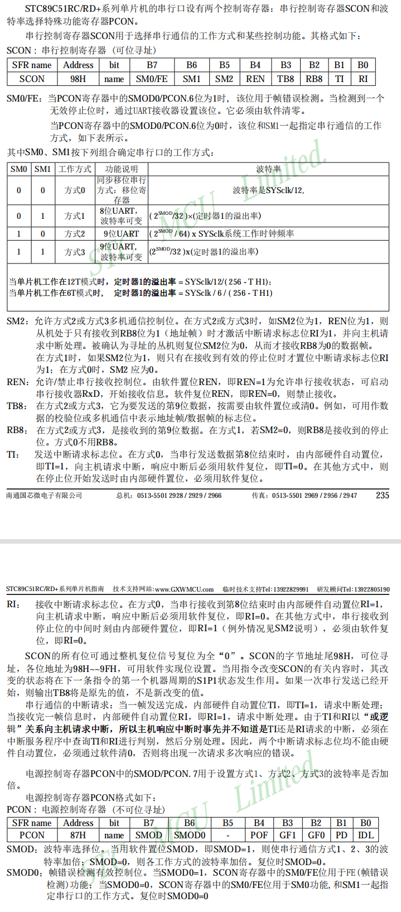


### 串行口数据缓冲寄存器SBUF

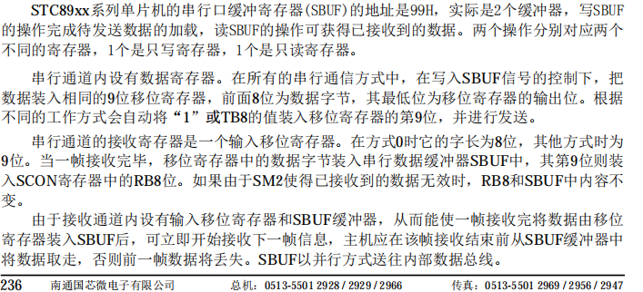

这个寄存器不需要配置,我们只需要将我们的数据写入这个寄存器或者读取这个寄存器的数据就行

### 寄存器配置

```c
void UART_Init(){
	//SM0 SM1 SM2 REN TB8 RB8 TI RI
	//SM0 SM1  一起构成串口工作模式,这里选第1种  0 1
	// SM2 多机位通信,不用管 0
	// REN 接收使能控制  1
	// TB8 发送的第9位数据,只有工作在2,3模式的时候才有用 0
	// RB8 接受的第9位数据,只有工作在2,3模式的时候才有用 0
	// TI 发送中断请求,由硬件置1,软件置0
	// RI 接收中断请求,由硬件置1,软件置0
	// 为什么两个中断位需要软件置0呢? 因为中断响应函数只有一个,我们需要通过这个位去判断是什么中断,如果硬件直接置0了,那就无法判断
	// 0 1 0 1 0 0 0 0
	SCON = 0x50;
	PCON |= 0x80;		//使能波特率倍速位SMOD
	
	// 配置定时器1
	TMOD &= 0x0F;		//清除定时器1模式位
	TMOD |= 0x20;		//设定定时器1为8位自动重装方式
	
	TL1 = 0xF4;		//设定定时初值
	TH1 = 0xF4;		//设定定时器重装值
	ET1 = 0;		//禁止定时器1中断
	TR1 = 1;		//启动定时器1
	
	EA = 1; // 开启总中断开关
	ES = 1; // 开启串口中断
}
```


### 串口向电脑发送数据

```c
#include <REGX52.H>
#include "Delay.h"


void UART_Init(){
	//SM0 SM1 SM2 REN TB8 RB8 TI RI
	//SM0 SM1  一起构成串口工作模式,这里选第1种  0 1
	// SM2 多机位通信,不用管 0
	// REN 接收使能控制  1
	// TB8 发送的第9位数据,只有工作在2,3模式的时候才有用 0
	// RB8 接受的第9位数据,只有工作在2,3模式的时候才有用 0
	// TI 发送中断请求,由硬件置1,软件置0
	// RI 接收中断请求,由硬件置1,软件置0
	// 为什么两个中断位需要软件置0呢? 因为中断响应函数只有一个,我们需要通过这个位去判断是什么中断,如果硬件直接置0了,那就无法判断
	// 0 1 0 1 0 0 0 0
	SCON = 0x50;
	PCON |= 0x80;		//使能波特率倍速位SMOD
	
	// 配置定时器1
	TMOD &= 0x0F;		//清除定时器1模式位
	TMOD |= 0x20;		//设定定时器1为8位自动重装方式
	
	TL1 = 0xF4;		//设定定时初值
	TH1 = 0xF4;		//设定定时器重装值
	ET1 = 0;		//禁止定时器1中断
	TR1 = 1;		//启动定时器1
	
	EA = 1; // 开启总中断开关
	ES = 1; // 开启串口中断
}

void UART_SendData(unsigned char Data){
	SBUF = Data;
	//等待数据发送完
	while(TI == 0);
	// 软件置0
	TI = 0;
}
int main(){
	int i = 0;
	UART_Init();
	
	while(1){
		UART_SendData(i++);
		Delay(1000);
	}
}

```

### 电脑控制LED

```c
#include <REGX52.H>
#include "UART.h"


int main(){
	int i = 0;
	UART_Init();
	
	P2 = 0xFE;
	while(1){
		
	}
}

void UART_Routine() interrupt 4{
	if ( RI == 1 ){
		P2 = SBUF;
		UART_SendData(SBUF);
		RI = 0;
	}
	
}

```


## LED 点阵屏

LED点阵屏由若干个独立的LED组成,LED以矩阵形式排列

按颜色分为: 单色,双色,全彩

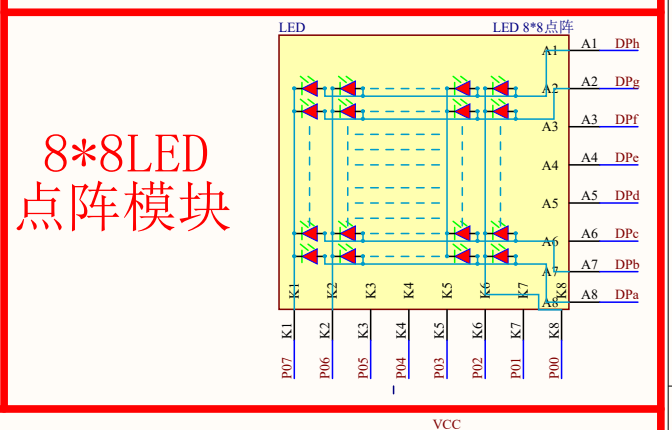

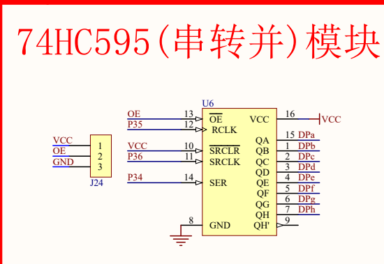


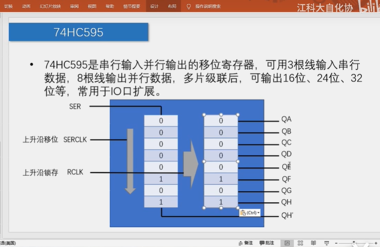


> SERCLK控制移位,SER提供数据,RECLK负责将数据给到输出缓存区

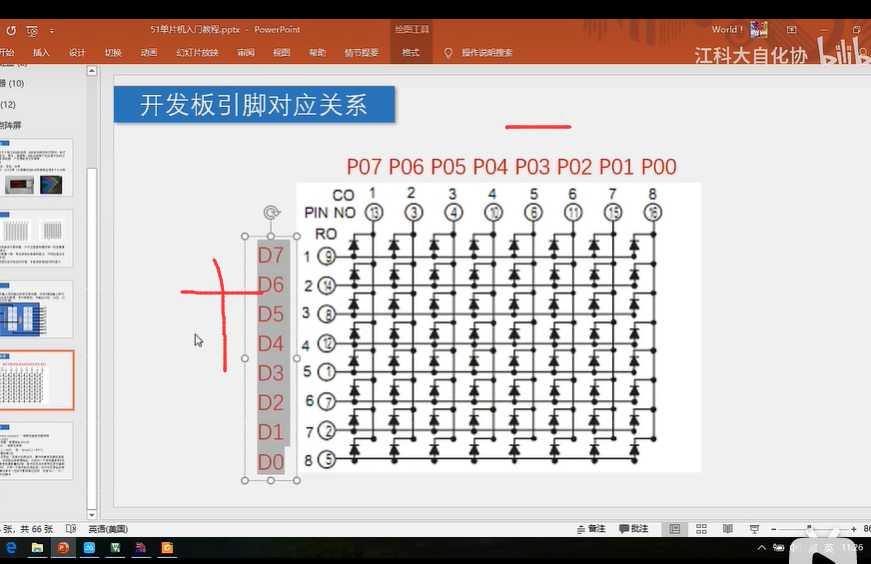

观看这个电路图我们可以发现,点阵屏的8个接口直接与P0串口相接,另外八个接口与74HC595的八个输出口相连

这个其实跟数码管很像,先段选,然后位选

我们通过列扫描来点亮点阵屏,先设置P0 然后设置 74HC595

### LED点阵屏显示图形

MatrixLED.c文件

```c
#include <REGX52.H>
#include "Delay.h"

sbit SER = P3^4;   //SER
sbit SCK = P3^6; // SRCLK
sbit RCK = P3^5;   // RCLK

#define MATRIXLED_RES P0


/**
  * @brief 74HC595写入一个字节
  * @param 要写入的数据,一个字节
  * @retval 无
  */ 
void _74HC595_WriteByte(unsigned char Byte){
	
	unsigned char temp = 0x80,i = 0;
	SCK = 0;
	RCK = 0;
	for(;i<8;i++){
		SER = Byte&(temp>>i);
		SCK = 1;
		SCK = 0;
	}
	RCK = 1;
	RCK = 0; 
}	

/**
  * @brief  点阵屏显示一列数据
  * @param  Column 要选择的列 0-7  ,0在最左边
  * @param  要显示的数据
  * @retval 无
  */ 
void MatrixLED_ShowColumn(unsigned char Column,unsigned char Data){
	_74HC595_WriteByte(Data);
	MATRIXLED_RES = ~(0x80 >> Column);
	Delay(1);
	MATRIXLED_RES = 0xFF;
}
```


```c
#include <REGX52.H>
#include "Delay.h"
#include "MatrixLED.h"

int main(){
	
	while(1){
		MatrixLED_ShowColumn(1,0xAA);
		MatrixLED_ShowColumn(2,0x55);
	}
}

```

### LED点阵屏显示动画

```c
#include <REGX52.H>
#include "Delay.h"
#include "MatrixLED.h"

unsigned char Animation[]={
	0x3C,0x42,0xA9,0x85,0x85,0xA9,0x42,0x3C,
	0x3C,0x42,0xA1,0x85,0x85,0xA1,0x42,0x3C,
	0x3C,0x42,0xA5,0x89,0x89,0xA5,0x42,0x3C,
};
int main(){
	unsigned char i = 0,j = 0,count = 0;
	while(1){
		for(i = 0;i<8;i++){
			MatrixLED_ShowColumn(i,Animation[i+j]);
		}
		count++;
		if(count>30){
			count = 0;
			j+=8;
			if( j > 16 ) j=0;
		}
	}
}

```

## DS1302

时钟芯片(RTC): 实时时钟,是一种集成电路

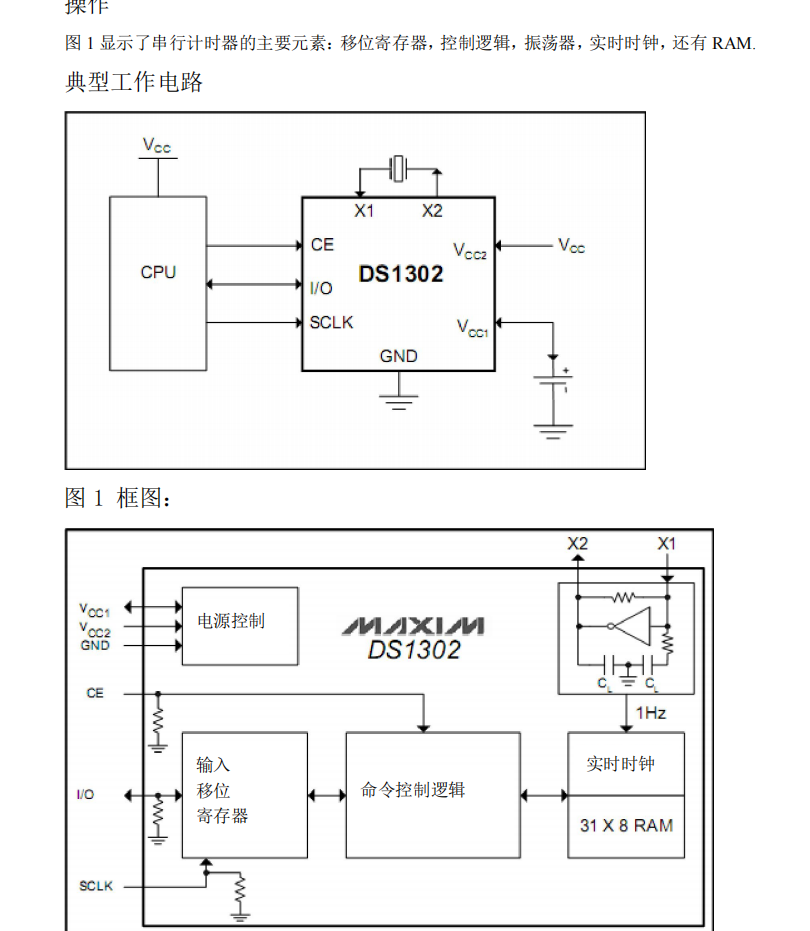

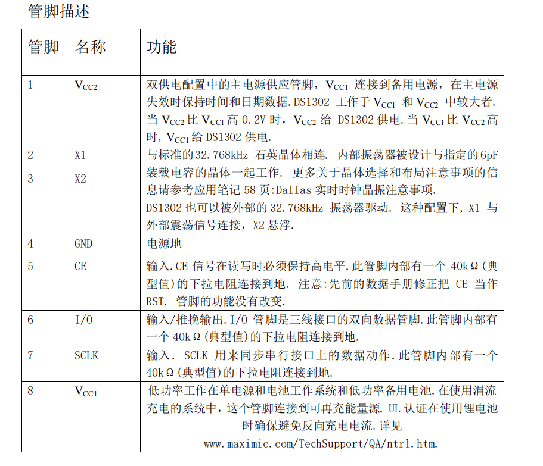

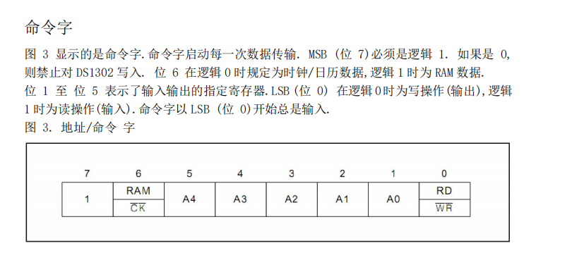


### 寄存器

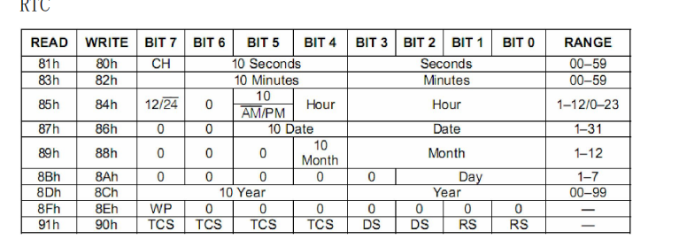

> 每个命令字已经写在开头了,比如0x80 代表写入一个字节数据到秒寄存器
>
> 秒寄存器里面的第7位数据是控制时钟的开关,如果置为1,那么就代表时钟停止了,所以我们需要初始化为0,寄存器表里面有许多的位是控制不同的东西的,需要仔细看看
>
> 时钟芯片里面的寄存器的数据是BCD码,前四位代表十位数据,后四位代表个位数(BCD所表示的十六进制数据就是正常的十进制数据),所以0x1A 是不合法的,A代表10
>
> 因此我们直接显示16进制数据就是正常的10进制
>
> BCD码转10进制   BCD/16*10+BCD%16
>
> 10进制转BCD码  num/10*16+num%10


### 读写数据

首先先写入命令字,如果命令字是读数据,且是下降沿,那么数据会从内部寄存器读出来放到IO口,如果命令字是写数据,且是上升沿,那么数据会从IO口写到内部寄存器

> 每次都需要先写入命令字,然后根据命令字是读还是写再操作
>
> 我们在写数据前要先打开写保护 DS1302_WriteByte(0x8E,0x00);

```c
bit DS1302_SCLK = P3^6;
sbit DS1302_IO = P3^4;
sbit DS1302_CE = P3^5;

void DS1302_WriteByte(unsigned char Command,unsigned char Data){
	unsigned char i;
	DS1302_CE = 1;
	// 写入指令字
	for(i=0;i<8;i++){
		DS1302_IO = Command&(0x01<<i);
		DS1302_SCLK = 1;
		DS1302_SCLK = 0;
	}
	// 写入数据
	for(i=0;i<8;i++){
		DS1302_IO = Data&(0x01<<i);
		DS1302_SCLK = 1;
		DS1302_SCLK = 0;
	}
	DS1302_CE = 0;
	
}

unsigned char DS1302_ReadByte(unsigned char Command){
	unsigned char i,Data = 0;
	DS1302_CE = 1;
	// 写入指令字
	for(i=0;i<8;i++){
		DS1302_IO = Command&(0x01<<i);
		DS1302_SCLK = 0;
		DS1302_SCLK = 1;
	}
	
	// 读入数据
	for(i=0;i<8;i++){
		DS1302_SCLK = 1;
		DS1302_SCLK = 0;
		if(DS1302_IO)Data |= 1<<i;
	}
	DS1302_CE = 0;
	return Data;
}
```

## 蜂鸣器

分类: 

有源蜂鸣器: 内部自带震荡源,频率固定,用直流电压就能响

无源蜂鸣器: 内部不带震荡源,需要控制器控制震荡脉冲才可以发声,可以发出不同频率的声音

我们只需要修改P2_5 这个值发生变化,然后设置不同的延时,就能产生不同的音频

### 电路图

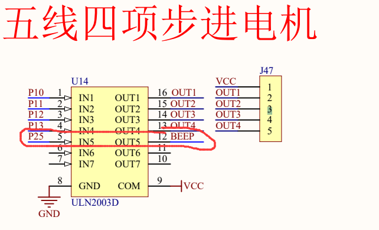

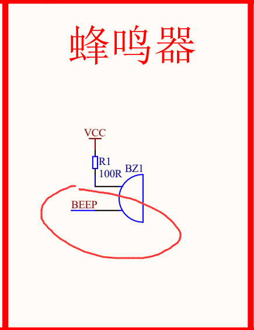

### 按键发声

Buzzer.c

```c
#include <REGX52.H>
#include "Delay.h"

sbit Buzzer = P2^5;
void Buzzer_Time(unsigned int ms){
	unsigned int i = 0;
	for(i = 0;i<ms;i++){
		Buzzer = ~Buzzer;
		Delay(1);
	}
}
```

main.c

```c
#include <REGX52.H>
#include "Nixie.h"
#include "Delay.h"
#include "Key.h"
#include "Buzzer.h"

sbit Buzzer = P2^5;
int main(){
	unsigned int i = 0;
	unsigned char keyNum;
	Nixie(1,0);
	while(1){
		keyNum = Key();
		if(keyNum){
			Buzzer_Time(500);
			Nixie(1,keyNum);
		}
		
	}
}

```

## AT24C02

存储介质:非易失性存储器用的是E2PROM

通讯接口: I2C 总线

容量: 256Byte

### 电路图

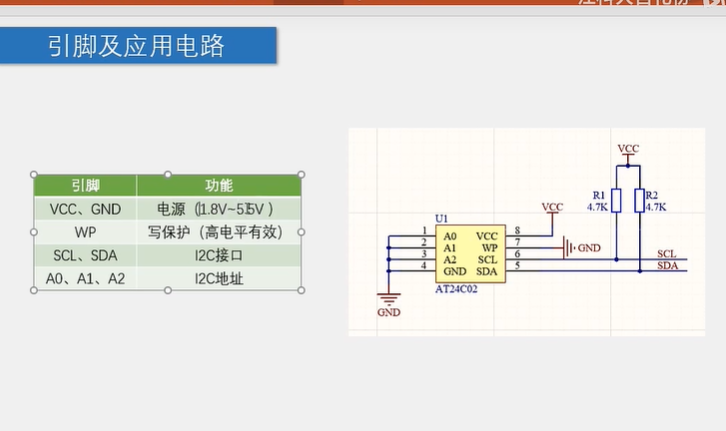

### I2C总线(Inter IC BUS)

两根通信线:SCL(Serial Clock),SDA(Serial Data),同步,半双工,带数据应答

所有I2C设备的SCL连在一起,SDA连在一起

#### 时序结构

**起始条件**: SCL 高电平期间,SDA从高电平切换到低电平

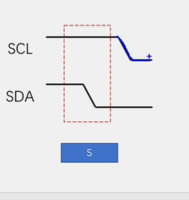

**终止条件**: SCL高电平期间,SDA从低电平切换到高电平

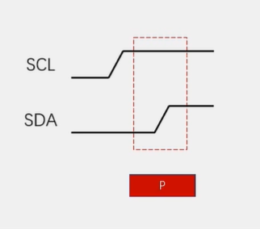

**发送一个字节**:  SCL 低电平期间,主机将数据位一次放到SDA先上(高位在前),然后拉高SCL,从机将在SCL高电平期间读取数据位,所有SCL高电平期间SDA**不允许有数据位变化**,依次循环上述过程八次,即可发送一个字节

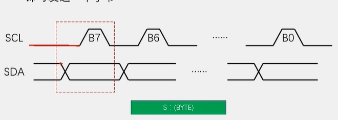

**接收一个字节**: 这个其实就跟发送一个字节一样,只不过目标对象对调了,主机在接收之前,需要释放SDA

**发送应答**: 在接收完一个字节后,主机需要在下一个时钟发送一位数,数据0表示应答,数据1表示非应答

**接收应答**: 在发送完一个字节之后,主机在下一个时钟接收一位数据,判断从机是否应答,主机需要释放SDA

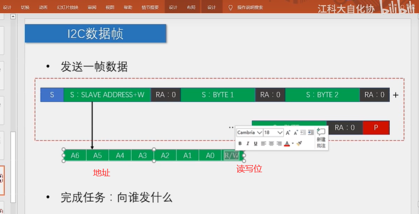

地址前四位固定,后三位是设备地址

## 中途解释

### 寄存器

单片机里面有很多的特殊的寄存器,每个寄存器后面都连接了控制电路,当我们修改寄存器里面的值的时候,也会更改电路的连接,因此做到控制硬件

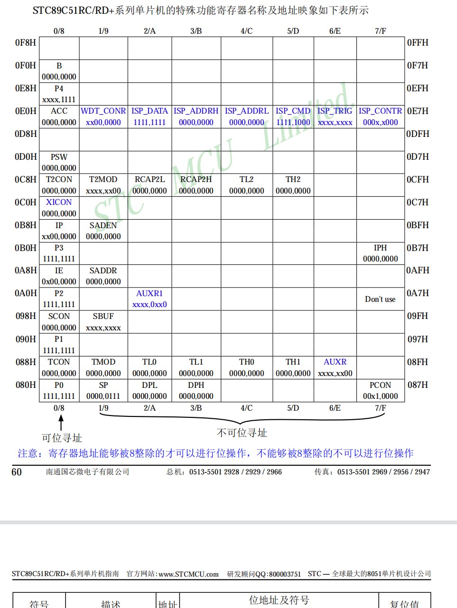

> sfr 关键字就是用来告诉编译器,寄存器所在的地址,以后我们对这个变量的操作就是操作寄存器
>
> sfr P0 = 0x80;
>
> sbit 就是声明寄存器里面的某一位
>
> sbit P0_0 = 0x80;
>
> sbit P0_1 = 0x81;
>
> 特殊用法:
>
> sbit P02 = P0 ^ 2;


## 原理小结

单片机就是通过寄存器里面的值,控制各个io的电压,如果各个io的电压发生改变,也会被检测到修改寄存器里面的值

电压稳定的时候会比电压不稳定的灯亮

```c
int main(){
	P2_1 = 0;
	while(1){
		
		P2_0 = 0;
		P2_0 = 1;
	}
}
```

p2_0 的电压一直在变,p2_1的电压稳定,观察之后,p2_1 确实比p2_0亮

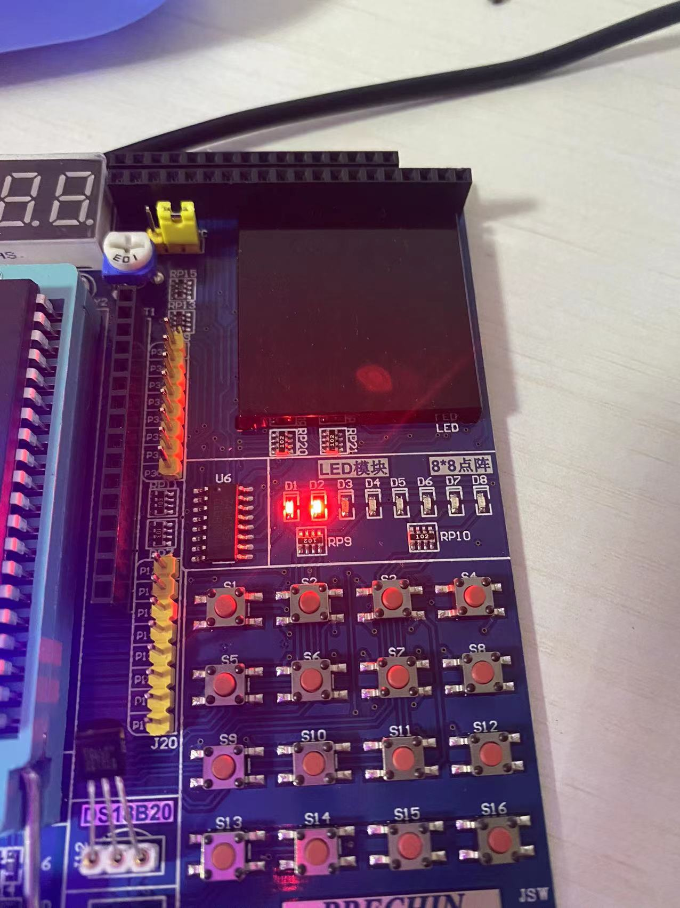

我们可以做一个反实验对比一下

```c
int main(){
	P2_0 = 0;
	while(1){
		
		P2_1 = 0;
		P2_1 = 1;		
	}
}
```

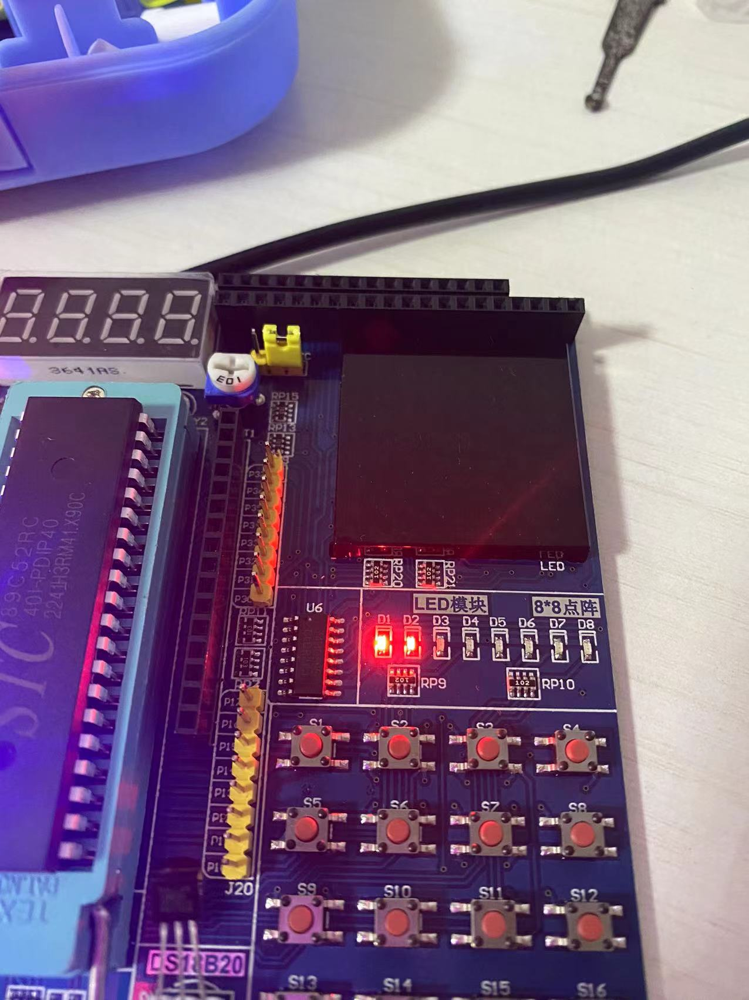

是不是p2_0 又比 p2_1 亮


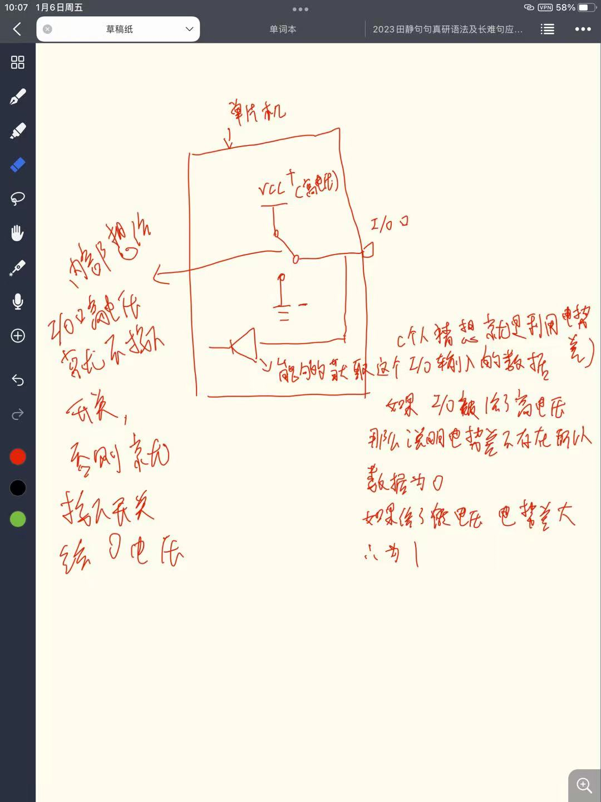

