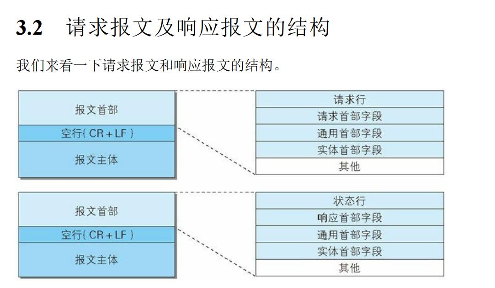

## 前言

万维网构想三个部分:

* 页面文本标记语言 html  (  怎么表示页面)
* 传输数据的协议 http    ( 怎么传输页面)
* 统一资源标识符 URI  (资源在哪)

在所有的HTTP版本中,目前最流行的还是HTTP1.1这个版本

### URI与URL

URI (统一资源标识符)  和  URL(统一资源定位符的区别)  :

URI 可以用来标识任何资源(比如ftp,http,talent协议类型的资源),而URL 只能标识特定协议(http)的资源, URI 支持很多种协议,而URL 只支持http协议,URL 是 URI 的一个子集

> 所以咱们以后就说URI 就不会错啦,哈哈哈哈

后面的总结都是基于HTTP1.1来说的哦

## 请求方法

http协议支持的请求方法:

* GET 主要用于向服务器获取资源
* POST 主要用于向服务器传输资源
* HADE 与GET方法类似,但是只获取响应报文的首部,不返回响应报文的主体
* OPTIONS 询问支持的方法(在响应报文头部的Allow字段里面)
* TRACE
* CONNECT
* PUT 用于上传资源
* DELTE 用于删除资源

后面两个方法需要后端采用RESTFUL架构

> 这么多方法在使用的时候应该要尽量遵守规则,这样能避免不少错误, 比如使用GET方法就要做到请求参数放在url中,请求体里面就不要放任何数据,请求参数也尽量只是用来查询,而不是上传

## 报文

HTTP 报文由 报文首部和空行以及报文主体组成

### **请求报文**

#### 请求行

请求行包含请求方法,URI,http版本

#### 请求首部字段

| 首部字段名          | 说明                                        |
| ------------------- | ------------------------------------------- |
| Accept              | 用户代理可处理的媒体类型                    |
| Accept-Charset      | 优先的字符集                                |
| Accept-Encoding     | 优先的内容编码                              |
| Accept-Language     | 优先的语言(自然语言)                        |
| Authorization       | Web认证信息                                 |
| Expect              | 期待服务器的特定行为                        |
| From                | 用户的电子邮箱地址                          |
| Host                | 请求资源所在服务器                          |
| If-Match            | 比较实体标记(ETag)                          |
| If-Modified-Since   | 比较资源的更新时间                          |
| If-None-Match       | 比较实体标记(与If-Match相反)                |
| If-Range            | 资源未更新时发送实体Byte的范围请求          |
| If-Unmodified-Since | 比较资源的更新时间(与If-Modified-Since相反) |
| Max-Forwards        | 最大传输逐跳数                              |
| Proxy-Authorization | 代理服务器要求客户端的认证信息              |
| Range               | 实体的字节范围请求                          |
| Referer             | 对请求中URI的原始获取方                     |
| TE                  | 传输编码的优先级                            |
| User-Agent          | HTTP客户端程序的信息                        |

### **响应报文**

#### 状态行

状态行包含http版本,响应结果码状态码,原因短语

#### 响应首部字段

| 首部字段名         | 说明                         |
| ------------------ | ---------------------------- |
| Accept-Ranges      | 是否接受字节范围请求         |
| Age                | 推算资源创建经过时间         |
| ETag               | 资源的匹配信息               |
| Location           | 令客户端重定向至指定URI      |
| Proxy-Authenticate | 代理服务器对客户端的认证信息 |
| Retry-After        | 对再次发起请求的时机要求     |
| Server             | HTTP服务器的安装信息         |
| Vary               | 代理服务器缓存的管理信息     |
| WWW-Authenticate   | 服务器对客户端的认证信息     |

### **通用首部字段**

| 首部字段名        | 说明                       |
| ----------------- | -------------------------- |
| Cache-Control     | 控制缓存的行为             |
| Connection        | 逐跳首部、连接的管理       |
| Date              | 创建报文的日期时间         |
| Pragma            | 报文指令                   |
| Trailer           | 报文末端的首部一览         |
| Transfer-Encoding | 指定报文主体的传输编码方式 |
| Upgrade           | 升级为其他协议             |
| Via               | 代理服务器的相关信息       |
| Warning           | 错误通知                   |

### **实体首部字段**

| 首部字段名       | 说明                       |
| ---------------- | -------------------------- |
| Allow            | 资源可支持的HTTP方法       |
| Content-Encoding | 实体主体适用的编码方式     |
| Content-Language | 实体主体的自然语言         |
| Content-Length   | 实体主体的大小(单位：字节) |
| Content-Location | 替代对应资源的URI          |
| Content-MD5      | 实体主体的报文摘要         |
| Content-Range    | 实体主体的位置范围         |
| Content-Type     | 实体主体的媒体类型         |
| Expires          | 实体主体过期的日期时间     |
| Last-Modified    | 资源的最后修改日期时间     |

对于Content-Type有以下几种:  

* application/x-www-form-urlencoded   表单数据类型,报文中的格式为 username=john&password=123456
* application/json  json格式类型数据
* multipart/form-data  二进制类型数据
* application/octet-stream  这个用于响应头里面,用于让浏览器下载文件

### 为 Cookie 服务的首部字段

| 首部字段名 | 说明                           | 首部类型     |
| ---------- | ------------------------------ | ------------ |
| Set-Cookie | 开始状态管理所使用的Cookie信息 | 响应首部字段 |
| Cookie     | 服务器接收到的Cookie信息       | 请求首部字段 |

**HttpOnly** 属性

可以在Set-Cookie中设置

Cookie 的 HttpOnly 属性是 Cookie 的扩展功能，它使 JavaScript 脚本无法获得 Cookie。其主要目的为防止跨站脚本攻击（Cross-site

scripting，XSS）对 Cookie 的信息窃取。

> 当 HTTP 报文首部中出现了两个或两个以上具有相同首部字段名时
>
> 会怎么样？这种情况在规范内尚未明确，根据浏览器内部处理逻辑
>
> 的不同，结果可能并不一致。有些浏览器会优先处理第一次出现的
>
> 首部字段，而有些则会优先处理最后出现的首部字段。

## 响应状态码

HTTP响应状态码是指Web服务器响应客户端请求时返回的状态码，主要用于表示请求的处理结果。以下是HTTP响应状态码及其含义：

**1xx（信息性状态码）**：表示服务器已经接收到请求，正在处理中。

- 100 Continue：表示客户端可以继续发送请求。
- 101 Switching Protocols：表示服务器已经同意客户端要求的协议变更。

**2xx（成功状态码）**：表示服务器已经成功处理请求。

- 200 OK：表示请求已成功，请求所希望的响应头或数据体将随此响应返回。
- 201 Created：表示请求已经被实现，而且有一个新的资源已经依据请求的需要而建立。
- 204 No Content：表示服务器已经成功处理请求，但没有返回任何内容。

**3xx（重定向状态码）**：表示客户端需要执行一些特殊的操作才能完成请求。

- 301 Moved Permanently：表示请求的资源已经被永久移动到新的URI，客户端应该使用新的URI重新发起请求。
- 302 Found：表示请求的资源临时被移动到新的URI，客户端应该继续使用原有URI。
- 304 Not Modified：表示客户端的缓存资源仍然有效，可以直接使用缓存资源。

**4xx（客户端错误状态码）**：表示客户端发送的请求有错误。

- 400 Bad Request：表示请求参数有误，无法被服务器所理解。
- 401 Unauthorized：表示请求需要用户认证。
- 403 Forbidden：表示服务器拒绝请求,一般是权限不够,比如访问的文件是不可读的。
- 404 Not Found：表示请求的资源不存在。

**5xx（服务器错误状态码）**：表示服务器在处理请求时发生了错误。

- 500 Internal Server Error：表示服务器在执行请求时发生了未知的错误。
- 502 Bad Gateway：表示服务器作为网关或代理，从上游服务器接收到的响应无效。
- 503 Service Unavailable：表示服务器暂时无法处理请求，可能是由于过载或维护等原因。

## 补充

HTTP 主要有这些不足，例举如下。

通信使用明文（不加密），内容可能会被窃听

不验证通信方的身份，因此有可能遭遇伪装

无法证明报文的完整性，所以有可能已遭篡改

GET 方法主要用于获取资源,而且提交的查询参数一般是以url拼接的方式,并且大小还有限制

POST 方法主要用于上传数据给服务器, 提交的数据都在请求体中(当然你也可以用url后面接参数的方法),下面是几种数据类型的格式:

* application/x-www-form-urlencoded    这个是表单数据,在请求体中类似这种username=john&password=123456
* application/json    这个是json类型数据,这个在请求体中就不用说明了
* multipart/form-data 这个是用来上传二进制数据的, 一般要配合表单来使用