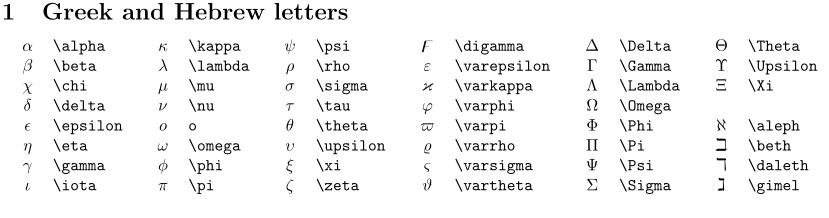

## 数学公式部分

使用\$\$ \$\$ 来定义一个公式块

列如下面这样
$$
hello world
$$

### 公式

|   名称   |       markdown格式        |          数学公式           |
| :------: | :-----------------------: | :-------------------------: |
|   上标   |            A^2            |            $A^2$            |
|   下标   |            A_2            |           $ A_2 $           |
|   组合   |          B^{AC}           |         $ B^{AC} $          |
|   分数   |      \frac{a+b}{c+d}      |      $\frac{a+b}{c+d}$      |
|   累乘   |      \prod_1^n{n^2}       |     $ \prod_1^n{n^2} $      |
|   累加   |        \sum_1^n{n}        |       $ \sum_1^n{n}$        |
|   开方   |        \sqrt[3]{8}        |        $\sqrt[3]{8}$        |
|   积分   |    \int^{10}_0{f(x)}dx    |    $\int^{10}_0{f(x)}dx$    |
| 二重积分 |       \iint f(x)dx        |       $\iint f(x)dx$        |
| 多重积分 |      \iiiint f(x)dx       |      $\iiiint f(x)dx$       |
|   无穷   |          \infty           |          $\infty$           |
|   极限   |     \lim_{n->\infty}      |     $\lim_{n->\infty}$      |
|  右箭头  | \lim_{n\rightarrow\infty} | $\lim_{n\rightarrow\infty}$ |
|  长箭头  |      \longrightarrow      |      $\longrightarrow$      |
| 大于等于 |           \geq            |           $\geq$            |
| 小于等于 |           \leq            |           $\leq$            |
|   属于   |            \in            |            $\in$            |
|   加减   |            \pm            |            $\pm$            |
|   点乘   |         A \cdot B         |         $A \cdot B$         |
|    除    |           \div            |           $\div$            |
|  删除线  |          \not =           |          $ \not =$          |
|          |          \not 5           |          $\not 5$           |
|   对数   |          \log_28          |          $\log_28$          |
|   对数   |           \ln10           |           $\ln10$           |
|   垂直   |         A \bot B          |        $ A \bot B $         |
|   度数   |         30^\circ          |         $30^\circ$          |
|   正弦   |       \sin 30^\circ       |       $\sin30^\circ$        |
|  省略号  |          \cdots           |          $\cdots$           |
|   向量   |         \mathbf A         |        $ \mathbf A $        |
|          |                           |                             |
|          |                           |                             |
|          |                           |                             |

### 希腊字母表



### 矩阵

```
$$
  \begin{matrix}
   1 & 2 & 3 \\
   4 & 5 & 6 \\
   7 & 8 & 9
  \end{matrix} \tag{1}
$$

$$
 \left\{
 \begin{matrix}
   1 & 2 & 3 \\
   4 & 5 & 6 \\
   7 & 8 & 9
  \end{matrix}
  \right\} \tag{2}
$$

$$
 \left[
 \begin{matrix}
   1 & 2 & 3 \\
   4 & 5 & 6 \\
   7 & 8 & 9
  \end{matrix}
  \right] \tag{3}
$$

$$
\left[
\begin{matrix}
 1      & 2      & \cdots & 4      \\
 7      & 6      & \cdots & 5      \\
 \vdots & \vdots & \ddots & \vdots \\
 8      & 9      & \cdots & 0      \\
\end{matrix}
\right] \tag{4}
$$

$$ 
\left[
    \begin{array}{cc|c}
      1 & 2 & 3 \\
      4 & 5 & 6
    \end{array}
\right] \tag{5}
$$
```

$$
\begin{matrix}   1 & 2 & 3 \\   4 & 5 & 6 \\   7 & 8 & 9  \end{matrix} \tag{1}
$$


$$
\left\{ \begin{matrix}   1 & 2 & 3 \\   4 & 5 & 6 \\   7 & 8 & 9  \end{matrix}  \right\} \tag{2}
$$

$$
\left[ \begin{matrix}   1 & 2 & 3 \\   4 & 5 & 6 \\   7 & 8 & 9  \end{matrix}  \right] \tag{3}
$$

$$
\left[ \begin{matrix} 1      & 2      & \cdots & 4      \\ 7      & 6      & \cdots & 5      \\ \vdots & \vdots & \ddots & \vdots \\ 8      & 9      & \cdots & 0      \\ \end{matrix} \right] \tag{4}
$$

$$
\left[    \begin{array}{cc|c}      1 & 2 & 3 \\      4 & 5 & 6    \end{array} \right] \tag{5}
$$

