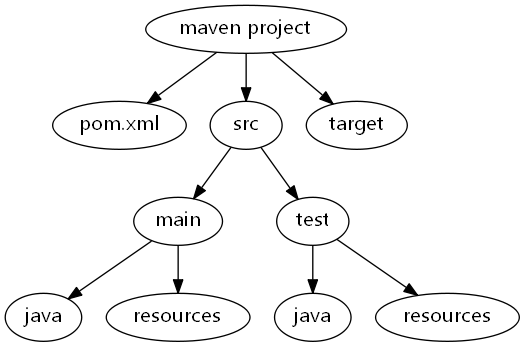
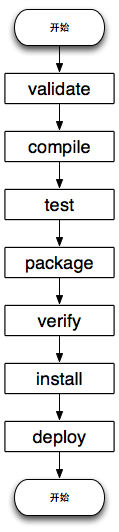
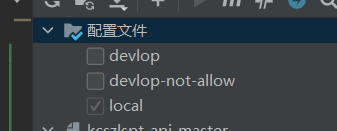

# 前言

在java开发中,maven的重要性不言而喻,但是我对于它的使用还只停留在导入配置文件这样,所以现在得好好学习一下

> 借鉴文档 http://www.mvnbook.com/maven-dependency-conflict.html

# 介绍

Maven是一个流行的**Java项目构建和管理工具，主要用于自动化构建过程**。它有助于项目的**编译、测试、打包、发布和部署**。Maven是基于Project Object Model (POM)的，**使用一个名为pom.xml的配置文件来描述项目的结构、依赖、插件和其他相关信息**。

Maven具有以下特点：

1. 约定优于配置：Maven遵循一套标准的目录结构和默认设置，使得开发人员无需过多的配置即可完成大部分任务。这有助于提高开发效率，简化项目结构，同时使得项目在团队间具有一致性。

2. 依赖管理：Maven能够自动处理项目所需的依赖库，避免了手动下载和管理jar文件的麻烦。它还能解决依赖冲突和版本控制问题。

3. 插件和扩展性：Maven拥有大量插件，这些插件可以帮助开发者完成各种任务，如编译、测试、打包、生成文档等。此外，Maven还支持自定义插件，从而使项目更具扩展性。

4. 生命周期管理：Maven定义了一组预设的生命周期阶段，如编译、测试、打包、安装等。这些阶段按顺序执行，使项目的构建过程更加规范和可控。

5. 多模块项目支持：Maven支持将大型项目分割成多个模块，每个模块可以独立构建和管理。这有助于模块化开发和团队协作。

6. 集成持续集成工具：Maven可以轻松地与持续集成工具（如Jenkins、GitLab CI/CD等）集成，从而实现项目的自动构建、测试和部署。


# maven项目标准目录

目录结构图



详细介绍

| `${basedir}`                         | 存放 `pom.xml` 和所有子目录                                  |
| ------------------------------------ | ------------------------------------------------------------ |
| `${basedir}/src/main/java`           | 项目的 `java` 源代码所在的目录                               |
| `${basedir}/src/main/resources`      | 项目的资源文件所在的目录，例如：`propert`文件                |
| `${basedir}/src/test/java`           | 测试代码所在的目录，例如：`JUnit` 代码                       |
| `${basedir}/src/test/resources`      | 测试相关的资源文件所在的目录                                 |
| `${basedir}/src/main/webapp/WEB-INF` | `web` 应用文件目录，`web` 项目的信息，比如存放 `web.xml`、本地图片、`jsp` 视图页面 |
| `${basedir}/target`                  | 打包输出目录                                                 |
| `${basedir}/target/classes`          | 编译输出目录                                                 |
| `${basedir}/target/test-classes`     | 测试编译输出目录                                             |

# 构件坐标

对于maven来说每一个项目的输出都可以看成一个构件,每个构件都有自己的唯一标识，由 groupId，artifactId 和 version 等信息构成,Maven可以对构件进行版本控制，管理。

## 构件标识

每个构件都有自己的唯一标识（Maven 行话称之为 **"唯一坐标"** ），由 groupId，artifactId 和 version 等信息构成。  groupId通常反域名,artifactId 是项目标识,一般是项目名字,version是版本, 在仓库中, 一个坐标只对应一个jar包

## Maven构件特性

（1）构件具有依赖传递。例如：项目依赖构件A，而构件A又依赖B，Maven会将A和B都视为项目的依赖。

（2）构件之间存在版本冲突时，Maven会依据 "短路优先" 原则加载构件。此外，我们也可以在 pom.xml 中，使用 <exclusions></exclusions>显式排除某个版本的依赖，以确保项目能够运行。

- （a）项目依赖构件A和B，构件A → C → D(version:1.0.0)，构件B → D(version:1.1.0)，此时，Maven会优先解析加载D(version:1.1.0)。
- （b）项目依赖构件A和B，构件A → D(version:1.0.0)， 构件B → D(version:1.1.0)，此时，Maven会优先解析加载D(version:1.0.0)。

（3）构件的依赖范围。Maven在项目的构建过程中，会编译三套 ClassPath，分别对应：编译期，运行期，测试期。而依赖范围就是为构件指定它可以作用于哪套 ClassPath。

# 依赖范围

因为 Maven 执行一系列操作，主要包括编译、测试、运行等操作，在不同的操作下依赖的 Jar 不同，依赖范围就是用来控制 Jar 包的可见性。例如，JUnit 的依赖范围是test，只用于编译测试代码和运行测试代码的时候才可见，而在编译和运行主项目时无法使用此依赖。**有些依赖编译用不到，只有运行的时候才能用到，比如 MySQL 的驱动包在编译期就用不到（编译期用的是JDBC接口）**，而是在运行时用到的。还有些依赖，编译期要用到，而运行期不需要提供，因为有些容器已经提供了，比如 servlet-api.jar 在 Tomcat 中已经提供了，我们只需要的是编译期提供而已。

| -        | 编译期 | 测试期 | 运行期 | 说明                                                         |
| :------- | :----- | :----- | :----- | :----------------------------------------------------------- |
| compile  | √      | √      | √      | 默认范围                                                     |
| provided | √      | √      |        | 如 servlet-api.jar，运行期由web容器提供。                    |
| runtime  |        | √      | √      | 编译期无需直接引用。                                         |
| test     |        | √      |        | 如junit.jar。                                                |
| system   | √      | √      |        | 必须通过 <systemPath></systemPath> 元素，显示指定依赖文件的路径， 与本地系统相关联，可移植性差。 |
| import   |        |        |        | 表示继承父POM.XML中的依赖范围设置                            |

> jar包是真实存在的, 依赖范围只是看我们什么时候需要使用这个jar包

# 依赖搜索顺序

`maven`按照以下顺序查找依赖库：

- 步骤 1：在本地仓库搜索，如果找不到，执行步骤 2，找到了则执行其他操作
- 步骤 2：在中央仓库搜索，如果找不到，并且有一个或多个远程仓库已经设置，则执行步骤 4，如果找到了则下载到本地仓库中引用。
- 步骤 3：如果远程仓库没有被设置,  将简单的停滞处理并抛出错误（无法找到依赖的文件）。
- 步骤 4：在一个或多个远程仓库中搜索依赖的文件, 如果找到则下载到本地仓库引用, 否则将停止处理并抛出错误（无法找到依赖的文件）。

# 依赖冲突

在 Maven 中，依赖分为直接依赖和传递依赖（即间接依赖）,传递性依赖机制，能大大简化依赖管理，因为大部分情况下我们只需要关心项目的直接依赖是什么，而不用考虑这些直接依赖会引入什么传递性依赖, 但是这样也会有问题, 就是会有间接依赖冲突的问题, **对于同一个groupid 和 artifactId  下  只能有同一个version**,(版本决定不了包名字)对于间接依赖这种就很容易会产生冲突

## 直接依赖冲突

对于直接依赖冲突, 引入的依赖是最后出现的一个版本

```xml
<dependencies>

	<dependency>
		<groupId>org.mybatis</groupId>
		<artifactId>mybatis</artifactId>
		<version>3.3.0</version>
	</dependency>

	<dependency>
		<groupId>org.mybatis</groupId>
		<artifactId>mybatis</artifactId>
		<version>3.5.0</version>
	</dependency>

</dependencies>
```

比如这样就是3.5.0的版本

## 传递依赖冲突

依赖传递的发生有两种情况：一种是存在模块之间的继承关系，在继承父模块后同时引入了父模块中的依赖，可通过可选依赖机制放弃依赖传递到子模块；**另一种是引包时附带引入该包所依赖的包，该方式是引起依赖冲突的主因**

比如一个项目同时引入了 A 和 B  A引用了 C 1.0版本  B引用了 C 2.0的版本  那这样肯定会产生冲突  如果使用的时候C 2.0 的话,可能不会有问题, 但是如果使用的是 C 1.0的话,那可能就有大问题了, 1.0的版本一般是无法调用2.0的东西的, 而2.0一般是兼容1.0的,这个时候我们是不是就要去解决冲突了,尽量让2.0优先

## 冲突解决策略

### 路径最先的优先

这个是maven自动解决的, 谁的路径最短,优先使用谁

```

A --> B --> X(1.1)         // dist(A->X) = 2

A --> C --> D --> X(1.0)   // dist(A->X) = 3

```

这里优先使用x(1.1)版本

### 第一声明优先

如果路径最先解决不了的话,就谁先声明谁使用 (**这个是针对间接依赖**),直接依赖的话就谁后声明谁优先

### 依赖排除

我们可以直接排除一些依赖留下一个或者没有

```xml
<dependency>
  <groupId>org.glassfish.jersey.containers</groupId>
  <artifactId>jersey-container-grizzly2-http</artifactId>
  <!-- 剔除依赖 -->
  <exclusions>
    <exclusion>
      <groupId>org.glassfish.hk2.external</groupId>
      <artifactId>jakarta.inject</artifactId>
    </exclusion>
    ...
  </exclusions>
</dependency>
```


# 快照

在Maven中，快照（Snapshot）是一种特殊类型的版本，表示项目的一个正在开发中的版本。**快照版本通常用于在团队内共享尚未发布的项目版本，以便在不同的模块或项目之间进行协作开发。与正式发布的稳定版本相比，快照版本可能会频繁更新，因此它们不能保证稳定性和一致性。**

**快照版本的主要优点是它们可以自动更新。当你的项目依赖于一个快照版本的库时，Maven会定期检查远程仓库中是否有新的快照版本。如果有更新，Maven会自动下载并使用新版本。这有助于确保项目始终使用最新的开发版本。**

要定义一个Maven项目的快照版本，你需要在项目的`pom.xml`文件中将`<version>`标签的值设置为以`-SNAPSHOT`结尾的版本号。例如：

```xml
<groupId>com.example</groupId>
<artifactId>my-project</artifactId>
<version>1.0.0-SNAPSHOT</version>
```

在这个例子中，项目的版本被定义为`1.0.0-SNAPSHOT`，表示这是一个正在开发中的1.0.0版本。当项目稳定并准备发布时，可以将版本号更新为不包含`-SNAPSHOT`的正式版本号，如`1.0.0`。

要使用其他项目的快照版本，只需在`pom.xml`文件的`<dependencies>`部分添加相应的依赖，并确保远程仓库包含该快照版本。例如：

```xml
<dependencies>
    <dependency>
        <groupId>com.example</groupId>
        <artifactId>another-project</artifactId>
        <version>1.0.0-SNAPSHOT</version>
    </dependency>
</dependencies>
```

注意：为了使用快照版本，你需要配置Maven仓库（如`settings.xml`文件中的`<repositories>`和`<pluginRepositories>`部分），以便它们可以从包含快照版本的远程仓库获取。**这通常包括配置一个称为“快照仓库”的特殊仓库。**

## 更新策略

在settings.xml中profiles标签中我们可以配置

```
<repository>
    <id>myRepository</id>
    <url>...</url>
    <snapshots>
        <enabled>true</enabled>
        <updatePolicy>更新策略</updatePolicy>
    </snapshots>
</repository>
```

更新策略有一下几种：

- always 每次构建都检查远程仓库中该依赖jar包是否有更新
- daily 每天检查一次 (默认策略)
- interval:XXX 指定检查时间间隔，单位是分钟。
- never 从不检查。该策略就和正式版本的处理规则一样了。

## 命令强制更新

```
mvn clean install -U
```


# 生命周期

在Maven中，生命周期是指一系列有序的阶段，用于构建、测试、部署和发布项目。Maven的核心原则是约定优于配置，因此它为各种类型的项目提供了一些预定义的项目周期。这些预定义的周期涵盖了项目从源代码到可部署产物的整个过程。

> 生命周期只是一个概念,真正做事情的是插件

Maven 有以下三个标准的生命周期:

1. clean：项目清理。主要用于清理上一次构建产生的文件，可以理解为删除 target 目录,它包含以下阶段:
   - pre-clean：在实际清理之前执行必要的操作。
   - clean：删除构建产物（例如，删除 target 目录）。
   - post-clean：完成清理后，进行后续操作。
2. default(或 build)：项目构建。主要阶段包含：
   - validate：验证项目是否正确，所有必需的信息是否可用。
   - initialize：初始化构建状态，例如设置属性或创建目录。
   - generate-sources：生成项目所需的任何源代码。
   - process-sources：处理源代码，例如过滤文件。
   - generate-resources：生成项目所需的任何资源。
   - process-resources：将资源复制到目标目录，以便在打包时包含它们。
   - compile：编译项目的源代码。
   - process-classes：处理编译后的文件，例如优化字节码。
   - generate-test-sources：生成项目的测试源代码。
   - process-test-sources：处理测试源代码，例如过滤文件。
   - generate-test-resources：生成项目的测试资源。
   - process-test-resources：将测试资源复制到目标目录，以便在测试时使用。
   - test-compile：编译项目的测试源代码。
   - process-test-classes：处理编译后的测试文件。
   - test：使用合适的测试框架运行测试。
   - prepare-package：执行任何在打包之前需要完成的操作。
   - **package**：将编译后的代码和资源打包成指定格式的文件，如 JAR、WAR 或 EAR。
   - pre-integration-test：在集成测试之前执行必要的操作。
   - integration-test：处理和部署项目以便进行集成测试。
   - post-integration-test：完成集成测试后，进行后续操作。
   - verify：检查包是否有效，满足质量标准。
   - install：将包安装到本地仓库，以便在其他项目中使用。
   - deploy：将最终的包复制到远程仓库，以便与其他开发人员和项目共享。



3. site：项目站点文档创建。

**如果我们执行了某个生命周期的命令,那么它之前的生命周期对应的插件都会被执行**,比如我们使用了 mvn compile 那么validate就会执行

# 插件

Maven本质上是一个插件框架，它的核心并不执行任何具体的构建任务，所有这些任务都交给插件来完成。

使用插件的命令格式如下:

### 方式一

```
mvn pluginGroupId:pluginArtifactId:pluginVersion:goal(goal 也可以理解成方法)
mvn compiler:compile
```

### 方式二

```
mvn 生命周期
mvn compile
```

方式一执行的是一个插件, 而方式二一般是执行一堆插件

## 插件与生命周期的绑定

Maven生命周期与插件的绑定是指将插件的目标（goal）与生命周期的某个阶段关联起来。当Maven执行生命周期的某个阶段时，与该阶段绑定的插件目标也会被执行。这种绑定机制允许开发人员在构建过程中使用插件完成特定任务，从而扩展和自定义Maven的构建过程。

插件通常会有一个或多个目标，每个目标对应一个具体的任务。例如，`maven-compiler-plugin` 插件有两个主要目标：`compile`和`testCompile`。这两个目标分别负责编译主代码和测试代码。在默认情况下，`compile` 目标绑定到生命周期的 `compile` 阶段，`testCompile` 目标绑定到生命周期的 `test` 阶段。

要将插件目标与生命周期阶段绑定，需要在项目的`pom.xml`文件中的`<build>`元素内定义插件。以下是一个简单的例子：

```xml
<build>
    <plugins>
        <plugin>
            <groupId>org.apache.maven.plugins</groupId>
            <artifactId>maven-compiler-plugin</artifactId>
            <version>3.8.1</version>
            <executions>
                <execution>
                    <id>default-compile</id>
                    <phase>compile</phase>
                    <goals>
                        <goal>compile</goal>
                    </goals>
                </execution>
                <execution>
                    <id>default-testCompile</id>
                    <phase>test</phase>
                    <goals>
                        <goal>testCompile</goal>
                    </goals>
                </execution>
            </executions>
        </plugin>
    </plugins>
</build>

```

在上述示例中，`maven-compiler-plugin`的`compile`目标被绑定到了`compile`阶段，而`testCompile`目标被绑定到了`test`阶段。当Maven执行生命周期阶段时，相应的插件目标也会被触发执行。

通过这种绑定关系，开发人员可以为Maven项目自定义构建过程，使用插件完成各种任务，如编译、测试、打包等。

## 开发插件

Maven 作为一个优秀的项目管理工具，其插件机制提供了很多功能扩展。Maven 自带的插件足够满足我们的项目开发要求，不排除在某些特殊情况下，需要我们自己开发一个自己的插件来协助我们完成某些工作

### 命名规范

Maven 命名有要求，插件命名为 <myplugin>-maven-plugin ，而不推荐使用 maven-<myplugin>-plugin，因为后者是 Maven 团队维护官方插件的保留命名方式。

### 创建MOJO工程

MOJO 就是 Maven Ordinary Java Object。每一个 MOJO 就是 Maven 中的一个执行目标（executable goal），而插件则是对单个或多个相关的 MOJO做统一分发。一个 MOJO 包含一个简单的 Java 类。插件中多个类似 MOJO 的通用之处可以使用抽象父类来封装。

创建 Maven 插件工程与正常工程相似，但是，记得要选用 maven-archetype-mojo 模板。

> 新建 Maven 项目时，需要选择 archetype。那么，什么是archetype？ archetype 的意思就是模板原型的意思，原型是一个 Maven 项目模板工具包。一个原型被定义为从其中相同类型的所有其它事情是由一个原始图案或模型。原型将帮助作者为用户创建 Maven 项目模板，并为用户提供了手段，产生的这些项目模板参数化的版本。maven-archetype-mojo 是一个 Maven 的 Java 插件开发项目原型。

### 编写pom.xml文件

```xml
<project xmlns="http://maven.apache.org/POM/4.0.0" xmlns:xsi="http://www.w3.org/2001/XMLSchema-instance"
  xsi:schemaLocation="http://maven.apache.org/POM/4.0.0 http://maven.apache.org/maven-v4_0_0.xsd">
  <modelVersion>4.0.0</modelVersion>
  <groupId>com.djm</groupId>
  <artifactId>hello-maven-plugin</artifactId>
  <packaging>maven-plugin</packaging>
  <version>1.0-SNAPSHOT</version>
  <name>hello-maven-plugin Maven Mojo</name>
  <url>http://maven.apache.org</url>
  <dependencies>
    <dependency>
      <groupId>org.apache.maven</groupId>
      <artifactId>maven-plugin-api</artifactId>
      <version>3.9.0</version>
    </dependency>
    <dependency>
      <groupId>junit</groupId>
      <artifactId>junit</artifactId>
      <version>4.13.2</version>
      <scope>test</scope>
    </dependency>
	
      
    <dependency>
      <groupId>org.apache.maven.plugin-tools</groupId>
      <artifactId>maven-plugin-annotations</artifactId>
      <version>3.8.1</version>
      <scope>provided</scope>
    </dependency>
  </dependencies>

  <build>
    <plugins>
      <plugin>
        <groupId>org.apache.maven.plugins</groupId>
        <artifactId>maven-compiler-plugin</artifactId>
        <version>3.8.1</version>
        <configuration>
          <source>1.8</source>
          <target>1.8</target>
        </configuration>
      </plugin>
    </plugins>
  </build>
</project>

```

### 编写MOJO类

编写的类继承AbstractMojo然后重写它的执行方法, 最后还需要在类上加入@Mojo 注解声明执行目标

无参MOJO

```
@Mojo(name = "hello")
public class MyMojo
    extends AbstractMojo
{


    public void execute()
        throws MojoExecutionException
    {
        getLog().info("hello world");
    }
}

```

需要参数的MOJO

```
@Mojo(name = "parameter")
public class ParamterMojo extends AbstractMojo {

    @Parameter(property = "someParameter", defaultValue = "default-value")
    private String someParameter;

    @Override
    public void execute() throws MojoExecutionException, MojoFailureException {
        System.out.println(someParameter);
    }
}
```

然后执行mvn install

### 引入插件

```
<plugin>
    <groupId>com.djm</groupId>
    <artifactId>hello-maven-plugin</artifactId>
    <version>1.0-SNAPSHOT</version>
    <configuration>
        <someParameter>hello world!!!!</someParameter>  <!--传递参数-->
    </configuration>

    <executions>
        <execution>
            <phase>compile</phase>  <!--与生命周期绑定-->
            <goals>
                <goal>parameter</goal>
            </goals>
        </execution>
    </executions>

</plugin>
```

## plugin的子标签

在 Maven 的 `pom.xml` 文件中，`<plugin>` 标签用于定义插件及其配置。插件用于扩展或定制 Maven 构建过程中的某些任务。`<plugin>` 标签可以包含以下子标签：

1. `<groupId>`：插件的 groupId，它用于唯一标识插件所属的项目或组织。例如：`org.apache.maven.plugins`。

2. `<artifactId>`：插件的 artifactId，它用于唯一标识插件。例如：`maven-compiler-plugin`。

3. `<version>`：插件的版本号。例如：`3.8.0`。

4. `<extensions>`：布尔值，用于指示插件是否提供扩展点。扩展点允许插件修改 Maven 的核心行为。大多数插件不需要使用扩展点，因此此标签通常为 `false` 或省略。

5. `<executions>`：定义插件在构建过程中的多个执行。`<executions>` 标签可以包含多个 `<execution>` 标签。每个 `<execution>` 标签可以包含以下子标签：

   - `<id>`：执行的唯一标识符，用于区分不同的执行。
   - `<phase>`：与此执行关联的生命周期阶段。在指定的阶段，将执行这个插件。
   - `<goals>`：定义与此执行关联的插件目标（任务）。`<goals>` 标签可以包含多个 `<goal>` 标签，每个 `<goal>` 标签表示一个要执行的插件目标。

6. `<configuration>`：插件的配置信息。**这些配置参数用于定制插件的行为**。`<configuration>` 标签中的子标签取决于插件本身，因为每个插件可能有不同的配置参数。例如，对于 `maven-compiler-plugin`，`<configuration>` 可能包含 `<source>` 和 `<target>` 标签，用于指定 Java 源代码和目标字节码的版本。

下面是一个配置示例，它使用 `maven-compiler-plugin` 设置 Java 源代码和目标字节码的版本：

```xml
<build>
    <plugins>
        <plugin>
            <groupId>org.apache.maven.plugins</groupId>
            <artifactId>maven-compiler-plugin</artifactId>
            <version>3.8.0</version>
            <configuration>
                <source>1.8</source>
                <target>1.8</target>
            </configuration>
        </plugin>
    </plugins>
</build>
```

这个示例中，我们定义了一个插件（`maven-compiler-plugin`），并通过 `<configuration>` 标签设置了 Java 源代码和目标字节码的版本为 1.8。

# POM常用配置项

`pom.xml` 是 Maven 项目的核心配置文件，它定义了项目的基本信息、依赖关系、插件、构建配置等。以下是 `pom.xml` 中的一些主要配置项及其用途：

1. `<modelVersion>`：POM 文件的模型版本，通常是 "4.0.0"。**这是一个必需的元素**。

2. `<groupId>`：项目的组织或公司名称，通常是一个反向的域名，例如 "org.example"。它是 Maven 项目坐标的一部分。

3. `<artifactId>`：项目的唯一标识符，例如 "my-project"。它是 Maven 项目坐标的一部分。

4. `<version>`：项目的版本号，例如 "1.0.0"。它是 Maven 项目坐标的一部分。

5. `<packaging>`：项目的打包类型，例如 "jar"、"war" 等。默认值是 "jar"。

6. `<name>`：项目的人类可读名称，例如 "My Project"。

7. `<description>`：项目的简要描述。

8. `<url>`：项目的主页 URL。

9. `<dependencies>`：项目的依赖关系列表。在此元素中，可以使用 `<dependency>` 标签声明项目所需的库文件。例如：

```xml
<dependencies>
    <dependency>
        <groupId>com.example</groupId>
        <artifactId>example-library</artifactId>
        <version>1.0.0</version>
    </dependency>
</dependencies>
```

10. **`<dependencyManagement>`：用于在多模块项目中管理依赖关系的版本**。在此元素中，可以使用 `<dependencies>` 标签声明依赖关系，**但这些依赖关系不会直接添加到项目中，而是作为版本管理的参考。子模块可以继承这些依赖关系，并在需要时覆盖版本。**子项目只需要引入就行而不用指定版本,当然也可以指定版本进行覆盖

    父模块

    ```xml
    <dependencyManagement>
        <dependencies>
            <dependency>
                <groupId>org.aspectj</groupId>
                <artifactId>aspectjweaver</artifactId>
                <version>${aop.version}</version>
            </dependency>
        </dependencies>
    </dependencyManagement>
    ```

    子模块

    ```xml
    <dependencies>
        <dependency>
            <groupId>org.aspectj</groupId>
            <artifactId>aspectjweaver</artifactId>
        </dependency>
    </dependencies>
    ```

    **这么做的的好处是,可以让一套项目中可能用到的版本都适配,  因为使用者并不知道哪些包需要使用哪些版本,但是他知道要这个包**

11. `<build>`：项目的构建配置。在此元素中，可以配置构建输出目录、源代码目录、资源文件目录等。还可以配置插件及其执行阶段、目标和参数。例如：

```xml
<build>
    <plugins>
        <plugin>
            <groupId>org.apache.maven.plugins</groupId>
            <artifactId>maven-compiler-plugin</artifactId>
            <version>3.8.1</version>
            <configuration>
                <source>1.8</source>
                <target>1.8</target>
            </configuration>
        </plugin>
    </plugins>
</build>
```

12. `<pluginManagement>`：与 `<dependencyManagement>` 类似，用于在多模块项目中管理插件的版本和配置。子模块可以继承这些插件，并在需要时覆盖配置。

13. `<properties>`：项目的自定义属性。可以在此元素中定义属性，然后在 POM 文件的其他地方引用它们。例如：

```xml
<properties>
    <project.build.sourceEncoding>UTF-8</project.build.sourceEncoding>
</properties>
```

14. `<profiles>`：项目的配置文件。在 `<profiles>` 中，可以定义一组构建配置文件（profiles），每个配置文件对应一种特定的构建场景。**配置文件可以包含特定的依赖关系、插件配置和属性**。通过激活不同的配置文件，可以在不同的环境或条件下使用不同的构建配置。例如：

```
<project>
    <!-- ... 其他配置 ... -->

    <properties>
        <!-- 默认激活的 profile -->
        <activeProfile>development</activeProfile>
    </properties>

    <profiles>
        <profile>
            <id>development</id>
            <activation>
                <property>
                    <name>activeProfile</name>
                    <value>development</value>
                </property>
            </activation>
            <properties>
                <db.url>jdbc:mysql://localhost:3306/dev_db</db.url>
                <db.username>dev_user</db.username>
                <db.password>dev_password</db.password>
            </properties>
        </profile>

        <profile>
            <id>production</id>
            <activation>
                <property>
                    <name>activeProfile</name>
                    <value>production</value>
                </property>
            </activation>
            <properties>
                <db.url>jdbc:mysql://localhost:3306/prod_db</db.url>
                <db.username>prod_user</db.username>
                <db.password>prod_password</db.password>
            </properties>
        </profile>
    </profiles>
</project>

```

# 多模块

子模块会继承父模块的插件和依赖

# maven配置

`settings.xml` 文件是 Maven 的核心配置文件。它允许你定制 Maven 的行为，包括存储库设置、代理设置、构建配置等。下面是一些常见的配置项及其用途：

1. `<localRepository>`：指定本地存储库的路径。默认情况下，Maven 将所有依赖项和插件存储在用户主目录下的 `.m2/repository` 文件夹中。

2. `<mirrors>`：用于配置镜像存储库。当 Maven 无法从默认的中央存储库中检索某个组件时，可以配置镜像存储库作为替代源。

3. `<proxies>`：配置 Maven 通过代理服务器访问外部网络的设置。这对于需要使用代理服务器来访问外部资源的用户非常有用。

4. `<servers>`：配置 Maven 用于身份验证的服务器设置。当需要访问受保护的远程存储库或部署到远程存储库时，这是必需的。

5. `<profiles>`：包含用于定制构建环境的一组配置。通过使用不同的配置文件，可以轻松地在多个环境中切换构建设置，例如开发、测试和生产环境。

6. `<activeProfiles>`：列出在 Maven 运行时默认激活的配置文件。这允许你根据需要激活或禁用某些配置文件。

7. `<pluginGroups>`：定义可在命令行中简化命令的插件组。例如，你可以通过添加插件组来将完整的插件坐标缩短为更简洁的前缀。

这些配置项通过 XML 标签组织在 `settings.xml` 文件中。可以根据项目需求自定义这些配置，以便更好地控制 Maven 的行为。

## 优先级

Maven 配置文件的优先级如下：

1. 项目的 `pom.xml`
2. 用户级的 `settings.xml`（通常位于 `~/.m2/settings.xml`）
3. 全局的 `settings.xml`（通常位于 `${maven.home}/conf/settings.xml`）

**当存在相同的配置项时，优先级较高的配置会覆盖优先级较低的配置。**

在合并过程中，如果有冲突，高优先级的配置会覆盖低优先级的配置。这种覆盖是在具体配置项的层次上进行的，而不是整个标签。也就是说，如果高优先级的配置文件只更改了一个特定的配置项，那么它只会覆盖低优先级配置文件中的该配置项，而不会影响其他配置项。

例如，如果用户级 `settings.xml` 中的 `<mirrors>` 配置与全局 `settings.xml` 中的 `<mirrors>` 配置冲突，那么用户级 `settings.xml` 中的 `<mirrors>` 配置将优先使用。然后，仅具有冲突的 `<mirror>` 标签将被用户级设置中的对应标签替换，而其他不冲突的 `<mirror>` 标签将保持原样。

## 注意点

如果我们有多个镜像,  maven会根据顺序 和 规则 去 连接这些镜像对应的仓库, **如果连接成功了, 就不会再去连接其他仓库, 即使其他仓库里面有我们需要的依赖,而这个仓库没有** ,这样的话就会报出依赖找不到的错误,因此我们要注意这些镜像能够匹配哪些仓库

# 多环境配置

在开发的时候,我们通常需要多套环境切换,  比如springboot 中,  如果我们通过spring.profiles.active 去切换的话,这样有点太麻烦了, 每次都要修改,  我觉得使用maven自带的这个多环境配置会更方便,  接下来讲一下springboot中如何使用maven配置多环境

在springboot 中的 配置文件中引入maven变量

```properties
spring.profiles.active=@activatedProperties@
```

然后在pom.xml中配置, 这个千万不能少,不然的话,maven不会替换掉springboot中的变量值的

```xml
  <build>
    <finalName>ROOT</finalName>  <!-- 打包后的名称 -->
   <resources>
      <resource>
        <directory>src/main/resources</directory>
        <filtering>true</filtering>  <!-- 启用过滤 即该资源中的变量将会被过滤器中的值替换 --> 
        <includes>  <!-- 指定需要过滤的文件,不要全部指定,比如如果有些静态资源里面也有@@或者${}这样的变量,会出现问题的 -->
          <include>**/*.properties</include>
          <include>**/*.xml</include>
        </includes>
      </resource>
       
      <resource>
        <directory>src/main/resources</directory>
        <filtering>false</filtering>  <!-- 关闭资源文件过滤 -->
        <excludes>  <!-- 指定不需要过滤的文件 -->
          <exclude>**/*.properties</exclude>
          <exclude>**/*.xml</exclude>
        </excludes>
      </resource>
    </resources>
  </build>
```

接下来在pom.xml创建多个配置环境激活变量

```xml
<profiles>

    <profile>
      <id>devlop</id>
      <properties>
        <activatedProperties>devlop,devlopallow</activatedProperties>
      </properties>
    </profile>
    <profile>
      <id>devlop-not-allow</id>
      <properties>
        <activatedProperties>devlop</activatedProperties>
      </properties>
    </profile>
    <profile>
      <id>local</id>
      <properties>
        <activatedProperties>local</activatedProperties>
      </properties>
      <activation>
        <activeByDefault>true</activeByDefault> <!-- 默认激活该profile -->
      </activation>
    </profile>
  </profiles>
```

这样之后我们就只需要在maven中选择哪个配置文件就行了,不用修改代码



默认情况下, 在 Maven 的 pom.xml 文件中定义的变量只在 Maven 构建过程中有效。**并不会影响我们的配置文件和环境变量**,  然而，可以使用 Maven 的资源过滤功能来将 Maven 变量的值插入到 Java 属性文件（如 .properties 或 .yml 文件）中
