## 前言

以前学过一点点正则表达式,后面又忘记了,又总是遇到这个东西,所以想这次学的明白一点,虽说不用记住,但是也要知道怎么用,这样查资料的时候也能查的明白一些

## 介绍

正则表达式(Regular Expression)是一种文本模式，简称Regex,包括普通字符（例如，a 到 z 之间的字母,数字）和特殊字符（称为"元字符",列如\ . * ^ $),正则表达式可以用来匹配,查找,替换一系列符合规则的字符串

## 修饰符

我觉得很有必要先把这个修饰符先了解了再去了解元字符

正则表达式一般长这样    /  pattern(匹配字符串) /flags(修饰符)

修饰符很大程度上影响我们的匹配

### g修饰符

代表全局匹配(global),查找所有项,如果不加这个,就只查找第一项

### i修饰符

代表忽略大小写(ignore)  

### m修饰符

代表多行匹配( multi line), 如果不加这个,无论换行与否都是当成一行来处理,这样的话使用 $ 和 ^ 元字符的时候就要注意了

### s修饰符

代表 当使用元字符 . 的时候  可以匹配 换行符,如果不加的话, . 是不会匹配 换行符的

## 元字符

使用元字符可以让我们使用更简单的正则表达式匹配更加精确的字符串,接下来让我一起去看看吧

> 当然我们也可以不使用任何元字符,这样就是基本匹配了

### . 点

. 可以匹配任何一个字符

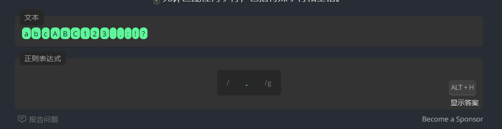

> 这里所有字符都匹配了的原因就是 g修饰符的原因

### [] 字符集

可以匹配字符集里面的任意一个字符


[aeiou]  可以 匹配 a, e,i,o,u 这五个字符中的任意一个

### [^] 否定字符集

可以匹配除了这个字符集以外的任何一个字符


我们可以看到ber 和 bor 就没有被选中

> 需要注意的是 ^ 只能写在开头

### 拓展字符集

这个是我自己命名的哈哈哈哈

对于上述两个字符集我们还可以拓展一番

我们可以在字符集和否定字符集的基础上变成范围字符集

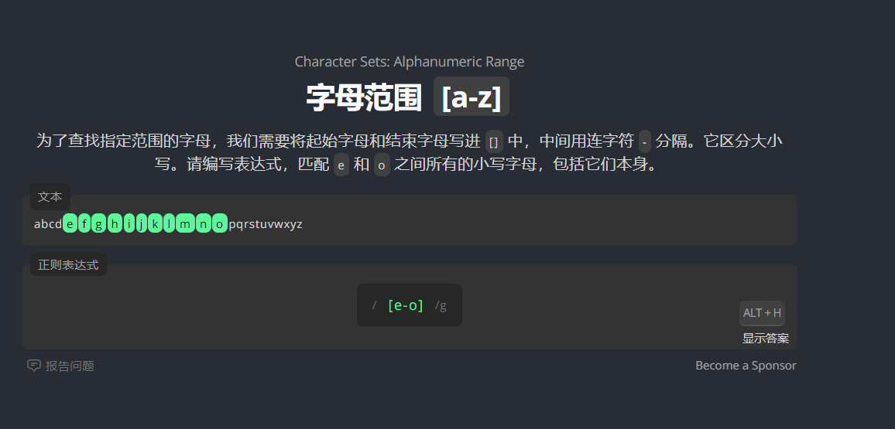

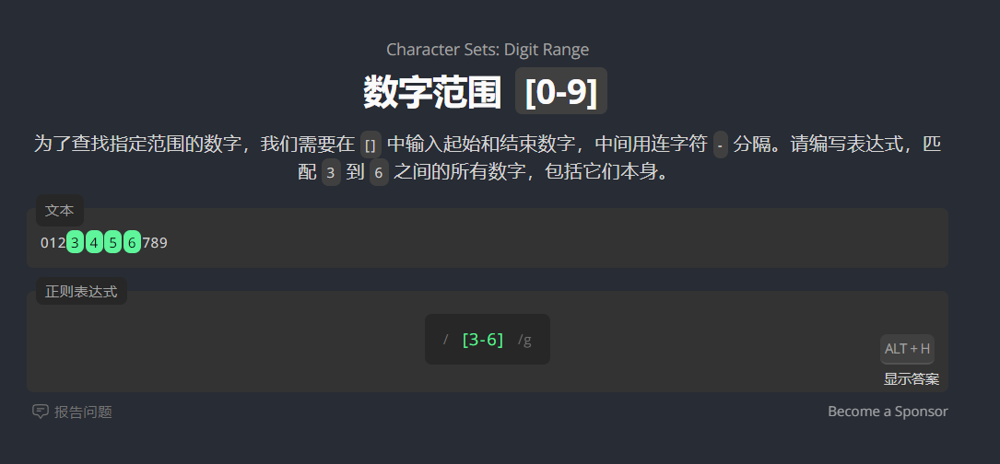

同样的我们也可以将上述字符集变成否定字符集

我们还可以使用这种格式的表达式 

```c
/[a-z0-9]/g   // 这个代表a-z和0-9中的任意一个字符
```

### 大括号{}

这个代表前一个表达式出现的范围

{N} 代表前一个表达式出现N次才能匹配

{N,M} 代表前一个表示式出现N-M次之间才能匹配  {N,} 代表 [N,无穷大)  {,M}代表[0,M]

### + * ? 重复字符

我们可以通过+ * ? 元字符来指定前一个子表达式重复出现的次数

? 代表出现 0 次或者1次 可以匹配

\+ 代表出现 1次或者1次以上 可以匹配

\* 代表出现任意次  可以匹配

**\+ \* 都是贪婪匹配,就是匹配的内容越多越好  而 +?  *? 就不是贪婪匹配,恰恰相反,匹配的内容越少越好,**

### () 分组

我们对一个表达式进行分组,可以引用或者执行一些规则


### 引用分组

我们可以使用 \1 \2  这种格式来引用分组, 有两个作用,一是简化表达式,二是让这里的内容和指定的那个分组的内容要相同


### 非捕获分组(?:)

这个呢其实就是为了让这个分组不参与到\1 \2 这里面去,就是这个分组不影响这个计数,就当他不存在


如果不考虑这个非捕获分组,那么这个\1 应该要匹配ha

### 命名分组 (?P\<name\>)

这个其实是对分组进行命名,在代码中获取分组的时候也可以直接使用名字非方式获得分组,而不用使用 1,2 这种索引方式,**这样的分组还是计入到引用分组的计数当中的**,不同的语言对于正则表达式命名分组的做法不一样

```java
/hello(?P<first>world)(?P=world)/g    // python  (?P<name> ) 是创建命名分组  (?P=name) 是引用分组  当然 \1 也可以
/hello(?<first>world)\k<first>   // java  (?<first>) 是创建命名分组 \k<first>  是引用分组  当然 /1 也可以
```


### 竖线 |

这个其实就是或这样一个逻辑,或上两个表达式,前面的表达式或者后面的表达式任意一个匹配上都行

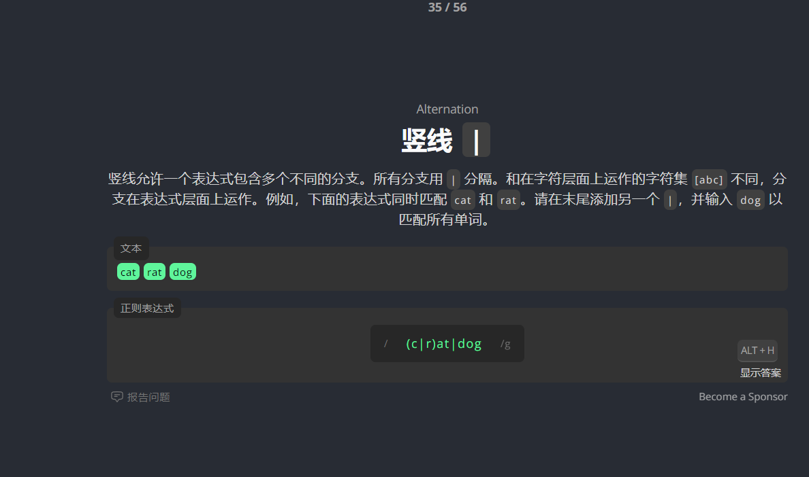

### 转义字符 \

这个用来将. [] ^ + * ? () 这些元字符进行转义,使得这些字符能够直接参与到匹配中


### 插入符^

这个代表开始位置,也就是行首

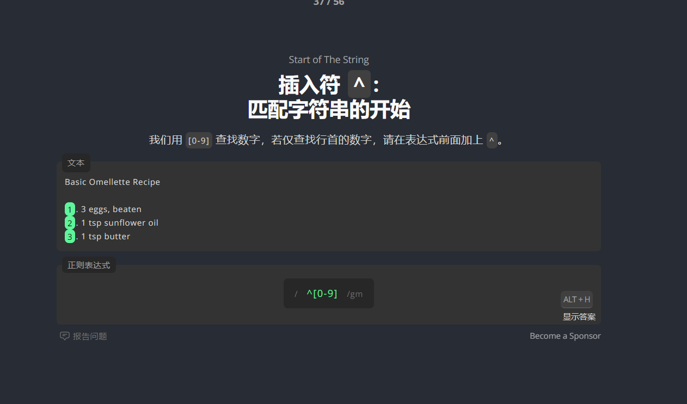

如果没开启m修饰符,那么就只有一行了哦

### 美元符号 $

这个代表行尾

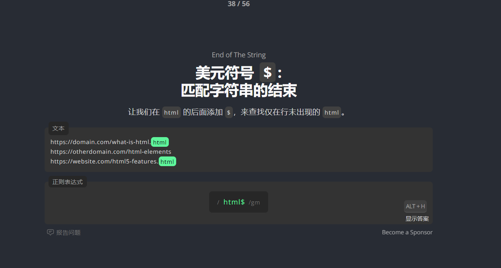

同样的,如果没开启m修饰符,那么就只有一行了哦

### 单词边界 \b

这个代表前一个字符已经是单词的最后一个了,我们可以这样理解, 先不看\b这个字符,先将匹配好的字符串全部标出来,看哪些**是单词的末尾**就符合要求

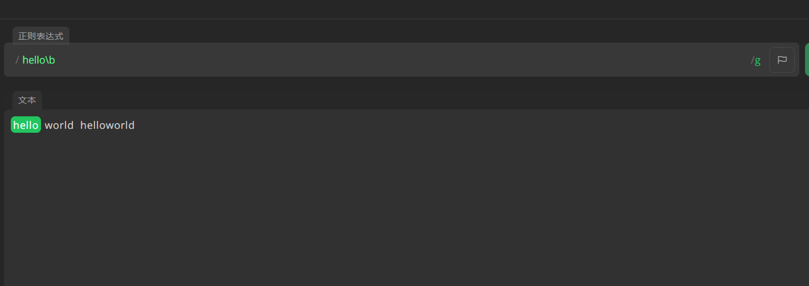

### 非单词边界 \B

这个代表前一个字符还不是单词的最后一个,我们可以这样理解, 先不看\B这个字符,先将匹配好的字符串全部标出来,看哪些**不是单词的末尾**就符合要求

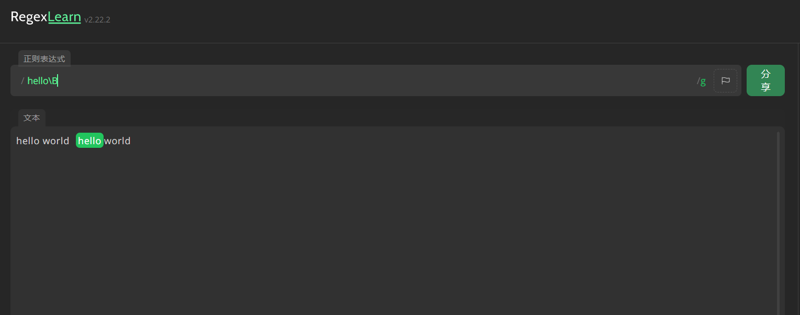

### \w(小写w)

用来匹配字符,数字或者下划线


### \W(大写W)

用来匹配非字符,数字,下划线的

> 中文属于 \W

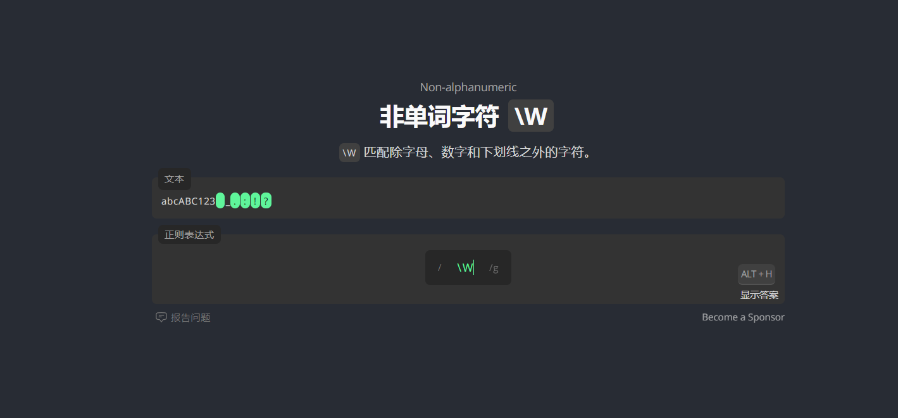

### \d

用来匹配数字字符

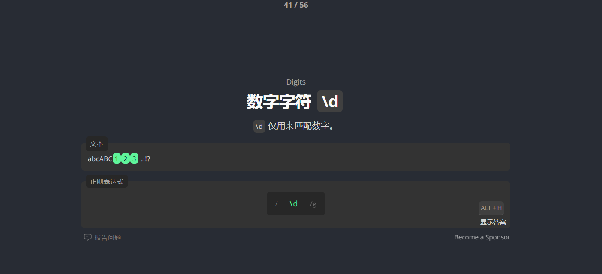

### \D

用来匹配非单词字符


### \s

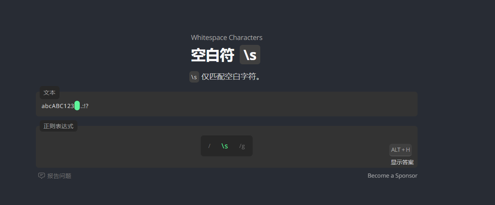

### \S

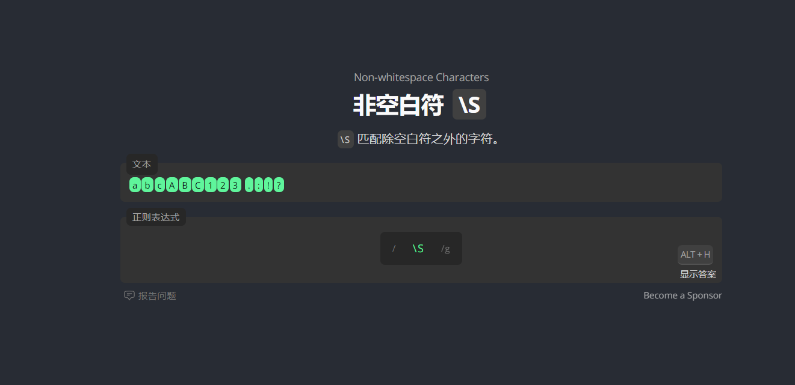

### 零宽断言

说人话就是 希望匹配的字符在某个字符或者多个字符之前或者之后,这种断言也属于非捕获分组

**他们并不参与匹配,只是多了一些限制**

### 正向先行断言: (?=)

就是**表达式所匹配的字符**后面紧挨着**所给定的字符**才能匹配成功

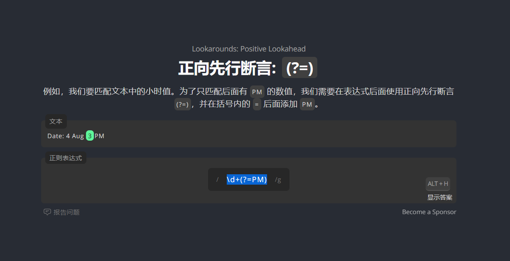

这个正则表达式的意思就是 匹配 一个或者多个数字,这些数字的最后一个要紧挨着PM

### 负向先行断言: (?!)

就是**表达式所匹配的字符**后面没有紧挨着**所给定的字符**才能匹配成功


这个正则表达式的意思就是 匹配 一个或者多个数字,这些数字的最后一个不能紧挨着PM

### 正向后行断言: (?<=)

就是**所给定的字符**后面紧挨着**表达式所匹配的字符**才能匹配成功


这个正则表达式的意思就是 匹配 一个或者多个数字,这些数字的第一个要紧挨着$

### 负向后行断言: (?<!)

就是**所给定的字符**后面没有紧挨着**表达式所匹配的字符**才能匹配成功

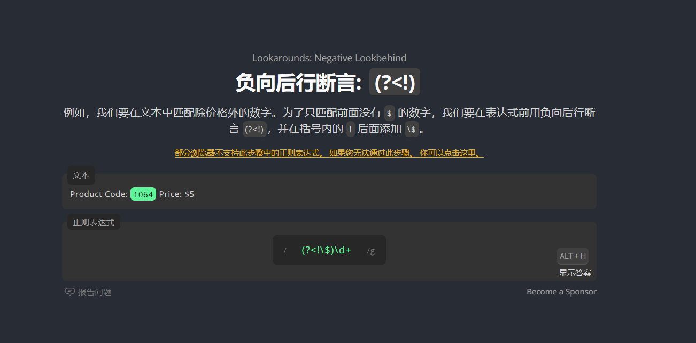

这个正则表达式的意思就是 匹配 一个或者多个数字,这些数字的第一个不能紧挨着$

## 贪婪与非贪婪匹配


**\+ \* 都是贪婪匹配,就是匹配的内容越多越好  而 +?  *? 就不是贪婪匹配,恰恰相反,匹配的内容越少越好**

## 常用正则表达式

### 一、校验数字的表达式

- 数字：**^[0-9]\*$**
- n位的数字：**^\d{n}$**
- 至少n位的数字**：^\d{n,}$**
- m-n位的数字：**^\d{m,n}$**
- 零和非零开头的数字：**^(0|[1-9][0-9]\*)$**
- 非零开头的最多带两位小数的数字：**^([1-9][0-9]\*)+(\.[0-9]{1,2})?$**
- 带1-2位小数的正数或负数：**^(\-)?\d+(\.\d{1,2})$**
- 正数、负数、和小数：**^(\-|\+)?\d+(\.\d+)?$**
- 有两位小数的正实数：**^[0-9]+(\.[0-9]{2})?$**
- 有1~3位小数的正实数：**^[0-9]+(\.[0-9]{1,3})?$**
- 非零的正整数：**^[1-9]\d\*$ 或 ^([1-9][0-9]\*){1,3}$ 或 ^\+?[1-9][0-9]\*$**
- 非零的负整数：**^\-[1-9][]0-9"\*$ 或 ^-[1-9]\d\*$**
- 非负整数：**^\d+$ 或 ^[1-9]\d\*|0$**
- 非正整数：**^-[1-9]\d\*|0$ 或 ^((-\d+)|(0+))$**
- 非负浮点数：**^\d+(\.\d+)?$ 或 ^[1-9]\d\*\.\d\*|0\.\d\*[1-9]\d\*|0?\.0+|0$**
- 非正浮点数：**^((-\d+(\.\d+)?)|(0+(\.0+)?))$ 或 ^(-([1-9]\d\*\.\d\*|0\.\d\*[1-9]\d\*))|0?\.0+|0$**
- 正浮点数：**^[1-9]\d\*\.\d\*|0\.\d\*[1-9]\d\*$ 或 ^(([0-9]+\.[0-9]\*[1-9][0-9]\*)|([0-9]\*[1-9][0-9]\*\.[0-9]+)|([0-9]\*[1-9][0-9]\*))$**
- 负浮点数：**^-([1-9]\d\*\.\d\*|0\.\d\*[1-9]\d\*)$ 或 ^(-(([0-9]+\.[0-9]\*[1-9][0-9]\*)|([0-9]\*[1-9][0-9]\*\.[0-9]+)|([0-9]\*[1-9][0-9]\*)))$**
- 浮点数：**^(-?\d+)(\.\d+)?$ 或 ^-?([1-9]\d\*\.\d\*|0\.\d\*[1-9]\d\*|0?\.0+|0)$**

------

### 二.校验字符的表达式

- 汉字：**^[\u4e00-\u9fa5]{0,}$**
- 英文和数字：**^[A-Za-z0-9]+$ 或 ^[A-Za-z0-9]{4,40}$**
- 长度为3-20的所有字符：**^.{3,20}$**
- 由26个英文字母组成的字符串：**^[A-Za-z]+$**
- 由26个大写英文字母组成的字符串：**^[A-Z]+$**
- 由26个小写英文字母组成的字符串：**^[a-z]+$**
- 由数字和26个英文字母组成的字符串：**^[A-Za-z0-9]+$**
- 由数字、26个英文字母或者下划线组成的字符串：**^\w+$ 或 ^\w{3,20}$**
- 中文、英文、数字包括下划线：**^[\u4E00-\u9FA5A-Za-z0-9_]+$**
- 中文、英文、数字但不包括下划线等符号：**^[\u4E00-\u9FA5A-Za-z0-9]+$ 或 ^[\u4E00-\u9FA5A-Za-z0-9]{2,20}$**
- 可以输入含有^%&',;=?$\"等字符：**[^%&',;=?$\x22]+**
- 禁止输入含有~的字符：**[^~]+**

------

### 三、特殊需求表达式

- Email地址：**^\w+([-+.]\w+)\*@\w+([-.]\w+)\*\.\w+([-.]\w+)\*$**
- 域名：**[a-zA-Z0-9][-a-zA-Z0-9]{0,62}(\.[a-zA-Z0-9][-a-zA-Z0-9]{0,62})+\.?**
- InternetURL：**[a-zA-z]+://[^\s]\* 或 ^http://([\w-]+\.)+[\w-]+(/[\w-./?%&=]\*)?$**
- 手机号码：**^(13[0-9]|14[01456879]|15[0-35-9]|16[2567]|17[0-8]|18[0-9]|19[0-35-9])\d{8}$**
- 电话号码("XXX-XXXXXXX"、"XXXX-XXXXXXXX"、"XXX-XXXXXXX"、"XXX-XXXXXXXX"、"XXXXXXX"和"XXXXXXXX)：**^(\(\d{3,4}-)|\d{3.4}-)?\d{7,8}$**
- 国内电话号码(0511-4405222、021-87888822)：**\d{3}-\d{8}|\d{4}-\d{7}**
- 电话号码正则表达式（支持手机号码，3-4位区号，7-8位直播号码，1－4位分机号）: **((\d{11})|^((\d{7,8})|(\d{4}|\d{3})-(\d{7,8})|(\d{4}|\d{3})-(\d{7,8})-(\d{4}|\d{3}|\d{2}|\d{1})|(\d{7,8})-(\d{4}|\d{3}|\d{2}|\d{1}))$)**
- 身份证号(15位、18位数字)，最后一位是校验位，可能为数字或字符X：**(^\d{15}$)|(^\d{18}$)|(^\d{17}(\d|X|x)$)**
- 帐号是否合法(字母开头，允许5-16字节，允许字母数字下划线)：**^[a-zA-Z][a-zA-Z0-9_]{4,15}$**
- 密码(以字母开头，长度在6~18之间，只能包含字母、数字和下划线)：**^[a-zA-Z]\w{5,17}$**
- 强密码(必须包含大小写字母和数字的组合，不能使用特殊字符，长度在 8-10 之间)：**^(?=.\*\d)(?=.\*[a-z])(?=.\*[A-Z])[a-zA-Z0-9]{8,10}$**
- 强密码(必须包含大小写字母和数字的组合，可以使用特殊字符，长度在8-10之间)：**^(?=.\*\d)(?=.\*[a-z])(?=.\*[A-Z]).{8,10}$**
- 日期格式：**^\d{4}-\d{1,2}-\d{1,2}**
- 一年的12个月(01～09和1～12)：**^(0?[1-9]|1[0-2])$**
- 一个月的31天(01～09和1～31)：**^((0?[1-9])|((1|2)[0-9])|30|31)$**
- 钱的输入格式：
  1. 有四种钱的表示形式我们可以接受:"10000.00" 和 "10,000.00", 和没有 "分" 的 "10000" 和 "10,000"：**^[1-9][0-9]\*$**
  2. 这表示任意一个不以0开头的数字,但是,这也意味着一个字符"0"不通过,所以我们采用下面的形式：**^(0|[1-9][0-9]\*)$**
  3. 一个0或者一个不以0开头的数字.我们还可以允许开头有一个负号：**^(0|-?[1-9][0-9]\*)$**
  4. 这表示一个0或者一个可能为负的开头不为0的数字.让用户以0开头好了.把负号的也去掉,因为钱总不能是负的吧。下面我们要加的是说明可能的小数部分：**^[0-9]+(.[0-9]+)?$**
  5. 必须说明的是,小数点后面至少应该有1位数,所以"10."是不通过的,但是 "10" 和 "10.2" 是通过的：**^[0-9]+(.[0-9]{2})?$**
  6. 这样我们规定小数点后面必须有两位,如果你认为太苛刻了,可以这样：**^[0-9]+(.[0-9]{1,2})?$**
  7. 这样就允许用户只写一位小数.下面我们该考虑数字中的逗号了,我们可以这样：**^[0-9]{1,3}(,[0-9]{3})\*(.[0-9]{1,2})?$**
  8. 1到3个数字,后面跟着任意个 逗号+3个数字,逗号成为可选,而不是必须：**^([0-9]+|[0-9]{1,3}(,[0-9]{3})\*)(.[0-9]{1,2})?$**
  9. 备注：这就是最终结果了,别忘了"+"可以用"*"替代如果你觉得空字符串也可以接受的话(奇怪,为什么?)最后,别忘了在用函数时去掉去掉那个反斜杠,一般的错误都在这里
- xml文件：**^([a-zA-Z]+-?)+[a-zA-Z0-9]+\\.[x|X][m|M][l|L]$**
- 中文字符的正则表达式：**[\u4e00-\u9fa5]**
- 双字节字符：**[^\x00-\xff] (包括汉字在内，可以用来计算字符串的长度(一个双字节字符长度计2，ASCII字符计1))**
- 空白行的正则表达式：**\n\s\*\r (可以用来删除空白行)**
- HTML标记的正则表达式：**<(\S\*?)[^>]\*>.\*?|<.\*? /> ( 首尾空白字符的正则表达式：^\s\*|\s\*$或(^\s\*)|(\s\*$) (可以用来删除行首行尾的空白字符(包括空格、制表符、换页符等等)，非常有用的表达式)**
- 腾讯QQ号：**[1-9][0-9]{4,} (腾讯QQ号从10000开始)**
- 中国邮政编码：**[1-9]\d{5}(?!\d) (中国邮政编码为6位数字)**
- IPv4地址：**((2(5[0-5]|[0-4]\d))|[0-1]?\d{1,2})(\.((2(5[0-5]|[0-4]\d))|[0-1]?\d{1,2})){3}**


## 更详细的元字符表(来自菜鸟教程)

| 字符         | 描述                                                         |
| :----------- | :----------------------------------------------------------- |
| \            | 将下一个字符标记为一个特殊字符、或一个原义字符、或一个 向后引用、或一个八进制转义符。例如，'n' 匹配字符 "n"。'\n' 匹配一个换行符。序列 '\\' 匹配 "\" 而 "\(" 则匹配 "("。 |
| ^            | 匹配输入字符串的开始位置。如果设置了 RegExp 对象的 Multiline 属性，^ 也匹配 '\n' 或 '\r' 之后的位置。 |
| $            | 匹配输入字符串的结束位置。如果设置了RegExp 对象的 Multiline 属性，$ 也匹配 '\n' 或 '\r' 之前的位置。 |
| *            | 匹配前面的子表达式零次或多次。例如，zo* 能匹配 "z" 以及 "zoo"。* 等价于{0,}。 |
| +            | 匹配前面的子表达式一次或多次。例如，'zo+' 能匹配 "zo" 以及 "zoo"，但不能匹配 "z"。+ 等价于 {1,}。 |
| ?            | 匹配前面的子表达式零次或一次。例如，"do(es)?" 可以匹配 "do" 或 "does" 。? 等价于 {0,1}。 |
| {n}          | n 是一个非负整数。匹配确定的 n 次。例如，'o{2}' 不能匹配 "Bob" 中的 'o'，但是能匹配 "food" 中的两个 o。 |
| {n,}         | n 是一个非负整数。至少匹配n 次。例如，'o{2,}' 不能匹配 "Bob" 中的 'o'，但能匹配 "foooood" 中的所有 o。'o{1,}' 等价于 'o+'。'o{0,}' 则等价于 'o*'。 |
| {n,m}        | m 和 n 均为非负整数，其中n <= m。最少匹配 n 次且最多匹配 m 次。例如，"o{1,3}" 将匹配 "fooooood" 中的前三个 o。'o{0,1}' 等价于 'o?'。请注意在逗号和两个数之间不能有空格。 |
| ?            | 当该字符紧跟在任何一个其他限制符 (*, +, ?, {n}, {n,}, {n,m}) 后面时，匹配模式是非贪婪的。非贪婪模式尽可能少的匹配所搜索的字符串，而默认的贪婪模式则尽可能多的匹配所搜索的字符串。例如，对于字符串 "oooo"，'o+?' 将匹配单个 "o"，而 'o+' 将匹配所有 'o'。 |
| .            | 匹配除换行符（\n、\r）之外的任何单个字符。要匹配包括 '\n' 在内的任何字符，请使用像"**(.\|\n)**"的模式。 |
| (pattern)    | 匹配 pattern 并获取这一匹配。所获取的匹配可以从产生的 Matches 集合得到，在VBScript 中使用 SubMatches 集合，在JScript 中则使用 $0…$9 属性。要匹配圆括号字符，请使用 '\(' 或 '\)'。 |
| (?:pattern)  | 匹配 pattern 但不获取匹配结果，也就是说这是一个非获取匹配，不进行存储供以后使用。这在使用 "或" 字符 (\|) 来组合一个模式的各个部分是很有用。例如， 'industr(?:y\|ies) 就是一个比 'industry\|industries' 更简略的表达式。 |
| (?=pattern)  | 正向肯定预查（look ahead positive assert），在任何匹配pattern的字符串开始处匹配查找字符串。这是一个非获取匹配，也就是说，该匹配不需要获取供以后使用。例如，"Windows(?=95\|98\|NT\|2000)"能匹配"Windows2000"中的"Windows"，但不能匹配"Windows3.1"中的"Windows"。预查不消耗字符，也就是说，在一个匹配发生后，在最后一次匹配之后立即开始下一次匹配的搜索，而不是从包含预查的字符之后开始。 |
| (?!pattern)  | 正向否定预查(negative assert)，在任何不匹配pattern的字符串开始处匹配查找字符串。这是一个非获取匹配，也就是说，该匹配不需要获取供以后使用。例如"Windows(?!95\|98\|NT\|2000)"能匹配"Windows3.1"中的"Windows"，但不能匹配"Windows2000"中的"Windows"。预查不消耗字符，也就是说，在一个匹配发生后，在最后一次匹配之后立即开始下一次匹配的搜索，而不是从包含预查的字符之后开始。 |
| (?<=pattern) | 反向(look behind)肯定预查，与正向肯定预查类似，只是方向相反。例如，"`(?<=95|98|NT|2000)Windows`"能匹配"`2000Windows`"中的"`Windows`"，但不能匹配"`3.1Windows`"中的"`Windows`"。 |
| (?<!pattern) | 反向否定预查，与正向否定预查类似，只是方向相反。例如"`(?<!95|98|NT|2000)Windows`"能匹配"`3.1Windows`"中的"`Windows`"，但不能匹配"`2000Windows`"中的"`Windows`"。 |
| x\|y         | 匹配 x 或 y。例如，'z\|food' 能匹配 "z" 或 "food"。'(z\|f)ood' 则匹配 "zood" 或 "food"。 |
| [xyz]        | 字符集合。匹配所包含的任意一个字符。例如， '[abc]' 可以匹配 "plain" 中的 'a'。 |
| [^xyz]       | 负值字符集合。匹配未包含的任意字符。例如， '[^abc]' 可以匹配 "plain" 中的'p'、'l'、'i'、'n'。 |
| [a-z]        | 字符范围。匹配指定范围内的任意字符。例如，'[a-z]' 可以匹配 'a' 到 'z' 范围内的任意小写字母字符。 |
| [^a-z]       | 负值字符范围。匹配任何不在指定范围内的任意字符。例如，'[^a-z]' 可以匹配任何不在 'a' 到 'z' 范围内的任意字符。 |
| \b           | 匹配一个单词边界，也就是指单词和空格间的位置。例如， 'er\b' 可以匹配"never" 中的 'er'，但不能匹配 "verb" 中的 'er'。 |
| \B           | 匹配非单词边界。'er\B' 能匹配 "verb" 中的 'er'，但不能匹配 "never" 中的 'er'。 |
| \cx          | 匹配由 x 指明的控制字符。例如， \cM 匹配一个 Control-M 或回车符。x 的值必须为 A-Z 或 a-z 之一。否则，将 c 视为一个原义的 'c' 字符。 |
| \d           | 匹配一个数字字符。等价于 [0-9]。                             |
| \D           | 匹配一个非数字字符。等价于 [^0-9]。                          |
| \f           | 匹配一个换页符。等价于 \x0c 和 \cL。                         |
| \n           | 匹配一个换行符。等价于 \x0a 和 \cJ。                         |
| \r           | 匹配一个回车符。等价于 \x0d 和 \cM。                         |
| \s           | 匹配任何空白字符，包括空格、制表符、换页符等等。等价于 [ \f\n\r\t\v]。 |
| \S           | 匹配任何非空白字符。等价于 [^ \f\n\r\t\v]。                  |
| \t           | 匹配一个制表符。等价于 \x09 和 \cI。                         |
| \v           | 匹配一个垂直制表符。等价于 \x0b 和 \cK。                     |
| \w           | 匹配字母、数字、下划线。等价于'[A-Za-z0-9_]'。               |
| \W           | 匹配非字母、数字、下划线。等价于 '[^A-Za-z0-9_]'。           |
| \xn          | 匹配 n，其中 n 为十六进制转义值。十六进制转义值必须为确定的两个数字长。例如，'\x41' 匹配 "A"。'\x041' 则等价于 '\x04' & "1"。正则表达式中可以使用 ASCII 编码。 |
| \num         | 匹配 num，其中 num 是一个正整数。对所获取的匹配的引用。例如，'(.)\1' 匹配两个连续的相同字符。 |
| \n           | 标识一个八进制转义值或一个向后引用。如果 \n 之前至少 n 个获取的子表达式，则 n 为向后引用。否则，如果 n 为八进制数字 (0-7)，则 n 为一个八进制转义值。 |
| \nm          | 标识一个八进制转义值或一个向后引用。如果 \nm 之前至少有 nm 个获得子表达式，则 nm 为向后引用。如果 \nm 之前至少有 n 个获取，则 n 为一个后跟文字 m 的向后引用。如果前面的条件都不满足，若 n 和 m 均为八进制数字 (0-7)，则 \nm 将匹配八进制转义值 nm。 |
| \nml         | 如果 n 为八进制数字 (0-3)，且 m 和 l 均为八进制数字 (0-7)，则匹配八进制转义值 nml。 |
| \un          | 匹配 n，其中 n 是一个用四个十六进制数字表示的 Unicode 字符。例如， \u00A9 匹配版权符号 (?)。 |