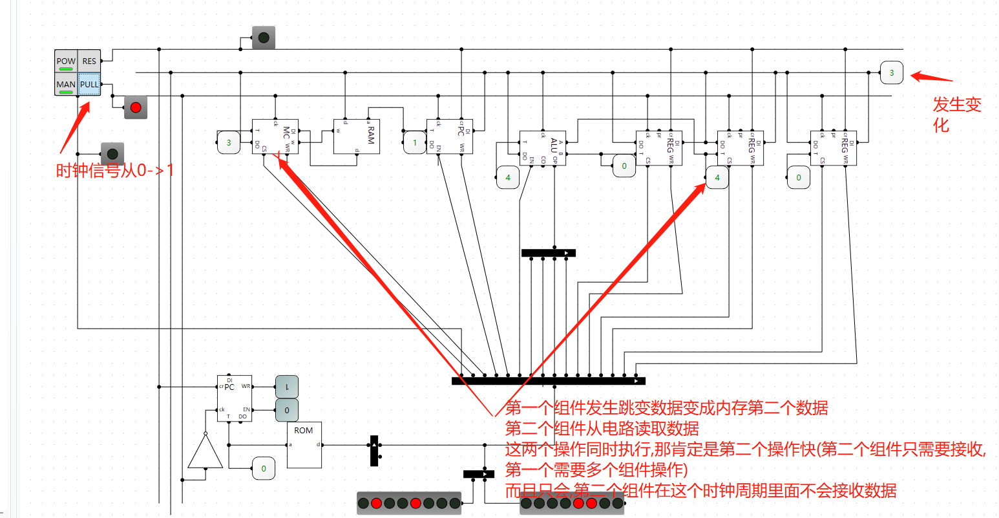

## 前言

我感觉做CPU对于电子专业的人来说应该是容易事,我一个计算机专业的,感觉有点小吃力,但是我还是决定把它啃完

本次采用LogicCircuit仿真软件

## 半加器

SUM = A^B  CO = A&B


## 全加器

全加器有三个输入位,一个是上一位加法的进位


## 八位加法器


## 8位选择器


两个输入中选一个输出

## 8位取反器


## 8为与门


## 8位或门


## AU

AU模块包含了加法和减法

当OP为0时做加法

当OP为1时做减法


控制端为0 表示 A+B 控制端为1表示 A-B 

## LU


控制端为0 表示 A&B 控制端为1表示 A | B 

## ALU


真值表

| 控制端 | 输出 |
| :----: | :--: |
|  xx00  | A+B  |
|  xx01  | A-B  |
|  xx10  | A&B  |
|  xx11  | A\|B |

## 单数码管(2进制变16进制)

通过4位地址控制ROM输出8位控制数据,让数码管显示一位16进制数据,控制线en控制是否显示


## 双数码管(2进制变16进制)

这里面的数码管是上面的单数码管,前四位控制第一个16进制数据,后四位控制第二个16进制数据


## 三数码管(2进制变10进制)


通过ROM将八位二进制数据对应的十进制的分成三个四位bcd码,然后依次交给单个数码管

ROM里面的数据经过精心处理的


这个数据的生成代码

```java
public class test {
    public static void main(String[] args) throws IOException {
        FileOutputStream fileOutputStream = new FileOutputStream("C:\\Users\\asus\\Desktop\\a");
        for(short i=0;i<256;i++){

            byte[] array = ByteBuffer.allocate(2).order(ByteOrder.LITTLE_ENDIAN).putShort(Short.valueOf(i+"",16)).array();
            System.out.println(Arrays.toString(array)+"  ----  "+array.length);
            fileOutputStream.write(array);
        }
        fileOutputStream.close();
    }
}

```


## 震荡电路


当我们运行打开开关之后


## R-S触发器

这个触发器可以一直所存一位数据


这个电路有缺点,输出是随机的,你可以自己去分析一下,因此我们需要置零和预设


这个电路还有有缺陷,因为我们必须保证R 和 S 不同时为1,你想啊,你同时set跟ReSet,是不是就不太对,所以有了下面的电路

## D触发器


这样我们可以在EN为1的情况下通过D数据端设置输出

## D边缘触发器

我们只有在低电平变成高电平才能设置数据


## T触发器

这个其实也是反转器,当时钟从低电平到高电平,内部状态会反转一次,要么0->1要么1->0


## 计数器

我们将多个T触发器相连,就构成了计数器

> 通过看电路图我们可以分析到,前一个T触发器从低电平到高电平跳变两次,后一个才会跳变一次,这不就是天然的二进制么


## 三态门(可以控制八位数据的输出)


## 字节存储器


这个可以存储八个字节的数据

## 寄存器

寄存器相对于上面这个字节存储器多了一个读写线


## 38译码器

真值表

| A2   | A1   | A0   | 0    | 1    | 2    | 3    | 4    | 5    | 6    | 7    |
| ---- | ---- | ---- | ---- | ---- | ---- | ---- | ---- | ---- | ---- | ---- |
| 0    | 0    | 0    | 1    |      |      |      |      |      |      |      |
| 0    | 0    | 1    |      | 1    |      |      |      |      |      |      |
| 0    | 1    | 0    |      |      | 1    |      |      |      |      |      |
| 0    | 1    | 1    |      |      |      | 1    |      |      |      |      |
| 1    | 0    | 0    |      |      |      |      | 1    |      |      |      |
| 1    | 0    | 1    |      |      |      |      |      | 1    |      |      |
| 1    | 1    | 0    |      |      |      |      |      |      | 1    |      |
| 1    | 1    | 1    |      |      |      |      |      |      |      | 1    |


> 这里其实用ROM来做更快

## 寄存器组


## 存储器扩展

位扩展: 就是存储单元数量不变,存储单元变大,这个样的话地址线不用变,数据线需要变多

字扩展: 就是存储单元数量变多,存储单元大小不变,这样的话地址线需要扩充,数据线不用变

8x1 就代表 有8个存储单元,每个存储单元能存8比特(1字节)  => 我们可以得出 地址线为3根 数据线为8根

8x2 就代表 有8个存储单元,每个存储单元能存16比特(2字节)  => 我们可以得出 地址线为3根 数据线为16根

16x2 就代表 有16个存储单元,每个存储单元能存16比特  => 我们可以得出 地址线为4根 数据线为8根

## 特殊开关

这个开关可以用来控制ALU加法,可以自动加法,也可以手动调试加法

解释一下吧,POW相当于电源,RES 是清零按钮(负责清楚寄存器和计数器的值),MAN 是开启手工调试按钮,PULL 是手动产生时钟变化按钮,p是输入位,用于停止产生时钟

如果POW没有被开启,那么reset会一直生效,这样的话寄存器和计数器肯定被清零,


## 自动加法


## 程序计数器


## 解答疑惑

自我提问:  为什么寄存器要设置成只有时钟信号从0变成1并且允许写入数据时才能接受数据,而不是直接设置成只要允许写入数据的时候就可以接受数据了呢?

解答:    如果只片面的看待寄存器,那么它确实只需要一个控制端就行而不需要时钟, 但是我们需要站在全局的角度来看, 首先要计算机能够自动化,必须要有时钟,也就是震荡器,然后配合计数器,这样它能够推动指令一条一条执行,通过了解计数器我们知道,指令会持续一整个时钟周期,也就是从0->1->0,就像下面这个红色范围内的黑色线一样

   

如果我们的寄存器只需要允许写入数据就行的话,那么当我们的指令是从某种提供了数据之后就会立即变化的组件中拿数据到寄存器中的时候就会出现问题,持续0时间段数据就已经拿到寄存器了**,0->1 后**提供数据的组件提供数据发生变化(0->1 跳变或者 1->0 跳变 是很多自动化的组件的执行时机,因此数据很有可能就会变化),你别忘了,指令是一整个周期有效,那么持续1的时间,就会把新的数据拿到寄存器中,这样是不是出现了问题,如果我们把寄存器设置成只有从**0->1跳变的时候**才会接收数据,那么就不会出现这个问题

在逻辑电路中,我们确实只需要一个控制端,但是在时序电路中,这是不行的,必须要一个时钟 控制信号

我们可以用一个从内存中取数据做减法的电路图证明

内存数据


**不需要时钟线的寄存器电路**


**带有时钟线的寄存器电路**



