# 一个解决方案对应多个项目

在vs2019中 解决方案是一个容器,它可以包含多个项目

## 创建一个空白解决方案

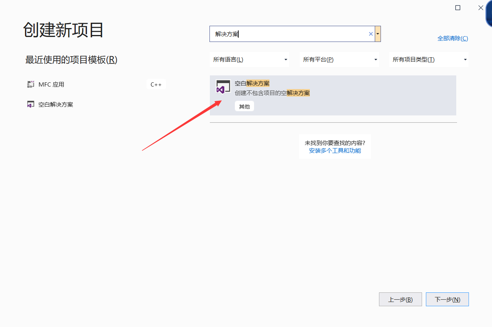

## 创建项目

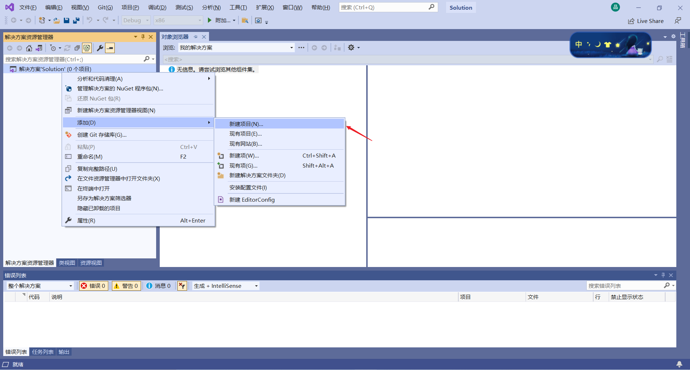

这样我们就可以把多个项目在vs2019中打开了

# 项目调用

有时候我们希望一个项目能够调用另外一个项目,我们可以这样

现在有两个项目, 一个Dao,一个Service,  其中Service需要通过Dao项目访问数据库

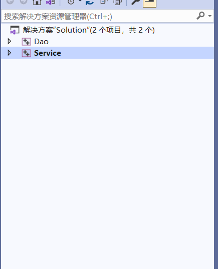

## 将Dao项目输出为lib

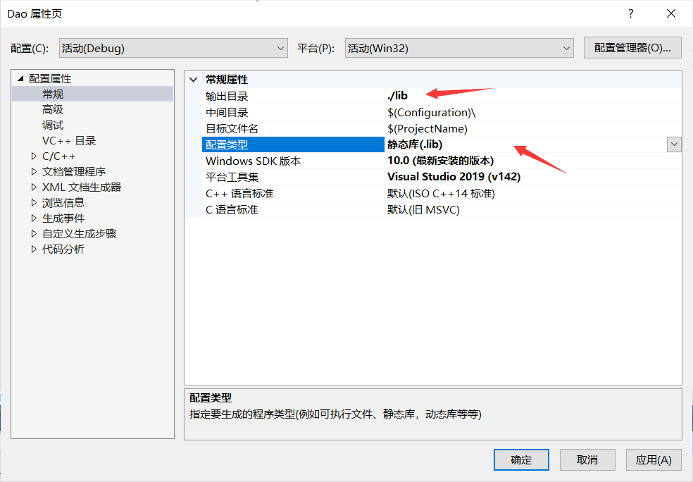

## 在Service项目中引入

### 指定头文件

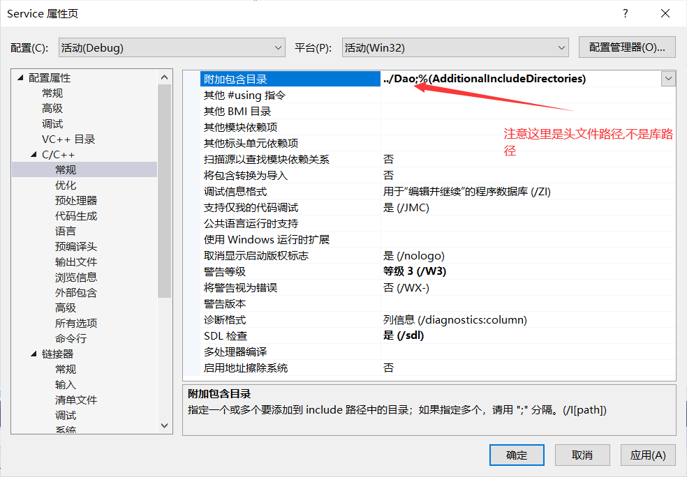

### 指定库地址

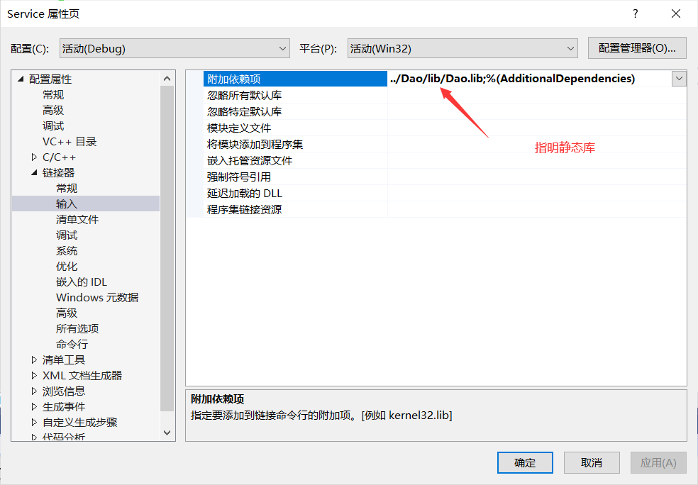

## 定义项目依赖

这一步不是必须的,  你可以手动将Dao项目生成为lib,  这里是自动生成lib

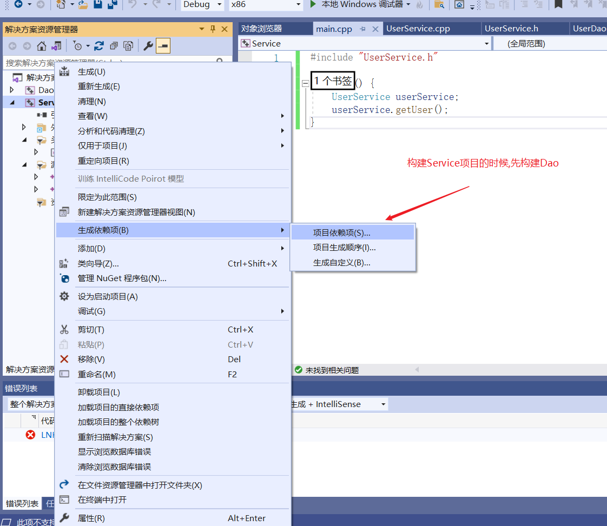

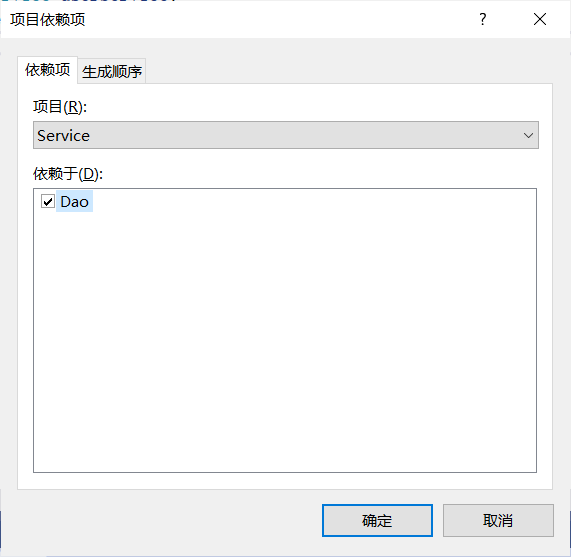

**如果我们没有修改Dao里面的代码,  是不会重新对Dao进行构建的, 这一点很重要**


# 动态链接库DLL生成

## 方式一 使用 __declspec(dllexport) 创建dll

Math.h

```c
#pragma once


#ifdef MATHLIBRARY_EXPORTS
#define MATHLIBRARY_API __declspec(dllexport) 
#else
#define MATHLIBRARY_API __declspec(dllimport) 
#endif

// 为了确保使用c++编译器的时候能够正确被连接
#ifdef _cplusplus
extern "C" {
#endif

MATHLIBRARY_API int add(int, int);
extern MATHLIBRARY_API int sum;

 class MATHLIBRARY_API Math {   // 注意 MATHLIBRARY_API 一定要在class右侧
public:
	int sub(int, int);
};

#ifdef _cplusplus
}
#endif
```

这里的MATHLIBRARY_API其实做两个用处的,  如果是生成dll的话,  那就是导出,  否则就是是引入dll

> 注意这里也可以导出变量和类

Math.cpp

```c

//#define MATHLIBRARY_EXPORTS
#include "Math.h"

 int sum = 0;

 int add(int a, int b) {
	sum += a + b;
	return (a + b);
}

int Math::sub(int a, int b)
{
	return a-b;
}

```

然后添加一个宏, 当然, 这里我们也可以直接在代码上面写, 比如上面注释掉那部分

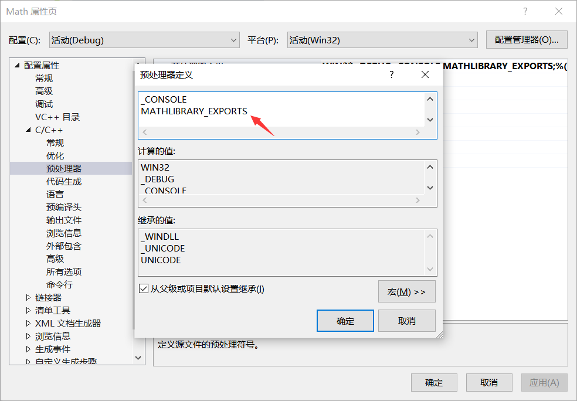

修改程序输出为dll

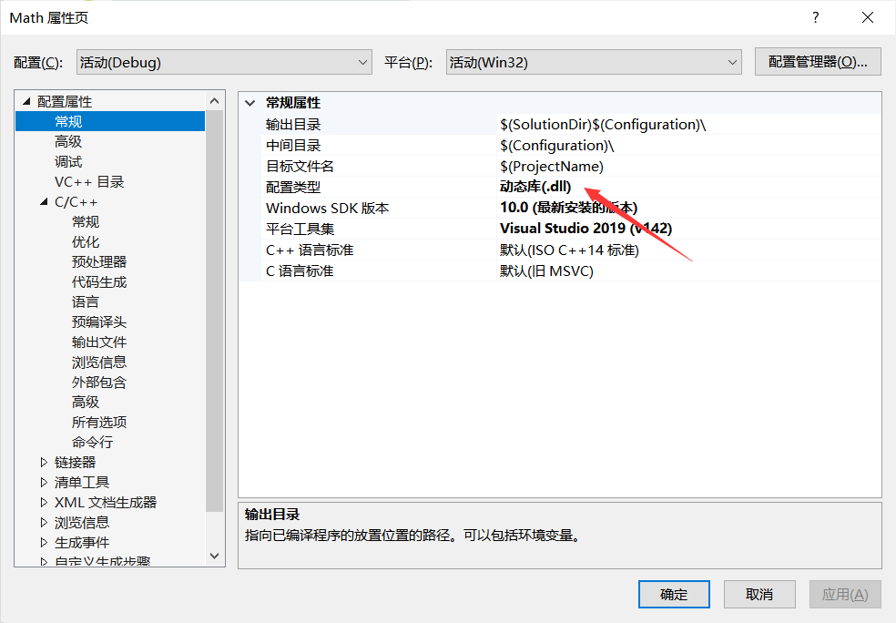

然后生成, 生成东西如下

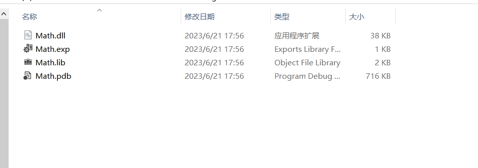

1. `.dll` 文件：这是动态链接库（DLL）文件本身。这是一个二进制文件，它包含了你的代码编译后的机器代码以及其他一些信息，例如资源（如图标、图片、对话框等）、元数据（例如导出的函数和类、导入的函数和类等）等。你的程序在运行时可以加载这个DLL，并使用其中的函数和类。
2. `.exp` 文件：这是导出文件（export file）。它包含了你的DLL导出的函数和数据的信息。当链接器生成DLL时，它会首先生成一个.exp文件，然后再生成DLL和.lib文件。.exp文件通常不需要分发，它主要是在构建过程中使用。
3. `.lib` 文件：这是导入库（import library）。**当你的程序在编译时链接到这个DLL时**，链接器会使用这个.lib文件来找到DLL中的函数和类。.lib文件包含了DLL中导出的函数和类的名称以及它们在DLL中的位置。你可以把.lib文件看作是一个索引，链接器可以用它来在DLL中找到函数和类。
4. `.pdb` 文件：这是程序数据库（program database）文件。它包含了调试信息，例如源文件的位置、变量的名称、函数的堆栈信息等。当你在Visual Studio中调试你的程序时，调试器会使用.pdb文件来找到源代码的位置，并显示变量的值、函数的调用堆栈等信息。.pdb文件通常不需要分发，除非你想让其他人能够调试你的DLL。

以上就是这四种文件类型的基本解释。需要注意的是，通常你只需要分发 `.dll` 和 `.lib` 文件，其他的 `.exp` 和 `.pdb` 文件主要是在构建和调试过程中使用。

## 方式二  模块定义文件

`.def`文件被称为模块定义文件（Module-Definition File）。这种文件类型是微软Visual Studio的一部分，主要用于为Windows的动态链接库（DLLs）和可执行文件（EXEs）提供信息。

模块定义文件可以包含很多种信息，例如DLL的描述、DLL数据的段名称和特性、函数导出等等。这些信息可以影响到链接器如何处理DLL或可执行文件。

比如，你可以通过模块定义文件来导出DLL中的符号。在`.def`文件中，可以使用`EXPORTS`关键字列出你希望导出的所有符号。这可以作为`__declspec(dllexport)`的替代方法来导出符号。

模块定义文件虽然在一些场合下仍然有用，但是现代的C++代码通常会选择使用`__declspec(dllexport)`和`__declspec(dllimport)`来控制符号的导出和导入，因为这种方式更加直观和灵活。

在Windows环境下创建一个模块定义文件的模板可以是如下的形式：

```text
LIBRARY "libraryname" 
EXPORTS 
    function1 @1 
    function2 @2 
    function3 @3 
    ...
```

在这个模板中:

- `LIBRARY "libraryname"` 是声明此模块定义文件对应的库的名字，`"libraryname"`需要替换成你的实际库名。

- `EXPORTS` 是导出函数的声明。在这之后，你需要列出你想要从 DLL 中导出的所有函数。每一个函数后面的 @ 符号和数字是可选的，用于指定函数在导出表中的索引。

请注意，模块定义文件的内容会根据实际需求变化，上述仅仅是一个基本的模板。你可能需要根据你的实际需求对其进行修改。

**现在我们通常使用第一种方式**

## 注意点

在Windows中，如果你的函数或者变量没有使用`__declspec(dllexport)`进行显式导出，它们仍然会被编译并打包到DLL中，但是它们不会被DLL的导出表所列出。这意味着，尽管这些函数和变量存在于DLL中，但是在DLL的外部是无法直接访问到它们的。

实际上，一个DLL文件可以被看作是一个包含了一组函数和数据的容器。当你创建一个DLL时，所有的源代码都会被编译，并且所有的函数和数据都会被包含在DLL中。然后，通过使用`__declspec(dllexport)`关键字，你可以选择哪些函数和数据应该被添加到DLL的导出表中，也就是哪些函数和数据可以被DLL的用户访问。

因此，如果你没有使用`__declspec(dllexport)`导出任何函数或数据，那么你的DLL将不会对外部公开任何接口。然而，DLL中的所有代码仍然存在，并且可以在DLL内部被其他函数和数据访问。

另外，如果你希望在DLL中隐藏某些函数或数据，你也可以使用`__declspec(dllexport)`关键字的对立面，即`__declspec(dllimport)`。这个关键字可以阻止函数或数据被导出，即使它们在源代码中被定义了出来。


**如果一个DLL没有暴露任何函数或数据（**即没有使用`__declspec(dllexport)`关键字导出任何接口），那么它在DLL的外部将几乎无法使用。

当你创建一个DLL时，目的通常是为了提供一些函数或数据给其他的应用程序或者DLL来使用。这些函数和数据被称为DLL的“导出符号”。如果一个DLL没有导出任何符号，那么其他的应用程序或者DLL就无法直接访问到DLL中的任何代码。

然而，**即使一个DLL没有导出任何符号，也不意味着它是完全无用的。DLL中的代码仍然可以执行**，如果DLL被设计为在加载时执行某些操作（例如，初始化静态数据或执行其他一些代码），那么这些操作仍然会在DLL被加载时执行。但是，这种情况相对罕见，并且通常只用于特殊的情况。

通常情况下，如果你创建一个DLL，你应该至少导出一个函数或数据供其他代码使用。否则，创建DLL的意义就不大了。