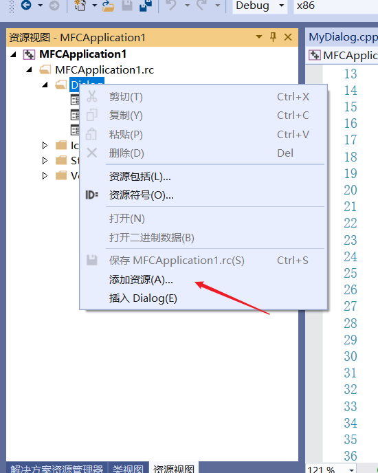
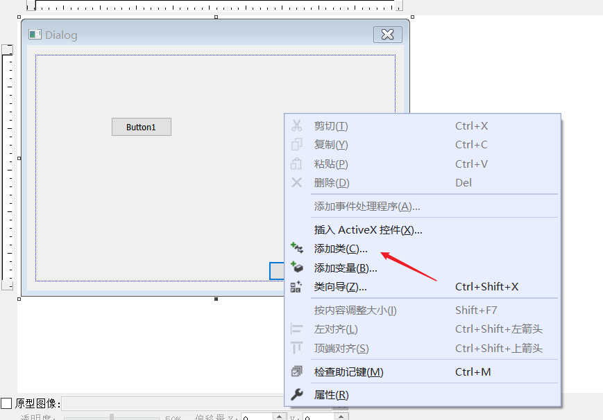

# 创建对话框

如果要自定义对话框的话,那肯定少不了这个创建步骤,除非你自己手动把控件放上去

找到资源视图,然后添加一个对话框资源



然后添加一个对应的类




# 通过资源id拿到资源对象

在MFC (Microsoft Foundation Classes) 中，如果你有一个资源ID，你可以使用几种不同的方式来获取到这个资源对象。下面是一些常见的方法。

**1. 对于字符串资源：**
你可以使用 `CString::LoadString` 方法来加载一个字符串资源。

```cpp
CString str;
str.LoadString(IDS_MY_STRING);
```

在这个例子中， `IDS_MY_STRING` 是字符串资源的ID。

**2. 对于位图资源：**
你可以使用 `CBitmap::LoadBitmap` 方法来加载一个位图资源。

```cpp
CBitmap bitmap;
bitmap.LoadBitmap(IDB_MY_BITMAP);
```

在这个例子中， `IDB_MY_BITMAP` 是位图资源的ID。

**3. 对于图标资源：**
你可以使用 `CWnd::LoadIcon` 方法来加载一个图标资源。

```cpp
HICON hIcon = AfxGetApp()->LoadIcon(IDI_MY_ICON);
```

在这个例子中， `IDI_MY_ICON` 是图标资源的ID。

**4. 对于对话框资源：**
如果你想通过资源ID获取对话框对象，你可以在构造对话框对象时传入对话框资源ID。然后，当你调用 `DoModal` 或 `Create` 方法时，MFC会自动为你加载和创建对话框。

```cpp
CMyDialog dlg(IDD_MY_DIALOG);
dlg.DoModal();
```

在这个例子中， `IDD_MY_DIALOG` 是对话框资源的ID。

需要注意的是，上述的资源ID都是在资源文件(.rc)中定义的。


# 通过id拿到控件

以对话框举例, 对于在对话框中的控件，例如按钮、编辑框、列表框等，你可以在对话框的类中使用 `CWnd::GetDlgItem` 函数通过资源ID获取到这些控件的指针。

以下是一些例子：

**1. 获取按钮控件：**

```cpp
CButton* pButton = (CButton*)GetDlgItem(IDC_MY_BUTTON);
```

在这个例子中，`IDC_MY_BUTTON` 是按钮控件的ID。

**2. 获取编辑框控件：**

```cpp
CEdit* pEdit = (CEdit*)GetDlgItem(IDC_MY_EDIT);
```

在这个例子中，`IDC_MY_EDIT` 是编辑框控件的ID。

**3. 获取列表框控件：**

```cpp
CListBox* pListBox = (CListBox*)GetDlgItem(IDC_MY_LISTBOX);
```

在这个例子中，`IDC_MY_LISTBOX` 是列表框控件的ID。

请注意，使用 `GetDlgItem` 函数获取到的控件指针，不需要删除。当对话框被销毁时，这些控件也会被自动销毁。

另外，MFC也提供了 `DDX_Control` 函数，可以在对话框初始化时将控件与对话框类中的成员变量关联起来。这种方式通常更方便，因为你不需要每次都通过资源ID去获取控件。这种方式需要在对话框类的 `DoDataExchange` 函数中使用 `DDX_Control` 函数。

例如：

```cpp
void CMyDialog::DoDataExchange(CDataExchange* pDX)
{
    CDialogEx::DoDataExchange(pDX);
    DDX_Control(pDX, IDC_MY_BUTTON, m_myButton);
}
```

在这个例子中，`m_myButton` 是 `CButton` 类型的成员变量，`IDC_MY_BUTTON` 是按钮控件的ID。通过 `DDX_Control` 函数，`m_myButton` 与按钮控件关联起来，之后你就可以直接通过 `m_myButton` 来访问和操作按钮控件。

**总的来说，资源ID是在特定的对话框或窗口上下文中用于识别和处理控件的一种机制。**


# 命令和消息

在MFC中，命令和消息都是基于Windows消息机制的两种不同概念。

**消息（Message）：**
在Windows编程中，消息是程序的主要工作方式，例如窗口创建，窗口关闭，鼠标移动，键盘按键等事件都会产生消息。每个消息都有一个特定的消息代码来表明消息的类型，例如`WM_PAINT`，`WM_SIZE`，`WM_MOUSEMOVE`等。消息通过系统的消息队列发送，然后被应用程序的消息循环接收并处理。

在MFC中，消息被封装成了一个更高级的概念。你可以为窗口或对话框类创建消息处理函数，当特定的消息到达时，这些函数将被调用。例如，当窗口需要重绘时，MFC会自动调用窗口类的`OnPaint`函数。

**命令（Command）：**
**命令是消息的一种特殊形式**，主要用于处理用户的菜单选择，工具栏按钮点击，或某些控件（如按钮）的点击事件。命令与特定的ID关联，这些ID通常在头文件中以常量形式定义，如`ID_FILE_OPEN`，`ID_EDIT_COPY`等。当用户选择一个菜单项或点击一个按钮时，MFC会发送一个`WM_COMMAND`消息，并将对应的命令ID作为该消息的参数。

在MFC中，你可以创建命令处理函数来处理这些命令。当特定的命令被触发时，对应的命令处理函数将被调用。与消息处理函数类似，命令处理函数通常也在窗口或对话框类中实现。不过，MFC还提供了一种特殊的机制来处理命令，这就是命令路由。当一个命令被触发时，MFC会沿着一个特定的路径（或称为路由）来寻找相应的命令处理函数，这个路径通常是从活动视图开始，然后到框架窗口，最后到应用程序对象。

总的来说，命令和消息都是MFC中的核心概念，它们都是基于Windows的消息机制。通过理解和利用这两种概念，你可以更有效地处理用户输入和程序事件。

# 模态和非模态对话框

在MFC中，你可以根据需要将对话框作为模态对话框或非模态对话框显示。模态对话框和非模态对话框的主要区别在于用户与对话框的交互方式。模态对话框在显示时会阻止用户与其他窗口交互，直到对话框关闭。非模态对话框则不会阻止用户与其他窗口交互。

要显示一个模态对话框，你可以创建一个对话框对象（通常在栈上创建），然后调用它的`DoModal`方法。`DoModal`方法会显示对话框，并进入一个消息循环，直到对话框关闭。下面是一个例子：

```cpp
void ShowMyModalDialog()
{
    CMyDialog dlg;  // CMyDialog 是你的对话框类
    dlg.DoModal();
}
```

要显示一个非模态对话框，你可以创建一个对话框对象（通常在堆上创建或作为其他对象的成员变量），然后调用它的`Create`方法。`Create`方法会创建对话框窗口，但不会进入消息循环。你需要自己处理消息循环（通常在主消息循环中处理）。下面是一个例子：

```cpp
void ShowMyModelessDialog()
{
    CMyDialog* dlg = new CMyDialog;  // CMyDialog 是你的对话框类
    dlg->Create(CMyDialog::IDD);  // 使用对话框的资源ID创建窗口
    dlg->ShowWindow(SW_SHOW);
}
```

注意，当你不再需要非模态对话框时，你需要销毁对话框窗口并删除对话框对象，以避免内存泄漏。你可以在对话框的`PostNcDestroy`方法中删除对象，或者在其他合适的地方删除对象。

总的来说，模态对话框适合需要用户立即响应的情况，而非模态对话框适合用户可能需要与其他窗口交互的情况。