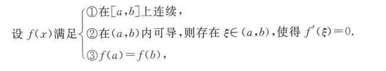

# 前言

# 预备知识

## 函数

设 $x$ 与 $y$ 是两个变量, $D$ 是一个给定的数集, 若对于每一个 $x \in D$, 按照一定的法则 $f$, **有一个确定的 值 $y$ 与之对应**, 则称 $y$ 为 $x$ 的函数, 记作 $y=f(x)$. 称 $x$ 为自变量, $y$ 为因变量. **称数集 $D$ 为此函数的定义域**,定义域一般由实际背景中变量的具体意义或者函数对应法则的要求确定.

## 反函数

原先是  $y=f(x)$  自变量是 x 因变量是 y  现在要反过来   变成了  $x=f^{-1}(y)$  然后再交换一下 x y的位置 就变了$y=f^{-1}(x)$  

**注意点:**

* 单调函数必有反函数   因为单调函数 x和 y有一一对应关系,  无论是原函数还是反函数, 最终都是一一对应关系
* **有反函数的不一定是单调函数**   比如分段函数
* 反函数和原函数 关于 y=x对称,  本身就是交换了x和y 字母
* **求反函数的时候, 一定要记得把y的值域当成反函数的定义域**

## 复合函数

复合函数是将一个函数的输出作为另一个函数的输入的结果  比如:
$$
y=f[g(x)](x \in D)
$$
这个时候, 我们就需要去层层展开

1. 将g(x)代替f(x)中的x变量,此时 g(x) 值的范围 属于 f(x) 的定义域范围
2. 将g(x)在f(x)中的定义域展开到x在g(x)中的定义域,  然后将x定义域中的g(x)的函数表达形式  展开到 f(x)函数表达形式
3. 简化

例子
$$
\text { 设 } f(x)=\left\{\begin{array}{ll}
\ln \sqrt{x}, & x \geqslant 1, \\
2 x-1, & x<1 .
\end{array} \text { 求 } f[f(x)]\right. \text {. }
$$
解答步骤, 
$$
\text { 第 } 1 \text { 步, 广义化: } f[f(x)]= \begin{cases}\ln \sqrt{f(x)}, & f(x) \geqslant 1, \\ 2 f(x)-1, & f(x)<1 .\end{cases}
$$
**查看 f(x) >= 1 时 x的作用域  和  f(x) < 1时 x的作用域 对应的 f(x)表达式  然后再替换到 f(f(x))**
$$
f[f(x)]=\left\{\begin{array}{ll}
\ln \sqrt{\ln \sqrt{x}}, & x \geqslant \mathrm{e}^2, \\
2 \ln \sqrt{x}-1, & 1 \leqslant x<\mathrm{e}^2, \\
2(2 x-1)-1, & x<1
\end{array}= \begin{cases}\frac{1}{2} \ln (\ln \sqrt{x}), & x \geqslant \mathrm{e}^2, \\
\ln x-1, & 1 \leqslant x<\mathrm{e}^2, \\
4 x-3, & x<1 .\end{cases}\right.
$$

## 函数的四种特性

### 有界性

设 $f(x)$ 的定义域为 $D$, 数集 $I \subset D$. **如果存在某个正数 $M$, 使对任一 $x \in I$, 有 $|f(x)| \leqslant$ $M$, 则称 $f(x)$ 在 $I$ 上有界**; 如果这样的 $M$ 不存在, 则称 $f(x)$ 在 $I$ 上无界.

> 有界无界的讨论一定要在某个区间上,  而且一定要注意绝对值

### 单调性

设 $f(x)$ 的定义域为 $D$, 区间 $I \subset D$. 如果对于区间 $I$ 上任意两点 $x_1, x_2$, 当 $x_1<x_2$ 时, 恒有 $f\left(x_1\right)<$ $f\left(x_2\right)$, 则称 $f(x)$ 在区间 $I$ 上单调增加. 如果对于区间 $I$ 上任意两点 $x_1, x_2$, 当 $x_1<x_2$ 时, 恒有 $f\left(x_1\right)>$ $f\left(x_2\right)$, 则称 $f(x)$ 在区间 $I$ 上单调减少.

根据此性质可以推导:

对任意 $x_1, x_2 \in D, x_1 \neq x_2$, 有:
$f(x)$ 是单调增函数 $\Leftrightarrow\left(x_1-x_2\right)\left[f\left(x_1\right)-f\left(x_2\right)\right]>0$;
$f(x)$ 是单调减函数 $\Leftrightarrow\left(x_1-x_2\right)\left[f\left(x_1\right)-f\left(x_2\right)\right]<0$;
$f(x)$ 是单调不减函数 $\Leftrightarrow\left(x_1-x_2\right)\left[f\left(x_1\right)-f\left(x_2\right)\right] \geqslant 0$;
$f(x)$ 是单调不增函数 $\Leftrightarrow\left(x_1-x_2\right)\left[f\left(x_1\right)-f\left(x_2\right)\right] \leqslant 0$.

### 奇偶性

设 $f(x)$ 的**定义域 $D$ 关于原点对称** (即若 $x \in D$, 则 $-x \in D$ ). 如果对于任一 $x \in D$, 恒有 $f(-x)=$ $f(x)$, 则称 $f(x)$ 为偶函数. 如果对于任一 $x \in D$, 恒有 $f(-x)=-f(x)$, 则称 $f(x)$ 为奇函数. 我们熟知的 是, 偶函数的图形关于 $y$ 轴对称, 奇函数的图形关于原点对称.

> 如果讨论区间都不对称, 就无从讨论奇偶性

设 $f(x)$ 是定义在 $[-l, l]$ 上的任意函数,**则 $F_1(x)=f(x)-f(-x)$ 必为奇函数**; **$F_2(x)=f(x)+f(-x)$ 必为偶函数.** 显然 $u(x)=\frac{1}{2}[f(x)+f(-x)]$ 是偶函数, $v(x)=\frac{1}{2}[f(x)-f(-x)]$ 是奇函数, 而
$$
f(x)=\frac{1}{2}[f(x)+f(-x)]+\frac{1}{2}[f(x)-f(-x)]=u(x)+v(x) .
$$


**奇函数 $y=f(x)$ 的图形关于坐标原点对称, 当 $f(x)$ 在 $x=0$ 处有定义时, 必有 $f(0)=0$.**

这个容易证明:

```
由奇函数的特性知道:
	f(-0) = -f(0)
	即  2f(0) = 0  所以 f(0) = 0
```

* 函数 $y=f(x)$ 的图形关于直线 $x=T$ 对称的充分必要条件是
  $$
  f(x)=f(2 T-x) \text { 或 } f(x+T)=f(T-x) \text {. }
  $$

### 周期性

设 $f(x)$ 的定义域为 $D$, 如果存在一个正数 $T$, 使得对于任一 $x \in D$, 有 $x \pm T \in D$, 且 $f(x+T)=f(x)$, 则称 $f(x)$ 为周期函数, $T$ 称为 $f(x)$ 的周期. 从几何图形上看, 在周期函数的定义域内, 相邻两个长度为 $T$ 的区间上, **函数的图形完全一样**.

**这里的图形完全一样,  对后面有些周期函数的积分会有一定的用途**

### 总结

事实上, 关于 $f^{\prime}(x)$ 和 $\int_a^x f(t) \mathrm{d} t$ 的性质才是这部分知识的重点, 先提前总结在这里:
(1) 若 $f(x)$ 是可导的偶函数, 则 $f^{\prime}(x)$ 是奇函数
(2) 若 $f(x)$ 是可导的奇函数, 则 $f^{\prime}(x)$ 是偶函数  **(1)(2) 两个就是 求导奇偶性交换**  
(3) 若 $f(x)$ 是可导的周期为 $T$ 的周期函数, 则 $f^{\prime}(x)$ 也是以 $T$ 为周期的周期函数
(4) 连续的奇函数的一切原函数都是偶函数  
(5) 连续的偶函数的原函数中仅有一个原函数是奇函数  **(只有常数0的原函数才是奇函数)**
(6) 若连续函数 $f(x)$ 以 $T$ 为周期且 $\int_0^T f(x) \mathrm{d} x=0$, 则 $f(x)$ 的一切原函数也以 $T$ 为周期
(7) 若 $f(x)$ 在 $(a, b)$ 内可导且 $f^{\prime}(x)$ 有界, 则 $f(x)$ 在 $(a, b)$ 内有界.


## 函数图像

### 幂函数

$y=x^\mu$ ( $\mu$ 是实数).


### 指数函数

$y=a^x(a>0, a \neq 1)$


### 对数函数

$y=\log _a x\left(a>0, a \neq 1\right.$ ) 是 $y=a^x$ 的反函数.


### 正弦余弦


### 正切余切


### 正割余割


### 反三角


### 反正切反余切


### 双曲正弦

$ y = \frac{\mathrm{e}^x-\mathrm{e}^{-x}}{2}$


下面这个是他的反函数 反双曲正弦

$y=\ln \left(x+\sqrt{x^2+1}\right)$


### 双曲余弦

$ y = \frac{\mathrm{e}^x+\mathrm{e}^{-x}}{2}$


## 技巧

### 最值问题

**当 $x>0$ 时**, 由 $y=x$ 与 $y=\sqrt{x}, y=\sqrt[3]{x}, y=\ln x$  具有相同的单调性且与 $y=\frac{1}{x}$ 具有相反的单调性, 故
(1)**见到 $\sqrt{u}, \sqrt[3]{u}$ 时, 可用 $u$ 来研究最值;**
(2) 见到 $|u|$ 时, 由 $|u|=\sqrt{u^2}$, 可用 $u^2$ 来研究最值;
(3) 见到 $u_1 u_2 u_3$ 时, 可用 $\ln \left(u_1 u_2 u_3\right)=\ln u_1+\ln u_2+\ln u_3$ 来研究最值;
(4) 见到 $\frac{1}{u}$ 时, 可用 $u$ 来研究最值 (结论相反, 即 $\frac{1}{u}$ 与 $u$ 的最大值点、最小值点相反).

**所以当求最值问题的时候,  如果函数求导非常麻烦或者函数本身就很复杂,  我们可以想其他跟他相同单调性的函数**

**所以说,  有时候上面的规则, 我们也可以反过来**


### 证明函数是常数

1. 证明 f(x) 的导数为0
2. 找到f(x) 一个点的值

## 画图

### 直角坐标系画图


### 画极坐标系图

* 描点法 比较麻烦, 得计算多个角度对应的长度 然后连接起来
* 画出长度与角度的直角坐标系关系图, 长度是y轴, 角度是x轴,  然后就可以画极坐标图了  ,  这样可以很直观的看到角度变化会带来长度的变化

举例:

画出$r=a(1-\cos \theta)(a>0)$

描点法:


画关系图法:


### 根据参数方程画图

## 数列

常用前n项和

(1) $\sum_{k=1}^n k=1+2+3+\cdots+n=\frac{n(n+1)}{2}$.
(2) $\sum_{k=1}^n k^2=1^2+2^2+3^2+\cdots+n^2=\frac{n(n+1)(2 n+1)}{6}$
(3) $\sum_{k=1}^n \frac{1}{k(k+1)}=\frac{1}{1 \times 2}+\frac{1}{2 \times 3}+\frac{1}{3 \times 4}+\cdots+\frac{1}{n(n+1)}=\frac{n}{n+1}$.

## 三角函数

$$
\begin{aligned}
& \csc \alpha=\frac{1}{\sin \alpha}, \quad \sec \alpha=\frac{1}{\cos \alpha}, \quad \cot \alpha=\frac{1}{\tan \alpha}, \quad \tan \alpha=\frac{\sin \alpha}{\cos \alpha}, \quad \cot \alpha=\frac{\cos \alpha}{\sin \alpha} \\
& \sin ^2 \alpha+\cos ^2 \alpha=1, \quad 1+\tan ^2 \alpha=\sec ^2 \alpha, \quad 1+\cot ^2 \alpha=\csc ^2 \alpha
\end{aligned}
$$


(1)倍角公式.
$$
\begin{aligned}
& \sin 2 \alpha=2 \sin \alpha \cos \alpha, \quad \cos 2 \alpha=\cos ^2 \alpha-\sin ^2 \alpha=1-2 \sin ^2 \alpha=2 \cos ^2 \alpha-1, \\
& \sin 3 \alpha=-4 \sin ^3 \alpha+3 \sin \alpha, \quad \cos 3 \alpha=4 \cos ^3 \alpha-3 \cos \alpha, \\
& \tan 2 \alpha=\frac{2 \tan \alpha}{1-\tan ^2 \alpha}, \quad \cot 2 \alpha=\frac{\cot ^2 \alpha-1}{2 \cot \alpha} .
\end{aligned}
$$
(2)半角公式.
$$
\begin{aligned}
& \sin ^2 \frac{\alpha}{2}=\frac{1}{2}(1-\cos \alpha), \quad \cos ^2 \frac{\alpha}{2}=\frac{1}{2}(1+\cos \alpha), \text { (降幂公式) } \\
& \sin \frac{\alpha}{2}= \pm \sqrt{\frac{1-\cos \alpha}{2}}, \quad \cos \frac{\alpha}{2}= \pm \sqrt{\frac{1+\cos \alpha}{2}}, \\
& \tan \frac{\alpha}{2}=\frac{1-\cos \alpha}{\sin \alpha}=\frac{\sin \alpha}{1+\cos \alpha}= \pm \sqrt{\frac{1-\cos \alpha}{1+\cos \alpha}}, \\
& \cot \frac{\alpha}{2}=\frac{\sin \alpha}{1-\cos \alpha}=\frac{1+\cos \alpha}{\sin \alpha}= \pm \sqrt{\frac{1+\cos \alpha}{1-\cos \alpha}} .
\end{aligned}
$$
(3) 和差公式.
$$
\begin{aligned}
& \sin (\alpha \pm \beta)=\sin \alpha \cos \beta \pm \cos \alpha \sin \beta, \quad \cos (\alpha \pm \beta)=\cos \alpha \cos \beta \mp \sin \alpha \sin \beta, \\
& \tan (\alpha \pm \beta)=\frac{\tan \alpha \pm \tan \beta}{1 \mp \tan \alpha \tan \beta}, \quad \cot (\alpha \pm \beta)=\frac{\cot \alpha \cot \beta \mp 1}{\cot \beta \pm \cot \alpha} .
\end{aligned}
$$

# 数列极限

## 定义

设 $\left\{x_n\right\}$ 为一数列, 若存在常数 $a$, 对于任意的 $\varepsilon>0$ (不论它多么小), 总存在正整数 $N$, 使得当 $n>N$ 时, $\left|x_n-a\right|<\varepsilon$ 恒成立, 则称数 $a$ 是数列 $\left\{x_n\right\}$ 的极限, 或者称数列 $\left\{x_n\right\}$ 收敛于 $a$, 记为
$$
\lim _{n \rightarrow \infty} x_n=a \text { 或 } x_n \rightarrow a(n \rightarrow \infty) \text {. }
$$
如果不存在这样的常数 $a$, 就说数列 $\left\{x_n\right\}$ **是发散的.**
常用的语言: $\lim _{n \rightarrow \infty} x_n=a \Leftrightarrow \forall \varepsilon>0, \exists N \in \mathbf{N}_{+}$, 当 $n>N$ 时, 恒有 $\left|x_n-a\right|<\varepsilon$.


## 数列极限的运算

设 $\lim _{n \rightarrow \infty} x_n=a, \lim _{n \rightarrow \infty} y_n=b$, 则
(1) $\lim _{n \rightarrow \infty}\left(x_n \pm y_n\right)=a \pm b$;
(2) $\lim _{n \rightarrow \infty} x_n y_n=a b$;
(3)若 $b \neq 0, y_n \neq 0$, 则 $\lim _{n \rightarrow \infty} \frac{x_n}{y_n}=\frac{a}{b}$.

**这里要注意, 必须得数列的极限存在才能用这几个运算规则, 如果没有明确极限存在不存在, 千万不能拆开, 比如这样: $\lim _{n \rightarrow \infty} x_n y_n=a* \lim _{n \rightarrow \infty}  y_n$  这里只知道x的极限,并不知道y的极限** 

运算规则可以推广至**有限个数列**情形. 注意, 这里必须是有限个数, 否则不能使用
$$
 \lim _{n \rightarrow \infty}\left(\frac{n}{n^2+1}+\frac{n}{n^2+2}+\cdots+\frac{n}{n^2+n}\right) 
$$
**如果这里贸然使用四则运算加法拆开, 那么 数列的极限就是0  因为每一项都是 0,  可是这里并不是有限项,不能这么做**

## 夹逼准则

如果数列 $\left\{x_n\right\},\left\{y_n\right\}$ 及 $\left\{z_n\right\}$ 满足下列条件
(1) $y_n \leqslant x_n \leqslant z_n(n=1,2,3, \cdots)$; (2) $\lim _{n \rightarrow \infty} y_n=a, \lim _{n \rightarrow \infty} z_n=a$.
则数列 $\left\{x_n\right\}$ 的极限存在, 且 $\lim _{n \rightarrow \infty} x_n=a$.

**这里两边的符号 可以取等于,也可以不取等于**


## 单调有界准则

单调有界数列必有极限, 即若数列 $\left\{x_n\right\}$ 单调增加 (减少) 且有上界 (下界), 则 $\lim x_n$ 存在.  

**这么我们为什么不说极限就是这个上界或者下界呢?**, 因为 如果 最小上界是 1,  那我可以说 2也是数列上界,  可是这样的话 2显然不是极限啊, **如果我们说最小上界, 那么这个上界(上确界)就是极限值**


## 总结

### 定理

* 若 $\lim _{n \rightarrow \infty} a_n=A$, 则 $\lim _{n \rightarrow \infty}\left|a_n\right|=|A|$  <em style="color:red">反过来的话, 只有当A = 0 时才成立, 否则是不成立的</em>
* 若数列 $\left\{a_n\right\}$ 收敛, 则其任何子列 $\left\{a_{n_k}\right\}$ 也收敛, 且 $\lim _{n \rightarrow \infty} a_{n_k}=\lim _{n \rightarrow \infty} a_n$.
* 如果存在一个子列散, 或者 两个子列的收敛值不一样, 那么 原数列发散
* $ \lim _{n \rightarrow \infty} a_n=a \Leftrightarrow \lim _{k \rightarrow \infty} a_{2 k}=a$, 且 $\lim _{k \rightarrow \infty} a_{2 k-1}=a$.
* (唯一性) 给出数列 $\left\{x_n\right\}$, 若 $\lim _{n \rightarrow \infty} x_n=a$ (存在), 则 $a$ 是唯一的.
* (有界性) 若数列 $\left\{x_n\right\}$ 极限存在, 则数列 $\left\{x_n\right\}$ 有界.
* (保号性) 设数列 $\left\{a_n\right\}$ 存在极限 $a$, 且 $a>0$ (或 $a<0$ )( <em style="color:red">注意没有a=0</em>), 则存在正整数 $N$, 当 $n>N$ 时, 有 $a_n>0$ (或 $a_n<0$ ), 注意这里的保号性值能保证正负号, **不能确保 $a_n$和 a 的关系  $a_n$ 可能大于 a 也能小于 a 他只是无限的接近 a**,  但是如果 $\lim _{n \rightarrow \infty} a_n=a < b$ 那么 肯定存在N 当 n > N 时  $a_n < b$ 
* 推论 如果数列 $\left\{a_n\right\}$ 从某项起有 $a_n \geqslant 0$, 且 $\lim _{n \rightarrow \infty} a_n=a$, 则 $a \geqslant 0$.

### 做题方法

* 要证明一个数列发散,  证明数列不收敛 或者 子列不收敛,  或者两个子列收敛但是值不同
* **如果一个数列是递推式, 一般是用单调有界准则**,  而且递推式的单调性证明一般用数学归纳法来证明, 首先取第一项, 然后假设k-1项成立,再来证明k项也成立


## 题目

### 1 数列极限问题

用定义证明 $\lim _{n \rightarrow \infty} q^n=0(q$ 为常数且 $|q|<1)$.

这里题目就不做了,  这里要强调 $q$ 为常数且 $|q|<1$, 若没有 $q$ 为常数这个条件, 如 $q=1-\frac{1}{n}, n=2,3, \cdots$, 则 $|q|<1$, 但
$$
\lim _{n \rightarrow \infty} q^n=\lim _{n \rightarrow \infty}\left(1-\frac{1}{n}\right)^n=\mathrm{e}_{n \rightarrow \infty}^{\lim n \ln \left(1-\frac{1}{n}\right)=} \mathrm{e}_{n \rightarrow \infty}^{\lim _n}\left(-\frac{n}{n}\right)=\mathrm{e}^{-1} \neq 0 .
$$

# 函数极限与连续性

## 函数极限

### 函数极限定义

设函数 $f(x)$ 在点 $x_0$ 的某一去心邻域内有定义. 若存在常数 $A$, 对于任意给定的 $\varepsilon>0$ (不论它多么 小), 总存在正数 $\delta$, 使得当 $0<\left|x-x_0\right|<\delta$ 时, 对应的函数值 $f(x)$ 都满足不等式 $|f(x)-A|<\varepsilon$, 则 $A$ 就叫 作函数 $f(x)$ 当 $x \rightarrow x_0$ 时的极限, 记为
$$
\lim _{x \rightarrow x_0} f(x)=A \text { 或 } f(x) \rightarrow A\left(x \rightarrow x_0\right) .
$$
<em style="color:red">写成 “ $\varepsilon-\delta$ 语言” $: \lim _{x \rightarrow x_1} f(x)=A \Leftrightarrow \forall \varepsilon>0, \exists \delta>0$, 当 $0<\left|x-x_0\right|<\delta$ 时, 有 $|f(x)-A|<\varepsilon$.</em>

<em style="color:red">看这个定义我们可以发现, 函数在某一个点的极限跟这个点的函数值没有关系</em>

(1)函数的单侧极限.
若当 $x \rightarrow x_0^{-}$时, $f(x)$ 无限接近于某常数 $A$, 则常数 $A$ 叫作函数 $f(x)$ 当 $x \rightarrow x_0$ 时的左极限, 记为
$$
\lim _{x \rightarrow x_0^{-}} f(x)=A \text { 或 } f\left(x_0^{-}\right)=A \text {. }
$$
若当 $x \rightarrow x_0^{+}$时, $f(x)$ 无限接近于某常数 $A$, 则常数 $A$ 叫作函数 $f(x)$ 当 $x \rightarrow x_0$ 时的右极限, 记为
$$
\lim _{x \rightarrow x_0^{+}} f(x)=A \text { 或 } f\left(x_0^{+}\right)=A .
$$
(2) <em style="color:red">函数极限存在的充要条件.</em>
$$
\begin{aligned}
& \lim _{x \rightarrow x_i} f(x)=A \Leftrightarrow \lim _{x \rightarrow x_i^{-}} f(x)=A, \text { 且 } \lim _{x \rightarrow x_i^{+}} f(x)=A, \\
& \lim _{x \rightarrow x_i} f(x)=A \Leftrightarrow f(x)=A+\alpha(x), \lim _{x \rightarrow x_i} \alpha(x)=0 .
\end{aligned}
$$

> 这里是和数列极限不同的,  数列极限是没有什么右极限左极限这一说的, 就跟 x趋于无穷大一样

### 函数极限的性质

* **唯一性** 如果极限 $\lim _{x \rightarrow x_i} f(x)$ 存在, 那么极限唯一. 
* **局部有界性** 如果 $\lim _{x \rightarrow x_0} f(x)=A$, 则存在正常数 $M$ 和 $\delta$, 使得当 $0<\left|x-x_0\right|<\delta$ 时, 有 $|f(x)| \leqslant M$.
* **局部保号性** 如果 $f(x) \rightarrow A\left(x \rightarrow x_0\right.$ ), 且 $A>0$ (或 $A<0$ ), 那么存在常数 $\delta>0$, 使得当 $0<\left|x-x_0\right|<\delta$ 时, 有 $f(x)>0$ (或 $f(x)<0$ ). 

(1)对于唯一性,
  对于 $x \rightarrow \infty$, 意味着 $x \rightarrow+\infty$, 且 $x \rightarrow-\infty$;
  对于 $x \rightarrow x_0$, 意味着 $x \rightarrow x_0^{+}$, 且 $x \rightarrow x_0^{-}$.
我们称这个细节的问题为自变量取值的“双向性(有正有负)” , 基于此, 我们看几个重要的函数极 限问题.
$\lim _{x \rightarrow \infty} \mathrm{e}^x$ 不存在, 因为 $\lim _{x \rightarrow+\infty} \mathrm{e}^x=+\infty, \lim _{x \rightarrow-\infty} \mathrm{e}^x=0$, 根据“极限若存在, 必唯一”, 得原极限不存在; 

$\lim _{x \rightarrow 0} \frac{\sin x}{|x|}$ 不存在, 因为 $\lim _{x \rightarrow 0^{+}} \frac{\sin x}{|x|}=\lim _{x \rightarrow 0^{+}} \frac{\sin x}{x}=1, \lim _{x \rightarrow 0^{-}} \frac{\sin x}{|x|}=\lim _{x \rightarrow 0^{-}} \frac{\sin x}{-x}=-1$;

$\lim _{x \rightarrow \infty} \arctan x$ 不存在, 因为 $\lim _{x \rightarrow+\infty} \arctan x=\frac{\pi}{2}, \lim _{x \rightarrow-\infty} \arctan x=-\frac{\pi}{2}$; $\lim _{x \rightarrow 0}[x]$ 不存在, 因为 $\lim _{x \rightarrow 0^{+}}[x]=0, \lim _{x \rightarrow 0^{-}}[x]=-1$.

### 极限的四则运算


### 夹逼准则


### 洛必达法则

法则一

 设(1)当 $x \rightarrow a$ (或 $x \rightarrow \infty)$ ) 时, 函数 $f(x)$ 及 $F(x)$ 都趋于零;
(2) $f^{\prime}(x)$ 及 $F^{\prime}(x)$ 在点 $a$ 的某去心邻域内 (或当 $|x|>X$, 此时 $X$ 为充分大的正数) 存 在, 且 $F^{\prime}(x) \neq 0$;
(3) $\lim _{x \rightarrow a} \frac{f^{\prime}(x)}{F^{\prime}(x)}\left(\right.$ 或 $\left.\lim _{x \rightarrow \infty} \frac{f^{\prime}(x)}{F^{\prime}(x)}\right)$ 存在或无穷大,
则 $\lim _{x \rightarrow a} \frac{f(x)}{F(x)}=\lim _{x \rightarrow a} \frac{f^{\prime}(x)}{F^{\prime}(x)}$ (或 $\lim _{x \rightarrow \infty} \frac{f(x)}{F(x)}=\lim _{x \rightarrow \infty} \frac{f^{\prime}(x)}{F^{\prime}(x)}$).

法则二 

设(1)当 $x \rightarrow a$ (或 $x \rightarrow \infty$ ) 时, 函数 $f(x)$ 及 $F(x)$ 都趋于无穷大;
(2) $f^{\prime}(x)$ 及 $F^{\prime}(x)$ 在点 $a$ 的某去心邻域内 (或当 $|x|>X$, 此时 $X$ 为充分大的正数) 存在, 且 $F^{\prime}(x) \neq 0$;
(3) $\lim _{x \rightarrow a} \frac{f^{\prime}(x)}{F^{\prime}(x)}$ (或 $\left.\lim _{x \rightarrow \infty} \frac{f^{\prime}(x)}{F^{\prime}(x)}\right)$ 存在或无穷大,
则 $\lim _{x \rightarrow a} \frac{f(x)}{F(x)}=\lim _{x \rightarrow a} \frac{f^{\prime}(x)}{F^{\prime}(x)}$ (或 $\lim _{x \rightarrow \infty} \frac{f(x)}{F(x)}=\lim _{x \rightarrow \infty} \frac{f^{\prime}(x)}{F^{\prime}(x)})$.

<em style="color:red">**一般说来, 洛必达法则是用来计算“ $\frac{0}{0}$ ” 型或者 “ $\frac{\infty}{\infty}$ ” 型末定式极限的, 不是 “ $\frac{0}{0}$ ”型或 者 “ $\frac{\infty}{\infty}$ ”型,就不能用洛必达法则.**</em>

洛必达法则有时候是会失效的,  当第三条规则不满足的时候, 不能使用洛必达求值, 但是函数的极限是存在的, 也就是
$$
\text { 对于 } \lim _{x \rightarrow a} \frac{f(x)}{F(x)}=\lim _{x \rightarrow a} \frac{f^{\prime}(x)}{F^{\prime}(x)} \text {, “右存在, 则左存在; 但左存在, 并不意味着右一定存在” }
$$

### 泰勒公式

几个常用的泰勒展开式 (x->0)
$$
\begin{array}{ll}
\sin x=x-\frac{x^3}{3 !}+o\left(x^3\right), & \cos x=1-\frac{x^2}{2 !}+\frac{x^4}{4 !}+o\left(x^4\right), \\
\arcsin x=x+\frac{x^3}{3 !}+o\left(x^3\right), & \tan x=x+\frac{x^3}{3}+o\left(x^3\right), \\
\arctan x=x-\frac{x^3}{3}+o\left(x^3\right), & \ln (1+x)=x-\frac{x^2}{2}+\frac{x^3}{3}+o\left(x^3\right), \\
\mathrm{e}^x=1+x+\frac{x^2}{2 !}+\frac{x^3}{3 !}+o\left(x^3\right), & (1+x)^a=1+\alpha x+\frac{\alpha(\alpha-1)}{2 !} x^2+o\left(x^2\right) .
\end{array}
$$


### 海涅定义(归结原则)

设 $f(x)$ 在 $\stackrel{\circ}{U}\left(x_0, \delta\right)$ 内有定义, 则 $\lim _{x \rightarrow x_0} f(x)=A$ 存在 $\Leftrightarrow$ 对任何 $\stackrel{\circ}{U}\left(x_0, \delta\right)$ 内以 $x_0$ 为极限的数列 $\left\{x_n\right\}\left(x_n \neq x_0\right)$, 极限 $\lim _{n \rightarrow \infty} f\left(x_n\right)=A$ 存在.


### 无穷小

#### 定义

如果当 $x \rightarrow x_0$ (或 $x \rightarrow \infty$ ) 时, 函数 $f(x)$ 的极限为零, 那么称函数 $f(x)$ 为当 $x \rightarrow x_0($ 或 $x \rightarrow \infty)$ ) 时的无穷 小, 记为
$$
\lim _{x \rightarrow x_e} f(x)=0 \text { (或 } \lim _{x \rightarrow \infty} f(x)=0 \text { ). }
$$
特别地, 以零为极限的数列 $\left\{x_n\right\}$ 称为 $n \rightarrow \infty$ 时的无穷小.

#### 无穷小比阶

设在自变量的同一变化过程中, $\lim \alpha(x)=0, \lim \beta(x)=0$, 且 $\beta(x) \neq 0$, 则
(1)若 $\lim \frac{\alpha(x)}{\beta(x)}=0$, 则称 $\alpha(x)$ 是比 $\beta(x)$ 高阶的无穷小, 记为 $\alpha(x)=o(\beta(x))$;
(2)若 $\lim \frac{\alpha(x)}{\beta(x)}=\infty$, 则称 $\alpha(x)$ 是比 $\beta(x)$ 低阶的无穷小;
(3)若 $\lim \frac{\alpha(x)}{\beta(x)}=c \neq 0$, 则称 $\alpha(x)$ 与 $\beta(x)$ 是**同阶无穷小**;
(4) 若 $\lim \frac{\alpha(x)}{\beta(x)}=1$, 则称 $\alpha(x)$ 与 $\beta(x)$ 是**等价无穷小, 记为 $\alpha(x) \sim \beta(x)$**;
(5)若 $\lim \frac{\alpha(x)}{[\beta(x)]^k}=c \neq 0, k>0$, 则称 $\alpha(x)$ 是 $\beta(x)$ 的 $k$ 阶无穷小.

这里说的无穷小是指 两个函数都是无穷小,  然后 这里的阶数 指的是趋于0的速度

**如果两个无穷小的比值极限不存在, 那么就说明他们快慢没有什么好比较的, 有时候他快,有时候它慢, 没有什么比阶而言**

#### 运算规则

(1)**有限个无穷小**的和是无穷小.
(2)有界函数与无穷小的乘积是无穷小.
(3)**有限个无穷小的乘积是无穷小**.
(4) 无穷小的运算.
设 $m, n$ 为正整数, 则
a. $o\left(x^m\right) \pm o\left(x^n\right)=o\left(x^l\right), l=\min \{m, n\}$ (加减法时低阶 “吸收”高阶);
b. $o\left(x^m\right) \cdot o\left(x^n\right)=o\left(x^{m+n}\right), x^m \cdot o\left(x^n\right)=o\left(x^{m+n}\right)$ (乘法时阶数 “累加”);
c. $o\left(x^m\right)=o\left(k x^m\right)=k \cdot o\left(x^m\right), k \neq 0$ 且为常数 (非零常数相乘不影响阶数).

#### 等价无穷小替换

在进行等价无穷小替换时，需要注意以下几点：

1. **应用范围**：等价无穷小替换主要用于求极限，特别是求形式未定的极限，例如"0/0"，"∞/∞"，"0×∞"，"∞-∞"，"∞^0"，"0^0"，"1^∞"等。

2. **等价无穷小替换的正确性**：等价无穷小替换必须在极限的存在的前提下进行。若极限不存在或尚不知道是否存在，无法直接使用等价无穷小替换。

3. **等价无穷小替换的方向**：在使用等价无穷小进行替换时，只能用高阶无穷小替换低阶无穷小，不能反过来。

4. **等价无穷小的一致性**：等价无穷小替换需要确保整个极限表达式中所有出现的变量都趋向于同一个数。

5. **等价无穷小替换的严谨性**：等价无穷小替换只能用在极限运算中，不能用在等式或者不等式中。也就是说，等价无穷小替换是一种求极限的技巧，不是一种代数运算。

总结起来，等价无穷小替换是一种非常有效的求解复杂极限问题的方法，但在使用时必须注意上述的各种条件和限制，以确保其正确性和有效性。

我总结一句: **就是做等价无穷小替换的时候, 要确保损失的精度, 对于求极限没有影响** 比如$\lim_{x \rightarrow 0}\frac{\sin(x)}{x}$, 这里可以直接将sinx 替换为 x, 失去的x的高阶无穷小, 对这次求极限是没有影响的

**还有就是等价无穷小的替换必须满足函数极限四则运算规则**

## 函数的连续与间断

### 连续的定义

设函数 $f(x)$ 在点 $x_0$ 的**某一邻域内有定义**, 且有 $\lim f(x)=f\left(x_0\right)$, 则称函数 $f(x)$ 在点 $x_0$ 处连续. 左极限 = 右极限 = 函数值

这里再次可以发现 **函数极限定义 与 这个点的定义没有啥关系**, 如果他们相等了, 说明函数连续了, 反过来正确, 如果连续, 说明极限与函数值相等

### 间断的定义和分类

根据破坏不同的连续规则可以分为几种不同的间断点

(1) 可去间断点
若 $\lim _{x \rightarrow x_0} f(x)=A \neq f\left(x_0\right)\left(f\left(x_0\right)\right.$ 甚至可以无定义), 则这类间断点称为可去间断点.

(2) 跳跃间断点.
若 $\lim _{x \rightarrow x_0^{-}} f(x)$ 与 $\lim _{x \rightarrow x_0^{+}} f(x)$ 都存在, 但 $\lim _{x \rightarrow x_0^{-}} f(x) \neq \lim _{x \rightarrow x_0^{+}} f(x)$, 则这类间断点称为跳跃间断点.

**可去间断点和跳跃间断点统称为第一类间断点.**, 这里是统称, 说明第一类间断点只有这两个

(3) 无穷间断点.
若 $\lim _{x \rightarrow x_0} f(x)=\infty$, 则这类间断点称为无穷间断点, 如点 $x=0$ 为函数 $y=\frac{1}{x}$ 的无穷间断点.

(4) 振荡间断点.
若 $\lim _{x \rightarrow x_0} f(x)$ 振荡不存在, 则这类间断点称为振荡间断点

**无穷间断点和振荡间断点都属于第二类间断点**, 这里是属于关系,  说明还有其他的第二类间断点


## 七种未定式

**这7种结果就是 极限可能存在也可能不存在**,  其他的是要么存在,要么不存在 比如 无穷大 + 无穷大 就是 无穷大, 已经不存在了,不需要判断

  $\frac{0}{0}   \frac{\infty}{\infty}$   $0 \cdot \infty$  

对于这种题型   要考虑使用  运算规则, 洛必达法则,泰勒公式, **归结原则**,**夹逼准则**,  对于前三个, 我们通常会想到的,  但是对于后两个, 特别是夹逼准则, 一定要记得,  归结原则的话需要先求出函数的极限, 然后拿出一个特殊的x数列带入进去得到待求数列极限, 比如下面这个题


 $\infty-\infty$  

对于这种, 一定要转变为   $\frac{0}{0}   \frac{\infty}{\infty}$   $0 \cdot \infty$ ,  有分母就是通分, 没有就创建分母再通分, 创建分母的方式有: 提取公因式  换元倒代换,

$\infty^0$   $0^0$   $1^{\infty}$ .

这种就是转变成 e^ln 这种形式


## 做题

### 求函数某一点的极限

如果函数在某一点连续, 就没有必要分左右讨论, 就是函数值, **如果不连续或者我们不知道连续不连续,  我们需要分两侧来讨论**, 两侧极限相等, 那么极限存在, 否则就不存在
$$
\text { 当 } x \rightarrow 1 \text { 时, 函数 } \frac{x^2-1}{x-1} \mathrm{e}^{\frac{1}{x-1}} \text { 的极限 }
$$
这个题, 我们就需要分 x在1左右两侧的极限

### 函数在区间有界

**(1) 若 $y=f(x)$ 在闭区间 $[a, b]$ 上为连续函数, 则 $f(x)$ 在 $[a, b]$ 上必定有界.**
**(2) 若 $f(x)$ 在 $(a, b)$ 内为连续函数, 且 $\lim _{x \rightarrow a_+} f(x) \lim _{x \rightarrow b_-} f(x)$都存在, 则 $f(x)$ 在 $(a, b)$ 内必定有界.**


### 讨论间断点问题

1. 首先看无定义点 处 两边极限值
2. 如果是分段函数,  就看 分段处两边极限  和 函数值

### 求未定式的极限值

* 要定要把公式灵活运用, 比如泰勒和洛必达, 他们是可以共同使用的,  有时候就需要组合他们一起使用
* 既要看局部, 又要有大局观,  比如在做等价无穷小替换的时候,  趋于0的是一个很复杂的关于自变量的表达式,  但是我们可以把它看成一个整体然后做等价替换

来看一下这道题目:  
$$
\text { 求极限 } \lim _{x \rightarrow 0^{-}} \frac{x^x-(\sin x)^x}{x^2 \ln (1+x)} \text {. }
$$
求解如下:
$$
\begin{aligned}
\text { 原式 } & =-\lim _{x \rightarrow 0^{+}} \frac{x^x\left[\left(\frac{\sin x}{x}\right)^x-1\right]}{x^3}=-\lim _{x \rightarrow 0^{+}} \frac{\mathrm{e}^{x \ln \frac{\sin x}{x}}-1}{x^3}\left(\lim _{x \rightarrow 0^{+}} x^x=1\right) \\
& =-\lim _{x \rightarrow 0^{+}} \frac{\ln \frac{\sin x}{x}}{x^2}=-\lim _{x \rightarrow 0^{+}} \frac{\ln \left(1+\frac{\sin x-x}{x}\right)}{x^2} \\
& =-\lim _{x \rightarrow 0^{+}} \frac{\sin x-x}{x^3}=-\lim _{x \rightarrow 0^{+}} \frac{x-\frac{1}{3 !} x^3+o\left(x^3\right)-x}{x^3}=\frac{1}{6} .
\end{aligned}
$$
首先将分子变成了  e^x-1这种形式, 然后做了等价无穷小替换,  然后在用了一次洛必达, 接着又来了一次等价无穷小替换.....

# 一元函数微分学的概念与计算

## 概念

### 导数

设 $y=f(x)$ 定义在区间 $I$ 上, 让自变量在 $x=x_0$ 处加一个增量 $\Delta x$ (可正可负), 其中 $x_0 \in I, x_0+\Delta x \in I$, 则可得函数的增量 $\Delta y=f\left(x_0+\Delta x\right)-f\left(x_0\right)$. 若函数增量 $\Delta y$ 与自变量增量 $\Delta x$ 的比值在 $\Delta x \rightarrow 0$ 时的**极限存在**, 即 $\lim _{\Delta \rightarrow 0} \frac{\Delta y}{\Delta x}$ 存在, **则称函数 $y=f(x)$ 在点 $x_0$ 处可导**, 并称这个极限为 $y=f(x)$ 在点 $x_0$ 处的导数, 记作 $f^{\prime}\left(x_0\right)$, 即
$$
f^{\prime}\left(x_0\right)=\lim _{\Delta x \rightarrow 0} \frac{\Delta y}{\Delta x}=\lim _{\Delta x \rightarrow 0} \frac{f\left(x_0+\Delta x\right)-f\left(x_0\right)}{\Delta x} .
$$
当然, $\left.\frac{\mathrm{d} y}{\mathrm{~d} x}\right|_{x=x_0},\left.\frac{\mathrm{d}[f(x)]}{\mathrm{d} x}\right|_{x=x_0}, y^{\prime}\left(x_0\right)$ 或 $\left.y^{\prime}\right|_{x=x_0}$ 这些符号记法与 $f^{\prime}\left(x_0\right)$ 等价

#### 单侧导数

单侧导数的概念,
$$
\begin{aligned}
& \lim _{\Delta x \rightarrow 0^{+}} \frac{f\left(x_0+\Delta x\right)-f\left(x_0\right)}{\Delta x} \stackrel{\text { 记 }}{=} f_{-}^{\prime}\left(x_0\right), \\
& \lim _{\Delta x \rightarrow 0^{+}} \frac{f\left(x_0+\Delta x\right)-f\left(x_0\right)}{\Delta x} \stackrel{\text { 记 }}{=} f_{+}^{\prime}\left(x_0\right),
\end{aligned}
$$
这里, $f_{-}^{\prime}\left(x_0\right), f_{+}^{\prime}\left(x_0\right)$ 分别是 $f(x)$ 在点 $x_0$ 处的左导数、右导数, 统称为单侧导数.

<em style="color:red">导数说到底还是极限问题</em>

####  导数的几何意义.

$y=f(x)$ 在点 $x_0$ 处的导数值 $f^{\prime}\left(x_0\right)$ 就是曲线 $y=f(x)$ 在点 $\left(x_0, y_0\right)$ 处切线的斜率 $k$, 即 $k=$ $f^{\prime}\left(x_0\right)$, 于是曲线 $y=f(x)$ 在点 $\left(x_0, y_0\right)$ 处的切线方程为 $y-y_0=f^{\prime}\left(x_0\right)\left(x-x_0\right)$;
法线方程为
$$
y-y_0=-\frac{1}{f^{\prime}\left(x_0\right)}\left(x-x_0\right)\left(f^{\prime}\left(x_0\right) \neq 0\right) .
$$
#### 高阶导数的概念.

$$
f^{(n)}\left(x_0\right)=\lim _{\Delta x \rightarrow 0} \frac{f^{(n-1)}\left(x_0+\Delta x\right)-f^{(n-1)}\left(x_0\right)}{\Delta x},
$$
其中 $n \geqslant 2$, 为整数, 且 $f^{(n-1)}(x)$ 在 $x_0$ 的某邻域内有定义, $x_0+\Delta x$ 也在该邻域内.

#### 定理

(1)如果 $f(x)$ 在 $x=x_0$ 连续且满足$\lim _{x \rightarrow x_0} \frac{f(x)}{x-x_0}=A$
则$f\left(x_0\right)=0, f^{\prime}\left(x_0\right)=A$.

证明过程就是 利用 连续的时候 函数值等于极限值, 然后将极限表达式凑出 所给的条件

(2) 若 $f(x)$ 是可导的偶函数, 则 $f^{\prime}(x)$ 是奇函数;
若 $f(x)$ 是可导的奇函数, 则 $f^{\prime}(x)$ 是偶函数.
若 $f(x)$ 是可导的周期为 $T$ 的周期函数, 则 $f^{\prime}(x)$ 也是以 $T$ 为周期的周期函数

如果函数n阶可倒, 则 奇数次导数改变奇偶性,  偶数次导数奇偶性不变

### 微分

#### 定义

设函数 $y=f(x)$ 在点 $x_0$ 的某邻域内有定义, 且 $x_0+\Delta x$ 在该邻域内, 对于函数增量
$$
\begin{gathered}
\Delta y=f\left(x_0+\Delta x\right)-f\left(x_0\right), \\
\Delta y=A \Delta x+o(\Delta x),
\end{gathered}
$$
其中 $o(\Delta x)$ 是在 $\Delta x \rightarrow 0$ 时比 $\Delta x$ 更高阶的无穷小, 则称 $f(x)$ 在点 $x_0$ 处可微, 并称 $A \Delta x$ 为 $f(x)$ 在点 $x_0$ 处的 微分, 记作 $\left.\mathrm{d} y\right|_{x=x_0}=A \Delta x$ 或者 $\left.\mathrm{d}[f(x)]\right|_{x=x_3}=A \Delta x$. **又由于 $\Delta x=1 \cdot \Delta x+0$, 于是一元函数微分学中规定 $\Delta x=\mathrm{d} x$**, 故
$$
\left.\mathrm{d} y\right|_{x=x_0}=A \mathrm{~d} x .
$$


由此我们可以看出  函数的增量 = 微分(线性主部) + 误差


(1) 可微的判别.
(1) 写增量 $\Delta y=f\left(x_0+\Delta x\right)-f\left(x_0\right)$;
(2)写线性增量 $A \Delta x=f^{\prime}\left(x_0\right) \Delta x$;
(3)作极限 $\lim _{\Delta x \rightarrow 0} \frac{\Delta y-A \Delta x}{\Delta x}$.
若该极限等于 0 , 则 $y=f(x)$ 在点 $x_0$ 处可微, 否则不可微.

**在某点可导和可微 互为充要条件**

## 计算

### 四则运算

若以下函数均可导, 则
和、差的导数 (微分) $[u(x) \pm v(x)]^{\prime}=u^{\prime}(x) \pm v^{\prime}(x)$, $\mathrm{d}[u(x) \pm v(x)]=\mathrm{d}[u(x)] \pm \mathrm{d}[v(x)]$.
积的导数 (微分) $[u(x) v(x)]^{\prime}=u^{\prime}(x) v(x)+u(x) v^{\prime}(x), \quad \mathrm{d}[u(x) v(x)]=u(x) \mathrm{d}[v(x)]+v(x) \mathrm{d}[u(x)]$.
商的导数 (微分)
$$
\begin{aligned}
& {\left[\frac{u(x)}{v(x)}\right]^{\prime}=\frac{u^{\prime}(x) v(x)-u(x) v^{\prime}(x)}{[v(x)]^2}, v(x) \neq 0,} \\
& \mathrm{~d}\left[\frac{u(x)}{v(x)}\right]=\frac{v(x) \mathrm{d}[u(x)]-u(x) \mathrm{d}[v(x)]}{[v(x)]^2}, v(x) \neq 0 .
\end{aligned}
$$

### 分段函数求导

设 $f(x)=\left\{\begin{array}{ll}f_1(x), & x \geqslant x_0, \\ f_2(x), & x<x_0,\end{array}\right.$ 其中 $f_1(x), f_2(x)$ 可导, 则 (1) 在<em style="color:red">分段点 $x_0$ 处用导数定义求导: $f_{+}^{\prime}\left(x_0\right)=$ $\lim _{x \rightarrow x_i^{\prime}} \frac{f_1(x)-f\left(x_0\right)}{x-x_0}, f_{-}^{\prime}\left(x_0\right)=\lim _{x \rightarrow x_{-}^*} \frac{f_2(x)-f\left(x_0\right)}{x-x_0}$. 根据 $f_{+}^{\prime}\left(x_0\right) \stackrel{?}{=} f_{-}^{\prime}\left(x_0\right)$ 来判定 $f^{\prime}\left(x_0\right)$; </em>(2) 在非分段点用导 数公式求导, 即 $x>x_0$ 时, $f^{\prime}(x)=f_1^{\prime}(x) ; x<x_0$ 时, $f^{\prime}(x)=f_2^{\prime}(x)$.

### 变限积分求导

设 $F(x)=\int_{\varphi_1(x)}^{\varphi_1(x)} f(t) \mathrm{d} t$, 其中 $f(x)$ 在 $[a, b]$ 上连续, 可导函数 $\varphi_1(x)$ 和 $\varphi_2(x)$ 的值域在 $[a, b]$ 上, 则在函数 $\varphi_1(x)$ 和 $\varphi_2(x)$ 的公共定义域上, 有
$$
F^{\prime}(x)=\frac{\mathrm{d}}{\mathrm{d} x}\left[\int_{\varphi_1(x)}^{\varphi_1(x)} f(t) \mathrm{d} t\right]=f\left[\varphi_2(x)\right] \varphi_2^{\prime}(x)-f\left[\varphi_1(x)\right] \varphi_1^{\prime}(x) .
$$

### 复合求导

设 $u=g(x)$ 在点 $x$ (没有下标是泛指的点, 下同) 处可导, $y=f(u)$ 在点 $u=g(x)$ 处可导, 则
$$
\begin{aligned}
& \{f[g(x)]\}^{\prime}=f^{\prime}[g(x)] g^{\prime}(x), \\
& \mathrm{d}\{f[g(x)]\}=f^{\prime}[g(x)] g^{\prime}(x) \mathrm{d} x=f^{\prime}[g(x)] \mathrm{d}[g(x)] .
\end{aligned}
$$
第二个式子就是微分形式的不变性一一无论 $u$ 是中间变量还是自变量, $\mathrm{d} y=f^{\prime}(u) \mathrm{d} u$ 都成立.

<em style="color:red">这里需要注意 $\{f[g(x)]\}^{\prime}=\frac{\mathrm{d}\{f[g(x)]\}}{\mathrm{d} x}$, 而 $f^{\prime}[g(x)]=\frac{\mathrm{d}\{f[g(x)]\}}{\mathrm{d}[g(x)]}$  第二个式子是 相当于对 f(x)求完导数, 然后将x代替为 g(x),  所以第一个式子是对 x求导, 第二个式子是对 g(x)求导</em>


**复合函数求导的时候, 首先看复合函数能不能简化,  比如  f(x) = lnx  求 f(x^2) 的导数 求 f(x^1/2)的导数,  我们完全可以利用ln的特性,简化式子**

### 反函数的导数

设 $y=f(x)$ 可导, 且 $f^{\prime}(x) \neq 0$ (<em style="color:red">这句话其实说明了 函数单调</em>), 则存在反函数 $x=\varphi(y)$, 且 $\frac{\mathrm{d} x}{\mathrm{~d} y}=\frac{1}{\frac{\mathrm{d} y}{\mathrm{~d} x}}$, 即 $\varphi^{\prime}(y)=\frac{1}{f^{\prime}(x)}$.

反函数二阶导数

在 $y=f(x)$ 单调, 且二阶可导的情况下, 若 $f^{\prime}(x) \neq 0$, 则存在反函数 $x=\varphi(y)$, 记 $f^{\prime}(x)=y_x^{\prime}$, $\varphi^{\prime}(y)=x_y^{\prime}$, 则有
$$
y_x^{\prime}=\frac{\mathrm{d} y}{\mathrm{~d} x}=\frac{1}{\frac{\mathrm{d} x}{\mathrm{~d} y}}=\frac{1}{x_y^{\prime}}, \quad y_{x x}^{\prime \prime}=\frac{\mathrm{d}^2 y}{\mathrm{~d} x^2}=\frac{\mathrm{d}\left(\frac{\mathrm{d} y}{\mathrm{~d} x}\right)}{\mathrm{d} x}=\frac{\mathrm{d}\left(\frac{1}{x_y^{\prime}}\right)}{\mathrm{d} x}=\frac{\mathrm{d}\left(\frac{1}{x_y^{\prime}}\right)}{\mathrm{d} y} \cdot \frac{1}{x_y^{\prime}}=\frac{-x_{y y}^{\prime \prime}}{\left(x_y^{\prime}\right)^3} .
$$
反过来, 则有
$$
x_y^{\prime}=\frac{1}{y_x^{\prime}}, \quad x_{y y}^{\prime \prime}=\frac{-y_{x x}^{\prime \prime}}{\left(y_x^{\prime}\right)^3} .
$$


<em style="color:red">根据原函数求反函数的导数过程中, 一定要注意x和y的转换,  反函数中的值 对应的是y, 我们要转换成原函数对应的x</em>


### 参数方程所确定的函数的导数

设函数 $y=y(x)$ 由参数方程 $\left\{\begin{array}{l}x=\varphi(t), \\ y=\psi(t)\end{array}\right.$ 确定, 其中 $t$ 是参数, 且 $\varphi(t), \psi(t)$ 均对 $t$ 可导, $\varphi^{\prime}(t) \neq 0$, 则 $\frac{\mathrm{d} y}{\mathrm{~d} x}=\frac{\mathrm{d} y / \mathrm{d} t}{\mathrm{~d} x / \mathrm{d} t}=\frac{\psi^{\prime}(t)}{\varphi^{\prime}(t)}$.

**如果在多阶求导的时候, 千万不要忘了是对x求导, 而不是对t求导, 因此后一阶导数也要 展开为上面这样的式子,  即 前一阶导数对t求导除以x对t求导**

### 隐函数求导

设函数 $y=y(x)$ 是由方程 $F(x, y)=0$ 确定的可导函数, 则
(1)方程 $F(x, y)=0$ 两边对自变量 $x$ 求导, 注意 $y=y(x)$, 即将 $y$ 看作中间变量, 得到一个关于 $y^{\prime}$ 的方程;
(2)解该方程便可求出 $y^{\prime}$.


如果只需要求某一个点的导数,我们通常不需要得到导数的表达式,   只需要通过$F(x, y)=0$ 和 $F^{'}(x, y)=0$, 带入x的值,得到关于y和y导数的方程, 然后解出y在这点的导数


### 对数求导法

**对于多项相乘、相除、开方、乘方的式子**,一般先取对数再求导. 设 $y=f(x)(f(x)>0)$, 则
(1)等式两边取对数, 得 $\ln y=\ln f(x)$;
(2)两边对自变量 $x$ 求导 (同样注意 $y=f(x)$, 即将 $y$ 看作中间变量), 得
$$
\frac{1}{y} y^{\prime}=[\ln f(x)]^{\prime} \Rightarrow y^{\prime}=\frac{y f^{\prime}(x)}{f(x)} .
$$
这样是为了将这些乘法变成加法,除法变成减法, 开方乘方变成系数

### 幂指函数求导

对于 $u(x)^{v(x)}(u(x)>0$, 且 $u(x)$ 不恒为 1$)$, 除了用上面的对数求导法外, 还可以先化成指数函数
$$
u(x)^{v(x)}=\mathrm{e}^{v(x) \ln u(x)},
$$
然后求导, 得
$$
\left[u(x)^{v(x)}\right]^{\prime}=\left[\mathrm{e}^{v(x) \ln u(x)}\right]^{\prime}=u(x)^{v(x)}\left[v^{\prime}(x) \ln u(x)+v(x) \cdot \frac{u^{\prime}(x)}{u(x)}\right]
$$

### 高阶求导

(1)使用数学归纳法,逐次求导, 探索规律, 得出通式.
$$
\begin{aligned}
& \left(a^x\right)^{(n)}=a^x(\ln a)^n(a>0, a \neq 1) ; \quad\left(\mathrm{e}^x\right)^{(n)}=\mathrm{e}^x ; \quad(\sin k x)^{(n)}=k^n \sin \left(k x+n \cdot \frac{\pi}{2}\right) ; \\
& (\cos k x)^{(n)}=k^n \cos \left(k x+n \cdot \frac{\pi}{2}\right) ; \quad(\ln x)^{(n)}=(-1)^{n-1} \frac{(n-1) !}{x^n}(x>0) ; \\
& {[\ln (1+x)]^{(n)}=(-1)^{n-1} \frac{(n-1) !}{(1+x)^n}(x>-1) ;}
\end{aligned}
$$
(2)使用高阶求导公式

设 $u=u(x), v=v(x)$, 均 $n$ 阶可导, 则
$$
\begin{aligned}
& (u \pm v)^{(n)}=u^{(n)} \pm v^{(n)}, \\
& (u v)^{(n)}=u^{(n)} v+\mathrm{C}_n^1 u^{(n-1)} v^{\prime}+\mathrm{C}_n^2 u^{(n-2)} v^{\prime \prime}+\cdots+\mathrm{C}_n^k u^{(n-k)} v^{(k)}+\cdots+\mathrm{C}_n^{n-1} u^{\prime} v^{(n-1)}+u v^{(n)} \\
& =\sum_{k=0}^n \mathrm{C}_n^k u^{(n-k)} v^{(k)} .
\end{aligned}
$$
这个式子就是求函数乘积的高阶导数的莱布尼茨公式, 其中 $u^{(0)}=u, v^{(0)}=v$. 见到两个函数乘积的高阶导数, 一般用莱布尼茨公式即可.

(3)用泰勒公式

先写出 $y=f(x)$ 的泰勒公式或者麦克劳林公式, 再通过比较系数来获得 $f^{(n)}\left(x_0\right)$. 具体说来, 一般步骤 如下.
1 任何一个无穷阶可导的函数(在收玫的条件下) 都可写成 $y=f(x)=\sum_{n=0}^{\infty} \frac{f^{(n)}\left(x_0\right)}{n !}\left(x-x_0\right)^n$, 或者
$$
y=f(x)=\sum_{n=0}^{\infty} \frac{f^{(n)}(0)}{n !} x^n
$$
2 题目给出一个具体的无穷阶可导函数 $y=f(x)$, 可以通过已知公式展开成幂级数.

3 **根据函数展开式的唯一性**, 比较 (1), (2) 中 $\left(x-x_0\right)^n$ 或 $x^n$ 的系数, 就可以获得 $f^{(n)}\left(x_0\right)$ 或者 $f^{(n)}(0)$.

## 基本的求导公式

$\begin{aligned} & \left(x^a\right)^{\prime}=\alpha x^{a-1}(\alpha \text { 为常数 }), \quad\left(a^x\right)^{\prime}=a^x \ln a(a>0, a \neq 1),\left(\mathrm{e}^x\right)^{\prime}=\mathrm{e}^x, \quad\left(\log _a x\right)^{\prime}=\frac{1}{x \ln a}(a>0, a \neq 1), \\ & (\ln |x|)^{\prime}=\frac{1}{x}, \quad(\sin x)^{\prime}=\cos x, \quad(\cos x)^{\prime}=-\sin x, \quad(\arcsin x)^{\prime}=\frac{1}{\sqrt{1-x^2}}, \\ & (\arccos x)^{\prime}=-\frac{1}{\sqrt{1-x^2}}, \quad(\tan x)^{\prime}=\sec ^2 x, \quad(\cot x)^{\prime}=-\csc ^2 x, \quad(\arctan x)^{\prime}=\frac{1}{1+x^2},\end{aligned}$

$\begin{aligned} & (\operatorname{arccot} x)^{\prime}=-\frac{1}{1+x^2}, \quad(\sec x)^{\prime}=\sec x \tan x, \quad(\csc x)^{\prime}=-\csc x \cot x, \\ & {\left[\ln \left(x+\sqrt{x^2+1}\right)\right]^{\prime}=\frac{1}{\sqrt{x^2+1}}, \quad\left[\ln \left(x+\sqrt{x^2-1}\right)\right]^{\prime}=\frac{1}{\sqrt{x^2-1}} .}\end{aligned}$


## 总结

本讲主要是 讲了导数和微分的定义,  以及如何关于导数求导的计算,  **一定要打好基础,  记牢固基本求导公式,  因为后续找原函数的时候,需要用到, 如果导数记得不牢固, 那么找原函数就会很麻烦**

# 一元微分学的几何应用

## 极值和最值的概念

### 极值

**定义 1** **若存在 $x_0$ 的某个邻域**,使得在该邻域内任意一点 $x$,均有
$$
\left.f(x) \leqslant f\left(x_0\right) \text { (或 } f(x) \geqslant f\left(x_0\right)\right)
$$
成立, 则称 $x_0$ 为 $f(x)$ 的广义的极大值点 (或极小值点), $f\left(x_0\right)$ 为 $f(x)$ 的广义的极大值 (或极小值).

**定义 2** 若存在 $x_0$ 的某个去心邻域, 使得对于该邻域内任一异于 $x_0$ 的点 $x$,均有
$$
\left.f(x)<f\left(x_0\right) \text { (或 } f(x)>f\left(x_0\right)\right)
$$
成立, 则称 $x_0$ 为 $f(x)$ 的真正的极大值点 (或极小值点), $f\left(x_0\right)$ 为 $f(x)$ 的真正的极大值 (或极小值).


### 最值

定义 1 设 $x_0$ 为 $f(x)$ **定义域**内一点, 若对于 $f(x)$ 的定义域内任意一点 $x$, 均有
$$
\left.f(x) \leqslant f\left(x_0\right) \text { (或 } f(x) \geqslant f\left(x_0\right)\right)
$$
成立,则称 $f\left(x_0\right)$ 为 $f(x)$ 的广义的最大值(或最小值).
定义 2 设 $x_0$ 为 $f(x)$ 定义域内一点, 若对于 $f(x)$ 的定义域内任一异于 $x_0$ 的点 $x$,均有
$$
\left.f(x)<f\left(x_0\right) \text { (或 } f(x)>f\left(x_0\right)\right)
$$
成立,则称 $f\left(x_0\right)$ 为 $f(x)$ 的真正的最大值 (或最小值).


**上面的定义中,  定义1 中 是包含 $x_0$ 的 但是 定义二 是去掉 $x_0$的**

<em style="color:red">对于第一种, 是可以存在其他 的点除了 $x_0$ 处取等号   第二种 是只有在 $x_0$ 处可以去等号(虽然$x_0$ 被去掉了)</em>

**考研第一种定义**


**极值是在邻域里面找最值(没有邻域不谈极值),  而最值是在定义域里面找   所以极值点不一定是最值点,  最值点也不一定是极值点**

但是,下面这个结论是正确的:
如果 $f(x)$ 在区间 $I$ 上有最值点 $x_0$, **并且此最值点 $x_0$ 不是区间 $I$ 的端点而是 $I$ 内部的点**, 那么此 $x_0$ 必是 $f(x)$ 的一个极值点.

## 单调性和极值的判别

### 单调性的判别

用导数工具. 若 $y=f(x)$ 在区间 $I$ 上有 $f^{\prime}(x)>0$, 则 $y=f(x)$ 在 $I$ 上严格单调增加; 相应地, 若 $y=$ $f(x)$ 在区间 $I$ 上有 $f^{\prime}(x)<0$, 则 $y=f(x)$ 在 $I$ 上严格单调减少.

### 一阶可导点是极值点的必要条件

设 $f(x)$ 在 $x=x_0$ 处可导, 且在点 $x_0$ 处取得极值, 则必有 $f^{\prime}\left(x_0\right)=0$.

### 判别极值的第一充分条件

设 $f(x)$ 在 $x=x_0$ 处连续, 且在 $x_0$ 的某去心邻域 $\dot{U}\left(x_0, \delta\right)(\delta>0)$ 内可导.
(1)若 $x \in\left(x_0-\delta, x_0\right)$ 时, $f^{\prime}(x)<0$, 而 $x \in\left(x_0, x_0+\delta\right)$ 时, $f^{\prime}(x)>0$, 则 $f(x)$ 在 $x=x_0$ 处取得极小值;
(2) 若 $x \in\left(x_0-\delta, x_0\right)$ 时, $f^{\prime}(x)>0$, 而 $x \in\left(x_0, x_0+\delta\right)$ 时, $f^{\prime}(x)<0$, 则 $f(x)$ 在 $x=x_0$ 处取得极大值;
(3)若 $f^{\prime}(x)$ 在 $\left(x_0-\delta, x_0\right)$ 和 $\left(x_0, x_0+\delta\right)$ 内不变号, 则点 $x_0$ 不是极值点.

> 感觉这里的邻域有点极限的意思了

### 判别极值的第二充分条件

设 $f(x)$ 在 $x=x_0$ 处二阶可导, 且 $f^{\prime}\left(x_0\right)=0, f^{\prime \prime}\left(x_0\right) \neq 0$.
(1)若 $f^{\prime \prime}\left(x_0\right)<0$, 则 $f(x)$ 在 $x_0$ 处取得极大值; (2)若 $f^{\prime \prime}\left(x_0\right)>0$, 则 $f(x)$ 在 $x_0$ 处取得极小值.
上述第二充分条件可以推广为第三充分条件.

### 判别极值的第三充分条件

设 $f(x)$ 在 $x_0$ 处 $n$ 阶可导, 且 $f^{(m)}\left(x_0\right)=0(m=1,2, \cdots, n-1), f^{(n)}\left(x_0\right) \neq 0(n \geqslant 2)$​, 则

(1) 当 $n$ 为偶数且 $f^{(n)}\left(x_0\right)<0$ 时, $f(x)$ 在 $x_0$ 处取得极大值;
(2) 当 $n$ 为偶数且 $f^{(n)}\left(x_0\right)>0$ 时, $f(x)$ 在 $x_0$ 处取得极小值.


小技巧, 对于 极值判别的第二第三充分条件,   我们可以将公式记成这样 $f^{(n)}\left(x_0\right)<0$ => $f(x) - f\left(x_0\right)<0$ 和  $f^{(n)}\left(x_0\right)>0$ => $f(x) - f\left(x_0\right)>0$ 这样就很快的记住了


## 凹凸性与拐点的概念

### 凹凸性的定义

设函数 $f(x)$ 在区间 $I$ 上连续. 如果对 $I$ 上任意不同两点 $x_1, x_2$, 恒有
$$
f\left(\frac{x_1+x_2}{2}\right)<\frac{f\left(x_1\right)+f\left(x_2\right)}{2},
$$
则称 $y=f(x)$ 在 $I$ 上的图形是凹的 (或凹弧) 


如果恒有
$$
f\left(\frac{x_1+x_2}{2}\right)>\frac{f\left(x_1\right)+f\left(x_2\right)}{2},
$$
则称 $y=f(x)$ 在 $I$ 上的图形是凸的 (或凸弧).


### 拐点的定义

**连续曲线**的凹弧与凸弧的分界点称为该曲线的拐点.(不用区分先凹还是先凸)  这是一个函数点(x,f(x))


## 凹凸性与拐点的判别

### 判别凹凸性

设函数 $f(x)$ 在 $I$ 上二阶可导.
(1)若在 $I$ 上 $f^{\prime \prime}(x)>0$, 则 $f(x)$ 在 $I$ 上的图形是凹的;
(2) 若在 $I$ 上 $f^{\prime \prime}(x)<0$, 则 $f(x)$ 在 $I$ 上的图形是凸的.

### 二阶可导点是拐点的必要条件

设 $f^{\prime \prime}\left(x_0\right)$ 存在, 且点 $\left(x_0, f\left(x_0\right)\right)$ 为曲线上的拐点, 则 $f^{\prime \prime}\left(x_0\right)=0$.

### 判别拐点的第一充分条件

设 $f(x)$ 在点 $x=x_0$ 处连续, 在点 $x=x_0$ 的某去心邻域 $\dot{U}\left(x_0, \delta\right)$ 内二阶导数存在, 且在该点的左、右邻域 内 $f^{\prime \prime}(x)$ 变号 (无论是由正变负, 还是由负变正), 则点 $\left(x_0, f\left(x_0\right)\right)$ 为曲线上的拐点.

### 判别拐点的第二充分条件

设 $f(x)$ 在 $x=x_0$ 的某邻域内三阶可导, 且 $f^{\prime \prime}\left(x_0\right)=0, f^{\prime \prime \prime}\left(x_0\right) \neq 0$, 则 $\left(x_0, f\left(x_0\right)\right)$ 为拐点.

### 判别拐点的第三充分条件

设 $f(x)$ 在 $x_0$ 处 $n$ 阶可导, 且 $f^{(m)}\left(x_0\right)=0(m=2, \cdots, n-1), f^{(n)}\left(x_0\right) \neq 0(n \geqslant 3)$, 则当 $n$ 为奇数时, $\left(x_0, f\left(x_0\right)\right)$ 为拐点.

## 渐近线

### 铅垂渐近线

若 $\lim _{x \rightarrow x^{+}} f(x)=\infty$ (或 $\lim _{x \rightarrow x_0} f(x)=\infty$ ), 则 $x=x_0$ 为一条铅垂渐近线.

### 水平渐近线

若 $\lim _{x \rightarrow+\infty} f(x)=y_1$, 则 $y=y_1$ 为一条水平渐近线; 若 $\lim _{x \rightarrow-\infty} f(x)=y_2$, 则 $y=y_2$ 为一条水平渐近线; 若 $\lim _{x \rightarrow+\infty} f(x)=\lim _{x \rightarrow-\infty} f(x)=y_0$, 则 $y=y_0$ 为一条水平渐近线.

### 斜渐近线

若 $\lim _{x \rightarrow+\infty} \frac{f(x)}{x}=a_1, \lim _{x \rightarrow+\infty}\left[f(x)-a_1 x\right]=b_1$, 则 $y=a_1 x+b_1$ 是曲线 $y=f(x)$ 的一条斜渐近线;
若 $\lim _{x \rightarrow-\infty} \frac{f(x)}{x}=a_2, \lim _{x \rightarrow-\infty}\left[f(x)-a_2 x\right]=b_2$, 则 $y=a_2 x+b_2$ 是曲线 $y=f(x)$ 的一条斜渐近线;
若 $\lim _{x \rightarrow+\infty} \frac{f(x)}{x}=\lim _{x \rightarrow-\infty} \frac{f(x)}{x}=a, \lim _{x \rightarrow+\infty}[f(x)-a x]=\lim _{x \rightarrow-\infty}[f(x)-a x]=b$, 则 $y=a x+b$ 是曲线 $y=f(x)$ 的 一条斜渐近线.


### 解答步骤

1. 找无定义点 或者 定义域端点, 如果函数值趋于无穷大,就是铅锤渐近线,
2. 当x趋于无穷大时, 如果函数值趋于常数,就是水平渐近线
3. f(x)/x  趋于无穷大的时候,如果极限存在不等于0 记做a, 然后再求 f(x)-ax 趋于无穷大的时候是否存在, 如果两个都满足了 那么就存在斜渐进线,

## 最值或取值范围

求闭区间 $[a, b]$ 上**连续函数** $f(x)$ 的最大值 $M$ 和最小值 $m$
(1)求出 $f(x)$ 在 $(a, b)$ 内的可疑点—驻点与不可导点, 并求出这些可疑点处的函数值;
(2) 求出端点的函数值 $f(a)$ 和 $f(b)$;
(3) 比较以上所求得的所有函数值, 其中最大者为 $f(x)$ 在 $[a, b]$ 上的最大值 $M$, 最小者为 $f(x)$ 在 $[a, b]$ 上的最小值 $m$.


求开区间 $(a, b)$ 内连续函数 $f(x)$ 的最值或者取值范围  (不一定存在最值)
(1)求出 $f(x)$ 在 $(a, b)$ 内的可疑点一驻点与不可导点, 并求出这些可疑点处的函数值.
(2) 求 $(a, b)$ 两端的单侧极限: 若 $a, b$ 为有限常数, 则求 $\lim f(x)$ 与 $\lim f(x)$; 若 $a$ 为- - , 则求 $\lim f(x)$; 若 $b$ 为 $+\infty$, 则求 $\lim _{x \rightarrow+\infty} f(x)$. 记以上所求左端极限为 $A$, 右端极限为 $B$.
(3) 比较(1), (2) 所得结果, 确定最值或取值范围.

## 做函数图形

给出函数 $f(x)$, 作图的一般步骤:
(1) 确定函数 $f(x)$ 的定义域, 并考查它是否有奇偶对称性;
(2) 求出 $f^{\prime}(x), f^{\prime \prime}(x)$, 用 $f(x)$ 的无定义点, $f^{\prime}(x)=0$ 的点, $f^{\prime}(x)$ 不存在的点, $f^{\prime \prime}(x)=0$ 的点, $f^{\prime \prime}(x)$ 不 存在的点, 将定义域划分为若干子区间, 确定函数图形在各个子区间上的单调性与凹凸性, 进而确定函数 的极值点和拐点;
(3) 确定渐近线 (如果有的话);
(4)作出函数图形.
这是基本功, 一定要重视.


## 总结

* 导数只是研究单调性,极值 凹凸性和拐点的工具,   我们千万要记住他们的定义, 有时候不需要使用导数 使用定义就能够把题目做出来了

# 中值定理

## 涉及到函数的中值定理

**设 $f(x)$ 在 $[a, b]$ 上连续, 则**

### 有界与最值定理

$m \leqslant f(x) \leqslant M$, 其中, $m, M$ 分别为 $f(x)$ 在 $[a, b]$ 上的最小值与最大值.

### 介值定理

当 $m \leqslant \mu \leqslant M$ 时, 存在 $\xi \in[a, b]$, 使得 $f(\xi)=\mu$.   

几何意义就是y = u 和 f(x) 必有交点

### 平均值定理

 当 $a<x_1<x_2<\cdots<x_n<b$ 时, 在 $\left[x_1, x_n\right]$ 内至少存在一点 $\xi$, 使
$$
f(\xi)=\frac{f\left(x_1\right)+f\left(x_2\right)+\cdots+f\left(x_n\right)}{n} .
$$


### 零点定理

当 $f(a) \cdot f(b)<0$ 时, 存在 $\xi \in(a, b)$, 使得 $f(\xi)=0$.


## 涉及到导数的中值定理

### 费马定理


### 罗尔定理




常用乘积求导公式 $(u v)^{\prime}=u^{\prime} v+u v^{\prime}$ 的逆用来构造辅助函数.
(1) $[f(x) f(x)]^{\prime}=\left[f^2(x)\right]^{\prime}=2 f(x) \cdot f^{\prime}(x)$.
见到 $f(x) f^{\prime}(x)$, 作 $F(x)=f^2(x)$.
(2) $\left[f(x) \cdot f^{\prime}(x)\right]^{\prime}=\left[f^{\prime}(x)\right]^2+f(x) f^{\prime \prime}(x)$.
见到 $\left[f^{\prime}(x)\right]^2+f(x) f^{\prime \prime}(x)$, 作 $F(x)=f(x) f^{\prime}(x)$.
(3) $\left[f(x) \mathrm{e}^{\varphi(x)}\right]^{\prime}=f^{\prime}(x) \mathrm{e}^{\varphi(x)}+f(x) \mathrm{e}^{\varphi(x)} \cdot \varphi^{\prime}(x)=\left[f^{\prime}(x)+f(x) \varphi^{\prime}(x)\right] \mathrm{e}^{\varphi(x)}$.
见到 $f^{\prime}(x)+f(x) \varphi^{\prime}(x)$, 作 $F(x)=f(x) \mathrm{e}^{\varphi(x)}$.
比如:   
(1) $\varphi(x)=x \Rightarrow$ 见到 $f^{\prime}(x)+f(x)$, 作 $F(x)=f(x) \mathrm{e}^x$.
(2) $\varphi(x)=-x \Rightarrow$ 见到 $f^{\prime}(x)-f(x)$, 作 $F(x)=f(x) \mathrm{e}^{-x}$.
(3) $\varphi(x)=k x \Rightarrow$ 见到 $f^{\prime}(x)+k f(x)$, 作 $F(x)=f(x) \mathrm{e}^{k x}$.


### 拉格朗日中值定理


<em style="color:red"> 我们不一定要在固定作用区间上用拉格朗日, 我们也可以将一个区间变成动态的 , 比如将b变成x</em>

### 柯西中值定理


### 泰勒公式

(1) 带拉格朗日余项的 $n$ 阶泰勒公式.
设 $f(x)$ 在点 $x_0$ 的**某个邻域**内 $n+1$ 阶导数存在, 则对该邻域内的任意点 $x$, 有
$$
f(x)=f\left(x_0\right)+f^{\prime}\left(x_0\right)\left(x-x_0\right)+\cdots+\frac{1}{n !} f^{(n)}\left(x_0\right)\left(x-x_0\right)^n+\frac{f^{(n+1)}(\xi)}{(n+1) !}\left(x-x_0\right)^{n+1},
$$
其中 $\xi$ 介于 $x, x_0$ 之间.
(2) 带佩亚诺余项的 $n$ 阶泰勒公式.
设 $f(x)$ 在**点 $x_0$ 处** $n$ 阶可导, 则存在 $x_0$ 的一个邻域, 对于该邻域内的任意点 $x$, 有
$$
f(x)=f\left(x_0\right)+f^{\prime}\left(x_0\right)\left(x-x_0\right)+\frac{1}{2 !} f^{\prime \prime}\left(x_0\right)\left(x-x_0\right)^2+\cdots+\frac{1}{n !} f^{(n)}\left(x_0\right)\left(x-x_0\right)^n+o\left(\left(x-x_0\right)^n\right) .
$$

## 涉及到积分的中值定理

### 积分中值定理

设 $f(x)$ 在 $[a, b]$ 上连续, 存在 $\xi \in(a, b)$, 使得 $\int_a^b f(x) \mathrm{d} x=f(\xi)(b-a)$.


# **补充**


## 转换坐标系

**转换坐标系不会改变图形的实际形状**，**但是会改变描述这个图形的方程式**。有些图形在极坐标系中表示起来更简单，有些则在直角坐标系中更简单。对于有些复杂的图形,比如椭圆这些二元二次方程,或者二元多次方程  我们可以将直角坐标系方程变成极坐标, 然后 **建立 直角坐标系 角度和长度的关系**,  然后观察这个关系图 画出 图形对象的极坐标系,  然后直接在极坐标系的中心建立直角坐标系,  这样就把图形画好了


## 极限

在数学中，极限是对函数在某点趋近的行为进行描述的一种工具。我们常常会讨论一个函数在某一点的极限，或者当自变量趋近无穷时函数的极限。极限的概念是微积分学基础之一，而微积分又是现代科学和工程中的基本工具。

1. **序列的极限**：假设我们有一个数列 ${a_n}$。如果存在一个实数 $L$，对于任何给定的正实数 $\varepsilon$，都存在一个正整数 $N$，使得当 $n > N$ 时，$|a_n - L| < \varepsilon$，那么我们说序列 ${a_n}$ 的极限为 $L$，记作 $\lim_{n\to\infty} a_n = L$。

2. **函数的极限**：假设我们有一个函数 $f(x)$ 和一个实数 $c$。如果存在一个实数 $L$，对于任何给定的正实数 $\varepsilon$，都存在一个正实数 $\delta$，使得当 $0<|x-c|<\delta$ 时，都有 $|f(x)-L|<\varepsilon$，那么我们说函数 $f(x)$ 在 $x$ 趋近于 $c$ 时的极限为 $L$，记作 $\lim_{x\to c} f(x) = L$。

其中，$\varepsilon$（epsilon）和 $\delta$（delta）是用于描述"接近程度"的阈值。

请注意，有时候函数在某一点的极限可能不存在。例如，当函数在接近某一点时呈现出“震荡”的行为，或者当函数在某一点的左极限和右极限不相等时，**我们就说该函数在这一点的极限不存在**。

> 对于序列的极限,  我们指的是当n趋于无穷大

### 极限和有界

极限和有界这两个概念在数学中都是非常重要的，尽管它们是两个不同的概念，但有时它们之间可以有一些有趣的交集。让我们来分别讨论一下这两个概念：

**极限**：如我在前面的回答中所述，极限是对函数或序列在某点趋近的行为进行描述的一种工具。极限可能存在，也可能不存在。例如，考虑函数 f(x) = x，当x趋向无穷大时，f(x)的极限就不存在，因为随着x的增大，f(x)的值也在无限增大。

**有界**：在数学中，如果一个集合的元素在某种意义上"不会无限大或无限小"，那么我们就说这个集合是有界的。对于一组实数来说，如果存在一个实数M，使得这组数中的任何数的绝对值都不超过M，那么我们就说这组数是有界的。

那么，这两个概念之间的关系是什么呢？

一个有趣的点是：**如果一个序列有极限，那么这个序列一定是有界的**。这是因为，根据极限的定义，当n足够大的时候，序列的项都可以被"限制"在离极限值一个非常小的区间内。然而，反过来并不总是成立，也就是说，一个序列即使是有界的，也不一定存在极限。**一个简单的例子就是序列 {(-1)^n}，这个序列是有界的，但是它不收敛，也就是说，它没有极限。**

## 概念

### 无穷大无穷小

在微积分中，无穷大量和无穷小量是两个基本的概念，用来描述一些量的特性或行为。以下是对这两个概念的简单介绍：

1. **无穷大量**：如果一个序列的元素的绝对值趋向于无穷大（即没有上界），那么我们就称这个序列是无穷大量。例如，序列 {n}（n是所有正整数）就是无穷大量，因为随着n的增大，**序列的元素值也趋向于无穷大。**如果是跳跃来的趋于无穷大, 比如 奇数项趋于无穷大, 偶数项随机值, **那么这个只能说是无界量, 而不是无穷大**
2. **无穷小量**：如果一个序列的元素的绝对值趋向于0，那么我们就称这个序列是无穷小量。例如，序列 {1/n}（n是所有正整数）就是无穷小量，因为随着n的增大，**序列的元素值越来越接近0**。如果是跳跃来的趋于无穷小, 比如 奇数项趋于无穷小, 偶数项随机值, **那就不能说是无穷小**
