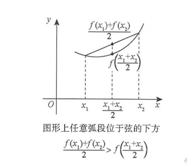
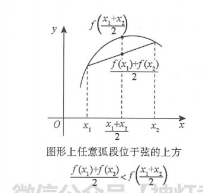
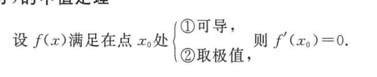
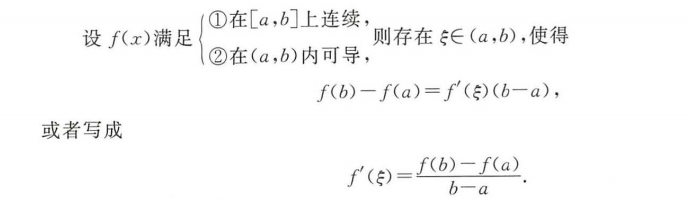
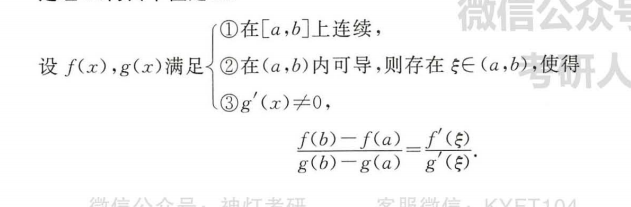

# 前言

# 预备知识

## 函数

## 反函数

## 复合函数

## 函数的四种特性

### 有界性

### 单调性

### 奇偶性

### 周期性

## 画图

### 直角坐标系画图

### 画极坐标系图

* 描点法 比较麻烦, 得计算多个角度对应的长度 然后连接起来
* 画出长度与角度的直角坐标系关系图, 长度是y轴, 角度是x轴,  然后就可以画极坐标图了  ,  这样可以很直观的看到角度变化会带来长度的变化

举例:

画出$r=a(1-\cos \theta)(a>0)$

描点法:

画关系图法:

### 根据参数方程画图

# 数列极限

## 定义

## 数列极限的运算

## 夹逼准则

## 单调有界准则

## 题目

# 函数极限与连续性

## 函数极限

### 函数极限定义

### 函数极限的性质

### 极限的四则运算

### 夹逼准则

### 洛必达法则

### 泰勒公式

### 海涅定义(归结原则)

### 无穷小

#### 定义

#### 无穷小比阶

#### 运算规则

#### 等价无穷小替换

## 函数的连续与间断

### 连续的定义

### 间断的定义和分类

## 七种未定式

**这7种结果就是 极限可能存在也可能不存在**,  其他的是要么存在,要么不存在 比如 无穷大 + 无穷大 就是 无穷大, 已经不存在了,不需要判断

  $\frac{0}{0}   \frac{\infty}{\infty}$   $0 \cdot \infty$  

对于这种题型   要考虑使用  运算规则, 洛必达法则,泰勒公式, **归结原则**,**夹逼准则**,  对于前三个, 我们通常会想到的,  但是对于后两个, 特别是夹逼准则, 一定要记得,  归结原则的话需要先求出函数的极限, 然后拿出一个特殊的x数列带入进去得到待求数列极限, 比如下面这个题

 $\infty-\infty$  

对于这种, 一定要转变为   $\frac{0}{0}   \frac{\infty}{\infty}$   $0 \cdot \infty$ ,  有分母就是通分, 没有就创建分母再通分, 创建分母的方式有: 提取公因式  换元倒代换,

$\infty^0$   $0^0$   $1^{\infty}$ .

这种就是转变成 e^ln 这种形式

## 做题

### 求函数某一点的极限

如果函数在某一点连续, 就没有必要分左右讨论, 就是函数值, **如果不连续或者我们不知道连续不连续,  我们需要分两侧来讨论**, 两侧极限相等, 那么极限存在, 否则就不存在
$$
\text { 当 } x \rightarrow 1 \text { 时, 函数 } \frac{x^2-1}{x-1} \mathrm{e}^{\frac{1}{x-1}} \text { 的极限 }
$$
这个题, 我们就需要分 x在1左右两侧的极限

### 函数在区间有界

**(1) 若 $y=f(x)$ 在闭区间 $[a, b]$ 上为连续函数, 则 $f(x)$ 在 $[a, b]$ 上必定有界.**
**(2) 若 $f(x)$ 在 $(a, b)$ 内为连续函数, 且 $\lim _{x \rightarrow a_+} f(x) \lim _{x \rightarrow b_-} f(x)$都存在, 则 $f(x)$ 在 $(a, b)$ 内必定有界.**

### 讨论间断点问题

1. 首先看无定义点 处 两边极限值
2. 如果是分段函数,  就看 分段处两边极限  和 函数值

### 求未定式的极限值

* 要定要把公式灵活运用, 比如泰勒和洛必达, 他们是可以共同使用的,  有时候就需要组合他们一起使用
* 既要看局部, 又要有大局观,  比如在做等价无穷小替换的时候,  趋于0的是一个很复杂的关于自变量的表达式,  但是我们可以把它看成一个整体然后做等价替换

# 一元函数微分学的概念与计算

## 概念

### 导数

#### 单侧导数

<em style="color:red">导数说到底还是极限问题</em>

####  导数的几何意义.

#### 高阶导数的概念.

#### 定理

### 微分

#### 定义

## 计算

### 四则运算

### 分段函数求导

### 变限积分求导

### 复合求导

### 反函数的导数

### 参数方程所确定的函数的导数

### 隐函数求导

### 对数求导法

### 幂指函数求导

### 高阶求导

## 基本的求导公式

## 总结

本讲主要是 讲了导数和微分的定义,  以及如何关于导数求导的计算,  **一定要打好基础,  记牢固基本求导公式,  因为后续找原函数的时候,需要用到, 如果导数记得不牢固, 那么找原函数就会很麻烦**

# 一元微分学的几何应用

## 极值和最值的概念

### 极值

### 最值

## 单调性和极值的判别

### 单调性的判别

### 一阶可导点是极值点的必要条件

### 判别极值的第一充分条件

> 

### 判别极值的第二充分条件

### 判别极值的第三充分条件

小技巧, 对于 极值判别的第二第三充分条件,   我们可以将公式记成这样 $f^{(n)}\left(x_0\right)<0$ => $f(x) - f\left(x_0\right)<0$ 和  $f^{(n)}\left(x_0\right)>0$ => $f(x) - f\left(x_0\right)>0$ 这样就很快的记住了

## 凹凸性与拐点的概念

### 凹凸性的定义

设函数 $f(x)$ 在区间 $I$ 上连续. 如果对 $I$ 上任意不同两点 $x_1, x_2$, 恒有
$$
f\left(\frac{x_1+x_2}{2}\right)<\frac{f\left(x_1\right)+f\left(x_2\right)}{2},
$$
则称 $y=f(x)$ 在 $I$ 上的图形是凹的 (或凹弧) 

如果恒有
$$
f\left(\frac{x_1+x_2}{2}\right)>\frac{f\left(x_1\right)+f\left(x_2\right)}{2},
$$
则称 $y=f(x)$ 在 $I$ 上的图形是凸的 (或凸弧).

### 拐点的定义

**连续曲线**的凹弧与凸弧的分界点称为该曲线的拐点.(不用区分先凹还是先凸)  这是一个函数点(x,f(x))

## 凹凸性与拐点的判别

### 判别凹凸性

设函数 $f(x)$ 在 $I$ 上二阶可导.
(1)若在 $I$ 上 $f^{\prime \prime}(x)>0$, 则 $f(x)$ 在 $I$ 上的图形是凹的;
(2) 若在 $I$ 上 $f^{\prime \prime}(x)<0$, 则 $f(x)$ 在 $I$ 上的图形是凸的.

### 二阶可导点是拐点的必要条件

设 $f^{\prime \prime}\left(x_0\right)$ 存在, 且点 $\left(x_0, f\left(x_0\right)\right)$ 为曲线上的拐点, 则 $f^{\prime \prime}\left(x_0\right)=0$.

### 判别拐点的第一充分条件

设 $f(x)$ 在点 $x=x_0$ 处连续, 在点 $x=x_0$ 的某去心邻域 $\dot{U}\left(x_0, \delta\right)$ 内二阶导数存在, 且在该点的左、右邻域 内 $f^{\prime \prime}(x)$ 变号 (无论是由正变负, 还是由负变正), 则点 $\left(x_0, f\left(x_0\right)\right)$ 为曲线上的拐点.

### 判别拐点的第二充分条件

设 $f(x)$ 在 $x=x_0$ 的某邻域内三阶可导, 且 $f^{\prime \prime}\left(x_0\right)=0, f^{\prime \prime \prime}\left(x_0\right) \neq 0$, 则 $\left(x_0, f\left(x_0\right)\right)$ 为拐点.

### 判别拐点的第三充分条件

设 $f(x)$ 在 $x_0$ 处 $n$ 阶可导, 且 $f^{(m)}\left(x_0\right)=0(m=2, \cdots, n-1), f^{(n)}\left(x_0\right) \neq 0(n \geqslant 3)$, 则当 $n$ 为奇数时, $\left(x_0, f\left(x_0\right)\right)$ 为拐点.

## 渐近线

### 铅垂渐近线

若 $\lim _{x \rightarrow x^{+}} f(x)=\infty$ (或 $\lim _{x \rightarrow x_0} f(x)=\infty$ ), 则 $x=x_0$ 为一条铅垂渐近线.

### 水平渐近线

若 $\lim _{x \rightarrow+\infty} f(x)=y_1$, 则 $y=y_1$ 为一条水平渐近线; 若 $\lim _{x \rightarrow-\infty} f(x)=y_2$, 则 $y=y_2$ 为一条水平渐近线; 若 $\lim _{x \rightarrow+\infty} f(x)=\lim _{x \rightarrow-\infty} f(x)=y_0$, 则 $y=y_0$ 为一条水平渐近线.

### 斜渐近线

若 $\lim _{x \rightarrow+\infty} \frac{f(x)}{x}=a_1, \lim _{x \rightarrow+\infty}\left[f(x)-a_1 x\right]=b_1$, 则 $y=a_1 x+b_1$ 是曲线 $y=f(x)$ 的一条斜渐近线;
若 $\lim _{x \rightarrow-\infty} \frac{f(x)}{x}=a_2, \lim _{x \rightarrow-\infty}\left[f(x)-a_2 x\right]=b_2$, 则 $y=a_2 x+b_2$ 是曲线 $y=f(x)$ 的一条斜渐近线;
若 $\lim _{x \rightarrow+\infty} \frac{f(x)}{x}=\lim _{x \rightarrow-\infty} \frac{f(x)}{x}=a, \lim _{x \rightarrow+\infty}[f(x)-a x]=\lim _{x \rightarrow-\infty}[f(x)-a x]=b$, 则 $y=a x+b$ 是曲线 $y=f(x)$ 的 一条斜渐近线.

### 解答步骤

1. 找无定义点 或者 定义域端点, 如果函数值趋于无穷大,就是铅锤渐近线,
2. 当x趋于无穷大时, 如果函数值趋于常数,就是水平渐近线
3. f(x)/x  趋于无穷大的时候,如果极限存在不等于0 记做a, 然后再求 f(x)-ax 趋于无穷大的时候是否存在, 如果两个都满足了 那么就存在斜渐进线,

## 最值或取值范围

求闭区间 $[a, b]$ 上**连续函数** $f(x)$ 的最大值 $M$ 和最小值 $m$
(1)求出 $f(x)$ 在 $(a, b)$ 内的可疑点—驻点与不可导点, 并求出这些可疑点处的函数值;
(2) 求出端点的函数值 $f(a)$ 和 $f(b)$;
(3) 比较以上所求得的所有函数值, 其中最大者为 $f(x)$ 在 $[a, b]$ 上的最大值 $M$, 最小者为 $f(x)$ 在 $[a, b]$ 上的最小值 $m$.

求开区间 $(a, b)$ 内连续函数 $f(x)$ 的最值或者取值范围  (不一定存在最值)
(1)求出 $f(x)$ 在 $(a, b)$ 内的可疑点一驻点与不可导点, 并求出这些可疑点处的函数值.
(2) 求 $(a, b)$ 两端的单侧极限: 若 $a, b$ 为有限常数, 则求 $\lim f(x)$ 与 $\lim f(x)$; 若 $a$ 为- - , 则求 $\lim f(x)$; 若 $b$ 为 $+\infty$, 则求 $\lim _{x \rightarrow+\infty} f(x)$. 记以上所求左端极限为 $A$, 右端极限为 $B$.
(3) 比较(1), (2) 所得结果, 确定最值或取值范围.

## 做函数图形

给出函数 $f(x)$, 作图的一般步骤:
(1) 确定函数 $f(x)$ 的定义域, 并考查它是否有奇偶对称性;
(2) 求出 $f^{\prime}(x), f^{\prime \prime}(x)$, 用 $f(x)$ 的无定义点, $f^{\prime}(x)=0$ 的点, $f^{\prime}(x)$ 不存在的点, $f^{\prime \prime}(x)=0$ 的点, $f^{\prime \prime}(x)$ 不 存在的点, 将定义域划分为若干子区间, 确定函数图形在各个子区间上的单调性与凹凸性, 进而确定函数 的极值点和拐点;
(3) 确定渐近线 (如果有的话);
(4)作出函数图形.
这是基本功, 一定要重视.

## 总结

* 导数只是研究单调性,极值 凹凸性和拐点的工具,   我们千万要记住他们的定义, 有时候不需要使用导数 使用定义就能够把题目做出来了

# 中值定理

## 涉及到函数的中值定理

**设 $f(x)$ 在 $[a, b]$ 上连续, 则**

### 有界与最值定理

$m \leqslant f(x) \leqslant M$, 其中, $m, M$ 分别为 $f(x)$ 在 $[a, b]$ 上的最小值与最大值.

### 介值定理

当 $m \leqslant \mu \leqslant M$ 时, 存在 $\xi \in[a, b]$, 使得 $f(\xi)=\mu$.   

几何意义就是y = u 和 f(x) 必有交点

### 平均值定理

 当 $a<x_1<x_2<\cdots<x_n<b$ 时, 在 $\left[x_1, x_n\right]$ 内至少存在一点 $\xi$, 使
$$
f(\xi)=\frac{f\left(x_1\right)+f\left(x_2\right)+\cdots+f\left(x_n\right)}{n} .
$$

### 零点定理

当 $f(a) \cdot f(b)<0$ 时, 存在 $\xi \in(a, b)$, 使得 $f(\xi)=0$.

## 涉及到导数的中值定理

### 费马定理

### 罗尔定理

### 拉格朗日中值定理

<em style="color:red"> 我们不一定要在固定作用区间上用拉格朗日, 我们也可以将一个区间变成动态的 , 比如将b变成x</em>

### 柯西中值定理

### 泰勒公式

(1) 带拉格朗日余项的 $n$ 阶泰勒公式.
设 $f(x)$ 在点 $x_0$ 的**某个邻域**内 $n+1$ 阶导数存在, 则对该邻域内的任意点 $x$, 有
$$
f(x)=f\left(x_0\right)+f^{\prime}\left(x_0\right)\left(x-x_0\right)+\cdots+\frac{1}{n !} f^{(n)}\left(x_0\right)\left(x-x_0\right)^n+\frac{f^{(n+1)}(\xi)}{(n+1) !}\left(x-x_0\right)^{n+1},
$$
其中 $\xi$ 介于 $x, x_0$ 之间.
(2) 带佩亚诺余项的 $n$ 阶泰勒公式.
设 $f(x)$ 在**点 $x_0$ 处** $n$ 阶可导, 则存在 $x_0$ 的一个邻域, 对于该邻域内的任意点 $x$, 有
$$
f(x)=f\left(x_0\right)+f^{\prime}\left(x_0\right)\left(x-x_0\right)+\frac{1}{2 !} f^{\prime \prime}\left(x_0\right)\left(x-x_0\right)^2+\cdots+\frac{1}{n !} f^{(n)}\left(x_0\right)\left(x-x_0\right)^n+o\left(\left(x-x_0\right)^n\right) .
$$

## 涉及到积分的中值定理

### 积分中值定理

设 $f(x)$ 在 $[a, b]$ 上连续, 存在 $\xi \in(a, b)$, 使得 $\int_a^b f(x) \mathrm{d} x=f(\xi)(b-a)$.

## 做题

* 看到 f - f 就要想起拉格朗日
* 看到 f 与 f' 的关系 想起罗尔  和 拉格朗日
* 看到 除法  就要想起 柯西
* 这些定理使用起来的时候, 一定要注意他们的使用条件

# 零点问题与微分不等式

## 零点问题

零点问题 与 方程根和函数交点问题 可以说是同一件事

### 零点定理

若 $f(x)$ 在 $[a, b]$ 上连续, 且 $f(a) f(b)<0$, 则 $f(x)=0$ 在 $(a, b)$ 内至少有一个根.

这里的 a , b不一定要常数, 可以无穷大啊, 然后只要满足两个函数值小于0 就行

### 单调性

若 $f(x)$ 在 $(a, b)$ 内单调, 则 $f(x)=0$ 在 $(a, b)$ 内至多有一个根, 这里 $a, b$ 可以是有限数, 也可以是无穷大.

### 罗尔原话

若 $f^{(n)}(x)=0$ 至多有 $k$ 个根, 则 $f(x)=0$ 至多有 $k+n$ 个根.

### 实系数奇次方程至少有一个实根

两边无穷大,一个正无穷,一个负无穷, 因此必存在一个实根

## 微分不等式

* 使用函数性态(单调性, 凹凸性,最值)
* 常量变量化
* 中值定理

## 解题

* 使用罗尔原话 加上导数的根, 就能够限制f(x)的根的数量,  我们后面就只需要去找有没有这么多根
* 在微分不等式证明的时候,  先建好
* **证明的时候,一定要学会构造函数, 充分利用中值定理**

# 

# **补充**

## 转换坐标系

<em style="color:red">**转换坐标系不会改变图形的实际形状**，**但是会改变描述这个图形的方程式**</em>。有些图形在极坐标系中表示起来更简单，有些则在直角坐标系中更简单。对于有些复杂的图形,比如椭圆这些二元二次方程,或者二元多次方程  我们可以将直角坐标系方程变成极坐标, 然后 **建立 直角坐标系 角度和长度的关系**,  然后观察这个关系图 画出 图形对象的极坐标系,  然后直接在极坐标系的中心建立直角坐标系,  这样就把图形画好了

## 极限

在数学中，极限是对函数在某点趋近的行为进行描述的一种工具。我们常常会讨论一个函数在某一点的极限，或者当自变量趋近无穷时函数的极限。极限的概念是微积分学基础之一，而微积分又是现代科学和工程中的基本工具。

1. **序列的极限**：假设我们有一个数列 ${a_n}$。如果存在一个实数 $L$，对于任何给定的正实数 $\varepsilon$，都存在一个正整数 $N$，使得当 $n > N$ 时，$|a_n - L| < \varepsilon$，那么我们说序列 ${a_n}$ 的极限为 $L$，记作 $\lim_{n\to\infty} a_n = L$。

2. **函数的极限**：假设我们有一个函数 $f(x)$ 和一个实数 $c$。如果存在一个实数 $L$，对于任何给定的正实数 $\varepsilon$，都存在一个正实数 $\delta$，使得当 $0<|x-c|<\delta$ 时，都有 $|f(x)-L|<\varepsilon$，那么我们说函数 $f(x)$ 在 $x$ 趋近于 $c$ 时的极限为 $L$，记作 $\lim_{x\to c} f(x) = L$。

其中，$\varepsilon$（epsilon）和 $\delta$（delta）是用于描述"接近程度"的阈值。

请注意，有时候函数在某一点的极限可能不存在。例如，当函数在接近某一点时呈现出“震荡”的行为，或者当函数在某一点的左极限和右极限不相等时，**我们就说该函数在这一点的极限不存在**。

> 对于序列的极限,  我们指的是当n趋于无穷大

### 极限和有界

极限和有界这两个概念在数学中都是非常重要的，尽管它们是两个不同的概念，但有时它们之间可以有一些有趣的交集。让我们来分别讨论一下这两个概念：

**极限**：如我在前面的回答中所述，极限是对函数或序列在某点趋近的行为进行描述的一种工具。极限可能存在，也可能不存在。例如，考虑函数 f(x) = x，当x趋向无穷大时，f(x)的极限就不存在，因为随着x的增大，f(x)的值也在无限增大。

**有界**：在数学中，如果一个集合的元素在某种意义上"不会无限大或无限小"，那么我们就说这个集合是有界的。对于一组实数来说，如果存在一个实数M，使得这组数中的任何数的绝对值都不超过M，那么我们就说这组数是有界的。

那么，这两个概念之间的关系是什么呢？

一个有趣的点是：**如果一个序列有极限，那么这个序列一定是有界的**。这是因为，根据极限的定义，当n足够大的时候，序列的项都可以被"限制"在离极限值一个非常小的区间内。然而，反过来并不总是成立，也就是说，一个序列即使是有界的，也不一定存在极限。**一个简单的例子就是序列 {(-1)^n}，这个序列是有界的，但是它不收敛，也就是说，它没有极限。**

## 概念

### 无穷大无穷小

在微积分中，无穷大量和无穷小量是两个基本的概念，用来描述一些量的特性或行为。以下是对这两个概念的简单介绍：

1. **无穷大量**：如果一个序列的元素的绝对值趋向于无穷大（即没有上界），那么我们就称这个序列是无穷大量。例如，序列 {n}（n是所有正整数）就是无穷大量，因为随着n的增大，**序列的元素值也趋向于无穷大。**如果是跳跃来的趋于无穷大, 比如 奇数项趋于无穷大, 偶数项随机值, **那么这个只能说是无界量, 而不是无穷大**
2. **无穷小量**：如果一个序列的元素的绝对值趋向于0，那么我们就称这个序列是无穷小量。例如，序列 {1/n}（n是所有正整数）就是无穷小量，因为随着n的增大，**序列的元素值越来越接近0**。如果是跳跃来的趋于无穷小, 比如 奇数项趋于无穷小, 偶数项随机值, **那就不能说是无穷小**
