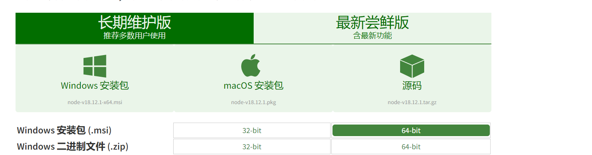
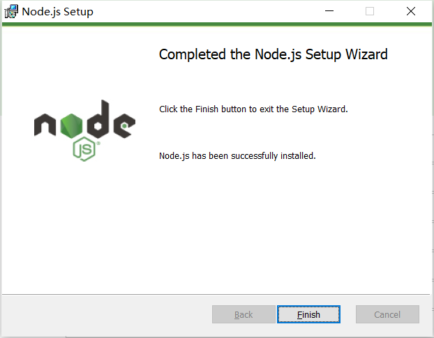
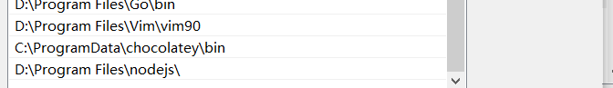
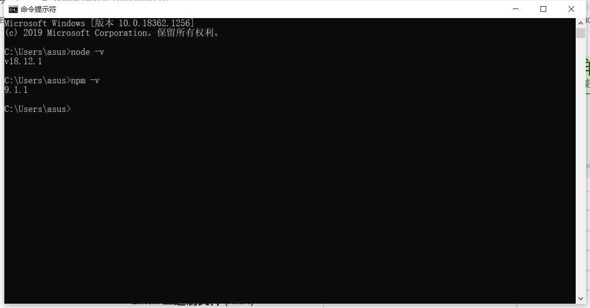
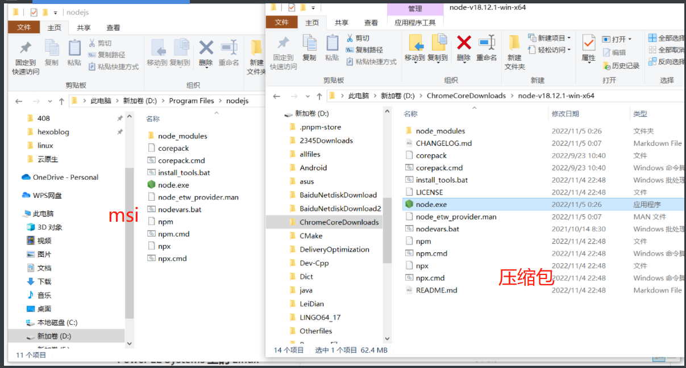
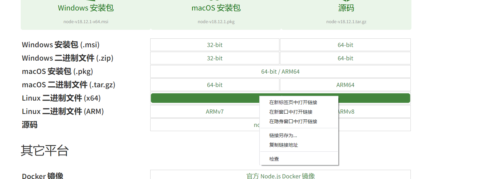

# 前言

> 每次安装完了node,下次需要安装的时候有需要Google一下,每次搜到的教程肯定又不一样,肯定会有偏差,那还不如自己总结好

[这个是下载node的官方地址](https://nodejs.org/zh-cn/)

# 安装

## windows安装node

下载msi文件



下载好后直接打开,中途选择路径的时候放D盘即可,其他直接无脑next,最后点击install就可以了



安装完后检查是否安装成功





这个是帮我们配置好环境变量的,当然我们也可以自己通过下载压缩包,然后把环境变量的方式配置上去,这样也可以,其实也没什么区别,看看他们产生的文件夹的区别吧



#### 

## linux安装(centos7)

复制下载链接



```shell
#下载压缩吧到本地
wget -c  https://nodejs.org/download/release/v17.5.0/node-v17.5.0-linux-x64.tar.xz
#解压压缩包
tar -xf node-v17.5.0-linux-x64.tar.xz
# 移动到指定目录,并且更改名字
mv node-v17.5.0-linux-x64 /usr/local/lib/nodejs
#添加到环境变量
ln -s /usr/local/lib/nodejs/bin/node /usr/local/bin
ln -s /usr/local/lib/nodejs/bin/npm /usr/local/bin

# 查看是否安装成功
node -v
npm -v
```

> 这里可能会出现node: /lib64/libm.so.6: version `GLIBC_2.27' not found (required by node) 这样的错误,我的建议是安装低版本

# 配置node

## 设置镜像加速源

```shell
# 全局加速
npm config set registry https://registry.npmmirror.com
# 临时加速
npm install -g cnpm --registry=https://registry.npmmirror.com
```

## 查看全局安装的包

```shell
npm root -g
```

