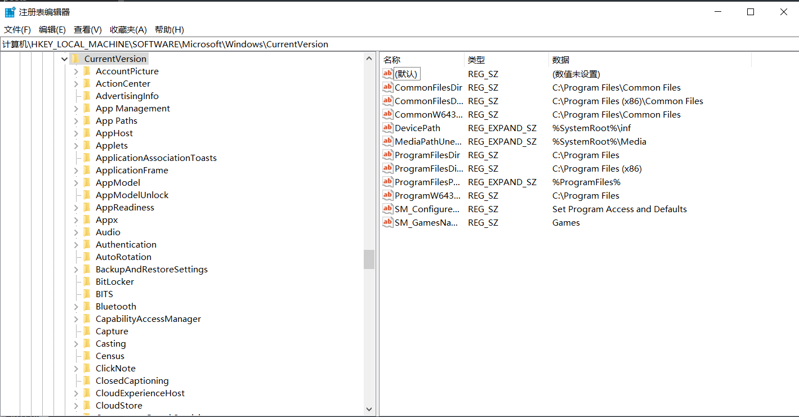

# 问题记录

## 启动变得很慢

* 我的磁盘测试了, 没有问题
* 安全启动也很慢
* 启动日志总是循环加载一个驱动不成功

我的解决方法就是更新系统,  然后就遇到了无法更新的问题, 可以参照下面, 更新成功后, 就没有任何问题了

## 无法更新

报错信息   针对 Windows 10 的功能更新，版本 22H2 - 错误 0xc1900204

这个大概率是我们的默认安装路径换到其他盘去了, 然后导致更新失败, 我们只需要换回来就行

win + r  然后输入 regedit

然后输入框输入  这个:    计算机\HKEY_LOCAL_MACHINE\SOFTWARE\Microsoft\Windows\CurrentVersion

将其他盘的改成C盘即可, 然后就可以安装成功了