## 第一章 计算机系统概述

计算机系统由软件系统和硬件系统组成

计算机的性能的好坏取决于软件,硬件的总和

我们需要将源代码翻译成汇编代码,然后再将汇编代码转变成机器码, 源代码翻译成汇编代码然后变成机器码有两种方式,一种是编译,另外一种是解释

编译是一次性将代码全部机器码,生成目标可执行文件,后续无需在翻译,可以直接执行

解释是执行一条语句翻译一次,后续需要使用还需要重新翻译

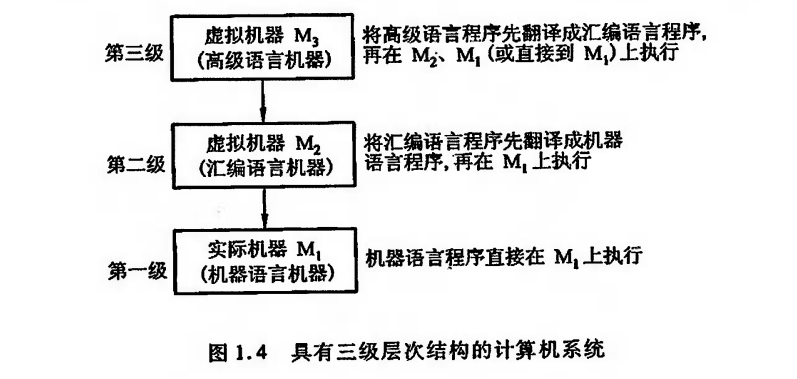

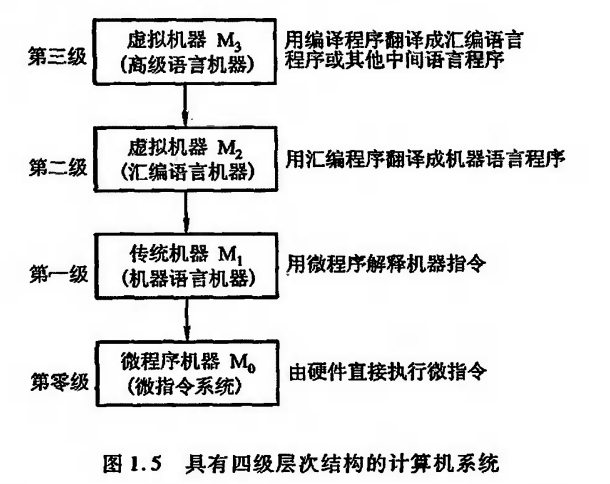

这个微程序机器其实是由硬件实现的,将机器语言转变为一系列的微指令

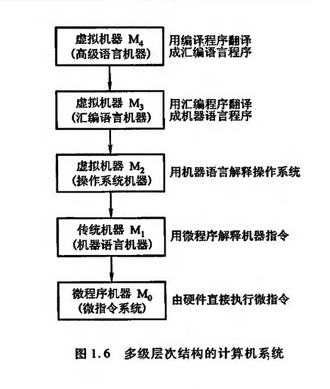

**计算机体系结构**关注的是**计算机系统的概念性设计和功能特点**，而**计算机组成则更关注计算机系统的具体实现和运作方式**。两者相互依存，计算机组成是计算机体系结构实现的基础，而计算机体系结构则为计算机组成提供了设计和指导的思路。

### 计算机的组成

#### 冯洛伊曼计算机特点

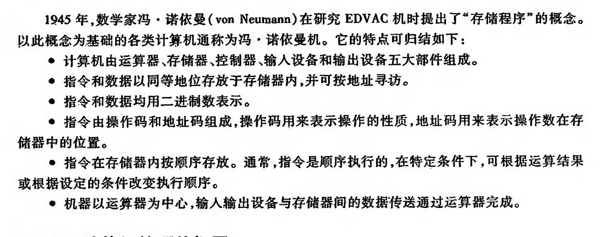

> 需要注意的是,典型的冯洛伊曼计算机是以运算器为中心,而现代计算机都是以存储器为中心

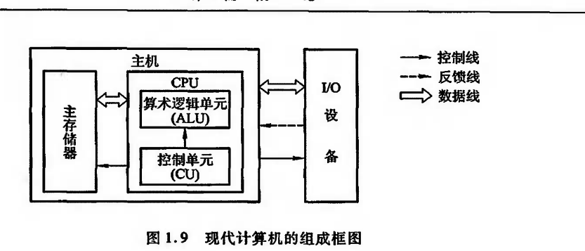

运算器各个寄存器的作用和功能

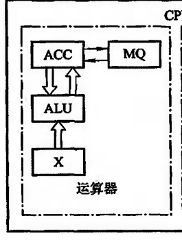

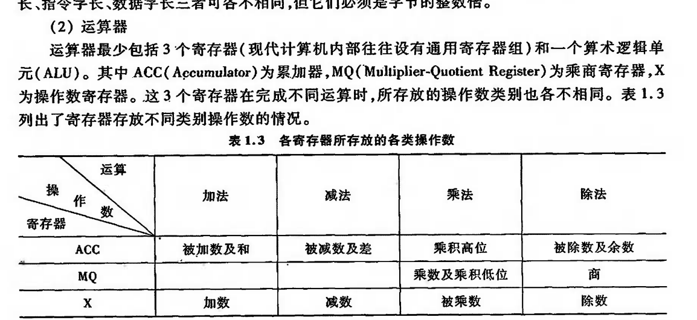

控制器是计算机的指挥中枢,负责指挥各个部件协调,自动工作,完成执行指令需要三个阶段: 取指,分析,执行

控制器中的寄存器

PC 是程序计数器,记录下一条指令的地址   IR 是指令寄存器  记录当前执行指令

### 计算机硬件的指标

#### 机器字长

机器字长是CPU一次能够处理数据的位数,与CPU里面的寄存器位数有关,机器字长也会影响运算速度,对于那些多字节数据的运算,如果机器字长不够,可能需要几次运算

#### 存储容量

#### 运算速度

## 第三章 总线

### 总线分类

#### 片内总线

CPU内部的线,用于连接各个寄存器,寄存器与ALU

#### 系统总线

CPU,内存,IO设备之间的连线

系统总线按照类别又可以分为三类: 数据总线 地址总线 控制总线

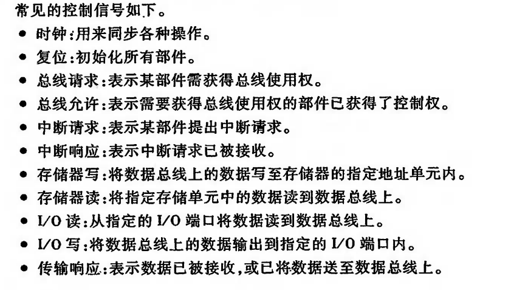

#### 通信总线

用于连接各个计算机之间的线

### 总线特性

#### 机械特性

尺寸啊,形状,连接设备的引脚个数,排列顺序啊

#### 电气特性

有效信号的电平范围,信号的传递方向

#### 功能特性

传递信号所代表的功能

#### 时间特性

信号在哪个时间内有效

### 总线性能指标

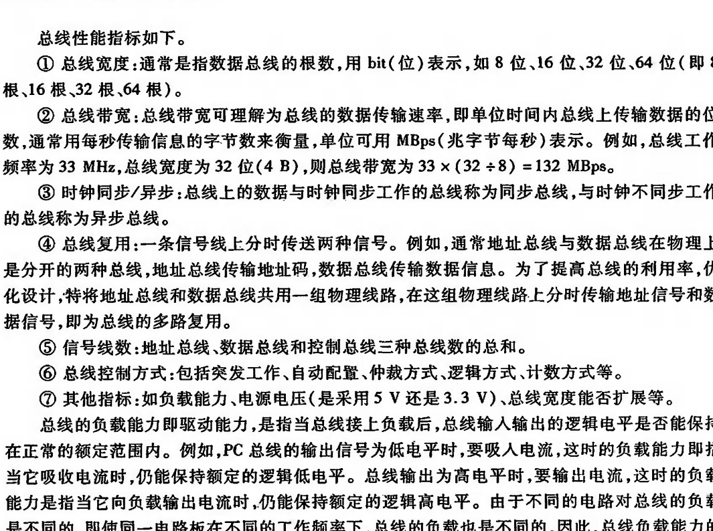

### 总线结构

#### 单总线结构

列如这种,多个IC连接在一根总线上的结构就是单总线结构

这种结构有个缺点就是,只能有一个部件发送数据,这会影响系统的工作效率,对于有很多的部件连接在上面,那么势必会有延时,而且如果传输大量数据,会一直占据总线,这样是会极大的降低系统工作效率的

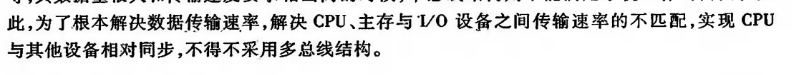

#### 多总线结构

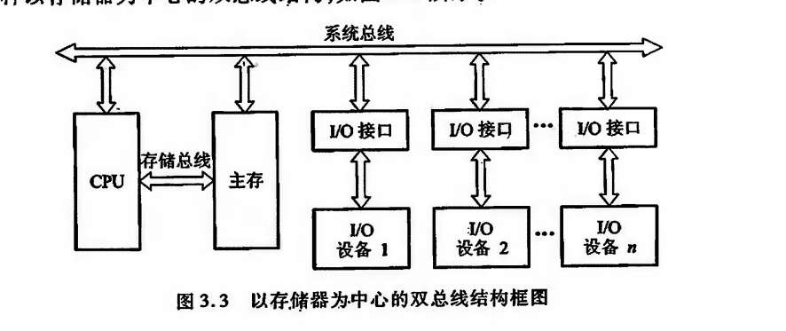

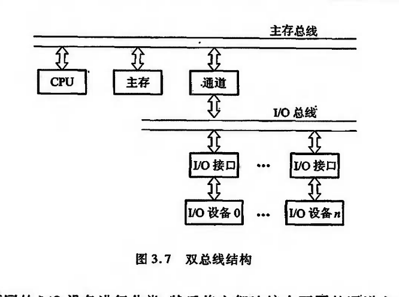

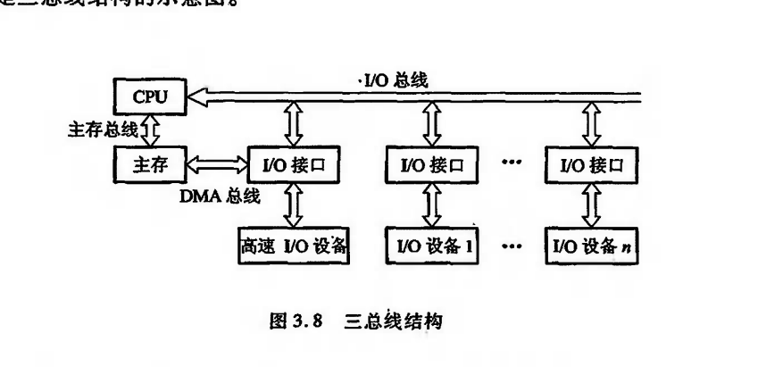

### 总线判优

#### 集中式

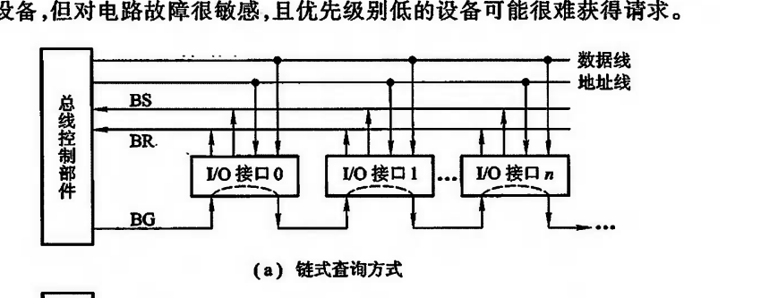

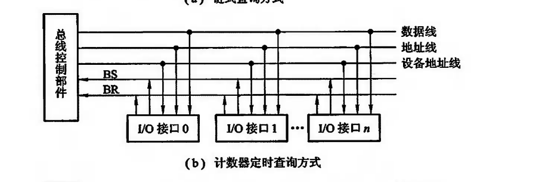

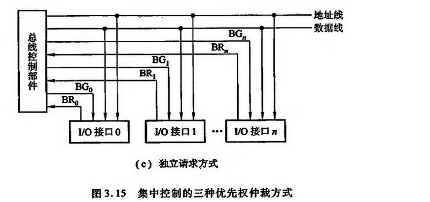

### 总线通信控制

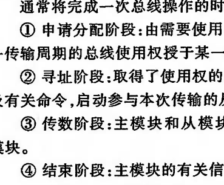

#### 同步通信

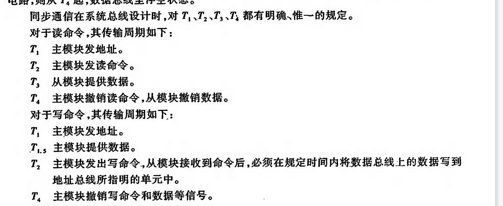

这样其实是有缺点的,如果两个设备速度不统一的话,时间就要设置的长一些,必须要满足慢的设备能够接受

#### 异步通信

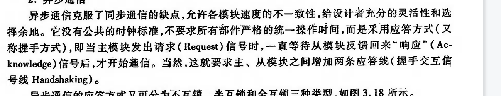

##### 不互锁方式

就是发完请求之后,等待一段时间,撤销请求,就可以直接发送数据了

##### 半互锁方式

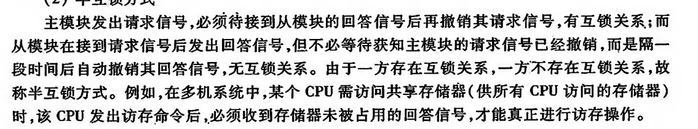

发送方必须等到接收方答复后才能撤销请求,然后发起数据,而接收方不用等到发送方撤销请求后才能撤销回答,过一段时间后自动撤销回答信号

##### 全互锁方式

发送方必须等到接收方回答后才能撤销请求,接收方必须等到发送发撤销请求后才能撤销回答

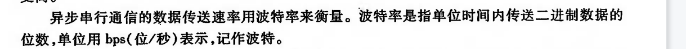

做到题吧

120 * (7+1+1+1) = 1200 bps

#### 半同步通信

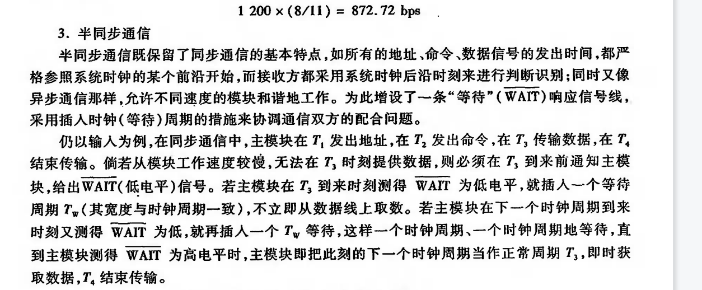

其实就是多了一根等待线,如果是低电平,主模块就是等从模块一下

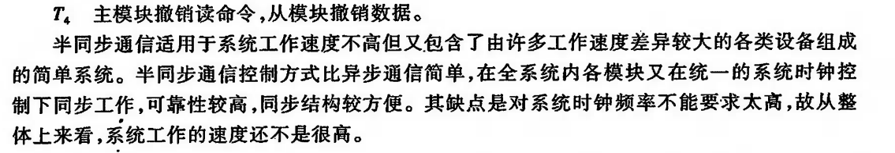

#### 分离式通信

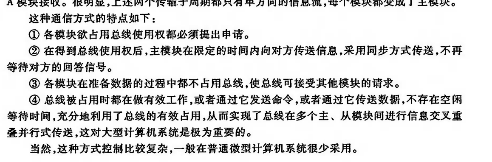

### 知识点总结

#### 总线概述

​	**总线的定义**: 是一种能由多个部件分时共享的公共传输路线

​	**总线传输特点**: 某一时刻只允许一个部件发送数据,但是可以多个部件接收相同数据

​	**总线中地址线是单向的,数据线是双向的**

#### 总线判优

​	总线判优是为了解决**多个部件同时**使用总线时**使用权的分配问题**

​	**三种总线判优方式对比**

​	链式查询方式连线简单,易于扩充,对电路故障敏感

​	计数器定时查询优先级设置灵活,对故障不敏感,连线和控制过程复杂

​	独立查询请求方式最快,但如果硬件量多,连线就很多,成本高

#### 总线性能指标

​	总线**宽度**: 数据总线的根数

​	总线带宽: 传输数据的速率

​	总线复用: 同一个线可以传输不通的信号

#### 总线通信

​	

分离式通信主要用于大型计算机系统

#### 总线标准

总线标准的设置主要解决不同厂家各类模块化产品的兼容问题