# 第一章 计算机系统概述

计算机系统由软件系统和硬件系统组成

计算机的性能的好坏取决于软件,硬件的总和

我们需要将源代码翻译成汇编代码,然后再将汇编代码转变成机器码, 源代码翻译成汇编代码然后变成机器码有两种方式,一种是编译,另外一种是解释

编译是一次性将代码全部机器码,生成目标可执行文件,后续无需在翻译,可以直接执行

解释是执行一条语句翻译一次,后续需要使用还需要重新翻译

这个微程序机器其实是由硬件实现的,将机器语言转变为一系列的微指令

**计算机体系结构**关注的是**计算机系统的概念性设计和功能特点**，而**计算机组成则更关注计算机系统的具体实现和运作方式**。两者相互依存，计算机组成是计算机体系结构实现的基础，而计算机体系结构则为计算机组成提供了设计和指导的思路。

## 计算机的组成

### 冯洛伊曼计算机特点

> 需要注意的是,典型的冯洛伊曼计算机是以运算器为中心,而现代计算机都是以存储器为中心

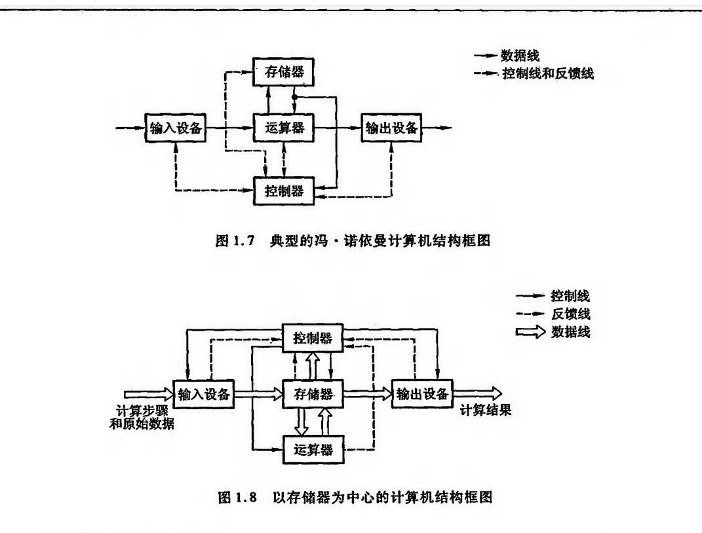

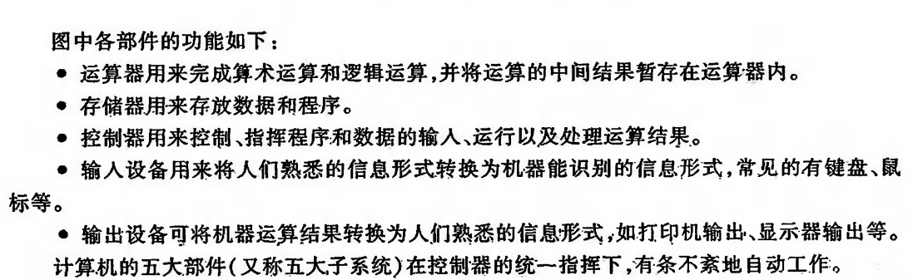

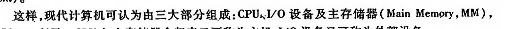

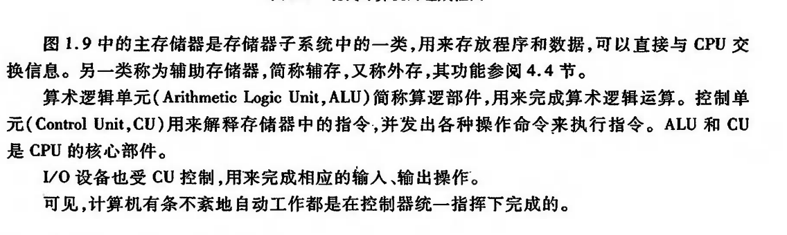

运算器各个寄存器的作用和功能

控制器是计算机的指挥中枢,负责指挥各个部件协调,自动工作,完成执行指令需要三个阶段: 取指,分析,执行

控制器中的寄存器

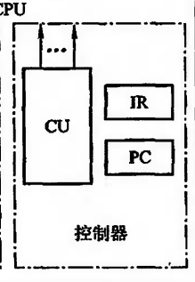

PC 是程序计数器,记录下一条指令的地址   IR 是指令寄存器  记录当前执行指令

## 计算机硬件的指标

### 机器字长

机器字长是CPU一次能够处理数据的位数,与CPU里面的寄存器位数有关,机器字长也会影响运算速度,对于那些多字节数据的运算,如果机器字长不够,可能需要几次运算

### 存储容量

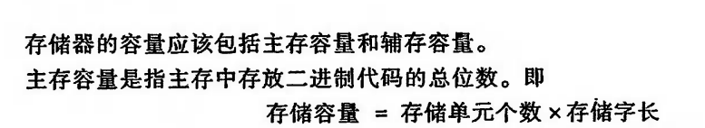

### 运算速度

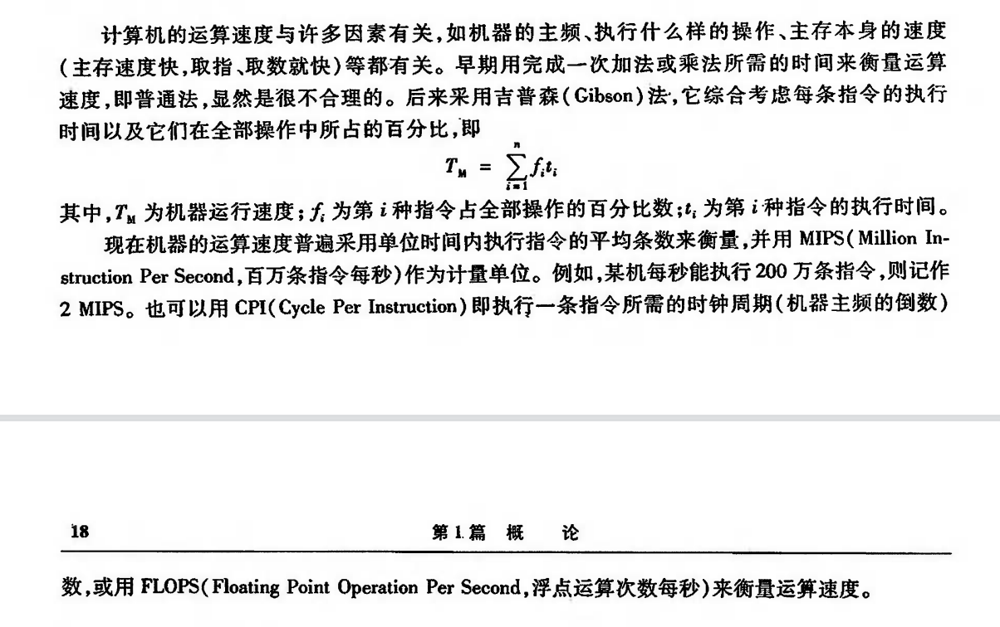

# 第三章 总线

## 总线分类

### 片内总线

CPU内部的线,用于连接各个寄存器,寄存器与ALU

### 系统总线

CPU,内存,IO设备之间的连线

系统总线按照类别又可以分为三类: 数据总线 地址总线 控制总线

### 通信总线

用于连接各个计算机之间的线

## 总线特性

### 机械特性

尺寸啊,形状,连接设备的引脚个数,排列顺序啊

### 电气特性

有效信号的电平范围,信号的传递方向

### 功能特性

传递信号所代表的功能

### 时间特性

信号在哪个时间内有效

## 总线性能指标

## 总线结构

### 单总线结构

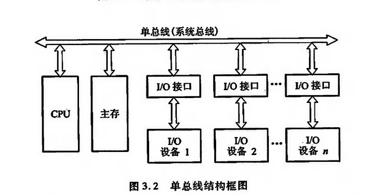

列如这种,多个IC连接在一根总线上的结构就是单总线结构

这种结构有个缺点就是,只能有一个部件发送数据,这会影响系统的工作效率,对于有很多的部件连接在上面,那么势必会有延时,而且如果传输大量数据,会一直占据总线,这样是会极大的降低系统工作效率的

### 多总线结构

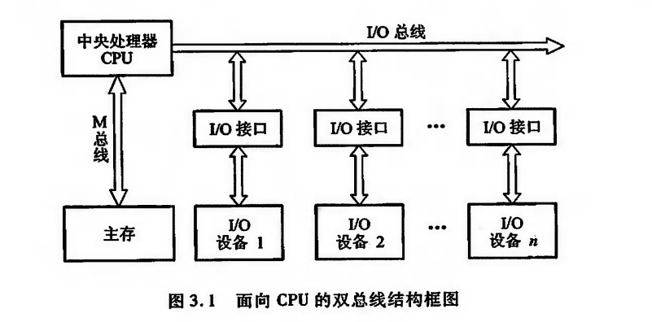

## 总线判优

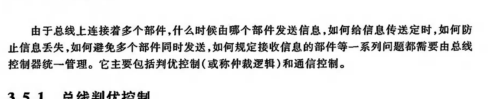

### 集中式

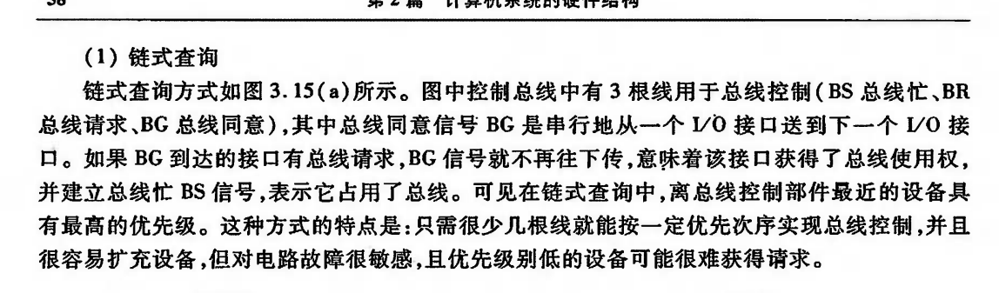

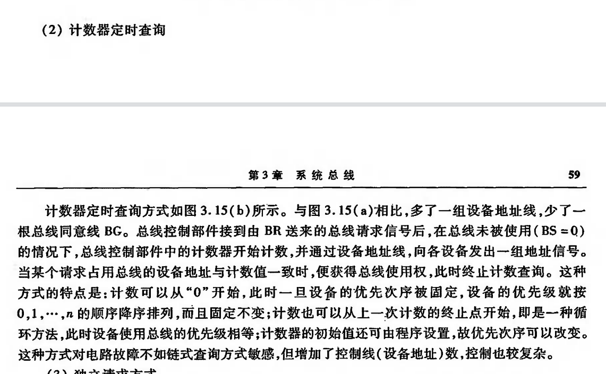

## 总线通信控制

### 同步通信

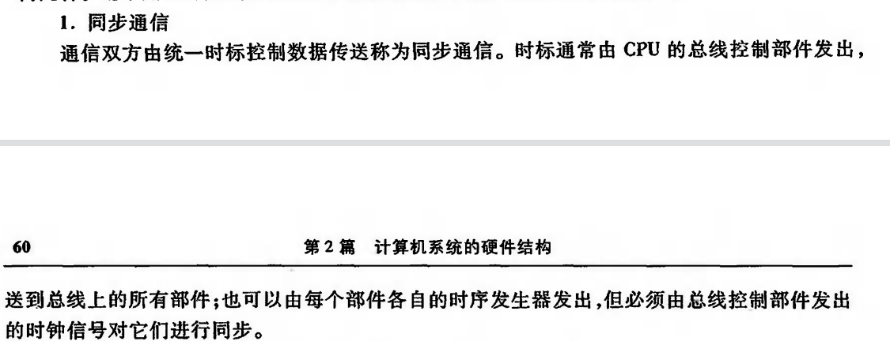

这样其实是有缺点的,如果两个设备速度不统一的话,时间就要设置的长一些,必须要满足慢的设备能够接受

### 异步通信

#### 不互锁方式

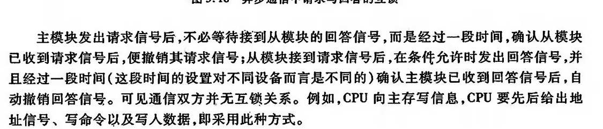

就是发完请求之后,等待一段时间,撤销请求,就可以直接发送数据了

#### 半互锁方式

发送方必须等到接收方答复后才能撤销请求,然后发起数据,而接收方不用等到发送方撤销请求后才能撤销回答,过一段时间后自动撤销回答信号

#### 全互锁方式

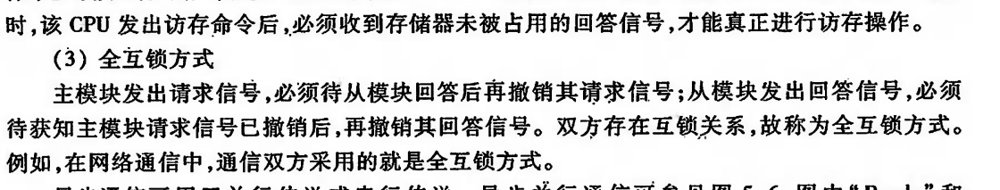

发送方必须等到接收方回答后才能撤销请求,接收方必须等到发送发撤销请求后才能撤销回答

做到题吧

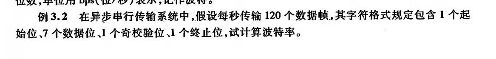

120 * (7+1+1+1) = 1200 bps

### 半同步通信

其实就是多了一根等待线,如果是低电平,主模块就是等从模块一下

### 分离式通信

## 知识点总结

### 总线概述

​	**总线的定义**: 是一种能由多个部件分时共享的公共传输路线

​	**总线传输特点**: 某一时刻只允许一个部件发送数据,但是可以多个部件接收相同数据

​	**总线中地址线是单向的,数据线是双向的**

### 总线判优

​	总线判优是为了解决**多个部件同时**使用总线时**使用权的分配问题**

​	**三种总线判优方式对比**

​	链式查询方式连线简单,易于扩充,对电路故障敏感

​	计数器定时查询优先级设置灵活,对故障不敏感,连线和控制过程复杂

​	独立查询请求方式最快,但如果硬件量多,连线就很多,成本高

### 总线性能指标

​	总线**宽度**: 数据总线的根数

​	总线带宽: 传输数据的速率

​	总线复用: 同一个线可以传输不通的信号

### 总线通信

​	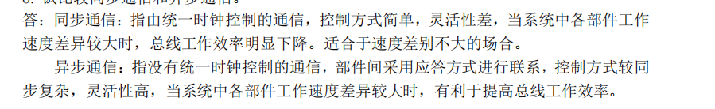

分离式通信主要用于大型计算机系统

### 总线标准

总线标准的设置主要解决不同厂家各类模块化产品的兼容问题

# 第四章 存储器

## 概述

### 存储器的分类

1. 根据存储介质： 

   a. 半导体存储器：以半导体芯片为基础的存储器，如RAM（随机存取存储器）和ROM（只读存储器）。 

   b. 磁存储器：使用磁介质进行信息存储的设备，如硬盘、磁带和磁盘阵列。 

   c. 光存储器：使用光学介质进行信息存储的设备，如CD、DVD和蓝光光盘。

2. 根据数据存取方式： 

   a. 随机存取存储器（RAM）：允许任意顺序访问数据的存储器，如DRAM（动态随机存取存储器）和SRAM（静态随机存取存储器）。 

   b. 只读存储器（ROM）：存储内容在生产后就固定的存储器，如EPROM（可擦写可编程只读存储器）和EEPROM（电可擦写可编程只读存储器）。 

   c. 顺序存取存储器（SAM）：按顺序访问数据的存储器，如磁带存储器。

3. 根据存储器容量和性能：

    a. 主存储器（Primary Memory）：直接与处理器进行数据交换的存储器，如RAM和部分ROM。主存储器通常具有较高的存取速度和较低的容量。

    b. 辅助存储器（Secondary Memory）：作为主存储器容量扩展的存储器，如硬盘、光盘和磁带。辅助存储器通常具有较大的容量，但存取速度相对较慢。

4. 根据数据保持特性：

    a. 易失性存储器（Volatile Memory）：在断电时会丢失存储的数据，如DRAM和SRAM。 

   b. 非易失性存储器（Non-Volatile Memory）：在断电时仍能保持存储的数据，如ROM、闪存（Flash Memory）、硬盘和光盘。

## 主存储器

### 技术指标

主存的主要技术指标是容量和速度

#### 存储容量

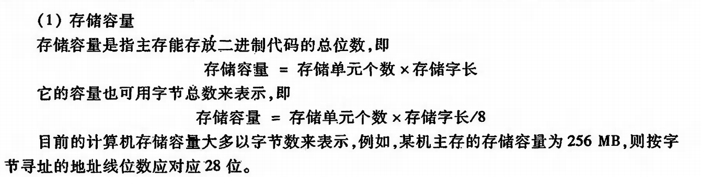

#### 存储速度

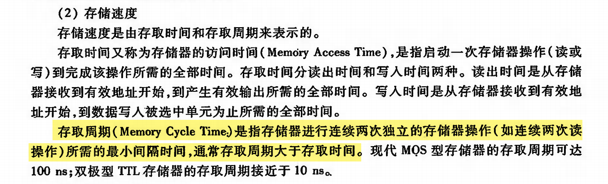

#### 存储带宽

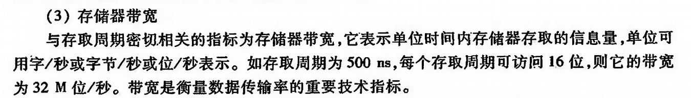

### 随机存储器

随机存储分为两类,静态RAM 和动态RAM

它们各自具有不同的特点和性能，以下是它们的特点和区别：

静态RAM（SRAM）：

1. 存储单元：SRAM中每个存储单元由六个晶体管（或四个晶体管和两个电容）组成，形成一个双稳态触发器，用于存储一个比特（0或1）。
2. 存储数据稳定性：SRAM不需要刷新以保持存储的数据。只要有电源供应，数据就会保持稳定。
3. 速度：SRAM的访问速度较快，因为不需要刷新操作。
4. 功耗：SRAM在操作和待机时功耗较高，因为需要维持双稳态触发器的状态。
5. 成本和集成度：SRAM的制造成本较高，集成度较低，因为每个存储单元需要更多的晶体管。
6. 应用场景：SRAM常用于高速缓存（如CPU的L1、L2和L3缓存）、实时系统和低容量高速存储器的应用。

动态RAM（DRAM）：

1. 存储单元：DRAM中每个存储单元由一个晶体管和一个电容组成。电容用于存储一个比特（0或1），电荷表示1，无电荷表示0。
2. 存储数据稳定性：DRAM需要定期刷新以保持存储的数据，因为电容会随时间漏电。
3. 速度：DRAM的访问速度相对较慢，因为需要定期进行刷新操作。
4. 功耗：DRAM在操作时功耗较高（因为需要刷新），但待机时功耗较低。
5. 成本和集成度：DRAM的制造成本较低，集成度较高，因为每个存储单元只需要一个晶体管和一个电容。
6. 应用场景：DRAM常用于主存储器（如计算机、服务器和工作站的系统内存），因为具有较高的容量和较低的成本。

#### DRAM 的刷新操作

由于DRAM是用电容来存储数据的,而电容具有易失性,因此我们需要隔一段时间就刷新一下,一般是2ms就需要刷新一次

**集中刷新**

就是统一一个时间对DRAM中的每一行进行刷新,这个过程中CPU是不能访问DRAM的,因此这个时间也被称为死区

**分散刷新**

每读写一次数据,就对DRAM中的一行进行刷新,这样的话会导致刷新频率较高,对于分散刷新没有死区我们可以理解为将时钟周期分为两半,前一半用来读取数据,后一半用来刷新

**异步刷新**

我们发现分散刷新的频率有点快了,我们可以在一定时间范围内,刷新一行数据,如果还把这个时间时间安排在CPU译码阶段,那么久不存在死区

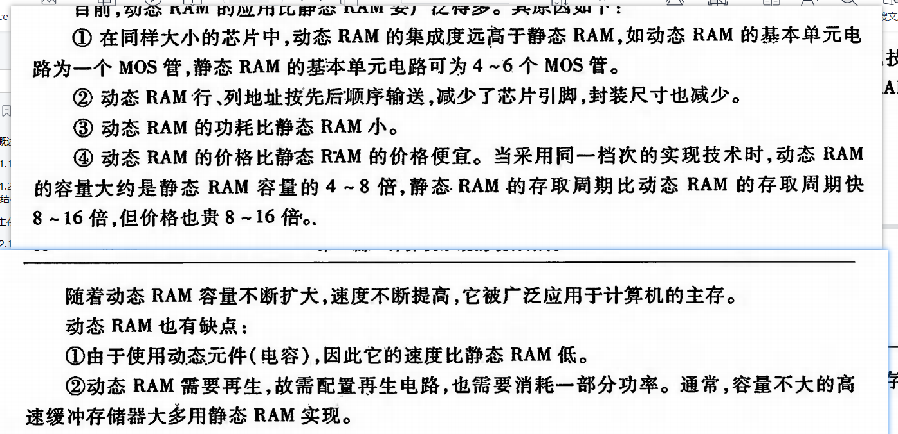

# 第七章 指令系统

## 机器指令

机器指令是计算机能够理解和执行的一种基本指令。它通常是以二进制代码表示的，直接被计算机硬件解释和执行。机器指令是构成程序的基本元素，计算机执行程序时，实际上是在按顺序执行一系列机器指令

### 指令的一般格式

计算机指令的一般格式因架构和指令集而异，但大多数指令都包含以下几个部分：

1. 操作码（Opcode）：操作码是指令的核心部分，它指示了计算机应执行的操作。操作码通常是一个固定长度的二进制字段，每个操作码对应一种特定的操作，如加法、减法、乘法、除法、逻辑运算等。
2. 操作数（Operands）：操作数是指令中需要进行操作的数据。操作数可以是寄存器、内存地址或立即数。指令可以包含一个或多个操作数，具体取决于操作的类型。
3. 寻址模式（Addressing Mode）：寻址模式描述了如何从指令中获取操作数。例如，立即寻址表示操作数是一个立即数，直接在指令中给出；寄存器寻址表示操作数存储在寄存器中；间接寻址表示操作数的地址存储在另一个寄存器或内存单元中。
4. 其他字段：根据具体的指令集和架构，指令可能还包含其他字段，如条件码、标志位、扩展位等。

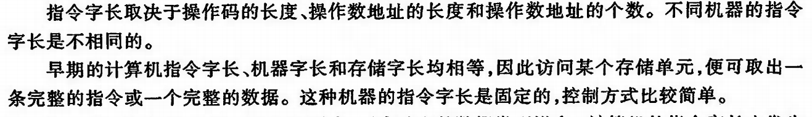

## 寻址方法

### 指令寻址

指令寻址是指计算机如何确定下一条指令的地址。这里的“指令寻址”可能涉及到程序计数器（Program Counter，PC）的更新和控制流指令。以下是一些常见的指令寻址方式：

1. 顺序寻址（Sequential Addressing）：程序计数器按顺序递增，指向下一条指令。这是最基本的指令寻址方式，通常用于顺序执行指令。
2. 跳转寻址（Jump Addressing）：程序计数器被设置为一个指令中给出的地址，从而实现无条件跳转。这种寻址方式常用于实现循环、子程序调用和返回等。
3. 条件跳转寻址（Conditional Jump Addressing）：根据某个条件（如标志寄存器的状态），程序计数器被设置为一个指令中给出的地址或顺序递增。这种寻址方式常用于实现条件分支和循环控制。
4. 间接跳转寻址（Indirect Jump Addressing）：程序计数器被设置为一个寄存器或内存单元中存储的地址。这种寻址方式实现了指针和引用的功能，可以用于实现动态跳转、函数指针等。(**地址中的地址**,也就是一个地址指向了指令的地址)
5. 返回寻址（Return Addressing）：程序计数器被设置为调用子程序时保存的返回地址。这种寻址方式常用于实现子程序调用的返回。
6. 中断寻址（Interrupt Addressing）：在中断发生时，程序计数器被设置为一个预先定义的中断处理程序的地址。这种寻址方式常用于实现中断处理和异常处理。

指令寻址方式决定了计算机如何确定下一条指令的地址。这些寻址方式与数据寻址方式共同构成了计算机指令的执行过程，影响着程序的控制流和数据处理能力。不同的计算机架构和指令集可能支持不同的指令寻址方式组合，以满足不同的应用需求。

### 数据寻址

寻址格式

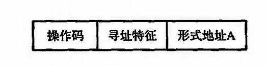

数据寻址是指计算机指令中如何确定操作数地址的方法。不同的计算机架构和指令集可能支持不同的寻址方式。以下是一些常见的寻址方式：

1. 立即寻址（Immediate Addressing）：操作数直接在指令中给出，不需要访问内存。这种寻址方式适用于常数和小值。
2. 寄存器寻址（Register Addressing）：操作数存储在寄存器中，指令中给出寄存器的编号。这种寻址方式速度快，因为寄存器是处理器内部的存储单元。
3. 直接寻址（Direct Addressing）：操作数的内存地址直接在指令中给出。这种寻址方式适用于访问全局变量和静态数据。
4. 间接寻址（Indirect Addressing）：操作数的内存地址存储在另一个寄存器或内存单元中。指令中给出该寄存器或内存单元的地址。这种寻址方式可以实现指针和引用的功能。
5. 基址寻址（Base Addressing）：操作数的内存地址由一个基址寄存器的值加上一个指令中给出的偏移量计算得出。这种寻址方式适用于访问数组和结构体等复合数据类型。**这个过程中基址寄存器里面的值是不能变的**
6. 变址寻址（Indexed Addressing）：操作数的内存地址由一个索引寄存器的值加上一个指令中给出的偏移量计算得出。这种寻址方式常用于循环和迭代操作。**这个过程中基址寄存器里面的值是可以变的**
7. 相对寻址（Relative Addressing）：操作数的内存地址由当前指令的地址加上一个指令中给出的偏移量计算得出。这种寻址方式常用于条件分支和跳转指令。
8. 堆栈寻址（Stack Addressing）：**操作数存储在堆栈中**，指令通过操作堆栈指针（如入栈、出栈）来访问操作数。这种寻址方式常用于函数调用和局部变量的管理。**本质也还是间接寻址**

## 指令设计考虑因素

在设计指令格式时，需要考虑以下几个关键因素：

1. 操作码（Opcode）：操作码需要足够长，以便表示足够多的指令。操作码的长度将影响指令集的大小和指令集的可扩展性。
2. 寻址模式（Addressing Modes）：需要考虑支持哪些寻址模式以满足不同类型的操作数访问需求。设计时应在功能丰富和复杂度之间进行权衡。
3. 操作数（Operands）：需要确定操作数的长度和表示方式。操作数的长度将影响数据处理的范围和精度。
4. 寄存器数量和寄存器宽度：需要确定寄存器文件的大小，以及每个寄存器的位宽。这会影响指令的编码方式以及处理器的性能和资源利用率。
5. 指令长度：需要确定指令的长度。较短的指令可以节省存储空间和带宽，但可能限制了操作码和操作数的表示范围。较长的指令可以提供更多的操作码和操作数表示范围，但可能增加存储和带宽需求。
6. 扩展性和兼容性：设计时需要考虑指令格式的扩展性，以便未来添加新的指令或修改现有指令。同时，也需要考虑与现有或其他指令集的兼容性。
7. 性能和功耗：需要考虑指令格式对处理器性能和功耗的影响。指令格式的设计应该有助于简化处理器的实现，提高执行效率并降低功耗。
8. 简单性和易用性：设计时需要权衡指令格式的简单性和易用性。简单的指令格式有助于降低处理器的实现复杂度和提高可靠性，但可能限制了功能的丰富性。

这些因素相互影响，设计指令格式时需要在各种需求之间进行权衡。不同的计算机架构和指令集可能采用不同的指令格式设计，以满足特定的应用场景和性能需求。

## RISC技术

RISC（Reduced Instruction Set Computer，精简指令集计算机）是一种计算机架构理念，其核心思想是使用较少的指令和简化的指令集来提高处理器性能。RISC架构的主要特点如下：

1. **指令集简化**：RISC采用较少的指令和寻址模式，降低了处理器实现的复杂性。
2. **固定长度指令**：RISC通常使用固定长度的指令，有助于简化指令解码和提高指令执行效率。
3. 加载/存储架构：RISC通常采用加载/存储架构，**即所有数据操作都是在寄存器之间进行**，**内存访问仅通过加载和存储指令完成**。这有助于简化指令和处理器实现。
4. 大量寄存器：RISC通常具有较多的通用寄存器，以减少对内存的访问需求，提高性能。
5. 单周期指令执行：RISC设计中的许多指令可以在一个时钟周期内完成执行，提高了处理器的吞吐量。

相比之下，CISC（Complex Instruction Set Computer，复杂指令集计算机）是另一种计算机架构理念。CISC架构的特点包括：

1. **复杂的指令集**：CISC包含大量的指令和寻址模式，以便支持更丰富的功能。
2. **变长指令**：CISC通常使用变长指令，可以节省存储空间，但可能增加指令解码的复杂性。
3. 内存操作：**CISC允许某些指令直接操作内存，而不仅仅是加载和存储**。
4. 多周期指令执行：**CISC中的许多指令可能需要多个时钟周期才能完成执行**。

RISC和CISC架构有各自的优缺点。RISC架构通过简化指令集和指令格式以提高性能，但可能牺牲了功能丰富性。CISC架构具有丰富的功能和灵活性，但可能导致处理器实现和性能方面的问题。这两种架构并非绝对的优劣之分，而是针对不同需求和应用场景所作的权衡。

随着技术的发展，RISC和CISC架构之间的界限逐渐模糊。许多现代处理器采用了混合架构，结合了RISC和CISC的优点。例如，许多现代处理器在内部采用RISC架构，但对外提供CISC兼容的指令集，从而兼顾了性能和兼容性。

## 习题

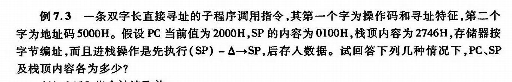

### 指令设计

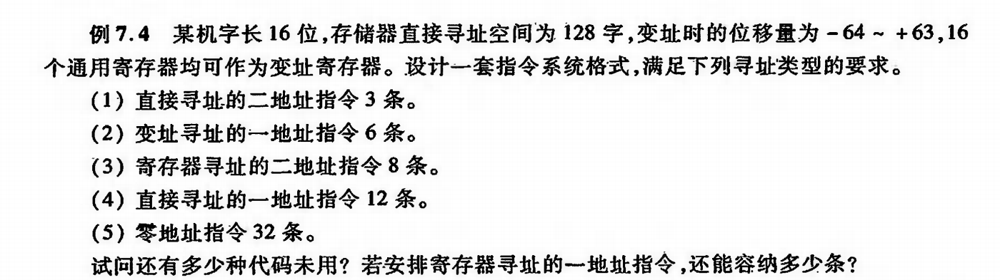

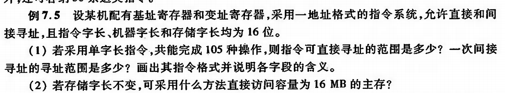

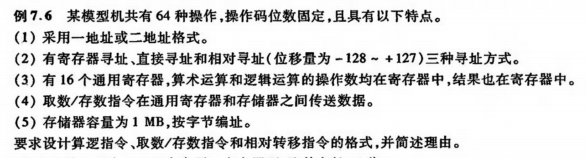

做这是设计指令的题目的时候,我们要注意他的操作码是定长还是变长,  指令字长是定长还是变长, 寻址方式有多少种等等,一般按照这种格式来设计

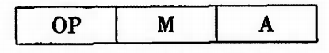

> A可能有很多,毕竟操作数又不止一个

op代表操作码,M代表寻址模式,A代表地址或者寄存器或者就是操作数

做上面这些道题的时候我们应该要注意这些单位,比如指令长度,机器字长,存储字长

## 总结

# BCD码

BCD码（Binary-Coded Decimal，二进制编码的十进制数）是一种将十进制数表示为二进制数的编码方法。在BCD编码中，每个十进制数字（0-9）都用一个4位的二进制数表示。这种编码方法使得二进制系统能够方便地表示和处理十进制数据。

BCD码的主要应用和优点如下：

1. 易于阅读和理解：与纯二进制表示相比，BCD码表示的十进制数更容易阅读和理解。这对于需要人与计算机之间直接进行数据交互的场景非常有用，例如显示器、计算器等。
2. 简化数据转换：BCD编码简化了十进制与二进制之间的转换过程。因为每个十进制数字都有一个固定的4位二进制表示，所以在将十进制数转换为BCD码或将BCD码转换为十进制数时，不需要复杂的算法，只需简单地映射即可。
3. 错误检测：BCD编码可以更容易地检测一些数据错误。例如，如果一个4位二进制数的值大于1001（即十进制的9），那么这个数就是一个无效的BCD码。这种错误检测能力有助于提高数据处理的可靠性。

然而，BCD编码也存在一些缺点，如存储和计算效率较低。由于每个十进制数用4位二进制表示，BCD码需要更多的存储空间来存储相同数量的数据。此外，在进行算术运算时，BCD编码需要特殊的算法和硬件支持，这可能导致运算效率低于纯二进制表示。

尽管如此，在某些应用场景中，BCD编码仍然非常有用，特别是在需要处理十进制数据或方便人类阅读的场合。