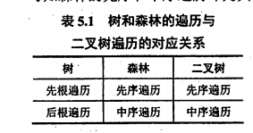

# 前言

趁着考研的机会,好好学一下,  所用语言是c/c++

我们在做题的时候不要钻牛角尖,  要根据书上的来,  比如对于单链表, 书上一般是默认只带有头指针,  比如说获取链表尾巴元素的时间复杂度就是O(n),不要钻牛角尖的以为可以自己设置一个尾指针, 然后时间复杂度就是O(1)  ,对你当然可以自己设计, 可是现在是在书上,理论

# 基本概念


**程序 = 数据结构 + 算法**

* 数据:  **数据是信息的载体**, 是描述客观事物属性的数,字符及能被输入到计算机中处理的符号.  **数据是计算机加工的原料**
* 数据元素: **数据元素是数据的基本单位, 通常作为一个整体进行考虑和处理, 一个数据元素是由多个数据项组成的**, 比如 一个学生就是一个数据元素  它由学号,姓名, 性别等数据项组成
* 数据项: **数据项是构成数据元素的不可分割的最小单位**
* 数据对象: **具有相同性质的数据元素的集合**
* 数据结构: **数据元素相互之间存在一种或多种关系的集合**
* 数据类型: 原子类型(值不可再分), 结构类型(值可以再分,类似结构体), 抽象数据类型(定义数据的逻辑结构与其相关操作), **抽象数据类型相当于定义了整个数据结构**

数据对象和数据结构的区别:   数据对象是**所有相同性质**的数据元素的集合   而且 数据结构是 **具有相同性质 且 相互之间有关系**的数据元素集合,   比如说  所有学生都在同一个数据对象里面,  但是排名前一百的学生在一个数据结构里面也就是线性表里面,  

## 数据结构的三要性

在计算机科学中，数据结构的三要素通常指：数据的逻辑结构、数据的存储结构（也称物理结构）以及数据的操作。

1. **数据的逻辑结构**：逻辑结构是指数据对象中数据元素之间的相互关系。**这个关系是对具体问题的抽象，与数据的存储无关**。根据元素之间的关系，逻辑结构可以分为线性结构、树结构、图结构以及集合。
   - **线性结构**：**数据元素之间存在一对一的关系**。例如：数组、链表、栈、队列等。
   - **树结构**：数据元素之间存在一对多的关系。例如：二叉树、B树、红黑树等。
   - **图结构**：数据元素之间存在多对多的关系。例如：图、网络等。
   - **集合**：**数据元素之间没有明显的关系**。
   
2. **数据的存储结构**：存储结构是指数据对象在计算机内存中的组织方式，**也称为物理结构**。主要有顺序存储和链式存储。
   - **顺序存储结构**：数据元素存储在连续的存储单元里，物理上的相邻也代表逻辑上的相邻。这种方式典型的如数组。
   - **链式存储结构**：数据元素可以存储在内存的任意位置，通过链接（如指针）来建立数据元素之间的逻辑关系。这种方式典型的如链表。
   - **索引存储结构**：索引存储结构是在存储元素信息的同时，还创建一种索引表，索引表中包含对主文件中数据元素的引用。通过索引，可以实现对数据的快速访问。(**索引表是一般是线性结构**, 一般有个键和值  键可以代表唯一的数据元素 值是数据元素的地址)
   - **散列存储结构**：散列存储，也叫哈希存储，它是根据元素的关键字直接进行访问的。通常会有一个哈希函数将关键字映射到一个地址上。
   
3. **数据的运算**：**这是定义在特定数据结构上的一系列处理数据的方法或者函数**，这些操作可以是查找、插入、删除、排序等。这些操作要满足可行性（即算法的正确性）和有效性（即算法的高效性）。  **运算的定义是针对逻辑结构, 运算的实现是针对存储结构**

这三者相互关联，逻辑结构决定了数据的运算，而存储结构则是逻辑结构和数据运算在计算机中的实现基础。理解并掌握这三个要素，是理解和应用数据结构的关键。

**一般,  只要逻辑结构 和 运算有一个不相同,  我们就认为两者是不同的数据结构**

## 算法

算法是**解决特定问题的一系列明确的执行步骤**。它是从输入开始，按照一定规则和步骤，经过有限次运算后，得到预期结果的过程。

算法具有以下五个基本特性：

1. **有穷性**：算法必须能在执行有限步骤之后结束，不能无限制地执行下去。

2. **确定性**：算法的每一步必须清晰明确，没有歧义, **对于相同的输入只能得到相同的输出**。

3. **可行性**：算法中描述的操作都是可以通过已经实现的**基本操作执行有限次**来实现。

4. **输入**：一个算法有零个或多个输入。

5. **输出**：一个算法至少有一个或多个输出，即算法的执行结果。

   

在计算机科学中，算法是非常重要的概念。一个好的算法不仅能正确解决问题，还应该尽可能地优化时间复杂度和空间复杂度，使得在处理大规模数据时仍能保持良好的性能。算法的设计和分析是计算机科学的核心内容之一，也是计算机程序设计的关键。

一个好的算法通常需要满足以下五个特性：

1. **正确性**：算法应能正确地解决所指定的问题，对于合法的输入数据，应能得到满足要求的输出结果。此外，对于非法的、异常的输入数据，算法应做出相应的处理。

2. **可读性**：算法应清晰、简洁，易于人理解，这样便于其他人员阅读、修改和维护。

3. **健壮性**：算法需要对各种异常输入或者错误情况进行有效处理，使其在面对这些情况时不会崩溃或产生未预期的结果。

4. **效率和存储量需求**：优秀的算法应具有尽可能低的时间复杂度和空间复杂度。在处理大量数据时，算法的效率尤为重要。同时，算法应尽量节省存储空间，减小对计算资源的消耗。

5. **可扩展性和可复用性**：一个好的算法应具有良好的扩展性，能处理比现有需求更大或更复杂的问题。同时，如果算法具有一定的通用性，那么在其他场景或问题中也可能复用，从而提高编程效率。

以上这些特性并不是孤立的，而是相互关联的。例如，为了提高效率，我们可能需要牺牲一些可读性；为了增加健壮性，我们可能需要增加一些错误处理的代码，这可能会影响效率。因此，在设计算法时，我们需要根据具体情况进行权衡和选择。

## 时间复杂度

算法的时间复杂度是一种**衡量算法运行时间长短的量化指标**。它反映了随着输入数据规模的增大，算法执行时间的增长趋势。通常，**我们关注的是最坏时间复杂度**，因为它代表了算法在最糟糕情况下的执行时间。

时间复杂度的计算通常关注的是算法中基本操作的执行次数，而忽略了具体的硬件条件和运行环境等因素。我们通常用大O符号（O）来表示时间复杂度，**大O符号表示的是问题规模n与算法执行时间增长率的上界关系**, **只保留了最高阶的部分,系数也不考虑**。

下面是一些常见的算法时间复杂度，从低到高排列：

1. 常数阶O(1)
2. 对数阶O(logn)
3. 线性阶O(n)
4. 线性对数阶O(nlogn)
5. 平方阶O(n^2)
6. 立方阶O(n^3)
7. K次方阶O(n^k) (k>3)
8. 指数阶O(2^n)
9. 阶乘阶O(n!)
10. 双阶乘阶O(n!!)
11. 指数阶O(n^n)

理解时间复杂度对于编程和算法分析都非常重要，它可以帮助我们预测算法的运行效率，并在多种算法之间做出合理的选择。

**这里需要注意的是  无论时间复杂度是多少,  问题规模是 n 而不是 O(n)**, 问题规模是指n的数量

## 空间复杂度

空间复杂度是对一个算法在运行过程中**临时占用存储空间大小的量度**，它也是算法效率评价的重要指标之一。空间复杂度过高的算法可能会导致使用的内存超出硬件限制，导致程序无法正确运行。

空间复杂度的计算同样也是基于大O符号表示的，表示随着数据规模的增长，算法的存储空间需求如何变化。


# 线性表(有序表)

线性表是一种基本的数据结构，**它是由n个具有相同特性的数据元素组成的<span style="color:red">有限序列</span>**。

线性表的特点是数据元素之间存在一对一的线性关系，也就是除首尾元素外，其他元素都有<em style="color:red">唯一的前驱和后继</em>。

线性表是一种基本的数据结构，具有以下几个主要特点：

1. **有限性**：线性表是由有限个数据元素组成的。

2. **有序性**：线性表中的元素之间有明确的前后顺序关系。每个元素（除第一个元素外）都有唯一的直接前驱，每个元素（除最后一个元素外）都有唯一的直接后继。

3. **同质性**：线性表中的所有元素都具有相同的数据类型或结构。

4. **相互独立**：线性表中的元素之间是相互独立的，元素的变化只与其本身有关，不受其他元素的影响。

5. **可变性**：线性表可以进行插入、删除、查找等操作，元素的个数和内容可以改变。

线性表有两种常见的实现方式：数组和链表。

1. **数组**：数组是一种连续的存储结构，它的特点是支持随机访问，也就是说，可以在常数时间内访问任何位置的元素。但是数组的大小在创建时就已经固定，所以不能动态改变。此外，数组中的元素在内存中是连续存储的，所以在插入和删除元素时需要移动大量的元素，效率较低。

2. **链表**：链表是一种非连续的存储结构，它的特点是插入和删除操作的效率很高，只需要改变一些指针的指向就可以了。但是链表不支持随机访问，访问某个元素需要从头开始遍历链表，所以访问效率较低。链表可以动态改变大小，更加灵活。

线性表是数据结构中的基础，许多复杂的数据结构，如栈和队列，都是基于线性表实现的。理解线性表的性质和操作对于深入理解和应用数据结构非常重要。

## 顺序表

顺序表是一种常见的线性表实现方式，它将元素存储在一段连续的存储单元里，每个元素所占用的存储单元相同，元素的逻辑顺序与其在存储单元中的物理顺序一致。也就是说，如果我们知道了某一个元素的存储地址，那么我们就可以直接计算出其它元素的地址，这就是顺序表支持随机访问的原因。

**顺序表的基本操作包括：**

1. **插入**：在顺序表的特定位置插入元素。若插入位置后有元素，则需要将这些元素后移，为新元素腾出空间。

2. **删除**：删除顺序表中的某个元素。若删除位置后有元素，则需要将这些元素前移，填补空白。

3. **查找**：按照元素值或者位置进行查找。

4. **修改**：修改顺序表中某个位置的元素。

**顺序表的优点：**

1. 访问速度快，支持随机访问，时间复杂度为O(1)。

2. 结构简单，容易实现。

**顺序表的缺点：**

1. 插入和删除操作需要移动大量元素，时间复杂度为O(n)。

2. 需要一块连续的存储空间，可能会造成空间的浪费。如果存储空间不够，需要重新分配空间，操作复杂。

在实际使用中，顺序表适用于元素数量固定，且主要进行查找操作的场景。如果需要频繁地进行插入和删除操作，可能链表是更好的选择。


## 链表

### 头结点

根据是否包含头节点，链表可以分为带头节点的链表和不带头节点的链表。

带头节点的链表是指链表中的第一个节点（头节点）不存储实际的数据，只是起到一个标记的作用，方便链表的操作。

与之相反，不带头节点的链表中的第一个节点直接存储数据，并指向下一个节点。

带头节点的链表有以下优点：

1. **统一了插入和删除操作**：在带头节点的链表中，插入和删除操作可以统一进行，不需要特殊处理空链表或者头部和尾部的情况。
2. **方便处理空链表**：头节点可以作为一个特殊的标记，用来表示链表为空，这样在处理空链表时不需要额外的判断。
3. **便于链表的遍历和返回**：有了头节点，可以更容易地进行链表的遍历和返回链表的起始位置。

总的来说，带头节点的链表在操作上更加方便和统一，使得代码的编写和理解更加简单。但是，头节点也会占用一定的额外空间。是否使用头节点，取决于具体的应用场景和设计考虑。

### 头插法 和 尾插法

在链表的创建过程中，"头插法"和"尾插法"是两种常见的插入方法，用于向链表中添加新的元素。这两种方法的主要区别在于新元素添加到链表的位置。

**头插法**

头插法是将新的元素添加到链表的开头。具体操作如下：

1. 创建新的节点，并将待插入的数据放入节点中。
2. 将新节点的指针指向当前的头节点。
3. 更新头节点，使其指向新的节点。

这样，每次插入的新节点都会成为链表的头节点。因此，使用头插法创建的链表中元素的顺序与输入的顺序是相反的。

**尾插法**

尾插法是将新的元素添加到链表的末尾。具体操作如下：

1. 创建新的节点，并将待插入的数据放入节点中。
2. 找到链表的尾节点，将尾节点的指针指向新节点。
3. 更新尾节点，使其指向新的节点。

这样，每次插入的新节点都会成为链表的尾节点。因此，使用尾插法创建的链表中元素的顺序与输入的顺序是相同的。

这两种插入方法各有优缺点，具体应用哪种方法取决于具体需求。**头插法的操作更简单，但会改变元素的原始顺序**；**尾插法可以保持元素的原始顺序，但需要额外的操作来维护尾节点。**


## 循环链表


# 栈 队列  数组

## 前言

本章 通常以选择题的形式考查,  **栈和队列的实现是基于有序表的, 而且他们是受限的线性表,比如栈只能操作一端**,因此有顺序表和链表两种实现

## 栈

### 定义

栈（Stack）是一种特殊的线性数据结构，它遵循 **LIFO（Last In First Out，即后进先出）**的原则。也就是说，最后一个添加进来的元素会被首先移除。

栈的主要操作包括：

1. **Push**：添加元素到栈顶。
2. **Pop**：移除栈顶元素。
3. **Top/Peek**：查看（但不移除）栈顶元素。
4. **isEmpty**：检查栈是否为空。

栈在许多领域都有应用，例如在算法（如深度优先搜索，括号匹配），操作系统（如内存管理，函数调用堆栈），编程语言的实现（如递归函数的实现）等方面都有重要应用。

### 实现

#### 顺序表实现:

* 元素为空的判断: 栈顶指针top == -1
* 入栈  st[++top] = v
* 出栈  v = st[top--]
* 查看栈顶元素  v = st[top]

#### 单向链表实现(不带头结点):

* 元素为空的判断: 栈顶指针head == NULL
* 入栈  node->next = head ;  head = node
* 出栈  v = head.v; node = head; head=head->next; free(node)
* 查看栈顶元素  v = head.v


### 共享栈

共享栈是一种特殊的栈结构，它允许在同一个数组中实现两个栈。这种结构是通过将一个数组的两端分别作为两个栈的栈底，然后让这两个栈向中间生长来实现的。这种设计有效地利用了数组空间，避免了单栈可能导致的空间浪费。

在共享栈的实现中，通常有如下几个主要的操作：

1. **初始化**：分别设置两个栈的栈底，一个在数组的起始位置，一个在数组的末尾位置。
2. **push**：向指定的栈中添加元素。如果添加元素的栈是从数组起始位置开始的，那么新元素应被添加到当前栈顶的下一个位置；如果添加元素的栈是从数组末尾位置开始的，那么新元素应被添加到当前栈顶的前一个位置。
3. **pop**：从指定的栈中删除元素，就是将对应栈的栈顶指针向栈底方向移动一位。
4. **isEmpty**：检查指定的栈是否为空，只需要查看该栈的栈顶指针是否指向其栈底即可。

需要注意的是，当两个栈的栈顶指针相遇时，说明数组已经满了，不能再向任何一个栈中添加元素。判满条件是 topb - topa == 1

**共享栈的一个主要优点是它能有效地利用空间，避免了一端空闲，另一端溢出的情况**

### 做题方法

技巧

1. **n个元素依次进栈 得到出栈顺序个数函数** $ f(n) = \frac{C{n \choose 2n}}{{n + 1}} $

2. **出栈顺序 应该满足这样一个要求,  一个元素前面的元素如果 没有在序列前出现,  那么他们在后面出现的时候 顺序不能改变**, 这个其实就满足了, 后入栈的元素 一定要早出于 **先入栈而且还存在与栈中的元素**, 比如入栈顺序是 abcdef  这个时候 先出栈了一个 f 这个时候, 你会发现,  后面的元素顺序已经确定了 就是  fedcba 如果出栈了  af 那么 顺序就是  afedcb
3. <em style="color:red">根据第二条,  我们可以通过出栈序列计算出栈需要最小存储空间  比如入栈序列为  abcdefg,  出栈序列为 bdcfeag  我们只需要看序列当前元素后面有多少个比自己早入栈的元素: 1 2 1 2 1 0 0   因此最小存储空间为 2+1 = 3  这是因为当前比自己早入栈的元素肯定在栈中</em>

注意点:

* 顺序表中,  数组尾巴才是栈顶,切记,  所以打印数组元素的时候,  最后一个元素才是栈顶元素

## 队列

队列（Queue）是一种特殊的线性数据结构，它遵循 FIFO（First In First Out，即先进先出）的原则。也就是说，最先添加进来的元素会被首先移除。

队列的主要操作包括：

1. **Enqueue**：在队列尾部添加一个元素。
2. **Dequeue**：从队列头部移除一个元素。
3. **Front/Peek**：查看（但不移除）队列头部的元素。
4. **IsEmpty**：检查队列是否为空。
5. **IsFull**：检查队列是否已满。

队列在许多领域都有应用，例如在算法（如宽度优先搜索，缓存实现），操作系统（如任务调度，打印任务队列），编程语言的实现（如事件队列）等方面都有重要应用。

队列也有多种不同的类型，包括但不限于：
- **线性队列**：最基本的队列，按照FIFO原则进行操作。
- **循环队列**：在物理存储上是线性的，但逻辑上头尾相连形成一个环状结构，能更有效地利用存储空间。
- **优先队列**：每个元素都有一个优先级，元素出队的顺序由它们的优先级决定。
- **双端队列**（deque）：既可以在队头插入和删除元素，也可以在队尾插入和删除元素。

### 实现

#### 顺序表:

* 判空: front == back
* 入队: q[back++] = v
* 出队: v = q[front++]

#### 改进顺序表为循环队列

首先，对于队列的长度n，我们需要分配一个长度为n+1的数组来存储队列的元素，**留出一个空间作为“保护位”**。这样是为了区分队列为空和队列为满的情况。

假设我们有一个大小为n+1的数组q，初始时，队头和队尾指针front和back都指向0。那么循环队列的操作可以如下定义：

1. **判空**：当 front == back 时，队列为空。
2. **判满**：当 (back + 1) % (n + 1) == front 时，队列为满。这里用到了模运算来实现环状的逻辑结构。
3. **入队**：先判断队列是否满，如果不满，先在队尾位置存放新的元素：q[back] = v，然后更新队尾指针：back = (back + 1) % (n + 1)。
4. **出队**：先判断队列是否为空，如果不空，取出队头元素：v = q[front]，然后更新队头指针：front = (front + 1) % (n + 1)。

**这就是将顺序表改进为循环队列的一种常见方法，它通过牺牲一个数组单元的存储空间，使得队列的判满和判空操作变得简单，并且避免了数组元素的移动。**

#### 链表

* 判空: front == back 
* 入队: back->next = node; back = node
* 出队: v = front->v; node = front;  front = front->next; free(node);

### 双端队列

双端队列（Double Ended Queue，简称 Deque）是一种具有队列和栈的性质的数据结构。双端队列中的元素可以从两端弹出，其限定插入和删除操作在表的两端进行。双端队列可以在队列两端入队和出队。

输入受限双端队列:  在双端队列上删除了新增的输入端

输出受限双端队列:   在双端队列上删除了新增的输出端

### 做题方法

* **在循环顺序队列中, 要特别注意题目所指如何解决判满和判空操作  一般我们默认判空值rear == front  判满是  (rear+1) % Maxsize == front   , 但是题目有时不是如此,比如队头指针是元素头指针的前一个元素  这样 判空就是 (front +1) % Maxsize == rear  判满操作就是 rear == front **  还要注意队头指针和队头元素的区别,  它两位置是可能不一样的
* 对于**输出受限的队列来说**,  看有哪些出队顺序不可能是他产生的方法是:  将这个出队顺序放入到输出受限队列中, 看他是否能够输入元素产生这样一个队列,  比如  a b c d e  依次 入队 ,   对于 d b a c e 这个队列  它是能够产生的   先放入 a, 左b 右c 左d 右e,  而对于 d b c a e 它是不能够产生的, 因为左边出现了 b 在 c 之前,  总结:  **对于输出受限队列来说,  从第一个输入的元素往两边依次遍历过去,  元素的入队顺序是不能变的**,  对于这个总结, 我们就可以自己产生输出受限队列不可能产生的队列:   bdfaec  baced  decab(a的左边,e 出现在了d的左边)


## 栈和队列的应用

### 括号匹配


### 表达式求值

在数学和计算机科学中，表达式（expression）是符号和运算符的有序组合，表示一种计算。根据运算符的位置，我们通常可以将表达式分为中缀表达式，前缀表达式（或叫波兰式）和后缀表达式（或叫逆波兰式）。

**中缀表达式（Infix Expression）**：
在中缀表达式中，运算符位于操作数之间。这是我们日常生活中最常用的表达式形式。例如：`2 + 3 * 4`。

**后缀表达式（Postfix Expression 或 Reverse Polish Notation）**：
在后缀表达式中，运算符位于所有操作数的后面。例如，中缀表达式 `2 + 3 * 4` 对应的后缀表达式为 `2 3 4 * +`。

转换中缀表达式为后缀表达式的一个常见方法是使用一个栈来保存运算符，这个方法通常被称为“调度场算法”。

这两种表达式方式的一个重要区别是，在中缀表达式中运算符有优先级，需要用括号来改变运算顺序，而后缀表达式则不需要。这使得后缀表达式在计算机中处理起来更为方便，因为计算后缀表达式只需从左到右扫描一遍，不需要记住运算符的优先级，也不需要处理括号。


**中缀表达式 转后缀表达式**

例如:  A+B*(C-D) -E/F

一个用于存放操作符栈 st_op

一个用于存放后缀表达式的队列 q

依次遍历中缀表达式   A 入队列,  + 入栈;  B入队列;  *入栈;  (入栈; C入队列;  - 入栈; D 入队列; )将栈中(之前的元素全部出栈入队列 -入队列, 弹出(; - 将前面全部操作符出栈 有 * +,  E入队列; /入栈; F入队列; 弹出全部操作符到队列

A B C D - * + E F / -  

上面就涉及到了优先级的问题, 当前栈顶优先级比自己高, 就弹出它放入到队列

### 递归


递归是一种编程技术，其中一个函数通过直接或间接地调用自身来解决问题。**递归函数通常被用来解决可以通过更小子问题的解来找到原问题解的那种问题。**

一个递归的实现通常包括以下两个主要部分：

1. **基本情况也叫边界条件（Base Case）**：这是递归调用链条中的最小问题，可以直接解决而不需要进一步的递归调用。基本情况的处理是递归函数正确工作的关键。
2. **递归调用（Recursive Case）**：在递归调用部分，函数会将问题分解为更小的子问题，并通过递归调用自身来解决这些子问题。

在编写递归函数时，需要特别注意避免无限递归，也就是说，我们需要保证在有限步骤内，每个递归调用都能到达一个基本情况。

递归在算法设计中是一个非常强大的工具，可以用来解决很多问题，比如搜索问题，排序问题（例如快速排序和归并排序），动态规划问题等。同时，很多数据结构，比如树和图，也有很多递归的操作。

### 队列在计算机系统中的应用

队列是计算机科学中一个非常重要的数据结构，它在各种不同的计算机系统中都有着广泛的应用。下面是一些常见的应用场景：

1. **操作系统**：在操作系统中，多个进程可能会共享一个单一的处理器。操作系统使用一个进程队列来管理这些进程，按照一定的调度策略（比如先进先出、优先级调度等）来决定下一个要运行的进程。

2. **打印任务管理**：在一个网络打印机中，打印任务会被放入一个队列中，打印机会按照队列中的顺序（通常是先进先出）依次打印。

3. **网络请求处理**：在Web服务器中，服务器会用一个队列来管理来自客户端的请求，按照队列的顺序依次处理这些请求。当服务器的处理能力有限时，队列可以用来平衡请求的处理速度和请求的到达速度，防止服务器被过多的请求压垮。

4. **消息队列**：在分布式系统中，消息队列是一种常见的数据交换方式。它允许不同的系统或者服务之间异步地交换信息。每个发送的消息都会被放入队列中，接收者可以从队列中取出并处理消息。

5. **图形化用户界面**：在图形用户界面中，事件（比如点击、按键、鼠标移动等）会被放入一个事件队列中，然后按照队列的顺序被处理。这样可以确保事件的处理顺序与事件的发生顺序一致。

6. **数据缓冲**：队列也常用于数据的缓冲，例如，在I/O操作，网络传输，生产者/消费者问题中，都可能使用队列作为数据的缓冲结构。

这些仅仅是队列在计算机系统中应用的一部分例子，队列的应用场景非常广泛。

## 数组和特殊矩阵

矩阵在计算机图形学和工程计算中有举足轻重的地位, 在数据结构中如何用最小的存储空间来存储矩阵变的格外重要.

### 数组

数组是相同元素类型构成的有限序列, 数组是线性表的推广

数组是一种基本的数据结构，用于存储同一类型的连续元素。以下是关于数组的一些基本知识：

**定义与特性**：

1. **连续存储**：数组中的元素在内存中是连续存储的，这意味着数组的每个元素都紧接着前一个元素存储。这使得可以通过基地址和偏移量快速定位和访问数组中的任意元素。

2. **固定大小**：在大多数编程语言中，数组在创建时需要指定大小，且之后无法改变。

3. **索引访问**：数组中的每个元素都可以通过索引（通常是整数）来访问，这通常是从0开始的。

**常见操作**：

1. **读取**：通过索引来读取元素，这是一个常数时间的操作。

2. **更新**：通过索引来更新元素，这也是一个常数时间的操作。

3. **搜索**：查找一个特定的元素在数组中的位置。在无序数组中，这通常需要遍历整个数组，所以时间复杂度是O(n)。在有序数组中，可以使用二分搜索，时间复杂度是O(log n)。

4. **插入和删除**：在数组的末尾插入或删除元素是一个常数时间的操作。但在数组的开头或中间插入或删除元素需要移动元素，所以时间复杂度是O(n)。

**应用场景**：

1. **存储数据**：数组是存储和处理大量数据的基础，例如图像处理、数值计算等。

2. **查找表/映射**：如果关键字是小整数，数组可以作为查找表或映射，通过关键字直接访问元素。

3. **实现其他数据结构**：数组是许多其他数据结构的基础，例如栈、队列、堆、哈希表等。

**注意事项**：

1. **越界问题**：由于数组的大小是固定的，所以访问数组时需要确保索引不越界。

2. **内存利用**：如果数据的数量或大小有大的变化，可能需要动态的数据结构，例如链表或动态数组，以更有效地使用内存。

3. **多维数组映射方法**:  按行优先和按列优先, 需要注意区别

### 特殊矩阵的压缩

对于矩阵压缩公式来说,  将矩阵坐标转化为数组坐标,  我们首先计算当前坐标对应的元素个数为n,  然后矩阵坐标是否可以从0开始, 如果是从0开始那么对应数组坐标就是  n  , 否则就是 n - 1(默认数组下标从0开始),   **还要注意数组下标是否从0开始**

#### 对称矩阵

**对称矩阵**:  上三角和下三角元素相同, 因此我们可以只存放下三角和主对角线的元素

用一个数组b来存放(下标从0开始)

获取 a(i,j)元素的公式为: 

a(i,j) = b[k]  其中  当i>=j 时 k = i\*(i-1)/2 + j-1  当 i<j 时  k = j\*(j-1) /2+ i-1


#### 三角矩阵

**上三角元素全部相同,下三角不同矩阵压缩**:   只需要先存储下三角, 然后再存放上上三角一个元素就行, 总共 存放n(n+1)/2 +1 个元素

a(i,j) = b[k] 其中当i>=j 时 k = i\*(i-1)/2 + j-1  当 i<j 时  k = n(n+1)/2

**下三角元素全部相同,上三角不同矩阵压缩**: 

a(i,j) = b[k] 其中当i>j 时 k = n(n+1)/2, 当 i<=j 时   k = (2*n-i+2)\*(i-1)/2 + j-i 

#### 三对角矩阵

三对角矩阵是一种特殊的矩阵，它只有主对角线上的元素以及主对角线两侧的元素（也就是对角线上的元素和对角线上下一行和上一列的元素）是非零的，其他位置的元素都是零。

假设我们有一个三对角矩阵，我们可以使用一个一维数组来存储非零元素，以节省存储空间。对于三对角矩阵，我们可以定义如下寻址公式（下标从0开始）：

设矩阵元素 a[i][j] 存在数组 b 中的位置 k，那么我们有：

```
b[k] = a[i][j] 其中 k = 2*i + j - 3 
```

已知k能够推出i和j   i = (k+1)/3+1 j = k-2*i+3  这里的除法是c语言里面的取整除法

#### 稀疏矩阵

**矩阵中非零元素的个数 $t$, 相对矩阵元素的个数 $s$ 来说非常少, 即 $s \gg t$ 的矩阵称为稀䟽矩阵**。 例如, 一个矩阵的阶为 $100 \times 100$, 该矩阵中只有少于 100 个非零元素。
若采用常规的方法存储稀疏矩阵, 则相当浪费存储空间, 因此仅存储非零元素。但通常非零 元素的分布没有规律, 所以仅存储非零元素的值是不够的, 还要存储它所在的行和列。因此, 将非零元素及其相应的行和列构成一个三元组 (行标, 列标, 值),。然后按照某种 规律存储这些三元组。稀疏矩阵压缩存储后便失去了随机存取特性。

**十字链表法存储**

十字链表是一种存储稀疏矩阵的方法，特别适合于非零元素分布比较均匀的稀疏矩阵。这种方法既可以快速访问任一元素，又可以快速对任一元素进行插入或删除操作。

在十字链表中，每个非零元素都对应一个结点，每个结点有5个字段：行、列、值、行的下一个元素、列的下一个元素。整个矩阵还有两个额外的头结点数组，分别表示每行和每列的第一个元素。

具体来说，设稀疏矩阵的行数为m，列数为n，那么十字链表包含如下内容：

1. 一维数组row[m]，表示m行的头结点，其中row[i]指向第i行的第一个非零元素。
2. 一维数组col[n]，表示n列的头结点，其中col[j]指向第j列的第一个非零元素。
3. 非零元素的结点，包含5个字段：行、列、值、行的下一个元素、列的下一个元素。

十字链表法优点是在查找元素、插入元素和删除元素时，既可以沿着行方向操作，也可以沿着列方向操作。缺点是存储空间较大，因为每个非零元素都需要存储额外的信息（行、列、下一个行元素、下一个列元素）。

### 总结

一定要记得这几个公式,  这样我们就能以不变应万变,   我们的公式 都是基于:  矩阵下标从1开始,  存放数组下标从0开始,  无论它题目从什么开始,  按行或者按列  或者上三角下三角,  我们都能转换到这几个公式上来

对称矩阵按照下三角按行存储   ==  **对称矩阵按照上三角按列存储 交换i j位置**
$$
k= \begin{cases}\frac{i(i-1)}{2}+j-1, & i \geqslant j \text { (下三角区和主对角线元素) } \\ \frac{j(j-1)}{2}+i-1, & \left.i<j \text { (上三角区元素 } a_{i j}=a_{j i}\right)\end{cases}
$$
对称矩阵按照上三角按行存储 ==  **对称矩阵按照下三角按行存储 交换i j 位置**
$$
k= \begin{cases}\frac{(i-1)(2 n-i+2)}{2}+(j-i), & i \leqslant j \text { (上三角区和主对角线元素) } \\ \frac{(j-1)(2 n-j+2)}{2}+(i-j), & i>j \text { (下三角区元素) }\end{cases}
$$
三角矩阵按照上三角按行存储 
$$
k= \begin{cases}\frac{(i-1)(2 n-i+2)}{2}+(j-i), & i \leqslant j \text { (上三角区和主对角线元素) } \\ \frac{n(n+1)}{2}, & i>j \text { (下三角区元素) }\end{cases}
$$


三对角矩阵

 3 条对角线上的元素 $a_{i j}(1 \leqslant i, j \leqslant n$, $|i-j| \leqslant 1)$ 在一维数组 B 中存放的下标为 $k=2 i+j-3$ 。(**可以理解为 2*(i-1) + j, 将前面所有行的主对角线右边的元素移动到本行的前面, 填充变成了一行,  所以前面每行只剩2个元素**)

反之, 若已知三对角线矩阵中某元素 $a_{i, j}$ 存放于一维数组 B 的第 $k$ 个位置, 则可得 $i=\lfloor(k+1) /$ $3+1\rfloor, j=k-2 i+3$ 。例如, 当 $k=0$ 时, $i=\lfloor(0+1) / 3+1\rfloor=1, j=0-2 \times 1+3=1$, 存放的是 $a_{1,1}$; 当 $k=2$ 时, $i=\lfloor(2+1) / 3+1\rfloor=2, j=2-2 \times 2+3=1$, 存放的是 $a_{2,1}$; 当 $k=4$ 时, $i=\lfloor(4+1) / 3+1\rfloor$ $=2, j=4-2 \times 2+3=3$, 存放的是 $a_{2,3}$ 。

# 串

## 前言

大纲只要求掌握字符串的模式匹配,  我们要重点掌握kmp算法的原理以及next数组的推理过程

## 定义

串是由零个或者多个字符组成的有限序列,  串中任意多个连续的字符组成的子序列称为子串

两个串的长度,以及内容相等,那就说明两个串相等

## 串的模式匹配

这个通常是定位子串在主串中出现的位置

### 暴力匹配

假设 子串长度为 l 主串长度为 L   依次枚举主串中从当前下标开始连续的l个元素是否和子串相等, 这个效率太低下了 时间复杂度为 O(mn)

### kmp算法

我们发现暴力匹配的缺点就是,  当 子串中一个字符和主串中的不相同的时候, 就会抛弃掉所有已经匹配好的字符串, 然后再从子串 和 主串的下一个位置重新开始匹配(也就是回溯到子串开始位置, 主串当次匹配的起始位置的下一个位置),  所以这样就是效率低下的原因,  我们不妨来分析一下, 如果当前子串的字符和主串的字符不相同,  我们可以怎么样选择,   <em style="color:red">如果当前主串这个字符有可能成功的被匹配,  那么它一定只可能出现在子串的前面位置了</em>, 这个应该比较好理解吧?  如果是出现在后面的话, 那就完全不可能出现当前和子串不匹配的情况 ,     既然它只可能出现在子串的前面位置了,   <em style="color:red"> 我们完全可以不用回溯主串匹配的位置,  我们只需要将 当前子串匹配位置的移动到 "下一个可能匹配成功的位置" </em>   就是说,  如果当前主串这个字符想要在前面的子串中被匹配成功,  那么它前面一定有**0个或者更多个字符记做n个**被匹配成功了,  我们只需要将子串匹配位置移动到 n的位置就行了继续开始匹配,    所以我们现在要做的事情就是,  记录如果当前匹配失败了,  要移动到哪个位置就行了,  也就是next数组

补充一下:   有人可能就会有疑惑了,  你怎么保证你没有忽略掉正确答案?   是的,细心的人就发现了,  我们这次移动没有回溯主串, 这样势必抛弃了不少不可能的匹配,   证明如下:

如果匹配失败,  如果这个字符不会出现在匹配序列中, 那么它前面的 l-1 个元素都不可能了,  如果它能够出现在 匹配序列中,  利用已经匹配好的序列信息, 往回看,  这个匹配序列最长的前缀和后缀相等的长度是多少,  这就是它下一次该重新匹配的位置,因为我们**要尽可能的保留前面匹配信息的长度**,这样才不会漏掉可能匹配的序列, 重复如此, 直到当前字符匹配成功,或者没有成功,那就从主串当前位置下一个位置继续匹配.

#### next 数组

找到当前子串字符前面序列的 最长 前缀和后缀相同的 长度, next 数组就记录这个值

求解思路

* 初始化, 第一个元素下标 0 它如果匹配失败, 就应该去-1(也就是当前这个字符不可能出现在匹配序列中)
* 第 i + 1个位置的 next数组值,  是由 前 i 个序列字符 的最长前缀和后缀决定的,  因此 next[i+1] = j+1 
* 如果 出现了 j == -1,  那就说明 这个字符根本就不可能是最长后缀,  如果跟它匹配失败, 就要重新从 第一个子串开始

看代码吧

```c
void getNext(string &str, vector<int> &next)
{

    int i = 0, j = -1;
    int len = str.length();

    // 第0个字符都匹配失败的话, 就是退到-1了
    next.push_back(-1);

    // 由于next[i+1] 的值是由前i个字符决定的, 因此, 我们只需要将i计算到  len-2
    while (i < len - 1)
    {
        // next[i+1] 的值是由前i个字符决定的, j==-1其实也是一种 str[i] == str[j] 只不过str[-1] 是一种不存在的存在
        if (j == -1 || str[i] == str[j])
        {
            // 由于str[i] == str[j]  所以 next[i+1] = j+1  也就是 如果当前元素匹配失败, 应该要回退到j+1这个位置继续匹配
            ++i;
            ++j;
            next.push_back(j);
        }
        else
        {
            // 如果str[i] != str[j]  就要去找next[j] 看他们是否相等
            j = next[j];
        }
    }
}
```


#### 匹配算法

```c
#include <iostream>
#include <vector>
#include <string>
using namespace std;

void getNext(string &str, vector<int> &next)
{

    int i = 0, j = -1;
    int len = str.length();

    // 第0个字符都匹配失败的话, 就是退到-1了
    next.push_back(-1);

    // 由于next[i+1] 的值是由前i个字符决定的, 因此, 我们只需要将i计算到  len-2
    while (i < len - 1)
    {
        // next[i+1] 的值是由前i个字符决定的, j==-1其实也是一种 str[i] == str[j] 只不过str[-1] 是一种不存在的存在
        if (j == -1 || str[i] == str[j])
        {
            // 由于str[i] == str[j]  所以 next[i+1] = j+1  也就是 如果当前元素匹配失败, 应该要回退到j+1这个位置继续匹配
            ++i;
            ++j;
            next.push_back(j);
        }
        else
        {
            // 如果str[i] != str[j]  就要去找next[j] 看他们是否相等
            j = next[j];
        }
    }
}

int funcKMP(string mainstr, string substr)
{

    vector<int> next;
    getNext(substr, next);

    int i = 0, j = 0; // 这里的j只需要从0 开始, 它是代表子串的位置, 而不是回退的位置, 在求next算法中 j是代表回退的位置
    int len = mainstr.length();
    int len1 = substr.length();
    while (i < len)
    {
        if (j == -1 || mainstr[i] == substr[j])
        {
            ++i;
            ++j;
        }
        else
        {
            j = next[j];
        }

        if (j == len1)
        {
            return i - j;
        }
    }
    return -1;
}

int main()
{
    string mainstr = "abaabcaba";
    string substr = "a";

    cout << funcKMP(mainstr, substr) << endl;
}
```


#### next 数组的优化

对于  s[j] == s[next[j]] 的情况,   如果主串 i 位置  和 子串 j位置匹配失败了,  那么 势必在 主串位置  和 子串 next[j] 位置也会失败, 所以 我们需要优化一下next数组  如果 第i位置的下一个位置还和自己相等,  就让next[i] = next[j]

```c
void getNext(string &str, vector<int> &next)
{

    int i = 0, j = -1;
    int len = str.length();

    // 第0个字符都匹配失败的话, 就是退到-1了
    next.push_back(-1);

    // 由于next[i+1] 的值是由前i个字符决定的, 因此, 我们只需要将i计算到  len-2
    while (i < len - 1)
    {
        // next[i+1] 的值是由前i个字符决定的, j==-1其实也是一种 str[i] == str[j] 只不过str[-1] 是一种不存在的存在
        if (j == -1 || str[i] == str[j])
        {
            // 由于str[i] == str[j]  所以 next[i+1] = j+1  也就是 如果当前元素匹配失败, 应该要回退到j+1这个位置继续匹配
            ++i;
            ++j;

            if (str[i] == str[j])  // 如果相等的话, 就不需要回溯到这个位置了,而是回溯到j位置对于的回溯位置,因为如果两个字符相等,那么如果回溯到这个位置, 还是会匹配失败
            {
                next.push_back(next[j]); 
            }
            else
            {
                next.push_back(j);
            }
        }
        else
        {
            // 如果str[i] != str[j]  就要去找next[j] 看他们是否相等
            j = next[j];
        }
    }
}
```


# 树与二叉树

## 前言

本章内容多以选择题的形式考查, 但也会涉及到树遍历相关的算法, 需要掌握各种树的定义和性质

## 树的基本概念

树(Tree)是计算机科学中使用的一种抽象数据类型（ADT），或是实现这种抽象数据类型的数据结构，用来模拟具有树状结构性质的数据集合。它是由n（n>=1）个有限节点组成一个具有层次关系的集合。

具体地，树具有以下的特征：

- 每个节点有零个或多个子节点；
- 没有父节点的节点称为根节点；
- 每一个非根节点有且只有一个父节点；
- 除了根节点外，每个子节点可以分为多个不相交的子树。

树中的一些重要概念包括：

- 节点的度(Degree)：**节点的子树个数**
- 树的度：**树中节点的最大度数**
- 叶节点（或叶子节点，外部节点）：度为0的节点
- 内部节点：度不为0的节点
- 父亲节点：若一个节点含有子节点，则这个节点称为其子节点的父节点
- 孩子节点：一个节点含有的子树的根节点称为该节点的孩子
- 兄弟节点：具有相同父节点的节点互称为兄弟节点
- **节点的层次(Level)：从根开始定义起，根为第1层，根的子节点为第2层，以此类推**
- 树的高度(Height)：**树中节点的最大层次**
- 节点的高度,深度:  高度只从根节点出发到当前节点层数,  深度指从当前节点向根节点出发
- 路径和路径长度：从节点n1到nk的路径为一个节点序列n1, n2, ..., nk，路径长度为所经分支数目，**通常为路径中最后一个节点的层次数减1**
- 子孙和祖先：节点n1到nk路径上，n1是nk的祖先，nk是n1的子孙

这些是关于树的基本概念的简单介绍，理解这些概念对于深入理解树以及树的各种操作和算法都是很重要的。

### 树的性质

树作为一种**特殊的图**，具有以下几个基本的性质：

1. <em style="color:red">**树中的节点数目 = 所有分支数目 + 1**：这个性质来自于树是连通无环图的特性，即树中任何两个节点之间只有一条路径。</em>
2. **在非空树中，第i层的最多节点数为：**对于度为m的树，第i层的最多节点数为 m^(i-1)，这是因为每一个非叶节点都能产生m个子节点。
3. **高度为k的m叉树最多有m^0 + m^1 + m^2 + ... + m^(k-1) = (m^k - 1) / (m - 1)个节点**：这个公式可以通过等比数列求和公式推导出来。
4. **含有n个节点的m叉树的最小深度 k ≥ logm [(n*(m-1)+1)]**：当树中的节点全部分布在最后一层时，树的深度最大；当节点尽可能地分布在前面的层次，即除了最后一层，其它层的节点数达到最大时，树的深度最小。

理解这些性质可以帮助我们更深入地理解树这种数据结构的特性，对于我们在解决实际问题中使用树结构有很大的帮助。

## 二叉树

二叉树是一种特殊的树形数据结构，其定义如下：

一个二叉树是具有以下性质的有限集合：

1. 该集合可以为空（称为空二叉树）。
2. 如果不为空，那么它由一个称为根的元素以及两个互不相交的、被分别称为左子树和右子树的二叉树组成。

注意，这个定义是递归的。即，一个二叉树的左子树和右子树也都是二叉树。

在二叉树中，根节点是最上面的节点，每个非叶子节点都有一个或两个子节点，分别是左子节点和右子节点。左子节点和右子节点也可以看作是以它们为根的子二叉树的根节点。**子节点从左到右被顺序排列**。(二叉树是有序树,这里的有序不是说内容有序,而是结构有序)

二叉树的一个重要特性是，它的结构可以用链表进行表示和实现，每个节点包含一个数据字段和两个指向其左右子节点的指针。二叉树可以用于实现各种数据结构，如集合、映射和列表。

### 特殊的二叉树

二叉树的各种特殊形式具有一些有用的性质，以下列出了一些常见的特殊二叉树：

1. **满二叉树（Full Binary Tree）**：每一个层级上的节点数都达到最大。**也就是说，除了叶子节点之外，每一个节点都有两个子节点。**

2. **完全二叉树（Complete Binary Tree）**：除了最后一层之外，**每一层都被完全填充，且所有节点都保持向左对齐**。在完全二叉树中，第i层至多有2^i个节点（i从0开始，根节点层为0）。

3. **平衡二叉树（Balanced Binary Tree）**：也被称为AVL树。这是一种自平衡二叉搜索树，**其中任何节点的两个子树的高度差最多为1。**

4. **二叉搜索树（Binary Search Tree，简称BST）**：对于每个节点，其左子树中的所有元素的值都小于该节点，右子树中的所有元素的值都大于该节点。

5. **堆（Heap）**：这是一种特殊的完全二叉树，具有一些特殊的性质，如最大堆和最小堆。在最大堆中，父节点的值总是大于或等于其子节点的值。在最小堆中，父节点的值总是小于或等于其子节点的值。

6. **红黑树（Red-Black Tree）**：这是一种自平衡二叉查找树，每个节点额外持有一个存储位表示节点颜色，可以是红或黑。通过颜色的约束和调整，红黑树确保了一条从根节点到叶子节点的最长的可能路径不多于最短的可能路径的两倍长。这个特性使得红黑树成为实现关联数组的有效数据结构。

7. **B树和B+树**：它们是自平衡的搜索树，主要用于磁盘或其他直接存取辅助设备中的数据存储。在数据库系统和文件系统中，B树和B+树的应用非常广泛。

以上每种特殊的二叉树都具有特定的用途和性质，使其在特定情况下更有效率。

### 二叉树的性质

1. 在任何一颗二叉树中，如果其终端节点数（叶子节点数）为n0，度为2的节点数为n2，**则n0 = n2 + 1。**, 我们可以利用节点个数等于节点度数和+1推出这个公式, 但是这里我不这样推,  我想用另外一种方式来说明:  <em style="color:red">  只有在度为2的结点上才会多出来一个叶子节点, 度为1的结点不多出结点, 所以 在根节点的基础上,  多出来多少个度为2的结点,就多了多少个叶子节点, 所以 度为2的结点个数+1 = 度为0的个数 </em>

2. <em style="color:red">具有n个节点的完全二叉树的深度为floor(log2n) + 1 (底为2的对数，向下取整)。注意这里的公式, 它和  cell(log2(n+1))(向上取整) 的结果是一样的, 这个是二叉树独有的</em>

3. 如果对一颗有n个节点的完全二叉树（其深度为**floor(log2n)+1**）的节点按层序编号（从第1层到第log2n+1层，每层从左到右），对任一节点i (1<=i<=n) 有：

   - 如果i=1，则节点i是二叉树的根，无父节点；如果i>1，则其父节点是节点i/2。
   - 如果2i>n，则节点i无左子女；否则，其左子女是节点2i。
   - 如果2i+1>n，则节点i无右子女；否则，其右子女是节点2i+1。

   

### 二叉树与度为2的有序树的区别

二叉树和度为2的有序树在结构上是有所区别的。

1. 二叉树（Binary Tree）：每个节点最多有两个子树（即度为2），子树有左右之分，即使只有一个子树，也要区分是左子树还是右子树。这意味着，即使一个节点只有一个子节点，我们也需要明确它是一个左子节点还是一个右子节点。

2. 度为2的有序树：虽然每个节点也最多有两个子节点（度为2），但子节点之间没有左右之分。如果一个节点只有一个子节点，我们并不需要明确这个子节点是左还是右。

简单来说，二叉树强调了左右子树的顺序，而度为2的有序树没有这个要求。

而且二叉树可以为空,  度为2的有序树至少三个结点

## 二叉树的遍历

二叉树的遍历主要有四种方式：前序遍历、中序遍历、后序遍历和层次遍历。

1. 前序遍历：先访问根节点，然后访问左子树，最后访问右子树。对于左、右子树的访问也是先访问根节点，然后访问左子树，最后访问右子树。

2. 中序遍历：先访问左子树，然后访问根节点，最后访问右子树。对于左、右子树的访问也是先访问左子树，然后访问根节点，最后访问右子树。

3. 后序遍历：先访问左子树，然后访问右子树，最后访问根节点。对于左、右子树的访问也是先访问左子树，然后访问右子树，最后访问根节点。

4. 层次遍历（广度优先遍历）：按照树的层次从上到下、从左到右进行遍历。

需要注意的是，前序、中序和后序遍历都是深度优先遍历的方式。

遍历二叉树的主要目的是访问每一个节点，而访问的顺序则取决于特定的应用场景。不同的遍历方式对应的是不同的节点访问顺序，这个顺序决定了遍历的特性以及它可能适用的场景。

以上所有的遍历方式都可以通过递归或者非递归（使用栈或队列）的方式来实现。

对于这个前序后序中序, 其实都是相对于当前元素来说,  如果当前元素的数据优先被使用就是 前序,  在左节点之后就是中序,  在右节点之后就是后序,   **无论哪种顺序,  左右结点的前后顺序是不变的**

### 非递归遍历

* 前序遍历（根-左-右）：
  1. 创建一个空栈，首先将根节点压入栈中。
  2. 当栈不为空时，弹出栈顶节点并访问。
  3. 先将该节点的右子节点（如果有）压入栈中。
  4. 再将该节点的左子节点（如果有）压入栈中。
  5. 重复步骤2~4，直到栈为空，遍历结束。
* 中序遍历（左-根-右）：
  1. 创建一个空栈，设置当前节点为根节点。
  2. 将当前节点入栈，设置当前节点为其左子节点。
  3. 如果当前节点为空，且栈不为空，则出栈一个节点并访问，设置当前节点为该节点的右子节点。
  4. 如果当前节点为空，且栈为空，则遍历结束。
  5. 重复步骤2~4，直到遍历结束。
* 后序遍历（左-右-根）：
  1. 创建两个空栈，栈1和栈2，将根节点压入栈1。
  2. 从栈1中弹出节点，将其压入栈2，**并先将该节点的左子节点压入栈1，然后再压入右子节点**(这里是为了让右节点先进入栈2,这样左节点的数据就会被优先访问)。
  3. 重复步骤2，直到栈1为空。
  4. 从栈2中弹出节点并访问，直到栈2为空，遍历结束。

### 遍历序列构造二叉树

中序序列可以和前序序列 或者 后序序列构成唯一的二叉树,  但是 前序序列和后序序列不能,  因为 这两个序列, 你是没办法得到唯一的左子树和右子树的,  有了 中序序列 和 前序或者后序中的任意一个,  就是划分出来 唯一的左右子树


给定二叉树的两种遍历序列（其中一种必须是中序遍历），可以唯一确定一个二叉树。下面分别以前序+中序和中序+后序为例，说明如何构造二叉树。

1. **前序遍历+中序遍历构造二叉树：**
   - 在前序遍历序列中，第一个元素总是树的根节点。
   - 在中序遍历序列中，根节点将序列分为两部分，左边是树的左子树，右边是树的右子树。
   - 递归地将前述步骤应用于左子树和右子树，直到序列为空。
2. **中序遍历+后序遍历构造二叉树：**
   - 在后序遍历序列中，最后一个元素总是树的根节点。
   - 在中序遍历序列中，根节点将序列分为两部分，左边是树的左子树，右边是树的右子树。
   - 递归地将前述步骤应用于左子树和右子树，直到序列为空。

**对于只给定一种遍历序列的情况（例如只给定前序遍历或后序遍历），通常无法唯一确定一个二叉树，除非树满足某些特殊的条件，例如它是一棵完全二叉树或满二叉树。**

## 线索二叉树

线索二叉树是为了解决二叉树遍历时需要递归或者栈的问题，通过在原来二叉树空指针的位置加入"线索"，使得二叉树遍历不需要使用递归或栈。线索二叉树有前序线索二叉树，中序线索二叉树，后序线索二叉树，**具体线索化过程依赖于遍历的顺序**。

**定义**：
在二叉树中，每个节点的左右指针域中有的会有多余的空间，这部分空间没有充分利用。我们可以用这部分空间存放指向该节点在某种遍历次序下的前驱和后继节点的指针（这些指针被称为线索）。

根据线索性质的不同，线索二叉树可分为前序线索二叉树、中序线索二叉树和后序线索二叉树三种。

**特点**：
1. 加强了节点间的横向联系，**提高了查找某一节点在某种遍历序列中的前驱和后继节点的效率**。
2. 利用空闲的存储空间，节约了存储空间。
3. 避免了递归或栈的使用，简化了遍历过程。

**构建**：
构建线索二叉树的主要过程就是在遍历二叉树的过程中，检查当前节点的左右子节点是否为空，如果为空则将其设置为指向前驱或后继的线索。

**遍历线索二叉树的时候，可以直接通过线索找到节点的前驱或后继节点，不需要使用递归或栈。**

总的来说，线索二叉树是一种通过添加线索，提高遍历效率并节省存储空间的特殊的二叉树。


## 树和森林

在图论中，"森林"是一种特殊类型的图，其中没有任何形成闭环的边。换句话说，森林是一个无环连通图。如果将图论中的森林概念引入到树的数据结构，我们可以定义森林为：

**森林是0棵或多棵不相交的树的集合**。换句话说，一个森林是由零棵或多棵树构成，**这些树互不相交，也就是说，任何两棵树没有公共的顶点。**

如果从树的角度看，我们可以把森林看作是一棵树去掉根后剩下的部分。或者说，**一棵树就是一个森林加上一个根**。

值得注意的是，**这些树（在森林中）可以是任何类型的树**，例如，它们可以是二叉树、多叉树、AVL树、红黑树等。在树结构的许多应用中，森林都发挥着重要的作用，例如在计算机科学中的集合表示或者在自然语言处理中的句法解析等。

在树和森林的表示法中，常见的有以下几种：

1. **双亲表示法**：每个节点包含自身信息和双亲位置的索引。这种方法可以快速找到任一节点的双亲节点，但查找孩子节点或兄弟节点则比较困难。
2. **孩子表示法**：将每个结点的孩子结点用单链表连接形成线性结构, 所以n个结点就有n个孩子链表, 叶子节点链表为空
3. **孩子兄弟表示法**：每个节点有两个字段，一个是指向其第一个孩子的指针，另一个是指向其兄弟的指针。这种表示法只需要使用两个指针，比较简洁。
4. **二叉树表示法**：通过将森林转化为二叉树进行表示。具体转化方式是：森林中每一棵树的根节点的左子树是它的第一棵子树，右子树是它的下一棵兄弟树。这样，原来的森林就转化为了一棵二叉树，可以利用二叉树的存储方式来存储森林。
5. **顺序存储表示法**：用一维数组表示森林，每个节点占据一个数组元素。这种方法适用于节点数量固定不变的情况，但对于节点数量动态变化的情况，可能会导致存储空间的浪费。

### 森林和树转成二叉树

首先，我们来讨论如何将一个普通的树转化为二叉树：

1. 在树中，**把兄弟节点用水平线相连，这样每个节点的所有子节点就形成了一个链表**。
2. 保持顺序不变，将每个节点的子节点链表转向，使其从垂直变为水平。这样，**原来树中的每个节点的第一个子节点变成了二叉树中的左子节点**，其余子**节点都变成了这个前一个兄弟节点的右子节点**。

然后，我们来讨论如何将一个森林转化为二叉树：

1. **先把森林中的每一棵树都转化为二叉树**。
2. 然后把所有二叉树按照顺序链接起来，**第一棵二叉树不变，从第二棵二叉树开始，每棵二叉树的根节点都变成前一棵二叉树的根节点的右子节点。**

以上就是树转二叉树和森林转二叉树的基本方法。其中，树转二叉树的方法也可以用来将森林中的每一棵树转化为二叉树。

## 树和二叉树的应用

### 哈夫曼树

哈夫曼树（Huffman Tree），也称为最优二叉树，是一种带权路径长度最短的二叉树。哈夫曼树的主要应用是在数据压缩领域，特别是在无损数据压缩中。这是因为哈夫曼树能够根据数据项出现的频率为其赋予短的编码，从而实现数据的有效压缩。

哈夫曼树的构建过程如下：

1. 根据给定的n个权值{w1, w2, …, wn}，构造n棵只有根节点的二叉树，这些节点成为哈夫曼树的初始森林。

2. 在森林中选择两棵根节点的权值最小的树作为左右子树，构造一棵新的二叉树，同时将这两棵树从森林中删除。新二叉树的根节点的权值设为其左右子树上根节点的权值之和。

3. 将新构造的二叉树加入到森林中。

4. 重复步骤2和步骤3，直到森林中只剩一棵树，这棵树就是最终的哈夫曼树。

在哈夫曼树中，树中每个节点的权值都大于或等于其子节点的权值。树的带权路径长度（weighted path length）为树中所有叶节点的权值与其路径长度之积的总和，也就是说，哈夫曼树的带权路径长度最小。

哈夫曼编码就是基于哈夫曼树进行的，每一步向左走记录一个0，向右走记录一个1(这个并不唯一, 有可能是相反的)，最后得到每个字符的哈夫曼编码。这种编码方式的优点是最小化了整体编码的平均长度，从而达到了数据压缩的目的。

### 并查集

并查集（Disjoint Set）是一种处理不相交集合（disjoint set）的数据结构。其核心思想是用一种树形结构来表示一系列不相交的集合，常用于解决一些元素分类问题。它有两个主要操作：并（Union）和查（Find）。

1. **并（Union）**：这个操作用于将两个集合合并成一个集合。一般情况下，为了更有效率地执行这个操作，我们会使用一种称为“按秩合并”的策略，即总是将较小的集合合并到较大的集合中。

2. **查（Find）**：这个操作用于确定某个元素属于哪个集合。这通常通过找到元素的“代表元素”或者称为“根”来完成。在执行查操作的过程中，为了提高效率，我们通常会使用一种称为“路径压缩”的策略，**即在查找的过程中，将元素的父节点直接设为根节点**。

并查集的实现通常基于一个数组。数组中的每个元素都有一个父节点，如果元素是集合的根，则父节点是其自身。此外，为了实现按秩合并，我们还需要一个额外的数组来保存每个元素的秩（即以元素为根的子树的高度）。

并查集在各种问题中都有应用，例如网络连通性问题、最小生成树问题等。其主要优点是对于m个操作，n个元素的问题，可以在O(mα(n))的复杂度内解决，其中α(n)是阿克曼函数的反函数，是一个增长非常慢的函数，在实际中可以认为其值不超过5，因此并查集的操作几乎可以被看做是线性的。

## 做题总结

* 完全二叉树度为1的结点个数,  要么是0个要么是1个
* 才用链表形式存储树,  n个结点 必有n+1个空指针   证明:  2*n - (n - 1)  用全部指针个数 -  被使用了的指针个数
* 索引二叉树中使用了 n+1 个索引数,  也就是 上面的空指针数量
* **索引二叉树是一种物理结构**
* **对于先序和后序相反的二叉树,  必须满足只有一个叶节点**
* 对于索引二叉树的题目,  我们可以画简单的图来表示,然后尝试连接空链域,然后作答
* 用二叉树表示森林的时候,  **从根节点往右,  只要右指针不为空,就说明包含一个子树**
* 二叉树表示树的时候,  **右节点是右边的兄弟结点**
* 树转化成二叉树的时候,   二叉树中无右孩子结点个数 = 树中度不为零的结点数量  + 1  
* 森林和树对应的二叉树中,  左孩子结点为空,就代表它是叶子结点
* 森林中树的数量,   已知森林中 树结点数量总和为 n, 边的数量总和为 e  则 树的数量为  n-e ,  证明如下: 设树的数量为 x , 将树全部连接到一个结点  此时  总结点数量为  n+1 边的数量为  e+x  又满足  n+1 = e+x+1 所以 x = n-e

**下面这张图很重要**



如果一个题目中有了遍历顺序,  无论是树还是森林,  我们只要把这个序列转化成  对应的二叉树序列,  然后, 根据这个二叉树的性质来做题,  比如如果这个二叉树是表示森林, 那么 根节点一直往右的结点就是每个树的根结点,   **如果是森林, 那么根节点必没有右子树**

## 

# 图

## 前言

主要掌握深度优先搜索和广度优先搜索算法, 掌握图的基本概念及基本性质,图的存储结构及其特性, 存储结构之间的相互转换,基于存储结构的遍历操作和各种应用.

## 基本概念

图是一种复杂的非线性数据结构，用于表示物体间复杂的多对多关系。它由以下几部分构成：

1. **顶点（Vertex）**：图中的元素，也被称为节点。

2. **边（Edge）**：图中的连接，它连接两个顶点。在无向图中，边没有方向；在有向图中，边有方向。

3. **无向图（Undirected Graph）**：图中的所有边都没有方向。

4. **有向图（Directed Graph）**：图中的一些或所有边有方向。

5. **带权图（Weighted Graph）**：图的边附带了权值。

6. **路径（Path）**：在图中从一个顶点到另一个顶点的顶点边序列。

7. **循环（Cycle）**：在一个路径中，第一个顶点和最后一个顶点相同的路径。

8. **连通分量（Connected Component）**：在无向图中，任意两个顶点通过路径相连的顶点集合。

9. **强连通分量（Strongly Connected Component）**：在有向图中，任意两个顶点都存在双向路径的顶点集合。

10. **子图（Subgraph）**：由图的部分顶点和部分边组成，边的端点仍在顶点集内的图。

11. **度（Degree）**：对于无向图，顶点的度是与该顶点相关联的边的数目。对于有向图，度分为入度和出度，入度表示指向顶点的边的数量，出度表示从顶点出发的边的数量。

12. 生成树: 在连通图中, 包含全部结点的极小连通子图,  也就是说 结点数为图的数量n, 但是边数只有n-1 而且 这n-1个边必须连通n个结点

13. 生成森林: 在非连通图中,  连通分量的生成树的集合就构成了生成森林

14. 简单路径,简单回路:  简单路径就是路径中不包含重复的结点, 简单回路就是 除了起始和结束结点相同,其他结点都不相同

15. 有向树: 一个顶点入度为0, 其余结点入读为1的有向图 就是 有向树

图广泛应用于社交网络、物联网、通信网络、交通网络、数据组织等许多领域。


## 图的存储

1. **邻接矩阵（Adjacency Matrix）**：邻接矩阵是图最直接的一种存储结构，主要用一个二维数组来描述图中顶点之间的关系。邻接矩阵易于理解和实现，但是对于稀疏图（图中边的数量远小于顶点数量的平方）可能会造成空间的浪费，因为无论图的边的多少，都需要为每对顶点分配存储空间。

   对于无权图，邻接矩阵通常用0或1表示顶点之间是否存在边；对于有权图，则在相应的位置存储权重值。对于无向图，其邻接矩阵是对称的；对于有向图，则不一定。

2. **邻接表（Adjacency List）**：邻接表是一种更为紧凑的存储方式，特别适合于存储稀疏图。它主要由一个一维数组和几个链表组成。一维数组中的每个元素对应一个链表，链表中的元素则表示与该顶点相邻的其他顶点。邻接表比邻接矩阵更节省存储空间，但查询两个顶点之间是否存在边需要遍历链表，时间复杂度可能较高。

3. **邻接多重表**：邻接多重表是一种针对**无向图**的存储方式，它既方便查找顶点的度，也方便找到与给定边相邻接的边。邻接多重表在邻接表的基础上，链表中的节点存储的信息更丰富，每个节点除了保存邻接点的信息外，还保存了与邻接点相连的边的信息。

4. **边集数组**：边集数组是另一种适用于稀疏图的存储方式，它主要关注图的边，而不是顶点。边集数组由两个一维数组构成：一个存储图的顶点，另一个存储图的边和边的两个端点。

5. **十字链表（Orthogonal List）**：十字链表是一种针对**有向图**的存储结构，它既可以方便地获取任一顶点的入度和出度，又可以方便地找到与某条弧邻接的弧。十字链表有两个链表，一个记录顶点的出度，一个记录顶点的入度。

6. **邻接矩阵链表（Adjacency Lists of Matrix）**：它是邻接矩阵和邻接表的结合，它在存储图的结构信息时，结点数据部分采用邻接矩阵的存储方式，而结点的链接部分采用邻接表的存储方式。

以上就是对图存储的详细总结，每种存储方式都有各自的适用场景，需要根据实际问题来选择合适的存储结构。

**十字链表是一种专门用于有向图存储的数据结构**。对于每个顶点，它都有两个链表，一个记录该顶点的出边，另一个记录该顶点的入边。因此，十字链表不仅可以方便地找到与某个顶点邻接的所有顶点，**还可以方便地获取任一顶点的入度和出度。**

十字链表的每个节点主要包含以下部分：

1. 数据域：保存顶点信息；
2. 第一邻接点域：**指向依附于该顶点的第一条出边**； 通过这个链表能够找到所有的出边
3. 第一入边域：**指向依附于该顶点的第一条入边**。通过这个链表能够找到所有的入边

除了顶点的信息外，十字链表还需要保存边的信息。边的信息是一个单链表节点，主要包含以下部分：

1. 数据域：保存边的信息，比如权重等；
2. 尾域：**指向该边的弧尾(也就是, 出边是这条边的结点)**； 
3. 头域：**指向该边的弧头(也就是,入边是这条边的结点)**；
4. 头链域：指向下一条以该点为弧头的边，**即这个结点的下一条入边**；
5. 尾链域：指向下一条以该点为弧尾的边，**即这个点的下一条出边**。

以这样的方式，十字链表能够方便地获取任一顶点的入度和出度，以及依附于任一顶点的所有边，可以高效地进行各种有向图操作。但需要注意的是，十字链表的存储方式较为复杂，需要维护的指针较多，因此，在实际使用时，需要根据问题的具体情况来考虑是否选择使用十字链表。


## 图的遍历

图的遍历是一种基本的图操作，其目标是访问图中的每个顶点并做某种操作，但每个顶点只能被访问一次。图的遍历主要有两种策略：深度优先搜索（DFS）和广度优先搜索（BFS）。

1. **深度优先搜索（DFS）**：从图中的某一顶点开始进行遍历，沿着某一分支深入下去，直到无法继续为止，然后回溯至前一顶点，转向下一分支，重复此过程，直到所有顶点都被访问过。DFS类似于树的先序遍历。

2. **广度优先搜索（BFS）**：从图中的某一顶点开始进行遍历，首先访问该顶点的所有邻接顶点，然后再对这些邻接顶点进行同样的处理，即首先访问这些邻接顶点的所有未被访问的邻接点，以此类推，直到所有顶点都被访问过。BFS类似于树的层次遍历。

需要注意的是，由于图可能存在环，因此在遍历的过程中需要标记已访问过的节点，以防止陷入无限循环。此外，对于非连通图（即包含多个不相交的子图的图），需要从不同的顶点开始，重复上述过程，以确保访问到图中的所有顶点。

图的遍历应用广泛，包括路径查找，环检测，连通性检查，图的复制等许多问题。

## 图的应用

### 最小生成树

最小生成树是图论中的一个重要概念，用于描述一个加权连通图中连接所有顶点的最小权值的树。

最小生成树的性质包括：

1. 包含图中所有顶点：一个图的最小生成树应包含图中的所有顶点。

2. 树中只有 (n-1) 条边：如果一个图有 n 个顶点，那么其最小生成树只有 (n-1) 条边。

3. 总权值最小：在所有可能的生成树中，最小生成树的权值总和最小。

主要的最小生成树算法有：

1. **普里姆（Prim）算法**：从某一个顶点开始，每次选择当前已访问的顶点中距离最近的一个未访问顶点，将其添加到已访问顶点的集合中，直到所有顶点都被访问。

2. **克鲁斯卡尔（Kruskal）算法**：按照边的权值从小到大的顺序选择边，如果这条边连接的两个顶点在已经生成的森林中不在同一棵树（即不形成环），那么就将这条边添加到最小生成树中。

这两种算法都能有效地找到最小生成树，但是适用的场景略有不同。**普里姆算法适合于稠密图**，**而克鲁斯卡尔算法适合于稀疏图**。

无论是Prim算法还是Kruskal算法，在寻找最小生成树的过程中，都会遵循一个基本原则：**在保证生成树连通的前提下，每次都选择权值最小的边加入到生成树中。这种每次选择当前最好的选项，也就是所谓的"贪心"策略，是最小生成树算法的共同思想。**

需要注意的是，虽然这种贪心策略在最小生成树问题上能够得到全局最优解，但在其他一些问题上，贪心策略可能无法得到全局最优解，因为它没有考虑到对未来决策的影响。

### 最短路径

#### 迪杰斯特拉算法(单源路径)

迪杰斯特拉算法，是由荷兰计算机科学家Edsger Wybe Dijkstra在1956年发明的，用于求解给定源节点到图中所有其他节点的最短路径问题。它的主要思想是采用贪心算法的策略，每次寻找最短的边，并更新与其相邻的节点的最短路径。以下是算法的具体步骤：

1. **初始化**：首先设置一个集合，用来记录已经找到最短路径的节点。然后设置一个距离数组，距离数组的索引表示节点编号，值表示从源节点到该节点的最短路径长度。在开始时，源节点到自己的距离设为0，源节点到其他节点的距离设为无穷大。

2. **选择节点**：在未被加入集合的节点中，选择一个距离源节点最近（即距离值最小）的节点，将其加入到集合中。初次选择时，将会选择源节点自身。

3. **更新距离**：将新加入集合的节点，标记为当前节点。遍历与当前节点直接相连的所有未被加入集合的节点，比较从源节点到该节点的已知最短路径（即距离数组中的值）与从源节点经过当前节点到该节点的路径长度，如果后者更短，就更新该节点在距离数组中的值。

4. **重复步骤**：重复步骤2和步骤3，直到所有节点都被加入到集合中，或者找不到新的可以加入集合的节点为止。这时，距离数组中的值就表示了从源节点到各节点的最短路径长度。

值得注意的是，由于Dijkstra算法在选择节点时，总是选择距离源节点最近的节点，因此它不能处理图中包含负权边的情况。**如果图中存在负权边，可能会导致已经被加入集合的节点的最短路径长度发生变化**，这与Dijkstra算法的基本假设相矛盾。对于这种情况，可以使用其他算法如Bellman-Ford算法等来处理。

#### Floyd算法求各个顶点最短路径

Floyd算法，全称Floyd-Warshall算法，是一种解决"所有节点之间的最短路径"问题的动态规划算法。这种算法能够正确处理图中有向、无向以及存在负权边的情况，**但不能处理存在负环的情况**。以下是Floyd算法的基本步骤：

1. 初始化距离矩阵：首先，构建一个n×n的矩阵（n为图中节点数量），其中矩阵的第i行第j列的元素表示从节点i到节点j的边的权重。如果i和j之间没有直接的边，那么这个值被设置为正无穷。

2. 动态规划更新距离：对于矩阵中的每一个元素，**尝试通过所有其他的节点作为中间节点，看是否能够找到一条更短的路径**。具体来说，对于矩阵中的每一个元素dist[i][j]，遍历所有的k（0≤k<n），并将dist[i][j]更新为min(dist[i][j], dist[i][k]+dist[k][j])。

3. 返回结果：最后，矩阵中的每一个元素dist[i][j]表示的就是从节点i到节点j的最短路径的长度。

Floyd算法的时间复杂度是O(n^3)，其中n是图中节点的数量。尽管它比许多其他的最短路径算法更慢，但是它的优点是简单、直观，且能够处理所有节点对之间的最短路径问题。

### 拓扑排序

在图论中，有向无环图（Directed Acyclic Graph，**简称DAG**）是一种特殊的图，它的特性就是没有形成环路（或者称为循环、回路）的有向边。由于其无环的特性，有向无环图在很多场合都有应用，如任务调度、数据分析、编译优化等。

AOV网（Activity On Vertex network）又称顶点活动图，是一种特殊的有向无环图（DAG，Directed Acyclic Graph），**在AOV网中，每个顶点都对应一个活动，而边则表示活动之间的优先关系。**

**拓扑排序（Topological Sorting）**是针对有向无环图（DAG, Directed Acyclic Graph）的一种排序算法，它的结果是一个线性序列，满足对于图中的每对有向边(u, v)，u在序列中都出现在v之前。也可以理解为，如果存在一条从顶点u到顶点v的路径，那么在拓扑排序结果中，u总是出现在v的前面。

以下是一种常用的拓扑排序的步骤：

1. 找到图中所有入度为0的顶点，将它们放入队列。

2. 从队列中移除一个顶点，将它添加到排序结果的尾部。

3. 遍历由该顶点出发的所有边，将这些边指向的顶点的入度减1。如果某个顶点的入度减为0，那么将它加入到队列。

4. 重复步骤2和3，直到队列为空。

5. 如果得到的排序结果中包含的顶点数量和图中的顶点数量相同，那么这个排序就是图的一个拓扑排序。如果顶点数量不同，那么说明图中存在环，无法进行拓扑排序。

拓扑排序在诸如项目调度、编译器的指令调度、解决具有依赖关系的任务等领域有广泛应用。

**逆拓扑排序就是 找出度为0的顶点, 然后删除所有以它为终点的边**

### 关键路径

AOE（Activity On Edge）网络，又称边表示活动的网络，是一种特殊的有向图，其中的顶点表示事件，边表示活动，边上的权值通常表示活动的时间。AOE网络常用于项目管理中，如PERT（Program Evaluation Review Technique）/CPM（Critical Path Method）技术中，用于表示和分析任务的先后关系。

在一个AOE网络中：

1. 顶点代表事件，是一个状态或条件，通常表示活动的开始或结束。

2. 边代表活动，是在两个事件之间发生的工作或任务。边上的权重通常代表完成这个活动所需的时间或资源。

3. AOE网是一个有向无环图，从开始事件到结束事件至少存在一条路径。

4. 最长路径（即具有最大权重的路径）被称为关键路径，关键路径上的活动称为关键活动。这些活动是影响整个项目完成时间的关键，任何一个关键活动的延迟都会导致整个项目的延迟。

5. AOE网只存在一个入度为0的顶点, 也只存在一个出度为0的顶点

AOE网和AOV网的区别在于  一个边有权值,另外一个没有,仅仅表示前后关系


在AOE（Activity On Edge）网络中，关键活动是那些最早开始时间等于最晚开始时间（或最早完成时间等于最晚完成时间）的活动。这些活动是非常重要的，因为任何关键活动的延误都会导致整个项目的延误。以下是如何计算这些参量的:

1. 最早开始时间（EST）和最早完成时间（EFT）：

- EST: 对于一个具有多个前驱的顶点，其最早开始时间应该是所有前驱节点的最早完成时间的最大值。
- EFT: 一旦确定了活动的EST，我们可以通过将活动的持续时间加到EST上来计算其EFT。

计算EST和EFT的过程是从AOE网络的源节点（无入度的顶点）开始，按照拓扑排序的顺序进行的。

2. 最晚开始时间（LST）和最晚完成时间（LFT）：

- LFT: 对于一个具有多个后继的顶点，其最晚完成时间应该是所有后继节点的最晚开始时间的最小值。
- LST: 一旦确定了活动的LFT，我们可以通过从LFT中减去活动的持续时间来计算其LST。

计算LST和LFT的过程是从AOE网络的汇点（无出度的顶点）开始，按照拓扑排序的逆序进行的。

3. 松弛时间（Slack Time）：每个活动的松弛时间等于其LST减去其EST，或者其LFT减去其EFT。

**关键活动就是松弛时间为0的活动。它们构成了项目的关键路径，即整个项目中最长的路径，其长度决定了项目的最短完成时间。**


## 做题总结

* 对于非连通图 来说,   最多的边数便是  (n-1)*(n-2) / 2  单独拿出一个结点成为连通分量,  这样的话,边数是最多的  => 这样可以等价于已知边数求 最小节点数 
* 已知结点数, 求图是连通的最小边数,  这个可以利用上面的结论, 求出非连通的图的最多边数+1 便是答案
* 连通分量是极大连通子图,**它包含了里面的所有顶点和所有边**, 因此**生成树可能不是一个连通分量**
* 强连通分量是指 极大强连通子图,  它和极大连通子图还有有很大差别的, 极大连通子图是指一块的所有边和顶点,  而极大强连通子图是指 这个子图中  所有的顶点都有相互到达的弧

# 查找

## 前言

本章是考研命题的重点, 对于散列查找, 要掌握散列表的构造, 冲突解决方法, 查找成功和失败的平均查找长度,散列查找的特征和性能分析, 对于折半查找,应掌握折半查找的过程,构造判定树,分析平均查找长度,  B树和B+树 要要掌握基本概念与操作

## 顺序查找

### 一般线性表的顺序查找

### 有序表的顺序查找

这里和折半查找的思想还是有所不同的,  它是顺序往下比较, 如果发现条件不满足了,说明后续的元素肯定也不满足,直接返回查找失败

而且这里的有序表可以使用链式存储结构, 对于折半查找, 是不能使用链式的

## 折半查找

## 树形查找

### 二叉排序树

二叉排序树，又被称为二叉查找树或二叉搜索树，是一种特殊的二叉树。它或者是空树，或者是满足以下性质的二叉树：

1. 如果左子树不为空，则左子树上所有节点的值均小于它的根节点的值。

2. 如果右子树不为空，则右子树上所有节点的值均大于它的根节点的值。

3. 它的左、右子树也分别为二叉排序树。

二叉排序树的主要操作有：插入、删除和查找。

- **插入操作**：新插入的节点总是作为叶子节点，并且满足二叉排序树的性质。

- **删除操作**：删除节点时需要考虑以下三种情况：

  - 删除的节点是叶子节点，直接删除。
  
  - 删除的节点只有一个子树（只有左子树或只有右子树），将其子树连到其父节点上。
  
  - 删除的节点有两个子树，通常有两种处理方式：一种是找到这个节点的前驱（左子树中的最大值）或者后继（右子树中的最小值）来替代当前节点，然后删除这个前驱或后继节点；另一种是直接删除这个节点，然后重新构造左右子树。

- **查找操作**：从根节点开始，如果查找的值等于当前节点的值，查找成功；如果查找的值小于当前节点的值，则继续在左子树中查找；如果查找的值大于当前节点的值，则继续在右子树中查找。

二叉排序树的主要优点是查找、插入和删除的时间复杂度在平均情况下都为O(log n)，但在最坏情况下（如树变成链状结构）会退化到O(n)。为了解决这个问题，引入了平衡二叉排序树（如AVL树、红黑树等），它们在插入和删除时会通过旋转等操作来保持树的平衡，确保操作的时间复杂度始终为O(log n)。

### 平衡二叉树

平衡二叉树（Balanced Binary Tree）是一种特殊的二叉树，它的每一个节点的左右子树的高度差的绝对值不能超过1。平衡二叉树主要用于解决普通二叉查找树在数据极度偏斜时的效率问题，也就是说，对于任何一个节点来说，它的左子树和右子树的高度差不能超过1。

**平衡因子（Balance Factor）**：某节点的左子树与右子树的高度差。在平衡二叉树中，所有节点的平衡因子只可能是 -1、0 或 1。

AVL树的特性是：对任一节点，其左子树和右子树的高度差的绝对值最多为1。也就是说，AVL树始终保持"平衡"的状态。当进行插入或删除导致平衡被破坏时，AVL树会通过旋转操作来恢复平衡。

**旋转操作**：

- 左旋（Right rotation）：针对右子树的高度大于左子树，且插入在右子树的右边的情况。也就是"右-右"情况，或简写为RR情况。
- 右旋（Left rotation）：针对左子树的高度大于右子树，且插入在左子树的左边的情况。也就是"左-左"情况，或简写为LL情况。
- 左右旋（Right-left rotation）：针对左子树的高度大于右子树，且插入在左子树的右边的情况。也就是"左-右"情况，或简写为LR情况。
- 右左旋（Left-right rotation）：针对右子树的高度大于左子树，且插入在右子树的左边的情况。也就是"右-左"情况，或简写为RL情况。

AVL树的主要优点是查找、插入和删除的最坏情况时间复杂度都是O(log N)。然而，AVL树的缺点是每次插入或删除都可能需要一次或多次旋转来维持平衡，造成较大的开销。因此，当需要频繁插入和删除的时候，可以选择使用其它自平衡二叉搜索树，如红黑树等。


### 红黑树

红黑树是一种自平衡二叉查找树，它在1972年由Rudolf Bayer首次提出，并在1978年由Leonidas J. Guibas和Robert Sedgewick进行了改进。红黑树的名字来源于节点可以被标记为红色或黑色。

在红黑树中，我们维护以下性质：

1. 每个节点都被赋予红色或黑色。
2. 树的根节点是黑色的。
3. 所有的叶子节点（这里指的是空的叶子节点，或称为NIL节点）都是黑色的。**(相当于引入了n+1个外部结点)**
4. 如果一个节点是红色的，那么它的两个子节点都是黑色的（也就是说，在红黑树中，不能有两个相邻的红色节点，红色节点是被黑色节点隔开的）。
5. 对于每个节点，从该节点到其所有后代叶子节点的简单路径上，包含相同数量的黑色节点。

这些性质确保了红黑树的关键特性：从根到叶子的最长的可能路径不多于最短的可能路径的两倍长。结果是这个树大致上是平衡的。因为操作比如插入、删除和查找某个值的最坏情况时间复杂度都是对数级别的。

- **插入操作**：当插入一个节点时，我们首先按照二叉查找树的规则插入该节点。然后，我们将它标记为红色。插入红色节点可能会违反红黑树的性质，所以可能需要进行一些颜色调整和/或树旋转操作来修复可能的红黑树性质的破坏。

- **删除操作**：当删除一个节点时，我们首先按照二叉查找树的规则删除该节点。然后，我们通过颜色调整和/或树旋转操作来修复可能的红黑树性质的破坏。

- **查找操作**：查找操作和在普通的二叉查找树中完全一样。我们从根节点开始，如果查找的值等于当前节点的值，查找成功；如果查找的值小于当前节点的值，则继续在左子树中查找；如果查找的值大于当前节点的值，则继续在右子树中查找。

红黑树是许多数据结构和算法的核心，例如Java的TreeMap和TreeSet，Linux内核的完全公平调度器，还有C++的标准模板库等都使用了红黑树。


## B树和B+树

B树，也称为平衡多路查找树，是一种对读写操作进行优化的自平衡的搜索树，能够保持数据有序。这种数据结构能够广泛应用于大型系统的文件系统和数据库系统里。

下面是B树的几个基本特性：

1. B树的每个节点X都有以下属性：
   - n[X]：存储在节点X中的关键字的数量
   - n[X]个关键字本身，已经从小到大排序：key1[X] < key2[X] < ... < keyn[X]
   - leaf[X]：一个布尔值，如果节点X是叶子节点，则为true，否则为false。

2. B树的每个节点X还包含n[X]+1个指向其孩子的指针：c1[X], c2[X], ..., cn[X]+1[X]。关键字ki[X]分割存储在各个孩子中的关键字，例如：所有在ci[X]中的关键字小于ki[X]，所有在ci+1[X]中的关键字大于ki[X]。

3. 所有叶子节点都有相同的深度，即树的高度。

4. 有上限和下限界定节点的关键字的数量。设t是树的最小度数：
   - 每个节点关键字的数量必须至少有t-1个，除了根节点外。
   - 每个节点的关键字数量不能超过2t-1个。如果一个节点的关键字数量达到2t-1，称为满节点。

操作方面，B树支持查找、插入和删除操作：

- **查找**：由于B树的定义，一个简单的从根节点到叶子节点的递归遍历过程可以找到关键字。

- **插入**：插入新的关键字到B树中，首先找到应该插入的位置（必须是叶子节点）。如果叶子节点未满（即关键字数量少于2t-1），那么直接在节点中插入关键字。否则，需要分裂节点并将关键字向上推到父节点，可能需要递归这个过程，直到找到一个未满的父节点或者创建新的根节点。

- **删除**：删除操作是最复杂的，首先需要找到关键字所在的节点。如果关键字在内部节点中，通常需要通过替换关键字和适当的重新组织子树，使问题简化为在叶子节点中删除关键字。叶子节点中的关键字可以直接删除，如果删除后节点仍满足关键字数量限制则完成，否则需要通过关键字借用或节点合并来维持B树的性质。

B树的一个重要优点是能够保持树的高度较低，减少磁盘I/O操作，这使得它非常适合于大型存储系统中的数据查找。

## 散列表

散列表（Hash Table），也被称为哈希表或映射，是一种常用的数据结构，它能够在平均时间复杂度为O(1)的情况下插入、删除和查找元素。下面是散列表的基本概念和操作：

1. **散列函数**：散列表使用一种叫做散列函数（Hash Function）的函数来将输入（通常是一个关键字）映射到表中的一个位置。理想的散列函数能够将所有可能的输入均匀地分布在整个散列表上，这样可以最大程度地减少冲突。

2. **冲突解决**：冲突是指两个或更多的输入通过散列函数映射到同一位置的情况。这是一个必须要解决的问题，因为它会影响到散列表的效率。常用的冲突解决方法有开放寻址（如线性探测、二次探测和双重散列）和链地址法。

3. **插入操作**：要将一个元素插入到散列表中，我们先用散列函数计算出该元素应该放在哪个位置，然后将其放在那个位置。如果那个位置已经有其他元素了（即发生了冲突），我们就需要使用某种冲突解决方法来找一个新的位置。

4. **删除操作**：首先使用散列函数找到要删除的元素在哪个位置，然后将其删除。如果使用的是开放寻址法解决冲突，还需要做一些额外的操作来保证其它元素仍然可以被找到。

5. **查找操作**：和插入操作类似，先用散列函数计算出元素应该在哪个位置，然后在那个位置查找。如果没有找到或者那个位置有其他元素，我们需要使用之前的冲突解决方法来在表中其他位置寻找。

6. **扩容和缩容**：当散列表中的元素太多（或太少）时，我们可能需要增大（或减小）散列表的大小以保持良好的性能。扩容和缩容通常涉及到创建一个新的散列表，然后将原散列表中的所有元素重新插入到新表中。

7. **负载因子**：散列表的负载因子是指散列表中已经存储的元素数量和散列表的大小的比值。当负载因子过高时，冲突的可能性会增加，这会降低散列表的性能。因此，当负载因子达到一定阈值（如0.7）时，就需要进行扩容。

注意，尽管散列表的平均时间复杂度为O(1)，但在最坏的情况下（所有的输入都映射到同一位置），插入、删除和查找的时间复杂度都可能达到O(n)，其中n为元素的数量。因此，散列表的性能在很大程度上取决于散列函数的质量和冲突解决方法的效率。

## 做题总结

* 对于折半查找的平均成功查找长度和失败查找长度我们可以这样来做 ( 1\*1+2\*2 + 3\*4 + 4\*8 + ... h*2^(h-1)) 其中 h = $log_2n+1$(向上取整)  这个是总共的查找成功的次数  我们可以发现,  乘积后面这一项 其实就是二叉树每一层的结点最多数量,  但是最后一层的时候结点数量不是最多的   除以n就是 平均成功查找长度,   而对于失败的查找长度, 我们需要画出对应的平衡二叉树,  去找度为1 和 度为0的结点,  然后用  (度为1的结点\* h-1  + 度为0的结点\*2\*h)/n+1   **根据这个公式  其实我们也可以不用画图   直接推算公式**   n1 + 2n0-1 = n, 所以( n1(h-1) + 2n0\*h ) /n+1 = (nh - n + 2n0 + h -1) / n+1 = h-1 + 2n0/(n+1)  
* 折半查找生成的是一颗平衡二叉树,  所以 折半查找的速率 和 二叉排序树的速率还是有区别的
* 判断一个二叉树可不可能是折半查找生成树的时候, 我们先看它是不是平衡二叉树,  然后再根据树的结构给每个结点编号,如果它的中序序列是升序的, 那它就可能是折半查找生成树(说可能是因为 折半的时候中间位置可以向上取整,也可以向下取整)
* **平衡二叉树具有这个公式:  nk代表第k层最小结点数     nh = nh-1 + nh-2 +1   其中n0 = 0 n1 = 1**   此时也是所有非叶子节点平衡因子为1的情况
* 对于b树来说,   叶节点个数 = n+1 n代表关键字个数    这里的叶节点是 外部结点    因此 对于树的最小高度和最大高度问题  可以转换成叶节点的最大数量和最小数量
* 对于散列表的查找失败,  我们只需要看每个位置查找失败的次数


# 排序

## 前言

堆排序和快速排序还有归并排序是本章的重点,  应该要深入掌握各种排序思想, 排序过程和特征.

## 基本概念

排序是将一组数据按照某种特定的顺序进行排列的过程。排序算法的设计是计算机科学中的一个重要主题，因为排序是数据处理中非常常见的需求，而且不同的排序算法适用于不同的场景和需求。

排序算法的分类：

1. **比较类排序**：通过比较来决定元素间的相对次序，时间复杂度不能突破O(nlogn)，例如：冒泡排序、选择排序、插入排序、快速排序、归并排序、堆排序等。

2. **非比较类排序**：不通过比较来决定元素间的相对次序，可以达到线性时间复杂度，例如：计数排序、桶排序、基数排序等。

根据算法稳定性还可以分为：

- **稳定排序算法**：如果a原本在b前面，而a=b，排序之后a仍然在b的前面。

- **不稳定排序算法**：如果a原本在b的前面，而a=b，排序之后a可能会在b的后面。

每种排序算法都有其特点：

- 冒泡排序：简单，但是效率较低，适用于小规模数据或者部分有序的数据。
- 选择排序：简单，但效率较低，不稳定，适用于小规模数据。
- 插入排序：相对简单，对部分有序的数据效率较高，稳定，适用于小规模数据或部分有序的数据。
- 快速排序：效率高，但极端情况下效率降低，不稳定，适用于大规模数据。
- 归并排序：效率高，稳定，但需要额外的内存空间，适用于对稳定性有要求的大规模数据。
- 堆排序：效率高，不稳定，适用于大规模数据。
- 计数排序、桶排序、基数排序：非比较排序，效率高，适用于一些特定条件的大规模数据。

排序算法是一种基本的算法类型，学习理解各种排序算法，不仅可以帮助理解算法的设计和运作，也是许多更高级算法和数据结构的基础。


## 插入排序

插入排序的基本思想是每步将一个待排序的记录，按其顺序码的大小插入到前面已经排序的序列中的适当位置，直到全部插入完成为止。

插入排序主要有三种形式：直接插入排序，折半插入排序，和希尔排序。

1. **直接插入排序**：其基本操作是将一个记录插入到已经排好序的有序表中，从而得到一个新的、记录数增1的有序表。对于未排序的数据，在已排序序列中从后向前扫描，找到相应位置并插入。**直接插入排序是稳定的排序算法**，最好情况下的时间复杂度为O(n)，最坏情况下的时间复杂度为O(n²)，平均情况下的时间复杂度也是O(n²)。

2. **折半插入排序**：这是对直接插入排序算法的改进。由于在前面部分的排序过程中，插入一条记录需要比较的次数较多，所以改进的方法是将插入的记录的查找和后移同时进行。每次将待插入的记录与已排序区的中间记录比较，可以确定插入的位置范围，从而减少了比较的次数。**折半插入排序是稳定的排序算法**，时间复杂度为O(n²)。

3. **希尔排序**：又称缩小增量排序，是对直接插入排序算法的改进，它对直接插入排序进行了简单而又高效的改进：先将待排序的序列分割成若干个子序列分别进行直接插入排序，待整个序列中的记录基本有序时，再对全体记录进行一次直接插入排序**。希尔排序是不稳定的排序算法**，最坏情况下的时间复杂度为O(n²)，但是实际的性能要好于O(n²)。

以上三种排序方法都属于插入排序的范畴，但它们的效率和应用场景有所不同，可以根据实际需要选择使用。

## 交换排序

交换排序的基本思想是通过不断地交换相邻的两个错位元素达到排序的目的。主要有冒泡排序和快速排序两种实现方式：

1. **冒泡排序（Bubble Sort）**：冒泡排序是一种简单的排序算法，通过重复地遍历要排序的列表，比较每对相邻的元素，如果它们的顺序错误就把它们交换过来，遍历列表的工作是重复地进行直到没有更多的交换为止。这种算法的名字由来是因为越小（或越大）的元素会经过交换慢慢“浮”到数列的顶端，仿佛这些元素在液体中像是气泡一样向上冒泡。冒泡排序是稳定的排序方法，时间复杂度为O(n²)。

2. **快速排序（Quick Sort）**：快速排序是冒泡排序的一种改进，其基本思想是选择一个基准元素，通过一趟排序将待排序的数据分割成独立的两部分，其中一部分的所有数据都比另外一部分的所有数据都要小，然后再按此方法对这两部分数据分别进行快速排序，整个排序过程可以递归进行，以此达到整个数据变成有序序列。**快速排序是不稳定的排序方法**，最坏情况下的时间复杂度为O(n²)，但在平均情况下时间复杂度为O(nlogn)，并且常数因子较小，因此在实际中快速排序的效率通常比其他的复杂度为O(nlogn)的排序算法要好。

两种交换排序的方式在实际应用中都有广泛的使用，它们各有优缺点，可以根据具体的需求进行选择使用。


## 选择排序

选择排序是一种简单直观的排序算法，它的工作原理如下：

1. 在未排序的序列中找到最小（或最大）元素，存放到排序序列的起始位置。
2. 再从剩余未排序元素中继续寻找最小（或最大）元素，然后放到已排序序列的末尾。
3. 以此类推，直到所有元素均排序完毕。

选择排序有两种类型：简单选择排序和堆排序。

- **简单选择排序**：是最基本的选择排序算法，它的基本思想是在每一趟排序中，从待排序的数据元素中选出最小（或最大）的一个元素，放在序列的起始位置，然后依次移动“窗口”，并在剩余的未排序元素中寻找最小（或最大）元素，放到已排序序列的末尾，直到全部待排序的数据元素排完。简单选择排序是不稳定的排序方法，时间复杂度为O(n²)。

- **堆排序**：堆排序是一种树形选择排序，是对直接选择排序的有效改进。堆的定义是：具有n个元素的序列（h1,h2,…,hn)，当且仅当满足（hi<=h2i, hi<=h2i+1或者hi>=h2i, hi>=h2i+1） (i=1,2,…,n/2)时称之为堆。在这里只讨论满足前者条件的堆。由堆的定义可以看出，堆顶元素（即第一个元素）必为最小项（小顶堆）。完全二叉树可以很直观地表示堆的结构。堆顶为根，其他元素自上而下、由左到右填入。堆排序的时间复杂度为O(nlogn)，**堆排序是不稳定的排序方法**，但是空间复杂度为O(1)。

总结来说，选择排序在实际应用中使用不多，主要因为其效率较低，尤其是简单选择排序。然而，堆排序在需要排序大量数据，且对内存使用有较严格限制的场景下，仍有一定的使用价值。


## 归并排序

归并排序（Merge sort）是建立在归并操作上的一种有效、**稳定的排序算法**，该算法是采用分治法（Divide and Conquer）的一个非常典型的应用。其主要包括两个过程：分解和合并。

1. **分解**：将需要排序的数组不断地一分为二，直到每个子数组只有一个元素为止。一个元素的数组自然是有序的。

2. **合并**：将两个有序的子数组合并成一个有序的数组。重复这个过程，直到最后只剩下一个有序的数组。

**步骤如下**：

1. 把长度为n的输入序列分成两个长度为n/2的子序列。
2. 对这两个子序列分别进行归并排序。
3. 将两个排序好的子序列合并成一个最终的排序序列。

归并排序的时间复杂度为 O(n log n)，空间复杂度为 O(n)。因为在合并阶段，需要额外的空间来临时存储合并后的结果。在实际应用中，归并排序适用于数据量大，且对稳定性有要求的情况。但由于其需要较大的额外空间，对于空间要求较高的场景则不太适合。

一般说归并排序，我们都是指自顶向下的归并排序，也就是首先进行分解，然后再合并。还有一种自底向上的归并排序，是先进行两两合并，然后四四合并，然后八八合并，直到最后全部合并完成。自底向上的归并排序常用于链表排序，因为链表的特性更适合从局部开始合并。

## 基数排序

基数排序（Radix sort）是一种**非比较型整数排序算法**，其思想是将整数按位数切割成不同的数字，然后按每个位数分别比较。

基本步骤是：

1. 从最低位开始，将所有数值进行分类，将其放入对应的桶中。

2. 收集所有桶中的数值，按照桶的顺序（一般从0到9）将数值一次放回原来的序列中。

3. 对下一个较高的位数进行1和2的步骤，直到所有的位数都被分类过。

这种方法对于位数较少的数值排序效果非常好，特别是对于非负整数。其时间复杂度在最坏情况下为 O(nk)，其中 n 是输入的数值数量，k 是数值的最大位数。然而，这种方法对于位数较多或数值范围较大的数值，效率并不是很高，因为 k 会很大。而且这种方法只适用于整数排序，对于浮点数则需要额外的处理方法。

**基数排序是稳定的**，也就是说，对于相等的元素，我们可以得到它们的原始相对顺序。另外，基数排序的过程是线性的，不需要比较操作。


## 外部排序

外部排序是处理大数据量排序的一种方式，当要排序的数据无法全部加载到内存中时，我们需要使用到外部排序。外部排序最常见的算法是多路归并排序，其基本思想是分阶段进行。

在外部排序中，常常采用的是一种“排序-归并”的策略：

1. **排序阶段**：将大文件划分为n个能加载到内存中的小文件，然后分别加载到内存中进行排序（使用任意内部排序算法，比如快速排序），最后将排序好的小文件写回磁盘。

2. **归并阶段**：将小文件合并为一个有序的大文件。因为每个小文件已经是有序的，我们可以对这些小文件进行归并排序。由于文件数量可能非常大，以至于无法全部加载到内存中，我们可以采用**多路归并排序**的方式。

在多路归并排序中，首先采用归并的方式将小文件k路合并，得到n/k个新的小文件；然后再对新的小文件进行k路归并，如此循环下去，直到所有的小文件全部归并为一个大文件。

这个过程中，会用到一个最小堆来维护当前所有文件的最小值，每次从堆中取出最小值，并将该值所在文件的下一个值（如果有的话）加入堆中。通过这种方式，我们可以一次从所有文件中找出最小值，这样就能保证归并出来的大文件是有序的。

外部排序的主要瓶颈在于磁盘的I/O操作，因此在实际操作中，会采用各种手段来优化I/O操作，比如使用缓冲区，一次读写多个数据等。

### 败者树

败者树是一种特殊的树形数据结构，常用于实现多路归并排序。它的名字“败者树”来源于其构建方式：在一次比较中，“胜利”的节点提升至上一层，而“失败”的节点留在原地。换句话说，这棵树的“根”实际上保存的是“败者”。

具体来说，败者树是一种二叉树，树中每个节点保存两个信息：节点对应的值，以及一个指向其“败者”的指针。当我们要从多个有序队列中选择最小的元素时，我们只需要比较树的叶节点，然后按照一种特殊的方式更新树的内部节点。这种方式保证了树根处总是当前所有叶节点中的最小值。

下面是构建和使用败者树的一般步骤：

1. **初始化**：首先，将所有队列的第一个元素作为叶节点，构建一棵完全二叉树。每个内部节点保存其两个子节点中较大的一个元素，并保留一个指向较小元素的“败者”指针。

2. **寻找最小元素**：由于根节点保存的是所有叶节点中的最小值，我们直接从根节点获取这个最小值。

3. **更新败者树**：在从败者树中取出最小值后，我们需要从相应的队列中取出下一个元素，然后将这个新元素和败者树中的现有元素进行比较，更新败者树的结构。这个更新过程从叶节点开始，向上至根节点。

4. **重复步骤2和3**，直到所有的元素都被处理完。

通过这种方式，败者树能够在O(log n)的时间复杂度内，从多个有序队列中选取最小的元素，这使得它在实现多路归并排序时非常有用。

### 置换-选择排序(生成初始归并段(有序))

置换-选择排序是一种外部排序算法，专门针对内存空间不足，只能将部分数据加载到内存中的情况。置换-选择排序基于内存和磁盘的交互来进行数据排序。

这个算法的步骤如下：

1. **初始化**：选择内存中的第一个记录作为初始的最小记录。

2. **选择过程**：在输入的剩余记录中选出关键字最小的记录。

3. 如果这个最小记录的关键字大于内存中最小记录的关键字，那么将其和内存中的当前记录（即之前的最小记录）进行交换，并且更新内存中的最小记录。这个步骤被称为**置换**。

4. 如果这个最小记录的关键字小于内存中最小记录的关键字，那么将其放入一个称为“败者树”的内存结构中。

5. 重复步骤2-4，直到内存中的所有记录都被输出为一个有序的序列。**这个序列被称为一个“初始归并段**”。

6. 重复步骤1-5，直到所有的输入记录都被输出到若干个初始归并段。

7. 使用合并排序（如最佳归并树或K路归并等方法）将这些初始归并段合并成一个完全有序的序列。

整个过程中，通过选取剩余记录中的最小值，并且只有在其大于内存中的当前最小记录时才进行置换，**我们能够最大程度地利用内存空间，生成尽可能长的初始归并段，这有助于减少后续的归并操作，提高排序效率。**

值得注意的是，这个算法并非内部排序算法，而是针对外部存储（如磁盘）设计的排序算法。对于可以完全加载到内存中的数据，通常使用其他的内部排序算法会更高效。

### 最佳归并树

最佳归并树是一种应用于外部排序和文件的多路归并等问题的数据结构。**它的目标是最小化所有归并操作的总开销**。

构造最佳归并树的步骤大致如下：

1. 首先，我们要对所有待归并的文件（或者其他类型的数据集）进行评估，确定它们的大小或者说归并开销（通常用一些数值来表示）。

2. 然后，我们以这些开销作为叶节点，开始构建一个多叉（例如k叉）树。这个树最初只有叶节点，没有内部节点。

3. 如果叶节点数合成不足以生成完全k叉树,我们需要添加虚拟结点   对于完全k叉树有   n0 = (k-1)nk + 1 所以 nk = (n0-1)/(k-1) 因此我们只需要看 u = (n0-1)%(k-1)  如果u是0那么就是满足的, 如果不是0  就需要补充  k-1-u个虚拟0结点

4. 在每一步中，我们从所有的叶节点中选择k个权值最小的节点，然后将它们归并为一个新的内部节点。这个内部节点的权值等于这k个叶节点的权值之和。

5. 我们将这k个叶节点从树中移除，并把新的内部节点加入到树中。

6. 我们重复上述过程，直到树中只剩下一个节点。这个节点就是我们要找的最佳归并树的根节点。

在最佳归并树中，权值最小的文件总是最先被归并，这就保证了总的归并开销最小。虚拟节点的存在则确保了我们可以构造出完全k叉树，而且不会对结果产生任何影响。

## 做题

* 比较排序比较次数最少为  2^t >= n!  其中 t为比较次数

# 总结

# 额外补充

## 存储密度

存储密度是衡量数据存储效率的一个重要指标，它表示数据元素值所占存储空间与数据结构总占用存储空间的比率。公式表达如下：

存储密度 = **数据元素值所占存储空间 / 数据结构总占用存储空间**

数据元素值所占存储空间是指实际存储数据元素值所需的空间，而数据结构总占用存储空间则是包括存储数据元素值、元素之间的关系以及其他信息所需的全部空间。

存储密度的值介于0和1之间，值越接近1，表示存储利用率越高，空间效率越高。反之，值越接近0，表示存储利用率越低，空间效率越低。

例如，在顺序存储结构中，只需要存储数据元素本身，没有额外的空间需求，因此存储密度接近或等于1。**而在链式存储结构中，除了存储数据元素本身，还需要额外的空间来存储指向下一元素的指针，因此其存储密度一般小于1。**