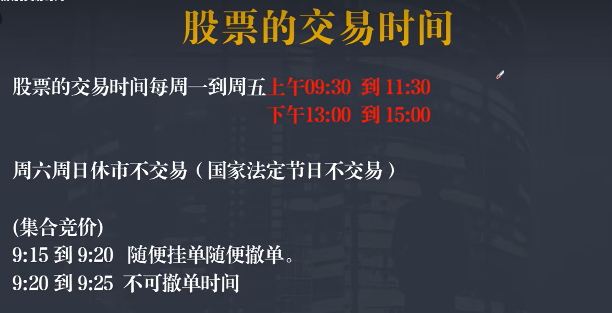
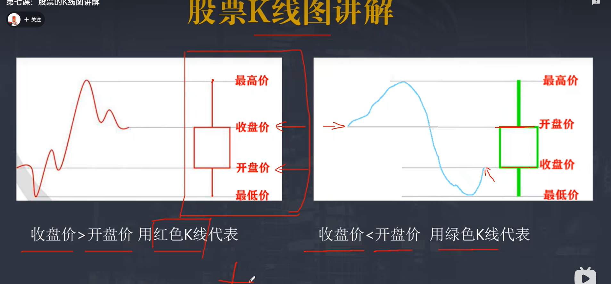
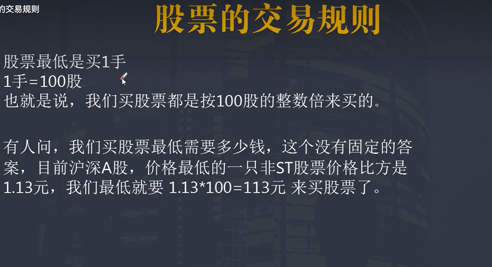
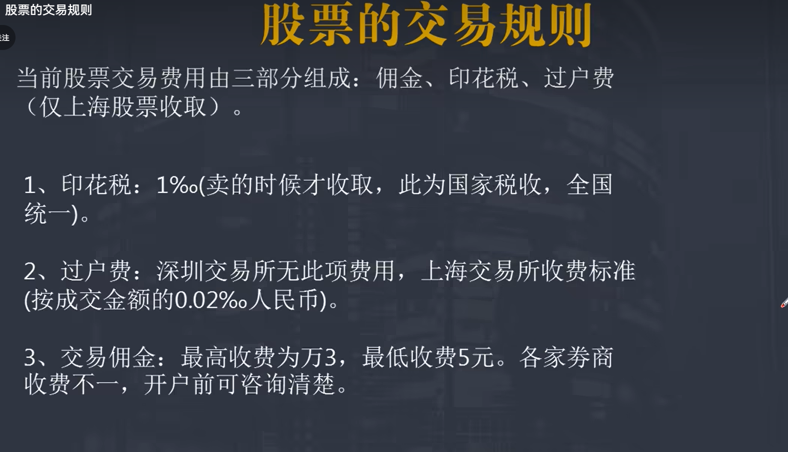

k线图怎么看

最上面是最高价,最下面是最低价   如果是红色,那么第二个是收盘价,第三个是开盘价, 如果是绿色 第二个是开盘价,第二个是收盘价

但是也有特殊情况,如果上面没有凸出来,那么最高价就是(红色代表收盘价,绿色代表开盘价),同理下面如果没有凸出去,那么最低价就是(红色代表开盘价,绿色代表收盘价)

交易的时候需要在这些地方交钱,一个是印花税 交易额的千分之一,只有卖出去的时候需要支付,一个是过户费(深圳交易所不用交,上海交易所需要十万分之二),交易佣金,不同的券商收费标准不同

> 建议选择知名的券商

